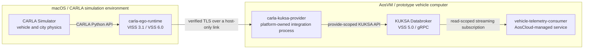

<!-- SPDX-FileCopyrightText: 2026 maninblack -->
<!-- SPDX-License-Identifier: MIT -->

# ADR 0005: Keep the CARLA Adapter Inside AosVM

- Status: Accepted for prototype planning
- Date: 2026-08-14

## Context

The prototype must demonstrate the same application boundary that a deployed
vehicle would expose: cloud-managed services consume a stable vehicle-data
interface and do not depend on CARLA, Unreal Engine, CAN frames, or a specific
OEM transport.

The qualified AosVM 6.1.0 Main Node already runs KUKSA Databroker 0.5.0 with a
VSS 5.0 tree. CARLA telemetry is exposed on the macOS host by the separate
`carla-ego-runtime` through VISS 3.1 and a VSS 6.0 signal tree. The selected
speed, acceleration, steering, accelerator, and brake paths are compatible
between those VSS versions.

The upstream AosEdge `kuksa-test-client` demonstrates the application-facing
half of the path: an Aos-managed service requests the `kuksa` resource,
resolves the in-VM Databroker as `Server`, verifies its TLS certificate, and
uses the KUKSA Python client and a JWT to read `Vehicle.Speed`. It does not
implement the CARLA-to-KUKSA provider, ARM64 packaging, streaming telemetry,
reconnection, or production credential management.

## Boundary

The boundary is the verified VISS connection between `carla-ego-runtime` on
macOS and `carla-kuksa-provider` inside AosVM. CARLA and
`carla-ego-runtime` are simulation infrastructure. The provider, Databroker,
and deployed consumer are on the prototype vehicle-computer side.

The provider is deliberately not embedded in CARLA and is not part of the
cloud-managed telemetry application. It is a platform-owned integration
process inside AosVM. This keeps the application contract independent of the
simulator.

In a real vehicle, the left side is replaced by ECUs, sensors, and vehicle
networks. A CAN, SOME/IP, DDS, or OEM-specific provider replaces
`carla-kuksa-provider`; KUKSA and the cloud-managed consumer retain the same
roles and VSS-facing interface.

## Decision

1. Use KUKSA Databroker as the canonical in-vehicle data interface for the
   prototype.
2. Keep the CARLA-to-KUKSA provider inside AosVM as a platform-owned process.
3. Give the provider no public listener. It initiates a verified TLS
   connection to the host-only CARLA VISS endpoint and publishes only the
   approved VSS paths to the local Databroker.
4. Make the first cloud-managed telemetry service subscribe only to KUKSA. It
   must not contain CARLA endpoints, CARLA protocol handling, or simulation
   signal names.
5. Treat the official `kuksa-test-client` as a connectivity and packaging
   reference, not as the final consumer implementation.

## Authorization Decision Follow-up

The qualification described by this ADR used separately issued, path-scoped
KUKSA JWTs because the baseline had no Aos IAM integration. That remains valid
historical evidence, but it is not the target architecture.

[ADR 0010](0010-aos-kuksa-credential-broker.md) supersedes the former AOS-5
standalone Authorization Adapter plan. Upstream KUKSA remains unchanged. The
Vehicle Data Platform Component instead owns a thin Aos–KUKSA Credential
Broker that validates a service instance's `AOS_SECRET` through Aos IAM and
maps only its currently registered, VDP-contract-compatible permissions into a
short-lived KUKSA JWT. Aos IAM retains the service identity/secret lifecycle;
no parallel per-service policy store is added. The privileged provider uses a
separately bound short-lived platform credential. No private signing key,
secret, or issued token may be committed to Git or printed in logs.

## Repository Ownership

- `carla-ego-runtime` owns the simulation-side VISS projection.
- `aos-vehicle-platform` owns `carla-kuksa-provider`, KUKSA platform
  integration, the vehicle-data contract, and the thin Aos–KUKSA Credential
  Broker plus provider platform-identity integration defined by ADR 0010.
- `brake-health-service` owns the cloud-managed consumer application and
  its Aos service package.
- `aosedge-sdv-demo` pins and qualifies an exact end-to-end
  combination but owns none of those component implementations.

The lifecycle-based repository decision and migration gate are defined by
[ADR 0006](0006-lifecycle-based-repository-ownership.md).

## Consequences

### Positive

- The deployed service uses the same interface in simulation and in a real
  vehicle.
- CARLA-specific translation is isolated from application code.
- A failed or restarted simulator does not require redeploying the consumer.
- Provider and consumer privileges can be separated at individual VSS paths.

### Costs and constraints

- A dedicated CARLA-to-KUKSA provider and a private host-to-guest path are
  required.
- The official demo service needs ARM64 and dependency-layer qualification.
- The historical prototype-token flow must be replaced by the ADR 0010
  Aos-IAM-derived credential flow before the target component is accepted.
- The provider must expose data age and failure state without replacing stale
  values with fabricated zeroes.

## References

- [AosEdge KUKSA test client](https://github.com/aosedge/demo-services/tree/main/kuksa-test-client)
- [Eclipse KUKSA Databroker](https://github.com/eclipse-kuksa/kuksa-databroker)
- [KUKSA authorization model at the pinned Databroker revision](https://github.com/eclipse-kuksa/kuksa-databroker/blob/30e5c13abc496d0b39aaa6c25acebb088b9902e3/doc/authorization.md)
- [AosEdge service configuration](https://docs.aosedge.tech/docs/reference/file-formats/service-config)
- [ADR 0006: lifecycle-based repository ownership](0006-lifecycle-based-repository-ownership.md)
- [ADR 0010: Aos–KUKSA Credential Broker](0010-aos-kuksa-credential-broker.md)
