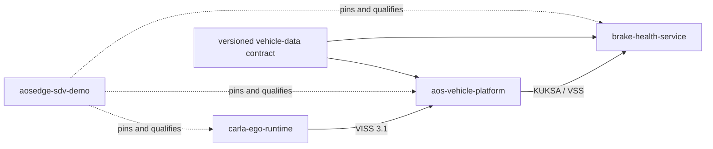

<!-- SPDX-FileCopyrightText: 2026 maninblack -->
<!-- SPDX-License-Identifier: MIT -->

# ADR 0006: Separate Platform and Service Repositories by Lifecycle

- Status: Accepted and implemented
- Date: 2026-08-14
- Supersedes: the single-integration-repository portion of ADR 0001

## Context

The CARLA-to-AosEdge prototype now contains components with materially
different owners, qualification requirements, update channels, and expected
lifetimes.

Vehicle platform components are selected and integrated as part of a vehicle
program. They may be updated after start of production (SOP), but only through
an OEM-controlled platform or FOTA lifecycle with system-level qualification.
Examples are the Vehicle Data Provider, KUKSA configuration and trust setup,
the removable current-release KUKSA authorization helper, and Provider
platform-identity integration. Proposed ADR 0013 separates that helper's
factory/system package from the Vehicle Data Platform FOTA artifact while
retaining common OEM Platform Team repository ownership.

Cloud-managed services are applications deployed on top of that platform.
They can be developed, replaced, rolled back, and updated through the Aos
service/SOTA lifecycle, including after SOP, as long as they remain compatible
with the platform's published vehicle-data contract.

The original ADR 0001 intentionally kept provider, adapter, service, and
integration work together during the initial proof of concept. It also defined
the split trigger: an independent release cadence or a reusable public API.
Both conditions now exist.

## Decision

Use the following repository boundaries:

| Repository | Role | Ships to vehicle | Primary lifecycle |
| --- | --- | --- | --- |
| `alexmaninblack/carla` | Public CARLA fork and upstream candidates | No, simulation only | Upstream/simulation |
| `alexmaninblack/UnrealEngine` | Restricted engine compatibility changes | No, simulation only | Restricted upstream |
| `alexmaninblack/carla-ego-runtime` | CARLA ego control and VISS 3.1 projection | No, simulation only | Simulation tooling |
| `alexmaninblack/aos-vehicle-platform` | Vehicle-data platform integration | Yes, except development-only providers | OEM platform/FOTA |
| `alexmaninblack/brake-health-service` | Independently deployed Brake Health application | Yes | Aos service/SOTA |
| `alexmaninblack/aosedge-sdv-demo` | VM lifecycle, provisioning, version lock, end-to-end qualification, and demo documentation | No | Solution/demo baseline |

Do not create one repository per executable. Repository boundaries follow
ownership and release policy. Components that share platform ownership and
qualification stay together until they develop genuinely independent
maintainers or release cadences.

## Repository Responsibilities

### `aos-vehicle-platform`

This repository owns vehicle-computer integration:

```text
aos-vehicle-platform/
├── authorization/
│   └── kuksa-current-release-compatibility/
├── config/
│   └── kuksa/
├── contracts/
│   └── vehicle-telemetry-profile/
├── packaging/
│   └── fota/
├── providers/
│   └── carla-viss-kuksa/
├── tests/
└── docs/
```

It will contain:

- the platform-owned CARLA VISS-to-KUKSA provider used by the prototype;
- the versioned vehicle-data contract;
- non-secret KUKSA and platform configuration;
- system-level packaging and lifecycle definitions;
- provider conformance and integration tests;
- the separately packaged removable current-release KUKSA authorization
  helper, the still-open Provider platform-identity integration, and their
  negative-test evidence as proposed by ADR 0013.

The CARLA provider is development-only, but it implements the same platform
role that CAN, SOME/IP, DDS, or OEM-specific providers perform in a production
vehicle. It belongs under `providers/` because its ownership and execution
boundary are platform-side. A production build profile must be able to exclude
it completely.

Private signing keys, access tokens, provisioned identities, production
certificates, and vehicle-specific configuration are never stored in this
repository.

### `brake-health-service`

This repository owns the independently deployable application:

```text
brake-health-service/
├── config/
├── packaging/
│   └── aos/
├── src/
├── tests/
└── docs/
```

The service consumes only the published KUKSA/VSS contract. It must not import
CARLA libraries, contain a CARLA or VISS endpoint, understand CAN or SOME/IP,
or depend on the implementation layout of `aos-vehicle-platform`.

Its repository owns the Aos service manifest, service tests, resource limits,
rollback-compatible release metadata, and the application behavior built from
telemetry. Its releases may advance independently of the vehicle platform
within the declared compatibility range.

### `aosedge-sdv-demo`

This repository remains the reproducible system integration and demonstration
workspace. It owns:

- the Apple Silicon AosVM launcher and lifecycle;
- provisioning and cloud qualification runbooks;
- non-secret environment configuration;
- exact component version and artifact-digest locks;
- end-to-end tests across CARLA, the platform, AosVM, and the service;
- architecture decisions and sanitized acceptance evidence.

It does not own provider, credential-broker, provider-identity, or
telemetry-service source.
It may contain test fixtures and orchestration code, but must consume released
component artifacts or explicitly pinned sibling checkouts.

## Vehicle-Data Contract

The platform repository owns the first version of the vehicle-data contract.
The contract is a versioned, machine-readable artifact that defines at least:

- VSS path, version, type, and unit;
- expected update rate and freshness timeout;
- valid range and unavailable/stale behavior;
- provider and consumer permission requirements;
- KUKSA API compatibility;
- compatibility and deprecation policy.

Provider and service implementations must not maintain independent copies of
the signal contract. The service declares a compatible contract range; the
integration lock selects one exact contract version and digest for a tested
system baseline.

If the contract later acquires independent cross-team or supplier governance,
it can be promoted to a separate `vehicle-data-contracts` repository. Creating
that repository for the first provider and first service would add coordination
without an independent owner, so it is deferred.

## Dependency Direction



The service never depends on the provider implementation. The platform never
depends on the service. Only the integration repository knows and qualifies
the complete graph.

## License and Copyright Policy

License both new repositories under Apache-2.0. Use the exact copyright holder
text `maninblack` for original files and the standard SPDX tags defined by the
project licensing policy.

This choice aligns new platform and service work with AosCore and KUKSA without
claiming that their licenses require it. Apache-2.0 supplies an explicit patent
grant and a consistent contribution model for the platform-facing provider,
credential broker and independently developed service.

Existing MIT-licensed project repositories retain their current licenses. All
third-party files retain their own copyright and license terms; in particular,
copied or derived COVESA VSS material remains subject to MPL-2.0. Public source
without an applicable license is a reference only and must not be copied.

Detailed rules:
[licensing and copyright policy](../../governance/licensing-and-copyright-policy.md).

## Version and Release Policy

- Platform releases use semantic versions and identify their supported VSS,
  KUKSA API, contract, AosVM, and architecture versions. Breaking contract or
  authorization changes require a platform major version.
- Service releases use semantic versions plus Aos package versions and declare
  the supported vehicle-data contract range. A service release must be
  independently deployable and rollbackable.
- Integration releases pin exact Git commits, published versions, and artifact
  digests in a tracked lock file. They represent tested demonstrations, not a
  vehicle update artifact.
- No Git submodules are used. Local development may use sibling checkouts;
  reproducible runs use the tracked lock and verified artifacts.
- Platform branches may later follow a vehicle-program release line. Service
  development remains trunk-oriented unless a supported production service
  version requires a maintenance branch.

## Update Channels and Gates

- Vehicle Data Provider, KUKSA platform configuration, the separately packaged
  current-release authorization helper, and Provider platform-identity changes
  follow OEM Platform Team qualification even though the VDP FOTA and
  factory/system-integration artifacts retain different replacement and
  retirement paths.
- Telemetry consumer changes follow the Aos service/SOTA path and cannot
  silently expand platform permissions or require an image modification.
- A breaking platform contract change cannot reach an accepted integration
  baseline until a compatible service is qualified or the previous contract
  remains available during migration.
- ADR 0010 replaced the former standalone AOS-5 Authorization Adapter plan for
  the 1.3/1.4 baseline. Proposed ADR 0013 corrects the later component
  placement: the current helper is a removable factory/system package outside
  the VDP FOTA payload, while the first-demo Provider path is explicitly
  trusted OEM platform integration rather than a dynamic authorization gate.
  Aos IAM remains authoritative for SOTA instance identity and registered
  permissions; their absence does not justify moving a parallel identity/policy
  store or reusable KUKSA credentials into a functional Service.

## Migration Result

The platform and service repositories are public and independently validated.
Provider source, the vehicle-data contract, FOTA packaging, and Yocto
integration now live in `aos-vehicle-platform`; the service scaffold lives in
`brake-health-service`. This integration repository retains only locks,
orchestration, qualification, and sanitized documentation. Completed migration
plans and fresh-clone evidence remain available through Git history.

## Consequences

### Positive

- Repository ownership matches vehicle-program platform and independently
  deployed service lifecycles without assuming that platform updates stop at
  SOP.
- The service can evolve independently without importing simulation or system
  integration code.
- Platform changes receive the stronger qualification appropriate to vehicle
  data and authorization.
- The integration repository can pin reproducible combinations without
  becoming the source repository for every component.

### Costs and constraints

- Cross-repository changes require an explicit contract and coordinated test
  baseline.
- CI, releases, vulnerability handling, and dependency updates must be
  maintained for two additional repositories.
- A version lock and compatibility policy become mandatory rather than
  informal documentation.

## References

- [ADR 0001: initial repository and artifact boundaries](0001-repository-and-artifact-boundaries.md)
- [ADR 0005: KUKSA vehicle-data boundary](0005-kuksa-vehicle-data-boundary.md)
- [ADR 0010: Aos–KUKSA Credential Broker](0010-aos-kuksa-credential-broker.md)
- [ADR 0013: Current-release KUKSA authorization compatibility](0013-current-release-kuksa-authorization-compatibility.md)
- [Licensing and copyright policy](../../governance/licensing-and-copyright-policy.md)
