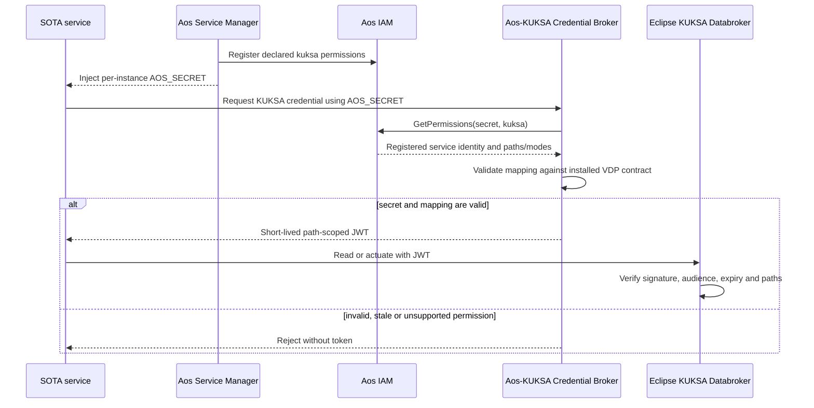

<!-- SPDX-FileCopyrightText: 2026 maninblack -->
<!-- SPDX-License-Identifier: MIT -->

# ADR 0010: Derive KUKSA Credentials from Aos IAM Without Forking KUKSA

- Status: Accepted historical baseline for HLA 1.3/1.4; proposed supersession
  by [ADR 0013](0013-current-release-kuksa-authorization-compatibility.md)
- Date: 2026-08-18
- Amended: 2026-08-19
- Supersedes: the future standalone Authorization Adapter and static-token
  target described by ADR 0005 and ADR 0006

## Context

> Historical note: the mapping in item 7 below is not current implementation
> authority. D4-027.4 supersedes it with non-widening `r -> read`,
> `rw -> actuate`, and rejection of `w` because pinned KUKSA actuation already
> includes read.

Eclipse KUKSA Databroker is an externally supplied platform dependency. The
pinned release validates JWTs with a configured public key; it does not expose
an Aos IAM provider plug-in interface. Forking KUKSA or replacing its
authorization implementation would create an unnecessary project-owned
variant and a difficult upgrade boundary.

Aos Service Manager already registers a service's declared functional-server
permissions with Aos IAM and supplies an opaque, per-instance `AOS_SECRET` to
the running service. Aos IAM owns that secret and permission lifecycle; the
project must not reproduce it in a second identity store. The missing
integration boundary is therefore narrow credential translation: authenticate
the running Aos service instance through IAM, translate the registered KUKSA
permissions into the token model understood by the unchanged KUKSA verifier,
and issue a short-lived credential.

## Decision

1. Keep upstream Eclipse KUKSA Databroker unchanged.
2. Name the FOTA-delivered platform artifact **Vehicle Data Platform
   Component**. The functional capability it provides may still be described
   as a vehicle-data capability, but `Component` is the canonical architecture
   and lifecycle name.
3. Implement the **Aos–KUKSA Credential Broker** as a thin internal
   responsibility of `CMP-VDP`, not as a separate identity provider, SOTA
   service, or standalone logical component.
4. Deliver and qualify the broker, KUKSA contract/configuration,
   inbound/outbound providers, and signal validation together through the
   Platform Team's OEM FOTA lifecycle. Do not create a project-owned
   per-service credential database or duplicate the Aos IAM permission
   lifecycle.
5. Let each SOTA service declare its requested KUKSA paths and `r`, `w`, or
   `rw` modes in Aos service metadata under the `kuksa` functional-server
   entry. Service Manager registers those permissions and injects a
   per-instance `AOS_SECRET`.
6. The service presents `AOS_SECRET` to the local broker. The broker calls Aos
   IAM `GetPermissions(secret, "kuksa")` and accepts only the authenticated,
   currently registered permissions returned by IAM. It shall reject an
   invalid secret, unknown mode, malformed path, or permission outside the
   versioned KUKSA contract exposed by the installed VDP release.
7. On success, issue a short-lived, path-scoped KUKSA JWT. Map `r` to KUKSA
   `read`, `w` to KUKSA `actuate`, and `rw` to both. Never widen or silently
   rewrite the IAM-returned permission set.
8. Do not implement a second local per-service OEM allowlist in the broker.
   Service metadata is published through the Service Provider lifecycle and
   deployment to OEM Units is explicitly authorized with an OEM identity. A
   future native AosCloud permission-admission feature may add an independent
   pre-transfer upper bound when it becomes available and is qualified.
9. Use a separate short-lived platform credential for the privileged Vehicle
   Data Provider's KUKSA `provide`/`create` rights. The exact FOTA-component
   identity binding is a design and qualification gate because the provider is
   not a SOTA instance and does not automatically receive `AOS_SECRET`. A
   functional SOTA credential must never grant provider authority.
10. Configure KUKSA to trust only the Unit's public verifier. As frozen by
    D4-010.1, the Factory Image contains the dedicated non-secret `kuksa-jwt`
    certificate-module/PKCS#11 and verifier-preparation wiring, but no signing
    key or shared verifier. Provisioning creates one non-exported RSA signer;
    only its verifier is installed before Broker/KUKSA startup. The broker
    signs `RS256` directly through PKCS#11. The pinned KUKSA enforces
    signature, audience `kuksa.val`, expiry and path permissions, but is not
    claimed to enforce `iss`.
11. Keep token lifetime short and refresh while the Aos service identity
    remains valid. Service removal or permission unregistration prevents
    renewal; the residual authorization window is bounded by token expiry.
    The first demo performs no live key rotation: the next provisioning
    lifecycle creates a new signer, and R0 overlay destruction retires the old
    key after Cloud reconciliation.
12. Treat Cloud-side rejection of incompatible service permissions before
    Unit transfer as a future native AosCloud admission feature. In the
    current platform, the authoritative runtime permissions are those
    registered by Service Manager and returned by Aos IAM, while the broker is
    the fail-closed translation point into KUKSA. The demo must not claim
    independent pre-deployment Cloud policy rejection until a released API
    supports and qualifies it.

## Credential Flow

## Consequences

- KUKSA remains an upgradeable external dependency rather than a project
  fork.
- Aos IAM and Service Manager remain the source of runtime service identity,
  instance secrets and registered permissions; the project does not create a
  parallel identity or per-service policy database.
- Functional services can be delivered independently by SOTA, but cannot
  receive KUKSA authority beyond their currently registered metadata and the
  installed VDP contract. OEM review and deployment authorization remain
  explicit lifecycle decisions.
- The broker is a platform security boundary and requires key protection,
  local authenticated transport, expiry/refresh handling, audit-safe logs,
  negative tests, and fail-closed startup/readiness behavior.
- Existing example or manually issued tokens remain historical qualification
  fixtures only. They are not the target demo or production architecture.

## Repository Ownership

- `aos-vehicle-platform` owns the thin broker, KUKSA trust configuration,
  platform-component credential integration, component packaging, tests, and
  qualification evidence.
- each functional service repository owns only its requested `kuksa`
  permissions and the client-side credential refresh behavior;
- `aosedge-sdv-demo` pins and qualifies the complete graph but owns neither
  the broker nor the Aos identity/permission lifecycle.

## References

- [ADR 0005: KUKSA vehicle-data boundary](0005-kuksa-vehicle-data-boundary.md)
- [ADR 0006: lifecycle-based repository ownership](0006-lifecycle-based-repository-ownership.md)
- [AosEdge service configuration](https://docs.aosedge.tech/docs/reference/file-formats/service-config)
- [Eclipse KUKSA Databroker authorization](https://github.com/eclipse-kuksa/kuksa-databroker/blob/30e5c13abc496d0b39aaa6c25acebb088b9902e3/doc/authorization.md)
