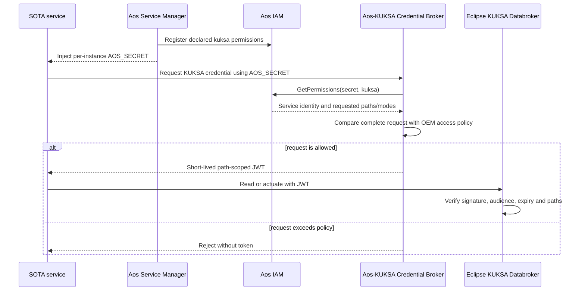

<!-- SPDX-FileCopyrightText: 2026 maninblack -->
<!-- SPDX-License-Identifier: MIT -->

# ADR 0010: Derive KUKSA Credentials from Aos IAM Without Forking KUKSA

- Status: Accepted for architecture and requirements
- Date: 2026-08-18
- Supersedes: the future standalone Authorization Adapter and static-token
  target described by ADR 0005 and ADR 0006

## Context

Eclipse KUKSA Databroker is an externally supplied platform dependency. The
pinned release validates JWTs with a configured public key; it does not expose
an Aos IAM provider plug-in interface. Forking KUKSA or replacing its
authorization implementation would create an unnecessary project-owned
variant and a difficult upgrade boundary.

Aos Service Manager already registers a service's declared functional-server
permissions with Aos IAM and supplies an opaque `AOS_SECRET` to the running
service instance. The missing integration boundary is therefore credential
translation: authenticate that running Aos service instance, constrain its
requested KUKSA paths against OEM policy, and issue a credential that the
unchanged KUKSA verifier already understands.

## Decision

1. Keep upstream Eclipse KUKSA Databroker unchanged.
2. Name the FOTA-delivered platform artifact **Vehicle Data Platform
   Component**. The functional capability it provides may still be described
   as a vehicle-data capability, but `Component` is the canonical architecture
   and lifecycle name.
3. Implement the **Aos–KUKSA Credential Broker** and the versioned **OEM KUKSA
   access policy** as internal responsibilities of `CMP-VDP`, not as a
   separate SOTA service or standalone logical component.
4. Deliver and qualify the broker, policy, KUKSA contract/configuration,
   inbound/outbound providers, and signal validation together through the
   Platform Team's OEM FOTA lifecycle.
5. Let each SOTA service declare its requested KUKSA paths and `r`, `w`, or
   `rw` modes in Aos service metadata under the `kuksa` functional-server
   entry. Service Manager registers those permissions and injects a
   per-instance `AOS_SECRET`.
6. The service presents `AOS_SECRET` to the local broker. The broker calls Aos
   IAM `GetPermissions(secret, "kuksa")`, obtains the authenticated service
   instance and requested permissions, and compares the entire request with
   the OEM policy for that service identity.
7. Reject the entire request when the secret is invalid, the identity is not
   allowed, or any path/mode exceeds OEM policy. On success, issue a
   short-lived, path-scoped KUKSA JWT. Map `r` to KUKSA `read`, `w` to KUKSA
   `actuate`, and `rw` to both. Never silently trim an excessive request.
8. Use a separate platform credential for the privileged Vehicle Data
   Provider's KUKSA `provide`/`create` rights. A SOTA service credential must
   never grant provider authority.
9. Configure KUKSA to trust only the broker's public verifier. Protect the
   signing key as platform state; never place it, `AOS_SECRET`, or issued JWTs
   in Git, FOTA/SOTA payloads, command lines, or logs.
10. Keep token lifetime short and refresh while the Aos service identity
    remains valid. Service removal or permission unregistration prevents
    renewal; the residual authorization window is bounded by token expiry.
11. Treat Cloud-side rejection of incompatible service permissions before
    Unit transfer as a future native AosCloud admission feature. In the
    current platform, the authoritative fail-closed enforcement point is the
    local credential exchange. The demo must not claim pre-deployment Cloud
    rejection until a released API supports and qualifies it.

## Credential Flow

## Consequences

- KUKSA remains an upgradeable external dependency rather than a project
  fork.
- Aos identity and service metadata become the source of runtime identity and
  requested permissions; OEM FOTA policy remains the independent upper bound.
- Functional services can be delivered independently by SOTA, but cannot
  expand their vehicle-data authority by changing their own metadata.
- The broker is a platform security boundary and requires key protection,
  local authenticated transport, expiry/refresh handling, audit-safe logs,
  negative tests, and fail-closed startup/readiness behavior.
- Existing example or manually issued tokens remain historical qualification
  fixtures only. They are not the target demo or production architecture.

## Repository Ownership

- `aos-vehicle-platform` owns the broker, OEM policy schema/data, KUKSA trust
  configuration, component packaging, tests, and qualification evidence.
- each functional service repository owns only its requested `kuksa`
  permissions and the client-side credential refresh behavior;
- `aosedge-sdv-demo` pins and qualifies the complete graph but owns neither
  the broker nor service authorization policy.

## References

- [ADR 0005: KUKSA vehicle-data boundary](0005-kuksa-vehicle-data-boundary.md)
- [ADR 0006: lifecycle-based repository ownership](0006-lifecycle-based-repository-ownership.md)
- [AosEdge service configuration](https://docs.aosedge.tech/docs/reference/file-formats/service-config)
- [Eclipse KUKSA Databroker authorization](https://github.com/eclipse-kuksa/kuksa-databroker/blob/30e5c13abc496d0b39aaa6c25acebb088b9902e3/doc/authorization.md)
