<!-- SPDX-FileCopyrightText: 2026 maninblack -->
<!-- SPDX-License-Identifier: MIT -->

# Demo Scenario Architecture Flows 1.0

- Status: Review candidate
- Version: 1.0
- Prepared: 2026-08-17
- Owner: System Architecture
- Replaces: superseded Scenario 1.0 mapping draft `0.1`
- Architecture input: [High-Level Architecture 1.1](high-level-architecture.md)
- Scenario input: [Staged Post-SOP Brake Health Demo Scenarios 1.1](../demo/staged-post-sop-brake-health-demo-scenarios.md)
- CARLA input: [R10 Native CARLA Vehicle Telemetry Inventory](../research/demo-foundation/r10-carla-telemetry-and-function-team-2.md)
- Requirements input: [System Requirements and Traceability 0.1](../requirements/system-requirements-and-traceability.md)
- Component input: [Component Decomposition and Interface Register 0.1](../requirements/component-decomposition-and-interface-register.md)
- Implementation, build, signing, Cloud, or Unit mutation authorized: no

## Purpose

This document is the traceability bridge between the static capability model
in High-Level Architecture 1.1, the audience-visible Demo Scenario 1.1, and the
next component-requirements package.

It defines how software, data, decisions, evidence, and ownership move through
the architecture during:

```text
M0 manufacturing
  -> M1 end-of-line provisioning
  -> G0 provisioned SOP substrate
  -> G1 Vehicle Data Platform Capability v1
  -> G2 Brake Health Service v1
  -> G3 Capability v2 + predictive Service v2
  -> G4 bidirectional Capability v3 + Service v3
  -> R0 retirement of the current demo run
```

The old `0.1` document began at `G0`, omitted manufacturing and provisioning,
and proposed returning from `G4` to `G0` while preserving the same Unit
identities. That model is superseded. The accepted next-run reset retires the
two current Units and discards their provisioned overlays; it is not a reverse
OTA rollout.

## Source Precedence and Change Control

When the inputs differ, use this order:

1. High-Level Architecture 1.1 owns component boundaries, interfaces,
   authority, security boundaries, and architectural invariants.
2. Demo Scenario 1.1 owns stage order, component presence, audience-visible
   proof, and the manufacturing-to-retirement narrative.
3. This document owns detailed cross-component flow mapping and exposes gaps;
   it does not silently change either source.
4. R10 owns the current inventory of native CARLA data and records the
   Vehicle Stability / Low-Friction Event Uploader candidate.

A contradiction found here must be resolved in the owning source before it
becomes a requirement.

## Flow Identifier Convention

| Suffix | Flow type | Question answered |
| --- | --- | --- |
| `LC` | Lifecycle | How is an image, Unit, FOTA capability, or SOTA service created, validated, accepted, promoted, or retired? |
| `RT` | Runtime | How do vehicle data, local decisions, reports, or actuator requests move? |
| `OB` | Observability | Which authoritative system and audience surface prove the state? |
| `FR` | Failure and recovery | Which layer contains a failure, and how can operation recover without widening authority? |

Stage flow identifiers use `AF-<stage>-<type>`, for example `AF-G3-LC`.
Cross-stage flows use `AF-X-<name>` and the independent Function Team 2
candidate uses `AF-FT2-<type>`.

## Architecture Role Catalogue

| ID | Architecture role | Owner | Current or target state |
| --- | --- | --- | --- |
| `CARLA` | Virtual physical vehicle, environment, native sensors, and actuators | CARLA repositories | Current |
| `SCENE` | Deterministic obstacle/braking scenario, manual takeover, safe stop, actor cleanup | `carla-ego-runtime` tooling | Current for the Brake Event scenario; low-friction extension not yet qualified |
| `CONTROL` | Vehicle Control UI and separate control channel | `carla-ego-runtime` | Current |
| `GATEWAY` | Vehicle Gateway ECU behavior, CARLA sampling, VSS normalization | `carla-ego-runtime` | Current |
| `VISS` | TLS VISS 3.1 server | `carla-ego-runtime` | Get/Subscribe current; narrowly scoped Set target |
| `GW-ADV` | Brake Health advisory handler and factual Gateway status | `carla-ego-runtime` | Target |
| `ENG-DASH` | Engineering Telematics Dashboard | `carla-ego-runtime` | Vehicle telemetry current; advisory/status extension target |
| `FACTORY` | Immutable OEM Demo Factory Image | Platform Team | Target acceptance artifact; no clean accepted image yet |
| `RUNTIME` | Preinstalled provider-specific empty-slot component runtime | Platform Team / `aos-vehicle-platform` | Engineering evidence exists; final factory-image qualification remains open |
| `AOS-CORE` | Identity, desired state, Service Manager, security, update support | AosCore in AosVM | Current on existing provisioned Units |
| `KUKSA` | Stable service-facing vehicle-data boundary in the Domain Controller | SOP substrate plus Platform Team contract | Executable present; final shared contract and authorization remain design gates |
| `VU` | Validation Unit, a fresh Domain Controller instance | Demo lifecycle | Target per-run role |
| `DU` | Demonstration Unit, a separate fresh Domain Controller instance | Demo lifecycle | Target per-run role |
| `VDP` | Vehicle Data Platform Capability payload, inbound/outbound providers and versioned contract | Platform Team, FOTA lifecycle | Inbound engineering candidate exists; accepted v1-v3 graph is target |
| `BHS` | Brake Health service and versioned local model | Function Team 1 / Service Provider 1, SOTA 1 | Service scaffold exists; accepted v1-v3 behavior is target |
| `EVENT` | Vehicle Stability / Low-Friction Event Uploader candidate | Function Team 2 / Service Provider 2, SOTA 2 | Selected candidate; detailed design and implementation are target |
| `BRAKE-BE` | Brake Health functional backend | Function Team 1 | Target |
| `BRAKE-DASH` | Brake Health Function Dashboard | Function Team 1 | Target |
| `EVENT-BE` | Function Team 2 event backend | Function Team 2 | Target |
| `EVENT-DASH` | Event-Based Data Dashboard | Function Team 2 | Target |
| `AOS-CLOUD` | Provisioning and authoritative FOTA/SOTA desired/actual state | AosCloud | Current platform; exact demo operations require qualification |
| `SW-DASH` | Simplified OEM Software Delivery Dashboard over AosCloud APIs | Demo solution | Target |
| `LOG-PIPE` | AosEdge system/service log collection and Cloud delivery | AosCore/AosCloud integration | Platform mechanisms exist; demo route unqualified |
| `ELK` | Vehicle and Service Log View | OEM operational environment | Target integration |
| `ORCH` | Demo-session, overlay, Unit binding, replay, and retirement orchestration | `aosedge-sdv-demo` | Target |

The catalogue distinguishes an implemented component from an accepted demo
capability. Existing provisioned VMs, signed candidates, and local build
artifacts are engineering evidence; they do not substitute for the clean
manufacturing and deployment sequence described here.

## State and Presence Model

```mermaid
flowchart LR
    M0["M0<br/>two unprovisioned factory overlays"]
    M1["M1<br/>two unique Online Units"]
    G0["G0<br/>SOP substrate; empty capability slot"]
    G1["G1<br/>Provider v1"]
    G2["G2<br/>Provider v1 + Brake Health v1"]
    G3["G3<br/>Provider v2 + Brake Health v2"]
    G4["G4<br/>Provider v3 + Brake Health v3"]
    R0["R0<br/>Units retired; overlays discarded"]

    M0 -->|"provision once"| M1 --> G0
    G0 -->|"FOTA v1"| G1
    G1 -->|"SOTA 1 v1"| G2
    G2 -->|"FOTA v2, then SOTA 1 v2"| G3
    G3 -->|"FOTA v3, then SOTA 1 v3"| G4
    G4 -->|"retire current run"| R0
```

| State | Unit identity | Vehicle Data Platform payload | Brake Health service | Outbound advisory | Function Team 2 service |
| --- | --- | --- | --- | --- | --- |
| `M0/F0` | None in Cloud | Absent; runtime slot empty | Absent | Absent | Absent |
| `M1/G0` | Unique VU and DU identities | Absent; runtime slot empty | Absent | Absent | Absent |
| `G1` | Unchanged | Provider v1 | Absent | Absent | Absent |
| `G2` | Unchanged | Provider v1 | Service v1 | Absent | Absent |
| `G3` | Unchanged | Backward-compatible Provider v2 | Service v2 + model | Absent | Absent |
| `G4` | Unchanged | Provider v3 inbound + allowlisted outbound | Service v3 | Present | Absent in Scenario 1.1 |
| `R0` | Retired and unable to reconnect | Overlay discarded | Overlay/backend session state retired | Not applicable | Not applicable |

Function Team 2 is an independent extension flow defined later in this
document. It is not inserted into `G0–G4` until a later scenario revision
accepts its exact placement.

## Cross-Stage Invariants

All flows below preserve these rules:

1. CARLA is the virtual physical vehicle, the Vehicle Gateway is a separate
   ECU boundary, and each AosVM is a Domain Controller ECU boundary.
2. Functional services use KUKSA only; they never connect directly to CARLA or
   VISS.
3. Vehicle control is separate from vehicle telemetry and unavailable to both
   functional services.
4. VU always receives and qualifies a candidate before the same accepted bytes
   and digest are promoted to DU.
5. Provider updates use FOTA; Brake Health and Event Uploader updates use their
   independent SOTA lifecycles.
6. A SOTA service declares a compatible Vehicle Data Platform Capability and
   does not install when that dependency is unmet.
7. Local analysis continues without Cloud connectivity; functional Cloud
   delivery is asynchronous and bounded.
8. AosCloud is lifecycle authority, not a functional telemetry backend.
9. ELK is operational evidence, not vehicle telemetry or functional product
   data.
10. Engineering Dashboard evidence proves the Gateway view only; it does not
    prove KUKSA, a functional backend, or driver display.
11. No artifact contains a reusable Unit identity, private credential, or
    per-vehicle secret.
12. Normal presentation moves forward. Rollback is qualification evidence and
    recovery behavior, not the normal reset mechanism.
13. Native Cloud rejection of an incompatible SOTA-to-FOTA graph is a target
    capability deferred until a supporting AosEdge release is qualified. No
    temporary project-side admission controller substitutes for it.

## M0 — Manufacturing Output

<a id="af-m0-lc"></a>
### `AF-M0-LC` — Factory-image and overlay creation

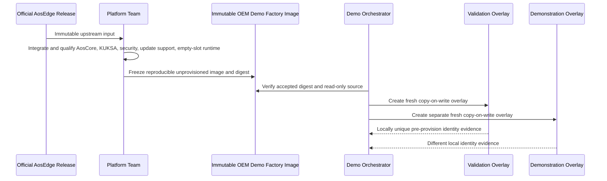

The factory image contains the provider-specific runtime and an empty component
store, but no provider payload, SOTA service, Cloud Unit, Cloud certificate,
KUKSA service token, or other reusable vehicle identity.

<a id="af-m0-ob"></a>
### `AF-M0-OB` — Manufacturing evidence

| Evidence owner | Audience proof |
| --- | --- |
| Factory artifact manifest | Source release, OEM image version, immutable digest, architecture, and qualification reference |
| Local overlay inventory | Exactly two fresh overlays with Validation and Demonstration roles |
| Identity preflight | Different system, Node-seed, SSH, hostname/network, and first-boot identity material as applicable |
| Software Delivery Dashboard | Both instances show `Manufactured / Awaiting provisioning`; no Cloud Unit ID exists |
| Component inventory | Empty provider store and no functional service payload |

<a id="af-m0-fr"></a>
### `AF-M0-FR` — Failure containment

- A digest mismatch blocks overlay creation.
- A non-empty provider store or embedded Cloud credential rejects the factory
  image.
- Duplicate local identity material rejects both overlays before provisioning.
- A failed overlay creation is discarded; the immutable factory image is never
  repaired in place.
- Existing provisioned demo VMs must not be relabelled as new manufacturing
  output.

### M0 requirement inputs

- Freeze the exact accepted factory-image recipe and digest.
- Define first-boot identity generation and duplicate-detection evidence.
- Prove the provider-specific runtime is healthy with an empty slot.
- Define overlay storage, naming, locking, and recoverable cleanup.

## M1 — End-of-Line Provisioning

<a id="af-m1-lc"></a>
### `AF-M1-LC` — Provisioning and lane assignment

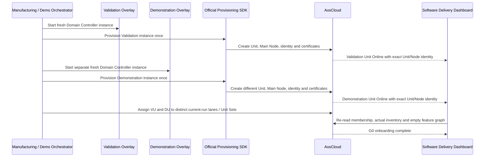

Provisioning is a once-per-overlay identity operation. VU and DU retain their
identities throughout `G0–G4`; no FOTA or SOTA step reprovisions them.

<a id="af-m1-ob"></a>
### `AF-M1-OB` — Provisioning evidence

| Surface | Required evidence |
| --- | --- |
| Software Delivery Dashboard | Session start, local role, Unit ID, Main Node ID, lane/Unit Set, Online state, and empty feature graph |
| AosCloud drill-down | Authoritative Unit/Node identity, actual state, platform/runtime inventory, and current membership |
| Local VM evidence | Overlay-to-Unit binding and distinct certificates/SSH host identities without exposing secrets |
| Audience state | Two visibly separate lanes: Validation and Demonstration |

Before M1 the session is correlated by start time and local overlay roles.
After M1 it is bound to the two Unit IDs and the same time window.

<a id="af-m1-fr"></a>
### `AF-M1-FR` — Fail-closed provisioning

- After the SDK begins, an uncertain or partial result is preserved for
  reconciliation; it is never blindly retried.
- A Unit whose role or Unit Set cannot be proven is not eligible for an update.
- Duplicate identity or certificate evidence blocks both Units.
- One successful Unit and one failed Unit do not constitute a complete M1.
- Cleanup of a failed disposable attempt follows the separately qualified
  deprovision/delete flow; local overlay deletion alone is insufficient.

### M1 requirement inputs

- Qualify provisioning success, partial failure, timeout, and reconciliation.
- Prove unique identities for two fresh overlays.
- Define exact lane/Unit Set creation and membership checks.
- Measure duration and define an honest presentation mode.

## G0 — Provisioned SOP Substrate Without Feature Payloads

<a id="af-g0-rt"></a>
### `AF-G0-RT` — Working vehicle, empty Domain Controller feature graph

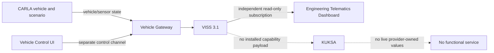

The vehicle is healthy and visibly operational. The Domain Controller is
online and update-ready, but the provider slot is empty. Absence of vehicle
data in KUKSA is a deliberate accepted state, not a platform fault.

<a id="af-g0-ob"></a>
### `AF-G0-OB` — Baseline proof

| Surface | Required evidence |
| --- | --- |
| CARLA scene | Vehicle drives in the city; manual/autopilot handover and safe stop remain available |
| Engineering Telematics Dashboard | Live Gateway telemetry independent of the Domain Controller |
| Software Delivery Dashboard | Both Units online, runtime present, provider/service payloads absent |
| KUKSA qualification probe | No live provider-owned values; no fabricated zeros |
| Functional dashboards | Explicit `feature not deployed`, not a transport error |

<a id="af-g0-fr"></a>
### `AF-G0-FR` — Baseline failure boundaries

- Vehicle-control failure invokes the existing Gateway safe-stop behavior and
  does not mutate either Unit.
- Gateway/VISS failure is visible as source loss; it does not make the empty
  provider slot unhealthy.
- AosCloud connectivity loss does not stop CARLA, the Gateway, or direct
  Engineering Dashboard telemetry.
- An unexpected provider or service blocks the demo because `G0` is no longer
  clean.

### G0 requirement inputs

- Define non-invasive proof of the empty provider slot and empty functional
  graph on both Units.
- Define how the one visible CARLA/Gateway source is bound to the selected Unit
  or deterministically replayed without implying two simultaneous vehicles.
- Implement the Software Delivery Dashboard baseline view.

## G1 — Vehicle Data Platform Capability v1

<a id="af-g1-lc"></a>
### `AF-G1-LC` — FOTA validation and promotion

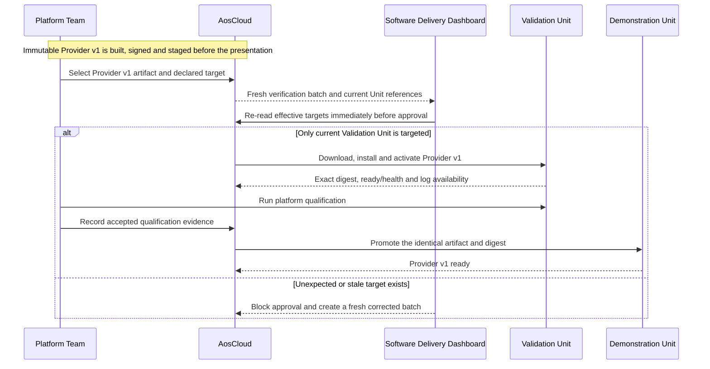

Current Unit Set membership alone is not accepted as target proof. The
dashboard derives effective scope from current Unit pending-batch state and
blocks stale or unexpected membership before approval.

<a id="af-g1-rt"></a>
### `AF-G1-RT` — First vehicle-data path into KUKSA

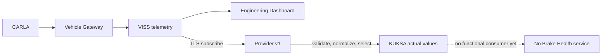

Provider v1 is read-only toward the vehicle. It publishes only the accepted v1
subset and has no VISS Set or vehicle-control permission.

<a id="af-g1-ob"></a>
### `AF-G1-OB` — Platform-capability proof

| Surface | Required evidence |
| --- | --- |
| Software Delivery Dashboard | Exact artifact, target preview, download/install/activate states, qualification, validation approval, promotion |
| AosCloud | Authoritative desired/actual component state and Unit status |
| KUKSA probe | Only the approved v1 values are present and fresh |
| Engineering Dashboard | Direct VISS telemetry remains uninterrupted |
| ELK/log view | Selected provider startup, ready, source-loss, and recovery evidence |
| Brake Health Dashboard | Still `service not deployed` |

<a id="af-g1-fr"></a>
### `AF-G1-FR` — Provider failure and rollback

```text
vehicle source lost
  -> Provider marks values unavailable/degraded; never fabricates values
  -> source returns or provider restarts
  -> only fresh values resume

Provider v1 defect
  -> contain failure to VDP payload
  -> rollback/remove Provider v1 through qualified FOTA flow
  -> G0 substrate, Unit identity, AosCore, KUKSA, CARLA and Gateway remain
```

Rollback is an engineering recovery flow. The normal presentation does not use
it to reset the complete demo.

### G1 requirement inputs

- Freeze the exact v1 signal contract and freshness behavior.
- Qualify runtime install, health, restart, source loss, and rollback.
- Define authoritative target-preview and validation evidence.
- Qualify the log route before promising ELK evidence.

## G2 — Brake Health Service v1

<a id="af-g2-lc"></a>
### `AF-G2-LC` — Independent SOTA 1 delivery

```mermaid
sequenceDiagram
    participant FT1 as Function Team 1 / Service Provider 1
    participant AC as AosCloud
    participant VU as Validation Unit
    participant BE as Brake Health Backend
    participant DU as Demonstration Unit

    Note over FT1,AC: Immutable Service v1 is built, signed and staged before the presentation
    FT1->>AC: Select Service v1 requiring Capability v1
    AC->>VU: Check dependency; install Service v1 through SOTA 1
    VU-->>AC: Service ready with exact version and digest
    VU->>BE: Send bounded v1 functional report
    BE-->>FT1: Ingestion and dashboard evidence
    FT1->>AC: Accept Service v1 integration result
    AC->>DU: Promote identical Service v1 artifact
    DU-->>AC: G2 ready; Provider v1 unchanged
```

Service v1 can be updated, stopped, or rolled back without rebuilding or
replacing Provider v1.

<a id="af-g2-rt"></a>
### `AF-G2-RT` — Bounded functional reporting

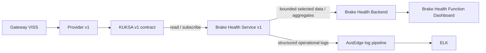

Service v1 performs no prediction and requests no advisory. Its backend does
not connect directly to CARLA, VISS, KUKSA, or AosCloud.

<a id="af-g2-ob"></a>
### `AF-G2-OB` — First functional-service proof

| Surface | Required evidence |
| --- | --- |
| Software Delivery Dashboard | Provider v1 unchanged; independent Service v1 dependency, validation and promotion |
| Brake Health Dashboard | Selected values/aggregates, source Unit role, event time, freshness, service version, connectivity state |
| Engineering Dashboard | Vehicle/Gateway telemetry remains independent and live |
| ELK/log view | Service start, KUKSA subscription, backend connection, bounded error evidence |
| AosCloud | Service instance state and resource monitoring |

<a id="af-g2-fr"></a>
### `AF-G2-FR` — Service and backend isolation

- An unmet capability dependency blocks Service v1 installation or start.
- A Service v1 failure invokes its bounded restart/rollback policy; Provider v1
  remains active.
- Backend loss cannot stop local KUKSA consumption or the vehicle data path.
- Queue/retry/drop behavior must be bounded and factual; unbounded storage is
  prohibited.
- Duplicate delivery and original event-time preservation are service/backend
  contract responsibilities.

### G2 requirement inputs

- Define the exact v1 functional report: selected samples, aggregates, or both.
- Define KUKSA read authorization and capability dependency expression.
- Implement backend idempotency, retention, offline, and freshness behavior.
- Implement the first Brake Health Dashboard state.

## G3 — Capability v2 and Predictive Brake Health Service v2

<a id="af-g3-dep"></a>
### `AF-G3-DEP` — Deferred native cross-lifecycle rejection

This negative-path flow is part of the target demo design but is not executable
against the current released AosCloud/API.

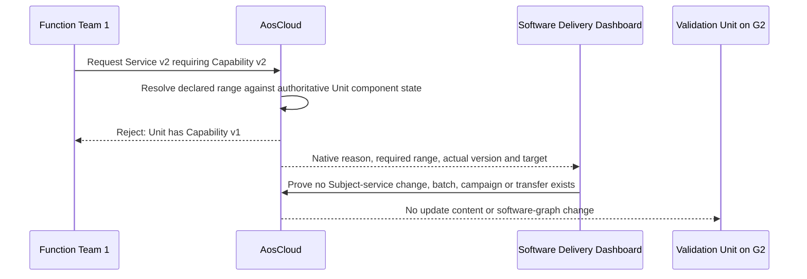

After this rejection, the Platform Team delivers and qualifies Capability v2
through the normal FOTA flow. Function Team 1 then resubmits the identical
Service v2 candidate; native dependency admission succeeds and `AF-G3-LC`
continues.

Activation of this flow requires all of the following evidence from an
official implementing release:

1. the supported Cloud API and signed service metadata expose a versioned
   Service-to-FOTA-component dependency;
2. an incompatible request is rejected by AosCloud itself;
3. rejection occurs before Subject-service desired-state change, validation
   batch, campaign and Unit download;
4. the error is available through the authoritative API for dashboard display;
5. a compatible retry succeeds after Capability v2 is ready.

The existing service-side compatibility file and fail-closed readiness check
remain defense in depth. The Software Delivery Dashboard does not recreate the
roadmap feature.

<a id="af-g3-lc"></a>
### `AF-G3-LC` — Feature request, independent qualification, joint acceptance

```mermaid
sequenceDiagram
    participant FT1 as Function Team 1
    participant PT as Platform Team
    participant AC as AosCloud
    participant VU as Validation Unit
    participant OA as OEM Acceptance
    participant DU as Demonstration Unit

    FT1->>PT: Versioned request for additional vehicle data and quality constraints
    PT->>AC: Select backward-compatible Provider v2 FOTA artifact
    AC->>VU: Install Provider v2
    VU-->>PT: Independent platform qualification evidence
    PT-->>FT1: Accepted capability contract and handoff
    FT1->>AC: Select Service v2 + model requiring Capability v2
    AC->>VU: Install Service v2 through SOTA 1
    VU-->>FT1: Local inference and backend integration evidence
    PT->>OA: Provider v2 digest and qualification
    FT1->>OA: Service/model digest and joint scenario result
    OA->>AC: Accept exact Provider v2 + Service v2 graph
    AC->>DU: Promote Provider v2 first
    DU-->>AC: Provider v2 ready; v1 contract still usable
    AC->>DU: Promote Service v2 second
    DU-->>AC: G3 ready
```

Provider v2 is a backward-compatible superset. Platform qualification finishes
before functional integration. Neither candidate is promoted until the exact
combined graph is accepted.

<a id="af-g3-rt"></a>
### `AF-G3-RT` — Deterministic local prediction

```mermaid
flowchart LR
    SCENE["Deterministic CARLA braking event"] --> GW["Vehicle Gateway"]
    GW --> VISS["Base + expanded vehicle data"]
    VISS --> P2["Provider v2"] --> KUKSA["Backward-compatible v1 + v2 values"]
    KUKSA --> S2["Brake Health Service v2 + versioned model"]
    S2 --> RESULT["Local health / prediction result"]
    RESULT --> BE["Brake Health Backend"] --> BD["Brake Health Dashboard"]
```

The same CARLA stimulus and condition profile are replayed when comparing
graphs. Model development and training occur before the presentation; the live
demo performs deterministic inference only. Native, derived, estimated, and
simulated-component inputs are visibly distinguished.

<a id="af-g3-ob"></a>
### `AF-G3-OB` — Predictive-function proof

| Surface | Required evidence |
| --- | --- |
| CARLA scene | Same bounded route, obstacle, braking profile, and cleanup behavior |
| Engineering Dashboard | Physical maneuver and source data remain visible |
| Software Delivery Dashboard | Feature request, Provider qualification, capability handoff, Service integration, exact graph acceptance, ordered promotion |
| Brake Health Dashboard | New inputs, provenance labels, model version/digest, result, confidence/quality, original event time |
| ELK/log view | Provider mapping/readiness and service model-load/inference decisions without secrets or unrestricted raw payloads |

<a id="af-g3-fr"></a>
### `AF-G3-FR` — Independent defect ownership and reverse dependency

```text
Service/model defect
  -> Function Team 1 creates immutable Service v2.x
  -> no FOTA change when Capability v2 remains correct

Platform defect
  -> Platform Team creates immutable Provider v2.x
  -> requalify the platform and dependent graph

Rollback from v2 graph
  -> rollback dependent Service v2 first
  -> rollback Provider v2 only after no v2-only consumer remains
  -> Service v1 may continue on Provider v2's backward-compatible v1 subset
```

### G3 requirement inputs

- Freeze Provider v2 signals and provenance using the native CARLA inventory.
- Define the simulated brake-condition model separately from native CARLA
  telemetry.
- Define model identity, input schema, deterministic output, resource bounds,
  and stale/missing-data behavior.
- Define the exact accepted-graph record and promotion checks.
- Qualify `AF-G3-DEP` against the first AosEdge release that exposes native
  Service-to-FOTA-component dependency admission; keep the flow disabled until
  then.

## G4 — Bidirectional Advisory Capability

<a id="af-g4-lc"></a>
### `AF-G4-LC` — Capability v3 and Service v3 promotion

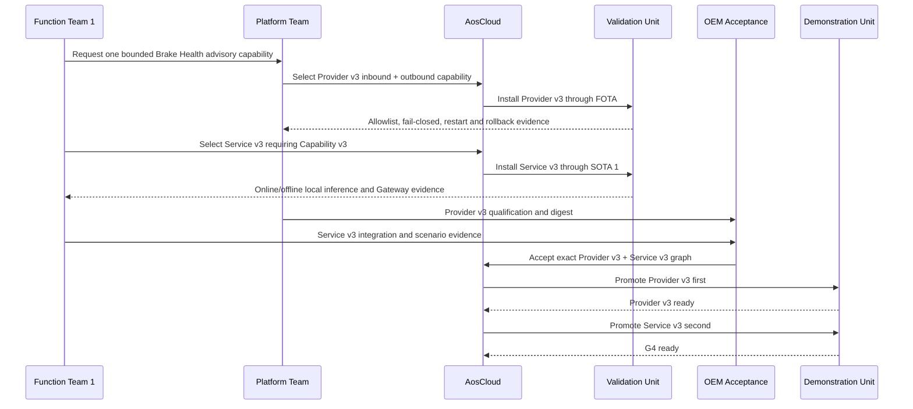

Scenario language may call the combined capability Provider v3 even if the
implementation packages inbound and outbound providers separately.

<a id="af-g4-rt"></a>
### `AF-G4-RT` — Local advisory round trip

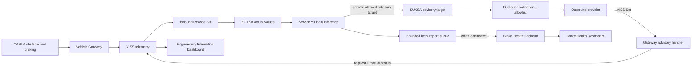

The advisory path ends at factual Gateway receipt/status. The demo implements
no IVI or Instrument Cluster and must not claim `displayed to driver` or
`driver acknowledged`.

<a id="af-g4-ob"></a>
### `AF-G4-OB` — Advisory and offline proof

| Surface | Required evidence |
| --- | --- |
| CARLA scene | Deterministic hard-braking stimulus executes safely |
| Engineering Dashboard | Advisory request, Gateway `RECEIVED`/`REJECTED`/`FAILED` status, correlation, and local elapsed time |
| Software Delivery Dashboard | Provider v3 and Service v3 dependency, validation, exact graph, ordered promotion, Unit connectivity |
| Brake Health Dashboard | Pending/offline report state, later synchronized result, original event time and model version |
| ELK/log view | Selected inference, policy, delivery, queue and reconnection records |
| AosCloud | Software state remains observable; it is not in the local decision path |

<a id="af-g4-fr"></a>
### `AF-G4-FR` — Fail-closed actuation and offline continuity

- An unauthorized path, type, enum, stale command, or malformed request is
  rejected by the outbound policy and produces factual status.
- The outbound path cannot carry arbitrary display text or vehicle motion
  commands.
- Loss of Cloud connectivity does not stop KUKSA subscription, local inference,
  or the Gateway advisory round trip.
- A functional report remains in a bounded local queue and synchronizes with
  its original event time after connectivity returns.
- Failure of the functional backend cannot authorize or suppress the local
  advisory.
- Rollback follows Service v3 first, then Capability v3 when required.

### G4 requirement inputs

- Define the advisory actuator and Gateway-status contract.
- Implement scoped VISS Set, Gateway handler, and factual status publication.
- Define outbound provider allowlist, authorization, freshness, replay
  protection, and failure behavior.
- Define Service v3 state machine, bounded retention, retry and idempotency.
- Extend the Engineering Dashboard without turning it into an actuator client.

## Function Team 2 Candidate — Vehicle Stability / Low-Friction Event

This is an independent architecture flow for the selected detailed-design
candidate. It is **not** part of Scenario 1.1's `G0–G4` stage sequence and does
not change that document's current acceptance state.

<a id="af-ft2-lc"></a>
### `AF-FT2-LC` — Independent SOTA 2 lifecycle

```mermaid
sequenceDiagram
    participant FT2 as Function Team 2 / Service Provider 2
    participant AC as AosCloud
    participant VU as Validation Unit
    participant EB as Event Backend
    participant DU as Demonstration Unit

    FT2->>AC: Select immutable Event Uploader requiring an already accepted capability version
    AC->>VU: Check dependency; install through SOTA 2
    VU-->>FT2: Local event qualification and bounded-upload evidence
    VU->>EB: Deliver qualified low-friction event package
    FT2->>AC: Accept exact service version and scenario result
    AC->>DU: Promote identical SOTA 2 artifact
    DU-->>AC: Event Uploader ready; other service lifecycles unchanged
```

Function Team 2 does not request a new Vehicle Data Platform Capability in the
current demo. Its stage can be inserted only after the accepted platform
contract already contains every required dynamics signal. It has no dependency
on the Brake Health service and no vehicle-actuation permission.

<a id="af-ft2-rt"></a>
### `AF-FT2-RT` — Local detection and bounded event upload

```mermaid
flowchart LR
    FRICTION["CARLA stock low-friction zone"] --> DYNAMICS["Native vehicle + wheel dynamics"]
    DYNAMICS --> GW["Vehicle Gateway"] --> VISS["VISS"]
    VISS --> VDP["Accepted Vehicle Data Platform Capability"] --> KUKSA["KUKSA actual values"]
    KUKSA --> EVENT["Vehicle Stability / Low-Friction Event Uploader"]
    EVENT --> RULE["Local event state machine"]
    RULE --> PACKAGE["Bounded pre/post event package"]
    PACKAGE -->|"connected"| EB["Function Team 2 Event Backend"] --> ED["Event-Based Data Dashboard"]
    PACKAGE -->|"offline"| QUEUE["Bounded local queue"]
    QUEUE -. "reconnect" .-> EB
```

The candidate may analyze native CARLA speed, acceleration, steering,
per-wheel angular velocity, longitudinal slip, and lateral slip angle, but the
exact service-facing subset remains a detailed data-contract decision. CARLA
ground truth may qualify the scenario and event detector; it must not be passed
to the service as if it were a production vehicle sensor.

<a id="af-ft2-ob"></a>
### `AF-FT2-OB` — Candidate evidence

| Surface | Required evidence |
| --- | --- |
| CARLA scene | Repeatable entry into and exit from the configured low-friction zone |
| Engineering Dashboard | Source vehicle and wheel dynamics; no claim that this proves service detection |
| Software Delivery Dashboard | Independent Service Provider 2 identity, dependency, validation and promotion |
| Event-Based Data Dashboard | Event time, severity/status, bounded package identity, Unit role, service version, online/offline delivery state |
| ELK/log view | Selected local detection and queue state without leaking unrestricted raw telemetry |
| Brake Health Dashboard | Unchanged; no coupling to Function Team 2 data plane |

<a id="af-ft2-fr"></a>
### `AF-FT2-FR` — Candidate failure boundaries

- No event is emitted for stale, missing, or internally inconsistent mandatory
  inputs; the service reports `NOT_EVALUATED` or an equivalent factual state.
- Cloud/backend loss delays only upload; local detection continues.
- Queue size, event rate, retry, and retention are bounded.
- Duplicate upload is handled idempotently by the Event Backend.
- A Function Team 2 defect creates a new SOTA 2 artifact, not a Brake Health
  SOTA or platform FOTA, unless evidence proves the platform contract itself is
  defective.

### Function Team 2 qualification gate

Before adding this flow to an audience scenario:

1. enumerate and verify the required native CARLA data on the packaged Mac
   build;
2. calibrate normal and low-friction runs using the same vehicle, speed,
   steering/control profile and fixed simulation timing;
3. prove a distinguishable and repeatable event across at least ten strict
   resets;
4. freeze the input subset, event state machine, thresholds, confidence,
   bounded window and package schema;
5. prove the required signals already exist in an accepted Vehicle Data
   Platform Capability;
6. define the independent backend/dashboard and offline acceptance evidence;
7. revise Demo Scenario 1.1 before presenting this candidate as a live stage.

<a id="af-x-source"></a>
## `AF-X-SOURCE` — One Visible Vehicle Source, Two Unit Roles

The architecture contains two Domain Controller instances but only one visible
CARLA/Vehicle Gateway/VISS source. The flow must use one of these honest modes:

1. bind the live source to VU during qualification, then stop/detach and bind it
   to DU for presentation; or
2. capture one deterministic, contract-versioned source trace and replay it to
   each Unit separately.

The selected mode must prove source identity, Unit binding, start/end frame or
trace range, contract version, and cleanup. It must never imply that two
simultaneous vehicles were running when only one existed. A source selector or
replay orchestrator is a demo responsibility, not a new production ECU.

Selection between the two modes remains an open detailed-design decision.

<a id="af-x-obs"></a>
## `AF-X-OBS` — Cross-Stage Evidence Architecture

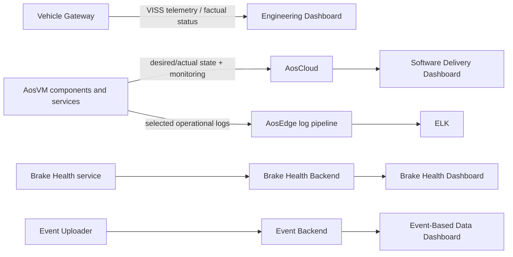

| Surface | Authoritative for | Not authoritative for |
| --- | --- | --- |
| CARLA scene | Visible physical stimulus and vehicle motion | Software deployment or functional result |
| Engineering Dashboard | Gateway VISS telemetry and factual advisory status | KUKSA receipt, service decision, backend delivery, or driver display |
| AosCloud | Unit desired/actual software state and lifecycle records | Functional vehicle data or local analytic decisions |
| Software Delivery Dashboard | Simplified presentation and approved orchestration of real AosCloud state | A parallel desired-state database |
| ELK | Selected operational and troubleshooting records | Vehicle telemetry or functional product database |
| Brake Health Dashboard | Brake Health backend data, model result, report state | FOTA/SOTA authority or Gateway receipt |
| Event-Based Data Dashboard | Function Team 2 event/backend state | Raw continuous vehicle stream or Brake Health result |

Every audience claim must name the source surface and, where relevant, expose
technical drill-down to the authoritative system.

<a id="af-x-release"></a>
## `AF-X-RELEASE` — Common Validation and Promotion Pattern

Every FOTA and SOTA transition uses the same safety pattern:

```text
prebuilt immutable candidate
  -> fresh Validation target/batch
  -> effective-target preview immediately before approval
  -> install only on VU
  -> component or service qualification
  -> integration qualification when applicable
  -> explicit acceptance tied to versions and digests
  -> re-check DU target and dependency
  -> promote the identical accepted artifact to DU
  -> verify actual state and readiness
```

An unexpected Unit, stale pending batch, digest mismatch, unmet dependency, or
incomplete evidence blocks the transition. The dashboard may initiate only
explicitly approved actions and must always re-read AosCloud afterward.

<a id="af-x-offline"></a>
## `AF-X-OFFLINE` — Connectivity Domains

Three connections must be tested independently:

| Lost connection | Must continue | May be delayed or unavailable |
| --- | --- | --- |
| AosCloud lifecycle connection | CARLA, Gateway, KUKSA, installed provider/service local behavior | New deployments, lifecycle reporting, Cloud-requested logs |
| Functional backend connection | Local Brake Health inference/advisory; local Function Team 2 detection | Functional report/event upload and dashboard refresh |
| Gateway-to-Domain-Controller vehicle link | CARLA and safe vehicle control; AosCore lifecycle | Fresh KUKSA vehicle values and dependent evaluation |

The system must not convert one connectivity loss into fabricated sensor data,
unbounded buffering, widened authorization, or an implicit vehicle command.

## R0 — End-of-Demo Retirement and Next-Run Reset

<a id="af-r0-lc"></a>
### `AF-R0-LC` — Controlled retirement

```mermaid
sequenceDiagram
    participant OR as Demo Orchestrator
    participant AC as AosCloud
    participant VU as Validation VM / Unit
    participant DU as Demonstration VM / Unit
    participant FB as Functional Backends
    participant CS as CARLA Scenario
    participant FI as Immutable Factory Image

    OR->>AC: Close/detach current-run assignments and campaigns as qualified
    OR->>VU: Clean shutdown
    OR->>DU: Clean shutdown
    VU-->>AC: Offline
    DU-->>AC: Offline
    OR->>AC: Deprovision both Units using accepted Cloud operation
    AC-->>OR: Old identities/certificates rejected
    OR->>AC: Delete Unit records; handle Unit-owned Nodes by qualified API semantics
    OR->>FB: Clear/archive current-session functional data by Unit IDs + time window
    OR->>CS: Reset actors, route, deterministic seed and local evidence
    OR->>OR: Discard both provisioned overlays and run-specific host state
    OR->>FI: Verify immutable factory image unchanged
```

<a id="af-r0-ob"></a>
### `AF-R0-OB` — Retirement evidence

- both Units reached `Offline` before deprovisioning;
- deprovisioning and deletion results are recorded separately;
- retired certificates cannot reconnect;
- Unit/Node cleanup matches the qualified API semantics;
- Cloud lifecycle audit history is retained;
- functional backend/dashboard data is cleared or archived by the exact Unit
  IDs and session time window;
- no QEMU process holds either discarded overlay;
- the immutable factory image and digest remain unchanged;
- CARLA has no scenario-owned actor or sensor leak.

<a id="af-r0-fr"></a>
### `AF-R0-FR` — Partial-failure rules

- Do not delete a local overlay while its VM is running or while Cloud identity
  retirement is uncertain.
- A deprovision failure preserves the Unit record and overlay for
  reconciliation.
- Unit deletion is not assumed to delete Nodes unless the qualified API proves
  ownership semantics.
- Functional-data cleanup never erases authoritative Cloud audit evidence.
- A failed retirement blocks the next live run from reusing the old identity;
  it does not modify the immutable factory image.

R0 is a demonstration-lab operation on disposable Units, not a production
vehicle rollback or proof of a fleet-wide deletion policy.

## Scenario-to-Flow Traceability

| Demo Scenario 1.1 claim | Architecture flow coverage |
| --- | --- |
| OEM-integrated SOP substrate enables post-SOP extension | `AF-M0-LC`, `AF-G0-RT` |
| Two freshly manufactured, unprovisioned vehicle computers | `AF-M0-LC`, `AF-M0-OB` |
| Unique one-time provisioning into Validation and Demonstration lanes | `AF-M1-LC`, `AF-M1-OB`, `AF-M1-FR` |
| Working vehicle and Gateway telemetry before provider payload | `AF-G0-RT`, `AF-G0-OB` |
| First narrow platform capability validated before promotion | `AF-G1-LC`, `AF-G1-RT`, `AF-X-RELEASE` |
| Service v1 is an independent SOTA consumer with bounded backend reporting | `AF-G2-LC`, `AF-G2-RT`, `AF-G2-FR` |
| Platform Team and Function Team 1 independently iterate v2 | `AF-G3-LC`, `AF-G3-FR` |
| An incompatible Service v2 is rejected natively before any Unit delivery | deferred `AF-G3-DEP`; blocked on an implementing AosEdge release |
| Same deterministic CARLA event supports comparable local inference | `AF-G3-RT`, `AF-G3-OB`, `AF-X-SOURCE` |
| Local advisory reaches the Gateway without a Cloud round trip | `AF-G4-RT`, `AF-G4-FR`, `AF-X-OFFLINE` |
| No driver-HMI claim; Engineering Dashboard shows factual Gateway status | `AF-G4-OB`, `AF-X-OBS` |
| Functional report synchronizes after connectivity returns | `AF-G4-RT`, `AF-G4-FR`, `AF-X-OFFLINE` |
| Two Unit roles do not imply two simultaneous CARLA vehicles | `AF-X-SOURCE` |
| Complete reset retires current identities and overlays | `AF-R0-LC`, `AF-R0-OB`, `AF-R0-FR` |
| Function Team 2 is a peer independent Service Provider | `AF-FT2-LC`, `AF-FT2-FR` |
| Low-friction analytics occurs locally and only bounded events reach its backend | `AF-FT2-RT`, `AF-FT2-OB`, `AF-X-OFFLINE` |

## Interface and Ownership Matrix

| Interface | Producer / authority | Consumer | Owning lifecycle |
| --- | --- | --- | --- |
| CARLA vehicle and native sensor state | `CARLA` | `GATEWAY` | Vehicle simulation |
| Vehicle control channel | `CONTROL` | `GATEWAY` / CARLA actuator path | Gateway tooling; separate from VDP |
| VISS vehicle telemetry | `GATEWAY` / `VISS` | `VDP` and independent `ENG-DASH` | Gateway contract |
| KUKSA actual values | `VDP` | `BHS` and, later, `EVENT` | Platform FOTA contract |
| Brake Health advisory target | `BHS` | outbound `VDP` | SOTA request constrained by FOTA allowlist |
| VISS Set advisory | outbound `VDP` | `GW-ADV` | Platform FOTA + Gateway contract |
| Gateway advisory status | `GW-ADV` / `VISS` | `ENG-DASH` and inbound `VDP` as selected | Gateway contract |
| Brake Health functional report | `BHS` | `BRAKE-BE` / `BRAKE-DASH` | Function Team 1 SOTA/backend |
| Low-friction event package | `EVENT` | `EVENT-BE` / `EVENT-DASH` | Function Team 2 SOTA/backend |
| Unit desired/actual state | `AOS-CLOUD` / `AOS-CORE` | `SW-DASH` | AosCloud lifecycle |
| Selected operational logs | Components/services through `LOG-PIPE` | `ELK` | Operational observability |

No backend, dashboard, or functional service becomes an alternate path for
vehicle control or software lifecycle authority.

## Consolidated Gap Register

| Gap ID | Short name | Flow | Unresolved design or proof | Requirements owner |
| --- | --- | --- | --- | --- |
| <a id="gap-af-01"></a>`GAP-AF-01` | Clean factory baseline | `M0` | Freeze and qualify the clean unprovisioned OEM Demo Factory Image with empty provider slot and no reusable identity | Platform Team |
| <a id="gap-af-02"></a>`GAP-AF-02` | Unique overlay identities | `M0/M1` | Prove unique first-boot and provisioned identities for two overlays | Platform Team + demo orchestration |
| <a id="gap-af-03"></a>`GAP-AF-03` | Provisioning and retirement qualification | `M1/R0` | Qualify provisioning, partial-result reconciliation, deprovision, certificate rejection, Unit/Node deletion and audit retention | AosCloud integration |
| <a id="gap-af-04"></a>`GAP-AF-04` | One source, two Unit roles | `G0/X-SOURCE` | Select live binding or deterministic replay for one CARLA source and two Unit roles | Demo architecture |
| <a id="gap-af-05"></a>`GAP-AF-05` | Provider v1 contract | `G1` | Freeze Provider v1 signal, freshness, readiness, health and rollback contract | Platform Team |
| <a id="gap-af-06"></a>`GAP-AF-06` | Effective-target preview | `G1/X-RELEASE` | Implement effective-target preview and stale-batch protection from current Unit pending-batch state | Software Delivery Dashboard |
| <a id="gap-af-07"></a>`GAP-AF-07` | Brake Health v1 product | `G2` | Define and implement Service v1, bounded report, backend, dashboard, retry and idempotency | Function Team 1 |
| <a id="gap-af-08"></a>`GAP-AF-08` | Provider v2 compatibility | `G3` | Define Provider v2 inputs, provenance and backward compatibility | Platform Team + Function Team 1 |
| <a id="gap-af-09"></a>`GAP-AF-09` | Deterministic brake model | `G3` | Define simulated brake-condition source and deterministic model/result contract | Vehicle simulation + Function Team 1 |
| <a id="gap-af-10"></a>`GAP-AF-10` | Outbound advisory chain | `G4` | Define and implement KUKSA actuator, outbound provider, VISS Set, Gateway handler and factual status | Platform Team + Gateway |
| <a id="gap-af-11"></a>`GAP-AF-11` | Offline report queue | `G4/X-OFFLINE` | Define bounded local report queue, reconnect, duplicate handling and timing | Function Team 1 |
| <a id="gap-af-12"></a>`GAP-AF-12` | Low-friction event contract | `FT2` | Calibrate low-friction CARLA stimulus and freeze the local event state machine and bounded package | Function Team 2 + CARLA scenario |
| <a id="gap-af-13"></a>`GAP-AF-13` | Existing dynamics-signal proof | `FT2` | Prove required dynamics signals already exist in an accepted platform contract; no new FT2 platform request | Platform Team + Function Team 2 |
| <a id="gap-af-14"></a>`GAP-AF-14` | Function Team 2 Cloud product | `FT2` | Implement independent event backend/dashboard and offline/idempotent ingestion | Function Team 2 |
| <a id="gap-af-15"></a>`GAP-AF-15` | Least-privilege KUKSA access | all | Define least-privilege KUKSA publish/read/actuate identities and the transition from demo tokens to the authorization adapter | Platform security |
| <a id="gap-af-16"></a>`GAP-AF-16` | Logs and ELK qualification | all | Qualify AosEdge log collection/export, ELK access, retention, offline and redaction | Operational observability |
| <a id="gap-af-17"></a>`GAP-AF-17` | Software Delivery Dashboard | all | Implement the Software Delivery Dashboard without a parallel desired-state cache | Demo solution |
| <a id="gap-af-18"></a>`GAP-AF-18` | Presentation and timing bounds | all | Define stage durations, timeout budgets, local decision latency and technical/executive presentation modes | Demo experience |
| <a id="gap-af-19"></a>`GAP-AF-19` | Demo-run correlation and cleanup | `M1/R0` | Define current-run correlation by start time, local overlay roles, Unit IDs, and external-data retention/cleanup boundaries | Demo orchestration + functional teams |
| <a id="gap-af-20"></a>`GAP-AF-20` | Cross-lifecycle compatibility | `G2–G4/FT2` | Define and prove versioned capability-dependency declaration, current runtime fail-closed behavior, future native Cloud rejection before rollout/transfer, compatibility checks, and safe dependent-first rollback for both SOTA lifecycles | AosEdge Platform Team + Platform Team + both service providers |

These gaps are inputs to the requirements package. They do not authorize
component implementation and do not imply that every gap belongs in one
repository.

## Architecture-Flow Acceptance Gate

Architecture Flows 1.0 can be accepted when reviewers confirm that:

1. `M0`, `M1`, `G0–G4`, and `R0` match Demo Scenario 1.1;
2. every component and interface respects High-Level Architecture 1.1;
3. VU validation and DU promotion use explicit current targeting and identical
   accepted artifacts;
4. manufacturing state, Unit identity, software graph, functional data, and
   operational logs have distinct authorities;
5. the one-CARLA/two-Unit limitation is explicit and not disguised;
6. local inference/advisory and low-friction detection remain independent of
   Cloud availability;
7. no flow claims a production driver HMI, production fleet, arbitrary
   component runtime, or unrestricted vehicle actuation;
8. R0 retires disposable identities and overlays instead of rolling `G4` back
   to `G0`;
9. Function Team 2 remains an independent candidate flow and does not silently
   enter Scenario 1.1;
10. every open technical choice is represented as a gap rather than a hidden
    implementation assumption.
11. `AF-G3-DEP` is visibly deferred, has no project-side substitute, and cannot
    be presented until the native AosCloud roadmap capability is qualified.

## Next Requirements Gate

After this document is accepted, requirements should be derived in this order:

1. end-to-end system requirements for every `AF-*` flow;
2. versioned vehicle-data, advisory, functional-report, and low-friction event
   interface requirements;
3. manufacturing, identity, provisioning, targeting, dependency, validation,
   promotion, rollback, retirement, and recovery requirements;
4. security, authorization, resource, privacy, offline, timing,
   observability, idempotency, and failure requirements;
5. allocation to CARLA scenario tooling, Vehicle Gateway, platform providers,
   AosCore integration, both SOTA services, both functional backends,
   dashboards, logging, and demo orchestration;
6. acceptance tests and evidence linked to both requirement IDs and flow IDs.

Only after that requirements package is reviewed should the implementation
plan be rebuilt. This review candidate authorizes no code, artifact, Cloud, or
Unit change.
