<!-- SPDX-FileCopyrightText: 2026 maninblack -->
<!-- SPDX-License-Identifier: MIT -->

# Demo Scenario Architecture Flows 2.0

- Status: Review candidate
- Version: 2.0
- Prepared: 2026-08-22
- Previous accepted version: 1.8
- Owner: System Architecture
- Architecture input: [High-Level Architecture 1.5](high-level-architecture.md)
- Scenario input: [Staged Post-SOP Brake and Tire Health Demo Scenarios 2.0](../demo/staged-post-sop-brake-health-demo-scenarios.md)
- CARLA input: [R10 Native CARLA Vehicle Telemetry Inventory](../research/demo-foundation/r10-carla-telemetry-and-function-team-2.md)
- Requirements input: [System Requirements and Traceability 2.0](../requirements/system-requirements-and-traceability.md)
- Component input: [Component Decomposition and Interface Register 2.0](../requirements/component-decomposition-and-interface-register.md)
- Accepted architecture decisions: [ADR 0009](decisions/0009-separate-release-decision-from-cloud-execution.md),
  [ADR 0011](decisions/0011-qm-service-containment-and-evidence-backed-oem-approval.md)
- Accepted publication decision: [D4-010.3 Artifact Publication Credential Profile](../../contracts/artifact-publication-profile/artifact-publication-profile.v1.json)
- Proposed architecture change: [ADR 0013](decisions/0013-current-release-kuksa-authorization-compatibility.md),
  which supersedes ADR 0010 only after the complete documentation cascade is
  accepted
- Implementation, build, signing, Cloud, or Unit mutation authorized: no

## Purpose

This document is the traceability bridge between the static capability model
in High-Level Architecture 1.5, the audience-visible Demo Scenario 2.0, and the
next component-requirements package.

It defines how software, data, decisions, evidence, and ownership move through
the complete canonical demonstration lifecycle:

```text
M0 manufacturing
  -> M1 end-of-line provisioning
  -> G0 provisioned SOP substrate
  -> G1 Vehicle Data Platform Component v1
  -> G2 Brake Health Service v1 event-window acquisition
  -> G3 VDP Component v2 + edge-analytics Service v2
  -> G4 bidirectional VDP Component v3 + Service v3
  -> T1 independent Tire Health Service v1.0
  -> R0 retirement of the current demo run
```

`M0` and `M1` describe manufacturing and onboarding, `G0–G4` describe the
accepted substrate and Brake Health software graphs, `T1` adds one mature
Tire Health Service v1.0 SOTA 2 product, and `R0` retires the complete current
run. `T1` follows `G4` in the presentation because it uses the accepted VDP v3
contract; it does not depend on Function Team 1 or repeat the three-version
Brake Health evolution. The next-run reset retires the two
current Units and discards their provisioned overlays; it is not a reverse OTA
rollout.

## Source Precedence and Change Control

When the inputs differ, use this order:

1. High-Level Architecture 1.5 owns component boundaries, interfaces,
   authority, security boundaries, and architectural invariants.
2. Demo Scenario 2.0 owns stage order, component presence, audience-visible
   proof, and the manufacturing-to-retirement narrative.
3. This document owns detailed cross-component flow mapping and exposes gaps;
   it does not silently change either source.
4. R10 owns the inventory of native CARLA data; ADR 0008 owns the Tire Health
   selection that supersedes its former low-friction candidate.

A contradiction found here must be resolved in the owning source before it
becomes a requirement.

## Flow Identifier Convention

| Suffix | Flow type | Question answered |
| --- | --- | --- |
| `LC` | Lifecycle | How is an image, Unit, FOTA capability, or SOTA service created, validated, accepted, promoted, or retired? |
| `RT` | Runtime | How do vehicle data, local decisions, reports, or actuator requests move? |
| `OB` | Observability | Which authoritative system and audience surface prove the state? |
| `FR` | Failure and recovery | Which layer contains a failure, and how can operation recover without widening authority? |

Stage flow identifiers use `AF-<stage>-<type>`, for example `AF-G3-LC`.
Cross-stage flows use `AF-X-<name>`. The `T1` stage retains the stable
`AF-TIRE-<type>` identifiers so existing requirement and traceability links do
not change.

## Architecture Role Catalogue

| ID | Architecture role | Owner | Current or target state |
| --- | --- | --- | --- |
| `CARLA` | Virtual physical vehicle, environment, native sensors, and actuators | CARLA repositories | Current |
| `SCENE` | Deterministic obstacle/braking scenario, explicit free-drive/brake-event world context, manual takeover, safe stop, actor cleanup, and accelerated/pre-aged tire degradation stimulus | `carla-ego-runtime` tooling | Brake Event core current; complete context-transition matrix and `T1` stimulus target |
| `CONTROL` | Vehicle Control UI and separate control channel | `carla-ego-runtime` | Current |
| `GATEWAY` | Vehicle Gateway ECU behavior, CARLA sampling, VSS normalization | `carla-ego-runtime` | Current |
| `VISS` | TLS VISS 3.1 server | `carla-ego-runtime` | Get/Subscribe current; narrowly scoped Set target |
| `GW-ADV` | Typed maintenance-advisory handler and factual Gateway status | `carla-ego-runtime` | Target |
| `ENG-DASH` | Engineering Telematics Dashboard | `carla-ego-runtime` | Vehicle telemetry current; advisory/status extension target |
| `FACTORY` | Immutable OEM Demo Factory Image with one IAM configuration containing `enablePermissionsHandler: true`, factory-installed unmodified KUKSA, the separately packaged current-release helper, no pre-populated Service authority/secret state, and non-secret signer/verifier preparation wiring but no key, JWT or shared production verifier | Platform Team | Target acceptance artifact requiring a successor image build; no clean accepted image yet |
| `RUNTIME` | Preinstalled provider-specific empty-slot component runtime | Platform Team / `aos-vehicle-platform` | Engineering evidence exists; final factory-image qualification remains open |
| `AOS-CORE` | Identity, desired state, Service Manager, security, update support | AosCore in AosVM | Current on existing provisioned Units |
| `KUKSA` | Unmodified Eclipse Databroker and stable factory-installed resource-server boundary in the Domain Controller | SOP substrate plus Platform Team contract/trust configuration | Executable present; final shared contract, Service verifier preparation and trusted Provider-side integration remain qualification work |
| `KAC` | Transitional current-release KUKSA authorization compatibility helper (`CMP-KAC`): fixed-resource Service bootstrap, Aos IAM lookup, bounded JWT derivation and private volatile delivery | Platform Team / `aos-vehicle-platform`, outside VDP and SOTA payloads | Target current-release compatibility component; removable after a released native AosCore contract is qualified |
| `VU` | Validation Unit, a fresh Domain Controller instance | Demo lifecycle | Target per-run role |
| `DU` | Demonstration Unit, a separate fresh Domain Controller instance | Demo lifecycle | Target per-run role |
| `VDP` | Vehicle Data Platform Component payload: inbound/outbound providers, validation, signal selection, advisory allowlist and versioned KUKSA data contract | Platform Team, FOTA lifecycle | Inbound engineering candidate exists; accepted v1-v3 remain target; Provider is trusted OEM platform integration and Service JWT issuance is excluded |
| `BHS` | Brake Health service and versioned local model | Function Team 1 / Service Provider 1, SOTA 1 | Service scaffold exists; accepted v1-v3 behavior is target |
| `TIRE` | Tire Health in-vehicle service | Function Team 2 / Service Provider 2, SOTA 2 | Selected in ADR 0008; detailed design and implementation are target |
| `BRAKE-BE` | Brake Health functional backend | Function Team 1 | Target |
| `BRAKE-DASH` | Brake Health Function Dashboard | Function Team 1 | Target |
| `TIRE-BE` | Tire Health backend | Function Team 2 | Target |
| `TIRE-DASH` | Tire Health Function Dashboard | Function Team 2 | Target |
| `AOS-CLOUD` | Lifecycle system of record and execution control plane: provisioning, desired/reported actual state, batches, campaigns, recorded approvals, audit and FOTA/SOTA delivery | AosCloud | Current platform; exact demo operations require qualification |
| `SW-DASH` | Stateless OEM Software Delivery Dashboard over AosCloud APIs; includes a Platform Releases view that delegates protected sign/publish of prebuilt VDP candidates, shows lifecycle/log/decision evidence, and invokes only explicitly confirmed OEM-authorized Unit actions | Demo solution | Target |
| `ORCH` | Demo-session, overlay, Unit binding, sequential live-source handover, and retirement orchestration without lifecycle-state or approval ownership | `aosedge-sdv-demo` | Target |

The catalogue distinguishes an implemented component from an accepted demo
capability. Existing provisioned VMs, signed candidates, and local build
artifacts are engineering evidence; they do not substitute for the fresh
prebuilt immutable candidates and clean
manufacturing and deployment sequence described here.

## State and Presence Model

```mermaid
flowchart LR
    M0["M0<br/>two unprovisioned factory overlays"]
    M1["M1<br/>two unique Online Units"]
    G0["G0<br/>SOP substrate<br/>empty capability slot"]
    G1["G1<br/>VDP Component v1"]
    G2["G2<br/>VDP Component v1 + Brake Health v1"]
    G3["G3<br/>VDP Component v2 + Brake Health v2"]
    G4["G4<br/>VDP Component v3 + Brake Health v3"]
    T1["T1<br/>G4 graph + independent Tire Health"]
    R0["R0<br/>Units retired<br/>overlays discarded"]

    M0 -->|"provision once"| M1 --> G0
    G0 -->|"FOTA v1"| G1
    G1 -->|"SOTA 1 v1"| G2
    G2 -->|"FOTA v2, then SOTA 1 v2"| G3
    G3 -->|"FOTA v3, then SOTA 1 v3"| G4
    G4 -->|"independent SOTA 2"| T1
    T1 -->|"retire current run"| R0
```

| State | Unit identity | Vehicle Data Platform payload | Brake Health service | Outbound advisory | Function Team 2 service |
| --- | --- | --- | --- | --- | --- |
| `M0` | None in Cloud | Absent; runtime slot empty | Absent | Absent | Absent |
| `M1` | Unique VU and DU identities | Absent; runtime slot empty | Absent | Absent | Absent |
| `G0` | Unchanged from M1 | Absent; runtime slot empty | Absent | Absent | Absent |
| `G1` | Unchanged | VDP Component v1 | Absent | Absent | Absent |
| `G2` | Unchanged | VDP Component v1 | Service v1 | Absent | Absent |
| `G3` | Unchanged | Backward-compatible VDP Component v2 | Service v2 + model | Absent | Absent |
| `G4` | Unchanged | VDP Component v3 inbound + allowlisted outbound | Service v3 | Present | Absent in the `G0–G4` Brake Health sequence |
| `T1` | Unchanged | VDP Component v3 unchanged | Service v3 unchanged | Brake and Tire typed targets present | Tire Health Service v1.0 present through independent SOTA 2 |
| `R0` | Retired and unable to reconnect | Overlay discarded | Overlay/backend session state retired | Not applicable | Not applicable |

Function Team 2 is the independent `T1` flow defined later in this document.
Its position after `G4` is presentation order, not a dependency on Brake
Health. It consumes the compatible VDP v3 contract while the accepted Brake
Health graph remains unchanged.

## Cross-Stage Invariants

All flows below preserve these rules:

1. CARLA is the virtual physical vehicle, the Vehicle Gateway is a separate
   ECU boundary, and each AosVM is a Domain Controller ECU boundary.
2. Functional services use KUKSA only; they never connect directly to CARLA or
   VISS.
3. Vehicle control is separate from vehicle telemetry and unavailable to both
   functional services.
4. VU always receives and qualifies a candidate before the same accepted bytes
   and digest are promoted to DU.
5. Vehicle Data Platform Component updates use FOTA; Brake Health and Tire
   Health updates use their
   independent SOTA lifecycles.
6. A SOTA service declares a compatible Vehicle Data Platform Component and
   does not install when that dependency is unmet.
7. Local analysis does not require external vehicle connectivity. The
   deliberate offline demo blocks the Demonstration Unit's connections both
   to AosCloud and to installed services' functional backends. Presenter-to-
   AosCloud and simulated in-vehicle connectivity remain available; bounded
   functional messages synchronize after vehicle connectivity returns.
8. AosCloud is the lifecycle system of record and execution control plane, not
   the owner of engineering release decisions or a functional telemetry backend.
9. Native AosEdge logs are operational evidence presented from AosCloud; they
   are not vehicle telemetry or functional product data.
10. Engineering Dashboard evidence proves the Gateway view only; it does not
    prove KUKSA, a functional backend, or driver display.
11. No artifact contains a reusable Unit identity, private credential, or
    per-vehicle secret.
12. Normal presentation moves forward. Rollback is qualification evidence and
    recovery behavior, not the normal reset mechanism.
13. AosEdge component-to-component and service-to-layer dependencies remain
    supported platform capabilities. Only native Cloud admission of a SOTA
    service against a required FOTA Vehicle Data Platform Component version is
    a target capability deferred until a supporting AosEdge release is
    qualified. Provider-first ordering, OEM validation and fail-closed service
    readiness remain current controls, not substitutes for that future Cloud
    gate; no temporary project-side admission controller is introduced.
14. The Platform Team and each Function Team own their engineering release
    decisions. Their views may delegate protected signing/publication of only
    prebuilt immutable candidates; Function Teams publish through Service
    Provider identities, while Platform FOTA publication and all approvals
    affecting OEM Units use authorized OEM identities. The current demo binds
    VDP FOTA to `platform-oem`, Brake SOTA to `brake-sp1` and Tire SOTA to
    `tire-sp2`; technical publication never performs the later OEM approval.
15. Passing qualification evidence never auto-approves a candidate. A combined
    FOTA/SOTA graph requires separate explicit acceptance by the Platform Team
    and the relevant Function Team before AosCloud executes promotion.
16. Upstream Eclipse KUKSA remains an unchanged factory-installed resource
    server outside VDP. Each SOTA Service presents only its per-instance
    `AOS_SECRET` and a fixed KUKSA resource identifier to the separately
    packaged current-release helper. The helper resolves current authority
    through Aos IAM, maps only `r` to `read` and `rw` to `actuate` into a
    300-second JWT renewed at 180 seconds, and privately delivers it to that
    Service instance. It
    owns no parallel Service identity or permission database, accepts no
    caller-selected authority, and is absent from the subsequent direct
    Service-to-KUKSA data path.
17. The VDP Provider is part of the OEM-qualified trusted platform. Its fixed
    Provider-side KUKSA access is qualified with the signed FOTA integration,
    not dynamically derived through the Service helper. No Service JWT or SOTA
    permission grants provider authority, and the demo makes no malicious- or
    substituted-Provider containment claim.

<a id="af-x-auth"></a>
## `AF-X-AUTH` — Cross-cutting Aos-to-KUKSA credential flow

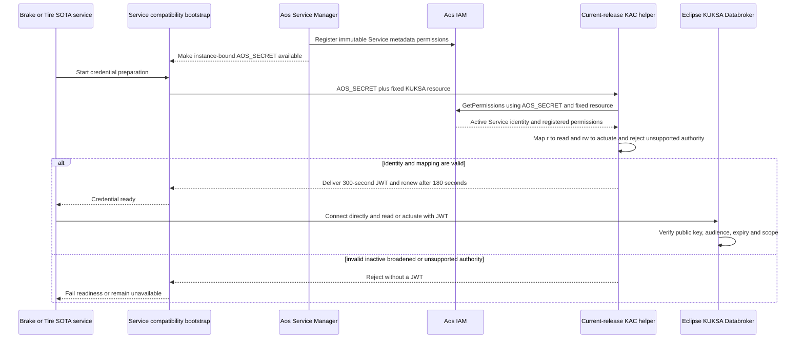

The permanent architecture boundary is platform-controlled and
implementation-neutral. For the current release, `KAC` realizes it as a
separately packaged removable helper outside VDP, Brake Health and Tire Health.
The request has one fixed KUKSA resource and cannot carry caller-selected
paths, operations, subject, audience, claims, TTL or signing material. Aos
Service Manager and IAM own SOTA instance identity, `AOS_SECRET` and registered
permission lifecycle. The helper owns no parallel Service identity or policy
database. Once preparation succeeds, the Service talks directly to KUKSA; the
helper is not a proxy or data-path intermediary.

### Renewal, failure, reboot, stop and removal behavior

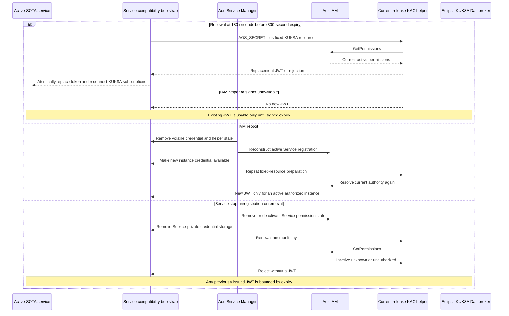

Loss of the Unit's external connectivity to AosCloud and functional backends
does not interrupt this local Service Manager, IAM, helper and KUKSA chain.
VM reboot does not restore an authorization database from the helper; it
reconstructs active authority from current platform state. Stop,
unregistration and removal prevent renewal and delete Service-private
credential material. The current-release design claims bounded expiry, not
instant KUKSA-side revocation of an already issued JWT.

The 120-second interval between renewal and expiry is a recovery reserve, not
an extension of authority. Retryable failures may use the current token only
until `exp`; terminal denial deletes it and disconnects the cooperating
Service immediately. Replacement of the token file alone is insufficient:
every successful renewal recreates the KUKSA connection and subscriptions so
they use the replacement credential.

The VDP Provider uses the fixed KUKSA connection configuration owned by the
OEM Platform Team as trusted platform integration; the first demo adds no
dynamic Provider IAM/JWT or per-component attestation mechanism. Functional
Services never receive KUKSA `provide` or `create` authority. Cloud-side
permission or FOTA-dependency rejection before Unit transfer remains a future native
AosCloud capability; it is separate from the current local fail-closed
exchange.

## M0 — Manufacturing Output

<a id="af-m0-lc"></a>
### `AF-M0-LC` — Factory-image and overlay creation

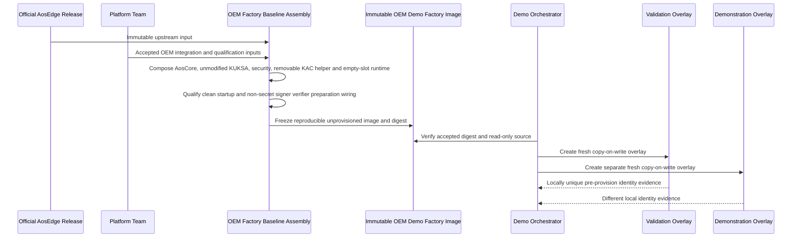

The factory image contains the provider-specific runtime, an empty component
store, unmodified KUKSA, and the separately packaged current-release helper.
It contains no provider payload, SOTA service, Cloud Unit, Cloud certificate,
pre-populated Service permission, `AOS_SECRET`, issued JWT, private signing key,
shared production verifier, or other reusable vehicle identity.

`BA` is the build-time logical component. `FI` is its immutable output
artifact. `VO` and `DO` are separate runtime deployments created from that
artifact; none is an instance of `BA`.

<a id="af-m0-ob"></a>
### `AF-M0-OB` — Manufacturing evidence

| Evidence owner | Audience proof |
| --- | --- |
| Factory artifact manifest | Source release, OEM image version, immutable digest, architecture, and qualification reference |
| Local overlay inventory | Exactly two fresh overlays with Validation and Demonstration roles |
| Identity preflight | Different system, Node-seed, SSH, hostname/network, and first-boot identity material as applicable |
| Software Delivery Dashboard | Both instances show `Manufactured / Awaiting provisioning`; no Cloud Unit ID exists |
| Component inventory | Empty provider store and no functional service payload |
| Security inventory | Helper package and non-secret preparation wiring present; no active Service authority, JWT or signing key |

<a id="af-m0-fr"></a>
### `AF-M0-FR` — Failure containment

- A digest mismatch blocks overlay creation.
- A non-empty provider store or embedded Cloud credential rejects the factory
  image.
- Pre-populated Service authority, `AOS_SECRET`, JWT, private signer, or shared
  production verifier rejects the factory image.
- Duplicate local identity material rejects both overlays before provisioning.
- A failed overlay creation is discarded; the immutable factory image is never
  repaired in place.
- Existing provisioned demo VMs must not be relabelled as new manufacturing
  output.

### M0 requirement inputs

- Freeze the exact accepted factory-image recipe and digest.
- Define first-boot identity generation and duplicate-detection evidence.
- Prove the provider-specific runtime is healthy with an empty slot.
- Prove KUKSA and the helper fail closed before Unit-specific verifier/signer
  preparation and start with no Service authority.
- Define overlay storage, naming, locking, and recoverable cleanup.

## M1 — End-of-Line Provisioning

<a id="af-m1-lc"></a>
### `AF-M1-LC` — Provisioning and lane assignment

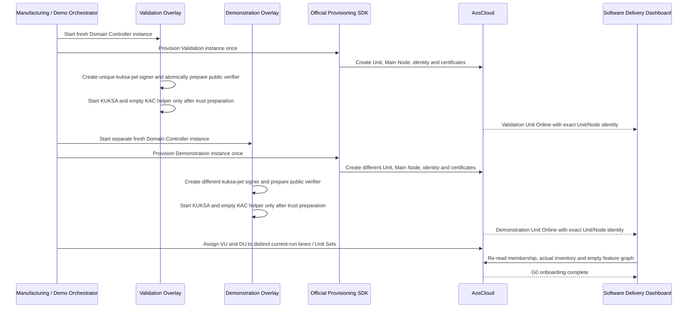

Provisioning is a once-per-overlay identity operation. VU and DU retain their
identities throughout `G0–T1`; no FOTA or SOTA step reprovisions them.

<a id="af-m1-ob"></a>
### `AF-M1-OB` — Provisioning evidence

| Surface | Required evidence |
| --- | --- |
| Software Delivery Dashboard | Session start, local role, Unit ID, Main Node ID, lane/Unit Set, Online state, and empty feature graph |
| AosCloud drill-down | Authoritative Unit/Node identity, actual state, platform/runtime inventory, and current membership |
| Local VM evidence | Overlay-to-Unit binding and distinct certificates/SSH host identities without exposing secrets |
| KUKSA trust evidence | Distinct non-exportable per-Unit signer identities, atomically prepared public verifiers, no active Service authority, and fail-closed KUKSA/helper startup without exposing key or JWT material |
| Audience state | Two visibly separate lanes: Validation and Demonstration |

Before M1 the session is correlated by start time and local overlay roles.
After M1 it is bound to the two Unit IDs and the same time window.

<a id="af-m1-fr"></a>
### `AF-M1-FR` — Fail-closed provisioning

- After the SDK begins, an uncertain or partial result is preserved for
  reconciliation; it is never blindly retried.
- A Unit whose role or Unit Set cannot be proven is not eligible for an update.
- Duplicate identity or certificate evidence blocks both Units.
- Missing, duplicate, exportable, or unverifiable `kuksa-jwt` signer/verifier
  preparation blocks KUKSA/helper readiness and therefore G0 acceptance.
- One successful Unit and one failed Unit do not constitute a complete M1.
- Cleanup of a failed disposable attempt follows the separately qualified
  deprovision/delete flow; local overlay deletion alone is insufficient.

### M1 requirement inputs

- Qualify provisioning success, partial failure, timeout, and reconciliation.
- Prove unique identities for two fresh overlays.
- Define exact lane/Unit Set creation and membership checks.
- Qualify unique post-provisioning signer creation, atomic verifier preparation,
  clean startup ordering and redacted evidence for both Units.

## G0 — Provisioned SOP Substrate Without Feature Payloads

<a id="af-g0-rt"></a>
### `AF-G0-RT` — Working vehicle, empty Domain Controller feature graph

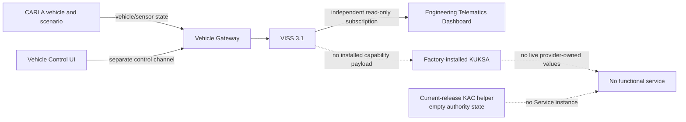

The vehicle is healthy and visibly operational. The Domain Controller is
online and update-ready, but the provider slot is empty. Absence of vehicle
data in KUKSA is a deliberate accepted state, not a platform fault.

<a id="af-g0-ob"></a>
### `AF-G0-OB` — Baseline proof

| Surface | Required evidence |
| --- | --- |
| CARLA scene | Vehicle drives in the city; manual/autopilot handover and safe stop remain available |
| Engineering Telematics Dashboard | Live Gateway telemetry independent of the Domain Controller |
| Software Delivery Dashboard | Both Units online, runtime present, provider/service payloads absent |
| KUKSA qualification probe | No live provider-owned values; no fabricated zeros |
| Functional dashboards | Explicit `feature not deployed`, not a transport error |
| Local security probe | Public verifier prepared, helper authority state empty, and no Service `AOS_SECRET` or JWT |

<a id="af-g0-fr"></a>
### `AF-G0-FR` — Baseline failure boundaries

- Vehicle-control failure invokes the existing Gateway safe-stop behavior and
  does not mutate either Unit.
- Gateway/VISS failure is visible as source loss; it does not make the empty
  provider slot unhealthy.
- Loss of a Unit's AosCloud connection does not stop CARLA, the Gateway, or
  direct Engineering Dashboard telemetry. The first demo exercises this only
  for the Demonstration Unit at `G4` through `AF-X-OFFLINE`.
- An unexpected provider or service blocks the demo because `G0` is no longer
  clean.
- A helper-held Service identity, permission cache, or JWT blocks G0; the
  packaged helper itself is expected current-release substrate.

### G0 requirement inputs

- Define non-invasive proof of the empty provider slot and empty functional
  graph on both Units.
- Define sequential exclusive live CARLA/Gateway binding: VU attach/run/detach,
  deterministic scenario reset and DU attach/run/detach, without implying two
  simultaneous vehicles. Telemetry replay is deferred.
- Implement the Software Delivery Dashboard baseline view.
- Define a redacted probe that proves trust preparation without exposing a
  signer, `AOS_SECRET`, JWT or Service authority.

<a id="af-x-drive"></a>
### `AF-X-DRIVE` — Drive-mode and world-context transitions

Drive mode and simulated-world context are related but independent state. The
controller remains the only ego actor and synchronous-clock owner throughout.

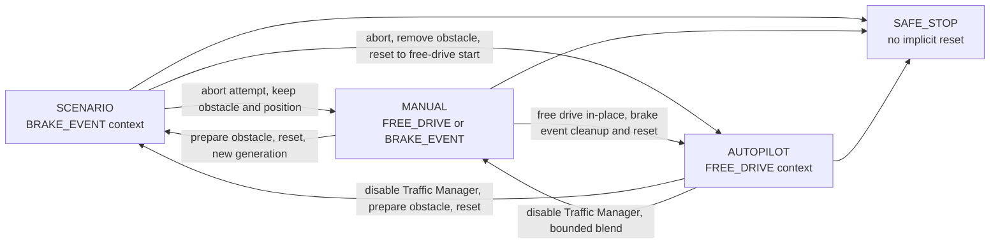

| Transition | Ordered flow |
| --- | --- |
| Scenario to Manual | Record an unfinished attempt as `ABORTED`; retain ego pose and the `BRAKE_EVENT` obstacle; begin manual control without replacing actor, clock, run or telemetry identity. |
| Scenario or brake-event Manual to Autopilot | Record an unfinished attempt as `ABORTED`; select safe stop; remove scenario-owned obstacle state; reset the same actor to the accepted free-drive start with zero linear/angular motion; increment reset generation; validate lane/alignment; enable Traffic Manager. |
| Free-drive Manual to Autopilot | Validate lane/alignment and hand over in place without a world reset. |
| Autopilot to Manual | Disable Traffic Manager before accepting manual actuation and apply the bounded pedal-safe blend. |
| Manual or Autopilot to Scenario | Select safe stop; disable Traffic Manager if active; prepare the canonical obstacle; reset the same actor; clear attempt-local evidence; increment scenario/reset generation; start a new attempt. |
| Scenario to Scenario | Mark an unfinished attempt `ABORTED`, then perform the same canonical reset and start a new generation. |
| Any mode to Safe Stop | Stop the vehicle without deleting scenario state, changing world context or claiming a reset. |

`PASS`, `FAIL` or collision selects safe stop. A Scenario restart or transition
to Autopilot is the deterministic recovery path from a blocked position.
Reverse control is outside the current contract. Traffic Manager automatic
lane changing is disabled, so obstacle avoidance is not claimed and the
brake-event obstacle cannot remain when free-drive Autopilot is enabled.

The Gateway/VISS engineering projection exposes drive mode, world context,
scenario state/result, generation and reset/discontinuity state. The
Engineering Telematics Dashboard presents those facts without joining the
control path. A failed obstacle cleanup, reset or lane validation leaves the
vehicle in safe stop and does not partially activate the requested mode.
The exact accepted transition and engineering-path contract is
[Simulator Control and Context 1.0.0](../../contracts/simulator-control-context/simulator-control-context.v1.json).

## G1 — Vehicle Data Platform Component v1

<a id="af-g1-lc"></a>
### `AF-G1-LC` — FOTA validation and promotion

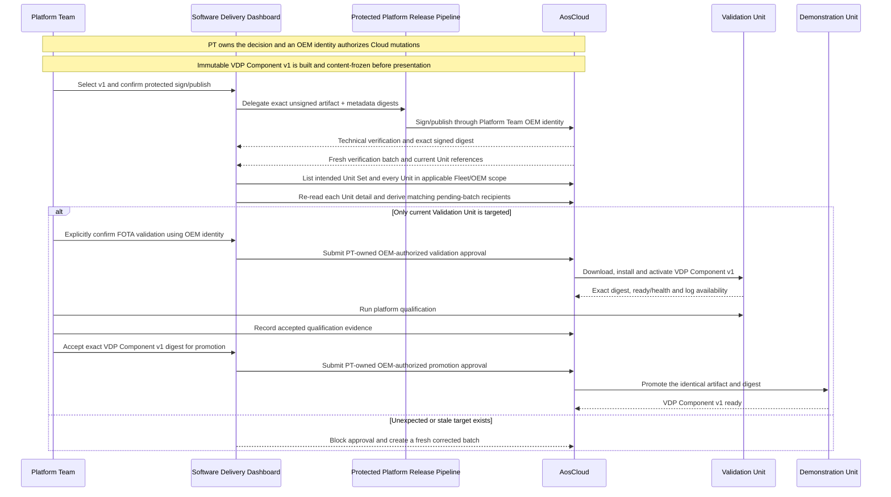

Current Unit Set membership alone is not accepted as target proof. The
dashboard enumerates the complete applicable Fleet/OEM Unit visibility scope,
derives effective recipients from each Unit's current pending-batch state and
requires exact Unit-ID set equality with the intended Unit Set. Incomplete
pagination, insufficient API visibility, stale references or any additional
or missing recipient blocks approval.

<a id="af-g1-rt"></a>
### `AF-G1-RT` — First vehicle-data path into KUKSA

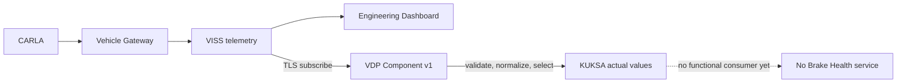

VDP Component v1 is read-only toward the vehicle. It publishes only the accepted v1
subset and has no VISS Set or vehicle-control permission.

<a id="af-g1-ob"></a>
### `AF-G1-OB` — Platform-capability proof

| Surface | Required evidence |
| --- | --- |
| Software Delivery Dashboard | Exact artifact, target preview, download/install/activate states, qualification, validation approval, promotion, and selected native provider log requests/results |
| AosCloud | Authoritative desired/actual component state and Unit status |
| KUKSA probe | Only the approved v1 values are present and fresh |
| Engineering Dashboard | Direct VISS telemetry remains uninterrupted |
| Brake Health Dashboard | Still `service not deployed` |

<a id="af-g1-fr"></a>
### `AF-G1-FR` — Provider failure and rollback

```text
vehicle source lost
  -> Provider marks values unavailable/degraded; never fabricates values
  -> source returns or provider restarts
  -> only fresh values resume

VDP Component v1 defect
  -> contain failure to VDP payload
  -> rollback/remove VDP Component v1 through qualified FOTA flow
  -> G0 substrate, Unit identity, AosCore, KUKSA, CARLA and Gateway remain
```

Rollback is an engineering recovery flow. The normal presentation does not use
it to reset the complete demo.

### G1 requirement inputs

- Freeze the exact v1 signal contract and freshness behavior.
- Qualify runtime install, health, restart, source loss, and rollback.
- Define authoritative target-preview and validation evidence.
- Qualify native AosCloud system/component log requests, results, access, and
  failure behavior before promising log evidence.

## G2 — Brake Health Service v1

<a id="af-g2-lc"></a>
### `AF-G2-LC` — Independent SOTA 1 delivery

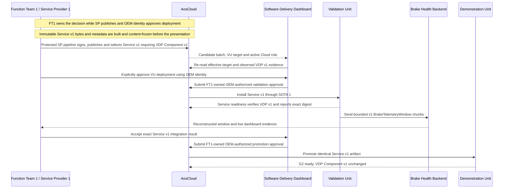

Service v1 can be updated, stopped, or rolled back without rebuilding or
replacing VDP Component v1.

Between SOTA installation and `ready`, the Service completes `AF-X-AUTH`.
Readiness remains false when fixed-resource bootstrap, IAM lookup, supported
permission mapping, private JWT delivery, or direct KUKSA authorization fails.
No VDP update or broker-style proxy is inserted into this lifecycle.

<a id="af-g2-rt"></a>
### `AF-G2-RT` — Bounded braking-event acquisition

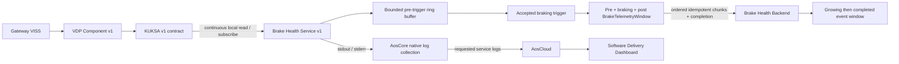

`S1` owns `RING`, `TRIGGER`, and `WINDOW`; those
labels expose its internal dataflow rather than additional deployable
components. The first chunk emitted when braking begins contains the bounded
pre-trigger history, active and post-trigger chunks follow in order, and one
completion record closes the finite event. Service v1 performs no prediction
and requests no advisory. Its backend does not connect directly to CARLA,
VISS, KUKSA, or AosCloud.

<a id="af-g2-ob"></a>
### `AF-G2-OB` — First functional-service proof

| Surface | Required evidence |
| --- | --- |
| Software Delivery Dashboard | VDP Component v1 unchanged; independent Service v1 dependency, validation and promotion; selected native service-log request/status/result |
| Brake Health Dashboard | A growing then completed `BrakeTelemetryWindow`, pre/active/post phase, source Unit role, event time, freshness, chunk/completion state and service version |
| Engineering Dashboard | Vehicle/Gateway telemetry remains independent and live |
| AosCloud | Service instance state and resource monitoring |

<a id="af-g2-fr"></a>
### `AF-G2-FR` — Service and backend isolation

- An unmet component dependency blocks Service v1 installation or start.
- A Service v1 failure invokes its bounded restart/rollback policy; VDP Component v1
  remains active.
- Backend loss cannot stop local KUKSA consumption or the vehicle data path.
- Queue/retry/drop behavior must be bounded and factual; unbounded storage is
  prohibited.
- In-progress and completed windows use bounded local persistence; reconnect
  resumes by event identity and chunk sequence rather than restarting an
  unrelated event.
- Duplicate delivery, deterministic trigger merge/debounce and original
  sample/event-time preservation are service/backend contract responsibilities.

### G2 requirement inputs

- Define the exact v1 trigger, pre/post durations, sampling contract, merge and
  debounce rules, chunk/completion schema and all memory/storage/size bounds.
- Define the Service's exact `kuksa` read paths/modes, immutable metadata, IAM
  registration, fixed-resource bootstrap, private volatile credential use,
  renewal/readiness behavior, and component dependency expression. Shared
  helper behavior remains owned by `AF-X-AUTH`, not the analytics Service.
- Implement backend idempotency, retention, offline, and freshness behavior.
- Implement the first Brake Health Dashboard state.

## G3 — VDP Component v2 and Edge-Analytics Brake Health Service v2

<a id="af-g3-dep"></a>
### `AF-G3-DEP` — Deferred native cross-lifecycle rejection

This negative-path flow is part of the target demo design but is not executable
against the current released AosCloud/API.

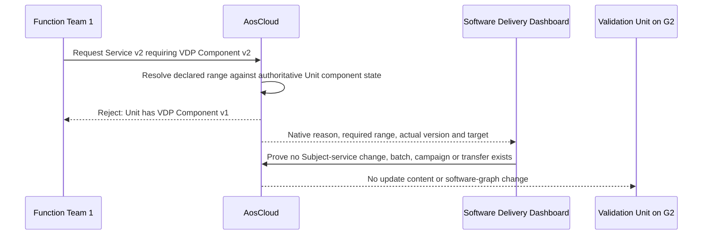

After this rejection, the Platform Team delivers and qualifies VDP Component v2
through the normal FOTA flow. Function Team 1 then resubmits the identical
Service v2 candidate; native dependency admission succeeds and `AF-G3-LC`
continues.

Activation of this flow requires all of the following evidence from an
official implementing release:

1. the supported Cloud API and signed service metadata expose a versioned
   Service-to-FOTA-component dependency;
2. an incompatible request is rejected by AosCloud itself;
3. rejection occurs before Subject-service desired-state change, validation
   batch, campaign and Unit download;
4. the error is available through the authoritative API for dashboard display;
5. a compatible retry succeeds after VDP Component v2 is ready.

The existing service-side compatibility file and fail-closed readiness check
remain defense in depth. The Software Delivery Dashboard does not recreate the
roadmap feature.

<a id="af-g3-lc"></a>
### `AF-G3-LC` — Feature request, independent qualification, joint acceptance

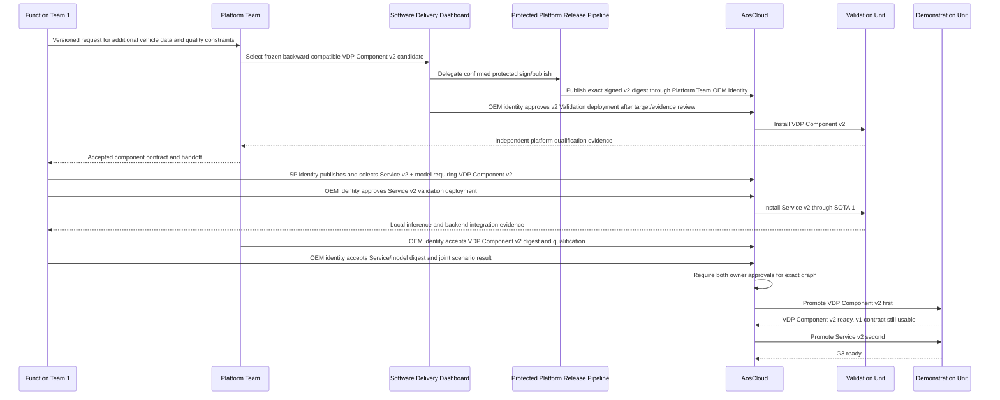

VDP Component v2 is a backward-compatible superset. Platform qualification finishes
before functional integration. Neither candidate is promoted until the
Platform Team and Function Team 1 separately accept their exact artifacts and
the joint result through authorized OEM identities.

<a id="af-g3-rt"></a>
### `AF-G3-RT` — Deterministic local assessment and derived reporting

```mermaid
flowchart LR
    SCENE["Deterministic CARLA braking event"] --> GW["Vehicle Gateway"]
    GW --> VISS["Base + expanded vehicle data"]
    VISS --> P2["VDP Component v2"] --> KUKSA["Backward-compatible v1 + v2 values"]
    KUKSA --> S2["Brake Health Service v2 + versioned synthetic model"]
    S2 --> RESULT["Local BrakeHealthAssessment"]
    RESULT --> EVENT["Bounded threshold / change BrakeHealthEvent"]
    RESULT --> BE["Brake Health Backend"]
    EVENT --> BE
    BE --> BD["Derived assessments and events"]
```

The same deterministic CARLA stimulus and condition profile are reset and
rerun sequentially when comparing graphs. Model development and training occur
before the presentation; the live demo performs deterministic inference only. The model may be deliberately
synthetic because platform evolution, not production brake-diagnostic
accuracy, is the claim. It must remain versioned, testable, causally driven by
the visible CARLA braking episode, and labelled as a demo model. Native,
derived, estimated, and simulated-component inputs are visibly distinguished.

Normal v2 operation sends bounded assessments and threshold/change events,
not the high-detail v1 telemetry window. This change in Cloud data product is
part of the audience-visible proof that processing moved into the vehicle.

<a id="af-g3-ob"></a>
### `AF-G3-OB` — Predictive-function proof

| Surface | Required evidence |
| --- | --- |
| CARLA scene | Same bounded route, obstacle, braking profile, and cleanup behavior |
| Engineering Dashboard | Physical maneuver and source data remain visible |
| Software Delivery Dashboard | Feature request, VDP Component qualification, component handoff, Service integration, exact graph acceptance, ordered promotion, and selected native provider/service log evidence |
| Brake Health Dashboard | Derived assessment/event rather than the v1 raw window, provenance labels, model version/digest, result, confidence/quality and original event time |

<a id="af-g3-fr"></a>
### `AF-G3-FR` — Independent defect ownership and reverse dependency

```text
Service/model defect
  -> Function Team 1 creates immutable Service v2.x
  -> no FOTA change when VDP Component v2 remains correct

Platform defect
  -> Platform Team creates immutable VDP Component v2.x
  -> requalify the platform and dependent graph

Rollback from v2 graph
  -> rollback dependent Service v2 first
  -> rollback VDP Component v2 only after no v2-only consumer remains
  -> Service v1 may continue on VDP Component v2's backward-compatible v1 subset
```

### G3 requirement inputs

- Freeze VDP Component v2 signals and provenance using the native CARLA inventory.
- Define the simulated brake-condition model separately from native CARLA
  telemetry.
- Define synthetic model identity, input schema, deterministic assessment/event
  outputs, resource bounds, and stale/missing-data behavior without claiming
  production diagnostic accuracy.
- Define the exact accepted-graph record and promotion checks.
- Qualify `AF-G3-DEP` against the first AosEdge release that exposes native
  Service-to-FOTA-component dependency admission; keep the flow disabled until
  then.

## G4 — Bidirectional Advisory Capability

<a id="af-g4-lc"></a>
### `AF-G4-LC` — VDP Component v3 and Service v3 promotion

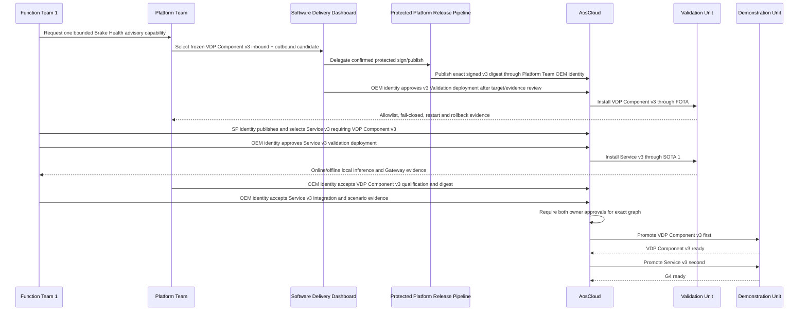

Scenario language may call the combined capability VDP Component v3 even if the
implementation packages inbound and outbound providers separately.

<a id="af-g4-rt"></a>
### `AF-G4-RT` — Local advisory round trip

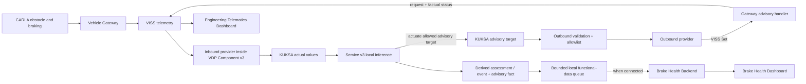

The advisory path ends at factual Gateway receipt/status. The demo implements
no IVI or Instrument Cluster and must not claim `displayed to driver` or
`driver acknowledged`.

<a id="af-g4-ob"></a>
### `AF-G4-OB` — Advisory and offline proof

| Surface | Required evidence |
| --- | --- |
| CARLA scene | Deterministic hard-braking stimulus executes safely |
| Engineering Dashboard | Advisory request, Gateway `RECEIVED`/`REJECTED`/`FAILED` status, correlation, and local event/advisory/Gateway chronology |
| Software Delivery Dashboard | VDP Component v3 and Service v3 dependency, validation, exact graph, ordered promotion, Unit connectivity, and selected native inference/policy/queue log evidence |
| Brake Health Dashboard | Pending/offline derived assessment/event and advisory-fact state, later synchronized result, original event time and model version |
| AosCloud | Software state remains observable; it is not in the local decision path |

<a id="af-g4-fr"></a>
### `AF-G4-FR` — Fail-closed actuation and offline continuity

- An unauthorized path, type, enum, stale command, or malformed request is
  rejected by the outbound policy and produces factual status.
- The outbound path cannot carry arbitrary display text or vehicle motion
  commands.
- Loss of Cloud connectivity does not stop KUKSA subscription, local inference,
  or the Gateway advisory round trip.
- Derived assessments/events and the correlated advisory fact remain in a
  bounded local queue and synchronize with their original event times after
  connectivity returns.
- Failure of the functional backend cannot authorize or suppress the local
  advisory.
- Rollback follows Service v3 first, then VDP Component v3 when required.

### G4 requirement inputs

- Define the advisory actuator and Gateway-status contract.
- Implement scoped VISS Set, Gateway handler, and factual status publication.
- Define outbound provider allowlist, IAM-derived KUKSA actuation scope,
  authorization, freshness, replay protection, and failure behavior.
- Define Service v3 state machine, bounded retention, retry and idempotency.
- Extend the Engineering Dashboard without turning it into an actuator client.

## T1 — Independent Tire Health Service v1.0

This is the independent presentation stage accepted by ADR 0008. It follows
`G4` because one mature Tire Health Service v1.0 candidate uses the accepted
VDP v3 data and advisory contract. It does not depend on Function Team 1,
Brake Health Service v3, or the Brake Health Cloud product; the existing `G4`
graph remains unchanged while SOTA 2 adds a second Function Team product and
lifecycle.

<a id="af-tire-lc"></a>
### `AF-TIRE-LC` — Independent SOTA 2 lifecycle

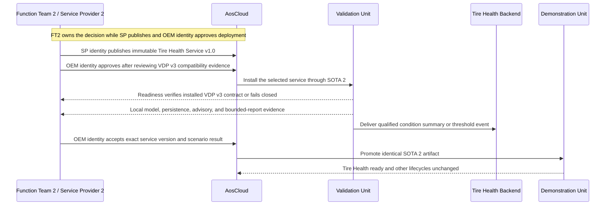

Function Team 2 does not request a new Vehicle Data Platform Component in the
current demo. `T1` begins only after the accepted VDP v3 contract contains every
required dynamics signal and typed advisory path. The sequence above is
release ordering and service-side readiness, not a claim of native Cloud-side
dependency admission in the current AosEdge release.

Tire Health uses the same `AF-X-AUTH` boundary as Brake Health. Its distinct
Service metadata produces a distinct IAM-derived JWT scope and private
credential location; it does not share the Brake credential, helper state,
Service Provider identity, quota, backend or SOTA lifecycle.

<a id="af-tire-rt"></a>
### `AF-TIRE-RT` — Local condition estimation, advisory, and bounded reporting

```mermaid
flowchart LR
    STIMULUS["Explicit accelerated or pre-aged tire stimulus"] --> DYNAMICS["Native vehicle and wheel dynamics"]
    DYNAMICS --> GW["Vehicle Gateway"] --> VISS["VISS"]
    VISS --> VDP["Accepted Vehicle Data Platform Component"] --> KUKSA["KUKSA actual values"]
    KUKSA --> TIRE["Tire Health service"] --> MODEL["Bounded persistent condition model"]
    MODEL --> RESULT["Estimated condition band and inspection decision"]
    RESULT --> PACKAGE["Bounded summary or threshold event"]
    PACKAGE -->|"connected"| TB["Tire Health Backend"] --> TD["Tire Health Function Dashboard"]
    PACKAGE -->|"offline"| QUEUE["Bounded local queue"]
    QUEUE -. "reconnect" .-> TB
    RESULT -->|"typed advisory request"| TARGET["KUKSA advisory target"]
    TARGET --> OUTBOUND["Allowlisted outbound VDP and VISS Set"] --> GWSTATUS["Gateway advisory status"]
```

The service may analyze native CARLA speed, acceleration, steering, applied
controls, engine state, per-wheel angular velocity, longitudinal slip, and
lateral slip angle. CARLA does not expose live tire tread wear, pressure,
temperature, puncture health, load, force, or torque as production-equivalent
measurements. The scenario therefore owns hidden deterministic degradation
truth used only for qualification; neither the service nor its backend may
receive it as a production signal.

<a id="af-tire-ob"></a>
### `AF-TIRE-OB` — Audience and engineering evidence

| Surface | Required evidence |
| --- | --- |
| CARLA scene | Repeatable driving with a clearly labelled accelerated/pre-aged tire condition |
| Engineering Telematics Dashboard | Native source dynamics plus typed Tire Health advisory request and factual Gateway status; no exact tread-depth claim |
| Software Delivery Dashboard | Independent Service Provider 2 identity, dependency, validation and promotion, with selected native model/persistence/queue log evidence |
| Tire Health Function Dashboard | Estimated condition band, threshold event, bounded payload identity, Unit role, service/capability version, and online/offline delivery state |
| Brake Health Dashboard | Unchanged; no coupling to Function Team 2 data plane |

<a id="af-tire-fr"></a>
### `AF-TIRE-FR` — Failure boundaries

- Stale, missing, or inconsistent mandatory inputs produce `NOT_EVALUATED` or
  equivalent factual state, not a fabricated health estimate.
- Cloud/backend loss delays only reporting; local estimation and advisory
  generation continue from bounded persistent state.
- Queue size, summary/event rate, retry, retention, and state growth are bounded.
- Duplicate upload is handled idempotently by the Tire Health Backend.
- A Tire Health advisory can address only its own allowlisted target and cannot
  command vehicle motion or arbitrary display text.
- A Function Team 2 defect creates a new SOTA 2 artifact, not a Brake Health
  SOTA or platform FOTA unless evidence proves the shared contract defective.

<a id="af-tire-res"></a>
### `AF-TIRE-RES` — AosCore-enforced service-tenant isolation

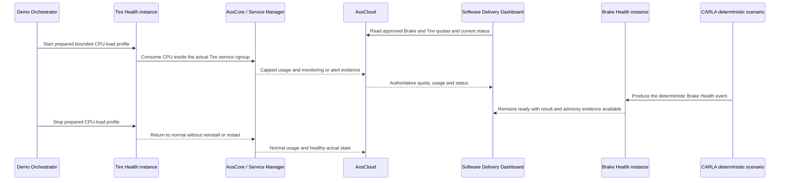

AosCore and its Service Manager/container runtime are the sole in-vehicle
resource-enforcement and monitoring authority. The demo adds no resource
manager, scheduler or policy control plane. The first audience proof saturates
only the approved CPU quota of the actual Tire Health service instance because
CPU throttling is bounded and recoverable. Memory, storage, PID and network
limits remain qualification evidence unless separately accepted later.

Brake Health is the control tenant: while Tire is capped, Brake must process
the same deterministic CARLA event without restart or degraded state, and VDP,
KUKSA, Gateway and AosCore must remain healthy. The Mac-local functional
backends are outside this AosCore proof and keep their own host-container
limits. With one service instance per Service Provider, the current claim is
service-instance isolation representing two tenants, not aggregate quota
enforcement over several services belonging to one provider.

### T1 qualification gate

Before presenting this flow as a live stage:

1. freeze the service-facing native signal subset on the packaged Mac build;
2. define and label the accelerated-time or pre-aged degradation stimulus;
3. freeze the versioned persistent-state model, condition bands, confidence,
   advisory thresholds, bounded payload and offline limits;
4. prove repeatable healthy-to-inspection transitions across at least ten
   strict scenario resets and separately prove state continuity across service
   restart;
5. prove hidden degradation truth is unavailable through VISS, KUKSA, service
   payloads, backend data, and audience dashboards;
6. prove the required signals and typed advisory target exist in an accepted
   Vehicle Data Platform Component;
7. qualify the independent backend/dashboard, idempotency and reconnect flow.
8. freeze distinct approved Brake and Tire CPU quotas, the exact service-
   metadata-to-AosCore runtime mapping, usage/alert API fields, the prepared
   Tire in-instance load trigger and the tolerance that proves Tire is capped
   while Brake and the platform graph remain healthy.

### Retired Function Team 2 flow identifiers

| Retired identifier | Replacement | Reason |
| --- | --- | --- |
| <a id="af-ft2-lc"></a>`AF-FT2-LC` | `AF-TIRE-LC` | Low-Friction candidate superseded by ADR 0008 |
| <a id="af-ft2-rt"></a>`AF-FT2-RT` | `AF-TIRE-RT` | Low-Friction candidate superseded by ADR 0008 |
| <a id="af-ft2-ob"></a>`AF-FT2-OB` | `AF-TIRE-OB` | Low-Friction candidate superseded by ADR 0008 |
| <a id="af-ft2-fr"></a>`AF-FT2-FR` | `AF-TIRE-FR` | Low-Friction candidate superseded by ADR 0008 |

<a id="af-x-source"></a>
## `AF-X-SOURCE` — One Visible Vehicle Source, Two Unit Roles

The architecture contains two Domain Controller instances but only one visible
live CARLA/Vehicle Gateway/VISS source. The first implementation uses one
mandatory sequential flow:

1. bind the live source exclusively to VU for qualification;
2. stop the scenario, detach VU and prove the live binding is released;
3. perform a deterministic CARLA scenario reset and start a new generation;
4. bind the same live source exclusively to DU for presentation; and
5. stop and detach DU during stage cleanup.

Each run must prove source identity, Unit binding, start/end frame range,
contract version, generation/reset boundary and cleanup. Overlap, an uncertain
detach or an ambiguous frame range blocks the next binding. The UI must never
imply that two simultaneous vehicles were running. Telemetry-trace capture and
replay is a deferred future option and no replay component belongs to the
first implementation.

The audience model deliberately hides this host-side plumbing. It presents a
**Validation Vehicle** and a **Demonstration Vehicle**, keeps exactly one
labelled `CURRENT VEHICLE`, and uses `Continue with Demonstration Vehicle` for
the stage transition. AosCloud Online state for both Units is independent of
which logical vehicle is current. Attach/detach/source-gate terms and exact
Unit/source/frame details remain in technical drill-down; vehicle role is not
published into the VSS/KUKSA production path. The exact accepted audience and
assignment contract is [Exclusive Live-Source Assignment 1.0.0](../../contracts/exclusive-live-source-assignment/exclusive-live-source-assignment.v1.json).
The selected Unit peer, independent read-only Dashboard peer, mTLS identity,
source readiness and telemetry-path superset are fixed by the
[VISS Trust and Telemetry Profile 1.0.0](../../contracts/viss-trust-telemetry-profile/viss-trust-telemetry-profile.v1.json).

<a id="af-x-obs"></a>
## `AF-X-OBS` — Cross-Stage Evidence Architecture

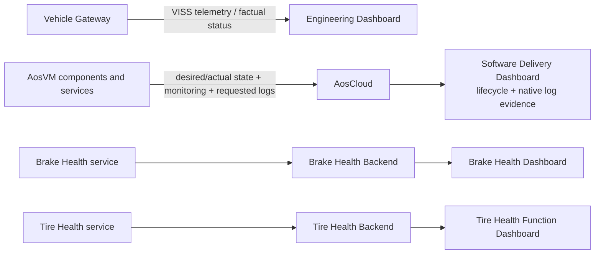

| Surface | Authoritative for | Not authoritative for |
| --- | --- | --- |
| CARLA scene | Visible physical stimulus and vehicle motion | Software deployment or functional result |
| Engineering Dashboard | Gateway VISS telemetry and factual advisory status | KUKSA receipt, service decision, backend delivery, or driver display |
| AosCloud | Unit desired/actual software state and lifecycle records | Functional vehicle data or local analytic decisions |
| Software Delivery Dashboard | Stateless presentation of real AosCloud lifecycle state, native log requests/results, exact artifact/metadata digests, requested permissions, target, validation evidence, owning-team acceptance, active OEM role and the final explicitly confirmed OEM-authorized operation | A parallel desired-state database, independent evidence/log store, release decision owner or automatic approval policy |
| Brake Health Dashboard | Brake Health backend data, model result, report state | FOTA/SOTA authority or Gateway receipt |
| Tire Health Function Dashboard | Function Team 2 condition/event/backend state | Raw continuous vehicle stream, hidden simulation truth, or Brake Health result |

The Software Delivery Dashboard is entered through a loopback-only,
authenticated local session. The trusted macOS demo launcher starts and
supervises a non-root, session-scoped native helper before the dashboard
backend and browser are started. Cloud mutation, VM/CARLA host authority and
the three D4-010.3 publication profiles remain behind that helper's fixed
operation allowlist; no browser or container receives a generic shell,
filesystem, URL or secret interface. Each release surface is pre-bound to one
profile and cannot select a credential path, candidate path or Cloud URL. In
the current `aos-signer` 2.0.1 compatibility path, the helper alone reads one
local mode-`0600` passwordless PKCS#12 per profile; this is not a Keychain or
non-exportable-key claim. The helper is not a persistent `launchd` service and
exits when the demo session ends or after a bounded launcher-loss/orphan
condition.

Every audience claim must name the source surface and, where relevant, expose
technical drill-down to the authoritative system.

<a id="af-x-release"></a>
## `AF-X-RELEASE` — Common Validation and Promotion Pattern

Every FOTA and SOTA transition uses the same safety pattern:

```text
prebuilt immutable candidate
  -> verify exact Factory Image/runtime compatibility and current evidence
  -> publish through fixed profile: platform-oem / brake-sp1 / tire-sp2
  -> bind prepared artifact digest + metadata digest + requested permissions
  -> preserve prepared -> signed -> AosCloud object/version identity mapping
  -> independently re-read AosCloud before declaring PUBLISHED
  -> fresh Validation target/batch
  -> effective-target preview immediately before approval
  -> show required validation evidence and owning-team acceptance
  -> explicit final owner decision through an authorized OEM identity
  -> install only on VU
  -> component or service qualification
  -> integration qualification when applicable
  -> explicit owner acceptance tied to versions, digests and targets
  -> require every owner approval for a combined FOTA/SOTA graph
  -> re-check DU target and dependency
  -> promote the identical accepted artifact to DU
  -> verify actual state and readiness
```

An unexpected Unit, stale pending batch, artifact or metadata digest mismatch,
unexpected permission, unmet dependency, incomplete/stale/failed evidence,
missing owning-team acceptance, wrong Cloud role, or missing combined-graph
approval blocks the transition. Passing evidence never implies approval. The
dashboard presents the complete decision basis and enables only the final
explicitly confirmed action through the correct OEM identity; it must always
re-read AosCloud afterward. AosCloud retains the authoritative lifecycle and
audit state after the dashboard or orchestrator exits.

An interrupted or ambiguous sign/publish result enters `UNCERTAIN` and is
reconciled through that authoritative re-read; it is never blindly retried.
The D4-010.3 publication helper signs and uploads only the exact prepared
candidate and does not validate, target or approve any Unit update.

<a id="af-x-qm"></a>
## `AF-X-QM` — QM Advisory Containment

```mermaid
flowchart LR
    SVC["QM Brake or Tire Health service"] -->|"typed maintenance advisory"| K["KUKSA target"]
    K --> VDP["VDP outbound policy<br/>defense in depth"]
    VDP -->|"restricted QM-origin channel"| GW["Vehicle Gateway<br/>authoritative enforcement"]
    GW -->|"accepted/rejected factual status"| ENG["Engineering Telematics Dashboard"]
    GW -. "deny" .-> MOTION["throttle · brake · steer · gear<br/>motion or safety-critical operation"]
```

The two functional services are QM-domain applications and produce only typed
maintenance/inspection advisories. Aos IAM and KUKSA scopes constrain each
service, and the VDP performs a second contract check. Neither is a
functional-safety argument. The Gateway knows that this route originates from
the QM Domain Controller and is the final authoritative boundary: it validates
target, type, range, freshness, rate and correlation and rejects arbitrary VSS
writes and every motion or safety-critical operation. No accepted flow depends
on the advisory for hazard mitigation.

<a id="af-x-offline"></a>
## `AF-X-OFFLINE` — Targeted Vehicle External Connectivity Loss

The first demo exposes exactly one stateful `Vehicle External Connectivity`
control. Its disconnect transition makes the Demonstration Unit lose external
vehicle connectivity and blocks:

- the Unit's connection to AosCloud; and
- every installed service's connection to its functional backend.

The following remain available:

- the presenter Mac/Native Helper connection to AosCloud;
- CARLA, Vehicle Gateway, VISS, the Domain Controller, KUKSA, VDP and installed
  services; and
- presenter/browser access to both Function Team dashboards and backends.

The Software Delivery Dashboard re-reads authoritative AosCloud state and
shows the Unit offline. New lifecycle and native-log actions for that Unit are
unavailable. A deterministic CARLA event still reaches the installed service,
local inference and the typed advisory path still execute, and the Engineering
Telematics Dashboard shows factual Gateway status. No new result reaches the
affected functional backend; its dashboard remains reachable to the presenter
and shows the last factual state as delayed/offline.

After the same control initiates restore, AosCloud must report the same Unit online
again without reprovisioning, reinstalling or restarting the provider or
services. Bounded queued messages synchronize idempotently to each affected
functional backend while preserving original event time separately from
receipt/synchronization time. The fault mechanism must prove that it did not
interrupt the presenter-to-AosCloud or simulated in-vehicle connections.

Presenter-to-AosCloud loss and simulated in-vehicle link loss are not separate
first-demo scenarios. Service-to-functional-backend loss is demonstrated only
as a consequence of the same vehicle external-connectivity fault, not as an
independently injected fault.

## R0 — End-of-Demo Retirement and Next-Run Reset

<a id="af-r0-lc"></a>
### `AF-R0-LC` — Controlled retirement

```mermaid
sequenceDiagram
    participant OR as Demo Orchestrator
    participant AC as AosCloud
    participant VU as Validation VM / Unit
    participant DU as Demonstration VM / Unit
    participant FB as Functional Backends
    participant CS as CARLA Scenario
    participant FI as Immutable Factory Image

    OR->>AC: Stop/close current-run execution as qualified, preserving Cloud history
    OR->>AC: Capture final authoritative online state
    OR->>VU: Apply qualified bounded offline operation
    OR->>DU: Apply qualified bounded offline operation
    AC-->>OR: Both Units reported Offline
    OR->>AC: Deprovision each offline Unit through qualified API
    OR->>AC: Re-read and reconcile each deprovision result
    OR->>VU: Bounded old-credential reconnect attempt
    OR->>DU: Bounded old-credential reconnect attempt
    OR->>AC: Prove neither retired identity returns Online
    OR->>VU: Leave offline and stop after reconciled deprovision
    OR->>DU: Leave offline and stop after reconciled deprovision
    VU-->>OR: Volatile Service JWT and helper state destroyed with overlay lifecycle
    DU-->>OR: Volatile Service JWT and helper state destroyed with overlay lifecycle
    OR->>AC: Reconcile Unit Set membership through qualified API ordering
    OR->>AC: Delete Unit records and handle Unit-owned Nodes through qualified API semantics
    OR->>AC: Re-read active Units and persistent Unit Sets
    AC-->>OR: Retired Unit IDs absent and both memberships empty
    OR->>FB: Preview then permanently delete all current-run functional data
    OR->>CS: Reset actors, route, deterministic seed and local evidence
    OR->>OR: Discard both provisioned overlays and run-specific host state
    OR->>FI: Verify immutable factory image unchanged
    Note over OR,AC: Next M1 provisions new identities and assigns each new Unit to its correct set
```

<a id="af-r0-ob"></a>
### `AF-R0-OB` — Retirement evidence

- the final online state was captured before retirement, both Units were then
  reported `Offline` by AosCloud before either deprovision request, and the
  offline mechanism is identified;
- every Cloud-side mutation used a qualified AosCloud API operation;
- deprovisioning request/response, authoritative re-read, bounded retired-
  credential reconnect test, VM stop, membership and deletion results are
  recorded separately;
- deleted Unit IDs are absent from active Unit inventory;
- retired certificates cannot reconnect;
- Unit/Node cleanup matches the qualified API semantics;
- the persistent Verification and Demonstration Unit Sets contain no retired
  Unit and both memberships are empty;
- Cloud lifecycle audit history is retained;
- all current-run functional backend/dashboard data is permanently deleted by
  the exact Unit IDs and session time window, leaving no local demo-run history;
- no QEMU process holds either discarded overlay;
- no current-run Service-private JWT, `AOS_SECRET`, helper runtime state or
  Unit-specific signing material survives disposal of either overlay;
- the immutable factory image and digest remain unchanged;
- CARLA has no scenario-owned actor or sensor leak.

<a id="af-r0-fr"></a>
### `AF-R0-FR` — Partial-failure rules

- Do not delete a local overlay while its VM is running or while Cloud identity
  retirement is uncertain.
- Failure to place both Units in authoritative `Offline` state blocks
  deprovisioning; it is never bypassed by treating a local network action or
  VM process state as sufficient Cloud evidence.
- A deprovision failure preserves the Unit record and overlay for
  reconciliation.
- If an old credential unexpectedly returns a retired Unit to `Online`, stop
  retirement and preserve the Unit record and overlay for investigation.
- Unit deletion is not assumed to delete Nodes unless the qualified API proves
  ownership semantics.
- Unit deletion is not assumed to clear Unit Set membership unless the
  qualified API proves that behavior; unresolved membership preserves the
  Cloud records and overlays for reconciliation.
- Functional-data cleanup never erases authoritative Cloud audit evidence.
- The minimal redacted operation journal exists only while an operation is
  active or uncertain and is deleted after successful R0 reconciliation.
- A failed retirement blocks the next live run from reusing the old identity;
  it does not modify the immutable factory image.
- Current-release authorization material is never copied back into the factory
  image or forward into a fresh overlay; a next-run Service must derive new
  authority after provisioning and deployment.
- The next M1 creates new Unit and Node identities, assigns them to the correct
  disjoint persistent Unit Sets and uses only fresh lifecycle objects after
  membership changes.

R0 is a demonstration-lab operation on disposable Units, not a production
vehicle rollback or proof of a fleet-wide deletion policy.

## Scenario-to-Flow Traceability

| Demo Scenario 2.0 claim | Architecture flow coverage |
| --- | --- |
| OEM-integrated SOP substrate enables post-SOP extension | `AF-M0-LC`, `AF-G0-RT` |
| Two freshly manufactured, unprovisioned vehicle computers | `AF-M0-LC`, `AF-M0-OB` |
| Unique one-time provisioning into Validation and Demonstration lanes | `AF-M1-LC`, `AF-M1-OB`, `AF-M1-FR` |
| Working vehicle and Gateway telemetry before provider payload | `AF-G0-RT`, `AF-G0-OB` |
| Deterministic manual, Autopilot and scripted transition behavior | `AF-X-DRIVE`, `AF-G0-FR`, `AF-X-OBS` |
| First narrow Vehicle Data Platform Component validated before promotion | `AF-G1-LC`, `AF-G1-RT`, `AF-X-RELEASE` |
| Service v1 is an independent SOTA consumer with bounded backend reporting | `AF-G2-LC`, `AF-G2-RT`, `AF-G2-FR` |
| Platform Team and Function Team 1 independently iterate v2 | `AF-G3-LC`, `AF-G3-FR` |
| An incompatible Service v2 is rejected natively before any Unit delivery | deferred `AF-G3-DEP`; blocked on an implementing AosEdge release |
| Same deterministic CARLA event supports comparable local inference | `AF-G3-RT`, `AF-G3-OB`, `AF-X-SOURCE` |
| Local advisory reaches the Gateway without a Cloud round trip | `AF-G4-RT`, `AF-G4-FR`, `AF-X-OFFLINE` |
| QM services cannot reach motion or safety-critical operations | `AF-G4-RT`, `AF-TIRE-RT`, `AF-X-QM` |
| No driver-HMI claim; Engineering Dashboard shows factual Gateway status | `AF-G4-OB`, `AF-X-OBS` |
| Targeted DU external-connectivity loss leaves local behavior active, interrupts AosCloud and functional-backend paths, then reconnects and synchronizes the same installed graph | `AF-G4-RT`, `AF-G4-FR`, `AF-X-OFFLINE` |
| Two Unit roles do not imply two simultaneous CARLA vehicles | `AF-X-SOURCE` |
| Complete reset retires current identities and overlays | `AF-R0-LC`, `AF-R0-OB`, `AF-R0-FR` |
| `T1` adds Function Team 2 as a peer independent Service Provider without changing the `G4` Brake Health graph | `AF-TIRE-LC`, `AF-TIRE-FR` |
| At `T1`, tire condition is estimated locally and only bounded results reach its backend | `AF-TIRE-RT`, `AF-TIRE-OB`, `AF-X-OFFLINE` |
| At `T1`, the tire inspection advisory reaches the Gateway without a Cloud round trip | `AF-TIRE-RT`, `AF-TIRE-FR`, `AF-X-OFFLINE` |
| At `T1`, AosCore caps a prepared Tire CPU load at its own quota while Brake Health and the platform graph remain healthy | `AF-TIRE-RES`, `AF-TIRE-FR` |
| Both SOTA Services derive least-privilege KUKSA access from active Aos IAM state without VDP-issued JWTs | `AF-X-AUTH`, `AF-G2-LC`, `AF-TIRE-LC` |
| Reboot reconstructs active authority while stop, unregistration and removal prevent renewal | `AF-X-AUTH`, `AF-R0-LC`, `AF-R0-FR` |

## Interface and Ownership Matrix

| Interface | Producer / authority | Consumer | Owning lifecycle |
| --- | --- | --- | --- |
| CARLA vehicle and native sensor state | `CARLA` | `GATEWAY` | Vehicle simulation |
| Vehicle control channel | `CONTROL` | `GATEWAY` / CARLA actuator path | Gateway tooling; separate from VDP |
| VISS vehicle telemetry | `GATEWAY` / `VISS` | `VDP` and independent `ENG-DASH` | Gateway contract |
| KUKSA actual values | `VDP` | `BHS` and `TIRE` | Platform FOTA contract |
| Trusted Provider-side KUKSA connection | OEM-qualified `VDP` | `KUKSA` actual-value publication and advisory-target consumption | Fixed Platform Team integration qualified with the signed FOTA artifact; no dynamic Provider IAM/JWT or untrusted-Provider isolation claim |
| Typed QM maintenance advisory target | `BHS` or `TIRE` | outbound `VDP` | Each SOTA request constrained by its FOTA allowlist entry; no safety or motion authority |
| Restricted QM-origin VISS Set advisory | outbound `VDP` | `GW-ADV` | Platform FOTA defense in depth + authoritative Gateway contract |
| Gateway advisory status | `GW-ADV` / `VISS` | `ENG-DASH` and inbound `VDP` as selected | Gateway contract |
| Aos Service identity and requested KUKSA permissions | `AOS-CORE` / Aos IAM | `KAC` through fixed-resource `GetPermissions` | `AOS_SECRET` is instance-bound, does not carry caller-selected authority, and is never persisted in an artifact |
| Current-release Service bootstrap | `BHS` or `TIRE` compatibility bootstrap | `KAC` | Instance-bound `AOS_SECRET` plus one fixed KUKSA resource; no caller-selected paths, operations, claims, TTL or signing input |
| Short-lived KUKSA credential | `KAC` | private volatile storage of the requesting `BHS` or `TIRE` instance | Exact active IAM `r -> read`, `rw -> actuate` mapping; `w`, wildcard and provider rights rejected; 300-second JWT renewed at 180 seconds; KUKSA verifies signature, audience, expiry and scope |
| Direct authorized KUKSA access | `BHS` or `TIRE` | `KUKSA` | Helper is absent from the data path after preparation; renewal repeats the fixed-resource exchange and recreates the KUKSA connection/subscriptions |
| Brake Health message family: v1 event windows, v2/v3 derived results and advisory facts | `BHS` | `BRAKE-BE` / `BRAKE-DASH` | Function Team 1 SOTA/backend |
| Tire Health summary/event | `TIRE` | `TIRE-BE` / `TIRE-DASH` | Function Team 2 SOTA/backend |
| Unit desired/actual state | `AOS-CLOUD` / `AOS-CORE` | `SW-DASH` | AosCloud lifecycle |
| SOTA artifact publication and technical verification | Function Team 1 or 2 through its Service Provider identity | `AOS-CLOUD` | Owning Function Team SOTA lifecycle; no OEM Unit deployment approval |
| FOTA/SOTA validation acceptance and deployment or promotion approval | Platform Team or owning Function Team through an authorized OEM identity | `AOS-CLOUD` | Exact artifact/metadata digests, permissions, target, evidence and team acceptance are presented before the explicit final decision; AosCloud records and executes it |
| Native system/service/crash logs | `AOS-CORE` / `AOS-CLOUD` | `SW-DASH` through supported AosCloud APIs | Operational observability; the Cloud-retained request and related stored file remain authoritative while retained, the dashboard keeps no second archive, and indefinite retention is not claimed |

No backend, dashboard, orchestrator, or functional service becomes an
alternate path for vehicle control, authoritative lifecycle state, or an
owning team's release decision.

## Consolidated Gap Register

| Gap ID | Short name | Flow | Unresolved design or proof | Requirements owner |
| --- | --- | --- | --- | --- |
| <a id="gap-af-01"></a>`GAP-AF-01` | Clean factory baseline | `M0` | Freeze and qualify the clean unprovisioned OEM Demo Factory Image with empty provider slot and no reusable identity | Platform Team |
| <a id="gap-af-02"></a>`GAP-AF-02` | Unique overlay identities | `M0/M1` | Prove unique first-boot and provisioned identities for two overlays | Platform Team + demo orchestration |
| <a id="gap-af-03"></a>`GAP-AF-03` | Provisioning and retirement qualification | `M1/R0` | Qualify provisioning, partial-result reconciliation, deprovision, certificate rejection, Unit/Node deletion and audit retention | AosCloud integration |
| <a id="gap-af-04"></a>`GAP-AF-04` | One source, two Unit roles | `G0/X-SOURCE` | Implement and qualify sequential exclusive live VU attach/run/detach, deterministic reset and DU attach/run/detach; defer telemetry replay | Demo architecture |
| <a id="gap-af-05"></a>`GAP-AF-05` | VDP Component v1 contract | `G1` | Freeze VDP Component v1 signal, freshness, readiness, health and rollback contract | Platform Team |
| <a id="gap-af-06"></a>`GAP-AF-06` | Effective-target preview | `G1/X-RELEASE` | Implement exact-set effective-target preview and stale-batch protection from pending-batch state across a completely paginated applicable Fleet/OEM Unit scope | Software Delivery Dashboard |
| <a id="gap-af-07"></a>`GAP-AF-07` | Brake Health v1 product | `G2` | Define and implement Service v1 trigger/ring-buffer/window state machine, ordered chunk/completion contract, backend reconstruction, live dashboard, retry/resume and idempotency | Function Team 1 |
| <a id="gap-af-08"></a>`GAP-AF-08` | VDP Component v2 compatibility | `G3` | Define VDP Component v2 inputs, provenance and backward compatibility | Platform Team + Function Team 1 |
| <a id="gap-af-09"></a>`GAP-AF-09` | Deterministic brake model | `G3` | Define simulated brake-condition source, versioned synthetic model, deterministic assessment/event contract and derived-only normal Cloud behavior without a production-accuracy claim | Vehicle simulation + Function Team 1 |
| <a id="gap-af-10"></a>`GAP-AF-10` | Outbound advisory chain and QM containment | `G4/T1/X-QM` | Define and implement typed KUKSA target, VDP defense-in-depth policy, restricted VISS Set, authoritative Gateway QM-channel policy, factual status, and negative motion/safety/arbitrary-write proof | Platform Team + Gateway |
| <a id="gap-af-11"></a>`GAP-AF-11` | Offline functional-data queue | `G2–G4/X-OFFLINE` | Define bounded persistence for in-progress/completed v1 windows and v2/v3 derived messages, reconnect/resume, duplicate handling and timing | Function Team 1 |
| <a id="gap-af-21"></a>`GAP-AF-21` | Tire condition model and stimulus | `T1` | Freeze the native input subset, explicit accelerated/pre-aged degradation stimulus, persistent state, condition bands, thresholds, bounded payload and hidden qualification oracle | Function Team 2 + CARLA scenario |
| <a id="gap-af-22"></a>`GAP-AF-22` | Tire advisory contract | `T1` | Define and prove the typed KUKSA-to-VISS-to-Gateway Tire Health advisory and factual status without vehicle-motion or production-HMI authority | Platform Team + Function Team 2 + Gateway |
| <a id="gap-af-23"></a>`GAP-AF-23` | Tire Health Cloud product | `T1` | Implement independent Tire Health backend/dashboard and offline/idempotent ingestion of bounded summaries/events | Function Team 2 |
| <a id="gap-af-15"></a>`GAP-AF-15` | Least-privilege KUKSA Service access | all | Build and qualify the Factory Image with stock Aos IAM `enablePermissionsHandler: true`, factory-installed unmodified KUKSA, separately packaged removable `CMP-KAC`, and no pre-populated Service authority or secret; materialize the complete D4-027 fixed-resource peer-isolated bootstrap, current `AOS_SECRET`/`GetPermissions` mapping, pinned JWT profile, private volatile delivery, bounded lifetime/renewal, exact protected per-Unit signer/verifier preparation, one-sync-per-boot trustworthy time, ordinary offline continuation, fail-closed clock-discontinuity/reboot path and exact bounded/redacted process envelope; qualify cross-instance/Unit rejection and Provider-side KUKSA connectivity only as OEM-trusted platform integration, with no dynamic Provider IAM/JWT or untrusted-Provider isolation claim | Platform Team / `aos-vehicle-platform` |
| <a id="gap-af-16"></a>`GAP-AF-16` | Native log API qualification | all | Qualify AosEdge system/service/crash-log requests, scoped AosCloud API access, progress/failure visibility, exact Cloud retention duration, explicit deletion effect, online/offline behavior, redaction, bounded temporary-download removal and dashboard presentation without a vehicle-performance claim | Operational observability + Software Delivery Dashboard |
| <a id="gap-af-17"></a>`GAP-AF-17` | Software Delivery Dashboard and release authorization | all | Implement a stateless Software Delivery Dashboard with prepared candidate catalogues and D4-010.3 sign/publish delegation pre-bound to `platform-oem`, `brake-sp1` or `tire-sp2`; preserve exact artifact/metadata digests, requested permissions, target, required evidence/freshness, owning-team acceptance, active SP/OEM role, blocked reasons, final confirmation and independent Cloud re-read without browser-held credentials, caller-selected profile/path/URL, parallel state/evidence cache, blind retry or automatic approval policy | Demo solution + Platform/Function Team pipelines + AosCloud integration |
| <a id="gap-af-19"></a>`GAP-AF-19` | Demo-run correlation and cleanup | `M1/R0` | Define current-run correlation by start time, local overlay roles and Unit IDs; reconcile persistent Unit Sets to empty at R0; assign new identities to the correct sets at the next M1; and define external-data retention/cleanup boundaries | Demo orchestration + AosCloud integration + functional teams |
| <a id="gap-af-20"></a>`GAP-AF-20` | Cross-lifecycle compatibility | `G2–G4/T1` | Define and prove versioned capability-dependency declaration, current runtime fail-closed behavior, future native Cloud rejection before rollout/transfer, compatibility checks, and safe dependent-first rollback for both SOTA lifecycles | AosEdge Platform Team + Platform Team + both service providers |
| <a id="gap-af-24"></a>`GAP-AF-24` | Drive-mode context transition qualification | `G0/X-DRIVE` | Implement and qualify dynamic obstacle ownership, context-aware reset/cleanup, complete transition and failure matrices, discontinuity evidence, dashboard state and recovery without reverse | Vehicle simulation + Vehicle Gateway |
| <a id="gap-af-25"></a>`GAP-AF-25` | Targeted vehicle external-connectivity isolation | `G4/X-OFFLINE` | Implement one fault mechanism that blocks DU-to-AosCloud and installed service-to-functional-backend traffic together, proves presenter-to-AosCloud and in-vehicle paths remain available, presents authoritative offline/online state, synchronizes bounded functional messages and reconnects the same installed graph without reprovision or restart | Demo solution + AosCloud and functional-backend integration |
| <a id="gap-af-26"></a>`GAP-AF-26` | AosCore service-tenant isolation proof | `T1` | Freeze distinct Brake/Tire service quotas, exact Aos metadata-to-runtime enforcement and monitoring semantics, a safe prepared Tire CPU-saturation trigger, authoritative Cloud evidence and pass/fail tolerances proving Brake and the platform graph remain healthy without a project resource manager | Demo solution + AosCore qualification + both Function Teams |

These gaps are inputs to the requirements package. They do not authorize
component implementation and do not imply that every gap belongs in one
repository.

### Retired Architecture-Flow Gaps

The following former candidate gaps remain resolvable but are no longer active:

| Retired gap | Replacement | Reason |
| --- | --- | --- |
| <a id="gap-af-12"></a>`GAP-AF-12` | `GAP-AF-21` | Low-Friction candidate superseded by ADR 0008 |
| <a id="gap-af-13"></a>`GAP-AF-13` | `GAP-AF-21` | Former dynamics-signal proof folded into the Tire Health model contract |
| <a id="gap-af-14"></a>`GAP-AF-14` | `GAP-AF-23` | Former event Cloud product replaced by Tire Health Cloud product |
| <a id="gap-af-18"></a>`GAP-AF-18` | Deferred Edge Runtime Performance Qualification | Cloud lifecycle timing and presenter KPIs were removed from first-demo scope; future benchmarking focuses on VM/service startup, recovery, local processing and resource overhead |

## Architecture-Flow Review Delta for Version 2.0

Version 2.0 preserves the accepted M0–R0 lifecycle, functional data flows,
dashboard evidence, QM containment, offline proof and two independent SOTA
lifecycles from Version 1.8. It aligns the runtime model with HLA 1.5 and Demo
Scenario 2.0 by treating KUKSA as a stable factory-installed resource server,
removing Service JWT issuance from VDP, and allocating the current-release
translation only to removable `CMP-KAC`. `AF-X-AUTH` now covers fixed-resource
bootstrap, IAM lookup, private volatile JWT delivery, direct Service-to-KUKSA
access, renewal, failure, reboot, stop, unregistration and removal. Provider-
side connectivity is closed by the explicit OEM-platform trust
assumption rather than a new dynamic authorization mechanism. Acceptance remains pending the
complete C2 review. The same review delta incorporates D4-010.3 without adding
a new runtime component: three fixed technical-publication profiles share one
native helper implementation, current credential custody is local file-backed
PKCS#12 rather than Keychain-backed, and Cloud re-read separates confirmed
publication from subsequent OEM approval.

## Architecture-Flow Acceptance Record for Version 1.8

Version 1.8 preserves HLA 1.4 and the accepted lifecycle/data paths while
narrowing `AF-X-OFFLINE` to one audience-visible loss of Demonstration Unit
external connectivity. It interrupts Unit-to-AosCloud and installed service-
to-functional-backend paths together while presenter-to-AosCloud and simulated
in-vehicle links remain available. `GAP-AF-25` covers fault-scope proof,
authoritative offline/online state, bounded backend synchronization and same-
Unit recovery. No component, interface, repository or authority is added.
The same accepted version also adds `AF-TIRE-RES` and `GAP-AF-26` for one
bounded audience-visible tenant-isolation proof: AosCore caps the actual Tire
service instance at its approved CPU quota while Brake Health and the platform
graph remain healthy. Mac-local backends and aggregate multi-service-per-
provider quota enforcement are explicitly outside that claim.

## Architecture-Flow Acceptance Record for Version 1.7

Version 1.7 aligns the common release flow with Demo Scenario 1.8 and the
accepted Function Team release-candidate experience. The existing
`SW-DASH` component adds a Platform Releases view that delegates protected
signing/publication of already-built, content-frozen VDP v1-v3 candidates to
the Platform Team pipeline. Technical publication/verification remains
separate from VU deployment approval and DU promotion. The Dashboard holds no
private key, owner decision or Cloud lifecycle state. No HLA component,
authority, repository or data direction changes.

## Architecture-Flow Acceptance Record for Version 1.6

Version 1.6 preserves the accepted topology and lifecycle flow while exposing
the complete Brake Health data-product transition. `AF-G2-RT` now proves the
ring-buffer/trigger/chunk/completion path, `AF-G3-RT` proves synthetic local
assessment and derived-only normal Cloud messages, and `AF-G4-RT` carries the
derived result plus advisory fact to the backend independently from the local
advisory round trip. No new HLA component or authority is introduced.

## Architecture-Flow Acceptance Record for Version 1.5

Architecture Flows 1.5 preserves accepted Version 1.4 behavior and makes the
cross-run lifecycle explicit. `AF-R0-LC` now separates deprovisioning from Unit
deletion, proves persistent Unit Sets empty, and hands the next cycle to M1,
where new identities are assigned to the correct disjoint sets. VM shutdown,
sequencing and overlay disposal remain Demo Orchestrator responsibilities;
AosCloud remains authoritative for lifecycle and membership state.

## Architecture-Flow Acceptance Record for Version 1.4

Architecture Flows 1.4 preserves the accepted Version 1.3 lifecycle and data
flows, adds `AF-X-QM`, and makes the complete evidence basis preceding final
OEM approval explicit. It was accepted on 2026-08-19
after reviewers confirmed that:

1. `M0`, `M1`, `G0–G4`, `T1`, and `R0` match Demo Scenario 1.5;
2. every component and interface respects High-Level Architecture 1.5;
3. VU validation and DU promotion use explicit current targeting and identical
   accepted artifacts;
4. manufacturing state, Unit identity, software graph, functional data, and
   operational logs have distinct authorities;
5. the one-CARLA/two-Unit limitation is explicit and not disguised;
6. Brake and Tire Health local inference/advisory remain independent of Cloud
   availability;
7. no flow claims a production driver HMI, production fleet, arbitrary
   component runtime, or unrestricted vehicle actuation;
8. R0 retires disposable identities and overlays instead of rolling `T1` or
   `G4` back to `G0`;
9. `T1` follows `G4` only in presentation order, while Function Team 2 remains
   independent of the Brake Health service and SOTA 1 lifecycle;
10. every open technical choice is represented as a gap rather than a hidden
    implementation assumption.
11. `AF-G3-DEP` is visibly deferred, has no project-side substitute, and cannot
    be presented until the native AosCloud roadmap capability is qualified.
12. the drive-mode/world-context transition matrix has one actor and clock
    owner, explicit obstacle lifecycle and reset evidence, and no reverse or
    Autopilot obstacle-avoidance claim.
13. Service Manager and Aos IAM own SOTA instance identity, `AOS_SECRET` and
    registered permissions; the VDP broker only translates them into bounded
    KUKSA credentials and stores no parallel identity or per-service policy.
14. the Factory substrate provides one IAM configuration with
    `enablePermissionsHandler: true` in provisioning and normal modes, no
    pre-populated service permission or `AOS_SECRET`, and a non-secret
    dedicated `kuksa-jwt` IAM/PKCS#11 and verifier-preparation wiring. A unique
    Unit signer is created after provisioning, while signing material, shared
    static verifiers and static provider tokens remain outside image and
    payload artifacts; Broker and KUKSA fail closed until preparation succeeds.
15. both functional services remain QM, the Gateway is the final authoritative
    channel boundary, and no advisory is relied upon for a safety goal; and
16. a Dashboard approval control represents the final evidence-backed OEM
    decision, never the validation process or an automatic policy.

## Downstream Component Requirement Gate

The System Requirements and Traceability 2.0 review candidate still
covers the Version 1.8 flows. C3 must revalidate Version 2.0 and allocate its
new authorization obligations to the canonical component packages before this
review candidate can be accepted. The component sequence remains:

1. Vehicle simulation and Vehicle Gateway;
2. Factory substrate and Vehicle Data Platform Component;
3. AosCore and AosCloud lifecycle integration;
4. Brake Health service and Cloud product;
5. Tire Health service and Cloud product;
6. demo orchestration, cross-cutting concerns, and end-to-end acceptance.

Each component requirement must cite its parent `SYS-*` requirement, relevant
`AF-*` flow, interface ID, verification method, and retained evidence. The
accepted flow baseline authorizes no code, artifact, Cloud, or Unit change.
