<!-- SPDX-FileCopyrightText: 2026 maninblack -->
<!-- SPDX-License-Identifier: MIT -->

# Demo Scenario Architecture Flows

- Status: Draft for architecture-flow review
- Version: 0.1
- Date: 2026-08-16
- Scenario input: [Staged Post-SOP Brake Health Demo Scenarios 1.0](../demo/staged-post-sop-brake-health-demo-scenarios.md)
- Architecture input: [High-Level Architecture 1.0](high-level-architecture.md)
- Requirements status: intentionally not derived yet
- Implementation, build, signing, Cloud, or Unit mutation authorized: no

## Purpose

This document maps each accepted demo stage `G0` through `G4` onto the
architecture elements that participate in its lifecycle, runtime,
observability, failure, and reset flows.

It is the traceability bridge between the audience-visible Demo Scenario 1.0
and the next requirements package. It does not redefine the scenario or HLA,
choose lower-level implementations, or silently convert planned elements into
current capabilities.

The mapping has three goals:

1. make every end-to-end flow and ownership boundary explicit;
2. distinguish current, candidate, and planned architecture elements;
3. expose gaps before requirements are allocated to individual components.

## Mapping Method

Each stage is described through four flow types:

| Flow type | Identifier suffix | Question answered |
| --- | --- | --- |
| Lifecycle | `LC` | How is the graph selected, validated, accepted, promoted, or rolled back? |
| Runtime | `RT` | How does data or an advisory move through the vehicle and Cloud systems? |
| Observability | `OB` | Which audience-visible surface proves each material state or transition? |
| Recovery and reset | `RR` | What happens on failure, source loss, connectivity loss, rollback, or demo reset? |

Flow identifiers use the form `AF-Gn-XX`, for example `AF-G2-RT`. Future
requirements should reference these identifiers rather than relying only on
section titles.

## Architecture Element Catalogue

| ID | HLA element | Ownership / repository | Current state on 2026-08-16 |
| --- | --- | --- | --- |
| `CARLA` | Virtual physical vehicle | CARLA / `CarlaSim` | Current; native simulator and city scene work |
| `SCENE` | Deterministic obstacle and braking scenario controller | Demo orchestration, final ownership to be selected | Planned |
| `CONTROL` | Vehicle Control UI | Vehicle Gateway tooling / `carla-ego-runtime` | Current; manual, autopilot, and safe stop work |
| `EGO` | Vehicle Gateway ECU runtime | `carla-ego-runtime` | Current |
| `VISS` | TLS VISS 3.1 server and VSS model | `carla-ego-runtime` | Current for read and subscribe; scoped Set is planned |
| `GW-ADV` | Gateway advisory handler and factual status | `carla-ego-runtime` | Planned |
| `ENG-DASH` | Engineering Telemetry Dashboard | `carla-ego-runtime` / demo tooling | Current for base telemetry; advisory/status extension planned |
| `AOS-CLOUD` | Desired state, FOTA/SOTA lifecycle, Unit status, validation | AosCloud | Current |
| `AOS-CORE` | Unit lifecycle, identity, security, and Cloud communication | AosCore in AosVM | Current on both provisioned Units |
| `SM-EXT` | Generic platform-component runtime | `aos-vehicle-platform` Yocto integration | Candidate in unsigned rootfs `.11`; not installed on provisioned Units |
| `KUKSA` | Stable VSS data boundary for services | AosVM vehicle platform | Available in the AosVM platform; final access model remains a gate |
| `P-IN` | Inbound VISS-to-KUKSA provider | `aos-vehicle-platform` | Provider `0.2.0` signed and locally verified; not published or assigned |
| `P-OUT` | Outbound KUKSA actuator-to-VISS provider | `aos-vehicle-platform` | Planned |
| `BHS` | Brake Health SOTA service | `brake-health-service` | ARM64 service scaffold only; no accepted Brake Health behavior |
| `MODEL` | Versioned local Brake Health inference model | `brake-health-service` | Planned |
| `QUEUE` | Durable functional report queue | `brake-health-service` | Planned |
| `FUNC-BE` | Brake Health Function Backend | Future functional Cloud repository | Planned |
| `FUNC-DASH` | Brake Health Function Dashboard | Future functional Cloud repository | Planned |
| `REL-DASH` | OEM Software Delivery Dashboard | `aosedge-sdv-demo` orchestration/presentation boundary | Planned |
| `LOG-PIPE` | AosEdge system/service log collection and Cloud transport | AosCore/AosCloud | Platform capability exists; demo integration is unqualified |
| `ELK` | Centralized Elastic log view | Cloud environment integration | Availability and exact route require verification |

`SM-EXT`, `P-IN`, and the `.11` rootfs are accepted local engineering
evidence, not installed demo capabilities. The flow diagrams show the target
scenario graph; the gap tables preserve this distinction.

## Graph Progression

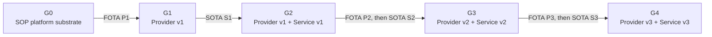

The arrows describe accepted graph transitions, not build activity. All
artifacts are built, tested, signed, and staged before the live presentation.

## G0 — SOP Platform Substrate Without Feature Components

### `AF-G0-LC` — Lifecycle flow

```mermaid
sequenceDiagram
    participant AC as AosCloud
    participant AU as AosCore on Unit
    participant RD as OEM Software Delivery Dashboard

    AC->>AU: Desired graph G0
    AU-->>AC: Unit online; platform substrate healthy
    AC-->>RD: Actual graph G0; no provider; no Brake Health service
    RD-->>RD: Present update-ready baseline as healthy
```

`G0` is a deliberate accepted desired state. The absence of feature-specific
components is not an error. Unit identity, provisioning, AosCore, KUKSA, the
generic extension runtime, and security substrate remain intact.

### `AF-G0-RT` — Runtime flow

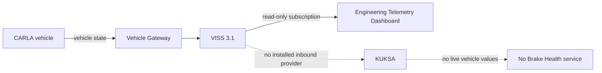

The Engineering Dashboard proves that CARLA, the Gateway, VSS, and base
telemetry work. It does not prove that the Domain Controller receives those
signals.

### `AF-G0-OB` — Observability flow

| Surface | Required evidence |
| --- | --- |
| CARLA scene | Vehicle drives through the city and can execute the controlled route |
| Engineering Dashboard | Base VISS telemetry is live |
| OEM Software Delivery Dashboard | Both Units are online on `G0`; provider and service are absent by design |
| AosCloud drill-down | Provisioned identity and actual component/service graph |
| Function Dashboard | No current vehicle data; clear `feature not deployed` state rather than an error |

### `AF-G0-RR` — Recovery and reset flow

```text
reset CARLA actors and route
  -> restore control mode and dashboard session
  -> request or verify desired graph G0
  -> verify no feature provider and no Brake Health service
  -> preserve Unit identity, certificates, AosCore, KUKSA and generic runtime
```

A reset must not deprovision a Unit or replace its persistent disk.

### G0 mapping gaps

- `GAP-G0-01`: prove that the installed SOP baseline contains the generic
  runtime required to accept post-SOP platform components while no provider is
  assigned.
- `GAP-G0-02`: define how AosCloud represents and restores the accepted
  component-absent `G0` graph.
- `GAP-G0-03`: implement the Software Delivery Dashboard `G0` view.
- `GAP-G0-04`: define a non-invasive proof that KUKSA has no live
  provider-owned values.

## G1 — Provider v1 Supplies the First Telemetry Subset

### `AF-G1-LC` — Lifecycle flow

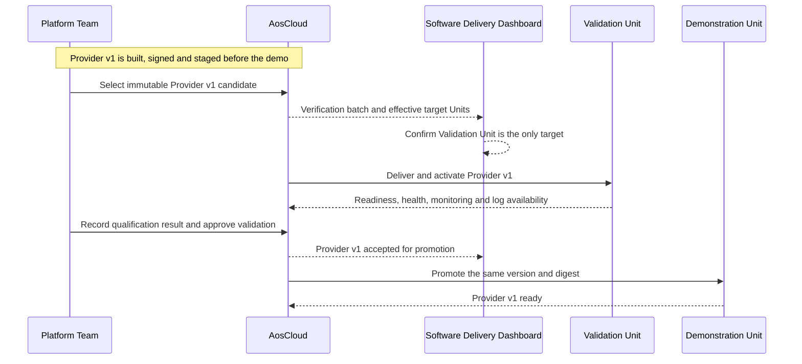

The Demonstration Unit must remain on `G0` until validation is accepted. A
fresh batch is required after Unit Set membership or role changes; an old
batch with stale target membership must never be approved.

### `AF-G1-RT` — Runtime flow

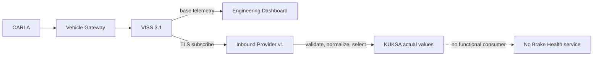

Provider v1 is inbound and read-only. It publishes only the accepted signal
subset and cannot use VISS Set or control vehicle motion.

### `AF-G1-OB` — Observability flow

| Surface | Required evidence |
| --- | --- |
| CARLA scene | Vehicle remains operational during and after provider deployment |
| Engineering Dashboard | Existing direct VISS telemetry remains uninterrupted |
| Software Delivery Dashboard | Target Unit, exact P1 identity, lifecycle state, validation gate and promotion |
| Provider/KUKSA evidence | Approved v1 values are live; unapproved paths remain unavailable |
| ELK view | Selected provider start, ready, source-loss and recovery events when requested or exported |
| Function Dashboard | Still no data because no service is installed |

### `AF-G1-RR` — Recovery and reset flow

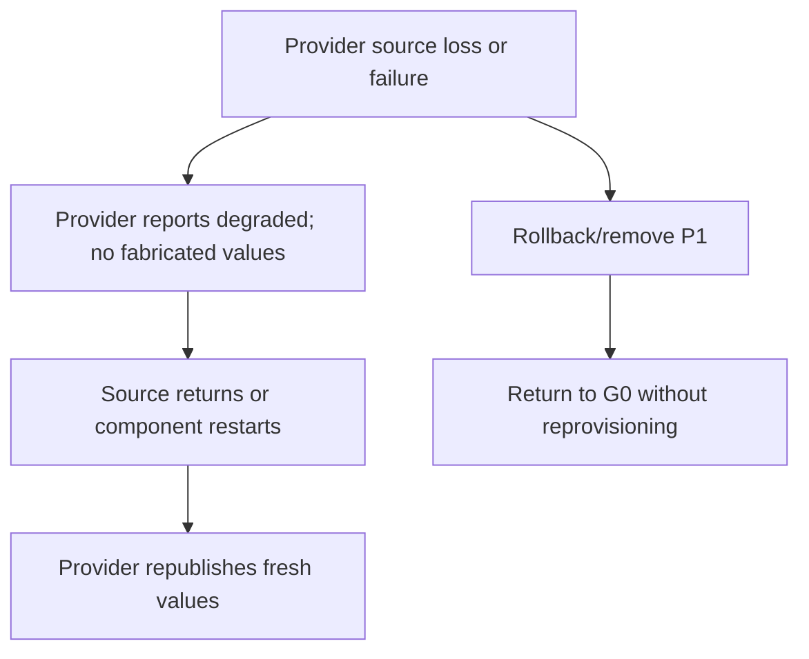

Provider failure must not stop CARLA, Vehicle Control, direct VISS telemetry,
AosCore, or KUKSA itself.

### G1 mapping gaps

- `GAP-G1-01`: reconcile the scenario's Provider v1 contract with the current
  `0.1.1` telemetry profile and provider `0.2.0` candidate.
- `GAP-G1-02`: install and qualify the generic Service Manager component
  runtime on the provisioned Validation Unit before provider deployment.
- `GAP-G1-03`: define provider readiness and health evidence available through
  AosCloud APIs.
- `GAP-G1-04`: implement effective-target preview and stale-batch protection in
  the Software Delivery Dashboard.
- `GAP-G1-05`: qualify the AosEdge log route and ELK presentation.

## G2 — Service v1 Sends Selected Data to the Function Backend

### `AF-G2-LC` — Lifecycle flow

```mermaid
sequenceDiagram
    participant FT as Brake Health Function Team
    participant AC as AosCloud
    participant VU as Validation Unit
    participant FB as Function Backend
    participant DU as Demonstration Unit

    Note over FT,AC: Service v1 is built, signed and staged before the demo
    FT->>AC: Select immutable Service v1 with dependency on P1
    AC->>VU: Install Service v1 through SOTA
    VU-->>AC: Service ready; required P1 capability satisfied
    VU->>FB: Send bounded v1 data stream
    FB-->>FT: Integration evidence and dashboard visibility
    FT->>AC: Accept Service v1 integration
    AC->>DU: Promote the same service version and digest
    DU-->>AC: Service v1 ready
```

The service lifecycle is independent of P1. Deploying, correcting, stopping,
or rolling back Service v1 must not rebuild or replace Provider v1.

### `AF-G2-RT` — Runtime flow

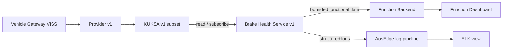

Service v1 does not read VISS directly, perform predictive diagnostics, or
request an advisory. The Function Backend does not read vehicle signals from
CARLA, VISS, KUKSA, or AosCloud directly.

### `AF-G2-OB` — Observability flow

| Surface | Required evidence |
| --- | --- |
| CARLA and Engineering Dashboard | Vehicle and base telemetry remain healthy |
| Software Delivery Dashboard | P1 remains unchanged; S1 is validated and promoted independently |
| Function Dashboard | Selected data, source Unit role, freshness, service version, and connectivity state |
| ELK view | Service start, KUKSA subscription, backend connection and bounded error evidence |
| AosCloud drill-down | Installed S1 version, instance state and resource monitoring |

### `AF-G2-RR` — Recovery and reset flow

```text
backend unavailable
  -> Service v1 follows a bounded queue, retry, or explicit drop policy
  -> vehicle/Gateway/provider/KUKSA remain healthy
  -> connectivity returns
  -> permitted pending data is delivered or the loss is reported factually

service failure
  -> AosCore reports failure and applies restart policy
  -> rollback/remove S1
  -> graph returns to G1; Provider v1 remains active
```

The exact queue policy is not selected in this mapping. A service must never
grow unbounded storage merely to preserve demo data.

### G2 mapping gaps

- `GAP-G2-01`: implement Service v1 behavior beyond the current ARM64 scaffold.
- `GAP-G2-02`: define the S1-to-P1 capability dependency and KUKSA access
  credential model.
- `GAP-G2-03`: select bounded raw samples, aggregates, or both for the v1
  backend contract.
- `GAP-G2-04`: implement the Function Backend and Function Dashboard.
- `GAP-G2-05`: define retry, duplicate delivery, retention, and data-freshness
  semantics.

## G3 — Provider v2 and Predictive Service v2

### `AF-G3-LC` — Lifecycle flow

```mermaid
sequenceDiagram
    participant FT as Function Team
    participant PT as Platform Team
    participant AC as AosCloud
    participant VU as Validation Unit
    participant RA as OEM Acceptance
    participant DU as Demonstration Unit

    FT->>PT: Versioned request for additional brake-health signals
    PT->>AC: Select staged backward-compatible Provider v2
    AC->>VU: FOTA P2
    VU-->>PT: Independent platform qualification evidence
    PT-->>FT: P2 capability handoff and contract
    FT->>AC: Select staged Service v2 requiring P2
    AC->>VU: SOTA S2
    VU-->>FT: Model and integration evidence
    FT->>RA: Exact P2 + S2 graph
    PT->>RA: Platform qualification and digest evidence
    RA->>AC: Accept exact graph
    AC->>DU: Promote P2 first
    DU-->>AC: P2 ready; S1 still compatible
    AC->>DU: Promote S2 second
    DU-->>AC: G3 ready
```

Platform qualification completes before functional integration. Joint
validation completes before either candidate is promoted to the Demonstration
Unit.

### `AF-G3-RT` — Runtime flow

```mermaid
flowchart LR
    CARLA["CARLA braking event"] --> EGO["Vehicle Gateway"]
    EGO --> VISS["VISS base + expanded signals"]
    VISS --> P2["Inbound Provider v2"]
    P2 --> KUKSA["Backward-compatible v1 + new v2 values"]
    KUKSA --> S2["Service v2 + versioned model"]
    S2 --> RESULT["Local prediction / health result"]
    RESULT --> FB["Function Backend"]
    FB --> FD["Function Dashboard"]
```

The model is prepared before the presentation and delivered as part of the
versioned S2 artifact. The live vehicle performs inference, not presentation-
time training. G3 reports the result but has no vehicle-facing advisory path.

### `AF-G3-OB` — Observability flow

| Surface | Required evidence |
| --- | --- |
| CARLA scene | The same deterministic obstacle and braking maneuver used for comparison |
| Engineering Dashboard | Base telemetry and braking profile remain visible |
| Software Delivery Dashboard | P2 platform qualification, capability handoff, S2 integration, exact graph acceptance and ordered promotion |
| Function Dashboard | New signals, simulated/estimated labels, model version, prediction result and event time |
| ELK view | P2 mapping/readiness and S2 model-load/inference events without exposing secrets or raw sensitive payloads |

### `AF-G3-RR` — Recovery and reset flow

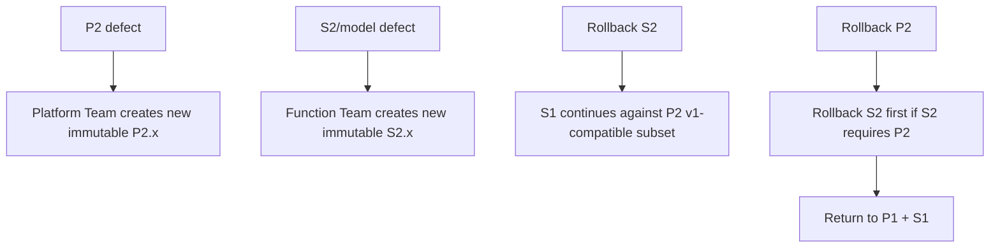

Rollback follows reverse dependency order. A service defect does not create a
new FOTA artifact; a confirmed provider defect does.

### G3 mapping gaps

- `GAP-G3-01`: define and simulate the additional brake-health signals.
- `GAP-G3-02`: define P2 backward-compatibility and contract negotiation.
- `GAP-G3-03`: define the model artifact identity, input schema, deterministic
  output and resource limits.
- `GAP-G3-04`: define the capability-request and platform-handoff evidence
  displayed to the audience.
- `GAP-G3-05`: define the exact graph-acceptance record and promotion check.

## G4 — Bidirectional Local Advisory

### `AF-G4-LC` — Lifecycle flow

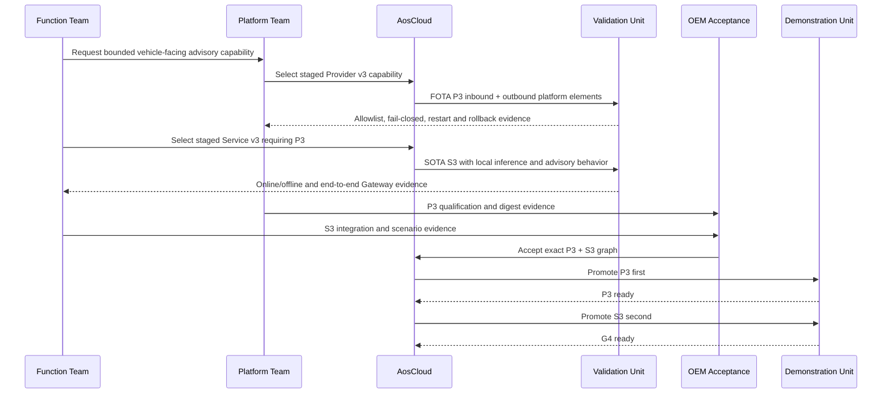

The physical packaging may use separate inbound and outbound providers even
though the scenario calls the combined platform capability `Provider v3`.

### `AF-G4-RT` — Runtime and offline flow

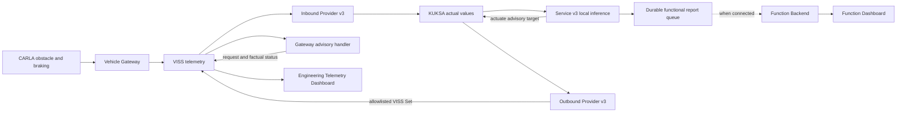

The local inference and Gateway advisory path remain active without Cloud
connectivity. The backend receives the functional report later and never
authorizes the immediate advisory.

No HMI or Instrument Cluster is implemented. The accepted proof ends at the
Gateway request/status visible on the Engineering Dashboard.

### `AF-G4-OB` — Observability flow

| Surface | Required evidence |
| --- | --- |
| CARLA scene | Controlled obstacle appears and the vehicle performs the deterministic hard-braking maneuver |
| Engineering Dashboard | Brake event, local advisory target, Gateway `RECEIVED`/`REJECTED`/`FAILED` status and elapsed local time |
| Software Delivery Dashboard | P3/S3 validation, exact graph, ordered promotion, Unit connectivity and current versions |
| Function Dashboard | Pending/offline state, later synchronized report, original event time and model version |
| ELK view | Selected local inference, actuation-policy, Gateway delivery, queue and reconnection events |
| AosCloud drill-down | Unit stays provisioned; service and platform component states remain observable during Cloud reconnection |

The Engineering Dashboard must not display `displayed to driver` or `driver
acknowledged` because the demo contains no driver HMI.

### `AF-G4-RR` — Recovery and reset flow

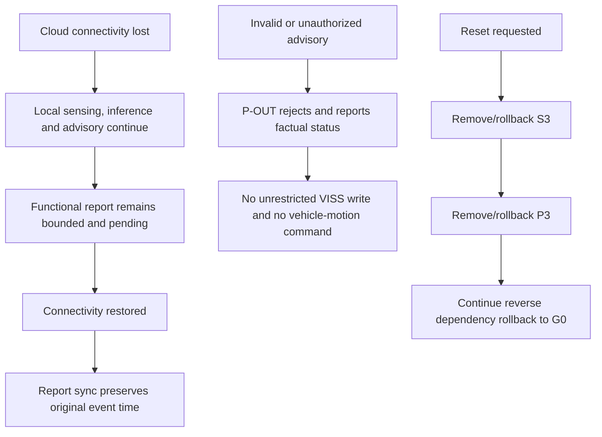

An outbound provider failure must fail closed. It cannot broaden the allowed
path, accept arbitrary text, or expose braking, steering, or acceleration
control.

### G4 mapping gaps

- `GAP-G4-01`: define the versioned advisory actuator and Gateway-status VSS
  contract.
- `GAP-G4-02`: implement scoped VISS Set and the Gateway advisory handler.
- `GAP-G4-03`: implement and qualify the outbound KUKSA provider and explicit
  allowlist.
- `GAP-G4-04`: define Service v3 local-decision and advisory state machine.
- `GAP-G4-05`: implement bounded durable report retention and reconnect sync.
- `GAP-G4-06`: extend the Engineering Dashboard with target and factual Gateway
  status.
- `GAP-G4-07`: define the production authorization-adapter path and the bounded
  demo credential exception until it exists.

## Cross-Stage Observability Architecture

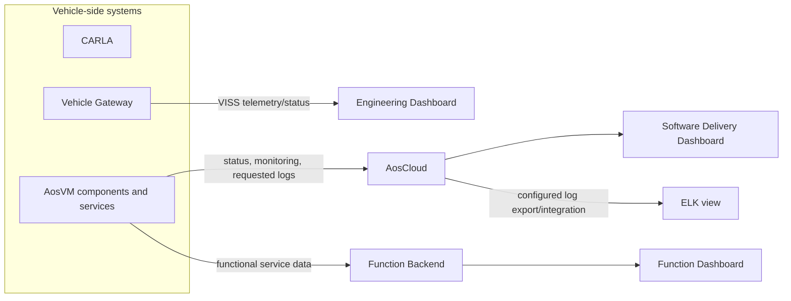

The surfaces have non-overlapping authority:

| Surface | Authority | Must not be used as |
| --- | --- | --- |
| CARLA scene | Physical stimulus and visible vehicle motion | Software lifecycle source of truth |
| Engineering Dashboard | Gateway VISS telemetry and factual advisory status | Proof that KUKSA or backend received data |
| Software Delivery Dashboard | Presentation of real AosCloud lifecycle state | Independent desired-state database |
| AosCloud | Unit desired/actual software state and lifecycle evidence | Functional telemetry backend |
| ELK | Operational logs and troubleshooting evidence | Vehicle telemetry or functional product database |
| Function Dashboard | Functional data and prediction/report state | FOTA/SOTA lifecycle authority |

## Cross-Stage Reset Flow

```mermaid
sequenceDiagram
    participant OR as Demo Orchestrator
    participant AC as AosCloud
    participant DU as Demonstration Unit
    participant VU as Validation Unit
    participant FB as Function Backend
    participant CS as CARLA Scenario

    OR->>AC: Select accepted desired graph G0
    AC->>DU: Remove/rollback services, then providers
    AC->>VU: Remove/rollback services, then providers
    DU-->>AC: G0 actual; identity unchanged
    VU-->>AC: G0 actual; identity unchanged
    OR->>FB: Clear demo-only incidents and model presentation state
    OR->>CS: Restore fixed route, actors and deterministic seed
    CS-->>OR: Ready at pre-show position
```

Reset is an architecture flow, not a manual cleanup script. It must be
observable, bounded, repeatable, and unable to delete Unit provisioning or
private identity material.

## Scenario-to-Flow Traceability

| Demo Scenario 1.0 statement | Architecture flow coverage |
| --- | --- |
| SOP-integrated AosEdge substrate enables post-SOP extension | `AF-G0-LC`, `AF-G0-RR` |
| Working CARLA vehicle and direct engineering telemetry before providers | `AF-G0-RT`, `AF-G0-OB` |
| First narrow vehicle-data capability through validation and FOTA promotion | `AF-G1-LC`, `AF-G1-RT` |
| Provider logs visible through configured ELK integration | `AF-G1-OB`, cross-stage observability |
| First SOTA consumer publishes selected data to Function Backend | `AF-G2-LC`, `AF-G2-RT` |
| Platform and Function Teams independently iterate P2 and S2 | `AF-G3-LC`, `AF-G3-RR` |
| Expanded simulated signals support deterministic local inference | `AF-G3-RT`, `AF-G3-OB` |
| Same accepted artifact graph reaches the Demonstration Unit | `AF-G1-LC`, `AF-G2-LC`, `AF-G3-LC`, `AF-G4-LC` |
| Local advisory reaches Gateway without Cloud | `AF-G4-RT`, `AF-G4-OB` |
| No IVI claim; Engineering Dashboard shows Gateway evidence | `AF-G4-OB` |
| Function report synchronizes after connectivity returns | `AF-G4-RT`, `AF-G4-RR` |
| Complete demo returns to the initial state without reprovisioning | cross-stage reset, `AF-G0-RR` |

Every accepted scenario claim has a mapped flow. This does not yet mean that
every mapped flow has an implementation.

## Consolidated Gap Register

| Gap group | Architectural capability still required |
| --- | --- |
| SOP substrate | Install and prove the generic component runtime on both provisioned Units while keeping `G0` feature-empty |
| Desired-state control | Represent G0–G4, dependencies, reverse-order rollback, effective targets and exact accepted graph |
| CARLA stimulus | Implement deterministic obstacle, hard braking, reset and repeatability |
| Inbound platform | Reconcile and evolve P1/P2 contracts, readiness, health, source-loss and compatibility |
| SOTA application | Implement Service v1, model-based Service v2 and local advisory Service v3 |
| Functional Cloud | Implement backend, bounded ingestion, duplicate handling, event-time preservation and dashboard |
| Bidirectional platform | Implement actuator contract, outbound provider, VISS Set, Gateway handler and status |
| Authorization | Define least-privilege KUKSA publication/read/actuation and future Aos authorization adapter |
| Logging | Qualify AosEdge log collection/export, ELK integration, filtering, access control and retention |
| Demo presentation | Implement Software Delivery Dashboard and extend Engineering Dashboard |
| Reset | Prove component removal/rollback to G0 without deprovisioning or stale Cloud state |
| Timing | Define presentation budgets, update timeouts, local event-to-advisory measurement and recovery bounds |

No gap requires changing the accepted five-stage scenario at this time. A gap
may still reveal an HLA amendment or scenario change during review; such a
change requires an explicit new architecture or scenario decision.

## Architecture-Flow Acceptance Gate

This mapping is ready to become Architecture Flows 1.0 only when reviewers
confirm that:

1. every G0–G4 lifecycle and runtime transition is represented;
2. no dashboard or Cloud system is assigned authority it does not own;
3. Validation and Demonstration Unit targeting is explicit before approval;
4. current, candidate, and planned elements are labelled accurately;
5. every cross-component interface has one producer, one consumer, and an
   owning team;
6. local inference and advisory are independent of Cloud connectivity;
7. no driver-HMI or production-fleet behavior is claimed;
8. failures and rollback stop at the narrowest affected layer;
9. reset preserves Unit identity and the SOP platform substrate;
10. each audience-visible scenario statement has an architecture-flow trace.

## Next Requirements Gate

After this mapping is accepted, requirements should be derived in this order:

1. end-to-end system requirements for each `AF-Gn-XX` flow;
2. versioned interface and data-contract requirements;
3. lifecycle, dependency, validation, promotion, rollback, and reset
   requirements;
4. security, authorization, resource, privacy, observability, offline, timing,
   and failure requirements;
5. allocation of the accepted requirements to CARLA, Vehicle Gateway,
   platform providers, AosCore integration, Brake Health service, Cloud
   backend, dashboards, logging integration, and orchestration components;
6. acceptance tests and evidence linked back to both requirement and flow IDs.

Implementation planning begins only after that requirements package is
reviewed. This draft authorizes neither requirements acceptance nor code,
artifact, Cloud, or Unit changes.
