<!-- SPDX-FileCopyrightText: 2026 maninblack -->
<!-- SPDX-License-Identifier: MIT -->

# Demo Scenario Architecture Flows 1.6

- Status: Accepted architecture-flow baseline
- Version: 1.6
- Prepared: 2026-08-19
- Accepted: 2026-08-19
- Supersedes: 1.5
- Owner: System Architecture
- Architecture input: [High-Level Architecture 1.4](high-level-architecture.md)
- Scenario input: [Staged Post-SOP Brake and Tire Health Demo Scenarios 1.7](../demo/staged-post-sop-brake-health-demo-scenarios.md)
- CARLA input: [R10 Native CARLA Vehicle Telemetry Inventory](../research/demo-foundation/r10-carla-telemetry-and-function-team-2.md)
- Requirements input: [System Requirements and Traceability 0.9](../requirements/system-requirements-and-traceability.md)
- Component input: [Component Decomposition and Interface Register 1.0](../requirements/component-decomposition-and-interface-register.md)
- Accepted architecture decisions: [ADR 0009](decisions/0009-separate-release-decision-from-cloud-execution.md),
  [ADR 0010](decisions/0010-aos-kuksa-credential-broker.md), and
  [ADR 0011](decisions/0011-qm-service-containment-and-evidence-backed-oem-approval.md)
- Implementation, build, signing, Cloud, or Unit mutation authorized: no

## Purpose

This document is the traceability bridge between the static capability model
in High-Level Architecture 1.4, the audience-visible Demo Scenario 1.7, and the
next component-requirements package.

It defines how software, data, decisions, evidence, and ownership move through
the complete canonical demonstration lifecycle:

```text
M0 manufacturing
  -> M1 end-of-line provisioning
  -> G0 provisioned SOP substrate
  -> G1 Vehicle Data Platform Component v1
  -> G2 Brake Health Service v1 event-window acquisition
  -> G3 VDP Component v2 + edge-analytics Service v2
  -> G4 bidirectional VDP Component v3 + Service v3
  -> T1 independent Tire Health Service
  -> R0 retirement of the current demo run
```

`M0` and `M1` describe manufacturing and onboarding, `G0–G4` describe the
accepted substrate and Brake Health software graphs, `T1` adds the independent
Tire Health SOTA 2 product, and `R0` retires the complete current run. `T1`
follows `G4` in the presentation because it uses the accepted VDP v3 contract;
it does not depend on Function Team 1. The next-run reset retires the two
current Units and discards their provisioned overlays; it is not a reverse OTA
rollout.

## Source Precedence and Change Control

When the inputs differ, use this order:

1. High-Level Architecture 1.4 owns component boundaries, interfaces,
   authority, security boundaries, and architectural invariants.
2. Demo Scenario 1.7 owns stage order, component presence, audience-visible
   proof, and the manufacturing-to-retirement narrative.
3. This document owns detailed cross-component flow mapping and exposes gaps;
   it does not silently change either source.
4. R10 owns the inventory of native CARLA data; ADR 0008 owns the Tire Health
   selection that supersedes its former low-friction candidate.

A contradiction found here must be resolved in the owning source before it
becomes a requirement.

## Flow Identifier Convention

| Suffix | Flow type | Question answered |
| --- | --- | --- |
| `LC` | Lifecycle | How is an image, Unit, FOTA capability, or SOTA service created, validated, accepted, promoted, or retired? |
| `RT` | Runtime | How do vehicle data, local decisions, reports, or actuator requests move? |
| `OB` | Observability | Which authoritative system and audience surface prove the state? |
| `FR` | Failure and recovery | Which layer contains a failure, and how can operation recover without widening authority? |

Stage flow identifiers use `AF-<stage>-<type>`, for example `AF-G3-LC`.
Cross-stage flows use `AF-X-<name>`. The `T1` stage retains the stable
`AF-TIRE-<type>` identifiers so existing requirement and traceability links do
not change.

## Architecture Role Catalogue

| ID | Architecture role | Owner | Current or target state |
| --- | --- | --- | --- |
| `CARLA` | Virtual physical vehicle, environment, native sensors, and actuators | CARLA repositories | Current |
| `SCENE` | Deterministic obstacle/braking scenario, explicit free-drive/brake-event world context, manual takeover, safe stop, actor cleanup, and accelerated/pre-aged tire degradation stimulus | `carla-ego-runtime` tooling | Brake Event core current; complete context-transition matrix and `T1` stimulus target |
| `CONTROL` | Vehicle Control UI and separate control channel | `carla-ego-runtime` | Current |
| `GATEWAY` | Vehicle Gateway ECU behavior, CARLA sampling, VSS normalization | `carla-ego-runtime` | Current |
| `VISS` | TLS VISS 3.1 server | `carla-ego-runtime` | Get/Subscribe current; narrowly scoped Set target |
| `GW-ADV` | Typed maintenance-advisory handler and factual Gateway status | `carla-ego-runtime` | Target |
| `ENG-DASH` | Engineering Telematics Dashboard | `carla-ego-runtime` | Vehicle telemetry current; advisory/status extension target |
| `FACTORY` | Immutable OEM Demo Factory Image with enabled stock IAM permission handling and a non-secret IAM/PKCS#11 signing-key integration seam | Platform Team | Target acceptance artifact; no clean accepted image yet |
| `RUNTIME` | Preinstalled provider-specific empty-slot component runtime | Platform Team / `aos-vehicle-platform` | Engineering evidence exists; final factory-image qualification remains open |
| `AOS-CORE` | Identity, desired state, Service Manager, security, update support | AosCore in AosVM | Current on existing provisioned Units |
| `KUKSA` | Unmodified Eclipse Databroker and stable service-facing vehicle-data boundary in the Domain Controller | SOP substrate plus Platform Team contract/trust configuration | Executable present; final shared contract and broker-issued credential flow remain design gates |
| `VU` | Validation Unit, a fresh Domain Controller instance | Demo lifecycle | Target per-run role |
| `DU` | Demonstration Unit, a separate fresh Domain Controller instance | Demo lifecycle | Target per-run role |
| `VDP` | Vehicle Data Platform Component payload: inbound/outbound providers, versioned contract and thin Aos–KUKSA Credential Broker | Platform Team, FOTA lifecycle | Inbound engineering candidate exists; accepted v1-v3 and credential graph is target |
| `BHS` | Brake Health service and versioned local model | Function Team 1 / Service Provider 1, SOTA 1 | Service scaffold exists; accepted v1-v3 behavior is target |
| `TIRE` | Tire Health in-vehicle service | Function Team 2 / Service Provider 2, SOTA 2 | Selected in ADR 0008; detailed design and implementation are target |
| `BRAKE-BE` | Brake Health functional backend | Function Team 1 | Target |
| `BRAKE-DASH` | Brake Health Function Dashboard | Function Team 1 | Target |
| `TIRE-BE` | Tire Health backend | Function Team 2 | Target |
| `TIRE-DASH` | Tire Health Function Dashboard | Function Team 2 | Target |
| `AOS-CLOUD` | Lifecycle system of record and execution control plane: provisioning, desired/reported actual state, batches, campaigns, recorded approvals, audit and FOTA/SOTA delivery | AosCloud | Current platform; exact demo operations require qualification |
| `SW-DASH` | Stateless OEM Software Delivery Dashboard over AosCloud APIs; shows lifecycle state, native log requests/results, decision owner and active Cloud role, and invokes only explicitly confirmed OEM-authorized actions | Demo solution | Target |
| `ORCH` | Demo-session, overlay, Unit binding, replay, and retirement orchestration without lifecycle-state or approval ownership | `aosedge-sdv-demo` | Target |

The catalogue distinguishes an implemented component from an accepted demo
capability. Existing provisioned VMs, signed candidates, and local build
artifacts are engineering evidence; they do not substitute for the clean
manufacturing and deployment sequence described here.

## State and Presence Model

```mermaid
flowchart LR
    M0["M0<br/>two unprovisioned factory overlays"]
    M1["M1<br/>two unique Online Units"]
    G0["G0<br/>SOP substrate<br/>empty capability slot"]
    G1["G1<br/>VDP Component v1"]
    G2["G2<br/>VDP Component v1 + Brake Health v1"]
    G3["G3<br/>VDP Component v2 + Brake Health v2"]
    G4["G4<br/>VDP Component v3 + Brake Health v3"]
    T1["T1<br/>G4 graph + independent Tire Health"]
    R0["R0<br/>Units retired<br/>overlays discarded"]

    M0 -->|"provision once"| M1 --> G0
    G0 -->|"FOTA v1"| G1
    G1 -->|"SOTA 1 v1"| G2
    G2 -->|"FOTA v2, then SOTA 1 v2"| G3
    G3 -->|"FOTA v3, then SOTA 1 v3"| G4
    G4 -->|"independent SOTA 2"| T1
    T1 -->|"retire current run"| R0
```

| State | Unit identity | Vehicle Data Platform payload | Brake Health service | Outbound advisory | Function Team 2 service |
| --- | --- | --- | --- | --- | --- |
| `M0` | None in Cloud | Absent; runtime slot empty | Absent | Absent | Absent |
| `M1` | Unique VU and DU identities | Absent; runtime slot empty | Absent | Absent | Absent |
| `G0` | Unchanged from M1 | Absent; runtime slot empty | Absent | Absent | Absent |
| `G1` | Unchanged | VDP Component v1 | Absent | Absent | Absent |
| `G2` | Unchanged | VDP Component v1 | Service v1 | Absent | Absent |
| `G3` | Unchanged | Backward-compatible VDP Component v2 | Service v2 + model | Absent | Absent |
| `G4` | Unchanged | VDP Component v3 inbound + allowlisted outbound | Service v3 | Present | Absent in the `G0–G4` Brake Health sequence |
| `T1` | Unchanged | VDP Component v3 unchanged | Service v3 unchanged | Brake and Tire typed targets present | Tire Health service present through independent SOTA 2 |
| `R0` | Retired and unable to reconnect | Overlay discarded | Overlay/backend session state retired | Not applicable | Not applicable |

Function Team 2 is the independent `T1` flow defined later in this document.
Its position after `G4` is presentation order, not a dependency on Brake
Health. It consumes the compatible VDP v3 contract while the accepted Brake
Health graph remains unchanged.

## Cross-Stage Invariants

All flows below preserve these rules:

1. CARLA is the virtual physical vehicle, the Vehicle Gateway is a separate
   ECU boundary, and each AosVM is a Domain Controller ECU boundary.
2. Functional services use KUKSA only; they never connect directly to CARLA or
   VISS.
3. Vehicle control is separate from vehicle telemetry and unavailable to both
   functional services.
4. VU always receives and qualifies a candidate before the same accepted bytes
   and digest are promoted to DU.
5. Vehicle Data Platform Component updates use FOTA; Brake Health and Tire
   Health updates use their
   independent SOTA lifecycles.
6. A SOTA service declares a compatible Vehicle Data Platform Component and
   does not install when that dependency is unmet.
7. Local analysis continues without Cloud connectivity; functional Cloud
   delivery is asynchronous and bounded.
8. AosCloud is the lifecycle system of record and execution control plane, not
   the owner of engineering release decisions or a functional telemetry backend.
9. Native AosEdge logs are operational evidence presented from AosCloud; they
   are not vehicle telemetry or functional product data.
10. Engineering Dashboard evidence proves the Gateway view only; it does not
    prove KUKSA, a functional backend, or driver display.
11. No artifact contains a reusable Unit identity, private credential, or
    per-vehicle secret.
12. Normal presentation moves forward. Rollback is qualification evidence and
    recovery behavior, not the normal reset mechanism.
13. Native Cloud rejection of an incompatible SOTA-to-FOTA graph is a target
    capability deferred until a supporting AosEdge release is qualified. No
    temporary project-side admission controller substitutes for it.
14. The Platform Team and each Function Team own their engineering release
    decisions. Function Teams publish through Service Provider identities, but
    approvals affecting OEM Units use authorized OEM identities.
15. Passing qualification evidence never auto-approves a candidate. A combined
    FOTA/SOTA graph requires separate explicit acceptance by the Platform Team
    and the relevant Function Team before AosCloud executes promotion.
16. Upstream Eclipse KUKSA remains unchanged. Each SOTA service exchanges its
    per-instance `AOS_SECRET` with the VDP-owned Credential Broker; the broker
    validates it through Aos IAM and translates only the currently registered,
    VDP-contract-compatible permissions into a short-lived JWT. It owns no
    parallel service identity or per-service policy database.

<a id="af-x-auth"></a>
## `AF-X-AUTH` — Cross-cutting Aos-to-KUKSA credential flow

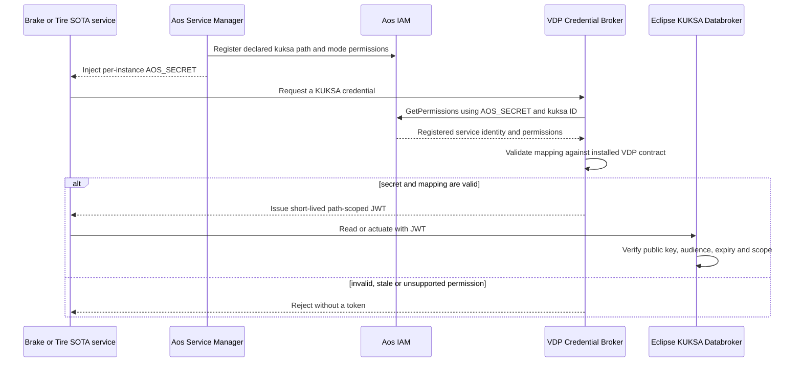

The broker is a thin internal responsibility of the FOTA-delivered Vehicle
Data Platform Component, not a separate SOTA service or identity provider.
Aos Service Manager and IAM own SOTA instance identity, `AOS_SECRET` and
registered permission lifecycle. The privileged provider uses a separate
short-lived platform credential whose FOTA-component identity binding remains
a qualification gate; functional services never receive KUKSA `provide` or
`create` authority. Cloud-side permission rejection before Unit transfer
remains a future native AosCloud feature; the current
authoritative enforcement point is this local fail-closed exchange.

## M0 — Manufacturing Output

<a id="af-m0-lc"></a>
### `AF-M0-LC` — Factory-image and overlay creation

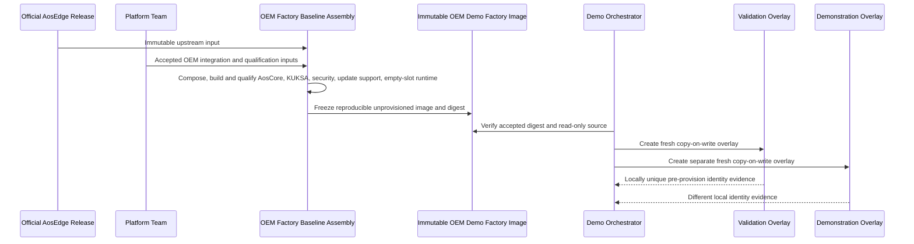

The factory image contains the provider-specific runtime and an empty component
store, but no provider payload, SOTA service, Cloud Unit, Cloud certificate,
KUKSA service token, or other reusable vehicle identity.

`BA` is the build-time logical component. `FI` is its immutable output
artifact. `VO` and `DO` are separate runtime deployments created from that
artifact; none is an instance of `BA`.

<a id="af-m0-ob"></a>
### `AF-M0-OB` — Manufacturing evidence

| Evidence owner | Audience proof |
| --- | --- |
| Factory artifact manifest | Source release, OEM image version, immutable digest, architecture, and qualification reference |
| Local overlay inventory | Exactly two fresh overlays with Validation and Demonstration roles |
| Identity preflight | Different system, Node-seed, SSH, hostname/network, and first-boot identity material as applicable |
| Software Delivery Dashboard | Both instances show `Manufactured / Awaiting provisioning`; no Cloud Unit ID exists |
| Component inventory | Empty provider store and no functional service payload |

<a id="af-m0-fr"></a>
### `AF-M0-FR` — Failure containment

- A digest mismatch blocks overlay creation.
- A non-empty provider store or embedded Cloud credential rejects the factory
  image.
- Duplicate local identity material rejects both overlays before provisioning.
- A failed overlay creation is discarded; the immutable factory image is never
  repaired in place.
- Existing provisioned demo VMs must not be relabelled as new manufacturing
  output.

### M0 requirement inputs

- Freeze the exact accepted factory-image recipe and digest.
- Define first-boot identity generation and duplicate-detection evidence.
- Prove the provider-specific runtime is healthy with an empty slot.
- Define overlay storage, naming, locking, and recoverable cleanup.

## M1 — End-of-Line Provisioning

<a id="af-m1-lc"></a>
### `AF-M1-LC` — Provisioning and lane assignment

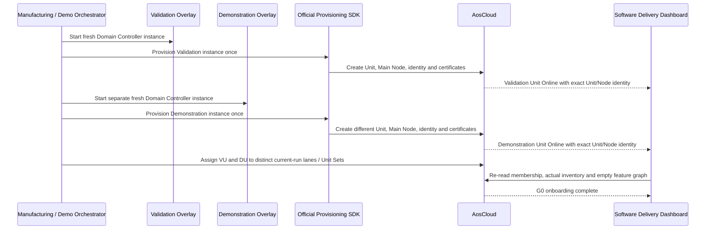

Provisioning is a once-per-overlay identity operation. VU and DU retain their
identities throughout `G0–T1`; no FOTA or SOTA step reprovisions them.

<a id="af-m1-ob"></a>
### `AF-M1-OB` — Provisioning evidence

| Surface | Required evidence |
| --- | --- |
| Software Delivery Dashboard | Session start, local role, Unit ID, Main Node ID, lane/Unit Set, Online state, and empty feature graph |
| AosCloud drill-down | Authoritative Unit/Node identity, actual state, platform/runtime inventory, and current membership |
| Local VM evidence | Overlay-to-Unit binding and distinct certificates/SSH host identities without exposing secrets |
| Audience state | Two visibly separate lanes: Validation and Demonstration |

Before M1 the session is correlated by start time and local overlay roles.
After M1 it is bound to the two Unit IDs and the same time window.

<a id="af-m1-fr"></a>
### `AF-M1-FR` — Fail-closed provisioning

- After the SDK begins, an uncertain or partial result is preserved for
  reconciliation; it is never blindly retried.
- A Unit whose role or Unit Set cannot be proven is not eligible for an update.
- Duplicate identity or certificate evidence blocks both Units.
- One successful Unit and one failed Unit do not constitute a complete M1.
- Cleanup of a failed disposable attempt follows the separately qualified
  deprovision/delete flow; local overlay deletion alone is insufficient.

### M1 requirement inputs

- Qualify provisioning success, partial failure, timeout, and reconciliation.
- Prove unique identities for two fresh overlays.
- Define exact lane/Unit Set creation and membership checks.
- Measure duration and define an honest presentation mode.

## G0 — Provisioned SOP Substrate Without Feature Payloads

<a id="af-g0-rt"></a>
### `AF-G0-RT` — Working vehicle, empty Domain Controller feature graph

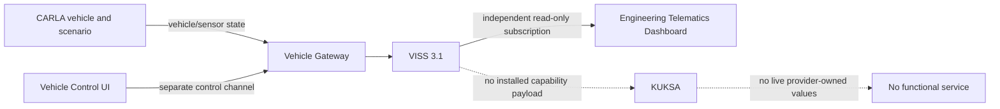

The vehicle is healthy and visibly operational. The Domain Controller is
online and update-ready, but the provider slot is empty. Absence of vehicle
data in KUKSA is a deliberate accepted state, not a platform fault.

<a id="af-g0-ob"></a>
### `AF-G0-OB` — Baseline proof

| Surface | Required evidence |
| --- | --- |
| CARLA scene | Vehicle drives in the city; manual/autopilot handover and safe stop remain available |
| Engineering Telematics Dashboard | Live Gateway telemetry independent of the Domain Controller |
| Software Delivery Dashboard | Both Units online, runtime present, provider/service payloads absent |
| KUKSA qualification probe | No live provider-owned values; no fabricated zeros |
| Functional dashboards | Explicit `feature not deployed`, not a transport error |

<a id="af-g0-fr"></a>
### `AF-G0-FR` — Baseline failure boundaries

- Vehicle-control failure invokes the existing Gateway safe-stop behavior and
  does not mutate either Unit.
- Gateway/VISS failure is visible as source loss; it does not make the empty
  provider slot unhealthy.
- AosCloud connectivity loss does not stop CARLA, the Gateway, or direct
  Engineering Dashboard telemetry.
- An unexpected provider or service blocks the demo because `G0` is no longer
  clean.

### G0 requirement inputs

- Define non-invasive proof of the empty provider slot and empty functional
  graph on both Units.
- Define how the one visible CARLA/Gateway source is bound to the selected Unit
  or deterministically replayed without implying two simultaneous vehicles.
- Implement the Software Delivery Dashboard baseline view.

<a id="af-x-drive"></a>
### `AF-X-DRIVE` — Drive-mode and world-context transitions

Drive mode and simulated-world context are related but independent state. The
controller remains the only ego actor and synchronous-clock owner throughout.

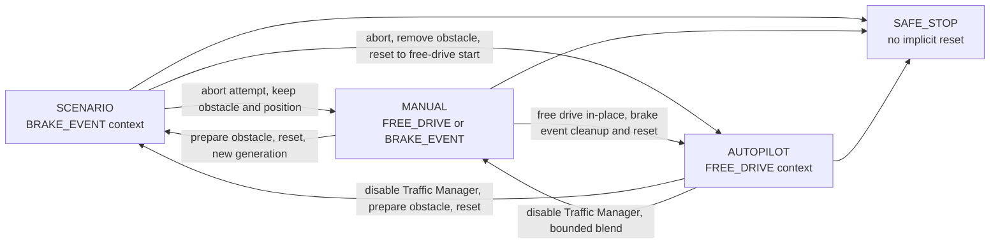

| Transition | Ordered flow |
| --- | --- |
| Scenario to Manual | Record an unfinished attempt as `ABORTED`; retain ego pose and the `BRAKE_EVENT` obstacle; begin manual control without replacing actor, clock, run or telemetry identity. |
| Scenario or brake-event Manual to Autopilot | Record an unfinished attempt as `ABORTED`; select safe stop; remove scenario-owned obstacle state; reset the same actor to the accepted free-drive start with zero linear/angular motion; increment reset generation; validate lane/alignment; enable Traffic Manager. |
| Free-drive Manual to Autopilot | Validate lane/alignment and hand over in place without a world reset. |
| Autopilot to Manual | Disable Traffic Manager before accepting manual actuation and apply the bounded pedal-safe blend. |
| Manual or Autopilot to Scenario | Select safe stop; disable Traffic Manager if active; prepare the canonical obstacle; reset the same actor; clear attempt-local evidence; increment scenario/reset generation; start a new attempt. |
| Scenario to Scenario | Mark an unfinished attempt `ABORTED`, then perform the same canonical reset and start a new generation. |
| Any mode to Safe Stop | Stop the vehicle without deleting scenario state, changing world context or claiming a reset. |

`PASS`, `FAIL` or collision selects safe stop. A Scenario restart or transition
to Autopilot is the deterministic recovery path from a blocked position.
Reverse control is outside the current contract. Traffic Manager automatic
lane changing is disabled, so obstacle avoidance is not claimed and the
brake-event obstacle cannot remain when free-drive Autopilot is enabled.

The Gateway/VISS engineering projection exposes drive mode, world context,
scenario state/result, generation and reset/discontinuity state. The
Engineering Telematics Dashboard presents those facts without joining the
control path. A failed obstacle cleanup, reset or lane validation leaves the
vehicle in safe stop and does not partially activate the requested mode.

## G1 — Vehicle Data Platform Component v1

<a id="af-g1-lc"></a>
### `AF-G1-LC` — FOTA validation and promotion

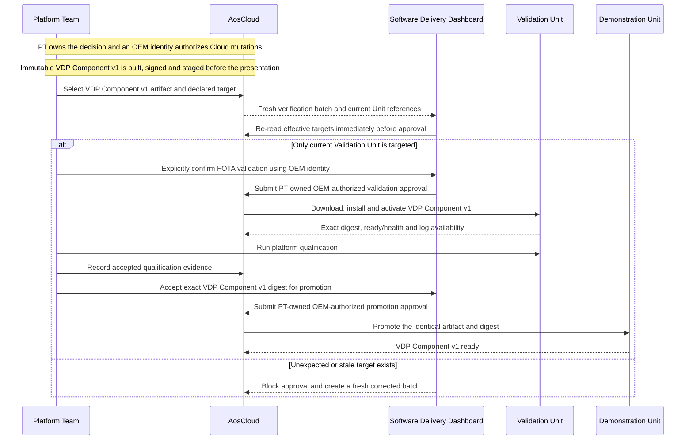

Current Unit Set membership alone is not accepted as target proof. The
dashboard derives effective scope from current Unit pending-batch state and
blocks stale or unexpected membership before approval.

<a id="af-g1-rt"></a>
### `AF-G1-RT` — First vehicle-data path into KUKSA

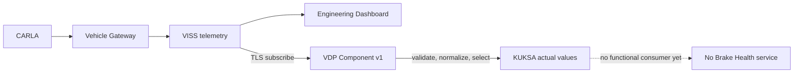

VDP Component v1 is read-only toward the vehicle. It publishes only the accepted v1
subset and has no VISS Set or vehicle-control permission.

<a id="af-g1-ob"></a>
### `AF-G1-OB` — Platform-capability proof

| Surface | Required evidence |
| --- | --- |
| Software Delivery Dashboard | Exact artifact, target preview, download/install/activate states, qualification, validation approval, promotion, and selected native provider log requests/results |
| AosCloud | Authoritative desired/actual component state and Unit status |
| KUKSA probe | Only the approved v1 values are present and fresh |
| Engineering Dashboard | Direct VISS telemetry remains uninterrupted |
| Brake Health Dashboard | Still `service not deployed` |

<a id="af-g1-fr"></a>
### `AF-G1-FR` — Provider failure and rollback

```text
vehicle source lost
  -> Provider marks values unavailable/degraded; never fabricates values
  -> source returns or provider restarts
  -> only fresh values resume

VDP Component v1 defect
  -> contain failure to VDP payload
  -> rollback/remove VDP Component v1 through qualified FOTA flow
  -> G0 substrate, Unit identity, AosCore, KUKSA, CARLA and Gateway remain
```

Rollback is an engineering recovery flow. The normal presentation does not use
it to reset the complete demo.

### G1 requirement inputs

- Freeze the exact v1 signal contract and freshness behavior.
- Qualify runtime install, health, restart, source loss, and rollback.
- Define authoritative target-preview and validation evidence.
- Qualify native AosCloud system/component log requests, results, access, and
  failure behavior before promising log evidence.

## G2 — Brake Health Service v1

<a id="af-g2-lc"></a>
### `AF-G2-LC` — Independent SOTA 1 delivery

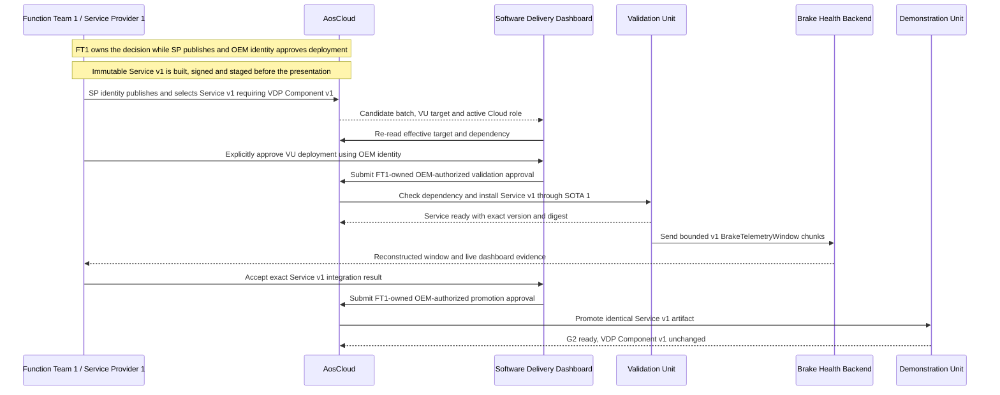

Service v1 can be updated, stopped, or rolled back without rebuilding or
replacing VDP Component v1.

<a id="af-g2-rt"></a>
### `AF-G2-RT` — Bounded braking-event acquisition

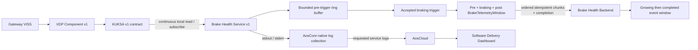

`S1` owns `RING`, `TRIGGER`, and `WINDOW`; those
labels expose its internal dataflow rather than additional deployable
components. The first chunk emitted when braking begins contains the bounded
pre-trigger history, active and post-trigger chunks follow in order, and one
completion record closes the finite event. Service v1 performs no prediction
and requests no advisory. Its backend does not connect directly to CARLA,
VISS, KUKSA, or AosCloud.

<a id="af-g2-ob"></a>
### `AF-G2-OB` — First functional-service proof

| Surface | Required evidence |
| --- | --- |
| Software Delivery Dashboard | VDP Component v1 unchanged; independent Service v1 dependency, validation and promotion; selected native service-log request/status/result |
| Brake Health Dashboard | A growing then completed `BrakeTelemetryWindow`, pre/active/post phase, source Unit role, event time, freshness, chunk/completion state and service version |
| Engineering Dashboard | Vehicle/Gateway telemetry remains independent and live |
| AosCloud | Service instance state and resource monitoring |

<a id="af-g2-fr"></a>
### `AF-G2-FR` — Service and backend isolation

- An unmet component dependency blocks Service v1 installation or start.
- A Service v1 failure invokes its bounded restart/rollback policy; VDP Component v1
  remains active.
- Backend loss cannot stop local KUKSA consumption or the vehicle data path.
- Queue/retry/drop behavior must be bounded and factual; unbounded storage is
  prohibited.
- In-progress and completed windows use bounded local persistence; reconnect
  resumes by event identity and chunk sequence rather than restarting an
  unrelated event.
- Duplicate delivery, deterministic trigger merge/debounce and original
  sample/event-time preservation are service/backend contract responsibilities.

### G2 requirement inputs

- Define the exact v1 trigger, pre/post durations, sampling contract, merge and
  debounce rules, chunk/completion schema and all memory/storage/size bounds.
- Define the service's exact `kuksa` read paths/modes, IAM registration,
  Credential Broker refresh behavior, and component dependency expression.
- Implement backend idempotency, retention, offline, and freshness behavior.
- Implement the first Brake Health Dashboard state.

## G3 — VDP Component v2 and Edge-Analytics Brake Health Service v2

<a id="af-g3-dep"></a>
### `AF-G3-DEP` — Deferred native cross-lifecycle rejection

This negative-path flow is part of the target demo design but is not executable
against the current released AosCloud/API.

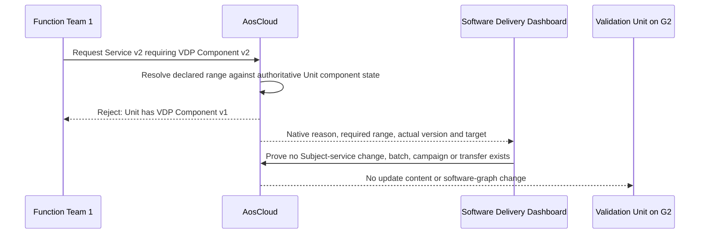

After this rejection, the Platform Team delivers and qualifies VDP Component v2
through the normal FOTA flow. Function Team 1 then resubmits the identical
Service v2 candidate; native dependency admission succeeds and `AF-G3-LC`
continues.

Activation of this flow requires all of the following evidence from an
official implementing release:

1. the supported Cloud API and signed service metadata expose a versioned
   Service-to-FOTA-component dependency;
2. an incompatible request is rejected by AosCloud itself;
3. rejection occurs before Subject-service desired-state change, validation
   batch, campaign and Unit download;
4. the error is available through the authoritative API for dashboard display;
5. a compatible retry succeeds after VDP Component v2 is ready.

The existing service-side compatibility file and fail-closed readiness check
remain defense in depth. The Software Delivery Dashboard does not recreate the
roadmap feature.

<a id="af-g3-lc"></a>
### `AF-G3-LC` — Feature request, independent qualification, joint acceptance

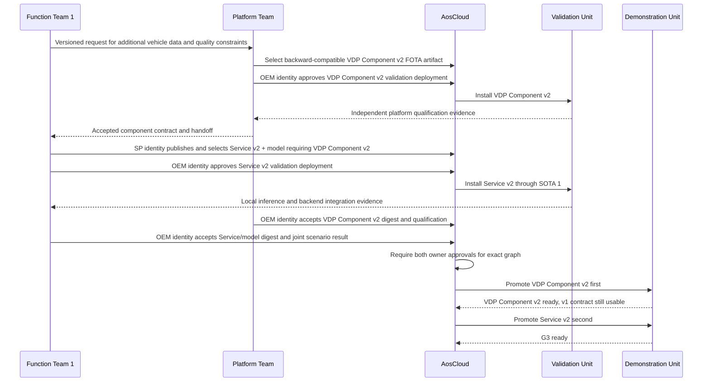

VDP Component v2 is a backward-compatible superset. Platform qualification finishes
before functional integration. Neither candidate is promoted until the
Platform Team and Function Team 1 separately accept their exact artifacts and
the joint result through authorized OEM identities.

<a id="af-g3-rt"></a>
### `AF-G3-RT` — Deterministic local assessment and derived reporting

```mermaid
flowchart LR
    SCENE["Deterministic CARLA braking event"] --> GW["Vehicle Gateway"]
    GW --> VISS["Base + expanded vehicle data"]
    VISS --> P2["VDP Component v2"] --> KUKSA["Backward-compatible v1 + v2 values"]
    KUKSA --> S2["Brake Health Service v2 + versioned synthetic model"]
    S2 --> RESULT["Local BrakeHealthAssessment"]
    RESULT --> EVENT["Bounded threshold / change BrakeHealthEvent"]
    RESULT --> BE["Brake Health Backend"]
    EVENT --> BE
    BE --> BD["Derived assessments and events"]
```

The same CARLA stimulus and condition profile are replayed when comparing
graphs. Model development and training occur before the presentation; the live
demo performs deterministic inference only. The model may be deliberately
synthetic because platform evolution, not production brake-diagnostic
accuracy, is the claim. It must remain versioned, testable, causally driven by
the visible CARLA braking episode, and labelled as a demo model. Native,
derived, estimated, and simulated-component inputs are visibly distinguished.

Normal v2 operation sends bounded assessments and threshold/change events,
not the high-detail v1 telemetry window. This change in Cloud data product is
part of the audience-visible proof that processing moved into the vehicle.

<a id="af-g3-ob"></a>
### `AF-G3-OB` — Predictive-function proof

| Surface | Required evidence |
| --- | --- |
| CARLA scene | Same bounded route, obstacle, braking profile, and cleanup behavior |
| Engineering Dashboard | Physical maneuver and source data remain visible |
| Software Delivery Dashboard | Feature request, VDP Component qualification, component handoff, Service integration, exact graph acceptance, ordered promotion, and selected native provider/service log evidence |
| Brake Health Dashboard | Derived assessment/event rather than the v1 raw window, provenance labels, model version/digest, result, confidence/quality and original event time |

<a id="af-g3-fr"></a>
### `AF-G3-FR` — Independent defect ownership and reverse dependency

```text
Service/model defect
  -> Function Team 1 creates immutable Service v2.x
  -> no FOTA change when VDP Component v2 remains correct

Platform defect
  -> Platform Team creates immutable VDP Component v2.x
  -> requalify the platform and dependent graph

Rollback from v2 graph
  -> rollback dependent Service v2 first
  -> rollback VDP Component v2 only after no v2-only consumer remains
  -> Service v1 may continue on VDP Component v2's backward-compatible v1 subset
```

### G3 requirement inputs

- Freeze VDP Component v2 signals and provenance using the native CARLA inventory.
- Define the simulated brake-condition model separately from native CARLA
  telemetry.
- Define synthetic model identity, input schema, deterministic assessment/event
  outputs, resource bounds, and stale/missing-data behavior without claiming
  production diagnostic accuracy.
- Define the exact accepted-graph record and promotion checks.
- Qualify `AF-G3-DEP` against the first AosEdge release that exposes native
  Service-to-FOTA-component dependency admission; keep the flow disabled until
  then.

## G4 — Bidirectional Advisory Capability

<a id="af-g4-lc"></a>
### `AF-G4-LC` — VDP Component v3 and Service v3 promotion

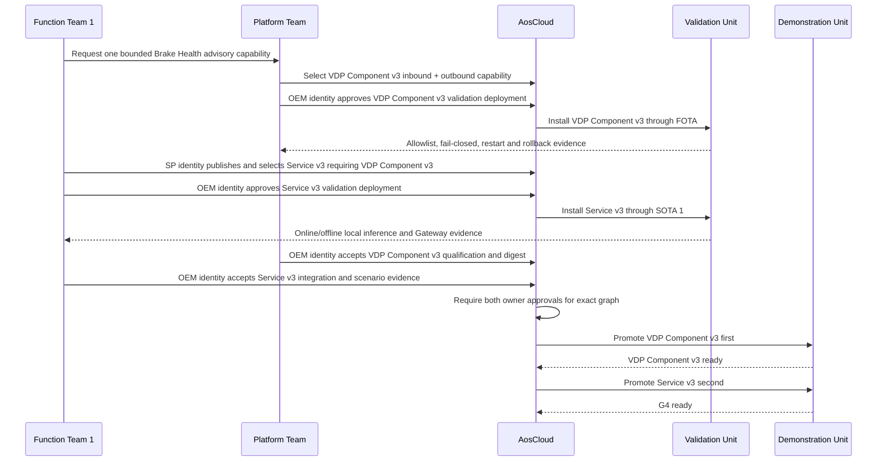

Scenario language may call the combined capability VDP Component v3 even if the
implementation packages inbound and outbound providers separately.

<a id="af-g4-rt"></a>
### `AF-G4-RT` — Local advisory round trip

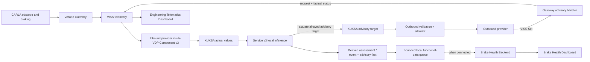

The advisory path ends at factual Gateway receipt/status. The demo implements
no IVI or Instrument Cluster and must not claim `displayed to driver` or
`driver acknowledged`.

<a id="af-g4-ob"></a>
### `AF-G4-OB` — Advisory and offline proof

| Surface | Required evidence |
| --- | --- |
| CARLA scene | Deterministic hard-braking stimulus executes safely |
| Engineering Dashboard | Advisory request, Gateway `RECEIVED`/`REJECTED`/`FAILED` status, correlation, and local elapsed time |
| Software Delivery Dashboard | VDP Component v3 and Service v3 dependency, validation, exact graph, ordered promotion, Unit connectivity, and selected native inference/policy/queue log evidence |
| Brake Health Dashboard | Pending/offline derived assessment/event and advisory-fact state, later synchronized result, original event time and model version |
| AosCloud | Software state remains observable; it is not in the local decision path |

<a id="af-g4-fr"></a>
### `AF-G4-FR` — Fail-closed actuation and offline continuity

- An unauthorized path, type, enum, stale command, or malformed request is
  rejected by the outbound policy and produces factual status.
- The outbound path cannot carry arbitrary display text or vehicle motion
  commands.
- Loss of Cloud connectivity does not stop KUKSA subscription, local inference,
  or the Gateway advisory round trip.
- Derived assessments/events and the correlated advisory fact remain in a
  bounded local queue and synchronize with their original event times after
  connectivity returns.
- Failure of the functional backend cannot authorize or suppress the local
  advisory.
- Rollback follows Service v3 first, then VDP Component v3 when required.

### G4 requirement inputs

- Define the advisory actuator and Gateway-status contract.
- Implement scoped VISS Set, Gateway handler, and factual status publication.
- Define outbound provider allowlist, broker-issued actuation scope,
  authorization, freshness, replay protection, and failure behavior.
- Define Service v3 state machine, bounded retention, retry and idempotency.
- Extend the Engineering Dashboard without turning it into an actuator client.

## T1 — Independent Tire Health Service

This is the independent presentation stage accepted by ADR 0008. It follows
`G4` because the complete Tire Health scenario uses the accepted VDP v3 data
and advisory contract. It does not depend on Function Team 1, Brake Health
Service v3, or the Brake Health Cloud product; the existing `G4` graph remains
unchanged while SOTA 2 adds Tire Health.

<a id="af-tire-lc"></a>
### `AF-TIRE-LC` — Independent SOTA 2 lifecycle

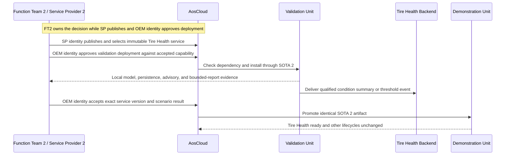

Function Team 2 does not request a new Vehicle Data Platform Component in the
current demo. `T1` begins only after the accepted VDP v3 contract contains every
required dynamics signal and typed advisory path.

<a id="af-tire-rt"></a>
### `AF-TIRE-RT` — Local condition estimation, advisory, and bounded reporting

```mermaid
flowchart LR
    STIMULUS["Explicit accelerated or pre-aged tire stimulus"] --> DYNAMICS["Native vehicle and wheel dynamics"]
    DYNAMICS --> GW["Vehicle Gateway"] --> VISS["VISS"]
    VISS --> VDP["Accepted Vehicle Data Platform Component"] --> KUKSA["KUKSA actual values"]
    KUKSA --> TIRE["Tire Health service"] --> MODEL["Bounded persistent condition model"]
    MODEL --> RESULT["Estimated condition band and inspection decision"]
    RESULT --> PACKAGE["Bounded summary or threshold event"]
    PACKAGE -->|"connected"| TB["Tire Health Backend"] --> TD["Tire Health Function Dashboard"]
    PACKAGE -->|"offline"| QUEUE["Bounded local queue"]
    QUEUE -. "reconnect" .-> TB
    RESULT -->|"typed advisory request"| TARGET["KUKSA advisory target"]
    TARGET --> OUTBOUND["Allowlisted outbound VDP and VISS Set"] --> GWSTATUS["Gateway advisory status"]
```

The service may analyze native CARLA speed, acceleration, steering, applied
controls, engine state, per-wheel angular velocity, longitudinal slip, and
lateral slip angle. CARLA does not expose live tire tread wear, pressure,
temperature, puncture health, load, force, or torque as production-equivalent
measurements. The scenario therefore owns hidden deterministic degradation
truth used only for qualification; neither the service nor its backend may
receive it as a production signal.

<a id="af-tire-ob"></a>
### `AF-TIRE-OB` — Audience and engineering evidence

| Surface | Required evidence |
| --- | --- |
| CARLA scene | Repeatable driving with a clearly labelled accelerated/pre-aged tire condition |
| Engineering Telematics Dashboard | Native source dynamics plus typed Tire Health advisory request and factual Gateway status; no exact tread-depth claim |
| Software Delivery Dashboard | Independent Service Provider 2 identity, dependency, validation and promotion, with selected native model/persistence/queue log evidence |
| Tire Health Function Dashboard | Estimated condition band, threshold event, bounded payload identity, Unit role, service/capability version, and online/offline delivery state |
| Brake Health Dashboard | Unchanged; no coupling to Function Team 2 data plane |

<a id="af-tire-fr"></a>
### `AF-TIRE-FR` — Failure boundaries

- Stale, missing, or inconsistent mandatory inputs produce `NOT_EVALUATED` or
  equivalent factual state, not a fabricated health estimate.
- Cloud/backend loss delays only reporting; local estimation and advisory
  generation continue from bounded persistent state.
- Queue size, summary/event rate, retry, retention, and state growth are bounded.
- Duplicate upload is handled idempotently by the Tire Health Backend.
- A Tire Health advisory can address only its own allowlisted target and cannot
  command vehicle motion or arbitrary display text.
- A Function Team 2 defect creates a new SOTA 2 artifact, not a Brake Health
  SOTA or platform FOTA unless evidence proves the shared contract defective.

### T1 qualification gate

Before presenting this flow as a live stage:

1. freeze the service-facing native signal subset on the packaged Mac build;
2. define and label the accelerated-time or pre-aged degradation stimulus;
3. freeze the versioned persistent-state model, condition bands, confidence,
   advisory thresholds, bounded payload and offline limits;
4. prove repeatable healthy-to-inspection transitions across at least ten
   strict scenario resets and separately prove state continuity across service
   restart;
5. prove hidden degradation truth is unavailable through VISS, KUKSA, service
   payloads, backend data, and audience dashboards;
6. prove the required signals and typed advisory target exist in an accepted
   Vehicle Data Platform Component;
7. qualify the independent backend/dashboard, idempotency and reconnect flow.

### Retired Function Team 2 flow identifiers

| Retired identifier | Replacement | Reason |
| --- | --- | --- |
| <a id="af-ft2-lc"></a>`AF-FT2-LC` | `AF-TIRE-LC` | Low-Friction candidate superseded by ADR 0008 |
| <a id="af-ft2-rt"></a>`AF-FT2-RT` | `AF-TIRE-RT` | Low-Friction candidate superseded by ADR 0008 |
| <a id="af-ft2-ob"></a>`AF-FT2-OB` | `AF-TIRE-OB` | Low-Friction candidate superseded by ADR 0008 |
| <a id="af-ft2-fr"></a>`AF-FT2-FR` | `AF-TIRE-FR` | Low-Friction candidate superseded by ADR 0008 |

<a id="af-x-source"></a>
## `AF-X-SOURCE` — One Visible Vehicle Source, Two Unit Roles

The architecture contains two Domain Controller instances but only one visible
CARLA/Vehicle Gateway/VISS source. The flow must use one of these honest modes:

1. bind the live source to VU during qualification, then stop/detach and bind it
   to DU for presentation; or
2. capture one deterministic, contract-versioned source trace and replay it to
   each Unit separately.

The selected mode must prove source identity, Unit binding, start/end frame or
trace range, contract version, and cleanup. It must never imply that two
simultaneous vehicles were running when only one existed. A source selector or
replay orchestrator is a demo responsibility, not a new production ECU.

Selection between the two modes remains an open detailed-design decision.

<a id="af-x-obs"></a>
## `AF-X-OBS` — Cross-Stage Evidence Architecture

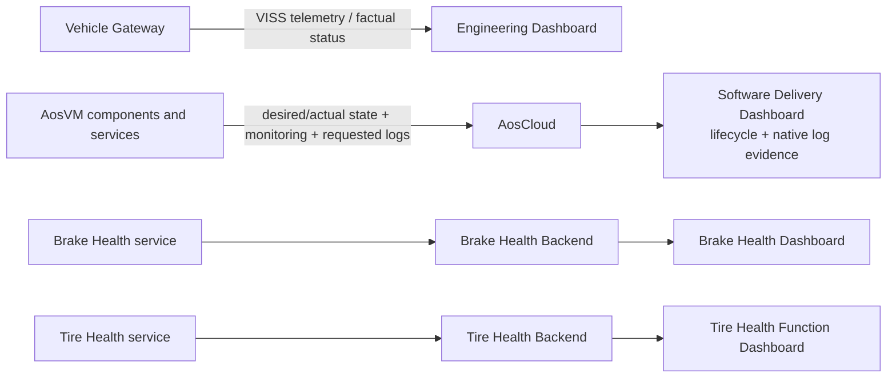

| Surface | Authoritative for | Not authoritative for |
| --- | --- | --- |
| CARLA scene | Visible physical stimulus and vehicle motion | Software deployment or functional result |
| Engineering Dashboard | Gateway VISS telemetry and factual advisory status | KUKSA receipt, service decision, backend delivery, or driver display |
| AosCloud | Unit desired/actual software state and lifecycle records | Functional vehicle data or local analytic decisions |
| Software Delivery Dashboard | Stateless presentation of real AosCloud lifecycle state, native log requests/results, exact artifact/metadata digests, requested permissions, target, validation evidence, owning-team acceptance, active OEM role and the final explicitly confirmed OEM-authorized operation | A parallel desired-state database, independent evidence/log store, release decision owner or automatic approval policy |
| Brake Health Dashboard | Brake Health backend data, model result, report state | FOTA/SOTA authority or Gateway receipt |
| Tire Health Function Dashboard | Function Team 2 condition/event/backend state | Raw continuous vehicle stream, hidden simulation truth, or Brake Health result |

Every audience claim must name the source surface and, where relevant, expose
technical drill-down to the authoritative system.

<a id="af-x-release"></a>
## `AF-X-RELEASE` — Common Validation and Promotion Pattern

Every FOTA and SOTA transition uses the same safety pattern:

```text
prebuilt immutable candidate
  -> Service Provider publication for SOTA or Platform Team publication for FOTA
  -> bind exact artifact digest + metadata digest + requested permissions
  -> fresh Validation target/batch
  -> effective-target preview immediately before approval
  -> show required validation evidence and owning-team acceptance
  -> explicit final owner decision through an authorized OEM identity
  -> install only on VU
  -> component or service qualification
  -> integration qualification when applicable
  -> explicit owner acceptance tied to versions, digests and targets
  -> require every owner approval for a combined FOTA/SOTA graph
  -> re-check DU target and dependency
  -> promote the identical accepted artifact to DU
  -> verify actual state and readiness
```

An unexpected Unit, stale pending batch, artifact or metadata digest mismatch,
unexpected permission, unmet dependency, incomplete/stale/failed evidence,
missing owning-team acceptance, wrong Cloud role, or missing combined-graph
approval blocks the transition. Passing evidence never implies approval. The
dashboard presents the complete decision basis and enables only the final
explicitly confirmed action through the correct OEM identity; it must always
re-read AosCloud afterward. AosCloud retains the authoritative lifecycle and
audit state after the dashboard or orchestrator exits.

<a id="af-x-qm"></a>
## `AF-X-QM` — QM Advisory Containment

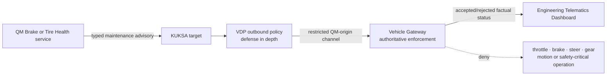

The two functional services are QM-domain applications and produce only typed
maintenance/inspection advisories. Aos IAM and KUKSA scopes constrain each
service, and the VDP performs a second contract check. Neither is a
functional-safety argument. The Gateway knows that this route originates from
the QM Domain Controller and is the final authoritative boundary: it validates
target, type, range, freshness, rate and correlation and rejects arbitrary VSS
writes and every motion or safety-critical operation. No accepted flow depends
on the advisory for hazard mitigation.

<a id="af-x-offline"></a>
## `AF-X-OFFLINE` — Connectivity Domains

Three connections must be tested independently:

| Lost connection | Must continue | May be delayed or unavailable |
| --- | --- | --- |
| AosCloud lifecycle connection | CARLA, Gateway, KUKSA, installed provider/service local behavior | New deployments, lifecycle reporting, Cloud-requested logs |
| Functional backend connection | Local Brake Health inference/advisory; local Tire Health estimation/advisory | Functional report/event upload and dashboard refresh |
| Gateway-to-Domain-Controller vehicle link | CARLA and safe vehicle control; AosCore lifecycle | Fresh KUKSA vehicle values and dependent evaluation |

The system must not convert one connectivity loss into fabricated sensor data,
unbounded buffering, widened authorization, or an implicit vehicle command.

## R0 — End-of-Demo Retirement and Next-Run Reset

<a id="af-r0-lc"></a>
### `AF-R0-LC` — Controlled retirement

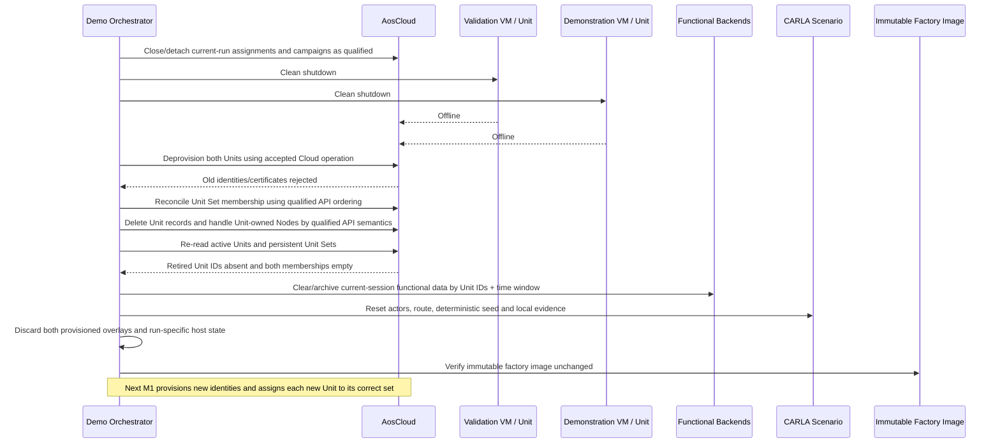

<a id="af-r0-ob"></a>
### `AF-R0-OB` — Retirement evidence

- both Units reached `Offline` before deprovisioning;
- deprovisioning and deletion results are recorded separately;
- deleted Unit IDs are absent from active Unit inventory;
- retired certificates cannot reconnect;
- Unit/Node cleanup matches the qualified API semantics;
- the persistent Verification and Demonstration Unit Sets contain no retired
  Unit and both memberships are empty;
- Cloud lifecycle audit history is retained;
- functional backend/dashboard data is cleared or archived by the exact Unit
  IDs and session time window;
- no QEMU process holds either discarded overlay;
- the immutable factory image and digest remain unchanged;
- CARLA has no scenario-owned actor or sensor leak.

<a id="af-r0-fr"></a>
### `AF-R0-FR` — Partial-failure rules

- Do not delete a local overlay while its VM is running or while Cloud identity
  retirement is uncertain.
- A deprovision failure preserves the Unit record and overlay for
  reconciliation.
- Unit deletion is not assumed to delete Nodes unless the qualified API proves
  ownership semantics.
- Unit deletion is not assumed to clear Unit Set membership unless the
  qualified API proves that behavior; unresolved membership preserves the
  Cloud records and overlays for reconciliation.
- Functional-data cleanup never erases authoritative Cloud audit evidence.
- A failed retirement blocks the next live run from reusing the old identity;
  it does not modify the immutable factory image.
- The next M1 creates new Unit and Node identities, assigns them to the correct
  disjoint persistent Unit Sets and uses only fresh lifecycle objects after
  membership changes.

R0 is a demonstration-lab operation on disposable Units, not a production
vehicle rollback or proof of a fleet-wide deletion policy.

## Scenario-to-Flow Traceability

| Demo Scenario 1.5 claim | Architecture flow coverage |
| --- | --- |
| OEM-integrated SOP substrate enables post-SOP extension | `AF-M0-LC`, `AF-G0-RT` |
| Two freshly manufactured, unprovisioned vehicle computers | `AF-M0-LC`, `AF-M0-OB` |
| Unique one-time provisioning into Validation and Demonstration lanes | `AF-M1-LC`, `AF-M1-OB`, `AF-M1-FR` |
| Working vehicle and Gateway telemetry before provider payload | `AF-G0-RT`, `AF-G0-OB` |
| Deterministic manual, Autopilot and scripted transition behavior | `AF-X-DRIVE`, `AF-G0-FR`, `AF-X-OBS` |
| First narrow Vehicle Data Platform Component validated before promotion | `AF-G1-LC`, `AF-G1-RT`, `AF-X-RELEASE` |
| Service v1 is an independent SOTA consumer with bounded backend reporting | `AF-G2-LC`, `AF-G2-RT`, `AF-G2-FR` |
| Platform Team and Function Team 1 independently iterate v2 | `AF-G3-LC`, `AF-G3-FR` |
| An incompatible Service v2 is rejected natively before any Unit delivery | deferred `AF-G3-DEP`; blocked on an implementing AosEdge release |
| Same deterministic CARLA event supports comparable local inference | `AF-G3-RT`, `AF-G3-OB`, `AF-X-SOURCE` |
| Local advisory reaches the Gateway without a Cloud round trip | `AF-G4-RT`, `AF-G4-FR`, `AF-X-OFFLINE` |
| QM services cannot reach motion or safety-critical operations | `AF-G4-RT`, `AF-TIRE-RT`, `AF-X-QM` |
| No driver-HMI claim; Engineering Dashboard shows factual Gateway status | `AF-G4-OB`, `AF-X-OBS` |
| Functional report synchronizes after connectivity returns | `AF-G4-RT`, `AF-G4-FR`, `AF-X-OFFLINE` |
| Two Unit roles do not imply two simultaneous CARLA vehicles | `AF-X-SOURCE` |
| Complete reset retires current identities and overlays | `AF-R0-LC`, `AF-R0-OB`, `AF-R0-FR` |
| `T1` adds Function Team 2 as a peer independent Service Provider without changing the `G4` Brake Health graph | `AF-TIRE-LC`, `AF-TIRE-FR` |
| At `T1`, tire condition is estimated locally and only bounded results reach its backend | `AF-TIRE-RT`, `AF-TIRE-OB`, `AF-X-OFFLINE` |
| At `T1`, the tire inspection advisory reaches the Gateway without a Cloud round trip | `AF-TIRE-RT`, `AF-TIRE-FR`, `AF-X-OFFLINE` |

## Interface and Ownership Matrix

| Interface | Producer / authority | Consumer | Owning lifecycle |
| --- | --- | --- | --- |
| CARLA vehicle and native sensor state | `CARLA` | `GATEWAY` | Vehicle simulation |
| Vehicle control channel | `CONTROL` | `GATEWAY` / CARLA actuator path | Gateway tooling; separate from VDP |
| VISS vehicle telemetry | `GATEWAY` / `VISS` | `VDP` and independent `ENG-DASH` | Gateway contract |
| KUKSA actual values | `VDP` | `BHS` and `TIRE` | Platform FOTA contract |
| Typed QM maintenance advisory target | `BHS` or `TIRE` | outbound `VDP` | Each SOTA request constrained by its FOTA allowlist entry; no safety or motion authority |
| Restricted QM-origin VISS Set advisory | outbound `VDP` | `GW-ADV` | Platform FOTA defense in depth + authoritative Gateway contract |
| Gateway advisory status | `GW-ADV` / `VISS` | `ENG-DASH` and inbound `VDP` as selected | Gateway contract |
| Aos service identity and requested KUKSA permissions | `AOS-CORE` / Aos IAM | `VDP` Credential Broker | `AOS_SECRET` is instance-bound and never persisted in an artifact |
| Short-lived KUKSA credential | `VDP` Credential Broker | `BHS` or `TIRE` | Exact currently registered IAM permission set mapped within the installed VDP contract; upstream KUKSA verifies the public key |
| Brake Health message family: v1 event windows, v2/v3 derived results and advisory facts | `BHS` | `BRAKE-BE` / `BRAKE-DASH` | Function Team 1 SOTA/backend |
| Tire Health summary/event | `TIRE` | `TIRE-BE` / `TIRE-DASH` | Function Team 2 SOTA/backend |
| Unit desired/actual state | `AOS-CLOUD` / `AOS-CORE` | `SW-DASH` | AosCloud lifecycle |
| SOTA artifact publication and technical verification | Function Team 1 or 2 through its Service Provider identity | `AOS-CLOUD` | Owning Function Team SOTA lifecycle; no OEM Unit deployment approval |
| FOTA/SOTA validation acceptance and deployment or promotion approval | Platform Team or owning Function Team through an authorized OEM identity | `AOS-CLOUD` | Exact artifact/metadata digests, permissions, target, evidence and team acceptance are presented before the explicit final decision; AosCloud records and executes it |
| Native system/service/crash logs | `AOS-CORE` / `AOS-CLOUD` | `SW-DASH` through supported AosCloud APIs | Operational observability; AosCloud remains authoritative and the dashboard stores no independent archive |

No backend, dashboard, orchestrator, or functional service becomes an
alternate path for vehicle control, authoritative lifecycle state, or an
owning team's release decision.

## Consolidated Gap Register

| Gap ID | Short name | Flow | Unresolved design or proof | Requirements owner |
| --- | --- | --- | --- | --- |
| <a id="gap-af-01"></a>`GAP-AF-01` | Clean factory baseline | `M0` | Freeze and qualify the clean unprovisioned OEM Demo Factory Image with empty provider slot and no reusable identity | Platform Team |
| <a id="gap-af-02"></a>`GAP-AF-02` | Unique overlay identities | `M0/M1` | Prove unique first-boot and provisioned identities for two overlays | Platform Team + demo orchestration |
| <a id="gap-af-03"></a>`GAP-AF-03` | Provisioning and retirement qualification | `M1/R0` | Qualify provisioning, partial-result reconciliation, deprovision, certificate rejection, Unit/Node deletion and audit retention | AosCloud integration |
| <a id="gap-af-04"></a>`GAP-AF-04` | One source, two Unit roles | `G0/X-SOURCE` | Select live binding or deterministic replay for one CARLA source and two Unit roles | Demo architecture |
| <a id="gap-af-05"></a>`GAP-AF-05` | VDP Component v1 contract | `G1` | Freeze VDP Component v1 signal, freshness, readiness, health and rollback contract | Platform Team |
| <a id="gap-af-06"></a>`GAP-AF-06` | Effective-target preview | `G1/X-RELEASE` | Implement effective-target preview and stale-batch protection from current Unit pending-batch state | Software Delivery Dashboard |
| <a id="gap-af-07"></a>`GAP-AF-07` | Brake Health v1 product | `G2` | Define and implement Service v1 trigger/ring-buffer/window state machine, ordered chunk/completion contract, backend reconstruction, live dashboard, retry/resume and idempotency | Function Team 1 |
| <a id="gap-af-08"></a>`GAP-AF-08` | VDP Component v2 compatibility | `G3` | Define VDP Component v2 inputs, provenance and backward compatibility | Platform Team + Function Team 1 |
| <a id="gap-af-09"></a>`GAP-AF-09` | Deterministic brake model | `G3` | Define simulated brake-condition source, versioned synthetic model, deterministic assessment/event contract and derived-only normal Cloud behavior without a production-accuracy claim | Vehicle simulation + Function Team 1 |
| <a id="gap-af-10"></a>`GAP-AF-10` | Outbound advisory chain and QM containment | `G4/T1/X-QM` | Define and implement typed KUKSA target, VDP defense-in-depth policy, restricted VISS Set, authoritative Gateway QM-channel policy, factual status, and negative motion/safety/arbitrary-write proof | Platform Team + Gateway |
| <a id="gap-af-11"></a>`GAP-AF-11` | Offline functional-data queue | `G2–G4/X-OFFLINE` | Define bounded persistence for in-progress/completed v1 windows and v2/v3 derived messages, reconnect/resume, duplicate handling and timing | Function Team 1 |
| <a id="gap-af-21"></a>`GAP-AF-21` | Tire condition model and stimulus | `T1` | Freeze the native input subset, explicit accelerated/pre-aged degradation stimulus, persistent state, condition bands, thresholds, bounded payload and hidden qualification oracle | Function Team 2 + CARLA scenario |
| <a id="gap-af-22"></a>`GAP-AF-22` | Tire advisory contract | `T1` | Define and prove the typed KUKSA-to-VISS-to-Gateway Tire Health advisory and factual status without vehicle-motion or production-HMI authority | Platform Team + Function Team 2 + Gateway |
| <a id="gap-af-23"></a>`GAP-AF-23` | Tire Health Cloud product | `T1` | Implement independent Tire Health backend/dashboard and offline/idempotent ingestion of bounded summaries/events | Function Team 2 |
| <a id="gap-af-15"></a>`GAP-AF-15` | Least-privilege KUKSA access | all | Enable and qualify stock Aos IAM permission handling; implement the thin VDP-owned Aos–KUKSA Credential Broker without a parallel identity/policy store; integrate a platform-protected IAM/PKCS#11 signing key, short token lifetime/refresh, separate provider identity binding and fail-closed negative cases without modifying upstream KUKSA | Platform Team / `aos-vehicle-platform` |
| <a id="gap-af-16"></a>`GAP-AF-16` | Native log API qualification | all | Qualify AosEdge system/service/crash-log requests, scoped AosCloud API access, latency, retention/deletion, online/offline behavior, redaction and dashboard presentation | Operational observability + Software Delivery Dashboard |
| <a id="gap-af-17"></a>`GAP-AF-17` | Software Delivery Dashboard and release authorization | all | Implement a stateless Software Delivery Dashboard that exposes exact artifact/metadata digests, requested permissions, target, required evidence and freshness, owning-team acceptance, active SP/OEM role, blocked reasons, final confirmation and Cloud audit result without a parallel state/evidence cache or automatic approval policy | Demo solution + AosCloud integration |
| <a id="gap-af-18"></a>`GAP-AF-18` | Presentation and timing bounds | all | Define stage durations, timeout budgets, local decision latency and technical/executive presentation modes | Demo experience |
| <a id="gap-af-19"></a>`GAP-AF-19` | Demo-run correlation and cleanup | `M1/R0` | Define current-run correlation by start time, local overlay roles and Unit IDs; reconcile persistent Unit Sets to empty at R0; assign new identities to the correct sets at the next M1; and define external-data retention/cleanup boundaries | Demo orchestration + AosCloud integration + functional teams |
| <a id="gap-af-20"></a>`GAP-AF-20` | Cross-lifecycle compatibility | `G2–G4/T1` | Define and prove versioned capability-dependency declaration, current runtime fail-closed behavior, future native Cloud rejection before rollout/transfer, compatibility checks, and safe dependent-first rollback for both SOTA lifecycles | AosEdge Platform Team + Platform Team + both service providers |
| <a id="gap-af-24"></a>`GAP-AF-24` | Drive-mode context transition qualification | `G0/X-DRIVE` | Implement and qualify dynamic obstacle ownership, context-aware reset/cleanup, complete transition and failure matrices, discontinuity evidence, dashboard state and recovery without reverse | Vehicle simulation + Vehicle Gateway |

These gaps are inputs to the requirements package. They do not authorize
component implementation and do not imply that every gap belongs in one
repository.

### Retired Architecture-Flow Gaps

The following former candidate gaps remain resolvable but are no longer active:

| Retired gap | Replacement | Reason |
| --- | --- | --- |
| <a id="gap-af-12"></a>`GAP-AF-12` | `GAP-AF-21` | Low-Friction candidate superseded by ADR 0008 |
| <a id="gap-af-13"></a>`GAP-AF-13` | `GAP-AF-21` | Former dynamics-signal proof folded into the Tire Health model contract |
| <a id="gap-af-14"></a>`GAP-AF-14` | `GAP-AF-23` | Former event Cloud product replaced by Tire Health Cloud product |

## Architecture-Flow Acceptance Record for Version 1.6

Version 1.6 preserves the accepted topology and lifecycle flow while exposing
the complete Brake Health data-product transition. `AF-G2-RT` now proves the
ring-buffer/trigger/chunk/completion path, `AF-G3-RT` proves synthetic local
assessment and derived-only normal Cloud messages, and `AF-G4-RT` carries the
derived result plus advisory fact to the backend independently from the local
advisory round trip. No new HLA component or authority is introduced.

## Architecture-Flow Acceptance Record for Version 1.5

Architecture Flows 1.5 preserves accepted Version 1.4 behavior and makes the
cross-run lifecycle explicit. `AF-R0-LC` now separates deprovisioning from Unit
deletion, proves persistent Unit Sets empty, and hands the next cycle to M1,
where new identities are assigned to the correct disjoint sets. VM shutdown,
sequencing and overlay disposal remain Demo Orchestrator responsibilities;
AosCloud remains authoritative for lifecycle and membership state.

## Architecture-Flow Acceptance Record for Version 1.4

Architecture Flows 1.4 preserves the accepted Version 1.3 lifecycle and data
flows, adds `AF-X-QM`, and makes the complete evidence basis preceding final
OEM approval explicit. It was accepted on 2026-08-19
after reviewers confirmed that:

1. `M0`, `M1`, `G0–G4`, `T1`, and `R0` match Demo Scenario 1.5;
2. every component and interface respects High-Level Architecture 1.4;
3. VU validation and DU promotion use explicit current targeting and identical
   accepted artifacts;
4. manufacturing state, Unit identity, software graph, functional data, and
   operational logs have distinct authorities;
5. the one-CARLA/two-Unit limitation is explicit and not disguised;
6. Brake and Tire Health local inference/advisory remain independent of Cloud
   availability;
7. no flow claims a production driver HMI, production fleet, arbitrary
   component runtime, or unrestricted vehicle actuation;
8. R0 retires disposable identities and overlays instead of rolling `T1` or
   `G4` back to `G0`;
9. `T1` follows `G4` only in presentation order, while Function Team 2 remains
   independent of the Brake Health service and SOTA 1 lifecycle;
10. every open technical choice is represented as a gap rather than a hidden
    implementation assumption.
11. `AF-G3-DEP` is visibly deferred, has no project-side substitute, and cannot
    be presented until the native AosCloud roadmap capability is qualified.
12. the drive-mode/world-context transition matrix has one actor and clock
    owner, explicit obstacle lifecycle and reset evidence, and no reverse or
    Autopilot obstacle-avoidance claim.
13. Service Manager and Aos IAM own SOTA instance identity, `AOS_SECRET` and
    registered permissions; the VDP broker only translates them into bounded
    KUKSA credentials and stores no parallel identity or per-service policy.
14. the Factory substrate provides the enabled permission-handler and
    non-secret IAM/PKCS#11 seam, while Unit-specific signing material and
    static provider tokens remain outside image and payload artifacts.
15. both functional services remain QM, the Gateway is the final authoritative
    channel boundary, and no advisory is relied upon for a safety goal; and
16. a Dashboard approval control represents the final evidence-backed OEM
    decision, never the validation process or an automatic policy.

## Downstream Component Requirement Gate

The accepted System Requirements and Traceability 0.9 baseline covers every active
`AF-*` flow and allocates the resulting obligations to provisional component
packages. D3 now expands those packages in this order:

1. Vehicle simulation and Vehicle Gateway;
2. Factory substrate and Vehicle Data Platform Component;
3. AosCore and AosCloud lifecycle integration;
4. Brake Health service and Cloud product;
5. Tire Health service and Cloud product;
6. demo orchestration, cross-cutting concerns, and end-to-end acceptance.

Each component requirement must cite its parent `SYS-*` requirement, relevant
`AF-*` flow, interface ID, verification method, and retained evidence. The
accepted flow baseline authorizes no code, artifact, Cloud, or Unit change.
