<!-- SPDX-FileCopyrightText: 2026 maninblack -->
<!-- SPDX-License-Identifier: MIT -->

# High-Level Architecture 1.5

- Status: Accepted
- Version: 1.5
- Prepared: 2026-08-22
- Accepted: 2026-08-26
- Owner: System Architecture
- Previous accepted version: 1.4, accepted 2026-08-19
- Accepted architecture decisions: [ADR 0008](decisions/0008-use-tire-health-for-function-team-2.md),
  [ADR 0009](decisions/0009-separate-release-decision-from-cloud-execution.md),
  [ADR 0011](decisions/0011-qm-service-containment-and-evidence-backed-oem-approval.md),
  [ADR 0012](decisions/0012-authorize-running-workloads-not-software-artifacts.md),
  [ADR 0013](decisions/0013-current-release-kuksa-authorization-compatibility.md),
  [ADR 0014](decisions/0014-enforce-platform-fota-safe-stop-in-oem-component-runtime.md)
- Scope: CARLA, Vehicle Gateway ECU, AosVM Domain Controller, AosCloud,
  shared Vehicle Data Platform Component, two independent OEM Service
  Providers, functional backends, and demonstration tooling
- Implementation status: target architecture; current and planned elements are
  distinguished below
- Cloud or Unit mutation authorized: no

## Visual Authoring Source

The reviewed visual source is preserved together with its matching export:

- [Draw.io source](diagrams/aosedge-demo-hla-authoring-reference.drawio);
- [PNG export](diagrams/aosedge-demo-hla-authoring-reference.png).

The Draw.io file is the primary visual architecture source. Its PNG export and
the Mermaid rendering below are reviewable derivatives and must be regenerated
or reconciled whenever the source changes.

The visual source defines the component boundaries and principal relationships
used by Architecture 1.5: two peer OEM Function Teams represented as
independent AosCloud Service Providers, the shared Vehicle Data Platform
Component, the Tire Health function, the Factory Baseline Assembly-to-Factory
Image artifact and factory-installed runtime boundaries,
the Software Delivery and log-observation surfaces, and the explicit typed
Brake Health and Tire Health advisory paths through KUKSA. It separates the
factory-installed Eclipse KUKSA resource-server boundary from the FOTA-owned
Vehicle Data Platform Component and shows the current-release authorization
helper only as a removable compatibility overlay below a permanent,
implementation-neutral platform credential boundary. It also distinguishes
producer-owned acceptance from the independent OEM Release Authority context
used to authorize exact Cloud mutations and from AosCloud lifecycle state and
execution. It also identifies
both functional services as QM-domain applications, the Gateway as the final
authoritative containment boundary, and Release Authority authorization as an
evidence-backed final decision rather than a bare dashboard action. The diagram does not
introduce a production driver HMI; the advisory remains visible on the
Engineering Telematics Dashboard.

## Revision 1.5 Summary

Architecture 1.5 preserves the vehicle, Cloud, FOTA/SOTA and QM-containment
topology of 1.4 while adopting the authorization-boundary correction in
[ADR 0013](decisions/0013-current-release-kuksa-authorization-compatibility.md):

1. Eclipse KUKSA is a stable factory-installed resource server outside the
   independently updated Vehicle Data Platform Component;
2. the permanent target architecture requires platform-controlled Service
   credentials derived from immutable OEM-approved metadata and active
   workload state, but does not guess the future native AosCore interface;
3. the current demo uses a removable compatibility helper outside the VDP and
   both SOTA Service artifacts;
4. the helper uses current native `AOS_SECRET` and `GetPermissions` behavior,
   derives all JWT claims itself and exposes only a Service-private short-lived
   credential;
5. Services connect directly to unmodified KUKSA after credential preparation,
   so IAM and the helper are not in the vehicle-data or advisory path;
6. VM reboot reconstructs authority from active platform state rather than a
   persisted authorization cache, while stop/removal prevents renewal; and
7. the VDP Provider is part of the OEM-qualified trusted platform and uses a
   fixed platform-internal KUKSA integration path; the first demo adds no
   dynamic Provider IAM/JWT, per-component attestation, or untrusted-Provider
   isolation claim; and
8. D4-010.3 binds technical artifact publication to three independent profiles:
   Platform OEM for VDP FOTA, Service Provider 1 for Brake Health SOTA and
   Service Provider 2 for Tire Health SOTA. One session-scoped native helper
   implementation may be reused, but every dashboard surface is pre-bound to
   one profile and technical publication never performs OEM Unit approval.

## Revision 1.4 Summary

Architecture 1.4 preserves the component and lifecycle topology of 1.3 and
adopts [ADR 0011](decisions/0011-qm-service-containment-and-evidence-backed-oem-approval.md):

1. Brake Health and Tire Health are QM-domain maintenance/inspection
   applications with no allocated safety goal or vehicle-motion authority;
2. the VDP outbound allowlist is defense in depth, while the Vehicle Gateway
   is the final authoritative boundary for the QM-origin channel and denies
   arbitrary VSS, motion and safety-critical operations;
3. an OEM Release Authority deployment authorization is the explicit
   governance decision after the owning producer team completes engineering
   validation and acceptance; it is bound to the exact artifact and metadata
   digests, requested permissions, target, evidence and owning-team acceptance;
4. the Software Delivery Dashboard must show those prerequisites before its
   final approval control can be used; passing tests never auto-approve; and
5. the Dashboard remains stateless, while AosCloud records and executes the
   authorized decision.

The permission-handler portion preserved by D4-027 corrected the factory
configuration without changing this topology: `enablePermissionsHandler`
shall be explicitly `true` in the single IAM configuration and is independent
of provisioning state. Provisioning does not toggle or select that setting;
Service Manager and IAM still create per-instance permissions and `AOS_SECRET`
state only for running SOTA services. Because the current evidence images omit
the setting, the successor OEM Demo Factory Image must be rebuilt with it.

The accepted D4-010.1 signing decision also preserves the topology while
freezing the per-Unit trust lifecycle. The Factory Image carries only the
dedicated non-secret `kuksa-jwt` certificate-module/PKCS#11 and verifier
preparation wiring. Provisioning creates a unique RSA signer; only its public
verifier is installed before `CMP-KAC` and unmodified KUKSA start. The first
demo uses one signer per provisioning lifecycle with no hot reload or live
rotation, and R0 destroys the retired signer with its VM overlay. The pinned
KUKSA enforces signature, audience `kuksa.val`, expiry and path permissions;
it is not credited with validating `iss`. The separate accepted D4-010.3
publication profile uses three local, role-bound current-release PKCS#12
credentials behind one session-scoped native-helper contract. This does not
add an HLA component or authority. Dynamic Provider authorization remains
outside the first-demo gate.

## Revision 1.3 Summary

Architecture 1.3 preserves the component and lifecycle topology of 1.2 and
corrects the Aos-to-KUKSA credential authority as amended in
[ADR 0010](decisions/0010-aos-kuksa-credential-broker.md):

1. Aos Service Manager and IAM own per-instance `AOS_SECRET` creation,
   registration, lookup and invalidation;
2. the VDP-owned Credential Broker is only a fail-closed translator from
   currently registered IAM permissions to short-lived KUKSA JWTs;
3. no project-owned identity store or duplicate per-service OEM allowlist is
   added to the broker;
4. the Factory Image carries one stock Aos IAM configuration with
   `enablePermissionsHandler: true` for both provisioning and normal modes; it
   carries no pre-populated service permission, identity or `AOS_SECRET`, and
   only the non-secret IAM/PKCS#11 integration seam for the broker signing key,
   while per-Unit key material is established after manufacturing;
5. the privileged FOTA provider uses a separate short-lived platform
   credential, whose exact identity binding remains a qualification gate; and
6. native pre-transfer Cloud permission admission remains deferred until a
   released AosCloud capability is qualified.

## Revision 1.2 Summary

Architecture 1.2 retains the 1.1 platform and lifecycle model and replaces its
provisional Function Team 2 candidate, as accepted in
[ADR 0008](decisions/0008-use-tire-health-for-function-team-2.md):

1. defining Function Team 1 and Function Team 2 as independent peer OEM
   organizations and independent AosCloud Service Providers;
2. adding an independently delivered Tire Health SOTA service with its own
   backend and dashboard;
3. establishing the FOTA-owned Vehicle Data Platform Component as a shared
   vehicle integration layer used by multiple functional services;
4. separating continuous local condition estimation from bounded Tire Health
   summaries and threshold-event Cloud upload;
5. making each typed Brake Health or Tire Health advisory return explicitly
   pass through KUKSA, outbound validation, VISS Set, and the Vehicle Gateway;
6. limiting the current demo's platform feature-request flow to Function Team
   1, while Function Team 2 consumes the already available data contract;
7. distinguishing the build-time OEM Factory Baseline Assembly, its immutable
   pre-SOP OEM Demo Factory Image artifact, and the factory-installed runtime
   graph from the post-SOP FOTA capability payload;
8. adding role-scoped stateless engineering surfaces over authoritative
   AosCloud state: the OEM Software Delivery Dashboard for lifecycle and
   system/VDP logs, and each Function Dashboard for its own Service logs;
9. clarifying that the same logical Domain Controller architecture is
   instantiated separately as the Validation Unit and Production Unit;
10. normalizing the post-validation role as the Production Vehicle / Production Unit, with the Production Unit representing one already-produced vehicle rather than a separate demo-only vehicle type;
11. adopting [ADR 0009](decisions/0009-separate-release-decision-from-cloud-execution.md):
    each owning team makes its engineering release decision, an OEM identity
    authorizes deployment to OEM Units, and AosCloud remains the lifecycle
    system of record and execution control plane.
12. adopting [ADR 0010](decisions/0010-aos-kuksa-credential-broker.md):
    upstream Eclipse KUKSA remains unchanged, while the Vehicle Data Platform
    Component owns the thin Aos–KUKSA Credential Broker used to derive
    short-lived KUKSA JWTs from Aos IAM service-instance identity.

## Purpose

This document defines the high-level architecture for the AosEdge SDV
demonstration. It records the logical vehicle model, ECU and software
boundaries, OEM ownership and release lifecycles, runtime telemetry, event
upload and advisory paths, Cloud interactions, and engineering tooling.

The architecture demonstrates how an OEM can add a new vehicle-facing platform
capability through FOTA and then independently deliver multiple containerized
functional services through SOTA. The Brake Health service performs local
analysis and can return an advisory request to the Vehicle Gateway without a
Cloud round trip. Tire Health estimates condition locally and sends only
bounded summaries or threshold events to its functional backend; it can also
request a local inspection advisory without a Cloud round trip.

This is a logical automotive architecture. All elements currently run on one
Apple Silicon Mac for the demonstration, but process placement on the Mac must
not erase the logical separation between the simulated physical vehicle, the
Vehicle Gateway ECU, the Domain Controller ECU, the OEM Cloud, and engineering
tools.

## Vehicle Lifecycle Terminology

The architecture uses business-facing vehicle roles and their concrete demo
runtime counterparts consistently:

| Audience and business role | Runtime and Cloud role | Meaning |
| --- | --- | --- |
| **Test Vehicle** | **Validation Unit** in the technical Verification Unit Set, titled `AosEdge SDV Demo / Test Vehicles` in AosCloud | Engineering vehicle used to test and qualify a candidate before wider release |
| **Production Vehicle** | **Production Unit** in the Production Unit Set, titled `AosEdge SDV Demo / Production Vehicles` in AosCloud | Vehicle that has left manufacturing with the approved SOP baseline and may be in OEM or dealer inventory, awaiting sale, or operating with a customer |

`Test Vehicle` is the audience-facing Representation Layer label only. The
technical architecture, AosCloud/API names, contracts and evidence continue to
use `Validation Unit`, `VU` and `Verification Unit Set`; the UI shall not expose
the legacy audience label.

The first demo represents each role with one fresh AosVM overlay. The
Production Unit is therefore the technical demo instance of one Production
Vehicle role; it is not a claim that the demonstration deploys to an actual
customer fleet. The word *demonstration* remains reserved for the overall demo,
its tooling and its evidence—not for the post-validation vehicle lifecycle
role.

Both persistent role Unit Sets belong to the dedicated
`AosEdge SDV Demo Fleet`. OEM/AosCloud administration creates the Fleet and the
two empty Unit Set objects once and pins their returned UUIDs. The Demo
Orchestrator verifies those immutable object identities and properties but owns
only run-scoped Unit membership: M1 adds the new Test and Production Units and
R0 removes them. It never creates, renames, reconfigures or deletes the Fleet or
either Unit Set.

## Architecture 1.5 Model

```mermaid
flowchart TB
    subgraph OEM["OEM"]
        direction LR

        subgraph PLATFORM_TEAM["Platform Team"]
            FACTORY_ASSEMBLY["OEM Factory Baseline Assembly<br/>compose · build · qualify · freeze"]
            PLATFORM_DEV["Development of Vehicle Data<br/>Platform Component"]
        end

        AOS_CLOUD(["AosCloud<br/>lifecycle system of record<br/>and execution control plane"])
        RELEASE_AUTHORITY["OEM Release Authority<br/>independent governance role<br/>outside producer teams"]

        subgraph FUNCTION_TEAM_1["Function Team 1 / Service Provider 1 — SOTA"]
            BRAKE_DEV["Development of<br/>Brake Health Service"]
        end

        subgraph FUNCTION_TEAM_2["Function Team 2 / Service Provider 2 — SOTA"]
            TIRE_DEV["Development of<br/>Tire Health Service"]
        end

        BRAKE_BACKEND[("Service Provider 1<br/>Brake Health Backend")]
        BRAKE_DASHBOARD["Brake Health<br/>Function Dashboard"]
        TIRE_BACKEND[("Service Provider 2<br/>Tire Health Backend")]
        TIRE_DASHBOARD["Tire Health<br/>Function Dashboard"]

        BRAKE_DEV -. "Feature request:<br/>new or updated vehicle signals" .-> PLATFORM_DEV
        PLATFORM_DEV -- "OEM technical profile:<br/>publish FOTA" --> AOS_CLOUD
        BRAKE_DEV -- "SP1 identity:<br/>publish SOTA 1" --> AOS_CLOUD
        TIRE_DEV -- "SP2 identity:<br/>publish SOTA 2" --> AOS_CLOUD
        PLATFORM_DEV -. "accepted Test result" .-> RELEASE_AUTHORITY
        BRAKE_DEV -. "accepted Test result" .-> RELEASE_AUTHORITY
        TIRE_DEV -. "accepted Test result" .-> RELEASE_AUTHORITY
        RELEASE_AUTHORITY -- "OEM delivery context:<br/>authorize exact Test or Production operation" --> AOS_CLOUD
        BRAKE_BACKEND --> BRAKE_DASHBOARD
        TIRE_BACKEND --> TIRE_DASHBOARD
    end

    subgraph DEMO["Demo / Engineering Workstation — Mac host"]
        direction LR
        CONTROL_UI["Vehicle Control UI<br/>Manual · Autopilot · Safe Stop"]
        SOFTWARE_DASHBOARD["OEM Software Delivery Dashboard<br/>digest · permissions · target · validation evidence<br/>team acceptance · Release Authority authorization"]
        TELEMETRY_DASHBOARD["Engineering Telematics Dashboard<br/>speed · acceleration · pedals · steering<br/>Brake + Tire Health advisory · gateway status"]
    end

    subgraph VEHICLE["Virtual Vehicle"]
        direction LR

        subgraph VIRTUAL_PLATFORM["Virtual Vehicle Platform — CARLA"]
            direction LR

            CARLA["CARLA Physical Vehicle<br/>dynamics · sensors · actuators"]

            subgraph GATEWAY["Vehicle Gateway ECU"]
                direction LR
                EGO_RUNTIME["carla-ego-runtime"]
                VSS_MODEL["Signal normalization<br/>and VSS data model"]
                VISS_SERVER["VISS 3.1 Server"]
                ADVISORY_HANDLER["Authoritative QM-channel handler<br/>typed non-safety advisory only<br/>deny motion and safety-critical operations"]

                EGO_RUNTIME --> VSS_MODEL --> VISS_SERVER
                VISS_SERVER -- "Set advisory target" --> ADVISORY_HANDLER
                ADVISORY_HANDLER -- "Publish received/status" --> VISS_SERVER
            end

            CARLA -- "Vehicle and sensor state" --> EGO_RUNTIME
            EGO_RUNTIME -- "Control commands" --> CARLA
        end

        NETWORK["Simulated In-Vehicle Network<br/>VSS semantics · VISS 3.1 · TLS/IP"]

        subgraph DOMAIN["Domain Controller ECU — QEMU + AosVM<br/>logical instance: Validation Unit or Production Unit"]
            direction TB

            AOS_CORE["Factory-installed Domain Controller substrate<br/>AosCore · Service Manager / IAM<br/>security · update support"]
            COMPONENT_RUNTIME["Preinstalled OEM component runtime<br/>provider-specific · empty slot<br/>Platform FOTA Safe Stop gate"]

            subgraph DATA_PLATFORM["Vehicle Data Platform Component — FOTA payload and versioned contract"]
                direction TB

                subgraph INBOUND_PATH["Inbound vehicle-data path"]
                    direction LR
                    INBOUND["Vehicle Interface Provider<br/>VISS subscribe client"]
                    INBOUND_POLICY["Inbound validation<br/>normalization · signal selection"]

                    INBOUND --> INBOUND_POLICY
                end

                subgraph OUTBOUND_PATH["Outbound QM advisory path — defense in depth"]
                    direction RL
                    OUTBOUND_POLICY["Outbound validation<br/>and allowlist"]
                    OUTBOUND["Outbound Vehicle Interface Provider<br/>VISS Set client"]

                    OUTBOUND_POLICY --> OUTBOUND
                end

                CONTRACT["Versioned Vehicle Data Platform<br/>Component contract"]
            end

            subgraph KUKSA_RESOURCE_SERVER["Eclipse KUKSA Databroker — stable factory-installed resource server"]
                direction TB
                KUKSA_ACTUAL["KUKSA actual-value<br/>namespace"]
                READ_API["Read / subscribe<br/>kuksa.val.v1"]
                ACTUATE_API["Actuate / write target<br/>kuksa.val.v1"]
                KUKSA_TARGET["KUKSA advisory-target<br/>namespace"]

                KUKSA_ACTUAL --> READ_API
                ACTUATE_API --> KUKSA_TARGET
            end

            INBOUND_POLICY -- "Publish actual values" --> KUKSA_ACTUAL
            KUKSA_TARGET --> OUTBOUND_POLICY
            CONTRACT --- KUKSA_ACTUAL
            CONTRACT --- KUKSA_TARGET

            AUTH["Platform-controlled Service credential boundary<br/>current-release overlay: removable compatibility helper"]
            AUTH -. "GetPermissions<br/>current native IAM authority" .-> AOS_CORE
            AUTH -. "Service-private short-lived JWT trust" .-> READ_API
            AUTH -. "Service-private short-lived JWT trust" .-> ACTUATE_API

            subgraph TIRE_FUNCTION_SERVICE["QM OEM Functional Service — SOTA 2"]
                TIRE_SERVICE["Tire Health Service Container<br/>local condition estimation<br/>bounded summary + advisory decision"]
            end

            subgraph BRAKE_FUNCTION_SERVICE["QM OEM Functional Service — SOTA 1"]
                BRAKE_SERVICE["Brake Health Service Container<br/>local analytics and advisory decision"]
            end

            BRAKE_SERVICE -. "current release:<br/>AOS_SECRET + fixed resource" .-> AUTH
            TIRE_SERVICE -. "current release:<br/>AOS_SECRET + fixed resource" .-> AUTH

            READ_API -- "Read / subscribe" --> TIRE_SERVICE
            READ_API -- "Read / subscribe" --> BRAKE_SERVICE
            BRAKE_SERVICE -- "Brake Health advisory request" --> ACTUATE_API
            TIRE_SERVICE -- "Tire Health advisory request" --> ACTUATE_API
            TIRE_SERVICE -. "Requires compatible<br/>component contract" .-> CONTRACT
            BRAKE_SERVICE -. "Requires compatible<br/>component contract" .-> CONTRACT
        end

        VISS_SERVER -- "Telemetry and gateway status" --> NETWORK
        NETWORK -- "Telemetry and status subscription" --> INBOUND
        OUTBOUND -- "VISS Set request" --> NETWORK
        NETWORK -- "Advisory request" --> VISS_SERVER
    end

    CONTROL_UI -- "Separate authenticated<br/>control channel" --> EGO_RUNTIME
    NETWORK -- "Independent read-only<br/>VISS subscription" --> TELEMETRY_DASHBOARD
    SOFTWARE_DASHBOARD <-->|"authoritative API state + evidence<br/>explicit final OEM-authorized decision"| AOS_CLOUD

    AOS_CLOUD <-->|"Provisioning, deployment,<br/>lifecycle and status"| AOS_CORE
    AOS_CORE -. "Install / update<br/>FOTA artifact" .-> COMPONENT_RUNTIME
    NETWORK -- "Fresh read-only vehicle state<br/>for Platform FOTA gate" --> COMPONENT_RUNTIME
    COMPONENT_RUNTIME -. "Host provider payload" .-> DATA_PLATFORM
    AOS_CORE -. "Deploy / update<br/>SOTA 1" .-> BRAKE_SERVICE
    AOS_CORE -. "Deploy / update<br/>SOTA 2" .-> TIRE_SERVICE

    BRAKE_SERVICE -. "Brake Health report<br/>asynchronous" .-> BRAKE_BACKEND
    TIRE_SERVICE -. "Bounded condition summary<br/>or threshold event" .-> TIRE_BACKEND
```



### Diagram interpretation

The diagram is a **capability-superset view** of one logical vehicle
architecture. A deployable FOTA or SOTA box indicates that the architecture can
host that element; it does not imply that every element is installed at every
demonstration stage. The manufacturing, provisioning, `G0–G4`, independent
`T1` Tire Health, and retirement sequence and the precise presence or absence of each deployable component are
owned by Demo Scenario 2.0 rather than by this static component diagram.

The logical Domain Controller architecture is instantiated twice for the
demonstration: once as the Validation Unit and once as the Production Unit.
The diagram intentionally does not duplicate the full ECU graph. The current
demo has one visible live CARLA/Vehicle Gateway/VISS environment and uses
sequential exclusive binding: Validation first, then detach/reset and
Demonstration. Telemetry replay is deferred beyond the first implementation.

## System Boundaries

### Virtual physical vehicle

CARLA represents the physical part of the vehicle: vehicle dynamics, the road
environment, sensors, and actuators. It is not an Aos Unit and it does not
expose the stable application-facing vehicle-data interface directly.

### Vehicle Gateway ECU

`carla-ego-runtime` represents a Vehicle Gateway ECU. It:

1. observes the CARLA vehicle and its sensors;
2. receives control commands over a separate control channel;
3. normalizes CARLA-specific data into the VSS model;
4. exposes that model through a TLS-protected VISS 3.1 endpoint;
5. in the target architecture, accepts a narrowly scoped advisory actuator
   request and publishes the Gateway reception status.

CARLA-specific APIs stop at this boundary. Neither the Domain Controller nor
the Brake Health service connects directly to CARLA.

### Simulated in-vehicle network

The VISS connection over TLS/IP represents the communication path between the
Vehicle Gateway ECU and the Domain Controller ECU. In a real vehicle the
underlying transport could be CAN, SOME/IP, DDS, TSN Ethernet, or an OEM-defined
interface. VSS provides the stable signal semantics while the provider hides
the transport-specific implementation.

### Domain Controller ECU

QEMU plus AosVM represents a Domain Controller ECU. It contains:

- the factory-installed substrate created from the OEM Demo Factory Image,
  including AosCore lifecycle,
  identity, security, desired-state management, Service Manager, KUKSA, and
  update support;
- the preinstalled, provider-specific component runtime with an initially
  empty Vehicle Data Platform Component slot;
- the independently installed FOTA-owned Vehicle Data Platform Component
  payload and its versioned contract;
- KUKSA Databroker as the preinstalled stable VSS data boundary for services;
- independently deployed SOTA service containers;
- the Function Team 1 Brake Health service;
- the Function Team 2 Tire Health service.

The Domain Controller is not part of CARLA. Its VM boundary represents a
separate automotive computer even though both sides execute on the same Mac.

The OEM Factory Baseline Assembly is a build-time Platform Team responsibility,
not software running in the Domain Controller. It reproducibly composes,
builds, qualifies and freezes the immutable OEM Demo Factory Image artifact.
Fresh Validation and Production Unit runtime deployments are created from
that artifact and run the installed component graph; they are not instances
of the assembly component.

The immutable OEM Factory Image contains no Vehicle Data Platform Component
payload, functional SOTA service, Cloud registration, Cloud-issued credential,
or reusable per-vehicle identity. For the current release it may contain the
separately packaged removable authorization helper and non-secret
signer/verifier preparation wiring, but no pre-populated Service authority,
`AOS_SECRET`, JWT, private signer or shared production credential. The accepted
component runtime is currently specific to one provider type and one empty
slot; Architecture 1.5 does not claim a generic arbitrary-component runtime.

A pinned OEM build may emit both the complete bootable Factory Image and a
separate rootfs platform-update envelope from the same rootfs content. These
are different lifecycle artifacts. Fresh M0 deployments use the complete
unprovisioned Factory Image and already contain the empty-slot runtime before
M1 provisioning. The rootfs envelope uses the factory-installed AosVM rootfs
A/B mechanism only to retrofit or maintain an older provisioned Unit; it is
not required to introduce the initial runtime in the normal manufacturing
flow. The post-SOP Vehicle Data Platform Component remains a third, separately
versioned FOTA artifact installed through that runtime.

The Vehicle Data Platform Component payload is the shared
vehicle-integration layer. It owns the privileged connection to the Vehicle
Gateway, converts accepted VISS values into the stable KUKSA contract, and
enforces the narrowly scoped outbound advisory path. The KUKSA executable is
part of the SOP substrate, while the signal mappings, accepted namespaces, and
versioned contract exposed through it belong to the FOTA component.
Functional services consume that contract and do not contain vehicle-network
integration code.

### OEM systems

AosCloud is the lifecycle system of record and execution control plane for
provisioning and for the FOTA component and both SOTA services. It stores the
authoritative desired state, reported actual state, batches, campaigns,
recorded approvals, audit history, and delivery progress. It does not make an
owning team's engineering release decision, is not a functional telemetry
backend, and does not participate in either service's real-time decision path.

Update-state enforcement is split by responsibility. AosCloud records and
delivers the explicitly authorized desired update; it is not required or
claimed to determine whether a physical vehicle is moving. For the
vehicle-critical Vehicle Data Platform Component FOTA, the factory-installed
OEM Component Runtime inside AosCore Service Manager uses a separate read-only
Gateway/VISS vehicle-state provider and crosses destructive stop/activation
boundaries only after the accepted Safe Stop policy is proven. The audience UI
presents that required and observed state but implements no duplicate safety
gate. Brake Health and Tire Health are QM Service SOTA in this architecture and
may be updated while the vehicle moves, subject to their normal authority,
dependency, recipient, evidence and readiness gates.

The OEM Software Delivery Dashboard is a stateless presentation and
workflow-facilitation view over authoritative AosCloud APIs. It can display
targets, exact artifact and service-metadata digests, requested permissions,
required qualification evidence, validation results, owning-team acceptance,
promotion, Unit status, the current team context, and the OEM role used for a
proposed action. Missing, stale, mismatched or failed prerequisites block the
action. The visible approval control is only the final explicit OEM decision
after that review; passing evidence never auto-approves. The Dashboard submits
the decision through the correct scoped OEM identity and re-reads AosCloud. It
must not make the engineering decision, impersonate an owner, invent evidence
or parallel desired state, or become a second lifecycle control plane.

AosEdge native logging is an existing platform capability. System,
service-instance, and crash logs are collected by AosCore and delivered to
AosCloud in response to authorized log requests. AosCloud retains the request
record and resulting downloadable archive according to a tenant policy that
the current API does not expose. The OEM Software Delivery Dashboard uses the
role-scoped Unit-log API only for AosCore, VDP and other system evidence.
Brake and Tire Function Dashboards use separate SP1 and SP2 operational
contexts to access only their own service-instance and crash-log records. No
browser receives a Cloud credential, no surface keeps a second archive, and
the architecture introduces no separate collection, transport or search
pipeline. It claims neither a fixed nor an indefinite retention duration.

Function Team 1 owns a separate Brake Health Backend and Brake Health Function
Dashboard. Function Team 2 owns a separate Tire Health Backend and Tire Health
Function Dashboard. The two functional data planes are peers: neither backend is routed
through the other, and neither has authority to deploy software to the Unit.

For the first demo, both functional data planes use lightweight isolated local
QEMU-to-Mac routes. They add no per-Unit backend certificate or credential
lifecycle. Reported `system_uid` values provide demo correlation, not
cryptographic backend-client identity. Production backend authentication is an
independent Function Team responsibility and is outside the architecture claim
of this demo. This simplification does not change signed FOTA/SOTA delivery,
OEM authorization, in-vehicle Aos IAM/KUKSA permissions or Gateway enforcement.

### Demo and engineering workstation

The Vehicle Control UI, OEM Software Delivery Dashboard, and Engineering
Telematics Dashboard are demonstration tools on the Mac host. They are not
production vehicle ECUs and must be shown outside the logical vehicle boundary.

The trusted Presenter Launcher, allocated to the existing Demo Orchestrator,
owns only the measured physical composition of the one-display demonstration
workspace: the reserved shared-header strip and placement, visibility,
non-overlap, readability and safe local restoration of the CARLA, Controller,
Engineering Telematics and browser windows. The stateless OEM Software
Delivery Dashboard Representation Layer owns the shared header's title,
Current Vehicle/team-summary projection and team navigation from the same read
model as the browser workspace. Every surface retains its own content and
authoritative source. CARLA and Controller remain native windows rather than
browser-embedded or streamed surfaces. This responsibility split adds no HLA
component or lifecycle authority.

The existing telemetry dashboard is the `carla-viss-client --monitor` mode. It
connects directly to the Vehicle Gateway VISS endpoint as an independent,
read-only subscriber. It does not connect to CARLA RPC, KUKSA, AosVM, or the
Cloud backend.

No production driver HMI or Instrument Cluster is implemented in Architecture
1.5. The engineering dashboard may show that an advisory was requested and
received by the Vehicle Gateway, but the demonstration must not claim that the
warning was displayed to or acknowledged by a driver.

## OEM Ownership and Release Lifecycles

### Platform Team — Vehicle Data Platform Component, FOTA

The Platform Team owns the factory baseline and shared vehicle-facing platform
component:

- OEM Factory Baseline Assembly and Factory Image qualification, including
  the selected provider-specific component runtime, its empty-slot behavior,
  an explicit `enablePermissionsHandler: true` in the single stock Aos IAM
  configuration, absence of pre-populated service permission/secret state,
  and the dedicated non-secret `kuksa-jwt` certificate-module/PKCS#11 plus
  public-verifier preparation wiring used by the current-release compatibility
  helper;
- inbound and outbound vehicle-interface providers;
- VSS mapping, filtering, and validation;
- factory-installed unmodified KUKSA integration and its stable signal
  contract, outside the VDP FOTA payload;
- the separately packaged removable current-release authorization helper,
  KUKSA public-verifier configuration and platform-protected signing-key
  integration, outside the VDP FOTA payload and both SOTA artifacts;
- outbound actuator allowlists and enforcement;
- short-lived platform credentials and trust integration without embedding
  secrets in artifacts;
- platform qualification, compatibility, update, and recovery;
- the engineering decision to accept each platform candidate and exact Test
  result, recorded separately from the independent OEM Release Authority
  decision that authorizes Test deployment or Production rollout.

In the current demonstration, Function Team 1 may request a new or extended
vehicle-data capability. It does not gain permission to ship privileged
platform integration code. Function Team 2 consumes signals already present in
the accepted component contract; a Function Team 2 platform feature request
is possible in a production organization but is not part of this demo.

### Function Team 1 / Service Provider 1 — Brake Health, SOTA 1

Function Team 1 is an OEM functional vertical and an independent AosCloud
Service Provider. It owns:

- a QM-domain maintenance/inspection application with no allocated safety goal
  or vehicle-motion authority;
- the Brake Health service container;
- local emergency-braking detection, diagnostic analysis, and advisory
  decision logic;
- the required Vehicle Data Platform Component compatibility declaration;
- service configuration, state, tests, updates, removal, and recovery;
- the engineering decision to accept each service candidate and exact Test
  result; service publication uses the Service Provider 1 identity, while the
  independent OEM Release Authority separately authorizes deployment affecting
  OEM Units through the OEM delivery context;
- the Brake Health Backend and Brake Health Function Dashboard.

The service consumes the stable KUKSA/VSS contract. It does not depend on
CARLA, VISS, CAN, or another vehicle-network transport directly.

### Function Team 2 / Service Provider 2 — Tire Health, SOTA 2

Function Team 2 is a peer OEM functional vertical and a separate AosCloud
Service Provider. It owns:

- a QM-domain maintenance/inspection application with no allocated safety goal
  or vehicle-motion authority;
- the Tire Health service container;
- local processing of the vehicle-dynamics signals allowed by its KUKSA contract;
- a bounded, persistent and versioned tire-condition estimate;
- the decision to create a bounded summary or threshold event;
- the decision to request an allowlisted tire-inspection advisory;
- its required Vehicle Data Platform Component compatibility declaration;
- service configuration, state, tests, updates, removal, and recovery;
- the engineering decision to accept each service candidate and exact Test
  result; service publication uses the Service Provider 2 identity, while the
  independent OEM Release Authority separately authorizes deployment affecting
  OEM Units through the OEM delivery context;
- the Tire Health Backend and Tire Health Function Dashboard.

The service does not continuously stream raw sensor data to the Cloud. It
estimates tire condition locally and uploads deliberately bounded summaries or
threshold events to its own backend when connectivity is available. It reports
an estimated condition band and inspection recommendation, not an exact
measured tread depth. A clearly labelled accelerated-time or pre-aged tire
condition makes the transition observable in a short demo. Hidden deterministic
simulation truth may qualify the model but is not a production signal exposed
to the service or backend. The exact input subset, state model, persistence,
thresholds, payload and dashboard representation remain detailed-design items.

### Lifecycle independence, dependency, and promotion

The architecture has three independently owned release lifecycles:

1. the Platform Team publishes the Vehicle Data Platform Component through
   FOTA;
2. Service Provider 1 publishes the Brake Health service through SOTA 1;
3. Service Provider 2 publishes the Tire Health service through SOTA 2.

Each SOTA service declares its own dependency on a versioned Vehicle Data
Platform Component. The services do not depend on each other and can be
installed, updated, or rolled back independently, subject to their platform
contract. The platform is qualified through its FOTA lifecycle before a
dependent service is accepted against it. A service defect creates a new
version in that service provider's SOTA lifecycle; a platform defect creates a
new FOTA version. Promotion freezes the exact compatible graph and artifact
digests accepted on the Validation Unit before rollout to the Production Unit.

Release ownership, Cloud authorization, and execution are deliberately
separate. A Function Team uses its Service Provider identity to develop, sign,
publish, version, and technically verify its service artifact. The Platform,
Brake or Tire producer team separately owns validation and acceptance of the
exact artifact on the Validation Unit. OEM Release Authority is an independent
governance role outside those producer teams: it reviews the required evidence
and explicitly authorizes the exact Test or Production Unit operation through
the authorized OEM delivery context. Before authorization, the review binds
the exact artifact and metadata digests, requested permissions, target,
required validation evidence and owning-team acceptance. AosCloud persists
the decisions and executes the resulting lifecycle transition. A passing test
or completed batch never performs either decision automatically.

The Production Unit is a rollout and operation target, not a second product-
validation lane. The candidate is published once, validated and accepted on
the Validation Unit, then promoted without rebuild, re-sign or re-publication.
Production delivery, actual-state and readiness reads confirm rollout health;
subsequent CARLA driving presents the released capability in ordinary
operation. Any Production-Unit rehearsal used to qualify the demo solution
itself occurs before audience presentation and does not become product
validation in the demo story.
The recorded approval means that the required release evidence was reviewed
and accepted; it is not, by itself, a functional-safety certification or proof
that software is safe.

A combined platform-and-service graph has no anonymous single acceptance
owner. The Platform Team accepts the exact platform candidate, the relevant
Function Team accepts its exact service candidate and integration result, and
the independent OEM Release Authority authorizes each exact rollout separately.
AosCloud records and executes those decisions for the exact versions, digests
and targets; it does not approve or promote a combined graph by itself.

The target architecture requires **native AosCloud pre-deployment
enforcement** of each SOTA-to-FOTA compatibility range. If the intended Unit
does not yet contain a compatible Vehicle Data Platform Component, AosCloud
rejects the SOTA request before it creates a rollout or sends update content to
the Unit. The current released Cloud/API does not yet expose this cross-type
dependency. On 2026-08-18 the AosEdge Platform Team identified it as a roadmap
feature, without committing a release or date. The corresponding negative-path
demo is therefore deferred until an implementing release is available and
qualified. No temporary admission controller is added to this architecture.

Service-side compatibility metadata and fail-closed startup/readiness remain
required defense in depth; they do not substitute for the future native Cloud
gate.

## Runtime Flows

### 1. Shared vehicle telemetry

```text
CARLA vehicle state
  -> carla-ego-runtime
  -> normalized VSS model
  -> Vehicle Gateway VISS 3.1 server
  -> simulated in-vehicle network
  -> inbound VISS provider in AosVM
  -> validation, normalization and signal selection
  -> KUKSA publish of actual values
  +-> Brake Health service read/subscribe
  `-> Tire Health service read/subscribe
```

The platform provider publishes actual sensor values into KUKSA once. Each
functional service reads only the paths in its own contract or subscribes to
their changes. The services do not receive raw values from one another.

### 2. Vehicle control

```text
Vehicle Control UI
  -> separate authenticated local control channel
  -> carla-ego-runtime
  -> CARLA vehicle controls
```

The control path is deliberately separate from VISS telemetry and KUKSA. Loss
of the control client selects the existing safe-stop behavior. The Brake Health
service and Tire Health service are QM-domain applications and do not control
vehicle motion in Architecture 1.5.

### 3. Local Brake Health analysis

```text
KUKSA sensor subscription
  -> emergency-braking/event detection
  -> bounded diagnostic monitoring
  -> local brake-health analysis
  -> local advisory decision
```

This path executes entirely inside the Domain Controller. It must continue to
work without Cloud connectivity; no Cloud round trip may be part of the local
decision path. Quantitative on-board performance benchmarking is deferred
beyond the first demo.

### 4. Local Tire Health estimation and bounded reporting

```text
KUKSA sensor subscription
  -> local vehicle-dynamics processing
  -> bounded persistent tire-condition model
  -> estimated condition band and threshold decision
  -> bounded summary/event to the Tire Health Backend when connected
  -> Tire Health Function Dashboard
```

Condition estimation and the inspection recommendation run inside the Domain
Controller and do not require a Cloud round trip. The service sends bounded
summaries and threshold events; it does not use the functional backend as a
continuous raw-sensor processor. Connectivity loss may delay upload, but it
must not prevent local estimation or advisory generation. State persistence,
retention, retry behavior and the exact payload are lower-level decisions.

For the current demo, this service must use vehicle data already present in the
accepted Vehicle Data Platform Component. It combines native dynamics
evidence with an explicit simulation-only degradation stimulus. That hidden
qualification truth must not be published as if it were a production vehicle
measurement.

### 5. Typed advisory return to the Vehicle Gateway

```text
Brake Health service or Tire Health service
  -> KUKSA actuate
  -> actuator target
  -> outbound actuation policy and allowlist
  -> outbound VISS provider
  -> VISS Set over the simulated in-vehicle network
  -> Vehicle Gateway advisory handler
  -> Gateway reception/status signal
```

The service does not send a message directly to the dashboard. The engineering
dashboard observes the Gateway-side advisory and status over VISS. This proves
that the request completed the round trip back to the simulated vehicle side.

Architecture 1.5 defines the following semantics:

| Operation | Meaning |
| --- | --- |
| KUKSA `publish` | Platform provider supplies an actual sensor or status value |
| KUKSA `read` / `subscribe` | Service or observer consumes actual values and changes |
| KUKSA `actuate` | Service requests a desired value for an allowed actuator |
| KUKSA actuator target | Desired value consumed by the outbound provider |
| VISS `Set` | Target transport operation used to deliver the allowed request to the Gateway |

The final VSS overlay is a lower-level design deliverable. The architecture
uses these provisional semantic entries:

```text
Vehicle.OEM.BrakeHealth.Advisory.Request       actuator
Vehicle.OEM.BrakeHealth.Advisory.GatewayStatus sensor
Vehicle.OEM.TireHealth.Advisory.Request        actuator
Vehicle.OEM.TireHealth.Advisory.GatewayStatus  sensor
```

The request should be a bounded enum such as `NONE`,
`INSPECTION_RECOMMENDED`, or `SERVICE_REQUIRED`; it must not carry arbitrary
display text. Gateway status should describe only facts the demonstration can
prove, such as `NOT_RECEIVED`, `RECEIVED`, `REJECTED`, or `FAILED`. It must not
use `DISPLAYED` or `ACKNOWLEDGED` because no driver HMI exists in this scope.

These are QM maintenance/inspection advisories, not safety warnings or safety
commands. The VDP validates them as defense in depth. The Vehicle Gateway is
the final authoritative boundary for this QM-origin channel: it validates the
typed target, value, freshness, rate and correlation and denies throttle,
brake, steering, gear, vehicle-motion, safety-critical and arbitrary VSS write
operations.

### 6. Engineering observation

```text
Vehicle Gateway VISS server
  -> independent read-only VISS subscription
  -> Engineering Telematics Dashboard
```

The dashboard continues to show the already implemented vehicle signals:

- speed and longitudinal acceleration;
- accelerator and brake-pedal positions;
- steering angle;
- gear and engine speed;
- GNSS and simulation health information.

The target extension adds typed Brake Health and Tire Health advisory requests
and Gateway statuses to the same engineering view. The dashboard is an observer and does not
participate in the decision or actuation path.

### 7. Brake Health functional reporting

```text
Brake Health service
  -> locally retained derived health event/report
  -> Function Team Backend when connectivity is available
  -> Brake Health Function Dashboard
```

The backend receives derived health events, diagnostic evidence, and advisory
state rather than being required to process every raw signal. Loss of Cloud
connectivity may delay synchronization but must not block local analysis or the
Gateway advisory request.

### 8. Independent software lifecycle delivery

```text
Platform Team -> platform-oem signs/publishes FOTA + Platform Team acceptance + independent OEM Release Authority authorization -> AosCloud -> AosCore -> preinstalled component runtime -> Vehicle Data Platform Component
Function Team 1 -> brake-sp1 signs/publishes SOTA 1 + Brake Function Team acceptance + independent OEM Release Authority authorization -> AosCloud -> AosCore -> Brake Health service
Function Team 2 -> tire-sp2 signs/publishes SOTA 2 + Tire Function Team acceptance + independent OEM Release Authority authorization -> AosCloud -> AosCore -> Tire Health service
```

AosCloud records and executes all three lifecycles, but it does not merge
their ownership or make their engineering release decisions. A service can be changed without
rebuilding the other service, and either service can be changed without a new
FOTA when the installed platform contract already satisfies its declared
dependency.

## Security and Trust Boundaries

- The Vehicle Gateway VISS endpoint uses TLS and a private route intended for
  the simulated in-vehicle connection.
- Unit identity, private keys, certificates, trusted Provider connection
  material and Service credentials never enter Git or deployable public artifacts.
- Current-demo artifact-publication credentials are three distinct
  passwordless PKCS#12 files, mode `0600`, stored locally outside Git under
  `~/.aos/security` and readable only by the session-scoped native helper.
  The installed `aos-signer` 2.0.1 loads the selected key into that native
  process; it is therefore not described as Keychain-backed or non-exportable.
  No browser, dashboard container, VM image or deployable artifact receives it.
- The immutable OEM Factory Image contains no Cloud registration, Cloud-issued
  credential, reusable per-vehicle secret, or fixed identity that would be
  duplicated across Unit instances.
- The inbound provider has permission to publish only its accepted sensor and
  status paths.
- Each functional service receives read access only to its required KUKSA
  sensor paths.
- Each service receives actuation access only to its own typed advisory target.
- Brake Health and Tire Health are QM-domain applications. No safety goal is
  allocated to them and no safety claim depends on their timing or output.
- The Tire Health service has no vehicle-motion permission. Its external
  egress is limited to its own backend and bounded functional payloads.
- The outbound provider accepts only an explicit actuator allowlist, validates
  type and enum bounds, and fails closed.
- VDP outbound validation is defense in depth. The Vehicle Gateway is the
  final authoritative enforcement point for the QM-origin channel and denies
  arbitrary VSS writes and every vehicle-motion or safety-critical operation.
- An advisory request cannot become an unrestricted transport tunnel from a
  service container to the Vehicle Gateway.
- Upstream Eclipse KUKSA Databroker remains an unchanged, factory-installed
  resource server outside the VDP FOTA payload. In the current release it
  trusts only the per-Unit public verifier prepared after provisioning, loads
  one verifier at process start, validates `RS256` signature, audience
  `kuksa.val`, expiry and path permissions, and is not claimed to enforce
  `iss`.
- The permanent platform credential boundary derives Service authority from
  immutable OEM-approved Service metadata and active workload state, prepares
  credentials outside untrusted application logic and does not prescribe the
  future native AosCore interface.
- The removable current-release compatibility helper is separate from the VDP
  and both SOTA artifacts. A Service bootstrap presents only its active native
  `AOS_SECRET` and a fixed KUKSA resource identifier. The helper resolves
  currently registered permissions through Aos IAM, derives all supported JWT
  claims itself and exposes a short-lived JWT through a Service-private
  volatile location. A caller cannot select paths, operations, subject,
  audience, TTL, claims or signing payload.
- Aos IAM and Service Manager remain authoritative for SOTA instance identity,
  secret registration and permission invalidation. The helper stores neither
  Service identities nor a duplicate per-Service OEM policy database. It
  starts empty after VM reboot and reconstructs authority from active platform
  state; stop, removal or unregistration prevents further issuance or renewal.
- Once a credential is prepared, each Service connects directly to KUKSA. Aos
  IAM and the helper are not in the telemetry, analytics, advisory or Cloud
  data path.
- Functional services never receive KUKSA `provide` or `create` authority.
  The Vehicle Data Provider is part of the OEM-qualified trusted platform and
  receives only the provider-side KUKSA access required by its versioned
  contract. Any fixed credential, protected local endpoint, or equivalent
  KUKSA configuration is platform integration rather than a separate dynamic
  authorization architecture. The demo does not claim containment of a
  malicious or substituted VDP.
- Current-release helper signing material is a unique per-Unit RSA key created after
  provisioning in the dedicated Aos `kuksa-jwt` certificate-module/PKCS#11
  token. Only its public verifier is exported atomically. The key,
  `AOS_SECRET`, issued JWTs and any shared static verifier never enter Git,
  Factory Images, FOTA/SOTA payloads, command lines, or logs. The helper and
  KUKSA fail closed before verifier preparation. The first demo has no live
  key rotation; a fresh provisioning lifecycle creates a new key, and R0
  overlay destruction retires it. Example/static tokens are qualification
  history, not the target architecture. Native migration removes this
  compatibility-only wiring after the released AosCore contract passes the
  same acceptance suite.
- Vehicle control remains on its separate authenticated channel and is not
  exposed to either functional service.
- Functional backends have no AosCore lifecycle authority and cannot act as a
  substitute path into CARLA, VISS, or KUKSA.
- The two Service Providers have separate identities, credentials, artifacts,
  configuration, and Cloud-side functional endpoints.
- Service Provider identities publish and technically verify service artifacts;
  they do not authorize deployment to OEM Units. Validation acceptance and
  deployment or promotion actions use authorized OEM identities.
- The OEM Software Delivery Dashboard uses scoped AosCloud authentication,
  displays the exact artifact and metadata digests, requested permissions,
  target, required evidence, owning-team acceptance and active OEM role, and
  exposes only the final explicitly confirmed mutation action when all
  prerequisites match. It stores no authoritative lifecycle state and passing
  evidence never grants or implies approval.
- KUKSA/Aos IAM authorization is a cybersecurity least-privilege control
  within the QM domain; it is not a functional-safety case.
- AosCloud log requests and results use scoped authentication: OEM Unit-log
  access is separate from SP1/SP2 Service-log access. Emitted service and
  platform logs plus dashboard previews must not disclose Unit secrets,
  service tokens, certificates or unrestricted/high-rate vehicle data.

## Current Baseline and Target Delta

| Area | Current accepted behavior | Architecture 1.5 target |
| --- | --- | --- |
| CARLA and ego runtime | Vehicle state, control, VSS normalization | Preserve unchanged behavior |
| VISS server | TLS VISS 3.1 Get and Subscribe; write rejected | Add a narrowly scoped QM advisory Set path and Gateway status; Gateway remains the authoritative deny-by-default boundary for motion and safety-critical operations |
| Engineering dashboard | Independent VISS subscriber for live telemetry | Add advisory request and Gateway reception status |
| Vehicle Data Platform Component | Inbound VISS-to-KUKSA implementation and qualification evidence exist | Provide one shared, versioned OEM-trusted FOTA component with inbound telemetry and separately governed outbound advisory directions; exclude Service JWT issuance, dynamic Provider IAM/JWT and untrusted-Provider isolation from the first demo |
| Factory Baseline Assembly, OEM Demo Factory Image and Domain Controller substrate | The current build evidence and runtime are provider-specific; the stock provisioning and normal IAM services share one configuration, live `.1`/`.2` remain permission-handler-disabled after provisioning, installed systems prove an empty provider slot, and the hardened candidate is not yet an accepted clean factory artifact | Rebuild and qualify the immutable, unprovisioned OEM image with AosCore, factory-installed unmodified KUKSA, security/update support, one IAM configuration containing `enablePermissionsHandler: true`, the separately packaged removable current-release helper, non-secret `kuksa-jwt` signer/verifier preparation and the selected empty-slot runtime, but no VDP payload, functional Service, pre-populated authority, reusable identity, signing key, JWT or shared production credential |
| KUKSA contract | Readable telemetry signals | Serve both services and add the versioned advisory actuator and status sensor |
| Brake Health service | Not yet the accepted final service | Subscribe, analyze locally, actuate advisory, report asynchronously |
| Tire Health service | Not implemented | Estimate tire condition locally, send bounded summaries/events and request a typed inspection advisory |
| Service Provider separation | AosCloud lifecycle mechanisms exist; the two target services are not yet accepted as independent deployments | Independent Service Provider identities for publication, team-owned engineering acceptance, independent OEM Release Authority authorizations, artifacts, dependencies, updates, removal, and recovery |
| Cross-lifecycle dependency admission | Service-to-layer and component-to-component dependencies exist, but the current released Cloud/API does not expose a Service-to-FOTA-component admission rule | Natively reject an incompatible SOTA request in AosCloud before rollout creation or Unit transfer; deferred until the roadmap feature ships and is qualified |
| OEM Software Delivery Dashboard | Not implemented; the AosCloud UI and APIs remain authoritative | Provide a stateless view of exact artifact/metadata digests, requested permissions, actual targets, evidence, owning-team acceptance, active OEM Release Authority context, validation, rollout and Unit state; own shared-header meaning and team navigation from the same browser read model; expose explicit Release Authority authorization only after prerequisites match, without a parallel state store or automatic approval policy |
| Native operational logs | AosEdge supports Cloud-requested system, service-instance and crash logs; VDP diagnostics originate in its native systemd journal and VDP owns no log store | Present selected system/VDP evidence in the OEM Software Delivery Dashboard and each Service-owned service/crash result in its matching Function Dashboard through role-scoped AosCloud APIs; retain no second archive and state that retention policy is not exposed by the current API |
| Validation and Production instances | Separate VM roles exist, while the demo has one visible CARLA/Vehicle Gateway/VISS source | Instantiate the same logical Domain Controller architecture twice and implement sequential exclusive live Validation attach/detach, deterministic reset and Production attach/detach without claiming two simultaneous vehicles; defer telemetry replay |
| Driver HMI | Not implemented | Remains out of scope |
| Functional backends | Scenario-level targets | Two separate backends receive derived Brake Health and Tire Health data without entering local decisions or software lifecycle control |

The target writable VISS path must not weaken the current read-only guarantee
for any other signal. A request outside the explicit typed advisory
contract remains rejected.

## Architectural Invariants

Architecture 1.5 is aligned only while all of the following remain true:

1. CARLA represents the physical vehicle; `carla-ego-runtime` represents the
   Vehicle Gateway ECU; AosVM represents a separate Domain Controller ECU.
2. Both functional services talk to KUKSA, never directly to CARLA or VISS.
3. Function Team 1 and Function Team 2 are peer OEM organizations and separate
   AosCloud Service Providers.
4. Only Function Team 1 requests a Vehicle Data Platform Component extension
   in the current demo; Function Team 2 uses the already available contract.
5. Tire Health estimates condition locally and sends only bounded summaries or
   threshold events; it does not continuously stream raw sensor data to the Cloud.
6. Brake Health local analysis and advisory generation do not require Cloud
   connectivity.
7. Tire Health estimation and advisory generation do not require Cloud
   connectivity; its backend synchronization is asynchronous.
8. AosCloud lifecycle control, Brake Health functional data, and Tire Health
   functional data are three distinct Cloud concerns.
9. The Engineering Telematics Dashboard talks to the Gateway VISS endpoint,
   never directly to KUKSA or either functional service.
10. Vehicle control and VISS vehicle-data exchange remain separate channels.
11. The platform FOTA, Brake Health SOTA 1, and Tire Health SOTA 2
    retain independent ownership, versioning, qualification, update, removal,
    and recovery lifecycles. FOTA recovery uses `RevertUpdate` only before
    `ApplyUpdate`; after Apply it uses a new signed forward-repair version.
    SOTA recovery removes the dependent Subject-service assignment first.
    Campaign stop or batch invalidation is never presented as rollback of an
    already-applied Unit.
12. The two services do not depend on each other; each is gated only by its
    declared Vehicle Data Platform Component contract. Native AosCloud
    pre-deployment enforcement is a deferred target capability and must not be
    claimed against the current release.
13. Each Brake Health or Tire Health advisory passes through KUKSA, the
    outbound allowlist, VISS Set, and the Vehicle Gateway before the engineering
    dashboard observes it.
14. The demonstration proves Gateway receipt, not display or acknowledgment by
    a driver.
15. No secret, Unit identity, or private credential is embedded in a FOTA or
    SOTA payload.
16. The static diagram is a target capability superset; Demo Scenario 2.0 owns
    component presence and absence at each manufacturing, provisioning,
    `G0–G4`, `T1`, and retirement stage.
17. Validation and Production Units are separate instances of the same
    logical Domain Controller architecture; the diagram does not imply two
    simultaneous CARLA vehicles.
18. The Platform Team and each Function Team own their engineering release
    decisions. Function Teams publish through their Service Provider identities,
    while every approval affecting OEM Unit deployment is recorded through an
    authorized OEM identity.
19. AosCloud is the lifecycle system of record and execution control plane;
    neither the Software Delivery Dashboard nor the Demo Orchestrator stores
    authoritative lifecycle state, auto-approves evidence, or replaces an
    owning team's decision.
20. Related FOTA and SOTA releases retain separate candidates, acceptance,
    OEM authorization, Cloud objects, Campaign/results and readiness. A
    dependent Service may proceed only after the required provider release is
    actually ready; any G3/G4 capability milestone is a read-only derived
    audience summary rather than a combined graph or Cloud lifecycle object.
21. Aos Service Manager and IAM own each SOTA instance's identity,
    `AOS_SECRET` and registered permissions. The permanent platform credential
    boundary is implementation-neutral. Its removable current-release helper
    is outside the VDP and SOTA artifacts, derives authority only from active
    IAM state, allows no caller-selected authority and owns no parallel
    identity or per-Service policy database.
22. The Factory Image contains one IAM configuration with
    `enablePermissionsHandler: true` in both provisioning and normal modes,
    plus dedicated non-secret `kuksa-jwt` certificate-module/PKCS#11 and
    verifier-preparation wiring, but no pre-populated service permission,
    `AOS_SECRET`, per-Unit signing key, shared static verifier or static
    provider/service token. Provisioning does not toggle the handler; it
    creates a unique Unit signer and verifier before current-release helper and
    KUKSA startup. The first demo performs no live Service-signing rotation.
    Provider-side KUKSA access is trusted OEM platform integration and is not a
    separate dynamic authorization gate.
23. Brake Health and Tire Health remain QM-domain maintenance/inspection
    applications with no allocated safety goal, direct driver-HMI claim,
    vehicle-motion authority or safety-critical actuator access.
24. The VDP outbound allowlist is defense in depth; the Vehicle Gateway is the
    final authoritative boundary for the QM-origin channel and denies any
    operation outside the typed non-safety advisory contract.
25. OEM approval is the explicit final decision after review of exact artifact
    and metadata identities, permissions, target, validation evidence and
    owning-team acceptance. Passing evidence never auto-approves, and the
    Dashboard owns neither the decision nor lifecycle state.

## Out of Scope

- a production IVI, Instrument Cluster, or driver-facing HMI;
- claims that a warning was displayed or acknowledged by a driver;
- autonomous modification of brake ECU calibration or vehicle motion;
- any functional-safety claim for Brake Health or Tire Health, or reliance on
  their advisory for hazard mitigation;
- third-party Service Providers or Fleet Operators;
- a Function Team 2 request for a new Vehicle Data Platform Component in the
  current demo;
- continuous raw-sensor streaming to the Tire Health Backend;
- production authentication or credential-lifecycle design for either
  Function Team backend;
- presentation of simulated tire degradation truth as a measured production
  vehicle signal;
- an exact tread-depth claim without a corresponding sensor;
- a real production fleet campaign;
- selection of CAN, SOME/IP, DDS, TSN, or production ECU hardware;
- Cloud-side pre-transfer admission against an independent OEM KUKSA
  permission upper bound; the current runtime uses Service Manager/IAM
  registration and current-release helper translation without a duplicate
  policy database;
- dynamic IAM/JWT authorization, per-component attestation, or malicious/
  substituted-Provider containment for the OEM-qualified VDP; provider-side
  KUKSA connectivity is trusted platform integration in the first demo;
- a guessed future native AosCore credential path, API, token lifetime or
  rotation contract;
- exact VSS overlay paths, enum values, timing budgets, and retry policy;
- Cloud or Unit mutation merely by accepting this document.

## Acceptance Record and Downstream Ownership

High-Level Architecture 1.5 was accepted on 2026-08-26 with ADR 0013 and ADR
0014 after the complete class-C cascade and Safe Stop boundary were reviewed.
Its accepted downstream projections are:

1. Demo Scenario 2.0 for audience-visible stage order and component presence;
2. Architecture Flows 2.0 for detailed lifecycle, runtime, observability, and
   failure mapping;
3. System Requirements and Traceability 2.0 for normative system obligations
   and gap coverage;
4. Component Decomposition and Interface Register 2.0 for component ownership,
   interface identifiers, repository allocation, and provisional requirement
   packages.

Revision 1.5 replaces the 1.3/1.4 permanent VDP-owned credential model with an
implementation-neutral platform boundary and a removable current-release
compatibility overlay. Scenario 2.0, Architecture Flows 2.0, System
Requirements 2.0 and Component Register 2.0 are the accepted matching cascade.

Acceptance of this architecture does not authorize implementation, building,
signing, Cloud publication, assignment, provisioning, deprovisioning or Unit
mutation.
