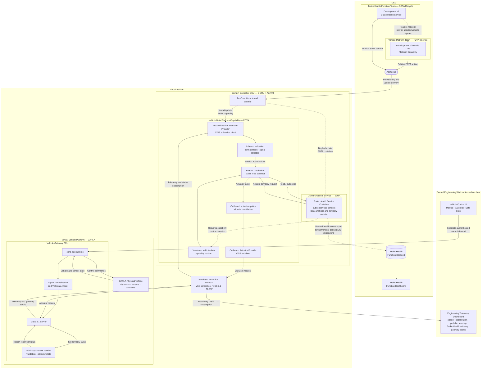

<!-- SPDX-FileCopyrightText: 2026 maninblack -->
<!-- SPDX-License-Identifier: MIT -->

# High-Level Architecture 1.0

- Status: Accepted architecture baseline
- Version: 1.0
- Accepted: 2026-08-16
- Scope: CARLA, Vehicle Gateway ECU, AosVM Domain Controller, AosCloud,
  Brake Health service, backends, and demonstration tooling
- Implementation status: target architecture; current and planned elements are
  distinguished below
- Cloud or Unit mutation authorized: no

## Purpose

This document defines the agreed high-level architecture for the AosEdge
Brake Health demonstration. It records the logical vehicle model, ECU and
software boundaries, OEM ownership and release lifecycles, runtime telemetry
and actuation paths, Cloud interaction, and the role of the engineering
dashboard.

The architecture demonstrates how an OEM can add a new vehicle-facing platform
capability through FOTA and then independently deliver a containerized
functional service through SOTA. The Brake Health service analyzes vehicle
data locally in the Domain Controller and can return an advisory request to the
Vehicle Gateway without making a Cloud round trip.

This is a logical automotive architecture. All elements currently run on one
Apple Silicon Mac for the demonstration, but process placement on the Mac must
not erase the logical separation between the simulated physical vehicle, the
Vehicle Gateway ECU, the Domain Controller ECU, the OEM Cloud, and engineering
tools.

## Agreed Architecture



## System Boundaries

### Virtual physical vehicle

CARLA represents the physical part of the vehicle: vehicle dynamics, the road
environment, sensors, and actuators. It is not an Aos Unit and it does not
expose the stable application-facing vehicle-data interface directly.

### Vehicle Gateway ECU

`carla-ego-runtime` represents a Vehicle Gateway ECU. It:

1. observes the CARLA vehicle and its sensors;
2. receives control commands over a separate control channel;
3. normalizes CARLA-specific data into the VSS model;
4. exposes that model through a TLS-protected VISS 3.1 endpoint;
5. in the target architecture, accepts a narrowly scoped advisory actuator
   request and publishes the Gateway reception status.

CARLA-specific APIs stop at this boundary. Neither the Domain Controller nor
the Brake Health service connects directly to CARLA.

### Simulated in-vehicle network

The VISS connection over TLS/IP represents the communication path between the
Vehicle Gateway ECU and the Domain Controller ECU. In a real vehicle the
underlying transport could be CAN, SOME/IP, DDS, TSN Ethernet, or an OEM-defined
interface. VSS provides the stable signal semantics while the provider hides
the transport-specific implementation.

### Domain Controller ECU

QEMU plus AosVM represents a Domain Controller ECU. It contains:

- AosCore lifecycle, identity, security, and desired-state management;
- the FOTA-owned Vehicle Data Platform Capability;
- KUKSA Databroker as the stable VSS data boundary for services;
- independently deployed SOTA service containers;
- in this scenario, the Brake Health service.

The Domain Controller is not part of CARLA. Its VM boundary represents a
separate automotive computer even though both sides execute on the same Mac.

### OEM systems

AosCloud supplies provisioning and software lifecycle control. The Brake
Health Function Backend and Function Dashboard are separate functional systems
owned by the Brake Health Function Team. AosCloud is not the telemetry backend
and does not participate in the real-time Brake Health decision.

### Demo and engineering workstation

The Vehicle Control UI and Engineering Telemetry Dashboard are demonstration
tools on the Mac host. They are not production vehicle ECUs and must be shown
outside the logical vehicle boundary.

The existing telemetry dashboard is the `carla-viss-client --monitor` mode. It
connects directly to the Vehicle Gateway VISS endpoint as an independent,
read-only subscriber. It does not connect to CARLA RPC, KUKSA, AosVM, or the
Cloud backend.

No production driver HMI or Instrument Cluster is implemented in Architecture
1.0. The engineering dashboard may show that an advisory was requested and
received by the Vehicle Gateway, but the demonstration must not claim that the
warning was displayed to or acknowledged by a driver.

## OEM Ownership and Release Lifecycles

### Vehicle Platform Team — FOTA

The Vehicle Platform Team owns the vehicle-facing platform capability:

- inbound and outbound vehicle-interface providers;
- VSS mapping, filtering, and validation;
- KUKSA integration and stable signal contract;
- outbound actuator allowlists and enforcement;
- platform credentials and trust integration without embedding secrets in
  artifacts;
- platform qualification, compatibility, update, and rollback.

A Function Team requests a new or extended vehicle capability but does not
gain permission to ship privileged platform integration code.

### Brake Health Function Team — SOTA

The Brake Health Function Team owns:

- the Brake Health service container;
- local event detection, diagnostic analysis, and advisory decision logic;
- the required platform-capability version declaration;
- service configuration, state, tests, updates, and rollback;
- the optional Function Backend and Function Dashboard.

The service consumes the stable KUKSA/VSS contract. It does not depend on
CARLA, VISS, CAN, or another vehicle-network transport directly.

### Dependency and promotion

The SOTA service declares a dependency on a versioned Vehicle Data Platform
Capability. The platform is qualified through its FOTA lifecycle before the
service is accepted against it. A service defect creates a new SOTA version; a
platform defect creates a new FOTA version. Final acceptance freezes the exact
compatible graph and artifact digests before promotion.

## Runtime Flows

### 1. Vehicle telemetry

```text
CARLA vehicle state
  -> carla-ego-runtime
  -> normalized VSS model
  -> Vehicle Gateway VISS 3.1 server
  -> simulated in-vehicle network
  -> inbound VISS provider in AosVM
  -> validation, normalization and signal selection
  -> KUKSA publish of actual values
  -> Brake Health service read/subscribe
```

The provider publishes actual sensor values into KUKSA. The service reads the
current values or subscribes to their changes.

### 2. Vehicle control

```text
Vehicle Control UI
  -> separate authenticated local control channel
  -> carla-ego-runtime
  -> CARLA vehicle controls
```

The control path is deliberately separate from VISS telemetry and KUKSA. Loss
of the control client selects the existing safe-stop behavior. The Brake Health
service does not control vehicle motion in Architecture 1.0.

### 3. Local Brake Health analysis

```text
KUKSA sensor subscription
  -> emergency-braking/event detection
  -> bounded diagnostic monitoring
  -> local brake-health analysis
  -> local advisory decision
```

This path executes entirely inside the Domain Controller. It must continue to
work without Cloud connectivity and its decision latency must not contain a
Cloud round trip.

### 4. Advisory return to the Vehicle Gateway

```text
Brake Health service
  -> KUKSA actuate
  -> actuator target
  -> outbound actuation policy and allowlist
  -> outbound VISS provider
  -> VISS Set over the simulated in-vehicle network
  -> Vehicle Gateway advisory handler
  -> Gateway reception/status signal
```

The service does not send a message directly to the dashboard. The engineering
dashboard observes the Gateway-side advisory and status over VISS. This proves
that the request completed the round trip back to the simulated vehicle side.

Architecture 1.0 defines the following semantics:

| Operation | Meaning |
| --- | --- |
| KUKSA `publish` | Platform provider supplies an actual sensor or status value |
| KUKSA `read` / `subscribe` | Service or observer consumes actual values and changes |
| KUKSA `actuate` | Service requests a desired value for an allowed actuator |
| KUKSA actuator target | Desired value consumed by the outbound provider |
| VISS `Set` | Target transport operation used to deliver the allowed request to the Gateway |

The final VSS overlay is a lower-level design deliverable. The architecture
uses these provisional semantic entries:

```text
Vehicle.OEM.BrakeHealth.Advisory.Request       actuator
Vehicle.OEM.BrakeHealth.Advisory.GatewayStatus sensor
```

The request should be a bounded enum such as `NONE`,
`INSPECTION_RECOMMENDED`, or `SERVICE_REQUIRED`; it must not carry arbitrary
display text. Gateway status should describe only facts the demonstration can
prove, such as `NOT_RECEIVED`, `RECEIVED`, `REJECTED`, or `FAILED`. It must not
use `DISPLAYED` or `ACKNOWLEDGED` because no driver HMI exists in this scope.

### 5. Engineering observation

```text
Vehicle Gateway VISS server
  -> independent read-only VISS subscription
  -> Engineering Telemetry Dashboard
```

The dashboard continues to show the already implemented vehicle signals:

- speed and longitudinal acceleration;
- accelerator and brake-pedal positions;
- steering angle;
- gear and engine speed;
- GNSS and simulation health information.

The target extension adds the Brake Health advisory request and Gateway status
to the same engineering view. The dashboard is an observer and does not
participate in the decision or actuation path.

### 6. Asynchronous functional reporting

```text
Brake Health service
  -> locally retained derived health event/report
  -> Function Team Backend when connectivity is available
  -> Brake Health Function Dashboard
```

The backend receives derived health events, diagnostic evidence, and advisory
state rather than being required to process every raw signal. Loss of Cloud
connectivity may delay synchronization but must not block local analysis or the
Gateway advisory request.

## Security and Trust Boundaries

- The Vehicle Gateway VISS endpoint uses TLS and a private route intended for
  the simulated in-vehicle connection.
- Unit identity, private keys, certificates, provider credentials, and service
  tokens never enter Git or deployable public artifacts.
- The inbound provider has permission to publish only its accepted sensor and
  status paths.
- The Brake Health service receives read access only to its required sensors
  and actuation access only to its advisory actuator.
- The outbound provider accepts only an explicit actuator allowlist, validates
  type and enum bounds, and fails closed.
- An advisory request cannot become an unrestricted transport tunnel from a
  service container to the Vehicle Gateway.
- The planned Aos-to-KUKSA Authorization Adapter remains the production target.
  A bounded prototype token may be used only as a documented demonstration
  fixture until that adapter exists.
- Vehicle control remains on its separate authenticated channel and is not
  exposed to the Brake Health service.

## Current Baseline and Target Delta

| Area | Current accepted behavior | Architecture 1.0 target |
| --- | --- | --- |
| CARLA and ego runtime | Vehicle state, control, VSS normalization | Preserve unchanged behavior |
| VISS server | TLS VISS 3.1 Get and Subscribe; write rejected | Add a narrowly scoped advisory Set path and Gateway status |
| Engineering dashboard | Independent VISS subscriber for live telemetry | Add advisory request and Gateway reception status |
| Vehicle provider | Inbound VISS-to-KUKSA telemetry direction | Add separately governed outbound actuator direction |
| KUKSA contract | Readable telemetry signals | Add versioned advisory actuator and status sensor |
| Brake Health service | Not yet the accepted final service | Subscribe, analyze locally, actuate advisory, report asynchronously |
| Driver HMI | Not implemented | Remains out of scope |
| Function backend | Scenario-level target | Receive derived reports without entering the decision path |

The target writable VISS path must not weaken the current read-only guarantee
for any other signal. A request outside the explicit Brake Health advisory
contract remains rejected.

## Architectural Invariants

Architecture 1.0 is aligned only while all of the following remain true:

1. CARLA represents the physical vehicle; `carla-ego-runtime` represents the
   Vehicle Gateway ECU; AosVM represents a separate Domain Controller ECU.
2. The Brake Health service talks to KUKSA, never directly to CARLA or VISS.
3. The Engineering Telemetry Dashboard talks to the Gateway VISS endpoint,
   never directly to KUKSA or the Brake Health service.
4. Local analysis and advisory generation do not require Cloud connectivity.
5. Functional backend reporting is asynchronous and outside the decision path.
6. Vehicle control and VISS vehicle-data exchange remain separate channels.
7. FOTA platform capability and SOTA functional service retain independent
   ownership, versioning, qualification, update, and rollback lifecycles.
8. SOTA deployment is gated by a versioned platform-capability dependency.
9. The demonstration proves Gateway receipt, not display or acknowledgment by
   a driver.
10. No secret, Unit identity, or private credential is embedded in a FOTA or
    SOTA payload.

## Out of Scope

- a production IVI, Instrument Cluster, or driver-facing HMI;
- claims that a warning was displayed or acknowledged by a driver;
- autonomous modification of brake ECU calibration or vehicle motion;
- third-party Service Providers or Fleet Operators;
- a real production fleet campaign;
- selection of CAN, SOME/IP, DDS, TSN, or production ECU hardware;
- the final production authorization-adapter implementation;
- exact VSS overlay paths, enum values, timing budgets, and retry policy;
- Cloud or Unit mutation merely by accepting this document.

## Next Design and Planning Gate

The next plan revision should decompose this architecture in the following
order:

1. define and validate the versioned Brake Health VSS sensor, actuator, and
   Gateway-status contract;
2. design the scoped writable VISS/Gateway advisory handler;
3. design the outbound KUKSA actuator provider and its security policy;
4. define the Brake Health service state machine and local analysis contract;
5. extend the Engineering Telemetry Dashboard with advisory and Gateway status;
6. map the platform elements to FOTA artifacts and declare the SOTA dependency;
7. define component, integration, offline, failure, rollback, and end-to-end
   acceptance tests;
8. update the demonstration storyboard so it shows Gateway receipt instead of
   a driver-HMI claim.

This gate authorizes architecture and planning work only. Implementation,
building, signing, Cloud publication, assignment, or Unit mutation requires
the separate approvals already defined by the project roadmap.
