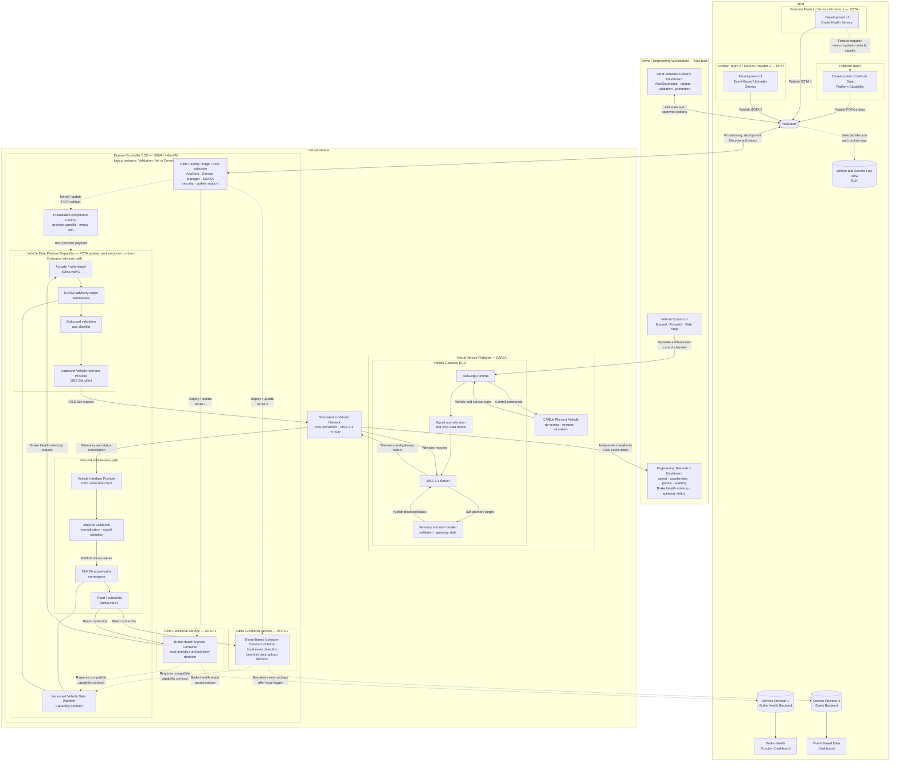

<!-- SPDX-FileCopyrightText: 2026 maninblack -->
<!-- SPDX-License-Identifier: MIT -->

# High-Level Architecture 1.1

- Status: Review candidate based on the accepted visual architecture input
- Version: 1.1
- Prepared: 2026-08-17
- Previous accepted version: 1.0, accepted 2026-08-16
- Scope: CARLA, Vehicle Gateway ECU, AosVM Domain Controller, AosCloud,
  shared Vehicle Data Platform Capability, two independent OEM Service
  Providers, functional backends, and demonstration tooling
- Implementation status: target architecture; current and planned elements are
  distinguished below
- Cloud or Unit mutation authorized: no

## Visual Authoring Source

The reviewed visual source is preserved together with its matching export:

- [Draw.io source](diagrams/aosedge-demo-hla-authoring-reference.drawio);
- [PNG export](diagrams/aosedge-demo-hla-authoring-reference.png).

The Draw.io file is the primary visual architecture source. Its PNG export and
the Mermaid rendering below are reviewable derivatives and must be regenerated
or reconciled whenever the source changes.

The visual source defines the component boundaries and principal relationships
used by Architecture 1.1: two peer OEM Function Teams represented as
independent AosCloud Service Providers, the shared Vehicle Data Platform
Capability, the Event-Based Uploader, the OEM Factory Image/runtime boundary,
the Software Delivery and log-observation surfaces, and the explicit Brake
Health advisory path through KUKSA. The diagram does not introduce a
production driver HMI; the advisory remains visible on the Engineering
Telematics Dashboard.

## Revision 1.1 Summary

Architecture 1.1 extends the previous single-function architecture by:

1. defining Function Team 1 and Function Team 2 as independent peer OEM
   organizations and independent AosCloud Service Providers;
2. adding an independently delivered Event-Based Uploader SOTA service with
   its own backend and dashboard;
3. establishing the FOTA-owned Vehicle Data Platform Capability as a shared
   vehicle integration layer used by multiple functional services;
4. separating continuous local raw-signal processing from bounded,
   event-triggered functional Cloud upload;
5. making the Brake Health advisory return explicitly pass through KUKSA,
   outbound validation, VISS Set, and the Vehicle Gateway;
6. limiting the current demo's platform feature-request flow to Function Team
   1, while Function Team 2 consumes the already available data contract;
7. distinguishing the pre-SOP OEM Factory Image and its provider-specific
   empty-slot runtime from the post-SOP FOTA capability payload;
8. adding the OEM Software Delivery Dashboard and centralized ELK log view as
   engineering surfaces over authoritative platform state;
9. clarifying that the same logical Domain Controller architecture is
   instantiated separately as the Validation Unit and Demonstration Unit.

## Purpose

This document defines the high-level architecture for the AosEdge SDV
demonstration. It records the logical vehicle model, ECU and software
boundaries, OEM ownership and release lifecycles, runtime telemetry, event
upload and advisory paths, Cloud interactions, and engineering tooling.

The architecture demonstrates how an OEM can add a new vehicle-facing platform
capability through FOTA and then independently deliver multiple containerized
functional services through SOTA. The Brake Health service performs local
analysis and can return an advisory request to the Vehicle Gateway without a
Cloud round trip. The Event-Based Uploader processes raw signals locally and
sends only a bounded event package to its functional backend when its local
event rule triggers.

This is a logical automotive architecture. All elements currently run on one
Apple Silicon Mac for the demonstration, but process placement on the Mac must
not erase the logical separation between the simulated physical vehicle, the
Vehicle Gateway ECU, the Domain Controller ECU, the OEM Cloud, and engineering
tools.

## Architecture 1.1 Model



### Diagram interpretation

The diagram is a **capability-superset view** of one logical vehicle
architecture. A deployable FOTA or SOTA box indicates that the architecture can
host that element; it does not imply that every element is installed at every
demonstration stage. The manufacturing, provisioning, `G0–G4`, and retirement
sequence and the precise presence or absence of each deployable component are
owned by Demo Scenario 1.1 rather than by this static component diagram.

The logical Domain Controller architecture is instantiated twice for the
demonstration: once as the Validation Unit and once as the Demonstration Unit.
The diagram intentionally does not duplicate the full ECU graph. The current
demo has one visible CARLA/Vehicle Gateway/VISS environment; connection or
deterministic replay between that source and the selected Unit remains a
detailed demonstration-design decision.

## System Boundaries

### Virtual physical vehicle

CARLA represents the physical part of the vehicle: vehicle dynamics, the road
environment, sensors, and actuators. It is not an Aos Unit and it does not
expose the stable application-facing vehicle-data interface directly.

### Vehicle Gateway ECU

`carla-ego-runtime` represents a Vehicle Gateway ECU. It:

1. observes the CARLA vehicle and its sensors;
2. receives control commands over a separate control channel;
3. normalizes CARLA-specific data into the VSS model;
4. exposes that model through a TLS-protected VISS 3.1 endpoint;
5. in the target architecture, accepts a narrowly scoped advisory actuator
   request and publishes the Gateway reception status.

CARLA-specific APIs stop at this boundary. Neither the Domain Controller nor
the Brake Health service connects directly to CARLA.

### Simulated in-vehicle network

The VISS connection over TLS/IP represents the communication path between the
Vehicle Gateway ECU and the Domain Controller ECU. In a real vehicle the
underlying transport could be CAN, SOME/IP, DDS, TSN Ethernet, or an OEM-defined
interface. VSS provides the stable signal semantics while the provider hides
the transport-specific implementation.

### Domain Controller ECU

QEMU plus AosVM represents a Domain Controller ECU. It contains:

- the OEM Factory Image / SOP substrate, including AosCore lifecycle,
  identity, security, desired-state management, Service Manager, KUKSA, and
  update support;
- the preinstalled, provider-specific component runtime with an initially
  empty Vehicle Data Platform Capability slot;
- the independently installed FOTA-owned Vehicle Data Platform Capability
  payload and its versioned contract;
- KUKSA Databroker as the preinstalled stable VSS data boundary for services;
- independently deployed SOTA service containers;
- the Function Team 1 Brake Health service;
- the Function Team 2 Event-Based Uploader service.

The Domain Controller is not part of CARLA. Its VM boundary represents a
separate automotive computer even though both sides execute on the same Mac.

The immutable OEM Factory Image contains no Vehicle Data Platform Capability
payload, functional SOTA service, Cloud registration, Cloud-issued credential,
or reusable per-vehicle identity. The accepted component runtime is currently
specific to one provider type and one empty slot; Architecture 1.1 does not
claim a generic arbitrary-component runtime.

The Vehicle Data Platform Capability payload is the shared
vehicle-integration layer. It owns the privileged connection to the Vehicle
Gateway, converts accepted VISS values into the stable KUKSA contract, and
enforces the narrowly scoped outbound advisory path. The KUKSA executable is
part of the SOP substrate, while the signal mappings, accepted namespaces, and
versioned contract exposed through it belong to the FOTA capability.
Functional services consume that contract and do not contain vehicle-network
integration code.

### OEM systems

AosCloud supplies provisioning and software lifecycle control for the FOTA
capability and both SOTA services. It is not a functional telemetry backend and
does not participate in either service's real-time decision path.

The OEM Software Delivery Dashboard is a presentation and scoped-orchestration
view over authoritative AosCloud APIs. It can display targets, artifact
identity, validation, promotion, Unit status, and approved actions, but it must
not invent a parallel desired state or become a second lifecycle authority.

The centralized Vehicle and Service Log View uses the configured AosEdge-to-ELK
pipeline for selected lifecycle and runtime evidence. ELK is neither a vehicle
telemetry transport nor a functional backend, and the architecture does not
assume that every AosEdge deployment includes an identical ELK topology.

Function Team 1 owns a separate Brake Health Backend and Brake Health Function
Dashboard. Function Team 2 owns a separate Event Backend and Event-Based Data
Dashboard. The two functional data planes are peers: neither backend is routed
through the other, and neither has authority to deploy software to the Unit.

### Demo and engineering workstation

The Vehicle Control UI, OEM Software Delivery Dashboard, and Engineering
Telematics Dashboard are demonstration tools on the Mac host. They are not
production vehicle ECUs and must be shown outside the logical vehicle boundary.

The existing telemetry dashboard is the `carla-viss-client --monitor` mode. It
connects directly to the Vehicle Gateway VISS endpoint as an independent,
read-only subscriber. It does not connect to CARLA RPC, KUKSA, AosVM, or the
Cloud backend.

No production driver HMI or Instrument Cluster is implemented in Architecture
1.1. The engineering dashboard may show that an advisory was requested and
received by the Vehicle Gateway, but the demonstration must not claim that the
warning was displayed to or acknowledged by a driver.

## OEM Ownership and Release Lifecycles

### Platform Team — Vehicle Data Platform Capability, FOTA

The Platform Team owns the shared vehicle-facing platform capability:

- OEM Factory Image integration and qualification, including the selected
  provider-specific component runtime and its empty-slot behavior;
- inbound and outbound vehicle-interface providers;
- VSS mapping, filtering, and validation;
- KUKSA integration and stable signal contract;
- outbound actuator allowlists and enforcement;
- platform credentials and trust integration without embedding secrets in
  artifacts;
- platform qualification, compatibility, update, and rollback.

In the current demonstration, Function Team 1 may request a new or extended
vehicle-data capability. It does not gain permission to ship privileged
platform integration code. Function Team 2 consumes signals already present in
the accepted capability contract; a Function Team 2 platform feature request
is possible in a production organization but is not part of this demo.

### Function Team 1 / Service Provider 1 — Brake Health, SOTA 1

Function Team 1 is an OEM functional vertical and an independent AosCloud
Service Provider. It owns:

- the Brake Health service container;
- local emergency-braking detection, diagnostic analysis, and advisory
  decision logic;
- the required platform-capability version declaration;
- service configuration, state, tests, updates, and rollback;
- the Brake Health Backend and Brake Health Function Dashboard.

The service consumes the stable KUKSA/VSS contract. It does not depend on
CARLA, VISS, CAN, or another vehicle-network transport directly.

### Function Team 2 / Service Provider 2 — Event-Based Uploader, SOTA 2

Function Team 2 is a peer OEM functional vertical and a separate AosCloud
Service Provider. It owns:

- the Event-Based Uploader service container;
- local processing of the raw signals allowed by its KUKSA contract;
- event detection and the decision to create a bounded event package;
- its required platform-capability version declaration;
- service configuration, state, tests, updates, and rollback;
- the Event Backend and Event-Based Data Dashboard.

The service does not continuously stream raw sensor data to the Cloud. It
detects its event locally and uploads a deliberately bounded functional event
package to its own backend when connectivity is available. The selected
candidate is a **Vehicle Stability / Low-Friction Event** based on native CARLA
vehicle-dynamics data. Its exact input subset, local detection rule, event
window, package contents, and dashboard representation remain a later detailed
design decision.

### Lifecycle independence, dependency, and promotion

The architecture has three independently owned release lifecycles:

1. the Platform Team publishes the Vehicle Data Platform Capability through
   FOTA;
2. Service Provider 1 publishes the Brake Health service through SOTA 1;
3. Service Provider 2 publishes the Event-Based Uploader through SOTA 2.

Each SOTA service declares its own dependency on a versioned Vehicle Data
Platform Capability. The services do not depend on each other and can be
installed, updated, or rolled back independently, subject to their platform
contract. The platform is qualified through its FOTA lifecycle before a
dependent service is accepted against it. A service defect creates a new
version in that service provider's SOTA lifecycle; a platform defect creates a
new FOTA version. Promotion freezes the exact compatible graph and artifact
digests accepted on the validation Unit before rollout to the demonstration
Unit.

The target architecture requires **native AosCloud pre-deployment
enforcement** of each SOTA-to-FOTA compatibility range. If the intended Unit
does not yet contain a compatible Vehicle Data Platform Capability, AosCloud
rejects the SOTA request before it creates a rollout or sends update content to
the Unit. The current released Cloud/API does not yet expose this cross-type
dependency. On 2026-08-18 the AosEdge Platform Team identified it as a roadmap
feature, without committing a release or date. The corresponding negative-path
demo is therefore deferred until an implementing release is available and
qualified. No temporary admission controller is added to this architecture.

Service-side compatibility metadata and fail-closed startup/readiness remain
required defense in depth; they do not substitute for the future native Cloud
gate.

## Runtime Flows

### 1. Shared vehicle telemetry

```text
CARLA vehicle state
  -> carla-ego-runtime
  -> normalized VSS model
  -> Vehicle Gateway VISS 3.1 server
  -> simulated in-vehicle network
  -> inbound VISS provider in AosVM
  -> validation, normalization and signal selection
  -> KUKSA publish of actual values
  +-> Brake Health service read/subscribe
  `-> Event-Based Uploader read/subscribe
```

The platform provider publishes actual sensor values into KUKSA once. Each
functional service reads only the paths in its own contract or subscribes to
their changes. The services do not receive raw values from one another.

### 2. Vehicle control

```text
Vehicle Control UI
  -> separate authenticated local control channel
  -> carla-ego-runtime
  -> CARLA vehicle controls
```

The control path is deliberately separate from VISS telemetry and KUKSA. Loss
of the control client selects the existing safe-stop behavior. The Brake Health
service and Event-Based Uploader do not control vehicle motion in Architecture
1.1.

### 3. Local Brake Health analysis

```text
KUKSA sensor subscription
  -> emergency-braking/event detection
  -> bounded diagnostic monitoring
  -> local brake-health analysis
  -> local advisory decision
```

This path executes entirely inside the Domain Controller. It must continue to
work without Cloud connectivity and its decision latency must not contain a
Cloud round trip.

### 4. Local event detection and bounded upload

```text
KUKSA sensor subscription
  -> local raw-signal processing
  -> local event rule
  -> bounded event package
  -> Function Team 2 Event Backend when connectivity is available
  -> Event-Based Data Dashboard
```

Event recognition runs inside the Domain Controller and does not require a
Cloud round trip. The service sends an event package only after the local rule
triggers; it does not use the functional backend as a continuous raw-sensor
processor. Connectivity loss may delay upload, but it must not prevent local
event detection. Retention size, retry behavior, and the exact bounded package
are lower-level design decisions.

For the current demo, this service must use vehicle data already present in the
accepted Vehicle Data Platform Capability. The event and payload will be
selected after an inventory of CARLA/VISS signals that require no additional
vehicle-side development.

### 5. Advisory return to the Vehicle Gateway

```text
Brake Health service
  -> KUKSA actuate
  -> actuator target
  -> outbound actuation policy and allowlist
  -> outbound VISS provider
  -> VISS Set over the simulated in-vehicle network
  -> Vehicle Gateway advisory handler
  -> Gateway reception/status signal
```

The service does not send a message directly to the dashboard. The engineering
dashboard observes the Gateway-side advisory and status over VISS. This proves
that the request completed the round trip back to the simulated vehicle side.

Architecture 1.1 defines the following semantics:

| Operation | Meaning |
| --- | --- |
| KUKSA `publish` | Platform provider supplies an actual sensor or status value |
| KUKSA `read` / `subscribe` | Service or observer consumes actual values and changes |
| KUKSA `actuate` | Service requests a desired value for an allowed actuator |
| KUKSA actuator target | Desired value consumed by the outbound provider |
| VISS `Set` | Target transport operation used to deliver the allowed request to the Gateway |

The final VSS overlay is a lower-level design deliverable. The architecture
uses these provisional semantic entries:

```text
Vehicle.OEM.BrakeHealth.Advisory.Request       actuator
Vehicle.OEM.BrakeHealth.Advisory.GatewayStatus sensor
```

The request should be a bounded enum such as `NONE`,
`INSPECTION_RECOMMENDED`, or `SERVICE_REQUIRED`; it must not carry arbitrary
display text. Gateway status should describe only facts the demonstration can
prove, such as `NOT_RECEIVED`, `RECEIVED`, `REJECTED`, or `FAILED`. It must not
use `DISPLAYED` or `ACKNOWLEDGED` because no driver HMI exists in this scope.

### 6. Engineering observation

```text
Vehicle Gateway VISS server
  -> independent read-only VISS subscription
  -> Engineering Telematics Dashboard
```

The dashboard continues to show the already implemented vehicle signals:

- speed and longitudinal acceleration;
- accelerator and brake-pedal positions;
- steering angle;
- gear and engine speed;
- GNSS and simulation health information.

The target extension adds the Brake Health advisory request and Gateway status
to the same engineering view. The dashboard is an observer and does not
participate in the decision or actuation path.

### 7. Brake Health functional reporting

```text
Brake Health service
  -> locally retained derived health event/report
  -> Function Team Backend when connectivity is available
  -> Brake Health Function Dashboard
```

The backend receives derived health events, diagnostic evidence, and advisory
state rather than being required to process every raw signal. Loss of Cloud
connectivity may delay synchronization but must not block local analysis or the
Gateway advisory request.

### 8. Independent software lifecycle delivery

```text
Platform Team -> FOTA artifact -> AosCloud -> AosCore -> preinstalled component runtime -> Vehicle Data Platform Capability
Service Provider 1 -> SOTA 1 -> AosCloud -> AosCore -> Brake Health service
Service Provider 2 -> SOTA 2 -> AosCloud -> AosCore -> Event-Based Uploader
```

AosCloud delivers and observes all three lifecycles, but it does not merge
their ownership or release decisions. A service can be changed without
rebuilding the other service, and either service can be changed without a new
FOTA when the installed platform contract already satisfies its declared
dependency.

## Security and Trust Boundaries

- The Vehicle Gateway VISS endpoint uses TLS and a private route intended for
  the simulated in-vehicle connection.
- Unit identity, private keys, certificates, provider credentials, and service
  tokens never enter Git or deployable public artifacts.
- The immutable OEM Factory Image contains no Cloud registration, Cloud-issued
  credential, reusable per-vehicle secret, or fixed identity that would be
  duplicated across Unit instances.
- The inbound provider has permission to publish only its accepted sensor and
  status paths.
- Each functional service receives read access only to its required KUKSA
  sensor paths.
- Only the Brake Health service receives actuation access, and only to its
  advisory actuator target.
- The Event-Based Uploader has no vehicle-actuation permission. Its external
  egress is limited to its own backend and a bounded event payload.
- The outbound provider accepts only an explicit actuator allowlist, validates
  type and enum bounds, and fails closed.
- An advisory request cannot become an unrestricted transport tunnel from a
  service container to the Vehicle Gateway.
- The planned Aos-to-KUKSA Authorization Adapter remains the production target.
  A bounded prototype token may be used only as a documented demonstration
  fixture until that adapter exists.
- Vehicle control remains on its separate authenticated channel and is not
  exposed to either functional service.
- Functional backends have no AosCore lifecycle authority and cannot act as a
  substitute path into CARLA, VISS, or KUKSA.
- The two Service Providers have separate identities, credentials, artifacts,
  configuration, and Cloud-side functional endpoints.
- The OEM Software Delivery Dashboard uses scoped AosCloud authentication and
  exposes only explicitly approved mutation actions; read views do not grant
  lifecycle authority.
- ELK access is separately authenticated and filtered; service logs must not
  disclose Unit secrets, service tokens, or unrestricted vehicle data.

## Current Baseline and Target Delta

| Area | Current accepted behavior | Architecture 1.1 target |
| --- | --- | --- |
| CARLA and ego runtime | Vehicle state, control, VSS normalization | Preserve unchanged behavior |
| VISS server | TLS VISS 3.1 Get and Subscribe; write rejected | Add a narrowly scoped advisory Set path and Gateway status |
| Engineering dashboard | Independent VISS subscriber for live telemetry | Add advisory request and Gateway reception status |
| Vehicle Data Platform Capability | Inbound VISS-to-KUKSA implementation and qualification evidence exist in project artifacts; it is not yet the accepted empty-service demo baseline | Provide one shared, versioned FOTA capability with inbound telemetry and separately governed outbound advisory directions |
| OEM Factory Image / Domain Controller substrate | The current runtime is provider-specific; installed `.1` and `.2` systems prove an empty provider slot, while the hardened candidate is not yet an accepted clean factory artifact | Freeze and qualify an immutable, unprovisioned OEM image containing AosCore, KUKSA, security, update support, and the selected empty-slot runtime, but no provider payload or functional service |
| KUKSA contract | Readable telemetry signals | Serve both services and add the versioned advisory actuator and status sensor |
| Brake Health service | Not yet the accepted final service | Subscribe, analyze locally, actuate advisory, report asynchronously |
| Event-Based Uploader | Not implemented | Detect a selected event locally and send a bounded package to its own backend |
| Service Provider separation | AosCloud lifecycle mechanisms exist; the two target services are not yet accepted as independent deployments | Independent Service Provider identities, artifacts, dependencies, updates, and rollback |
| Cross-lifecycle dependency admission | Service-to-layer and component-to-component dependencies exist, but the current released Cloud/API does not expose a Service-to-FOTA-component admission rule | Natively reject an incompatible SOTA request in AosCloud before rollout creation or Unit transfer; deferred until the roadmap feature ships and is qualified |
| OEM Software Delivery Dashboard | Not implemented; the AosCloud UI and APIs remain authoritative | Provide a simplified view of actual targets, artifact identity, validation, promotion, and Unit state without creating a parallel desired-state store |
| Vehicle and Service Log View | AosEdge log mechanisms exist; the exact Cloud-to-ELK deployment integration is not yet accepted | Show selected, access-controlled lifecycle and runtime evidence without using ELK as a telemetry or functional-data backend |
| Validation and Demonstration instances | Separate VM roles exist, while the demo has one visible CARLA/Vehicle Gateway/VISS source | Instantiate the same logical Domain Controller architecture twice and define deterministic selection or replay without claiming two simultaneous vehicles |
| Driver HMI | Not implemented | Remains out of scope |
| Functional backends | Scenario-level targets | Two separate backends receive derived Brake Health and event data without entering local decisions or software lifecycle control |

The target writable VISS path must not weaken the current read-only guarantee
for any other signal. A request outside the explicit Brake Health advisory
contract remains rejected.

## Architectural Invariants

Architecture 1.1 is aligned only while all of the following remain true:

1. CARLA represents the physical vehicle; `carla-ego-runtime` represents the
   Vehicle Gateway ECU; AosVM represents a separate Domain Controller ECU.
2. Both functional services talk to KUKSA, never directly to CARLA or VISS.
3. Function Team 1 and Function Team 2 are peer OEM organizations and separate
   AosCloud Service Providers.
4. Only Function Team 1 requests a Vehicle Data Platform Capability extension
   in the current demo; Function Team 2 uses the already available contract.
5. The Event-Based Uploader processes raw signals locally and sends a bounded
   event package only after its local trigger; it does not continuously stream
   raw sensor data to the Cloud.
6. Brake Health local analysis and advisory generation do not require Cloud
   connectivity.
7. Event-Based Uploader event detection does not require Cloud connectivity;
   its backend synchronization is asynchronous.
8. AosCloud lifecycle control, Brake Health functional data, and Event-Based
   Uploader functional data are three distinct Cloud concerns.
9. The Engineering Telematics Dashboard talks to the Gateway VISS endpoint,
   never directly to KUKSA or either functional service.
10. Vehicle control and VISS vehicle-data exchange remain separate channels.
11. The platform FOTA, Brake Health SOTA 1, and Event-Based Uploader SOTA 2
    retain independent ownership, versioning, qualification, update, and
    rollback lifecycles.
12. The two services do not depend on each other; each is gated only by its
    declared Vehicle Data Platform Capability contract. Native AosCloud
    pre-deployment enforcement is a deferred target capability and must not be
    claimed against the current release.
13. A Brake Health advisory passes through KUKSA, the outbound allowlist, VISS
    Set, and the Vehicle Gateway before the engineering dashboard observes it.
14. The demonstration proves Gateway receipt, not display or acknowledgment by
    a driver.
15. No secret, Unit identity, or private credential is embedded in a FOTA or
    SOTA payload.
16. The static diagram is a target capability superset; Demo Scenario 1.1 owns
    component presence and absence at each manufacturing, provisioning,
    `G0–G4`, and retirement stage.
17. Validation and Demonstration Units are separate instances of the same
    logical Domain Controller architecture; the diagram does not imply two
    simultaneous CARLA vehicles.

## Out of Scope

- a production IVI, Instrument Cluster, or driver-facing HMI;
- claims that a warning was displayed or acknowledged by a driver;
- autonomous modification of brake ECU calibration or vehicle motion;
- third-party Service Providers or Fleet Operators;
- a Function Team 2 request for a new Vehicle Data Platform Capability in the
  current demo;
- continuous raw-sensor streaming to the Event Backend as the Event-Based
  Uploader's operating model;
- the detailed Function Team 2 Vehicle Stability / Low-Friction input subset,
  detection algorithm, event window, bounded payload, and dashboard fields
  before its CARLA qualification and data-contract design are complete;
- a real production fleet campaign;
- selection of CAN, SOME/IP, DDS, TSN, or production ECU hardware;
- the final production authorization-adapter implementation;
- exact VSS overlay paths, enum values, timing budgets, and retry policy;
- Cloud or Unit mutation merely by accepting this document.

## Next Design and Planning Gate

The next plan revision should decompose this architecture in the following
order:

1. freeze and qualify the clean OEM Factory Image, its provider-specific
   empty-slot runtime, and the absence of feature payloads and reusable
   identity;
2. define the two Domain Controller instances and deterministic selection or
   replay of the single CARLA/Vehicle Gateway/VISS source;
3. inventory CARLA/VISS signals already available without additional
   vehicle-side development;
4. qualify the selected Function Team 2 Vehicle Stability / Low-Friction Event
   candidate and define its bounded event package;
5. define the shared, versioned KUKSA/VSS data contract required by both
   services;
6. define and validate the Brake Health actuator and Gateway-status contract,
   then design the scoped writable VISS/Gateway handler and outbound KUKSA
   provider security policy;
7. define the Brake Health and Event-Based Uploader service state machines,
   offline behavior, functional-backend contracts, and functional dashboards;
8. define the OEM Software Delivery Dashboard contract and qualify the
   AosEdge-to-ELK observation path without creating new sources of truth;
9. map platform elements to FOTA, each service to its own SOTA lifecycle,
   declare both platform-capability dependencies, and qualify native Cloud
   rejection when the roadmap feature becomes available;
10. define component, integration, offline, failure, recovery, rollback, and
    end-to-end acceptance tests;
11. after Architecture 1.1 acceptance, reconcile the existing Demo Scenario
    1.1 mapping, storyboard, coverage matrix, and implementation plan against
    this model.

This gate authorizes architecture and planning work only. Implementation,
building, signing, Cloud publication, assignment, or Unit mutation requires
the separate approvals already defined by the project roadmap.
