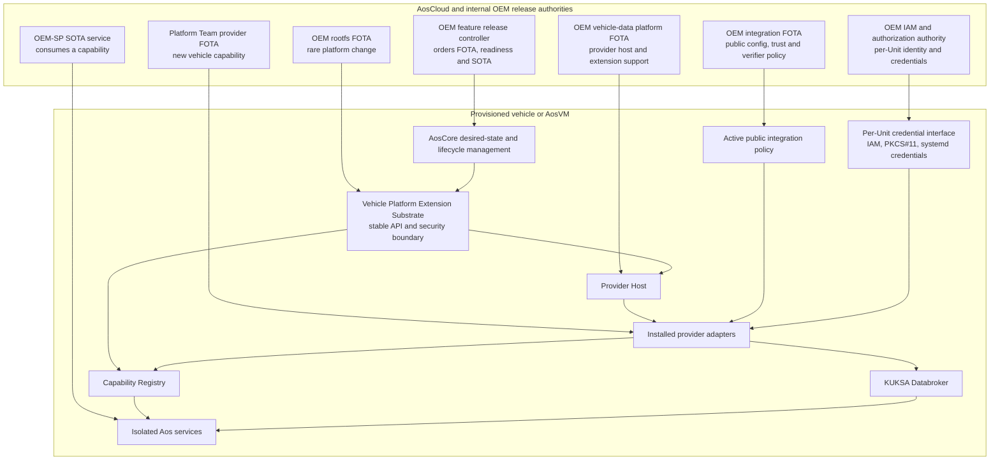

<!-- SPDX-FileCopyrightText: 2026 maninblack -->
<!-- SPDX-License-Identifier: MIT -->

# Post-SOP SDV Feature Extension Architecture

- Status: Accepted baseline
- Version: 1.0
- Accepted: 2026-08-16
- Scope: product demonstration intent and target architecture
- Implementation plan status: unchanged pending review
- Cloud or Unit mutation authorized: no

## Executive Intent

The demonstration must show more than a fixed CARLA-to-KUKSA integration. It
must show that an already provisioned and operational vehicle can gain a new
feature after start of production without rebuilding or reprovisioning the
vehicle and, for the normal extension case, without replacing its root
filesystem.

The demonstration is intentionally limited to one OEM organization. External
third-party Service Providers, Fleet Operators and a real production fleet are
out of scope. An **OEM Service Provider (OEM-SP)** is a team or organization
inside the OEM that owns one functional vertical and the lifecycle of its
containerized feature services. AosCloud Service Provider identities are used
to represent these OEM-SP organizations; they do not represent an external
commercial provider in this demonstration.

The target post-SOP story is:

1. a vehicle is provisioned, online, and running its accepted software graph;
2. its existing provider publishes vehicle signals to KUKSA;
3. an independently deployed service consumes those signals;
4. later, an OEM-SP develops a new feature that requires a
   vehicle capability that the baseline vehicle does not expose;
5. the OEM-SP gives the Vehicle Platform Team a versioned capability request
   with requirements and acceptance criteria;
6. the Vehicle Platform Team independently develops, deploys and qualifies the
   missing platform capability through its FOTA lifecycle on the validation
   Unit;
7. after platform qualification, the Vehicle Platform Team publishes a formal
   capability handoff;
8. the OEM-SP independently deploys and iterates its service through the SOTA
   lifecycle on the same validation Unit;
9. service defects remain in the OEM-SP loop, while confirmed platform defects
   return to the Vehicle Platform Team and produce a new FOTA version;
10. formal integration validation and acceptance freeze an exact graph of
    versions and artifact digests;
11. that unchanged accepted graph is promoted to the demonstration Unit as a
   production-rollout proxy;
12. both additions can be updated and rolled back without disturbing the
    previously accepted vehicle functions.

This is the intended Software-Defined Vehicle claim: post-SOP feature delivery
through stable platform contracts, explicit lifecycle ownership, isolation,
dependency checks, validation, acceptance, and promotion between release
stages.

## Demonstration Claim

The final demonstration should prove the following statement:

> An OEM can add a previously unavailable vehicle-data capability and a new
> service to an already provisioned vehicle, validate and correct both release
> streams on a validation Unit, formally accept their exact artifact graph,
> and promote the same graph to a production-like demonstration Unit without
> changing vehicle identity, prior functions, or rootfs version.

The demonstration is not successful merely because a new container starts. It
must show all of these properties:

- the new capability did not exist before the feature release;
- the new provider or adapter is independently versioned and visible;
- the service does not become ready before its required capability is ready;
- existing CARLA/VISS-to-KUKSA telemetry continues to work;
- no private credential enters a provider, integration, or service bundle;
- provider failure prevents only the new feature from becoming active;
- service and provider rollback restore the previous accepted graph;
- the Unit is not deprovisioned, cloned, or assigned a new identity;
- the normal post-SOP path does not require a new rootfs;
- failed validation produces a new version rather than mutating an uploaded
  artifact;
- the demonstration Unit receives the exact versions and digests accepted on
  the validation Unit, not a rebuilt release.

## Scope

This document defines:

- the user-visible demonstration narrative;
- platform, provider, integration, credential, and service boundaries;
- the target capability model;
- the post-SOP feature-release lifecycle;
- the validation, acceptance and promotion stages used by the demonstration;
- the conditions under which a rootfs update is and is not required;
- dependency, readiness, security, update, and rollback expectations;
- the decisions that must be resolved before changing the implementation plan.

It does not select the final second demo feature, change an implementation
gate, authorize a build, sign an artifact, call a mutating Cloud API, or modify
a provisioned Unit. It also does not define third-party onboarding, commercial
multi-tenancy, an external Fleet Operator workflow, or an actual production
fleet rollout.

## Actors and Lifecycle Ownership

| Internal OEM organization | AosCloud identity used for the demo | Owns | Must not own implicitly |
| --- | --- | --- | --- |
| Vehicle Platform Team | OEM | rootfs, platform extension substrate, privileged providers, public integration policy, hardware abstraction, platform FOTA, conformance tests and platform qualification | OEM-SP service implementation or service release keys |
| OEM Service Provider (OEM-SP) | AosCloud Service Provider | one OEM functional vertical, containerized feature services, capability requirements, service configuration, application state, service tests and SOTA versions | kernel drivers, unrestricted device access, Unit private keys, OEM FOTA signing authority |
| OEM Release and Validation Authority | OEM | validation scope, acceptance gates, approvals, promotion, rollback decisions and release evidence | changing an already signed artifact after validation |
| OEM Security and IAM Authority | OEM governance | Unit and Node identity, certificate lifecycle, private-key handles, service permissions and short-lived credentials | provider executable, feature implementation or shared private credentials in a release payload |

The OEM-SP may declare a required vehicle capability, but it does not gain
authority to install privileged system code. The Vehicle Platform
Team decides whether the capability already exists, can be added through an
accepted extension contract, or requires a platform/rootfs release. The OEM
Release and Validation Authority remains a separate approval gate even though
all participants belong to the same legal OEM.

An OEM-SP identity is therefore a technical ownership, authorization and
signing boundary inside the OEM, not a third-party business relationship.

## Release Stages and Unit Roles

The current demonstration uses two persistent, independently provisioned Units.
They represent release stages, not different owners:

| Release stage | Current Unit | Purpose | Allowed change pattern |
| --- | --- | --- | --- |
| Platform capability qualification | validation VM | Let the Vehicle Platform Team deploy FOTA, run its own conformance, security and regression tests, and correct platform defects | New immutable FOTA versions may be deployed repeatedly; a failed artifact is never overwritten |
| Capability handoff | signed platform evidence | Publish the accepted capability contract, provider version and digest, readiness semantics, permissions, compatibility range and platform test evidence | The handoff is versioned and immutable; a replacement handoff references a new FOTA version |
| OEM-SP feature integration | validation VM | Let the OEM-SP deploy and iterate SOTA against the qualified capability; distinguish service defects from platform defects | Service defects create new SOTA versions; confirmed platform defects return to the platform loop |
| Formally accepted release graph | signed release evidence | Freeze the exact component, service, configuration and digest graph that passed the acceptance gates | No rebuild, repack, replacement signature or silent configuration change |
| Production-like promotion | demonstration VM | Prove that the accepted graph can be deployed to an independently provisioned vehicle and behaves identically | Only the exact accepted graph is promoted; environment-specific Unit credentials remain local to the Unit |
| Real production rollout | not present in this demo | Future campaign across production vehicles after OEM approval | Out of scope; represented only by the successful promotion to the demonstration VM |

The validation VM is the only current member of the logical OEM test fleet. The
demonstration VM is a production-rollout proxy and must not be used as an
engineering scratch Unit. No Fleet Operator role or external fleet-management
organization participates in this scenario.

The same validation VM is used sequentially by two independently owned release
loops. Platform qualification does not depend on the production OEM-SP service:
the Vehicle Platform Team uses a conformance suite and reference consumer built
from the agreed capability requirements.

The release flow is:

```mermaid
flowchart LR
    REQUEST["OEM-SP capability request<br/>requirements and acceptance criteria"]

    subgraph PLATFORM["Vehicle Platform Team lifecycle"]
        PDEV["Develop platform capability"]
        PFOTA["Build and deploy<br/>new FOTA version"]
        PTEST["Platform tests on validation VM<br/>conformance, security and regression"]
        PGATE{"Platform capability<br/>qualified?"}

        PDEV --> PFOTA --> PTEST --> PGATE
        PGATE -->|"No: platform fix"| PDEV
    end

    HANDOFF["Capability handoff<br/>contract, version, readiness<br/>and platform evidence"]

    subgraph SERVICE["OEM Service Provider lifecycle"]
        SDEV["Develop or update service"]
        SSOTA["Build and deploy<br/>new SOTA version"]
        STEST["Service and integration tests<br/>on validation VM"]
        SGATE{"Feature integration<br/>accepted?"}

        SDEV --> SSOTA --> STEST --> SGATE
        SGATE -->|"No: service defect"| SDEV
    end

    FREEZE["Accepted feature graph<br/>exact FOTA and SOTA digests"]
    DEMO["Demonstration VM<br/>production-like promotion"]
    FUTURE["Future production fleet<br/>not part of this demo"]

    REQUEST --> PDEV
    PGATE -->|"Yes"| HANDOFF
    HANDOFF --> SDEV
    SGATE -->|"Platform defect found"| PDEV
    SGATE -->|"Yes"| FREEZE
    FREEZE -->|"promote without rebuilding"| DEMO
    DEMO -.->|"future OEM rollout decision"| FUTURE
```



The dependency is directional: an OEM-SP service may require a platform
capability, while platform qualification must not require that production
service. OEM-SP implementation can begin earlier against the agreed contract,
mock or reference endpoint, but deployment to the validation VM waits for the
capability handoff.

FOTA and SOTA iterate independently, but final acceptance applies to their
combined compatibility graph. A service defect does not trigger FOTA. A
platform patch that preserves the capability contract does not require an
unchanged service to be rebuilt, although the combined graph must be retested.
An incompatible capability-contract change requires a new handoff and a new
compatible SOTA version. Every changed artifact receives a new version.

## Target Logical Architecture



The diagram is logical. The review must still select how provider extensions
map to currently supported Aos deployable items.

## Stable Vehicle Platform Extension Substrate

The next rootfs must establish a reusable extension boundary rather than add a
new hardcoded runtime for every future provider. This substrate is the stable
post-SOP contract and should contain no functional-vertical-specific feature
implementation.

Its responsibilities are:

1. expose a versioned provider-host or platform-extension API;
2. manage bounded installation, activation, health, stop, update and rollback;
3. expose a capability registry with provider identity, capability version,
   state and health;
4. provide KUKSA publication and authorization integration;
5. provide credential handles or protected materialization without embedding
   credentials in a release artifact;
6. enforce fixed resource, network, filesystem, device and SELinux boundaries;
7. preserve independent provider state and failure containment;
8. report sanitized provider status to AosCore and AosCloud;
9. reject unsupported extension API versions and unsafe payloads;
10. remain backward compatible for the accepted lifetime of its API version.

The current `systemd-slot-component` runtime is evidence for one secure A/B
component lifecycle, but it is not yet this substrate. It is provider-specific,
reports one runtime type, accepts one active instance, and validates one fixed
payload contract. The implementation plan must not assume that renaming it
makes it a generic multi-provider runtime.

## Capability Contract

A service should depend on a capability, not on a CARLA-specific process name
or a concrete provider implementation.

Example capability identifiers:

```text
vehicle.data.basic.v1
vehicle.diagnostics.snapshot.v1
vehicle.energy.battery.v1
vehicle.location.precise.v1
```

A capability record should minimally expose:

| Field | Meaning |
| --- | --- |
| `id` | stable, namespaced capability identifier |
| `version` | semantic contract version, not provider package version |
| `providerId` | active provider identity |
| `providerVersion` | installed provider release |
| `state` | `starting`, `ready`, `degraded`, `unavailable`, or `stopping` |
| `schema` | versioned data or API contract reference |
| `permissions` | required read, provide, or actuation scope |
| `updatedAt` | last trusted state transition time |

Multiple provider implementations may satisfy the same capability contract:

```text
CARLA simulation adapter ----+
SOME/IP vehicle adapter -----+--> vehicle.data.basic.v1 --> service
CAN gateway adapter ---------+
```

The registry is a readiness and discovery mechanism. It is not a credential
store and must not disclose tokens, private-key URLs, certificate subjects,
vehicle identifiers, or unrestricted operational logs.

## Capability Request and Platform Handoff

The two release loops meet through versioned contracts rather than a shared
build pipeline.

An OEM-SP capability request should contain at least:

| Field | Purpose |
| --- | --- |
| Request identity and owner | Identifies the requesting OEM-SP and accountable functional vertical |
| Required capability | Names the semantic vehicle capability, not a preferred provider implementation |
| Functional contract | Defines required signals, operations, schema and expected behavior |
| Non-functional requirements | Defines latency, rate, availability, persistence and resource expectations |
| Security requirements | Defines read, provide or actuation permissions and prohibited access |
| Compatibility expectations | Defines baseline vehicle models, platform API range and contract stability |
| Acceptance criteria | Provides executable or objectively measurable platform-level checks |

The Vehicle Platform Team may satisfy the request with an existing capability,
a new provider extension, a platform update, or, when unavoidable, a rootfs or
BSP update. The OEM-SP does not prescribe the privileged implementation.

After independent platform qualification, the Vehicle Platform Team publishes
a capability handoff containing at least:

| Field | Purpose |
| --- | --- |
| Capability ID and contract version | Stable interface that OEM-SP services may require |
| Provider component ID, version and digest | Exact qualified FOTA implementation |
| Platform compatibility range | Accepted rootfs and platform API versions |
| Readiness and health semantics | Objective conditions for `ready`, `degraded` and `unavailable` |
| Schema and permissions | Data/API contract and least-privilege access requirements |
| Conformance evidence | Platform, security, regression, restart and rollback results |
| Known limitations | Explicit behavior that the OEM-SP must account for |

The handoff contains no private key, per-Unit certificate or reusable KUKSA
token. It marks the capability as eligible for OEM-SP integration, not as a
fully accepted vehicle feature. One qualified capability may later be reused
by several OEM-SP organizations without repeating its platform implementation
cycle.

## Extension Classes

Not every missing capability should trigger the same release path.

| Class | Example | Delivery | Rootfs update |
| --- | --- | --- | --- |
| Existing capability | a new trip-statistics service reads existing KUKSA paths | service SOTA only | No |
| Unprivileged adapter | derived signals or a new mapping over an existing protected platform API | isolated extension service or accepted plugin lifecycle | No |
| Privileged provider within an existing platform contract | a new diagnostics adapter using a prequalified vehicle gateway API | OEM provider-extension FOTA | No |
| Platform capability extension | new functional server, new device class, or new credential broker API | platform FOTA, then provider FOTA | Usually no full rootfs if the platform component can supply it safely |
| OS/BSP extension | new kernel driver, device node, boot dependency, SELinux primitive, safety partition, or hardware abstraction | rootfs/firmware FOTA | Yes |

The architectural goal is not to make arbitrary privileged code dynamically
installable. It is to make a broad, prequalified class of safe extensions
possible without changing the rootfs while retaining an explicit rootfs path
for genuinely new OS or hardware requirements.

## Mapping Provider Extensions to Aos Deployable Items

The logical provider-extension contract has three possible physical mappings.
The review must select and qualify one primary path rather than silently mixing
them.

### Option A — Independently visible provider FOTA components

Each provider extension is a distinct Cloud-visible component handled by a
generic multi-provider component runtime.

Advantages:

- independent version, inventory, dependency, rollout and rollback;
- clearest OEM platform lifecycle;
- best Unit inventory and release observability.

Questions to resolve:

- whether the current Aos runtime/type model can route multiple independent
  component types to one generic runtime without predeclaring each type in the
  rootfs;
- how instances, stores and policies remain isolated;
- how the Cloud catalog represents a new provider type on an already shipped
  Unit Model.

This is the preferred logical model but is not yet proven on the pinned AosVM.

### Option B — One vehicle-data-platform FOTA component with provider plugins

One independently updated OEM FOTA component owns the provider host and its
accepted plugin set. Adding a provider creates a new platform-component version
without changing the rootfs.

Advantages:

- compatible with one predeclared component type;
- one A/B transaction and rollback boundary;
- no rootfs update for a new plugin.

Costs:

- providers are not separately visible in the Cloud component inventory;
- updating one plugin republishes the aggregate component;
- independent plugin rollout and rollback require host-level reporting and
  policy.

This is the conservative fallback if Option A is not supported safely.

### Option C — Isolated SOTA adapter over a stable provider-host API

An unprivileged provider adapter runs as an Aos service container and receives
only a narrow platform API, KUKSA permissions, resource quotas and network
access.

Advantages:

- native post-SOP service lifecycle and multi-instance support;
- no new FOTA component type;
- strong container isolation and independent update cadence.

Constraints:

- unsuitable for code that needs a kernel driver, arbitrary host filesystem,
  direct unrestricted hardware access or a stronger safety lifecycle;
- the OEM must still approve the capability and permissions;
- it must not be confused with an ordinary feature service.

This should be the default for unprivileged adapters once the stable platform
API exists.

## Logical Feature Release

A post-SOP feature is a coordinated version graph, not a single package.

Example:

```yaml
feature: diagnostic-summary
version: 1.0.0
requires:
  platformApi: ">=1.0.0"
  capabilities:
    - vehicle.diagnostics.snapshot.v1
components:
  providerExtension:
    id: vehicle-diagnostics-provider
    version: 1.0.0
services:
  - id: diagnostic-summary-service
    version: 1.0.0
rollout:
  providerBeforeService: true
  serviceBeforeProviderRollback: true
```

This is a logical architecture example, not an accepted file format. Any
tracked implementation descriptor must use the repository license, remain
non-secret, pin exact identities and versions, and be validated before it can
drive an API operation.

## Current Aos Dependency Boundary

The current Aos FOTA update schema supports component-to-component
`runtimeDependencies` with an exact or minimum component version. It can be
used for rootfs, integration, provider-host and privileged provider component
relationships.

The published v1.1 service configuration supports service layers, runtime,
resources, devices, permissions and allowed connections, but it does not
document a direct SOTA-service-to-FOTA-component dependency. The unreleased
`Next` ontology describes more general `mustBeInstalled` dependencies, but the
prototype must not assume that unreleased model exists in the deployed Cloud.

Until a native cross-lifecycle dependency is verified, two controls are
required:

1. a feature release controller sequences provider FOTA, waits for the exact
   installed version and capability readiness, and only then assigns SOTA;
2. the service checks its required capability at startup and does not report
   ready while it is absent or incompatible.

The controller must operate by desired state and observed status, not by fixed
delays. Every mutating action remains a separately authorized operation and
must account for the known validation-set scope defect.

## Post-SOP Release Cycle

### Stage 0 — Capture the capability request and accepted baseline

1. The OEM-SP issues a versioned capability request with functional,
   non-functional, security, compatibility and acceptance requirements.
2. Read and record the validation VM's Unit identity, rootfs, platform API,
   installed components, capabilities, active services and artifact digests.
3. Prove that the proposed capability and feature are absent and that the
   existing vehicle graph is healthy.
4. The Vehicle Platform Team classifies the request as an existing capability,
   provider extension, platform extension, or required rootfs/BSP change.
5. Reject an incompatible or unsafe request before any Unit mutation.

### Stage 1 — Independently qualify the platform capability

1. The Vehicle Platform Team implements a conformance suite and reference
   consumer from the agreed request. This suite is independent of the OEM-SP
   production service.
2. The team issues immutable versions of any required public integration data
   and provider or provider-host FOTA component.
3. Deploy those versions only to the validation VM.
4. Wait for the exact installed versions and required capability to report
   `ready`; do not use a fixed delay as evidence.
5. Run conformance, provider, security, source-loss, credential-loss, recovery,
   persistence, rollback and existing-function regression tests.
6. If a platform defect is found, retain the failed version as evidence, issue
   a new FOTA version and repeat this stage. Do not rebuild or overwrite the
   same version.

### Stage 2 — Publish the capability handoff

1. Freeze the qualified capability contract and compatibility range.
2. Record the exact provider component version, digest, readiness semantics,
   permissions, conformance evidence and known limitations.
3. Publish the versioned handoff to the requesting OEM-SP.
4. Mark the capability eligible for service integration, but not yet accepted
   as a complete vehicle feature.

### Stage 3 — Independently iterate the OEM-SP service

1. The OEM-SP issues an immutable SOTA service version that declares the
   required semantic capability contract and compatible version range.
2. Deploy it only after the handed-off capability is installed and `ready` on
   the validation VM.
3. Run service readiness, end-to-end data, resource, restart, update, rollback
   and existing-function integration tests.
4. If a service defect is found, issue a new SOTA version without rebuilding an
   unchanged platform component.
5. If testing exposes a suspected platform defect, provide reproducible
   evidence to the Vehicle Platform Team. Do not broaden service permissions or
   patch around the platform defect silently.
6. If the platform defect is confirmed, the Vehicle Platform Team issues a new
   FOTA version, repeats Stage 1 and publishes a replacement handoff. The
   unchanged SOTA artifact is retested when the capability contract remains
   compatible; otherwise the OEM-SP issues a compatible SOTA version.

### Stage 4 — Formally validate and accept the combined feature

1. Run the complete acceptance suite against one exact combined graph of
   rootfs, platform components, provider, integration data, service,
   configuration and capability-contract versions.
2. Stop and restart the validation VM and prove Unit identity, provider,
   capability, service and state persistence.
3. Verify independent service rollback and reverse-order provider rollback.
4. Record exact artifact digests, signatures, handoff identity, test evidence
   and observed Unit state in an immutable accepted-release record.
5. Approve that record for promotion. Approval applies to the graph, not merely
   to the latest version number of each item.

### Stage 5 — Promote to the demonstration VM

1. Read and prove the health of the demonstration VM's accepted baseline.
2. Resolve the accepted-release record against the demonstration VM and reject
   any incompatible identity, architecture, baseline or policy state.
3. Deploy the exact accepted platform and provider artifacts; wait for their
   exact versions and capability readiness.
4. Deploy the exact accepted SOTA service artifact.
5. Repeat a bounded production-like smoke, persistence and rollback test and
   compare the observed graph with the accepted-release record.
6. Declare the demonstration promotion successful without rebuilding,
   repackaging or resigning any shared release artifact.

For the first demonstration, the rootfs and stable platform substrate are part
of the initial accepted baseline. The post-SOP feature addition itself must
leave the rootfs version unchanged. A real production campaign begins only
after Stage 5 in the conceptual OEM lifecycle and is not executed in this demo.

Because the current environment has a known validation-set scope defect, Unit
set membership alone is not accepted as proof that validation artifacts cannot
reach the demonstration VM. Before implementation, the release plan must
select and verify an enforceable target-separation mechanism. Accidental
delivery of an unaccepted validation artifact to the demonstration VM is a
release-gate failure, not an acceptable side effect of the prototype.

## Failure and Rollback Semantics

| Failure | Required result |
| --- | --- |
| Provider package cannot be downloaded or verified | Existing vehicle graph remains active; service is not assigned |
| Provider staging or health fails | Provider update rolls back; capability remains absent or at its previous accepted version |
| Required public integration material is absent | Provider does not become active |
| Per-Unit credential is absent, expired or insufficient | Provider fails closed; no secret is copied into FOTA or SOTA |
| Capability never becomes ready | Feature controller times out by policy and does not assign the service |
| OEM-SP tries to integrate before a qualified handoff exists | SOTA assignment is rejected; platform qualification remains independent |
| Service installation or readiness fails | Provider may remain installed but the new feature is not promoted |
| OEM-SP finds a reproducible platform defect | Vehicle Platform Team issues a new FOTA version and replacement handoff; an unchanged compatible SOTA artifact is retested without rebuilding |
| Capability contract changes incompatibly | A new contract version and handoff are issued; dependent OEM-SP services must explicitly adopt it |
| Service rollback succeeds | Provider and original vehicle functions remain unchanged |
| Provider rollback requested while a service depends on it | Controller stops/removes the service first or rejects the unsafe rollback |
| New provider crashes after successful deployment | Its capability becomes unavailable; unrelated providers and services remain active |
| Unit loses network during rollout | Local accepted state continues; desired-state reconciliation resumes after reconnect |
| Defect is found on the validation VM | The rejected version remains immutable evidence; the responsible team issues a new version and repeats the affected stage |
| Unaccepted validation artifact targets the demonstration VM | Promotion is stopped and treated as a target-isolation failure |
| Demonstration VM differs from the accepted graph after promotion | Promotion fails; the demonstration VM rolls back without changing the accepted validation evidence |

A rollback must follow reverse dependency order:

```text
feature service
    -> provider extension
        -> vehicle-data platform or integration
            -> rootfs, only when no installed component still requires it
```

## Security and Credential Model

Provider extensibility must not create a general path to privileged execution.

Required controls include:

- signed and reproducible artifacts with strict archive allowlists;
- independent bounded storage and durable transaction state;
- non-root execution and empty capabilities by default;
- fixed SELinux transition and allowlisted platform APIs;
- no component-selected host command, unit name, path, policy module or device;
- explicit resource, network and device contracts;
- model-level public trust material through FOTA;
- per-Unit certificates and private keys through IAM/PKCS#11 provisioning and
  renewal;
- short-lived KUKSA tokens through the future authorization adapter;
- separate least-privilege credentials for providers and consuming services;
- capability health data that contains no token, private-key handle, VIN,
  certificate subject or raw sensitive log.

If a requested provider requires permissions outside an accepted profile, the
request is a platform/rootfs change. The runtime must not broaden its policy
dynamically merely to avoid a rootfs release.

## Edge-First Runtime Decision Boundary

The selected Brake Health feature must make its immediate diagnostic and
driver-advisory decision inside the vehicle. Cloud connectivity is not part of
the runtime availability path:

```text
vehicle signals -> KUKSA -> OEM-SP in-vehicle service
                                 |
                                 +-> local analysis
                                 |     -> local advisory decision
                                 |         -> local IVI warning
                                 |
                                 +-> durable report queue
                                       -> asynchronous OEM-SP backend sync
```

The in-vehicle service must continue to detect the event, run its bounded
analysis, determine whether inspection should be recommended, and drive the
accepted local IVI interface while disconnected. The backend receives the
timestamped incident and result later, preserves the original event time, and
supports history and after-sales follow-up. It must not be required to start
the analysis or authorize the time-critical warning.

The exact local response-time objective, offline queue contract and IVI
interface remain scenario and implementation decisions. The architecture does
not assign a numerical latency before the observable requirement is reviewed.

## Proposed Demonstration Shape

The baseline vehicle before the post-SOP change contains:

```text
CARLA/VISS provider -> vehicle.data.basic.v1 -> KUKSA -> existing consumer
```

The demonstration then adds a second independent path:

```text
new simulated source -> new provider extension
                     -> new capability
                     -> KUKSA
                     -> new SOTA service
```

The same feature path is shown twice for different purposes:

| Demonstration step | Unit | Visible proof |
| --- | --- | --- |
| Capability request and baseline | validation VM and request evidence | OEM-SP requirements are recorded; new capability and service are absent; existing telemetry remains healthy |
| Independent platform qualification | validation VM | Vehicle Platform Team qualifies FOTA with its own conformance suite, corrects platform defects and reaches `ready` without the OEM-SP production service |
| Capability handoff | platform release evidence | Contract, provider version and digest, readiness, permissions and test evidence are fixed before service integration |
| Independent OEM-SP iteration | validation VM | SOTA versions can fail and be corrected without FOTA; only confirmed platform defects return to the platform loop |
| Formal acceptance | validation VM and release evidence | One exact combined graph passes restart, regression, failure and rollback gates |
| Production-like promotion | demonstration VM | The same accepted digests install in dependency order and reproduce the accepted behavior |

The presentation does not claim that a production fleet was updated. It proves
the complete internal OEM release cycle up to the point where the accepted
graph would become eligible for a production campaign.

The selected feature story is **Post-SOP Emergency Braking and Predictive Brake
Health**. The baseline detects an emergency braking event from accepted basic
telemetry but cannot produce detailed brake-condition analysis. The post-SOP
release adds a brake-health platform capability and an OEM-SP service update
that performs event-triggered monitoring, analyzes a clearly labeled simulated
anomaly locally, and presents an IVI inspection warning without a Cloud round
trip. Its timestamped incident report synchronizes to the OEM-SP backend
asynchronously.

The complete audience-visible story, dashboard responsibilities, backend role,
safety boundary and unresolved presentation decisions are defined in the
[Emergency Braking and Predictive Brake Health demo scenario](../demo/post-sop-emergency-braking-demo-scenario.md).

The selected scenario satisfies these architecture criteria:

- clearly absent from the baseline;
- understandable in a live demonstration;
- small enough to qualify comprehensively;
- requires a real new provider capability rather than only a renamed existing
  signal;
- uses no camera, LiDAR or large media path;
- does not require a new kernel driver or rootfs for the target acceptance
  path;
- has visible provider, capability and service status;
- supports deterministic source loss, recovery, update and rollback tests.

## Acceptance Criteria

The architecture is accepted for implementation planning only when all of the
following are defined:

1. the provider extension packaging option and fallback;
2. the stable platform API and compatibility policy;
3. capability identifiers, versioning, registry API and readiness semantics;
4. the exact current-Cloud orchestration method for FOTA-before-SOTA;
5. the provider and service permission model;
6. the public integration and per-Unit credential boundaries;
7. independent state, update, interruption recovery and rollback behavior;
8. the selected Emergency Braking and Predictive Brake Health feature and its
   observable success criteria;
9. the rule that distinguishes a normal provider extension from a required
   platform/rootfs release;
10. a test proving that the post-SOP feature is added without rootfs change or
    Unit reprovisioning;
11. the internal OEM responsibility and signing boundaries for Platform Team,
    OEM Service Provider, Release and Validation, and Security/IAM;
12. an enforceable separation mechanism that prevents validation artifacts
    from reaching the demonstration VM before acceptance;
13. the immutable accepted-release record format, including exact versions,
    digests, signatures, configuration identity and test evidence;
14. a promotion test proving that the demonstration VM receives the same
    accepted artifacts without rebuild, repackaging or resigning;
15. a versioned capability-request and platform-handoff format;
16. a platform conformance suite and reference consumer that do not depend on
    the OEM-SP production service;
17. defect-classification and return rules proving that service fixes remain
    in SOTA while confirmed platform fixes create a new FOTA and handoff;
18. an offline runtime proof that local analysis and IVI warning do not depend
    on the Cloud and that the incident report synchronizes after reconnect.

## Implications for the Existing R6.1 Plan

The existing R6.1 plan correctly separates public integration data, provider
code and credentials. This document adds a broader requirement: the next
rootfs should establish a reusable provider-extension substrate rather than
only two feature-specific component runtimes.

After this document is accepted, the implementation plan must be reviewed for:

- removal of external Service Provider and Fleet Operator work from the current
  demonstration scope;
- explicit Platform Team, OEM Service Provider, OEM validation and OEM
  approval responsibilities and credentials;
- a tracked capability-request and capability-handoff contract between the two
  internal organizations;
- an independently executable platform conformance suite and reference
  consumer;
- whether `vehicle-data-provider 0.2.1` remains a standalone provider, becomes
  the first provider-host release, or becomes a provider extension;
- whether `vehicle-data-integration 0.1.0` remains independently deployable;
- whether the next rootfs candidate exposes a generic extension runtime,
  provider host, capability registry, or a smaller qualified combination;
- how a second post-SOP provider and service become an explicit acceptance
  gate;
- separate platform FOTA qualification and OEM-SP SOTA integration loops on the
  validation VM, followed by formal combined acceptance and demonstration-VM
  promotion;
- explicit service-defect and platform-defect return paths that avoid
  unnecessary cross-lifecycle rebuilds;
- an early target-isolation gate that addresses the known validation-set scope
  defect before any unaccepted artifact is uploaded or assigned;
- creation and verification of an accepted-release record that pins exact
  versions and digests across FOTA and SOTA;
- which tests must be completed before the next incremental Yocto build;
- how current signed provider `0.2.0` and frozen rootfs `.11` remain immutable
  local evidence without being selected for the revised deployment.

No implication in this section changes the current implementation plan until a
separate review explicitly approves and records the change.

## Review Decisions Still Open

1. Which enforceable current-Cloud mechanism isolates the validation VM from
   the demonstration VM despite the known validation-set scope defect?
2. Which provider-extension mapping is primary: independent FOTA components,
   aggregate provider-host FOTA, or SOTA adapters over a host API?
3. Can the pinned AosCore and AosCloud safely support a generic multi-provider
   component runtime without predeclaring every future component type?
4. Where does the capability registry run, and what is its smallest stable
   interface?
5. What tracked and signed representation is used for the OEM-SP capability
   request and Vehicle Platform Team handoff?
6. What is the smallest platform conformance suite and reference consumer that
   can qualify a capability without the OEM-SP production service?
7. How does a service express capability requirements before native
   SOTA-to-FOTA dependencies are available?
8. Which provider permission profiles can be accepted without a rootfs update?
9. Can KUKSA verifier rotation use an overlap set, or does it require a bounded
   interruption?
10. Which exact brake-health capability fields and simulated anomaly provide
    the smallest credible first scenario version?
11. Is the feature release controller a repository tool, a Cloud workflow, or
   a future platform service?
12. What is the smallest accepted-release record that can prove immutable
    promotion from validation VM to demonstration VM?
13. What local decision-time requirement and offline report contract make the
    edge-first behavior observable without overclaiming production safety?

## References

- [AosEdge deployment flows](https://docs.aosedge.tech/docs/aos-core/deployment-flows)
- [Emergency Braking and Predictive Brake Health demo scenario](../demo/post-sop-emergency-braking-demo-scenario.md)
- [AosCloud entities and lifecycle ownership](https://docs.aosedge.tech/docs/aos-cloud/entities/)
- [AosEdge service update and OEM approval flow](https://docs.aosedge.tech/docs/how-to/updates-and-campaigns/update-service)
- [AosEdge Service Manager launcher and runtime model](https://docs.aosedge.tech/docs/aos-core/architecture/service-manager/launcher)
- [AosEdge update configuration schema](https://docs.aosedge.tech/docs/reference/core-component-configs/core-update-config)
- [AosEdge service configuration format](https://docs.aosedge.tech/docs/reference/file-formats/service-config)
- [AosEdge IAM architecture](https://docs.aosedge.tech/docs/aos-core/architecture/identity-access-manager/)
- [AosEdge unreleased object dependency ontology](https://docs.aosedge.tech/docs/next/reference/ontology/object_identification)

## Current Stop Point

This proposed architecture and its linked audience-visible scenario are the
only authorized outputs of the post-SOP discussion. They do not modify the
existing roadmap or implementation plan. Implementation-plan changes begin
only after both documents are reviewed and explicitly accepted.
