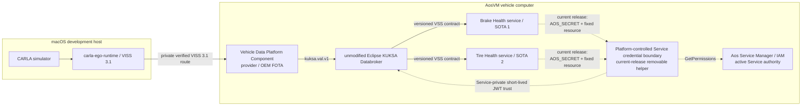

<!-- SPDX-FileCopyrightText: 2026 maninblack -->
<!-- SPDX-License-Identifier: MIT -->

# Architecture and Repository Ownership

The current end-to-end architecture review candidate, including shared platform FOTA,
independent SOTA lifecycles for two peer OEM functional teams, bidirectional
KUKSA/VISS flows, local analytics, Cloud reporting, and engineering-dashboard
boundaries, is proposed in
[High-Level Architecture 1.5](high-level-architecture.md). High-Level
Architecture 1.4 remains the accepted baseline until the complete class-C
cascade is reviewed.

## Runtime Boundary

CARLA and VISS run on macOS. The provider, KUKSA Databroker, Service Manager
runtime, SELinux boundary, and independently deployed functional services run
in AosVM. The provider is not part of CARLA and neither service connects to
VISS directly.

In a production vehicle, CAN, SOME/IP, DDS, or another OEM provider replaces
the simulation-specific VISS provider. KUKSA and the versioned VSS contract
remain the stable service boundary.

## Lifecycle Boundary

| Repository | Owns | Lifecycle |
| --- | --- | --- |
| `carla-ego-runtime` | ego control and VISS projection | simulation tooling |
| `aos-vehicle-platform` | Vehicle Data Platform Component source and FOTA payload; factory/rootfs integration for unmodified KUKSA, Service Manager/IAM, the current-release removable `aos-kuksa-auth-compat` helper under `authorization/aos-kuksa-compat/`, and the OEM-trusted Provider-side KUKSA integration | OEM Platform Team; VDP FOTA and separately governed factory/system-integration artifacts |
| `brake-health-service` | Function Team 1 Brake Health consumer and local analytics | Service Provider 1/SOTA 1 |
| `tire-health-service` | Function Team 2 local tire-condition estimation, bounded reporting, offline state and typed inspection advisory | Service Provider 2/SOTA 2; accepted boundary, repository not yet created |
| `brake-health-cloud` | Function Team 1 backend, Brake Health Function Dashboard and client integration with the common publication helper surface pre-bound to `brake-sp1` | Function Team 1 Cloud product; its current local PKCS#12 remains outside the repository, browser and container; accepted boundary, repository not yet created |
| `tire-health-cloud` | Function Team 2 backend, separated Tire Health candidate/data views, native ARM64 local-demo container and client integration with the common publication helper surface pre-bound to `tire-sp2` | Function Team 2 Cloud product; separate volume, API/helper identity and state from Brake Health; its current local PKCS#12 remains outside the repository, browser and container; accepted boundary, repository not yet created |
| `aosedge-sdv-demo` | macOS VM lifecycle, provisioning, locks, orchestration, system documentation, and end-to-end qualification | solution/demo baseline |

The integration repository may pin and qualify every component, but it does
not become the source repository for those components. No Git submodule or
private local checkout path is part of a public baseline.

The planned Function Team 2 repository is intentionally not present in the
machine-readable workspace contract until its license, initial scaffold and
accepted revision are reviewed. Its name and in-vehicle SOTA ownership
boundary are already accepted. Functional backends and dashboards are
separate products: each Function Team owns one planned Cloud-product
repository, distinct from its in-vehicle SOTA repository.

## Trust and Network Boundary

- VISS listens only on the macOS loopback path used by the VM bridge.
- The provider verifies TLS and receives credentials through systemd, not its
  payload or command line.
- Upstream Eclipse KUKSA remains unchanged as the in-vehicle data interface
  exposed to services, is factory-installed outside the VDP FOTA payload, and
  verifies only the Platform Team's configured current-release public key.
- Aos Service Manager and IAM own SOTA instance identity, `AOS_SECRET` and
  registered permissions. The separately packaged current-release helper
  translates only that current IAM result into short-lived, Service-private,
  path-scoped JWTs; it is outside the VDP and SOTA artifacts, accepts no
  caller-selected authority and stores no parallel identity or per-Service
  policy. The Provider is an OEM-qualified trusted platform component; its
  fixed KUKSA connection configuration is owned by the Platform Team and is
  not a dynamic IAM/JWT or untrusted-Provider isolation boundary. Prototype
  static tokens remain historical qualification fixtures only.
- The future native AosCore credential interface is intentionally not assigned
  to a repository until its released contract is inspected. Successful native
  migration deletes the current helper package and compatibility wiring.
- VM provisioning identity, OEM signing identity, user certificates, private
  keys, Cloud tokens, and raw operational evidence remain outside Git.
- D4-010.3 technical artifact publication is implemented once in the
  session-scoped native demo helper, while the Platform, Brake and Tire
  dashboard surfaces are statically pre-bound to `platform-oem`, `brake-sp1`
  and `tire-sp2` respectively. The installed `aos-signer` 2.0.1 path uses one
  local mode-`0600` passwordless PKCS#12 per profile for signing and mTLS
  upload; no repository owns or stores those files, and publication never
  performs OEM deployment approval.

## Update Boundary

The rootfs supplies the provider runtime, A/B store, launcher, systemd units,
health contract, and SELinux policy. The provider bundle supplies only its
immutable application payload and runtime libraries. Therefore provider
updates can follow their own FOTA lifecycle after a compatible rootfs is
installed.

The demonstration nested ext4 store preserves isolation on the fixed-context
AosVM workdirs mount. Production storage remains a separate OEM architecture
decision. Rootfs rollback from `.11` to `.2` is not provider-transparent; the
provider assignment must first be suspended or removed.

See [ADR 0006](decisions/0006-lifecycle-based-repository-ownership.md) for the
accepted repository decision,
[accepted ADR 0013](decisions/0013-current-release-kuksa-authorization-compatibility.md)
for the credential boundary correction, and
[the current baseline](../qualification/current-baseline.md)
for exact versions and digests.
