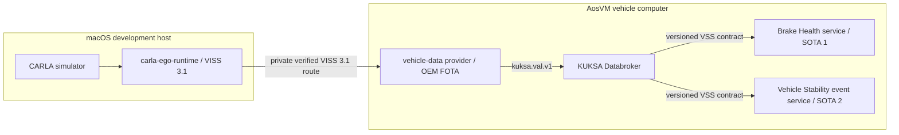

<!-- SPDX-FileCopyrightText: 2026 maninblack -->
<!-- SPDX-License-Identifier: MIT -->

# Architecture and Repository Ownership

The current end-to-end review candidate, including shared platform FOTA,
independent SOTA lifecycles for two peer OEM functional teams, bidirectional
KUKSA/VISS flows, local analytics, Cloud reporting, and engineering-dashboard
boundaries, is defined in
[High-Level Architecture 1.1](high-level-architecture.md).

## Runtime Boundary

CARLA and VISS run on macOS. The provider, KUKSA Databroker, Service Manager
runtime, SELinux boundary, and independently deployed functional services run
in AosVM. The provider is not part of CARLA and neither service connects to
VISS directly.

In a production vehicle, CAN, SOME/IP, DDS, or another OEM provider replaces
the simulation-specific VISS provider. KUKSA and the versioned VSS contract
remain the stable service boundary.

## Lifecycle Boundary

| Repository | Owns | Lifecycle |
| --- | --- | --- |
| `carla-ego-runtime` | ego control and VISS projection | simulation tooling |
| `aos-vehicle-platform` | vehicle-data contract, provider, Service Manager runtime, KUKSA integration, future authorization adapter | OEM platform/FOTA |
| `brake-health-service` | Function Team 1 Brake Health consumer and local analytics | Service Provider 1/SOTA 1 |
| `vehicle-stability-event-service` | Function Team 2 local low-friction event detection, bounded queue and upload client | Service Provider 2/SOTA 2; proposed repository |
| `aosedge-sdv-demo` | macOS VM lifecycle, provisioning, locks, orchestration, system documentation, and end-to-end qualification | solution/demo baseline |

The integration repository may pin and qualify every component, but it does
not become the source repository for those components. No Git submodule or
private local checkout path is part of a public baseline.

The proposed Function Team 2 repository is intentionally not present in the
machine-readable workspace contract until its name, license, initial scaffold
and accepted revision are reviewed. Functional backends and dashboards are
separate products; their repository layout is not decided by this boundary.

## Trust and Network Boundary

- VISS listens only on the macOS loopback path used by the VM bridge.
- The provider verifies TLS and receives credentials through systemd, not its
  payload or command line.
- KUKSA is the in-vehicle data interface exposed to services.
- The current path-scoped KUKSA tokens are a prototype fixture; the future
  Aos-to-KUKSA Authorization Adapter belongs to `aos-vehicle-platform`.
- VM provisioning identity, OEM signing identity, user certificates, private
  keys, Cloud tokens, and raw operational evidence remain outside Git.

## Update Boundary

The rootfs supplies the provider runtime, A/B store, launcher, systemd units,
health contract, and SELinux policy. The provider bundle supplies only its
immutable application payload and runtime libraries. Therefore provider
updates can follow their own FOTA lifecycle after a compatible rootfs is
installed.

The demonstration nested ext4 store preserves isolation on the fixed-context
AosVM workdirs mount. Production storage remains a separate OEM architecture
decision. Rootfs rollback from `.11` to `.2` is not provider-transparent; the
provider assignment must first be suspended or removed.

See [ADR 0006](decisions/0006-lifecycle-based-repository-ownership.md) for the
accepted repository decision and
[the current baseline](../qualification/current-baseline.md)
for exact versions and digests.
