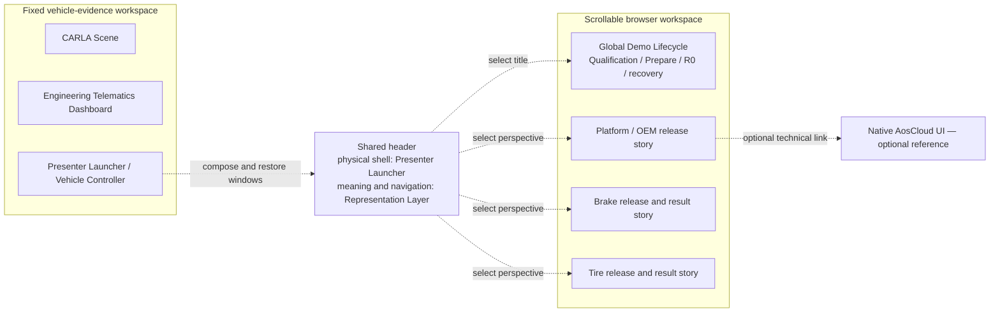

<!-- SPDX-FileCopyrightText: 2026 maninblack -->
<!-- SPDX-License-Identifier: MIT -->

# I0 Audience-Visible Interface Register and Mockup Gate

- Status: accepted
- Version: 0.14
- Prepared: 2026-08-25
- Owner: Demo Solution Team with Platform Team and Function Teams 1 and 2
- Architecture input: [High-Level Architecture 1.5](../../architecture/high-level-architecture.md)
- Scenario input: [Demo Scenarios 2.0](../staged-post-sop-brake-health-demo-scenarios.md)
- Flow input: [Architecture Flows 2.0](../../architecture/demo-scenario-architecture-flows.md)
- Requirement inputs: [Component Register 2.0](../../requirements/component-decomposition-and-interface-register.md), [Demo Orchestration](../../requirements/components/demo-orchestration.md) and [End-to-End Acceptance](../../requirements/components/end-to-end-acceptance.md)
- Presentation policy: [D4-026.6](../../requirements/d4-decision-register.md#d4-026)
- UI implementation authorized: no
- Layout review artifact that predates the complete Interaction Specification
  2.5 and is not the implementation baseline:
  [AosEdge Demo linear-flow HTML mockup](aosedge-demo-linear-flow-mockup.html)
- Detailed Interaction Specification:
  [AosEdge Demo Interaction Specification 2.5](aosedge-demo-interaction-specification.md)
- Exact review mockup derived from Interaction Specification 2.5:
  [Accepted AosEdge Demo Interaction Mockup](aosedge-demo-interaction-mockup-2-4.html)
- Editable mockup source:
  [AosEdge Demo Interaction Mockup Authoring Source](aosedge-demo-interaction-mockup-2-4.source.html)
- Standalone build helper:
  [`scripts/build-demo-interaction-mockup`](../../../scripts/build-demo-interaction-mockup)

## Purpose

This register is the first D5/I0 gate. It inventories every presenter- or
audience-visible surface before UI implementation, separates navigation from
authority and defines the minimum normal and failure states that low-fidelity
mockups must cover.

Mockups are derived views of accepted architecture, scenarios, requirements
and contracts. They do not create lifecycle state, release authority, product
behavior or a second specification.

The exact review mockup is the current clickable review artifact derived from
Interaction Specification 2.5. It is generated as one self-contained HTML
file with all repository-local image assets embedded, so copying or opening
that one file does not lose CARLA screenshots or icons and requires no local
web server. The adjacent `.source.html` file and asset directories are the
editable inputs; `scripts/build-demo-interaction-mockup` deterministically
regenerates the accepted standalone artifact.

The standalone file is still a mockup rather than an implementation baseline.
It contains no real AosCloud, VM, CARLA, signing, publication or deployment
integration. Its simulated release states, team-perspective controls and
action responses exist only to make review efficient; they do not assert a
real Cloud result or create lifecycle shortcuts.

The earlier linear-flow HTML is retained only for visual comparison. It
predates the complete contract and is not the current review baseline.

## I0-DEC-001 Accepted — Linear Audience Interaction Model

- Decision state: `ACCEPTED`
- Accepted: 2026-08-25
- Owners: Demo Solution Team with Platform Team and Function Teams 1 and 2
- Change class: `A` — presentation and dashboard layout without system-behavior
  change

The accepted working visualization baseline is the accepted interaction mockup
linked above. The audience sees one composed full-screen workspace: a fixed
vehicle-evidence area on the left and the current-team workspace on the right.
The left area keeps CARLA, the Vehicle Controller and Engineering Telematics
visible while the presenter works through Platform, Brake or Tire release
activity. D4-026.19 keeps the team context fixed and makes only the team's
release/version story scrollable.

Within each team perspective, all applicable product versions remain visible
in one vertically ordered release story. That order explains product evolution;
it does not impose a global execution sequence or a linear lifecycle state
machine. The presenter may change team perspective at any stage, and each team
retains its independently observed release state.

No component or Service version is disabled merely because an earlier version
has not been selected in the UI. An action is available, blocked or waiting
only from its fresh authoritative prerequisites and accepted dependency rules.
For example, a Service whose required Vehicle Data Platform Component version
is absent remains inspectable and publishable where the accepted platform
permits, while deployment is visibly blocked with the factual missing-
dependency reason. Native Cloud enforcement of that dependency remains the
explicitly deferred [D4-X01 capability](../../requirements/d4-decision-register.md#d4-x01):
the first implementation shall not add a project-side admission controller or
present a local UI guard as AosCloud enforcement. Until an implementing release
is qualified, the interaction must label this target path as unavailable or
deferred while still explaining the missing dependency.

The current `Test Vehicle` or `Production Vehicle` remains visible in
the shared header. `Details` opens a modal overlay and returns to the unchanged
story when closed. The earlier switch-based version mockup is retained only as
a local, explicitly obsolete Brainstorming comparison artifact; it is outside
the active documentation tree and is not the review or implementation
baseline.

This decision selects the presentation concept only. It does not complete the
detailed Interaction Specification, alter HLA/scenario behavior, authorize UI
implementation or make the mockup a source of lifecycle truth.

## I0-DEC-002 Accepted — Independent Team Perspectives and Resource-Scoped Operations

- Decision state: `ACCEPTED`
- Accepted: 2026-08-25
- Owners: Demo Solution Team with Platform, Brake and Tire producer teams;
  OEM Release Authority remains a separate governance role
- Change class: `B` — interaction and orchestration behavior inside the
  accepted architecture

The shared header exposes exactly three selectable internal OEM producer
perspectives: Platform, Brake and Tire. OEM Release Authority is persistently
visible but is not a fourth team or selectable product perspective. Switching
teams is navigation only and restores disposable per-team focus and scroll
context while refreshing authoritative state.

The earlier demo-wide external-operation lock is retired. Platform, Brake and
Tire may sign, publish and reconcile different candidates or Cloud objects
independently. Only exact overlapping candidate/digest/profile, Cloud-object,
Batch/Campaign, Unit and Unit-Set resources block another mutation.
Provisioning, identity retirement, exclusive live-source handover/reset and R0
freeze/cleanup remain run-exclusive. Read-only navigation stays available;
helper capacity affects only the requested operation and never creates an
automatic queue or an AosCloud limitation claim.

This decision is implemented in the documentation baseline by revised
D4-021.2/.3, [Demo Run State 1.1.0](../../../contracts/demo-run-state/README.md),
`SYS-REL-012`, `REQ-DEMO-022`, `UT-DEMO-020` and Interaction Specification
2.5. HLA, component graph, repositories, interfaces and authority boundaries
were revalidated unchanged. UI implementation remains separately unauthorized.

## I0-DEC-003 Accepted — Current Vehicle and Update-State Presentation

- Decision state: `ACCEPTED`
- Accepted: 2026-08-25
- Owners: Demo Solution Team with Platform Team and System Acceptance;
  OEM Release Authority remains an independent governance role
- Change class: `B` — visible handover and update-state behavior inside the
  accepted architecture

`Current Vehicle` is one global audience state, independent of the selected
Platform, Brake or Tire perspective. The presenter changes it explicitly with
`Continue with Production Vehicle` or `Continue testing on Test Vehicle`;
the header shows an honest transition or unavailable state until the accepted
exclusive live-source handover has been reconciled.

Vehicle Data Platform Component FOTA is presented as a vehicle-critical
update. Its release story visibly requires `Safe Stop`, the fixed Vehicle
Controller provides the stop/resume action, and the vehicle remains stopped
through application and readiness confirmation. AosCloud owns the authorized
desired update and delivery record but is not presented as knowing whether the
vehicle moves. AosCore inside the vehicle is the native enforcement point;
the Demo UI only presents the policy and factual state and does not implement
a substitute safety mechanism.

Brake Health and Tire Health are QM Service SOTA in this demo. Their accepted
updates may be applied while the vehicle moves, subject to all existing
authority, dependency, recipient, evidence and readiness gates. The UI does
not generalize that statement to arbitrary automotive software.

The detailed interaction behavior is fixed by
[Interaction Specification 2.5, Section 3](aosedge-demo-interaction-specification.md#3-current-vehicle-and-test-to-production-handover)
and [D4-026.8](../../requirements/d4-decision-register.md#d4-026-8).

## I0-DEC-004 Accepted — Test Validation and Production Live Operation

- Decision state: `ACCEPTED`
- Accepted: 2026-08-25
- Owners: Platform, Brake and Tire producer teams; independent OEM Release
  Authority for deployment authorization; Demo Solution Team for presentation
- Change class: `B` — release-flow and authority presentation inside the
  accepted architecture

Each prepared candidate is published once, authorized separately for the Test
Vehicle, validated and accepted there by its owning producer team, then
authorized separately by OEM Release Authority for Production rollout. The
Production Vehicle receives the identical accepted artifact without rebuild,
re-sign or re-publication and shows ordinary released behavior rather than a
second product test.

The active audience language is `Production rollout and live operation`,
`Show released behavior` and `Drive Production Vehicle`. Technical delivery,
actual-state and readiness confirmation remain required, but the UI does not
call them Production validation or ask the producer to accept a Production
test result. Pre-audience PU rehearsal belongs to qualification of the demo
solution and remains outside the audience release story.

The complete five-stage common story plus Platform v1-v3, Brake v1-v3, Tire v1
and dependency behavior is fixed by
[Interaction Specification 2.5, Section 4](aosedge-demo-interaction-specification.md#4-platform-brake-and-tire-linear-release-stories)
and [D4-026.9](../../requirements/d4-decision-register.md#d4-026-9).

## I0-DEC-005 Accepted — Action, Authority and Authoritative Results

- Decision state: `ACCEPTED`
- Accepted: 2026-08-25
- Owners: Platform, Brake and Tire producer teams; independent OEM Release
  Authority; Demo Solution Team for global lifecycle orchestration
- Change class: `B` — visible action/authority behavior and recovery-safe
  orchestration inside the accepted architecture

The Demo UI owns no Cloud identity. One OEM certificate supports fixed,
non-interchangeable `platform-oem` and `oem-delivery` operation profiles;
Brake and Tire use two different Service Provider owner domains and separate
SP certificates. The Admin certificate is outside the demo. Organizational
actors remain explicit even where the first-demo OEM technical credential is
shared.

Every protected action uses verb-specific confirmation, fresh prerequisites,
bounded parameters, a per-operation journal entry and authoritative post-read.
Disjoint producer operations may proceed independently; only overlapping
resource scopes conflict. One visible Production authorization may execute the
bounded Campaign create/read/approve/reconcile sequence, stopping on any
uncertainty. No audience-facing `Apply update` action exists: the
factory-installed OEM Component Runtime inside AosCore Service Manager waits
for fresh Gateway Safe Stop evidence before Platform FOTA application, while
the UI observes delivery/runtime reason/readiness and the presenter explicitly
resumes released operation.

`Prepare Demo` and `End and Reset Demo` are global run-exclusive chapters;
`Start or Restore Demo Environment` is a lifecycle-aware, non-provisioning
operator preflight. The accepted action
inventory also includes read-only authoritative recheck, role-scoped native
logs, repeatable Scenario/Manual/Autopilot drive controls, current-drive
restart, vehicle-external-connectivity control and the fixed Tire CPU proof.

The complete contract is fixed by
[Interaction Specification 2.5, Section 5](aosedge-demo-interaction-specification.md#5-action-authority-and-authoritative-result-contract)
and [D4-026.10](../../requirements/d4-decision-register.md#d4-026-10).

## I0-DEC-006 Accepted — Details, Runtime Isolation and Operational Logs

- Decision state: `ACCEPTED`
- Accepted: 2026-08-26
- Owners: Demo Solution Team with Platform, Brake and Tire producer teams;
  System Acceptance for isolation evidence
- Change class: `B` — disclosure, evidence-source and protected diagnostic
  interaction inside the accepted architecture

`Details` is one read-only modal confined to the right workspace. It explains
the selected release stage through a human-first summary and collapsed
technical disclosure without changing state or hiding the fixed vehicle
evidence. Full non-secret release digests may be shown; private vehicle and
Cloud identities use sanitized fingerprints. Brake and Tire Service Details
show their signed requested and OEM-approved Service quotas. Vehicle Data
Platform Component Details show no Service quota or substitute component-
resource table.

The live Tire CPU proof appears in a separate sticky `Runtime Isolation
Evidence` panel in the right team workspace. Engineering Telematics remains a
Gateway/KUKSA vehicle-signal and advisory surface. The isolation panel combines
fresh Cloud usage/instance facts, qualified cgroup evidence and concurrent
Brake/platform continuity and labels the proof as specific to the qualified VM
baseline.

Operational logs use a separate context-bound right-workspace overlay available
only for running software during Test validation or Production live operation.
Platform, Brake and Tire retain their accepted disjoint scopes. Request,
authoritative status recheck, sanitized bounded result and exact deletion use
native AosCloud delivery without ELK, a second archive, arbitrary selectors or
unrestricted raw output.

The Platform perspective labels this secondary action `Platform Logs`. VDP
diagnostics originate in standard output/error captured by the native systemd
journal and are requested only through AosEdge/AosCloud delivery. VDP and the
Demo UI own no log store or second archive. VDP Details also contain no
application-store presentation: the slots/state/credentials filesystem is OEM
Component Runtime A/B working storage and remains an implementation detail.

The complete contract is fixed by
[Interaction Specification 2.5, Section 6](aosedge-demo-interaction-specification.md#6-details-modal-and-disclosed-information)
and [D4-026.11](../../requirements/d4-decision-register.md#d4-026-11).

## I0-DEC-007 Accepted — Failure, Offline and Recovery Presentation

- Decision state: `ACCEPTED`
- Accepted: 2026-08-26
- Owners: Demo Solution Team with Platform, Brake and Tire producer teams;
  AosEdge Platform remains authoritative for managed lifecycle/runtime state
- Change class: `B` — state-source, connectivity and recovery presentation
  inside the accepted architecture

The UI preserves authoritative external state, local orchestration state and
evidence/acceptance result as separate labelled layers. `AosEdge Platform` is
prominent on every current software lifecycle, deployment and managed runtime
projection, with exact AosCloud/AosCore ownership in Details; Gateway/CARLA and
Function facts retain their actual sources. Stale or unavailable state never
remains a current success.

The fixed audience vocabulary distinguishes known blockers and waits from
unknown external effects. `UNCERTAIN` requires fresh reconciliation and never
permits blind retry; only overlapping resources are blocked, except for run-
exclusive lifecycle work or corrupt recovery state. `Waiting for Safe Stop
before application` is an expected derived Platform FOTA condition based on
native `ACTIVATING` and fresh Gateway state, while current-release Service dependency
handling uses OEM evidence gating and fail-closed readiness without simulating
future native Cloud admission.

One Current Vehicle connectivity action removes the selected Unit's AosCloud
and both Service-backend paths while preserving the Demo UI-to-AosCloud path
and local CARLA/Gateway/KUKSA/Service behavior. Operational Logs and Runtime
Isolation retain their accepted exact source, state and verdict boundaries.

The complete contract is fixed by
[Interaction Specification 2.5, Section 7](aosedge-demo-interaction-specification.md#7-failure-offline-and-recovery-states)
and [D4-026.12](../../requirements/d4-decision-register.md#d4-026-12).

## I0-DEC-008 Accepted — Live Vehicle and Function Evidence Correlation

- Decision state: `ACCEPTED`
- Accepted: 2026-08-26
- Owners: Demo Solution Team with Platform, Brake and Tire producer teams;
  System Acceptance for evidence correlation
- Change class: `B` — live evidence, synchronization and bidirectional
  Current Vehicle presentation inside the accepted architecture

One audience context binds Current Vehicle, selected release, installed graph,
fresh CARLA exercise/generation and external connectivity. The visible causal
chain remains human-first: vehicle event, available signals, on-vehicle
behavior and driver/backend result. Every fact retains its actual CARLA,
Gateway/KUKSA, AosEdge Platform or Function-backend owner.

Test acceptance uses deterministic qualified stimuli. Production normally uses
Autopilot or Manual, with an explicit deterministic exercise available only
when a guaranteed audience event is required. Sanitized fingerprints link the
same evidence across Details without a demo-run ID, private Unit identity,
telemetry replay or cross-clock latency claim.

During vehicle external-connectivity loss, current Service queue occupancy is
not externally observable. The UI shows local vehicle facts and absent backend
events, may disclose configured bounds and last-observed state, and waits for a
post-reconnect synchronization/overflow fact before reporting delivered or
dropped counts. No bypass monitoring channel is introduced.

`Continue testing on Test Vehicle` and `Continue with Production Vehicle`
support repeated bidirectional release cycles. Each handover proves exclusive
detach, reset/new generation, attach and first fresh evidence but changes no
installed software graph. Test evidence remains a sealed release reference;
Production behavior always starts from a fresh live exercise.

The complete contract is fixed by
[Interaction Specification 2.5, Section 8](aosedge-demo-interaction-specification.md#8-vehicle-and-function-backend-correlation)
and [D4-026.13](../../requirements/d4-decision-register.md#d4-026-13).

## I0-DEC-009 Accepted — UI Traceability and Acceptance Cases

- Decision state: `ACCEPTED`
- Accepted: 2026-08-26
- Owners: Demo Solution Team with all visible-surface owners; System Acceptance
  for integrated and human qualification
- Change class: `B` — verification structure for the accepted interaction
  contract without changing product behavior

Every stable interaction rule has bidirectional upstream and acceptance-case
traceability. The 50 mandatory `UI-AT-*` cases use one-trigger readable records
and parameterized instances for repeated releases, protected actions, visible
states and drive modes. They do not copy or redefine Cloud, vehicle, Service or
security requirements.

`FIXTURE` verifies deterministic browser/component behavior without external
mutation, `INTEGRATED` verifies real accepted adapters and authoritative sources
in the disposable environment, and `HUMAN` verifies the measured full-screen
presentation on the qualified Mac. A required machine/source failure cannot be
overridden, while a required human review may reject unreadable or misleading
presentation despite machine success.

The accepted suite covers the complete composed workspace, independent OEM
actors, Current Vehicle cycles, release lifecycle, Details/disclosure,
operational logs, runtime isolation, recovery-safe failures, offline/reconnect
and live vehicle-to-Function evidence correlation. Screenshots remain supporting
evidence rather than lifecycle proof.

The complete contract is fixed by
[Interaction Specification 2.5, Section 9](aosedge-demo-interaction-specification.md#9-traceability-and-ui-acceptance-cases)
and [D4-026.14](../../requirements/d4-decision-register.md#d4-026-14).

## I0-DEC-010 Accepted — Global M0/M1/G0/R0 Interaction Model

- Decision state: `ACCEPTED`
- Accepted: 2026-08-26
- Owners: Demo Solution Team with OEM Release Authority and System Acceptance
- Change class: `B` — visible global lifecycle boundaries and positive
  acceptance coverage inside the accepted architecture

Infrastructure preflight, manufacturing and provisioning are three different
things. `Start or Restore Demo Environment` starts the local support stack at
`READY_FOR_M0`, or restores only the exact existing current-run VMs after a
host restart. It never creates vehicles, provisions, changes identities or
advances the lifecycle.

The global `Prepare Demo` chapter exposes `M0` and `M1` as separate protected
actions. M0 creates two fresh unprovisioned overlays and shows them as
`Manufactured · Awaiting provisioning`, with `Current Vehicle: Not assigned`.
M1 creates unique Cloud identities, proves both Units `Online`, proves exact
disjoint role Unit Set membership and then establishes `G0` with Test as the
initial Current Vehicle, working CARLA/Gateway/Engineering telemetry and no
VDP or Services.

`End and Reset Demo` may clean a completed, failed or aborted run. Success ends
at `READY_FOR_M0` and never starts another M0/M1 automatically; incomplete
cleanup remains `Reset incomplete · Recovery required`. Main-view progress is
human-readable, while exact Unit/Node/API evidence remains in Details.

The complete contract is fixed by
[Interaction Specification 2.5, Section 5](aosedge-demo-interaction-specification.md#5-action-authority-and-authoritative-result-contract)
and [D4-026.15](../../requirements/d4-decision-register.md#d4-026-15).

## I0-DEC-011 Accepted — Independent Releases and Derived G3/G4 Milestones

- Decision state: `ACCEPTED`
- Accepted: 2026-08-26
- Owners: Platform Team, Brake Function Team, OEM Release Authority, Demo
  Solution Team and System Acceptance
- Change class: `B` — remove combined-release ambiguity while preserving the
  accepted Cloud and organizational boundaries

G3 and G4 are audience capability milestones only. VDP and Brake keep separate
candidate, publication, Test acceptance, OEM authorization, Cloud object,
Campaign/result and readiness chains. OEM Release Authority authorizes one
exact artifact per action; there is no combined approval, group deployment or
atomic rollback.

On Production, the VDP release is applied first and becomes actually ready,
with Safe Stop for Platform FOTA and the previous compatible Brake Service
still operating. Only then can the separately authorized dependent Brake
release proceed. Brake failure leaves VDP ready and the milestone incomplete.

The main view may derive `0 of 2`, `1 of 2` and `2 of 2 releases ready` from
fresh authoritative facts and matching live evidence. It writes no milestone
state to AosCloud. Platform cards show `Enables ...`; Brake cards show
`Requires ...`.

The complete contract is fixed by
[Interaction Specification 2.5, Section 4](aosedge-demo-interaction-specification.md#4-platform-brake-and-tire-linear-release-stories)
and [D4-026.16](../../requirements/d4-decision-register.md#d4-026-16).

## I0-DEC-012 Accepted — Workspace Composition and Shared Header Ownership

- Decision state: `ACCEPTED`
- Accepted: 2026-08-26
- Owners: Demo Solution Team and OEM Software Delivery Dashboard owner; all
  visible-surface owners retain their own content
- Change class: `B` — explicit presenter-workspace responsibility split inside
  the accepted architecture

`CMP-ORCH` and its trusted Presenter Launcher own the physical composed
workspace on the measured presenter display: exact owned-window discovery,
launch order, the reserved compact header strip, native/browser geometry,
visibility, non-overlap, readability proof and safe local layout restoration.
This work is a local substep of `Start or Restore Demo Environment`, not a
Cloud, vehicle or software-lifecycle action.

`CMP-SW-DASH` and its stateless Representation Layer own the meaning of the
shared header: demo title, one Current Vehicle projection, the three producer-
team summaries and team-perspective navigation. The header uses the same read
model as the right browser workspace; it creates no separate Cloud read path,
state store or lifecycle authority. CARLA, Controller, Engineering Telematics
and each browser product view retain their content ownership.

CARLA and the native Controller remain native windows; the browser does not
embed, stream or screen-capture them. A missing, duplicated, off-screen,
overlapped or unreadable required surface is `Workspace incomplete` and permits
only local diagnosis/restoration. Exact macOS positioning remains
implementation qualification on the actual presenter Mac and introduces no
new HLA component or persistent privileged daemon.

The complete contract is fixed by
[Interaction Specification 2.5, Section 1](aosedge-demo-interaction-specification.md#1-screen-composition-and-global-interaction-invariants)
and [D4-026.17](../../requirements/d4-decision-register.md#d4-026-17).

## I0-DEC-013 Accepted — Right-Hand Global Demo Lifecycle Workspace

- Decision state: `ACCEPTED`
- Accepted: 2026-08-26
- Owners: Demo Solution Team, OEM Software Delivery Dashboard owner and System
  Acceptance
- Change class: `B` — explicit run-wide navigation and status composition
  inside the accepted workspace

Selecting the shared title `AosEdge Software Evolution Demo` opens the global
`Demo Lifecycle` page only in the right browser region. The shared header and
fixed left CARLA, Vehicle Controller and Engineering Telematics surfaces remain
visible. This page is not a fourth producer perspective and does not change or
reset independently preserved Platform, Brake or Tire state.

The page owns the audience composition of Qualification Status, Prepare Demo
(M0/M1 and resulting G0), current global lifecycle and recovery, and End and
Reset Demo (R0). Qualification uses only the current bounded status derived
from the sealed dossier and exact baseline comparison; it cannot be manually
made green and grants no release authority. `Start or Restore Demo Environment`
and `Restore workspace layout` remain native Presenter Launcher actions and
are not duplicated in the browser.

The complete contract is fixed by
[Interaction Specification 2.5, UI-INT-079](aosedge-demo-interaction-specification.md#ui-int-079)
and [D4-026.18](../../requirements/d4-decision-register.md#d4-026-18).

## I0-DEC-014 Accepted — Fixed Team Context and Version-Only Scrolling

- Decision state: `ACCEPTED`
- Accepted: 2026-08-26
- Owners: Demo Solution Team and OEM Software Delivery Dashboard owner
- Change class: `A` — presentation layout refinement without system-behavior
  change

Each Platform, Brake or Tire perspective divides the right browser workspace
into one compact fixed team-context region and one independently scrollable
release/version region. The fixed region keeps the one-line team name and
purpose, compact non-selectable OEM Release Authority line, three current-state
summaries and the current Platform capability, Function backend or Runtime
Isolation evidence panel visible while the presenter reads or operates any
version card.

Only the release/version region scrolls. Its position and focused release are
preserved independently for each producer perspective. The team-context region
has no presenter-managed scroll, expansion step or hidden audience control. The
global Demo Lifecycle page retains its own independent whole-page scroll inside
the right workspace.

The decorative `Linear Release Story` and `Authorization not execution` badges
are removed. The team purpose and Release Authority meaning remain explicit in
their compact text, while release stages continue to distinguish producer
ownership, OEM authorization and AosCloud execution.

The complete contract is fixed by
[Interaction Specification 2.5, UI-INT-004, UI-INT-008 and UI-INT-010](aosedge-demo-interaction-specification.md#ui-int-004)
and [D4-026.19](../../requirements/d4-decision-register.md#d4-026-19).

## I0-DEC-015 Accepted — Icon Vocabulary and Native Terminal Boundary

- Decision state: `ACCEPTED`
- Accepted: 2026-08-27
- Owners: Demo Solution Team, Engineering Telematics owner and OEM Software
  Delivery Dashboard owner
- Change class: `A` — presentation vocabulary and rendering-ownership
  clarification without system-behavior change

The repository-local icon family may be used in the browser Demo UI, shared
composition chrome, release and lifecycle cards, `Details` and protected
actions, and the native Vehicle Controller where that surface supports image
assets. Every icon supplements a stable text label; it never replaces the
label or acts as evidence for authoritative state.

The Engineering Telematics Dashboard remains the existing native macOS
Terminal renderer. Its dashboard content is monospaced text, with optional
ANSI color, and does not receive PNG/bitmap assets, terminal inline-image
escape protocols, an HTML overlay inside the terminal output or a second
Representation Layer renderer. The Vehicle Signals icon may label the
surrounding composed surface, but it remains outside the terminal content and
has no telemetry or lifecycle semantics.

The complete boundary is fixed by
[Interaction Specification 2.5, UI-INT-003 and UI-INT-051](aosedge-demo-interaction-specification.md#ui-int-003)
and [D4-026.20](../../requirements/d4-decision-register.md#d4-026-20).

## Accepted Presentation Shape

The presenter uses one composed full-screen workspace rather than switching
browser tabs. The left half arranges the existing CARLA scene, macOS Presenter
Launcher / Vehicle Controller and Engineering Telematics Dashboard as fixed
evidence surfaces. The right half is the browser-based demo workspace with a
shared current-vehicle indicator, freely selectable Platform, Brake and Tire
team perspectives and the title-selected global Demo Lifecycle page. In a team
perspective, the team context remains fixed and only the release/version region
scrolls; the global page retains its independent right-region page scroll.

This visual composition does not merge component or repository ownership. The
OEM Software Delivery product and the two independent Function Team products
retain separate actors, authority, authoritative sources and implementation
boundaries even when the audience sees them inside one coherent workspace.

The D4-026.6 core story remains
`M0 -> M1 -> G0 -> G1 -> G2 -> G3 -> G4 -> T1 -> R0`, with a planned
30-minute narrative inside a 45-minute reserved audience slot. The UI may
summarize mandatory checks but never skip, pre-approve or simulate them.

## Existing Visual Baseline — Reuse, Do Not Redesign

The current implementation was inspected before preparing wireframes. I0 shall
reuse its visual language and interaction model rather than inventing a new
vehicle-control or engineering-telemetry product.

Implementation references:
[native control panel](../../../../carla-ego-runtime/tools/KeyboardControl.swift),
[Terminal telemetry renderer](../../../../carla-ego-runtime/src/viss_client.cpp),
[Brake Event operator behavior](../../../../carla-ego-runtime/docs/brake-event-scenario.md).

### Current macOS control panel

The existing native window is titled `CARLA — Live Driving Control`. It uses a
plain light-gray macOS surface with:

- one prominent status banner at the top;
- four large keycap-style arrow controls for throttle, brake and steering;
- one full-width `START/RESTART SCRIPTED SCENARIO` action;
- three bottom actions: green `MANUAL CONTROL`, blue `AUTOPILOT` and red
  `SAFE STOP`;
- purple status/action treatment for the scripted scenario;
- compact keyboard shortcuts and the existing focus-loss safety explanation;
- explicit connecting, switching, unavailable, scenario passed/failed and
  connection-lost text instead of icons without labels.

The first mockup may add a restrained session/stage/navigation region around
this panel, but it shall not replace the current controls, labels, colors,
keyboard behavior or safe-stop prominence.

### Current Engineering Telematics Dashboard

The implemented dashboard is a compact monospaced Terminal view headed
`CARLA / VSS LIVE TELEMETRY`. It already shows:

- verified VISS/TLS endpoint, connection and `LIVE/WAITING` data health;
- simulation rate, dashboard delivery rate, local VISS latency and event count;
- frame, simulation time, speed, longitudinal acceleration, steering, gear and
  engine RPM;
- text bars for accelerator and brake;
- four-wheel `FL/FR/RL/RR` speed, angular speed, longitudinal slip and lateral
  slip table;
- GNSS position and last VISS event time.

The first demo increment keeps this terminal/engineering character. It appends
accepted drive-context, source/connectivity and Brake/Tire advisory sections;
it does not replace the view with decorative gauges, geographic maps or a
generic web analytics dashboard.

Those appended sections remain text-only terminal output. They use stable
monospaced labels and may use restrained ANSI color, but they do not embed
bitmap icons or terminal inline images and are not re-rendered by the browser
Representation Layer. An icon may label the surrounding composed panel only;
it is outside the Terminal evidence surface.

## Audience-Visible Surface Register

| ID | Surface | Actor and purpose | Authoritative source | Protected action owner | Disposition |
| --- | --- | --- | --- | --- | --- |
| `UI-I0-001` | Presenter Workspace Shell / Vehicle Controller | Presenter starts and ends the local session, sees readiness and current stage, opens and physically arranges the measured header/native/browser workspace, restores only its local layout, and selects accepted Scenario/Manual/Autopilot controls | Local launcher/window/process probes and measured display profile for composition; run journal while needed; Gateway/controller state and current authoritative stage reads | `CMP-ORCH`/session helper own physical composition and host operations; `CMP-SW-DASH` owns shared-header meaning; Gateway/controller own vehicle controls | Extend the existing native macOS panel without redesigning its controls; no content, Cloud or lifecycle authority |
| `UI-I0-002` | CARLA Scene | Audience sees the physical vehicle, obstacle and braking behavior | Live CARLA world and selected actor | Scenario Controller/Gateway, not the browser | Existing surface reused; no redesign and no invented telemetry overlay |
| `UI-I0-003` | Engineering Telematics Dashboard | Presenter/audience sees live vehicle telemetry, drive context, source freshness and Brake/Tire advisory return | Read-only authenticated Gateway/VISS stream | No lifecycle action; accepted vehicle-control actions remain in `UI-I0-001` | Preserve the existing text-only Terminal dashboard and append accepted context/advisory/connectivity sections; presentation icons remain outside its output |
| `UI-I0-004` | OEM Software Delivery Dashboard | Platform Team and OEM presenter inspect candidates, Units/Sets, effective recipients, validation evidence, approvals, lifecycle/log state, qualification status and R0 | AosCloud APIs plus immutable local candidate catalogue and bounded local operation state | Platform Team protected publication; owning team acceptance; OEM `oem-delivery` confirmation for Unit-affecting actions | New primary lifecycle product |
| `UI-I0-005` | Brake Health Function Dashboard and Release Client | Function Team 1 selects prebuilt Brake v1-v3, sees metadata/quota/data contract, explicitly signs/publishes and observes current-run Brake results | Immutable Brake catalogue, protected `brake-sp1` publication result and Brake backend | Function Team 1 for release decision/publication; OEM remains separate for deployment approval | New independent Function Team product |
| `UI-I0-006` | Tire Health Function Dashboard and Release Client | Function Team 2 selects prebuilt Tire v1, signs/publishes, observes tire condition/advisory and starts the bounded CPU-isolation proof | Immutable Tire catalogue, protected `tire-sp2` result, Tire backend and factual qualification inputs | Function Team 2 for release/publication and bounded load request; AosCore alone enforces quota | New independent Function Team product |
| `UI-I0-007` | Qualification Status panel | OEM presenter sees whether the exact baseline is ready for an audience and why not | `.local/qualification/qualification-status.json` derived from the current sealed dossier and baseline comparison | No lifecycle authority; human withdrawal is separately authenticated/reviewed | Embedded in `UI-I0-004`, never a separate dashboard or evidence browser |
| `UI-I0-008` | Native Helper status | Presenter sees only whether the protected local operation boundary is available | Authenticated launcher-to-helper health probe | Native helper; caller cannot select credentials, paths, profiles, URLs or arbitrary commands | `READY/UNAVAILABLE` indicator inside `UI-I0-001`; no helper UI |
| `UI-I0-009` | Native AosCloud UI | Technical reviewer may inspect the upstream product when explicitly requested | AosCloud itself | Native AosCloud roles | Optional technical reference; not part of the normal core flow and not mocked as project UI |

## Navigation Map — Not a Data-Authority Map

Dashed arrows describe local composition or presenter navigation only. The
visual grouping and shared header do not make the launcher authoritative for
surface content or make one product authoritative for another product's state.

## Required Mockup States

| Surface | Normal states | Mandatory non-happy-path states |
| --- | --- | --- |
| Presenter Launcher / Vehicle Controller | `READY`, active stage, current vehicle, Scenario/Manual/Autopilot, orderly completion | prerequisite `BLOCKED`, helper `UNAVAILABLE`, `STARTING`, `STOPPING`, controller/scenario `FAILED`, cleanup/reconciliation required |
| OEM Software Delivery Dashboard | current Cloud state, candidate ready, `SUBMITTING`, authoritative `WAITING`, validation accepted, OEM-confirmed promotion, retirement complete | role/permission/recipient mismatch `BLOCKED`, `UNCERTAIN`, `RECONCILING`, `FAILED`, stale evidence/baseline, Unit offline, partial R0 |
| Engineering Telematics Dashboard | connected live telemetry, active drive mode/context, fresh Brake/Tire advisory | source `DEGRADED`, selected Unit external `OFFLINE`, stale/missing path, reset discontinuity, advisory unavailable without invented zero |
| Brake Health Function Dashboard | v1 raw brake window, v2 derived result, v3 advisory/backend synchronization | VDP/version/data `NOT_READY`, backend offline/queued, duplicate acknowledged, stale/redacted result, publication blocked/uncertain |
| Tire Health Function Dashboard | Tire result/advisory, quota facts, load proof `READY/RUNNING/PASS` | VDP/data `NOT_READY`, backend offline/queued, `NOT_READY`, `INCONCLUSIVE`, `FAIL`, early stop, stale quota evidence |
| Qualification Status panel | `QUALIFIED` exact baseline | `ABSENT`, `STALE`, `WITHDRAWN`, `NOT_QUALIFIED`; no manual green override |

## Shared Low-Fidelity Rules

1. Every page names the current actor/role and authoritative source.
2. Requested operation, authoritative external state and local orchestration
   state remain visually distinct.
3. Protected actions show exact candidate, target, recipient set, role,
   prerequisites and consequence before confirmation.
4. `WAITING`, `UNCERTAIN` and `RECONCILING` are not rendered as success.
5. Secret values, raw credentials, JWTs, private paths and full retained
   qualification evidence never appear.
6. The current lifecycle stage and current logical vehicle are consistently
   visible without exposing attach/detach plumbing as vehicle behavior.
7. Optional drill-down never displaces the D4-026.6 core story.
8. The first pass is monochrome/low fidelity. Visual polish follows only after
   information architecture and state behavior are reviewed.
9. Existing launcher and Engineering Dashboard visual baselines are changed
   only where an accepted requirement adds information or behavior.

## Current Review Status and Next Step

The surface inventory, 15 I0 decisions, Interaction Specification 2.5,
Presenter Launcher/workspace ownership and all 50 UI acceptance cases are
accepted. The complete one-row-per-rule mapping is maintained in the
[UI Traceability Register 1.1](aosedge-demo-ui-traceability-register.md). The
accepted standalone HTML review mockup is reconciled to that contract,
including fixed team context and version-only scrolling. The next gate is the
implementation plan and implementation review; the old linear-flow HTML does
not authorize implementation.
