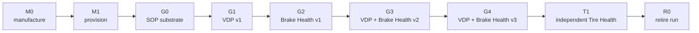

<!-- SPDX-FileCopyrightText: 2026 maninblack -->
<!-- SPDX-License-Identifier: MIT -->

# Staged Post-SOP Brake and Tire Health Demo Scenarios

- Status: Accepted
- Version: 2.0
- Prepared: 2026-08-22
- Accepted: 2026-08-26
- Previous accepted version: 1.9
- Owner: Demo Architecture
- Scope: manufacturing output, end-of-line provisioning, audience-visible
  capability evolution, release sequence, dashboards, observability, and
  end-of-demo retirement
- Architecture alignment: dynamic staged projection of High-Level Architecture
  1.5, with detailed interaction mapping in Demo Scenario Architecture Flows
  2.0
- Accepted architecture decisions: [ADR 0009](../architecture/decisions/0009-separate-release-decision-from-cloud-execution.md),
  [ADR 0011](../architecture/decisions/0011-qm-service-containment-and-evidence-backed-oem-approval.md),
  [ADR 0013](../architecture/decisions/0013-current-release-kuksa-authorization-compatibility.md),
  [ADR 0014](../architecture/decisions/0014-enforce-platform-fota-safe-stop-in-oem-component-runtime.md)
- Accepted publication decision: [D4-010.3 Artifact Publication Credential Profile](../../contracts/artifact-publication-profile/artifact-publication-profile.v1.json)
- Implementation, build, signing, Cloud, or Unit mutation authorized: no

## Purpose

This document defines one connected demonstration lifecycle. It begins with
two newly manufactured virtual vehicle computers, provisions them into
AosCloud, evolves their software capabilities after SOP, and retires the
disposable demonstration identities and VM state at the end of the run.

The post-SOP portion deliberately starts with a working vehicle rather than a
broken or incomplete prototype. The vehicle drives, exposes telemetry through
its Vehicle Gateway, and contains an operational Domain Controller with the
AosEdge platform substrate. What is initially absent is the Vehicle Data
Platform Component payload and all functional SOTA services.

Scenario 2.0 defines what should happen and what an
audience should see. It is the dynamic, stage-by-stage projection of the
capability-superset model in High-Level Architecture 1.5. It does not yet
select exact APIs, define every detailed interaction, or authorize
implementation.

## How to Read the Demonstration Lifecycle

The demonstration uses one canonical set of stage codes. Manufacturing and
onboarding transitions use `M`, accepted runtime software graphs use `G`, the
independent Tire Health presentation stage uses `T`, and end-of-run retirement
uses `R`.

| Code | Meaning | State or outcome |
| --- | --- | --- |
| `M0` | Manufacturing output | Two fresh, unprovisioned Domain Controller overlays are created from the immutable OEM Demo Factory Image |
| `M1` | End-of-line provisioning | Both overlays receive unique Unit identities and connect to AosCloud; this transition establishes `G0` |
| `G0` | Provisioned SOP substrate | Working vehicle and update-ready Domain Controller, with an empty Vehicle Data Platform slot and no functional services |
| `G1` | First platform capability | VDP Component v1 exposes the first read-only vehicle-data subset in KUKSA |
| `G2` | First Brake Health product | Brake Health Service v1 captures bounded pre-trigger, braking and post-trigger telemetry windows and transfers them to its backend |
| `G3` | Edge-analytics Brake Health product | Backward-compatible VDP Component v2 and Brake Health Service v2 add local synthetic assessment and derived-event Cloud reporting |
| `G4` | Bidirectional Brake Health product | VDP Component v3 and Brake Health Service v3 add a typed, allowlisted local advisory path while reporting the derived result and advisory fact to the backend |
| `T1` | Independent Tire Health product | One mature Tire Health Service v1.0 candidate is delivered through SOTA 2 against the accepted VDP v3 contract while the Brake Health graph remains unchanged |
| `R0` | Demo retirement and next-run reset | Current Unit identities are retired and provisioned overlays are discarded; the immutable factory image remains |



`M1` is a provisioning transition, while `G0` is the resulting first
post-SOP runtime graph. `T1` follows `G4` in the presentation order because its
single Tire Health Service v1.0 candidate uses the accepted VDP v3 data and
advisory contract; it does not depend on the Brake Health service, backend, or
dashboard. Tire Health does not repeat the three-version Brake Health product
evolution. It demonstrates a second independent Function Team and Service
Provider lifecycle on a sufficiently capable shared vehicle-data platform.

## Core Demonstration Claim

The vehicle software architecture is prepared for post-SOP evolution because
AosEdge and the OEM-integrated Vehicle Data Provider component runtime are
integrated into the vehicle platform before SOP. Produced vehicles therefore
contain the lifecycle and execution substrate required to receive the
provider payload later without another rootfs change.

Consequently, after end-of-line provisioning the OEM can deliver versioned
Vehicle Data Platform Component releases by FOTA and independently deliver
functional services by SOTA without reprovisioning the vehicle, changing its
identity, or redesigning the software architecture established for SOP.

Provisioning and identity creation occur once at the beginning of each
demonstration run. No reprovisioning or identity replacement occurs during the
accepted `G0 -> G1 -> G2 -> G3 -> G4 -> T1` post-SOP progression. End-of-demo
retirement is an outer demonstration-lab lifecycle, not an OTA rollback of an
in-field vehicle.

The demonstration does not claim that no software ever changes after SOP. Its
claim is that post-SOP functionality is added through the extension and
lifecycle mechanisms intentionally built into the SOP platform.

## Alignment With High-Level Architecture 1.5

High-Level Architecture 1.5 shows every capability that the target logical
vehicle architecture can host. This scenario defines when those deployable
capabilities are absent or present during `M0`, `M1`, `G0–G4`, `T1`, and `R0`.

The `G0–G4` progression exercises the shared Vehicle Data Platform
Component and Function Team 1 / Service Provider 1 Brake Health lifecycle.
`T1` then demonstrates Function Team 2 / Service Provider 2 as an independent
peer: its condition model, existing-signal inputs, bounded reports/events,
advisory proof, backend, dashboard, and SOTA 2 lifecycle do not depend on
Function Team 1. Function Team 2 requests no additional platform capability in
the current demo.

The Validation Unit and Production Unit are two instances of the same
logical Domain Controller architecture. The first demo implementation has one
visible live CARLA/Vehicle Gateway/VISS source and binds it sequentially and
exclusively: first to Validation, then after explicit detach and deterministic
scenario reset to Production. Telemetry-trace replay is deferred, and the
demo must not imply two simultaneous simulated vehicles.

Audience language treats those instances as the **Test Vehicle** and
the **Production Vehicle** and marks exactly one `CURRENT VEHICLE`. The
presenter advances with `Continue with Production Vehicle`; the primary
experience does not expose CARLA attach/detach, VM switching or source-gate
plumbing as vehicle behavior. Both underlying Units may remain Online in
AosCloud. Exact Unit/Node/Unit Set and bounded source/frame evidence remain
available in technical details, while logical vehicle role stays outside the
in-vehicle VSS/KUKSA data path.

For every Vehicle Data Platform Component FOTA, OEM Release Authority may
authorize the exact Test or Production rollout while the current vehicle is
moving. The factory-installed OEM Component Runtime inside AosCore Service
Manager then waits until fresh Gateway facts prove the accepted Safe Stop
policy. A first-install VDP slot remains empty while waiting; a replacement
keeps the previous healthy VDP release active. Samples are fresh when
acquired, the retained sequence proves stability only, and the latest complete
sample is revalidated immediately before every destructive runtime step. The
vehicle remains stopped through application and readiness.
AosCloud records and delivers the authorized update but is not claimed to know
whether the vehicle is moving; the OEM Component Runtime in the Unit enforces
the Safe Stop application condition. The Demo UI presents native `ACTIVATING`,
factual Gateway state and a clearly derived `Waiting for Safe Stop before
application` explanation. It obtains native runtime reason codes only through
the explicit on-demand log flow. Brake
Health and Tire Health are QM Service SOTA and may be updated while the vehicle
moves. Their other release gates remain unchanged.

## Demonstration Roles and Terms

| Term | Meaning in this demonstration |
| --- | --- |
| Virtual Vehicle | CARLA vehicle dynamics, environment, sensors, and actuators |
| Vehicle Gateway | `carla-ego-runtime`, VSS normalization, VISS endpoint, and vehicle-side status |
| Domain Controller | QEMU plus AosVM representing a separate vehicle ECU |
| Official AosEdge release | Immutable upstream release from which the OEM platform image is reproducibly derived |
| OEM Demo Factory Image | Cloud-unprovisioned OEM image derived from the official AosEdge release; it contains the accepted component runtime but no provider payload, functional service, Unit registration, or Cloud-issued identity certificate |
| Platform substrate | AosCore, Service Manager, one stock IAM configuration with `enablePermissionsHandler: true` independent of provisioning state but no pre-populated service permission/secret state, factory-installed unmodified KUKSA, the accepted Vehicle Data Provider component runtime, security/update support, and current-release non-secret signer/verifier preparation wiring present from SOP |
| Platform-controlled Service credential boundary | Permanent implementation-neutral security boundary that derives Service authority from immutable Service metadata and active Aos IAM state; in the current release it is realized by a separately packaged, removable compatibility helper outside VDP and both SOTA services |
| Current-release KUKSA authorization compatibility helper | Transitional platform helper (`CMP-KAC`) that accepts only an instance-bound `AOS_SECRET` plus a fixed KUKSA resource identifier, queries Aos IAM `GetPermissions`, maps the returned active permissions into a bounded short-lived JWT, and delivers that credential privately to the requesting Service; it is infrastructure, not audience-facing product value |
| Vehicle Data Platform Component | OEM-qualified trusted FOTA platform artifact containing the inbound/outbound providers, signal selection, validation, allowlists and versioned KUKSA data/advisory contract; its fixed Provider-side KUKSA connection is platform integration, it does not issue Service JWTs, and the first demo makes no malicious/substituted-Provider containment claim; stage names use the shorthand VDP Component v1–v3 |
| Brake Health Function Team | Function Team 1 / Service Provider 1: OEM functional vertical that owns the Brake Health service, model, backend, dashboard, and SOTA 1 lifecycle |
| Tire Health Function Team | Function Team 2 / Service Provider 2: independent peer OEM functional vertical that owns local tire-condition estimation, bounded Cloud reporting, inspection advisory, backend, dashboard, and SOTA 2 lifecycle |
| QM functional service | Brake Health or Tire Health application in the non-safety QM domain; its maintenance advisory is not a safety warning or vehicle-motion command |
| Service Provider identity | Function Team Cloud identity used to develop, sign, publish, version, and technically verify its own SOTA artifact; it does not authorize deployment to OEM Units |
| OEM Cloud identity context | One OEM Cloud certificate context used through non-interchangeable operation profiles: an owning producer team records its exact Test result acceptance, while the independent OEM Release Authority separately uses the delivery profile to authorize an exact Test deployment or Production rollout |
| Evidence-backed OEM Release Authority authorization | Final explicit governance decision bound to the exact artifact and metadata digests, requested permissions, target, required validation evidence, and owning-team acceptance; passing evidence never auto-authorizes |
| AosCloud lifecycle control plane | Authoritative desired/reported actual state, batches, campaigns, recorded approvals, audit history, and update execution; it does not make an owning team's engineering release decision |
| Test Vehicle | Audience-facing Representation Layer name for the current Validation Unit in the Verification Unit Set; technical architecture, API and evidence retain `Validation Unit` / `VU` |
| Validation Unit | Freshly provisioned engineering AosVM for the current demo run, used for qualification and integration |
| Production Unit | Freshly provisioned production-like AosVM for the current demo run, used as the promotion target after acceptance |
| Current demo session | Presentation-scoped association, not an Aos identity: session start time and local overlay roles before M1, then the Validation and Production Unit IDs plus that time window |
| Demo retirement | Controlled Cloud deprovisioning and Unit deletion followed by disposal of the corresponding provisioned VM overlays |

The **Production Vehicle** is the business-facing role of a vehicle that has
left manufacturing with the approved SOP baseline. It may still be in OEM or
dealer inventory, be awaiting sale, or already operate with a customer. The
demo implements that role with one fresh **Production Unit** VM. This mapping
does not claim that the demonstration updates a real customer fleet. Both demo
Units are disposable simulation assets between complete runs, while their
identities remain stable throughout one `G0–T1` run.

## Cross-Cutting Service Credential Behavior

Credential preparation is supporting platform infrastructure, not a separate
audience-facing stage or a claimed Function Team feature. It behaves the same
for Brake Health and Tire Health whenever either Service is present:

1. Service Manager registers the immutable Service metadata and creates the
   instance-bound `AOS_SECRET` for the active Service instance.
2. A small Service bootstrap asks the current-release helper only for the fixed
   KUKSA resource. It cannot submit its own paths, operations, subject,
   audience, claims, TTL, or signing payload.
3. The helper resolves current authority through Aos IAM `GetPermissions`,
   maps only the supported result into the pinned KUKSA JWT profile, and
   privately places a short-lived JWT in volatile Service-instance storage.
4. The Service connects directly to unmodified KUKSA. The helper is not in the
   telemetry, advisory, backend, or Cloud data path.
5. An active Service renews before expiry through the same fixed-resource
   exchange. Invalid or inactive identity, removed permissions, unsupported
   mapping, unavailable IAM/helper, or failed signer/verifier preparation
   cannot produce a new JWT. An already issued JWT remains bounded by its
   signed expiry; the current-release design does not claim instant KUKSA-side
   revocation.
6. VM reboot discards all volatile JWT and helper state. Active Service
   authority is reconstructed from the reported active platform state and new
   instance credentials; no authorization database is restored from the
   helper. Stopped, unregistered, or removed Services cannot renew, and their
   private credential storage is removed.
7. The deliberate loss of vehicle connectivity to AosCloud and functional
   backends does not remove the in-vehicle IAM/helper/KUKSA path. Local access
   continues while the Service instance and its registered authority remain
   active.

The helper is a current-release compatibility mechanism that can later be
removed when a released native AosCore contract provides equivalent Service
credential delivery. That migration is outside the first demo and must not
change Service permission semantics or the KUKSA resource-server boundary.

## Audience-Visible Surfaces

### CARLA Visual Vehicle Scene

CARLA is the primary visual anchor of the demonstration. The audience sees a
vehicle driving through a virtual city while the software graph changes across
the five stages. Release dashboards explain what software is being delivered;
CARLA proves that the story still concerns a live, operating vehicle.

The visual scene must include one short, repeatable emergency-braking
scenario:

1. the vehicle starts from a known location and follows a fixed route;
2. a controlled obstacle or stopped actor appears at a known point;
3. the vehicle performs a deterministic hard-braking maneuver without an
   unintended collision;
4. the audience sees the vehicle decelerate in the CARLA scene;
5. the Engineering Telematics Dashboard simultaneously shows the brake request,
   speed reduction, and longitudinal deceleration;
6. the same deterministic scenario is reset and rerun sequentially against
   different software graphs so that any changed Brake Health result comes
   from the deployed capability, not from an intentionally different event.

The CARLA scenario controller, vehicle controller, or accepted safety behavior
creates the braking stimulus. The Brake Health service only observes and
analyzes the resulting signals; it does not command the vehicle to brake or
create the obstacle.

### Engineering Telematics Dashboard

The existing engineering dashboard subscribes directly to the Vehicle Gateway
VISS endpoint. It initially proves that the physical simulation and Gateway
telemetry are working even when no data reaches the Domain Controller.

The dashboard shows existing vehicle telemetry such as speed, longitudinal
acceleration, pedals, and steering. In the target scenario set it is extended
to show typed Brake Health and Tire Health advisory requests and Vehicle
Gateway reception status.

It is an engineering demonstration tool, not an IVI, Instrument Cluster, or
production driver HMI.

### OEM Software Delivery Dashboard

A small purpose-built dashboard should present the OEM release lifecycle in a
form that is easier to understand than the complete AosCloud UI. It is a
presentation and orchestration view over real AosCloud state and APIs; it must
not invent or cache authoritative release state independently.

Its primary view should show:

- the current demo session and manufacturing/provisioning state;
- Validation and Production Unit lanes;
- current and target platform and service versions;
- exact artifact identities and compact digest evidence;
- exact service-metadata digest and requested KUKSA permissions;
- download, install, activation, readiness, validation, and promotion states;
- the effective target Units before an approval is accepted;
- `Waiting for validation`, approval, rejection, and accepted-release states;
- the owning Platform or Function Team, Service Provider publication identity,
  active independent OEM Release Authority context, and exact action awaiting
  confirmation;
- the fixed technical-publication profile — `platform-oem`, `brake-sp1` or
  `tire-sp2` — and a visible boundary between publication and OEM approval;
- concise qualification results with optional technical drill-down;
- owning-team acceptance and completeness/freshness of every required evidence
  item before the final OEM approval control is enabled;
- provider and service log availability.

The dashboard must distinguish active state from retained audit history. Before
provisioning, it identifies the current session by its start time and the two
local overlay roles. After M1, it binds that view to the Validation and
Production Unit IDs and the same time window. Unit deprovisioning and
deletion do not imply erasure of Cloud audit records. No separate
architecture-level run identifier is required; an internal correlation UUID
remains an optional dashboard implementation detail.

The dashboard and orchestrator do not store authoritative lifecycle state and
do not turn passing qualification evidence into approval. Every mutation
affecting an OEM Unit requires an explicit confirmation from the owning team
and is submitted through an authorized OEM identity; the resulting AosCloud
record remains authoritative after the local tools exit.

Platform, Brake and Tire remain independent internal OEM producer teams even
when one presenter operates their views. Their fixed publication profiles may
sign, publish and reconcile different candidates or Cloud objects without a
demo-wide operation lock. An active or uncertain action blocks another action
only when both address the same candidate/digest/profile, Batch, Campaign,
Unit, Unit Set or resulting Cloud object. Provisioning, Unit identity
retirement, live-source handover/reset and R0 freeze/cleanup are deliberately
run-exclusive. Read-only team switching and fresh authoritative reads remain
available in every case. A busy local helper delays only the requested action,
is never presented as an AosCloud restriction and never submits automatically
after capacity returns.

For the demo, that final decision is intentionally represented by an approval
button. The button is not the validation process. Before it can be used, the
dashboard must show the exact candidate artifact and metadata digests,
requested permissions, target, required validation evidence, owning-team
acceptance and active OEM role. Missing, failed, stale or mismatched evidence
blocks the action. The Dashboard submits the explicit decision to AosCloud and
then re-reads authoritative lifecycle state.
This approval demonstrates a reviewed release decision, not a claim that the
button itself makes software safe or provides a functional-safety
certification.

The normal presentation uses this dashboard. The original AosCloud UI remains
available for technical source-of-truth drill-down.

Presenter Mac/Native Helper connectivity to AosCloud is a prerequisite for the
Software Delivery Dashboard and is not an offline demo scenario. The only
deliberate connectivity fault in this demo is loss of the Production Unit's
external vehicle connectivity. It interrupts both the Unit-to-AosCloud path
and installed services' paths to their functional backends. The presenter
control plane and the simulated in-vehicle CARLA/Gateway/VISS/KUKSA paths
remain available.

### Brake Health Function Dashboard

This dashboard belongs to the Brake Health Function Team. It receives data
from the team's backend, not directly from CARLA, VISS, KUKSA, or AosCloud.

Across the scenarios it evolves from no available vehicle data, to a growing
and completed v1 `BrakeTelemetryWindow`, to v2/v3 derived assessments/events
and the correlated v3 advisory fact. Backend data is not part of the
time-critical local advisory path.

### Tire Health Function Dashboard — Independent SOTA 2 Product

High-Level Architecture 1.5 assigns a separate backend and dashboard to
Function Team 2 / Service Provider 2. They become audience-visible at `T1`,
after the `G0–G4` Brake Health progression. The dashboard presents the one
prepared Tire Health Service v1.0 candidate and shows its estimated condition
band, threshold event, service and VDP v3 versions, Unit role, and
online/offline delivery state. It must not display hidden simulation truth as
a measured production vehicle value or couple its data plane to the Brake
Health backend.

### Role-scoped native operational logs

AosEdge already provides native collection and Cloud delivery for system,
service-instance, and crash logs. An authorized AosCloud log request selects
the Unit, time range, and optional service instance; AosCore collects and
archives the matching records and returns the result to AosCloud. AosCloud
retains the request record and downloadable result while its deployed tenant
policy retains them. The current public API does not expose that retention
policy.

VDP owns no log storage. Its allowlisted diagnostics enter standard
output/error under the native systemd unit and therefore the local system
journal; the platform log-delivery path is the only remote access used by the
demo. Neither the Software Delivery Dashboard nor VDP creates a second file,
database, archive or retention policy.

The stateless OEM Software Delivery Dashboard uses `/api/v11/unit-logs/`
through `oem-delivery` only for AosCore, VDP and other Unit system evidence.
The Brake and Tire Function Dashboards use `/api/v11/service-logs/` through
separate SP1 and SP2 operational contexts only for their own service-instance
and crash evidence. Each request is explicitly confirmed, Cloud states remain
verbatim and no browser receives a Cloud credential. No surface reads the Unit
journal directly, stores an independent raw archive, or introduces a second
log transport. The demo says `Retention policy not exposed by current API`
and claims neither a fixed nor an indefinite duration.

The view should expose Unit role, component or service identity, version,
severity, source timestamp, request status, and failure reason where available.
It is supporting operational evidence rather than the main proof of vehicle
behavior. Vehicle telemetry remains authoritative in the Engineering
Telematics Dashboard, while Brake Health and Tire Health product results remain
authoritative in their respective functional backends and dashboards.

Before the demo relies on these views, exact Unit/Node/time identifiers,
OEM/SP permissions and ownership filters, create-response cardinality,
documented progress/failure/empty states, file/archive bounds, deletion effect,
online/offline/reconnect behavior and allowlisted redaction must be qualified.

## Release Graph Overview

| Stage | Accepted state after the stage | New capability |
| --- | --- | --- |
| M0 | `OEM Demo Factory Image + two fresh overlays` | Two fresh unprovisioned Domain Controller VM overlays exist; no Cloud Units or credentials exist |
| M1 | `Two provisioned Unit roles` | Validation and Production Units have unique identities, certificates, roles, and Cloud connectivity |
| G0 | `Initial post-SOP runtime graph` | Working vehicle and update-ready Domain Controller, but no VDP Component or functional service |
| G1 | `VDP Component v1` | First read-only subset of vehicle telemetry becomes available in KUKSA |
| G2 | `VDP Component v1 + Brake Health Service v1` | One bounded pre/active/post braking-event window appears live in the Brake Health Backend and Dashboard |
| G3 | `VDP Component v2 + Brake Health Service v2` | A synthetic on-board model replaces normal high-detail window upload with derived assessments/events |
| G4 | `VDP Component v3 + Brake Health Service v3` | Local assessment can return an allowlisted advisory request to the Vehicle Gateway and report the correlated fact to the backend |
| T1 | `G4 graph + Tire Health Service v1.0` | Function Team 2 independently adds one mature local tire-condition product with bounded reporting and its typed inspection advisory |
| R0 | `Retired demo run` | Cloud identities are retired and provisioned overlays are discarded; the immutable factory image remains |

Every graph is composed of immutable, versioned artifacts. Promotion uses the
same accepted bytes and digests that passed validation; it does not rebuild or
repackage them during the presentation.

`G0–G4` describe the Function Team 1 Brake Health progression. Function Team
2's Tire Health service, backend, and dashboard remain absent throughout those
graphs and are added at `T1` through the separate SOTA 2 lifecycle. `T1` is a
presentation checkpoint, not a dependency on the Brake Health product.

One additional negative-path scenario is part of the target demo but deferred
from the current executable baseline: native AosCloud rejection of a SOTA
service whose required Vehicle Data Platform Component version is absent.
When enabled, it runs at the beginning of `G3` while the Unit still has the
`G2` graph; it does not add another persistent graph state.

The audience-visible lifecycle moves forward only. Engineering qualification
distinguishes FOTA `RevertUpdate` before `ApplyUpdate`, a new signed
forward-repair FOTA after Apply, and SOTA Subject-service removal. Stopping a
Campaign or invalidating a batch is not rollback of an already-applied Unit.
The normal demo does not move backward between `G0–G4` or remove `T1` before
retirement.

## M0 — Manufacturing Output

Before M0, `Start or Restore Demo Environment` is an operator preflight rather
than a lifecycle stage. At local `READY_FOR_M0` it starts and checks the
accepted Mac support stack without requiring vehicle overlays or Cloud Units.
During an active run it may restore only the exact existing current-run VMs and
requires fresh proof that their existing Units are Online. It never creates a
vehicle, provisions, changes identity or advances the lifecycle.

The immutable official AosEdge release is an upstream input, not the complete
vehicle-computer image manufactured by the OEM. Before SOP, the OEM integrates
and qualifies its platform layer to create the immutable **OEM Demo Factory
Image**.

The logical **OEM Factory Baseline Assembly** capability owns this build-time
composition, qualification and freeze process. Its output is the Factory Image
artifact; it does not run in the resulting Domain Controller.

The assembly may also produce a rootfs FOTA envelope from the same rootfs
content. That optional envelope exists to retrofit or maintain an older
already provisioned Unit through AosVM's rootfs A/B mechanism. The normal demo
does not use it at M0 or M1: every newly manufactured overlay already contains
the accepted empty-slot runtime before provisioning. The later Vehicle Data
Platform Component is a separate post-SOP FOTA artifact installed into that
runtime.

That factory image contains:

- the official AosCore baseline;
- Service Manager, factory-installed unmodified KUKSA, security, and update
  support;
- the accepted `systemd-slot-component` runtime for the Vehicle Data Provider;
- its launcher, health, systemd, OEM Component Runtime A/B working-storage,
  and SELinux integration;
- an empty VDP component slot; the Runtime A/B working storage contains no
  installed VDP payload;
- the separately packaged current-release KUKSA authorization compatibility
  helper and its non-secret startup, signer and public-verifier preparation
  wiring.

It intentionally contains no:

- Vehicle Data Provider executable payload;
- functional SOTA service;
- Cloud Unit registration or Cloud-issued Node credentials;
- Unit certificate, pre-populated Service permission or `AOS_SECRET`, issued
  KUKSA JWT, private signing key, shared production verifier, or other reusable
  per-vehicle secret;
- vehicle-specific mutable runtime state.

At the beginning of a demo run, two new copy-on-write VM overlays are created
from this immutable image. One represents the Test Vehicle computer and
one represents the Production vehicle computer. The factory image itself
remains read-only and is never provisioned or modified.

Each new instance must establish distinct local system, Node, SSH, and network
identity before Cloud registration. The factory artifact must therefore retain
the qualified first-boot identity-generation mechanism rather than embedding a
fixed identity that would be duplicated by every overlay.

The current `.1` and `.2` installed rootfs versions prove that this runtime can
exist with an empty provider slot. The `.11` build adds the most complete local
hardening and produced both a full unprovisioned raw VM image and a separate
unsigned rootfs FOTA candidate. The raw image is Factory Image engineering
evidence; the rootfs envelope is only an optional retrofit artifact. Neither
has yet completed Factory Image acceptance, and no provisioned VM snapshot may
be used as a manufacturing source.

The currently implemented runtime is specific to one Vehicle Data Provider
component type. This demo may claim independent versioning of that shared
Vehicle Data Platform Component, but it must not claim support for arbitrary
new provider types without another platform/rootfs release until a generic
multi-type runtime is implemented and qualified.

### Audience-visible proof

- two newly manufactured Domain Controller instances exist locally;
- neither instance is registered as an AosCloud Unit;
- no Cloud registration, Cloud-issued certificate, provider payload, or
  functional service exists;
- the Software Delivery Dashboard identifies both instances as
  `Manufactured / Awaiting provisioning`;
- the shared header shows `Current Vehicle: Not assigned`; and
- M1 has not started automatically.

## M1 — End-of-Line Provisioning

The manufacturing station provisions each fresh VM exactly once with the
official Aos provisioning SDK. Provisioning creates the Unit and Main Node,
registers the instance's unique identity, generates its certificates, and
enables secure Cloud connectivity. After both Units are Online:

1. the Test Vehicle Unit is assigned only to the persistent Verification Unit
   Set;
2. the Production Vehicle Unit is assigned only to the persistent Production
   Unit Set;
3. the dashboard verifies the exact Unit identities and target membership;
4. both Units report the accepted platform/runtime inventory;
5. both VDP component slots remain empty and no functional service is assigned.

Provisioning must fail closed after the SDK begins: an uncertain partial
result is preserved for reconciliation and is never retried automatically.
Two factory overlays must be proven to generate different system, Node, SSH,
and certificate identities before live use.

### Audience-visible proof

- each vehicle computer changes from `Awaiting provisioning` to `Online`;
- the two Units have different identities and explicit roles;
- the Test and Production Vehicle roles are visibly separated, while exact
  Verification and Production Unit Set names remain available in Details;
- `G0` is reached with the runtime ready but provider and services absent.

## G0 — SOP-Ready Vehicle Without Feature Components

### Starting state

The complete demonstration environment is running:

- CARLA drives the virtual vehicle through the city;
- the Vehicle Control UI can use manual or autopilot mode;
- the Vehicle Gateway publishes live VISS telemetry;
- the Engineering Telematics Dashboard displays that telemetry;
- the Validation and Production Units have the fresh provisioned identities
  created during M1 and retain them throughout `G0–T1`;
- the Domain Controller contains AosCore, Service Manager, KUKSA, the accepted
  Vehicle Data Provider runtime, the empty current-release authorization
  helper, security integration, and update support.

After M1 proves both identities and exact disjoint Unit Set membership, the
Test Vehicle becomes the initial exclusive Current Vehicle. The fresh
CARLA/Gateway binding and Engineering Telematics proof establish G0; G0 is a
visible baseline state, not another provisioning mutation or team release
action.

The following feature-specific elements are absent:

- no Vehicle Data Platform Component payload is installed;
- no live vehicle values are published into KUKSA;
- no Brake Health service is installed;
- no vehicle data reaches the Brake Health Function Backend;
- no Tire Health service is installed and no Tire Health result reaches the
  Function Team 2 backend.

### Audience-visible proof

```text
CARLA -> Vehicle Gateway -> VISS -> Engineering Telematics Dashboard
                                  X
                                  no provider path to KUKSA
```

The audience sees a fully operational vehicle and an online, update-ready
Domain Controller. The absence of the new capability is explicit and is not
presented as a platform failure.

## G1 — Platform Team Delivers VDP Component v1

### Capability

VDP Component v1 exposes a small, read-only subset of already available vehicle
telemetry to KUKSA. The provisional subset is:

- vehicle speed;
- longitudinal acceleration;
- brake-pedal position;
- accelerator-pedal position.

The exact contract is a later design decision.

### Release flow

1. The Platform Team selects the already-built immutable VDP Component v1 in
   the `Platform Releases / Release Candidates` view. The Dashboard shows its
   purpose, unsigned artifact and metadata digests, contract, permissions,
   resource envelope and required evidence before any publication action.
2. After explicit confirmation, the Dashboard delegates signing/publication
   to the protected native publication helper surface pre-bound to
   `platform-oem`. Private keys and the current local mode-`0600` PKCS#12
   remain outside the browser, Dashboard container, every VM and every
   artifact. Only an independent AosCloud re-read may confirm `PUBLISHED` for
   the exact signed digest; an ambiguous result becomes `UNCERTAIN` and is not
   blindly retried. This technical publication is not OEM approval.
3. A fresh verification batch is created for the Validation lane; stale
   batches are never reused after Unit Set membership changes.
4. Immediately before approval, the OEM Software Delivery Dashboard reads the
   intended Unit Set, enumerates every Unit in the applicable Fleet/OEM scope
   with complete pagination, derives the effective target from their current
   pending-batch references and proves exact Unit-ID set equality. Any
   unexpected or missing Unit, incomplete enumeration or insufficient API
   visibility blocks approval.
5. Independent OEM Release Authority authorizes the Validation Unit deployment
   through the OEM delivery context after the Dashboard shows the exact
   artifact and metadata digests, requested permissions, target and the
   completed pre-deployment evidence for the prepared candidate; the dashboard
   and orchestrator cannot infer this authorization from target checks or
   passing internal tests.
6. AosCloud delivers the candidate while the vehicle may still move. Because
   v1 is the first install, the OEM Component Runtime leaves the VDP slot empty
   and AosCore remains `ACTIVATING`; the UI combines that native state with the
   factual Gateway condition into `Waiting for Safe Stop before application`.
   The presenter then uses the Vehicle Controller to enter Safe Stop;
   fresh Gateway evidence confirms the accepted stable condition, after which
   the runtime installs and activates VDP Component v1 while the vehicle
   remains stopped.
7. Platform qualification verifies signal mapping, filtering, KUKSA
   publication through the OEM-trusted Provider integration, restart, source
   loss, and recovery without modifying upstream KUKSA. Service credential
   preparation is qualified separately against the factory-installed helper
   and is not a VDP Component v1 responsibility.
8. Selected provider lifecycle and runtime logs become available through the
   native AosEdge log request path and the Software Delivery Dashboard.
9. The Platform Team accepts the exact VDP Component v1 version, digest,
   Validation Unit qualification evidence and integration result.
10. OEM Release Authority separately reviews that owning-team acceptance and
    the applicable verification, validation, integration and homologation
    evidence, then authorizes rollout of the unchanged artifact to the
    Production Unit.
11. After explicit source handover, the presenter first shows normal baseline
    driving on the Production Vehicle. OEM Release Authority authorizes the
    unchanged rollout, AosCloud delivers it, and the OEM Component Runtime
    visibly leaves the first-install VDP slot empty while waiting. The
    presenter then enters Safe Stop and the runtime applies the candidate while
    stopped.
    Driving resumes only by explicit Vehicle Controller
    action after VDP readiness is confirmed, and the released capability is
    shown in ordinary operation rather than validated a second time.

### Audience-visible proof

- VDP Component v1 is absent from the Production Unit during validation.
- The Validation Unit reports VDP Component v1 as ready.
- KUKSA receives only the approved v1 signal subset.
- No functional service consumes the data yet.
- The Production Unit receives the exact accepted artifact only after
  approval.

VDP Component v1 is a platform capability, not a finished customer feature.

## G2 — Function Team 1 Delivers Brake Health Service v1

### Capability

Service v1 is a deliberately simple event recorder rather than a diagnostic
model. It reads its six accepted Brake acquisition signals from VDP Component
v1, excluding the available steering-angle path, and selects every third
complete valid 30 Hz source frame into a 10 Hz bounded in-memory ring
buffer, and does not continuously upload vehicle data. It calls the observed
condition `HARD_BRAKING_EPISODE_V1`, not native ABS/AEB/EBS activation. The
trigger requires speed at least 10 km/h and brake pedal at least 50% for
200 ms. It creates one finite `BrakeTelemetryWindow` containing 3 seconds
before the trigger, no more than 10 seconds ACTIVE and 2 seconds after clear,
bounded to 15 seconds or 150 accepted samples.

To make the acquisition visible while the vehicle is braking, the service
starts the backend transfer when the trigger occurs. The first idempotent
chunk contains the pre-trigger buffer, subsequent ordered chunks contain the
active braking and post-trigger samples, and one completion record closes the
window with its sample count, time bounds and completion state. The backend
reconstructs one finite versioned event from these chunks, and the Function
Dashboard visualizes the growing window and its freshness.

ACTIVE clears after 500 ms with brake pedal below 10% or speed below 0.5 km/h.
A qualifying trigger during POST returns to ACTIVE under the same event
identity. The unacknowledged local queue is limited to eight windows or 4 MiB
encoded data and never evicts an existing retained window. Capacity rejection
is explicit as `WINDOW_DROPPED_QUEUE_FULL`. This is selected high-detail event
telemetry, not an unrestricted continuous raw-sensor stream.

Each triggered event is represented by the accepted D4-016.2 logical chunks
and completion: at most ten samples and 64 KiB canonical uncompressed JSON per
chunk, RFC-8785/SHA-256 commitments and no `demoRunId`. After trigger, the
Service first stores the event crash-safely in its bounded private filesystem
spool. It does not send before durability or delete before D4-017 durable
backend acknowledgement. Restart, graceful stop, corrupt storage and
unavailable/full storage remain explicit states rather than a fabricated
successful window.

This version performs no predictive diagnostics and does not request an
advisory. Its purpose is to create the evidence from which Function Team 1
could develop a later model outside the live vehicle demonstration.

### Release flow

1. The Brake Health Function Team explicitly selects the frozen Service v1
   candidate; the common native helper pre-bound to `brake-sp1` signs and publishes
   the exact payload/metadata digests in the SOTA 1 lifecycle, and AosCloud
   records the technical verification result.
2. Service v1 declares a dependency on VDP Component v1 and its exact requested
   `kuksa` read paths/modes in Aos service metadata.
3. Only after technical publication/verification and review of the prepared
   candidate's pre-deployment evidence does independent OEM Release Authority
   authorize deployment to the Validation Unit.
4. Service v1 is installed first on the Validation Unit. Service Manager
   registers its permissions and injects a per-instance `AOS_SECRET`.
5. The Service compatibility bootstrap presents only that instance-bound
   `AOS_SECRET` and the fixed KUKSA resource identifier to the separately
   packaged current-release helper. The Service cannot choose subject, paths,
   operations, audience, claims, TTL, or signing input.
6. The helper calls Aos IAM `GetPermissions`, maps only the Service instance's
   active registered permissions into the pinned KUKSA JWT profile, and either
   delivers a short-lived JWT into Service-private volatile storage or rejects
   the request. The Service then connects directly to unmodified KUKSA. Invalid,
   stale, removed, malformed, broadened, cross-instance, or unsupported
   authority fails closed.
7. A deterministic CARLA braking episode proves that the pre-trigger buffer
   appears first, live braking chunks follow while the maneuver is visible,
   the post-trigger tail closes the same event, and the backend reconstructs
   exactly one bounded window.
8. Service logs become available through native AosEdge collection and an
   explicitly requested AosCloud log result in the Software Delivery
   Dashboard.
9. Function Team 1 accepts the exact Service v1 artifact and Validation Unit
   integration result.
10. OEM Release Authority separately reviews that acceptance and authorizes
    rollout of the unchanged Service v1 artifact to the Production Unit.
11. AosCloud promotes the exact accepted Service v1 artifact to the Production
    Unit. The Production Vehicle then runs normally; the visible CARLA braking
    episode and backend window demonstrate released behavior and are not a
    second validation cycle.

### Audience-visible proof

- AosCloud remains the software lifecycle system.
- The Brake Health Function Backend is a separate functional data system.
- During visible CARLA braking, the Function Dashboard begins with the
  pre-trigger history, grows with live and post-trigger samples, and closes
  one correlated `BrakeTelemetryWindow`.
- The Function Dashboard receives that data only through the deployed service.
- The service has only its approved KUKSA read paths; no reusable token is
  embedded in its SOTA artifact.
- The helper is not in the telemetry or advisory data path. After credential
  preparation, the Service reads KUKSA directly.
- Removing or stopping Service v1 does not remove VDP Component v1 or the existing
  Engineering Telematics Dashboard path.

## G3 — Expanded Inputs and Edge-Analytics Service v2

### Deferred native dependency-rejection prelude

This prelude is a planned part of the target demonstration, but it is not
executed with the current AosCloud release.

Starting from `G2`, the Validation Unit has VDP Component v1 and Service v1.
Function Team 1 submits the already prepared Service v2 candidate, which
declares that it requires Vehicle Data Platform Component v2. The target
native behavior is:

1. AosCloud resolves the candidate's required capability range against the
   authoritative actual component state of the intended Validation Unit.
2. AosCloud observes VDP Component v1 rather than the required VDP Component v2.
3. AosCloud rejects the SOTA request before changing Subject-service desired
   state, creating a validation batch or campaign, or transferring update
   content to the Unit.
4. The OEM Software Delivery Dashboard shows the authoritative Cloud rejection
   reason, required range, actual version, service identity and target Unit.
5. The Validation Unit remains on the unchanged `VDP Component v1 + Service v1`
   graph.
6. The Platform Team then follows the normal VDP Component v2 FOTA flow below.
7. The identical Service v2 candidate is resubmitted after VDP Component v2 reports
   ready; the dependency check succeeds and `G3` continues normally.

The scenario is activated only after an official AosEdge release exposes the
Service-to-FOTA-component dependency in its supported Cloud API and signed
service metadata, and a disposable qualification proves all rejection
boundaries above. The project does not implement a temporary admission gate in
the Software Delivery Dashboard.

### Feature request

After working with the braking-event windows collected by Service v1, the
Brake Health Function Team determines that its next local model needs
additional vehicle information that exists on the vehicle side but is not
part of VDP Component v1.

The Function Team sends the Platform Team a versioned capability request with
the required signals, quality constraints, cadence/freshness expectations, and acceptance
criteria.

### Candidate input expansion

The provisional VDP Component v2 inputs may include:

- per-wheel speed and wheel-speed asymmetry;
- brake demand or simulated brake pressure;
- measured deceleration relative to brake demand;
- emergency-braking or ABS activation state;
- estimated brake temperature;
- cumulative braking-energy or pad-wear proxy.

Signals not produced by CARLA as real sensors must be clearly labelled as
simulated or estimated. Exact diagnostic mathematics is not an audience claim:
the demonstration may use a deliberately simple synthetic model, provided it
is deterministic, versioned, testable, and causally driven by the visible
CARLA braking episode. The demo must not imply production diagnostic accuracy,
validated remaining useful life, or a safety function.

### Release flow

1. The Platform Team develops and freezes VDP Component v2 as a backward-
   compatible superset of VDP Component v1 before presentation.
2. During the demo, the Platform Releases view shows the exact v2 candidate
   and delegates its explicitly confirmed protected sign/publish operation to
   the common native helper pre-bound to `platform-oem`;
   AosCloud records technical verification of the exact signed digest.
3. Only after technical publication/verification and pre-deployment evidence
   review does independent OEM Release Authority authorize Test Vehicle
   deployment. AosCloud delivers VDP Component v2 while the vehicle may move;
   the OEM Component Runtime waits with the current release active. The
   presenter enters Safe Stop, fresh Gateway evidence satisfies the policy and
   the runtime installs it on the Validation Unit through FOTA while stopped.
4. The Platform Team independently completes platform qualification.
5. The Brake Health Function Team selects the frozen Service v2 candidate in
   its Release Candidates view; the common native helper pre-bound to `brake-sp1`
   signs and publishes the exact payload/metadata digests through SOTA 1, and
   AosCloud records technical verification.
6. Service v2 declares a dependency on VDP Component v2. After publication,
   OEM Release Authority separately authorizes deployment to the Validation
   Unit, and only then does AosCloud install Service v2.
7. Both teams perform joint integration and scenario validation.
8. The Platform Team accepts the exact VDP Component v2 artifact and
   qualification. Function Team 1 separately accepts the exact Service v2
   artifact, model and joint Validation Unit integration result.
9. OEM Release Authority reviews and separately authorizes the exact VDP v2
   Production rollout. This decision does not authorize Service v2 and creates
   no combined release group.
10. The Production Vehicle first shows its current baseline in motion and is
    then placed in Safe Stop. VDP Component v2 is promoted to the Production
    Unit first and applied by AosCore while stopped; Service v1 remains
    operational against the backward-compatible v1 subset.
11. After VDP Component v2 reports actually ready, OEM Release Authority
    separately reviews and authorizes the unchanged accepted Service v2 for
    Production. Service v2 retains its own Campaign, target and result.
12. Service v2 is promoted to the Production Unit. As a QM Service SOTA, this
    update may be shown after explicit drive resume while the vehicle is
    moving. Its derived events are shown as released live behavior, not
    Production validation.
13. The read-only G3 capability milestone becomes complete only after both
    independent releases are ready and live v2 behavior is observed. It is not
    an AosCloud lifecycle object or approval result.

### Model and Cloud-data lifecycle

Data gathered through the Service v1 windows may be used by Function Team 1 to
develop and validate its model outside the live vehicle demonstration. The
resulting synthetic demo model and its configuration are versioned and
packaged with Service v2.

The live presentation demonstrates deterministic inference. It does not claim
that a production predictive model was trained during the presentation or
that the synthetic model diagnoses a real brake system.

Service v2 consumes the accepted braking signals locally and emits a bounded
`BrakeHealthAssessment` plus threshold/change `BrakeHealthEvent` messages.
Normal v2 operation no longer uploads the high-detail Service v1 telemetry
window. A future explicitly authorized diagnostic capture may be designed
separately, but it is not part of this demo baseline.

The local model is the immutable digest-bound
`brake-condition-demo-v1`. It consumes speed, longitudinal acceleration,
brake pedal, steering angle and four linear plus four angular wheel speeds
from VDP v2/v3. Its `DEMO_PRECONDITIONED` accumulated-use baseline is
synthetic and explicitly visible in release metadata and dashboard
provenance; it is not CARLA or vehicle ground truth. One eligible completed
braking episode produces an assessment, while a separate event appears only
for a condition-band transition. Invalid/insufficient input never advances
the synthetic condition or produces a healthy result.

The exact D4-016.3 numeric/model/message contract and D4-016.4 advisory policy
are accepted, with D4-003 live calibration still required. D4-016.4 covers both
a new transition into `INSPECTION_RECOMMENDED` and one-time v3 activation from
an already-persisted active v2 condition without fabricating another assessment
or band-change event. D4-016.5 runtime and evidence behavior is also accepted
in the [D4-016 decision record](../requirements/d4-decision-register.md#d4-016);
D4-023 still qualifies the requested quotas and Tire CPU-isolation proof.
The [D4-017 Brake Cloud API review candidate](../../contracts/brake-cloud-api/README.md)
separately owns the isolated local demo delivery, durable acknowledgement,
backend persistence, queries and exact current-Unit cleanup. Production
functional-backend authentication remains Function Team 1-owned and out of
scope; the `system_uid` is correlation data, not authenticated backend identity.

### Audience-visible proof

- VDP Component v2 and Service v2 retain independent acceptance, authorization,
  Campaign and readiness chains; G3 is only their derived capability summary.
- Existing v1 behavior remains available while VDP Component v2 is installed.
- The Function Dashboard changes visibly from a growing high-detail v1 window
  to bounded v2 assessments/events, proving that processing moved into the
  vehicle and normal Cloud traffic was reduced.
- New Function Dashboard information appears only after both VDP Component v2 and
  Service v2 are ready.
- The dashboard identifies simulated signals and model output clearly.
- Provider and service logs can be inspected without relying on terminal
  output as the main narrative.

## G4 — Bidirectional Advisory Capability

### Feature request

After validating the predictive behavior, the Brake Health Function Team asks
for a bounded vehicle-facing capability that can return an inspection advisory
request to the Vehicle Gateway.

The Platform Team produces Vehicle Data Platform Component v3. At the
scenario level this is called VDP Component v3; its lower-level implementation may
use separate inbound and outbound providers.

### Release flow

1. VDP Component v3 adds a strictly allowlisted advisory actuator path and Gateway
   status feedback while preserving all accepted v1 and v2 inputs.
2. The Platform Releases view shows the frozen v3 candidate and delegates the
   explicitly confirmed protected sign/publish operation to the common native
   helper pre-bound to `platform-oem`; AosCloud records
   technical verification of the exact signed digest.
3. Only after technical publication/verification and pre-deployment evidence
   review does independent OEM Release Authority authorize Test Vehicle
   deployment. AosCloud delivers VDP Component v3 while the vehicle may move;
   the OEM Component Runtime waits with the current release active. The
   presenter enters Safe Stop, fresh Gateway evidence satisfies the policy and
   the runtime installs it on the Validation Unit through FOTA while stopped.
4. The Platform Team independently completes platform qualification.
5. Function Team 1 selects the frozen Service v3 candidate containing the
   accepted local inference model. The common native helper pre-bound to
   `brake-sp1`
   signs and publishes the exact payload/metadata digests through SOTA 1, and
   AosCloud records technical verification.
6. OEM Release Authority separately authorizes Service v3 deployment to the
   Test Vehicle; only then does AosCloud install it on the Validation Unit.
7. Joint validation proves online, offline, failure, restart, and recovery
   behavior.
8. The Platform Team accepts the exact VDP Component v3 artifact, and Function
   Team 1 separately accepts the exact Service v3 artifact and joint Validation
   Unit integration result.
9. OEM Release Authority separately authorizes the exact accepted VDP v3 for
   Production; this decision does not authorize Service v3 or create a group
   deployment.
10. The Production Vehicle shows its current baseline and receives the
    authorized VDP Component v3 first. The OEM Component Runtime waits with the
    current release active until the presenter enters Safe Stop, then applies
    it while stopped.
11. After VDP v3 readiness is proven, OEM Release Authority separately
    authorizes Service v3 Production rollout. The presenter explicitly resumes
    driving and the independent QM Service v3 SOTA may be promoted in motion.
12. The subsequent advisory and backend state show ordinary released operation,
    not another validation. Only then does the derived G4 milestone become
    complete; G4 is not a Cloud object or combined approval.

### Runtime flow

```text
vehicle signals
  -> inbound Vehicle Interface Provider
  -> KUKSA actual-value namespace
  -> read / subscribe
  -> Brake Health Service v3
  -> local inference
  -> Brake Health advisory request through actuate / write target
  -> KUKSA advisory-target namespace
  -> outbound validation and allowlist
  -> outbound Vehicle Interface Provider
  -> VISS Set over the simulated in-vehicle network
  -> Vehicle Gateway advisory handler
  -> Gateway reception/status
  -> Engineering Telematics Dashboard
```

The advisory is intended for a future driver-facing vehicle function, but the
demonstration implements no IVI or Instrument Cluster. It proves only that the
request reaches the Vehicle Gateway and that the Gateway publishes a factual
reception status.

Brake Health and Tire Health are QM-domain applications in this demo. Their
outputs are maintenance/inspection advisories, not safety warnings. The VDP
outbound allowlist is defense in depth; the Vehicle Gateway is the final
authoritative boundary for the QM-origin channel and rejects arbitrary VSS
writes and all throttle, brake, steering, gear, vehicle-motion or
safety-critical operations.

### Offline proof

1. The presenter uses the single stateful `Vehicle External Connectivity`
   control. One transition blocks both the Production Unit's AosCloud
   connection and every installed service's connection to its functional
   backend. The presenter control plane and simulated in-vehicle network
   remain available; no per-channel switches are exposed.
2. The Software Delivery Dashboard re-reads AosCloud and shows the
   Production Unit as offline; lifecycle and native-log actions for that
   Unit remain unavailable rather than appearing successful.
3. A deterministic CARLA braking scenario produces the required signal
   sequence.
4. Service v3 performs local inference without an AosCloud request.
5. The advisory reaches the Vehicle Gateway.
6. The Engineering Telematics Dashboard shows the advisory and Gateway status.
7. The presenter can still open the Function Dashboard, but no new vehicle
   result arrives while the Unit is offline; the last factual state is shown
   as delayed/offline rather than current.
8. After the targeted fault is removed, AosCloud reports the same Unit online
   again without provisioning, reinstalling or restarting the installed
   provider or services. Bounded queued functional messages synchronize
   idempotently to the backend with original event time kept separate from the
   later receipt/synchronization time.

Service v3 also sends the derived assessment/event and the correlated advisory
fact to the Function Backend. The backend remains outside the local decision
path and cannot authorize, suppress or modify the advisory.

The demo does not claim `displayed to driver` or `driver acknowledged`.

## T1 — Function Team 2 Delivers Tire Health Service v1.0

### Capability

Function Team 2 independently delivers one mature Tire Health Service v1.0
candidate through SOTA 2. This is the first Tire Health product release, not a
hidden `v3` following two omitted Tire releases. It consumes only the accepted
vehicle-dynamics subset already exposed by VDP Component v3. It maintains a
bounded, persistent tire-condition
estimate, produces condition bands and inspection decisions locally, uploads
only bounded summaries or threshold events, and may request only its typed
allowlisted Tire Health advisory target.

The scenario uses an explicit accelerated-time or pre-aged tire-degradation
stimulus because CARLA does not provide production-equivalent live tread wear,
pressure, temperature, puncture, load, force, or torque measurements. Hidden
simulation truth is used only for qualification and is never presented as a
measured vehicle signal.

The D4-018 review candidate uses exactly 15 VDP v3 paths: speed, lateral
acceleration, steering, four wheel speeds, four longitudinal slips and four
lateral-slip angles. It proposes a deterministic local condition score and
band with immediate worsening and three-episode improvement hysteresis. Those
values become accepted only after D4-003 proves 10/10 `HEALTHY` and 10/10
`PRE_AGED` live separations without exposing the oracle. See
[Tire Health In-Vehicle Product Contract](../../contracts/tire-health-model/README.md).

`T1` follows `G4` in the audience presentation so the required VDP v3 data and
advisory contract already exist. Tire Health does not depend on the Brake
Health service, backend, dashboard, model, or SOTA 1 lifecycle. Brake Health
demonstrates multi-version product evolution; Tire Health demonstrates a
second independent Function Team, Service Provider identity, data product and
SOTA lifecycle sharing the accepted platform.

The multi-tenancy claim is deliberately bounded and visible: Tire Health v1.0
and Brake Health v3 run as separate service instances on the same Domain
Controller, with distinct Service Provider publication identities, service
metadata, IAM-derived KUKSA permissions, resource quotas, SOTA lifecycles,
functional backends and dashboards. The demo does not claim third-party
provider onboarding, fleet-operator tenancy or safety-domain consolidation.

### Release flow

1. Function Team 2 selects the frozen Tire Health Service v1.0 candidate; its
   the common native helper pre-bound to `tire-sp2` signs and publishes the exact
   payload/metadata digests through the SOTA 2 lifecycle, and AosCloud records
   technical verification.
2. The service declares VDP Component v3 compatibility and its exact KUKSA
   read and actuate paths in its Aos service metadata.
3. Only after technical publication/verification and review of the prepared
   candidate's pre-deployment evidence does independent OEM Release Authority
   authorize deployment to the Validation Unit.
4. The Tire Service bootstrap presents its instance-bound `AOS_SECRET` and the
   same fixed KUKSA resource identifier to the current-release helper. The
   helper resolves the active registered authority through Aos IAM, maps only
   supported permissions into a short-lived scoped JWT, and delivers it to
   Service-private volatile storage. Tire Health then connects directly to
   unmodified KUKSA.
5. Validation proves local estimation, persistent-state continuity, bounded
   offline reporting, idempotent backend ingestion, advisory isolation, and
   that the existing Brake Health graph remains unchanged.
6. Function Team 2 accepts the exact service version, digest and Validation
   Unit integration result.
7. OEM Release Authority separately reviews that acceptance and authorizes
   rollout to the Production Unit.
8. AosCloud promotes the identical Tire Health Service v1.0 artifact to the
   Production Unit without rebuilding or changing the Brake Health or VDP
   artifacts. Production driving shows the released condition result,
   advisory and tenant isolation behavior; it is not a second test cycle.

The current AosCloud release is not claimed to reject an incompatible service
before desired-state change or content transfer. Until the native dependency-
admission roadmap feature is available and qualified, the demo sequences Tire
Health after accepted VDP v3, presents compatibility evidence before OEM
approval, and requires the service to fail closed at readiness if the installed
contract is absent or incompatible. No project-side admission controller is
introduced.

### Runtime and audience-visible proof

- CARLA and the Engineering Telematics Dashboard show the accepted native
  dynamics inputs and clearly labelled accelerated or pre-aged tire stimulus.
- The Tire Health service reads only its allowed KUKSA paths and performs its
  condition estimate locally on the Domain Controller.
- Cloud loss does not stop local estimation or inspection-advisory generation;
  bounded results synchronize after connectivity returns.
- The Tire Health Function Dashboard shows condition band, threshold event,
  original event time, service and VDP versions, Unit role, and delivery state
  without receiving a continuous raw-telemetry stream.
- A typed Tire Health advisory follows KUKSA, the allowlisted outbound VDP,
  VISS Set, and the Gateway handler; the Engineering Telematics Dashboard shows
  only the factual request and Gateway status, not a production driver HMI.
- The Brake Health Function Dashboard and SOTA 1 lifecycle remain unchanged,
  proving that Function Team 2 is an independent peer Service Provider.
- The Software Delivery Dashboard shows the independently approved Brake and
  Tire service CPU quotas, fresh exact-instance AosCloud CPU usage in DMIPS and
  current instance state. A quota alert is supplementary. Separately labelled
  sanitized qualification evidence proves the bound Tire cgroup cap and
  throttling counters; Tire Function control status alone is not enforcement
  evidence. Baseline, saturation and recovery each require three consecutive
  fresh Cloud samples, using bands and cgroup tolerance measured for the exact
  current baseline rather than arbitrary percentages. The UI distinguishes
  `PASS`, `FAIL`, `INCONCLUSIVE` and `NOT_READY`; a quota alert alone never
  determines the result. The
  presenter uses the Tire Function Dashboard's single `Start CPU Isolation
  Proof` action. Its Mac-local backend supplies only the fixed, identity-bound
  command over the Tire Service's existing outbound route, and the prepared
  worker runs inside the actual Tire instance and its Aos-managed cgroup.
  AosCore caps that instance at its own quota; no project-specific resource
  manager, extra load container or administrative bypass participates.
- While Tire Health is held at its CPU quota, the same deterministic CARLA
  scenario produces a Brake Health result and advisory, Brake Health remains
  ready without restart, and VDP, KUKSA, Gateway and AosCore remain healthy.
  Stopping the prepared load returns Tire Health to normal operation without
  reinstalling or restarting either service.
- The load accepts no presenter-selected intensity, thread count or duration,
  runs as one worker at most, stops after backend-lease loss or an absolute
  180-second ceiling and always returns to `INACTIVE` after Service/VM restart.
  Its reported state is a control fact, not proof of quota enforcement.
- This proof is deliberately bounded to two Aos-managed service instances,
  one per Service Provider, on the same Domain Controller. The Mac-local
  functional backends use separate host-container limits and are not part of
  the AosCore tenant-isolation claim. Aggregate quota enforcement across
  several services owned by one Service Provider is also not claimed.

The proposed [D4-019 Tire Cloud API](../../contracts/tire-cloud-api/README.md)
accepts derived results/readiness only and keeps its identity, database,
volume and reset operation separate from Brake. The proposed
[D4-020 local-hosting contract](../../contracts/local-demo-hosting/README.md)
uses three prebuilt Mac-hosted ARM64 containers, loopback-only browser ports,
one profile-bound native publication helper and separate local Brake/Tire
ingestion routes without per-Unit backend credentials. These remain review
candidates with an explicit live two-VM route gate.

## Deterministic CARLA Visual Scenario

The runtime demonstration requires a repeatable visual and physical stimulus
rather than random traffic behavior. A later design should select one
controlled scenario, for example:

1. the vehicle follows a known route at a bounded speed;
2. a scripted obstacle or stopped actor appears at a known location;
3. the vehicle performs a deterministic hard-braking maneuver;
4. the Gateway publishes the resulting brake request, speed, deceleration,
   wheel, and simulated brake-health signals;
5. the CARLA scene and Engineering Telematics Dashboard make the maneuver
   visible at the same time;
6. the same scenario can be reset and rerun sequentially before and after a
   software graph change.

The Brake Health service observes and analyzes the event. It does not control
vehicle motion or create the emergency-braking stimulus.

The scene must have a deterministic reset, bounded duration, fixed actor
placement, and a safe failure mode if the expected braking trigger does not
occur. Random city traffic may remain visible outside the controlled segment
only if it cannot change the event timing or outcome.

## Drive-Mode and World-Context Transitions

The interactive vehicle has four control modes—`SCENARIO`, `MANUAL`,
`AUTOPILOT`, and `SAFE_STOP`—and two independent world contexts:

- `FREE_DRIVE`, with no scenario-owned obstacle; and
- `BRAKE_EVENT`, with the deterministic obstacle and scenario evidence active.

The same ego actor, synchronous clock owner, Gateway telemetry stream and run
identity remain active across every transition. A reset may reposition that
actor, but it must increment an explicit reset/scenario generation and expose
the resulting discontinuity rather than present teleportation as physical
vehicle motion.

| Requested transition | Required audience-visible behavior |
| --- | --- |
| `SCENARIO -> MANUAL` | Mark an unfinished scripted attempt `ABORTED`; retain the current ego position and `BRAKE_EVENT` obstacle so the operator can perform manual braking. |
| `SCENARIO -> AUTOPILOT` | Mark an unfinished attempt `ABORTED`, select safe stop, remove scenario-owned obstacle state, reset the same ego actor to an accepted free-drive start with zero motion, then enable Autopilot only after lane/alignment validation. |
| `AUTOPILOT -> MANUAL` | Disable Traffic Manager and blend into manual control in place without overlapping throttle and brake. |
| `AUTOPILOT -> SCENARIO` | Select safe stop, disable Traffic Manager, prepare the canonical obstacle, reset the same ego actor and start a new scenario generation. |
| `MANUAL -> SCENARIO` | Select safe stop, prepare the canonical obstacle, reset the same ego actor and start a new scenario generation. |
| `MANUAL -> AUTOPILOT` in `FREE_DRIVE` | Hand over in place after lane/alignment validation. |
| `MANUAL -> AUTOPILOT` in `BRAKE_EVENT` | Select safe stop, remove scenario-owned obstacle state, reset the same ego actor to the accepted free-drive start with zero motion, then enable Autopilot. |
| Any mode `-> SAFE_STOP` | Stop safely without implicitly resetting position, world context or scenario evidence. |
| `SCENARIO -> SCENARIO` | Mark an unfinished attempt `ABORTED`, reset canonical scenario state and start a new generation. |

Scenario `PASS`, `FAIL` or collision selects `SAFE_STOP`. Restarting the
scenario or transitioning to Autopilot provides deterministic recovery from a
blocked position. Reverse gear is deliberately outside the current manual
control scope; the demo must not depend on reverse for recovery. Autopilot is
CARLA Traffic Manager with automatic lane change disabled, so the demo makes
no obstacle-avoidance claim and removes the brake-event obstacle before
free-drive Autopilot begins.

The Engineering Telematics Dashboard shall show the current control mode,
world context, scenario state/result, generation and reset/discontinuity state
as explicitly simulator-derived engineering facts.

## Prebuilt Demo and Presentation Boundary

All source changes, builds, model training, package assembly and tests occur
before the presentation. The OEM Demo Factory Image and the unsigned content
and metadata digests of all post-SOP candidates are frozen before the
presentation. No live step compiles source, invokes a Yocto/rootfs/container
build, generates or repackages a payload or metadata, trains a model, or runs
the full qualification suite. The live demo performs only:

- creation of two fresh overlays from the immutable factory image;
- controlled provisioning and assignment of the two new Units;
- selection of an already-built immutable candidate;
- explicit protected signing and publication through the owning team's
  release view and pipeline, without exposing private keys;
- deployment to the intended Unit;
- visible validation and approval;
- promotion of the accepted artifact graph;
- deterministic runtime execution;
- one mandatory targeted Production-Unit external-connectivity loss that
  interrupts its AosCloud and installed functional-backend paths together,
  followed by same-Unit recovery;
- retirement of the current demo run and reset of external demo data.

The final storyboard shall implement the accepted D4-026.6 30-minute core
narrative inside a 45-minute reserved audience slot, with Q&A separate. Cloud
audit/log drill-down, extra CARLA runs, repeated events and deeper metadata,
permission, quota or evidence views are optional extensions. Mandatory
lifecycle gates may be summarized but never skipped, pre-approved or
simulated. Long builds and raw terminal output are never part of the normal
audience flow, and Cloud lifecycle duration is not presented as a vehicle-
performance KPI.

## R0 — End-of-Demo Retirement and Next-Run Reset

The complete demo does not reverse the accepted software graph from `T1` or
`G4` to `G0`. No artificial provider, service, or rootfs rollback is part of the normal
presentation. Instead, the two simulated Domain Controller Unit instances
created for the current run are retired, and the next run represents two newly
manufactured vehicle computers.

R0 is available after a completed, failed or presenter-aborted run and does not
require a `QUALIFIED` verdict. It is cleanup and identity retirement, not a
claim that the interrupted run passed.

The controlled retirement sequence is:

1. block new lifecycle actions and stop or close current-run execution only as
   required by the accepted Cloud procedure, retaining Batch, Campaign and
   audit history;
2. complete the final authoritative online read, then place both Units offline
   through a qualified bounded local connectivity or VM lifecycle operation;
3. wait until AosCloud reports each Unit `Offline`, then through the fixed
   `oem-delivery` role invoke
   `DELETE /api/v11/units/{unit_uuid}/deprovision/` with
   `units_deprovision`; treat `204 No Content` as an acknowledged request, not
   as inferred final state, and perform a fresh Unit read for each Unit;
4. perform the qualified bounded reconnect attempt and prove that the retired
   identities and certificates cannot return either Unit to `Online`; this is
   a credential-retirement check, not reprovisioning;
5. leave both Units offline, stop both VM instances cleanly, and prove that no
   QEMU process holds either overlay;
6. delete only the exact native-log request IDs created during the current run
   and prove that every corresponding detail and file download is unavailable;
   an uncertain delete blocks later Unit-record deletion;
7. remove each current `system_uid` from its exact role Unit Set with
   `DELETE /api/v11/unit-sets/{set_uuid}/units/remove/` and body
   `{"system_uids":["..."]}`, then re-read both memberships;
8. delete each Unit record with `DELETE /api/v11/units/{unit_uuid}/` under
   `units_delete`; API v11 exposes no standalone Node-delete operation, so the
   demo must not invent one;
9. re-read active Unit inventory, each deleted Unit detail, its nested Nodes,
   and both persistent Unit Sets. Prove both Units absent, both memberships
   empty, and Unit-owned Nodes inaccessible. A remaining reachable Node blocks
   R0 and is treated as a platform issue;
10. permanently delete all functional backend/dashboard data for the exact
   retired Unit IDs and current-session time window, leaving no local demo-run
   telemetry, event, advisory or dashboard history while preserving
   authoritative AosCloud lifecycle and audit history;
11. discard the two provisioned overlays and their run-specific host access
   state, including helper runtime state and every Service-private JWT, without
   modifying the immutable OEM Demo Factory Image;
12. reset the CARLA scenario, actors, route, and deterministic seed;
13. remove the minimal redacted bounded current-operation registry after all
    R0 outcomes are reconciled successfully;
14. prove local `READY_FOR_M0`: no current overlays, local run identity,
    Current Vehicle, active source or run-owned data remains; both persistent
    Unit Sets are empty, the retired Units/Nodes are absent and rejected
    credentials cannot reconnect; the accepted Factory Image is unchanged.

Successful R0 stops at `READY_FOR_M0`. It does not create overlays, provision
Units or begin another run automatically. The next cycle requires a later
explicit M0 action followed by a separate M1 action. If any proof is missing,
the visible result is `Reset incomplete · Recovery required`; bounded recovery
material is retained and the next M0 remains blocked.

The Unit Set objects are controlled Cloud configuration and remain available
between runs; only their Unit memberships are run-scoped. A Unit progresses
through separately evidenced `Offline`, deprovisioned, and deleted outcomes:
after deletion it is absent from the active Unit inventory, while authoritative
Cloud audit history remains. No verification batch, Fleet Validation Batch,
Campaign, or effective-target assumption from the retired run may be reused
after the new membership is established.

A timeout or lost destructive response enters `UNCERTAIN` and then
`RECONCILING`; it never causes a blind retry. A `404` is accepted as absence
only after the authenticated role and an independent visibility check prove
that access denial is not being masked as not found.

This is a demonstration-lab retirement workflow, not a production OTA factory
reset or a normal in-field vehicle rollback. All Cloud-side actions in this
sequence must use qualified AosCloud API operations; QEMU/overlay disposal and
CARLA/Gateway reset remain local orchestration operations. The exact offline
mechanism, API endpoints and roles, authoritative state after the API's
no-content success response, reconnect-test boundary, deprovision/delete
ordering, certificate invalidation behavior, Unit-owned Node cleanup, Unit Set
membership behavior, audit retention, and failure recovery must be qualified
first on disposable Units.
The existing Validation and Production identities must not be used for that
destructive experiment.

## Consistency Decisions Already Accepted

1. The official AosEdge release is an upstream input; manufacturing uses a
   reproducibly derived OEM Demo Factory Image.
2. The factory image contains the accepted Vehicle Data Provider runtime but
   no provider payload, functional service, Cloud registration, Cloud-issued
   credential, or embedded reusable per-vehicle secret.
3. The current runtime supports one independently versioned Vehicle Data
   Platform Component; arbitrary new provider types are not claimed.
4. Technical lifecycle and evidence use `Validation Unit` and `Production
   Unit` for the two actual Cloud/runtime roles. The Representation Layer calls
   them `Test Vehicle` and `Production Vehicle`; the latter represents the
   post-validation field rollout target but is not a claim that the VM is a
   physical road vehicle or that one demo Unit proves fleet-scale behavior.
5. VDP Component v2 is backward compatible with the VDP Component v1 contract.
6. Every service version is validated on the Validation Unit before promotion.
7. VDP and dependent Service retain separate owner acceptance, OEM Release
   Authority authorization, Campaign and readiness state. Production applies
   VDP first; only its fresh
   actual readiness enables the Service rollout. G3/G4 are derived capability
   milestones, not combined Cloud release groups.
8. A prepared model is delivered with the service; live operation performs
   local inference rather than presentation-time training.
9. The final Brake Health advisory is visible only as a request and Gateway
   status in the Engineering Telematics Dashboard; no driver HMI is
   implemented.
10. All factory and update candidates are built, tested and content-frozen
    before the presentation. The demo may explicitly sign and publish those
    immutable candidates; it never edits source, compiles, invokes a
    Yocto/rootfs/container build, packages or regenerates metadata, trains a
    model, runs the full qualification suite, rebuilds or repackages them.
11. Unit identities remain stable throughout `G0–T1`; the complete next-run
    reset retires those identities and creates new ones from fresh overlays.
12. High-Level Architecture 1.5 is a capability superset; `G0–G4` exercise
    Function Team 1 and `T1` adds Function Team 2 through its independent Tire
    Health SOTA 2 lifecycle.
13. Function Team 1 and Function Team 2 remain independent AosCloud Service
    Providers. Function Team 2 consumes the existing platform contract and
    does not request another capability in the current demo.
14. The current demo session is associated through the two Unit IDs and a time
    window after M1; no additional architecture identity is mandatory.
15. Native Cloud rejection of a SOTA service whose required FOTA capability is
    absent is a target demo scenario deferred until the AosEdge roadmap feature
    ships and is qualified. No project-specific admission controller is used.
16. The owning Platform or Function Team publishes its candidate and accepts
    the exact Test result. Function Teams publish through their separate
    Service Provider identities; the independent OEM Release Authority then
    uses the authorized OEM delivery context to authorize each exact Test or
    Production Unit operation. AosCloud stores and executes the resulting
    lifecycle transition. The dashboard and orchestrator own neither decision
    nor lifecycle state.
17. Interactive CARLA mode transitions follow the accepted drive-mode/world-
    context matrix; manual takeover preserves the brake event, while Autopilot
    never inherits the scenario obstacle and no reverse-control claim is made.
18. Brake Health and Tire Health are QM-domain maintenance/inspection
    applications. They have no allocated safety goal, direct driver-HMI claim,
    vehicle-motion authority or safety-critical actuator access.
19. The Vehicle Gateway, not the VDP allowlist alone, is the final
    authoritative containment boundary for the QM-origin advisory channel.
20. The visible OEM approval button is only the final explicit decision after
    exact artifact/metadata identity, requested permissions, target,
    validation evidence and owning-team acceptance are shown and matched.
    Passing evidence never auto-approves, and AosCloud remains authoritative.
21. KUKSA is an unchanged factory-installed resource server outside the VDP
    FOTA payload. VDP owns signal publication, contract and outbound advisory
    policy, but not Service JWT issuance.
22. Immutable Service metadata and active Aos IAM state are the authority for
    Service access. The current-release helper keeps no parallel Service
    identity or permission database and accepts no caller-selected authority.
23. Brake and Tire Services use the same fixed-resource bootstrap and connect
    directly to KUKSA after receiving a private short-lived credential. VM
    reboot reconstructs active authority; stop, unregistration and removal
    prevent renewal.
24. The VDP Provider is an OEM-qualified trusted platform component. The first
    demo adds no dynamic Provider IAM/JWT, per-component attestation, or
    malicious/substituted-Provider containment; Service JWTs cannot grant
    provider authority.

## Open Qualification and Implementation Gates

1. Implement and qualify the accepted `T1` Tire Health scenario, including its
   existing signal subset,
   accelerated/pre-aged degradation model, persistent state, condition bands,
   bounded backend payload, advisory, hidden qualification truth, and dashboard
   proof.
2. Implement and qualify sequential exclusive live CARLA/VISS handover:
   Validation attach/run/detach, deterministic scenario reset, then
   Production attach/run/detach. Telemetry-trace replay remains deferred;
   do not imply two simultaneous simulated vehicles.
3. Confirm the exact VDP Component v1–v3 signal and advisory subsets, including
   the existing dynamics inputs required by Tire Health.
4. Select the simulated brake degradation or anomaly and define how CARLA or
   the Vehicle Gateway generates its source values.
5. Define the exact bounded Service v1 braking-event contract: trigger and
   clear rules, pre/active/post durations, signal sampling, merge/debounce,
   ordered chunk/completion schemas, reconstruction/resume, and all memory,
   queue and size limits. Continuous unrestricted raw streaming is excluded.
6. Qualify the current AosCloud role-scoped system, service-instance and
   crash-log APIs: OEM `unit-logs` in the Software Delivery Dashboard and
   SP1/SP2 `service-logs` in the matching Function Dashboard. Cover exact
   identifiers, permissions/ownership, response cardinality, verbatim states,
   file/archive bounds, explicit deletion effect, offline/reconnect behavior,
   redaction and bounded temporary downloads; state that API retention policy
   is not exposed.
7. Define the minimum OEM Software Delivery Dashboard views and exact evidence
   dossier, including the Platform Releases candidate catalogue, protected
   Platform Team sign/publish handoff, artifact and metadata digests, requested
   permissions, target, evidence completeness/freshness, team acceptance,
   active OEM role, blocked reasons, final explicit confirmation and
   post-action Cloud re-read, without introducing local lifecycle state,
   browser-held keys or automatic approval.
8. Define the versioned synthetic model identity, deterministic
   `BrakeHealthAssessment` and threshold/change `BrakeHealthEvent` shown by
   Service v2, including proof that normal v2 operation no longer emits v1
   high-detail windows, before advisory actuation is introduced.
9. Prove that a fresh verification batch shows only its intended Validation
   Unit before approval; never reuse a stale batch after Unit Set changes.
10. Freeze and qualify a clean, unprovisioned OEM Demo Factory Image with an
    empty VDP component slot, no Cloud registration or credential, and no fixed
    identity that would be duplicated across instances.
11. Prove that two fresh overlays create different system, Node, SSH, and
    certificate identities.
12. Live-qualify offline-only Cloud deprovision, post-`204` Unit re-read,
    old-certificate rejection, exact `system_uid` Unit Set removal, Unit
    deletion, Unit-owned Node disappearance without a standalone Node-delete
    call, retained audit history, authorization-masked `404`, and
    partial-failure reconciliation on disposable Units.
13. Define current-session naming, binding to the two Unit IDs and time window,
    Unit Set assignment, and external data-retention rules. An internal UUID is
    optional and is not an architecture identity.
14. When an implementing AosEdge release becomes available, qualify native
    Service-to-FOTA-component dependency declaration and rejection before any
    Subject-service desired-state change, validation batch, campaign, or Unit
    download, then enable the deferred `G3` prelude.
15. Implement and qualify the complete drive-mode/world-context transition
    matrix, dynamic obstacle lifecycle, reset/discontinuity evidence and
    Engineering Telematics Dashboard presentation.
16. Freeze the first-demo AosCore tenant-isolation proof: exact Brake and Tire
    service CPU quotas, service-metadata-to-runtime mapping, reported
    usage/alert fields, a safe prepared Tire in-instance load trigger, and
    acceptance tolerances proving that Brake and the platform graph remain
    healthy while Tire is capped. Memory, storage, PID and network boundary
   tests remain qualification evidence rather than additional audience
   controls.
17. Freeze and qualify the current-release helper contract: process owner,
    packaging, local peer isolation, fixed-resource request, the accepted IAM
    mapping, `300`/`180`-second token timing and accepted protected per-Unit
    signer/verifier preparation, trustworthy-time behavior, exact retry and
    process bounds, private volatile delivery,
    restart/reboot behavior, stop/removal cleanup, logging redaction and the
    native-migration deletion seam.
18. Qualify the fixed Provider-side KUKSA connection as part of the OEM
    Platform Team integration and signed FOTA evidence. Do not introduce a
    dynamic Provider IAM/JWT flow or present trusted-Provider connectivity as
    proof against a malicious or substituted VDP.

Quantitative VM/service startup, crash and power-cycle recovery, offline-queue
capacity/performance and general resource-overhead benchmarking are deferred
to the Edge Runtime Performance Qualification workstream. The bounded
AosCore-enforced CPU-quota isolation proof at `T1` is part of the demo but is
not a performance benchmark. The bounded vehicle-external-
connectivity loss, local continuity and functional-message synchronization
proof above remain part of the demo and are not a performance benchmark.
Cloud provisioning, authentication, signing, approval and operator-interaction
duration are not vehicle-performance KPIs for this demo.

Detailed interaction mapping now exists in Demo Scenario Architecture Flows
2.0. The open gates above constrain component requirements, implementation,
qualification, and audience-visible claims. They preserve the canonical
`M0 -> M1 -> G0 -> G1 -> G2 -> G3 -> G4 -> T1 -> R0` presentation order and
the independence of the two SOTA lifecycles.

## Acceptance Record and Delta for Version 2.0

Version 2.0 preserves the accepted stage order, product behavior, two SOTA
lifecycles, FOTA sequence, dashboards, offline proof and retirement flow from
Version 1.9. It aligns those stages with HLA 1.5 by moving KUKSA into the stable
factory-installed resource-server substrate, removing Service JWT issuance
from the VDP Component, and introducing the current-release helper only as
removable platform infrastructure. It adds common bootstrap, renewal, failure,
reboot, stop and removal semantics for both Services without turning
credential preparation into an audience-facing feature or changing the
functional data path. The complete C2 cascade was accepted on 2026-08-26.

The 2026-08-25 Level-B revalidation further clarifies that the three producer
teams may operate independently on disjoint release resources. It introduces
no new stage, actor, authority, component or Cloud state; exact conflicts and
run-exclusive provisioning/source/retirement operations remain guarded by the
Demo Orchestrator.

## Acceptance Record for Version 1.9

Version 1.9 preserves HLA 1.4, the accepted stage order and all component and
lifecycle owners. It defines one targeted loss of the Production Unit's
external vehicle connectivity: Unit-to-AosCloud and service-to-functional-
backend paths are interrupted together, while presenter-to-AosCloud and
simulated in-vehicle paths remain available. The demo proves local behavior,
authoritative Cloud offline/online state, bounded functional-message
synchronization and same-Unit recovery without reprovisioning, reinstalling or
restarting. It does not claim loss of the presenter's Internet connection or
the simulated in-vehicle link. At `T1`, it also proves bounded service-tenant
isolation by driving the actual Tire Health instance to its approved CPU quota
under AosCore enforcement while Brake Health and the platform graph remain
healthy and functional. No project resource manager is added, Mac-local
backends are outside this proof, and no aggregate multi-service-per-provider
quota claim is made.

## Acceptance Record for Version 1.8

Version 1.8 preserves HLA 1.4 components, owners, data directions and the
accepted stage order. It makes the presentation-time release experience
consistent for all three update lifecycles:

1. every FOTA/SOTA candidate is built, packaged, tested and content-frozen
   before the presentation;
2. every VDP candidate declares and verifies its exact compatible OEM Demo
   Factory Image digest and component-runtime version before publication;
3. the live demo may explicitly sign and publish only those immutable
   candidates through the owning team's protected pipeline;
4. the OEM Software Delivery Dashboard adds a Platform Releases candidate
   view for VDP v1-v3 without becoming the Platform Team, holding private keys
   or owning Cloud state, and shows a continuous but non-conflated identity
   chain from prepared digest through signed digest to the returned AosCloud
   component object/version; and
5. validation deployment and promotion remain separate evidence-backed OEM
   actions after technical publication/verification.

No HLA component, repository, authority or lifecycle is added.

## Acceptance Record for Version 1.7

Version 1.7 preserves HLA 1.4 component boundaries, lifecycle owners and the
accepted `M0 -> M1 -> G0 -> G1 -> G2 -> G3 -> G4 -> T1 -> R0` order. It
refines only the Brake Health product evolution:

1. v1 is an event-triggered recorder with bounded pre-trigger, active-braking
   and post-trigger telemetry rather than a low-rate report;
2. v2 uses a versioned deterministic synthetic demo model on-board and sends
   derived assessments/events rather than normal v1 high-detail windows;
3. v3 retains the v2 backend result, adds the correlated advisory fact, and
   keeps the Cloud outside the local advisory path; and
4. no production diagnostic-accuracy, remaining-useful-life, safety or driver-
   HMI claim is added.

## Reference Basis

- [High-Level Architecture 1.5](../architecture/high-level-architecture.md)
  defines the accepted capability-superset architecture baseline; this
  scenario defines its staged component presence and lifecycle, while
  [Architecture Flows 2.0](../architecture/demo-scenario-architecture-flows.md)
  defines detailed cross-component interaction mapping.
- [AosEdge overview](https://docs.aosedge.tech/docs/aos-edge/) describes the
  Cloud-to-edge lifecycle and operational visibility model.
- [Monitor a Service](https://docs.aosedge.tech/docs/how-to/advanced-service-operation/monitor-service)
  documents Cloud-requested service and crash logs.
- [AosCore common infrastructure](https://docs.aosedge.tech/docs/aos-core/architecture/common-infrastructure/)
  documents log archiving, compression, and Cloud transmission support.
