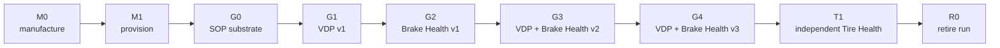

<!-- SPDX-FileCopyrightText: 2026 maninblack -->
<!-- SPDX-License-Identifier: MIT -->

# Staged Post-SOP Brake and Tire Health Demo Scenarios

- Status: Accepted demo-scenario baseline
- Version: 1.7
- Prepared: 2026-08-19
- Accepted: 2026-08-19
- Supersedes: 1.6
- Owner: Demo Architecture
- Scope: manufacturing output, end-of-line provisioning, audience-visible
  capability evolution, release sequence, dashboards, observability, and
  end-of-demo retirement
- Architecture alignment: dynamic staged projection of High-Level Architecture
  1.4, with detailed interaction mapping in Demo Scenario Architecture Flows
  1.6
- Accepted architecture decisions: [ADR 0009](../architecture/decisions/0009-separate-release-decision-from-cloud-execution.md),
  [ADR 0010](../architecture/decisions/0010-aos-kuksa-credential-broker.md), and
  [ADR 0011](../architecture/decisions/0011-qm-service-containment-and-evidence-backed-oem-approval.md)
- Implementation, build, signing, Cloud, or Unit mutation authorized: no

## Purpose

This document defines one connected demonstration lifecycle. It begins with
two newly manufactured virtual vehicle computers, provisions them into
AosCloud, evolves their software capabilities after SOP, and retires the
disposable demonstration identities and VM state at the end of the run.

The post-SOP portion deliberately starts with a working vehicle rather than a
broken or incomplete prototype. The vehicle drives, exposes telemetry through
its Vehicle Gateway, and contains an operational Domain Controller with the
AosEdge platform substrate. What is initially absent is the Vehicle Data
Platform Component payload and all functional SOTA services.

Scenario 1.7 defines what should happen and what an
audience should see. It is the dynamic, stage-by-stage projection of the
capability-superset model in High-Level Architecture 1.4. It does not yet
select exact APIs, define every detailed interaction, or authorize
implementation.

## How to Read the Demonstration Lifecycle

The demonstration uses one canonical set of stage codes. Manufacturing and
onboarding transitions use `M`, accepted runtime software graphs use `G`, the
independent Tire Health presentation stage uses `T`, and end-of-run retirement
uses `R`.

| Code | Meaning | State or outcome |
| --- | --- | --- |
| `M0` | Manufacturing output | Two fresh, unprovisioned Domain Controller overlays are created from the immutable OEM Demo Factory Image |
| `M1` | End-of-line provisioning | Both overlays receive unique Unit identities and connect to AosCloud; this transition establishes `G0` |
| `G0` | Provisioned SOP substrate | Working vehicle and update-ready Domain Controller, with an empty Vehicle Data Platform slot and no functional services |
| `G1` | First platform capability | VDP Component v1 exposes the first read-only vehicle-data subset in KUKSA |
| `G2` | First Brake Health product | Brake Health Service v1 captures bounded pre-trigger, braking and post-trigger telemetry windows and transfers them to its backend |
| `G3` | Edge-analytics Brake Health product | Backward-compatible VDP Component v2 and Brake Health Service v2 add local synthetic assessment and derived-event Cloud reporting |
| `G4` | Bidirectional Brake Health product | VDP Component v3 and Brake Health Service v3 add a typed, allowlisted local advisory path while reporting the derived result and advisory fact to the backend |
| `T1` | Independent Tire Health product | One mature Tire Health Service v1.0 candidate is delivered through SOTA 2 against the accepted VDP v3 contract while the Brake Health graph remains unchanged |
| `R0` | Demo retirement and next-run reset | Current Unit identities are retired and provisioned overlays are discarded; the immutable factory image remains |



`M1` is a provisioning transition, while `G0` is the resulting first
post-SOP runtime graph. `T1` follows `G4` in the presentation order because its
single Tire Health Service v1.0 candidate uses the accepted VDP v3 data and
advisory contract; it does not depend on the Brake Health service, backend, or
dashboard. Tire Health does not repeat the three-version Brake Health product
evolution. It demonstrates a second independent Function Team and Service
Provider lifecycle on a sufficiently capable shared vehicle-data platform.

## Core Demonstration Claim

The vehicle software architecture is prepared for post-SOP evolution because
AosEdge and the OEM-integrated Vehicle Data Provider component runtime are
integrated into the vehicle platform before SOP. Produced vehicles therefore
contain the lifecycle and execution substrate required to receive the
provider payload later without another rootfs change.

Consequently, after end-of-line provisioning the OEM can deliver versioned
Vehicle Data Platform Component releases by FOTA and independently deliver
functional services by SOTA without reprovisioning the vehicle, changing its
identity, or redesigning the software architecture established for SOP.

Provisioning and identity creation occur once at the beginning of each
demonstration run. No reprovisioning or identity replacement occurs during the
accepted `G0 -> G1 -> G2 -> G3 -> G4 -> T1` post-SOP progression. End-of-demo
retirement is an outer demonstration-lab lifecycle, not an OTA rollback of an
in-field vehicle.

The demonstration does not claim that no software ever changes after SOP. Its
claim is that post-SOP functionality is added through the extension and
lifecycle mechanisms intentionally built into the SOP platform.

## Alignment With High-Level Architecture 1.4

High-Level Architecture 1.4 shows every capability that the target logical
vehicle architecture can host. This scenario defines when those deployable
capabilities are absent or present during `M0`, `M1`, `G0–G4`, `T1`, and `R0`.

The `G0–G4` progression exercises the shared Vehicle Data Platform
Component and Function Team 1 / Service Provider 1 Brake Health lifecycle.
`T1` then demonstrates Function Team 2 / Service Provider 2 as an independent
peer: its condition model, existing-signal inputs, bounded reports/events,
advisory proof, backend, dashboard, and SOTA 2 lifecycle do not depend on
Function Team 1. Function Team 2 requests no additional platform capability in
the current demo.

The Validation Unit and Demonstration Unit are two instances of the same
logical Domain Controller architecture. The demo currently has one visible
CARLA/Vehicle Gateway/VISS source. Detailed design must define selection or
deterministic replay against the two Unit roles and must not imply two
simultaneous simulated vehicles unless that topology is later implemented.

## Demonstration Roles and Terms

| Term | Meaning in this demonstration |
| --- | --- |
| Virtual Vehicle | CARLA vehicle dynamics, environment, sensors, and actuators |
| Vehicle Gateway | `carla-ego-runtime`, VSS normalization, VISS endpoint, and vehicle-side status |
| Domain Controller | QEMU plus AosVM representing a separate vehicle ECU |
| Official AosEdge release | Immutable upstream release from which the OEM platform image is reproducibly derived |
| OEM Demo Factory Image | Cloud-unprovisioned OEM image derived from the official AosEdge release; it contains the accepted component runtime but no provider payload, functional service, Unit registration, or Cloud-issued identity certificate |
| Platform substrate | AosCore, Service Manager, enabled stock IAM permission handling, KUKSA, the accepted Vehicle Data Provider component runtime, security/update support, and the non-secret IAM/PKCS#11 broker-key integration seam present from SOP |
| Vehicle Data Platform Component | FOTA-owned platform artifact containing the inbound/outbound providers, versioned KUKSA contract/configuration and thin Aos–KUKSA Credential Broker; stage names use the shorthand VDP Component v1–v3 |
| Brake Health Function Team | Function Team 1 / Service Provider 1: OEM functional vertical that owns the Brake Health service, model, backend, dashboard, and SOTA 1 lifecycle |
| Tire Health Function Team | Function Team 2 / Service Provider 2: independent peer OEM functional vertical that owns local tire-condition estimation, bounded Cloud reporting, inspection advisory, backend, dashboard, and SOTA 2 lifecycle |
| QM functional service | Brake Health or Tire Health application in the non-safety QM domain; its maintenance advisory is not a safety warning or vehicle-motion command |
| Service Provider identity | Function Team Cloud identity used to develop, sign, publish, version, and technically verify its own SOTA artifact; it does not authorize deployment to OEM Units |
| OEM authorization identity | Cloud identity used by the owning Platform or Function Team to record validation acceptance and deployment or promotion approval affecting OEM Units |
| Evidence-backed OEM approval | Final explicit OEM decision bound to the exact artifact and metadata digests, requested permissions, target, required validation evidence, and owning-team acceptance; passing evidence never auto-approves |
| AosCloud lifecycle control plane | Authoritative desired/reported actual state, batches, campaigns, recorded approvals, audit history, and update execution; it does not make an owning team's engineering release decision |
| Validation Unit | Freshly provisioned engineering AosVM for the current demo run, used for qualification and integration |
| Demonstration Unit | Freshly provisioned production-like AosVM for the current demo run, used as the promotion target after acceptance |
| Current demo session | Presentation-scoped association, not an Aos identity: session start time and local overlay roles before M1, then the Validation and Demonstration Unit IDs plus that time window |
| Demo retirement | Controlled Cloud deprovisioning and Unit deletion followed by disposal of the corresponding provisioned VM overlays |

The Demonstration Unit is not presented as a real production vehicle or fleet.
It is the controlled production-rollout proxy available in the demo
environment. Both Units are disposable simulation assets between complete
demo runs, but their identities remain stable throughout one `G0–T1` run.

## Audience-Visible Surfaces

### CARLA Visual Vehicle Scene

CARLA is the primary visual anchor of the demonstration. The audience sees a
vehicle driving through a virtual city while the software graph changes across
the five stages. Release dashboards explain what software is being delivered;
CARLA proves that the story still concerns a live, operating vehicle.

The visual scene must include one short, repeatable emergency-braking
scenario:

1. the vehicle starts from a known location and follows a fixed route;
2. a controlled obstacle or stopped actor appears at a known point;
3. the vehicle performs a deterministic hard-braking maneuver without an
   unintended collision;
4. the audience sees the vehicle decelerate in the CARLA scene;
5. the Engineering Telematics Dashboard simultaneously shows the brake request,
   speed reduction, and longitudinal deceleration;
6. the same stimulus can be replayed against different software graphs so that
   any changed Brake Health result comes from the deployed capability, not
   from a different driving event.

The CARLA scenario controller, vehicle controller, or accepted safety behavior
creates the braking stimulus. The Brake Health service only observes and
analyzes the resulting signals; it does not command the vehicle to brake or
create the obstacle.

### Engineering Telematics Dashboard

The existing engineering dashboard subscribes directly to the Vehicle Gateway
VISS endpoint. It initially proves that the physical simulation and Gateway
telemetry are working even when no data reaches the Domain Controller.

The dashboard shows existing vehicle telemetry such as speed, longitudinal
acceleration, pedals, and steering. In the target scenario set it is extended
to show typed Brake Health and Tire Health advisory requests and Vehicle
Gateway reception status.

It is an engineering demonstration tool, not an IVI, Instrument Cluster, or
production driver HMI.

### OEM Software Delivery Dashboard

A small purpose-built dashboard should present the OEM release lifecycle in a
form that is easier to understand than the complete AosCloud UI. It is a
presentation and orchestration view over real AosCloud state and APIs; it must
not invent or cache authoritative release state independently.

Its primary view should show:

- the current demo session and manufacturing/provisioning state;
- Validation and Demonstration Unit lanes;
- current and target platform and service versions;
- exact artifact identities and compact digest evidence;
- exact service-metadata digest and requested KUKSA permissions;
- download, install, activation, readiness, validation, and promotion states;
- the effective target Units before an approval is accepted;
- `Waiting for validation`, approval, rejection, and accepted-release states;
- the owning Platform or Function Team, Service Provider publication identity,
  active OEM authorization role, and exact action awaiting confirmation;
- concise qualification results with optional technical drill-down;
- owning-team acceptance and completeness/freshness of every required evidence
  item before the final OEM approval control is enabled;
- provider and service log availability.

The dashboard must distinguish active state from retained audit history. Before
provisioning, it identifies the current session by its start time and the two
local overlay roles. After M1, it binds that view to the Validation and
Demonstration Unit IDs and the same time window. Unit deprovisioning and
deletion do not imply erasure of Cloud audit records. No separate
architecture-level run identifier is required; an internal correlation UUID
remains an optional dashboard implementation detail.

The dashboard and orchestrator do not store authoritative lifecycle state and
do not turn passing qualification evidence into approval. Every mutation
affecting an OEM Unit requires an explicit confirmation from the owning team
and is submitted through an authorized OEM identity; the resulting AosCloud
record remains authoritative after the local tools exit.

For the demo, that final decision is intentionally represented by an approval
button. The button is not the validation process. Before it can be used, the
dashboard must show the exact candidate artifact and metadata digests,
requested permissions, target, required validation evidence, owning-team
acceptance and active OEM role. Missing, failed, stale or mismatched evidence
blocks the action. The Dashboard submits the explicit decision to AosCloud and
then re-reads authoritative lifecycle state.
This approval demonstrates a reviewed release decision, not a claim that the
button itself makes software safe or provides a functional-safety
certification.

The normal presentation uses this dashboard. The original AosCloud UI remains
available for technical source-of-truth drill-down.

### Brake Health Function Dashboard

This dashboard belongs to the Brake Health Function Team. It receives data
from the team's backend, not directly from CARLA, VISS, KUKSA, or AosCloud.

Across the scenarios it evolves from no available vehicle data, to a growing
and completed v1 `BrakeTelemetryWindow`, to v2/v3 derived assessments/events
and the correlated v3 advisory fact. Backend data is not part of the
time-critical local advisory path.

### Tire Health Function Dashboard — Independent SOTA 2 Product

High-Level Architecture 1.4 assigns a separate backend and dashboard to
Function Team 2 / Service Provider 2. They become audience-visible at `T1`,
after the `G0–G4` Brake Health progression. The dashboard presents the one
prepared Tire Health Service v1.0 candidate and shows its estimated condition
band, threshold event, service and VDP v3 versions, Unit role, and
online/offline delivery state. It must not display hidden simulation truth as
a measured production vehicle value or couple its data plane to the Brake
Health backend.

### Native operational logs in the Software Delivery Dashboard

AosEdge already provides native collection and Cloud delivery for system,
service-instance, and crash logs. An authorized AosCloud log request selects
the Unit, time range, and optional service instance; AosCore collects and
archives the matching records and returns the result to AosCloud.

The stateless OEM Software Delivery Dashboard uses supported AosCloud APIs to
create explicitly confirmed log requests, show their progress, and present or
download the resulting evidence. It does not read the Unit journal directly,
store an independent log archive, or introduce a second log transport.

The view should expose Unit role, component or service identity, version,
severity, source timestamp, request status, and failure reason where available.
It is supporting operational evidence rather than the main proof of vehicle
behavior. Vehicle telemetry remains authoritative in the Engineering
Telematics Dashboard, while Brake Health and Tire Health product results remain
authoritative in their respective functional backends and dashboards.

Before the demo relies on this view, the current AosCloud API permissions,
request latency, retention/deletion behavior, online/offline semantics, and
redaction rules must be qualified.

## Release Graph Overview

| Stage | Accepted state after the stage | New capability |
| --- | --- | --- |
| M0 | `OEM Demo Factory Image + two fresh overlays` | Two fresh unprovisioned Domain Controller VM overlays exist; no Cloud Units or credentials exist |
| M1 | `Two provisioned Unit roles` | Validation and Demonstration Units have unique identities, certificates, roles, and Cloud connectivity |
| G0 | `Initial post-SOP runtime graph` | Working vehicle and update-ready Domain Controller, but no VDP Component or functional service |
| G1 | `VDP Component v1` | First read-only subset of vehicle telemetry becomes available in KUKSA |
| G2 | `VDP Component v1 + Brake Health Service v1` | One bounded pre/active/post braking-event window appears live in the Brake Health Backend and Dashboard |
| G3 | `VDP Component v2 + Brake Health Service v2` | A synthetic on-board model replaces normal high-detail window upload with derived assessments/events |
| G4 | `VDP Component v3 + Brake Health Service v3` | Local assessment can return an allowlisted advisory request to the Vehicle Gateway and report the correlated fact to the backend |
| T1 | `G4 graph + Tire Health Service v1.0` | Function Team 2 independently adds one mature local tire-condition product with bounded reporting and its typed inspection advisory |
| R0 | `Retired demo run` | Cloud identities are retired and provisioned overlays are discarded; the immutable factory image remains |

Every graph is composed of immutable, versioned artifacts. Promotion uses the
same accepted bytes and digests that passed validation; it does not rebuild or
repackage them during the presentation.

`G0–G4` describe the Function Team 1 Brake Health progression. Function Team
2's Tire Health service, backend, and dashboard remain absent throughout those
graphs and are added at `T1` through the separate SOTA 2 lifecycle. `T1` is a
presentation checkpoint, not a dependency on the Brake Health product.

One additional negative-path scenario is part of the target demo but deferred
from the current executable baseline: native AosCloud rejection of a SOTA
service whose required Vehicle Data Platform Component version is absent.
When enabled, it runs at the beginning of `G3` while the Unit still has the
`G2` graph; it does not add another persistent graph state.

The audience-visible lifecycle moves forward only. Recovery and rollback may
be qualified before the presentation as engineering evidence, but the normal
demo does not move backward between `G0–G4` or remove `T1` before retirement.

## M0 — Manufacturing Output

The immutable official AosEdge release is an upstream input, not the complete
vehicle-computer image manufactured by the OEM. Before SOP, the OEM integrates
and qualifies its platform layer to create the immutable **OEM Demo Factory
Image**.

The logical **OEM Factory Baseline Assembly** capability owns this build-time
composition, qualification and freeze process. Its output is the Factory Image
artifact; it does not run in the resulting Domain Controller.

The assembly may also produce a rootfs FOTA envelope from the same rootfs
content. That optional envelope exists to retrofit or maintain an older
already provisioned Unit through AosVM's rootfs A/B mechanism. The normal demo
does not use it at M0 or M1: every newly manufactured overlay already contains
the accepted empty-slot runtime before provisioning. The later Vehicle Data
Platform Component is a separate post-SOP FOTA artifact installed into that
runtime.

That factory image contains:

- the official AosCore baseline;
- Service Manager, KUKSA, security, and update support;
- the accepted `systemd-slot-component` runtime for the Vehicle Data Provider;
- its launcher, health, systemd, storage, and SELinux integration;
- an empty provider component store.

It intentionally contains no:

- Vehicle Data Provider executable payload;
- functional SOTA service;
- Cloud Unit registration or Cloud-issued Node credentials;
- Unit certificate, KUKSA service token, or other per-vehicle secret;
- vehicle-specific mutable runtime state.

At the beginning of a demo run, two new copy-on-write VM overlays are created
from this immutable image. One represents the Validation vehicle computer and
one represents the Demonstration vehicle computer. The factory image itself
remains read-only and is never provisioned or modified.

Each new instance must establish distinct local system, Node, SSH, and network
identity before Cloud registration. The factory artifact must therefore retain
the qualified first-boot identity-generation mechanism rather than embedding a
fixed identity that would be duplicated by every overlay.

The current `.1` and `.2` installed rootfs versions prove that this runtime can
exist with an empty provider slot. The `.11` build adds the most complete local
hardening and produced both a full unprovisioned raw VM image and a separate
unsigned rootfs FOTA candidate. The raw image is Factory Image engineering
evidence; the rootfs envelope is only an optional retrofit artifact. Neither
has yet completed Factory Image acceptance, and no provisioned VM snapshot may
be used as a manufacturing source.

The currently implemented runtime is specific to one Vehicle Data Provider
component type. This demo may claim independent versioning of that shared
Vehicle Data Platform Component, but it must not claim support for arbitrary
new provider types without another platform/rootfs release until a generic
multi-type runtime is implemented and qualified.

### Audience-visible proof

- two newly manufactured Domain Controller instances exist locally;
- neither instance is registered as an AosCloud Unit;
- no Cloud registration, Cloud-issued certificate, provider payload, or
  functional service exists;
- the Software Delivery Dashboard identifies both instances as
  `Manufactured / Awaiting provisioning`.

## M1 — End-of-Line Provisioning

The manufacturing station provisions each fresh VM exactly once with the
official Aos provisioning SDK. Provisioning creates the Unit and Main Node,
registers the instance's unique identity, generates its certificates, and
enables secure Cloud connectivity. After both Units are Online:

1. one Unit is assigned to the Validation lane and its dedicated Unit Set;
2. one Unit is assigned to the Demonstration lane and its dedicated Unit Set;
3. the dashboard verifies the exact Unit identities and target membership;
4. both Units report the accepted platform/runtime inventory;
5. both provider stores remain empty and no functional service is assigned.

Provisioning must fail closed after the SDK begins: an uncertain partial
result is preserved for reconciliation and is never retried automatically.
Two factory overlays must be proven to generate different system, Node, SSH,
and certificate identities before live use.

### Audience-visible proof

- each vehicle computer changes from `Awaiting provisioning` to `Online`;
- the two Units have different identities and explicit roles;
- the Validation and Demonstration lanes are visibly separated;
- `G0` is reached with the runtime ready but provider and services absent.

## G0 — SOP-Ready Vehicle Without Feature Components

### Starting state

The complete demonstration environment is running:

- CARLA drives the virtual vehicle through the city;
- the Vehicle Control UI can use manual or autopilot mode;
- the Vehicle Gateway publishes live VISS telemetry;
- the Engineering Telematics Dashboard displays that telemetry;
- the Validation and Demonstration Units have the fresh provisioned identities
  created during M1 and retain them throughout `G0–T1`;
- the Domain Controller contains AosCore, Service Manager, KUKSA, the accepted
  Vehicle Data Provider runtime, security integration, and update support.

The following feature-specific elements are absent:

- no Vehicle Data Platform Component payload is installed;
- no live vehicle values are published into KUKSA;
- no Brake Health service is installed;
- no vehicle data reaches the Brake Health Function Backend;
- no Tire Health service is installed and no Tire Health result reaches the
  Function Team 2 backend.

### Audience-visible proof

```text
CARLA -> Vehicle Gateway -> VISS -> Engineering Telematics Dashboard
                                  X
                                  no provider path to KUKSA
```

The audience sees a fully operational vehicle and an online, update-ready
Domain Controller. The absence of the new capability is explicit and is not
presented as a platform failure.

## G1 — Platform Team Delivers VDP Component v1

### Capability

VDP Component v1 exposes a small, read-only subset of already available vehicle
telemetry to KUKSA. The provisional subset is:

- vehicle speed;
- longitudinal acceleration;
- brake-pedal position;
- accelerator-pedal position.

The exact contract is a later design decision.

### Release flow

1. The Platform Team publishes immutable VDP Component v1 through the FOTA
   lifecycle.
2. A fresh verification batch is created for the Validation lane; stale
   batches are never reused after Unit Set membership changes.
3. Immediately before approval, the OEM Software Delivery Dashboard derives
   the effective target from current Unit state and proves that only the
   Validation Unit references the pending batch. Any unexpected Unit blocks
   approval.
4. The Platform Team explicitly authorizes the Validation Unit deployment
   through its OEM identity after the Dashboard shows the exact artifact and
   metadata digests, requested permissions, target, required evidence and
   Platform Team acceptance; the dashboard and orchestrator cannot infer this
   approval from target checks or passing tests.
5. VDP Component v1 is installed and activated on the Validation Unit.
6. Platform qualification verifies signal mapping, filtering, KUKSA
   publication, the Credential Broker's fail-closed IAM translation, distinct
   provider authority, restart, source loss, and recovery without modifying
   upstream KUKSA or introducing a second identity/policy database.
7. Selected provider lifecycle and runtime logs become available through the
   native AosEdge log request path and the Software Delivery Dashboard.
8. The Platform Team accepts the exact VDP Component v1 version, digest,
   qualification evidence, and target, and records promotion approval through
   its OEM identity.
9. AosCloud promotes the same VDP Component v1 artifact to the Demonstration Unit.

### Audience-visible proof

- VDP Component v1 is absent from the Demonstration Unit during validation.
- The Validation Unit reports VDP Component v1 as ready.
- KUKSA receives only the approved v1 signal subset.
- No functional service consumes the data yet.
- The Demonstration Unit receives the exact accepted artifact only after
  approval.

VDP Component v1 is a platform capability, not a finished customer feature.

## G2 — Function Team 1 Delivers Brake Health Service v1

### Capability

Service v1 is a deliberately simple event recorder rather than a diagnostic
model. It continuously reads the accepted VDP Component v1 KUKSA subset into a
bounded in-memory ring buffer but does not continuously upload vehicle data.
When the accepted braking trigger becomes active, the service creates one
finite `BrakeTelemetryWindow` containing a configurable bounded interval
before the trigger, the complete braking episode, and a configurable bounded
interval after the trigger clears.

To make the acquisition visible while the vehicle is braking, the service
starts the backend transfer when the trigger occurs. The first idempotent
chunk contains the pre-trigger buffer, subsequent ordered chunks contain the
active braking and post-trigger samples, and one completion record closes the
window with its sample count, time bounds and completion state. The backend
reconstructs one finite versioned event from these chunks, and the Function
Dashboard visualizes the growing window and its freshness.

Overlapping or closely spaced trigger activity is handled by a deterministic
merge/debounce rule so one physical episode is not silently presented as
multiple unrelated windows. Buffer, window, chunk, queue and retention limits
are explicit. This is selected high-detail event telemetry, not an
unrestricted continuous raw-sensor stream.

This version performs no predictive diagnostics and does not request an
advisory. Its purpose is to create the evidence from which Function Team 1
could develop a later model outside the live vehicle demonstration.

### Release flow

1. The Brake Health Function Team publishes immutable Service v1 through its
   Service Provider 1 identity in the SOTA 1 lifecycle.
2. Service v1 declares a dependency on VDP Component v1 and its exact requested
   `kuksa` read paths/modes in Aos service metadata.
3. The Function Team explicitly authorizes deployment to the Validation Unit
   through an OEM identity.
4. Service v1 is installed first on the Validation Unit. Service Manager
   registers its permissions and injects a per-instance `AOS_SECRET`.
5. The VDP-owned Credential Broker validates `AOS_SECRET` through Aos IAM,
   translates only the service instance's currently registered permissions
   into a short-lived path-scoped JWT, and rejects invalid, stale, malformed or
   VDP-contract-incompatible permissions. Integration validation proves the
   KUKSA-to-service-to-backend path and the fail-closed cases.
6. A deterministic CARLA braking episode proves that the pre-trigger buffer
   appears first, live braking chunks follow while the maneuver is visible,
   the post-trigger tail closes the same event, and the backend reconstructs
   exactly one bounded window.
7. Service logs become available through native AosEdge collection and an
   explicitly requested AosCloud log result in the Software Delivery
   Dashboard.
8. Function Team 1 accepts the exact Service v1 artifact and integration
   result and records promotion approval through an OEM identity.
9. AosCloud promotes the exact accepted Service v1 artifact to the
   Demonstration Unit.

### Audience-visible proof

- AosCloud remains the software lifecycle system.
- The Brake Health Function Backend is a separate functional data system.
- During visible CARLA braking, the Function Dashboard begins with the
  pre-trigger history, grows with live and post-trigger samples, and closes
  one correlated `BrakeTelemetryWindow`.
- The Function Dashboard receives that data only through the deployed service.
- The service has only its approved KUKSA read paths; no reusable token is
  embedded in its SOTA artifact.
- Removing or stopping Service v1 does not remove VDP Component v1 or the existing
  Engineering Telematics Dashboard path.

## G3 — Expanded Inputs and Edge-Analytics Service v2

### Deferred native dependency-rejection prelude

This prelude is a planned part of the target demonstration, but it is not
executed with the current AosCloud release.

Starting from `G2`, the Validation Unit has VDP Component v1 and Service v1.
Function Team 1 submits the already prepared Service v2 candidate, which
declares that it requires Vehicle Data Platform Component v2. The target
native behavior is:

1. AosCloud resolves the candidate's required capability range against the
   authoritative actual component state of the intended Validation Unit.
2. AosCloud observes VDP Component v1 rather than the required VDP Component v2.
3. AosCloud rejects the SOTA request before changing Subject-service desired
   state, creating a validation batch or campaign, or transferring update
   content to the Unit.
4. The OEM Software Delivery Dashboard shows the authoritative Cloud rejection
   reason, required range, actual version, service identity and target Unit.
5. The Validation Unit remains on the unchanged `VDP Component v1 + Service v1`
   graph.
6. The Platform Team then follows the normal VDP Component v2 FOTA flow below.
7. The identical Service v2 candidate is resubmitted after VDP Component v2 reports
   ready; the dependency check succeeds and `G3` continues normally.

The scenario is activated only after an official AosEdge release exposes the
Service-to-FOTA-component dependency in its supported Cloud API and signed
service metadata, and a disposable qualification proves all rejection
boundaries above. The project does not implement a temporary admission gate in
the Software Delivery Dashboard.

### Feature request

After working with the braking-event windows collected by Service v1, the
Brake Health Function Team determines that its next local model needs
additional vehicle information that exists on the vehicle side but is not
part of VDP Component v1.

The Function Team sends the Platform Team a versioned capability request with
the required signals, quality constraints, timing expectations, and acceptance
criteria.

### Candidate input expansion

The provisional VDP Component v2 inputs may include:

- per-wheel speed and wheel-speed asymmetry;
- brake demand or simulated brake pressure;
- measured deceleration relative to brake demand;
- emergency-braking or ABS activation state;
- estimated brake temperature;
- cumulative braking-energy or pad-wear proxy.

Signals not produced by CARLA as real sensors must be clearly labelled as
simulated or estimated. Exact diagnostic mathematics is not an audience claim:
the demonstration may use a deliberately simple synthetic model, provided it
is deterministic, versioned, testable, and causally driven by the visible
CARLA braking episode. The demo must not imply production diagnostic accuracy,
validated remaining useful life, or a safety function.

### Release flow

1. The Platform Team develops VDP Component v2 as a backward-compatible superset of
   VDP Component v1.
2. VDP Component v2 is installed on the Validation Unit through FOTA.
3. The Platform Team independently completes platform qualification.
4. The Brake Health Function Team installs Service v2 through SOTA 1 on the
   same Validation Unit.
5. Service v2 declares a dependency on VDP Component v2.
6. Both teams perform joint integration and scenario validation.
7. The Platform Team accepts the exact VDP Component v2 artifact and qualification
   through an OEM identity. Function Team 1 separately accepts the exact
   Service v2 artifact, model, and joint integration result through an OEM
   identity.
8. AosCloud permits promotion only after both owner decisions are recorded for
   the same graph, digests, and targets.
9. VDP Component v2 is promoted to the Demonstration Unit first; Service v1 remains
   operational against the backward-compatible v1 subset.
10. After VDP Component v2 reports ready, Service v2 is promoted to the
   Demonstration Unit.

### Model and Cloud-data lifecycle

Data gathered through the Service v1 windows may be used by Function Team 1 to
develop and validate its model outside the live vehicle demonstration. The
resulting synthetic demo model and its configuration are versioned and
packaged with Service v2.

The live presentation demonstrates deterministic inference. It does not claim
that a production predictive model was trained during the presentation or
that the synthetic model diagnoses a real brake system.

Service v2 consumes the accepted braking signals locally and emits a bounded
`BrakeHealthAssessment` plus threshold/change `BrakeHealthEvent` messages.
Normal v2 operation no longer uploads the high-detail Service v1 telemetry
window. A future explicitly authorized diagnostic capture may be designed
separately, but it is not part of this demo baseline.

### Audience-visible proof

- VDP Component v2 and Service v2 iterate independently before combined acceptance.
- Existing v1 behavior remains available while VDP Component v2 is installed.
- The Function Dashboard changes visibly from a growing high-detail v1 window
  to bounded v2 assessments/events, proving that processing moved into the
  vehicle and normal Cloud traffic was reduced.
- New Function Dashboard information appears only after both VDP Component v2 and
  Service v2 are ready.
- The dashboard identifies simulated signals and model output clearly.
- Provider and service logs can be inspected without relying on terminal
  output as the main narrative.

## G4 — Bidirectional Advisory Capability

### Feature request

After validating the predictive behavior, the Brake Health Function Team asks
for a bounded vehicle-facing capability that can return an inspection advisory
request to the Vehicle Gateway.

The Platform Team produces Vehicle Data Platform Component v3. At the
scenario level this is called VDP Component v3; its lower-level implementation may
use separate inbound and outbound providers.

### Release flow

1. VDP Component v3 adds a strictly allowlisted advisory actuator path and Gateway
   status feedback while preserving all accepted v1 and v2 inputs.
2. VDP Component v3 is installed and platform-qualified on the Validation Unit.
3. Service v3, containing the accepted local inference model, is installed
   through SOTA 1 on the Validation Unit.
4. Joint validation proves online, offline, failure, restart, and recovery
   behavior.
5. The Platform Team accepts the exact VDP Component v3 artifact through an OEM
   identity, and Function Team 1 separately accepts the exact Service v3
   artifact and joint integration result through an OEM identity.
6. AosCloud permits promotion only after both decisions are recorded for the
   exact graph, digests, and targets.
7. VDP Component v3 and then Service v3 are promoted in dependency order to the
   Demonstration Unit.

### Runtime flow

```text
vehicle signals
  -> inbound Vehicle Interface Provider
  -> KUKSA actual-value namespace
  -> read / subscribe
  -> Brake Health Service v3
  -> local inference
  -> Brake Health advisory request through actuate / write target
  -> KUKSA advisory-target namespace
  -> outbound validation and allowlist
  -> outbound Vehicle Interface Provider
  -> VISS Set over the simulated in-vehicle network
  -> Vehicle Gateway advisory handler
  -> Gateway reception/status
  -> Engineering Telematics Dashboard
```

The advisory is intended for a future driver-facing vehicle function, but the
demonstration implements no IVI or Instrument Cluster. It proves only that the
request reaches the Vehicle Gateway and that the Gateway publishes a factual
reception status.

Brake Health and Tire Health are QM-domain applications in this demo. Their
outputs are maintenance/inspection advisories, not safety warnings. The VDP
outbound allowlist is defense in depth; the Vehicle Gateway is the final
authoritative boundary for the QM-origin channel and rejects arbitrary VSS
writes and all throttle, brake, steering, gear, vehicle-motion or
safety-critical operations.

### Offline proof

1. The Demonstration Unit loses Cloud connectivity while local vehicle
   processing remains active.
2. A deterministic CARLA braking scenario produces the required signal
   sequence.
3. Service v3 performs local inference without a Cloud request.
4. The advisory reaches the Vehicle Gateway.
5. The Engineering Telematics Dashboard shows the advisory and Gateway status.
6. The derived assessment/event and advisory fact remain pending locally if the backend is
   unavailable.
7. After connectivity returns, those functional messages synchronize to the Function
   Backend and appear in the Function Dashboard with their original event times.

Service v3 also sends the derived assessment/event and the correlated advisory
fact to the Function Backend. The backend remains outside the local decision
path and cannot authorize, suppress or modify the advisory.

The demo does not claim `displayed to driver` or `driver acknowledged`.

## T1 — Function Team 2 Delivers Tire Health Service v1.0

### Capability

Function Team 2 independently delivers one mature Tire Health Service v1.0
candidate through SOTA 2. This is the first Tire Health product release, not a
hidden `v3` following two omitted Tire releases. It consumes only the accepted
vehicle-dynamics subset already exposed by VDP Component v3. It maintains a
bounded, persistent tire-condition
estimate, produces condition bands and inspection decisions locally, uploads
only bounded summaries or threshold events, and may request only its typed
allowlisted Tire Health advisory target.

The scenario uses an explicit accelerated-time or pre-aged tire-degradation
stimulus because CARLA does not provide production-equivalent live tread wear,
pressure, temperature, puncture, load, force, or torque measurements. Hidden
simulation truth is used only for qualification and is never presented as a
measured vehicle signal.

`T1` follows `G4` in the audience presentation so the required VDP v3 data and
advisory contract already exist. Tire Health does not depend on the Brake
Health service, backend, dashboard, model, or SOTA 1 lifecycle. Brake Health
demonstrates multi-version product evolution; Tire Health demonstrates a
second independent Function Team, Service Provider identity, data product and
SOTA lifecycle sharing the accepted platform.

The multi-tenancy claim is deliberately bounded and visible: Tire Health v1.0
and Brake Health v3 run as separate service instances on the same Domain
Controller, with distinct Service Provider publication identities, service
metadata, IAM-derived KUKSA permissions, resource quotas, SOTA lifecycles,
functional backends and dashboards. The demo does not claim third-party
provider onboarding, fleet-operator tenancy or safety-domain consolidation.

### Release flow

1. Function Team 2 publishes the immutable Tire Health Service v1.0 artifact through its
   Service Provider 2 identity and SOTA 2 lifecycle.
2. The service declares VDP Component v3 compatibility and its exact KUKSA
   read and actuate paths in its Aos service metadata.
3. Function Team 2 explicitly authorizes deployment to the Validation Unit
   through an OEM identity.
4. The Credential Broker verifies the service instance through Aos IAM and
   maps only the currently registered, VDP-contract-compatible paths into a
   short-lived scoped KUKSA credential.
5. Validation proves local estimation, persistent-state continuity, bounded
   offline reporting, idempotent backend ingestion, advisory isolation, and
   that the existing Brake Health graph remains unchanged.
6. Function Team 2 accepts the exact service version, digest, and integration
   result and records promotion approval through an OEM identity.
7. AosCloud promotes the identical Tire Health Service v1.0 artifact to the Demonstration
   Unit without rebuilding or changing the Brake Health or VDP artifacts.

The current AosCloud release is not claimed to reject an incompatible service
before desired-state change or content transfer. Until the native dependency-
admission roadmap feature is available and qualified, the demo sequences Tire
Health after accepted VDP v3, presents compatibility evidence before OEM
approval, and requires the service to fail closed at readiness if the installed
contract is absent or incompatible. No project-side admission controller is
introduced.

### Runtime and audience-visible proof

- CARLA and the Engineering Telematics Dashboard show the accepted native
  dynamics inputs and clearly labelled accelerated or pre-aged tire stimulus.
- The Tire Health service reads only its allowed KUKSA paths and performs its
  condition estimate locally on the Domain Controller.
- Cloud loss does not stop local estimation or inspection-advisory generation;
  bounded results synchronize after connectivity returns.
- The Tire Health Function Dashboard shows condition band, threshold event,
  original event time, service and VDP versions, Unit role, and delivery state
  without receiving a continuous raw-telemetry stream.
- A typed Tire Health advisory follows KUKSA, the allowlisted outbound VDP,
  VISS Set, and the Gateway handler; the Engineering Telematics Dashboard shows
  only the factual request and Gateway status, not a production driver HMI.
- The Brake Health Function Dashboard and SOTA 1 lifecycle remain unchanged,
  proving that Function Team 2 is an independent peer Service Provider.

## Deterministic CARLA Visual Scenario

The runtime demonstration requires a repeatable visual and physical stimulus
rather than random traffic behavior. A later design should select one
controlled scenario, for example:

1. the vehicle follows a known route at a bounded speed;
2. a scripted obstacle or stopped actor appears at a known location;
3. the vehicle performs a deterministic hard-braking maneuver;
4. the Gateway publishes the resulting brake request, speed, deceleration,
   wheel, and simulated brake-health signals;
5. the CARLA scene and Engineering Telematics Dashboard make the maneuver
   visible at the same time;
6. the same scenario can be replayed before and after a software graph change.

The Brake Health service observes and analyzes the event. It does not control
vehicle motion or create the emergency-braking stimulus.

The scene must have a deterministic reset, bounded duration, fixed actor
placement, and a safe failure mode if the expected braking trigger does not
occur. Random city traffic may remain visible outside the controlled segment
only if it cannot change the event timing or outcome.

## Drive-Mode and World-Context Transitions

The interactive vehicle has four control modes—`SCENARIO`, `MANUAL`,
`AUTOPILOT`, and `SAFE_STOP`—and two independent world contexts:

- `FREE_DRIVE`, with no scenario-owned obstacle; and
- `BRAKE_EVENT`, with the deterministic obstacle and scenario evidence active.

The same ego actor, synchronous clock owner, Gateway telemetry stream and run
identity remain active across every transition. A reset may reposition that
actor, but it must increment an explicit reset/scenario generation and expose
the resulting discontinuity rather than present teleportation as physical
vehicle motion.

| Requested transition | Required audience-visible behavior |
| --- | --- |
| `SCENARIO -> MANUAL` | Mark an unfinished scripted attempt `ABORTED`; retain the current ego position and `BRAKE_EVENT` obstacle so the operator can perform manual braking. |
| `SCENARIO -> AUTOPILOT` | Mark an unfinished attempt `ABORTED`, select safe stop, remove scenario-owned obstacle state, reset the same ego actor to an accepted free-drive start with zero motion, then enable Autopilot only after lane/alignment validation. |
| `AUTOPILOT -> MANUAL` | Disable Traffic Manager and blend into manual control in place without overlapping throttle and brake. |
| `AUTOPILOT -> SCENARIO` | Select safe stop, disable Traffic Manager, prepare the canonical obstacle, reset the same ego actor and start a new scenario generation. |
| `MANUAL -> SCENARIO` | Select safe stop, prepare the canonical obstacle, reset the same ego actor and start a new scenario generation. |
| `MANUAL -> AUTOPILOT` in `FREE_DRIVE` | Hand over in place after lane/alignment validation. |
| `MANUAL -> AUTOPILOT` in `BRAKE_EVENT` | Select safe stop, remove scenario-owned obstacle state, reset the same ego actor to the accepted free-drive start with zero motion, then enable Autopilot. |
| Any mode `-> SAFE_STOP` | Stop safely without implicitly resetting position, world context or scenario evidence. |
| `SCENARIO -> SCENARIO` | Mark an unfinished attempt `ABORTED`, reset canonical scenario state and start a new generation. |

Scenario `PASS`, `FAIL` or collision selects `SAFE_STOP`. Restarting the
scenario or transitioning to Autopilot provides deterministic recovery from a
blocked position. Reverse gear is deliberately outside the current manual
control scope; the demo must not depend on reverse for recovery. Autopilot is
CARLA Traffic Manager with automatic lane change disabled, so the demo makes
no obstacle-avoidance claim and removes the brake-event obstacle before
free-drive Autopilot begins.

The Engineering Telematics Dashboard shall show the current control mode,
world context, scenario state/result, generation and reset/discontinuity state
as explicitly simulator-derived engineering facts.

## Prebuilt Demo and Runtime Duration

All source changes, builds, model training, tests, artifact signing, and Cloud
uploads occur before the presentation. The OEM Demo Factory Image and all
post-SOP artifacts are frozen before the presentation. The live demo performs
only:

- creation of two fresh overlays from the immutable factory image;
- controlled provisioning and assignment of the two new Units;
- selection of the already staged immutable artifact;
- deployment to the intended Unit;
- visible validation and approval;
- promotion of the accepted artifact graph;
- deterministic runtime execution;
- optional connectivity loss and recovery;
- retirement of the current demo run and reset of external demo data.

The final storyboard should define executive and technical variants with
explicit duration budgets. Long builds and raw terminal output are never part
of the normal audience flow.

## R0 — End-of-Demo Retirement and Next-Run Reset

The complete demo does not reverse the accepted software graph from `T1` or
`G4` to `G0`. No artificial provider, service, or rootfs rollback is part of the normal
presentation. Instead, the two simulated Domain Controller Unit instances
created for the current run are retired, and the next run represents two newly
manufactured vehicle computers.

The controlled retirement sequence is:

1. close, stop, or detach current-run assignments and campaigns as required by
   the accepted Cloud procedure;
2. stop both VM instances cleanly and prove that no QEMU process holds either
   overlay;
3. wait until AosCloud reports both Units as `Offline`;
4. invoke the accepted Cloud-side Unit deprovisioning operation;
5. prove that the retired identities and certificates cannot reconnect;
6. reconcile each Unit's membership at the point required by the qualified
   AosCloud contract; an explicit removal may precede Unit deletion, while an
   API that owns automatic removal still requires an authoritative final
   re-read rather than an assumption;
7. delete the corresponding Unit records through AosCloud; Nodes are treated
   as Unit-owned resources unless the qualified API flow explicitly requires
   a separate operation;
8. re-read active Unit inventory plus the persistent Verification and
   Demonstration Unit Sets, and prove that both retired Unit IDs are absent and
   both set memberships are empty;
9. discard the two provisioned overlays and their run-specific host access
   state without modifying the immutable OEM Demo Factory Image;
10. clear or archive functional backend and dashboard data associated with the
   retired Validation and Demonstration Unit IDs and the current session time
   window, while retaining the authoritative Cloud audit history;
11. reset the CARLA scenario, actors, route, and deterministic seed;
12. begin the next run by creating two new overlays from the same accepted
    factory image, provisioning new Unit and Node identities, assigning the
    new Validation Unit to the Verification Unit Set and the new Demonstration
    Unit to the Demonstration Unit Set, and proving exact disjoint membership
    before any release lifecycle begins.

The Unit Set objects are controlled Cloud configuration and remain available
between runs; only their Unit memberships are run-scoped. A Unit progresses
through separately evidenced `Offline`, deprovisioned, and deleted outcomes:
after deletion it is absent from the active Unit inventory, while authoritative
Cloud audit history remains. No verification batch, Fleet Validation Batch,
Campaign, or effective-target assumption from the retired run may be reused
after the new membership is established.

This is a demonstration-lab retirement workflow, not a production OTA factory
reset or a normal in-field vehicle rollback. The exact deprovision/delete
ordering, certificate invalidation behavior, Unit-owned Node cleanup, Unit Set
membership behavior, audit retention, and failure recovery must be qualified
first on disposable Units.
The existing Validation and Demonstration identities must not be used for that
destructive experiment.

## Consistency Decisions Already Accepted

1. The official AosEdge release is an upstream input; manufacturing uses a
   reproducibly derived OEM Demo Factory Image.
2. The factory image contains the accepted Vehicle Data Provider runtime but
   no provider payload, functional service, Cloud registration, Cloud-issued
   credential, or embedded reusable per-vehicle secret.
3. The current runtime supports one independently versioned Vehicle Data
   Platform Component; arbitrary new provider types are not claimed.
4. `Validation Unit` and `Demonstration Unit` are used instead of claiming a
   real production vehicle or fleet.
5. VDP Component v2 is backward compatible with the VDP Component v1 contract.
6. Every service version is validated on the Validation Unit before promotion.
7. Joint validation completes before either side of a new combined graph is
   promoted to the Demonstration Unit.
8. A prepared model is delivered with the service; live operation performs
   local inference rather than presentation-time training.
9. The final Brake Health advisory is visible only as a request and Gateway
   status in the Engineering Telematics Dashboard; no driver HMI is
   implemented.
10. All factory and update artifacts are built and staged before the
    presentation.
11. Unit identities remain stable throughout `G0–T1`; the complete next-run
    reset retires those identities and creates new ones from fresh overlays.
12. High-Level Architecture 1.4 is a capability superset; `G0–G4` exercise
    Function Team 1 and `T1` adds Function Team 2 through its independent Tire
    Health SOTA 2 lifecycle.
13. Function Team 1 and Function Team 2 remain independent AosCloud Service
    Providers. Function Team 2 consumes the existing platform contract and
    does not request another capability in the current demo.
14. The current demo session is associated through the two Unit IDs and a time
    window after M1; no additional architecture identity is mandatory.
15. Native Cloud rejection of a SOTA service whose required FOTA capability is
    absent is a target demo scenario deferred until the AosEdge roadmap feature
    ships and is qualified. No project-specific admission controller is used.
16. The owning Platform or Function Team makes each engineering release
    decision. Function Teams publish through Service Provider identities, all
    approvals affecting OEM Units use authorized OEM identities, and AosCloud
    stores and executes the resulting lifecycle transition. The dashboard and
    orchestrator own neither approval nor lifecycle state.
17. Interactive CARLA mode transitions follow the accepted drive-mode/world-
    context matrix; manual takeover preserves the brake event, while Autopilot
    never inherits the scenario obstacle and no reverse-control claim is made.
18. Brake Health and Tire Health are QM-domain maintenance/inspection
    applications. They have no allocated safety goal, direct driver-HMI claim,
    vehicle-motion authority or safety-critical actuator access.
19. The Vehicle Gateway, not the VDP allowlist alone, is the final
    authoritative containment boundary for the QM-origin advisory channel.
20. The visible OEM approval button is only the final explicit decision after
    exact artifact/metadata identity, requested permissions, target,
    validation evidence and owning-team acceptance are shown and matched.
    Passing evidence never auto-approves, and AosCloud remains authoritative.

## Open Qualification and Implementation Gates

1. Implement and qualify the accepted `T1` Tire Health scenario, including its
   existing signal subset,
   accelerated/pre-aged degradation model, persistent state, condition bands,
   bounded backend payload, advisory, hidden qualification truth, and dashboard
   proof.
2. Define how the single visible CARLA/VISS environment is connected or
   deterministically replayed for the Validation and Demonstration Units; do
   not imply two simultaneous simulated vehicles unless that is implemented.
3. Confirm the exact VDP Component v1–v3 signal and advisory subsets, including
   the existing dynamics inputs required by Tire Health.
4. Select the simulated brake degradation or anomaly and define how CARLA or
   the Vehicle Gateway generates its source values.
5. Define the exact bounded Service v1 braking-event contract: trigger and
   clear rules, pre/active/post durations, signal sampling, merge/debounce,
   ordered chunk/completion schemas, reconstruction/resume, and all memory,
   queue and size limits. Continuous unrestricted raw streaming is excluded.
6. Qualify the current AosCloud system, service-instance, and crash-log APIs,
   including scoped access, request latency, retention/deletion, offline
   behavior, redaction, and presentation in the Software Delivery Dashboard.
7. Define the minimum OEM Software Delivery Dashboard views and exact evidence
   dossier: artifact and metadata digests, requested permissions, target,
   evidence completeness/freshness, team acceptance, active OEM role, blocked
   reasons, final explicit confirmation and post-action Cloud re-read, without
   introducing local lifecycle state or automatic approval.
8. Define the versioned synthetic model identity, deterministic
   `BrakeHealthAssessment` and threshold/change `BrakeHealthEvent` shown by
   Service v2, including proof that normal v2 operation no longer emits v1
   high-detail windows, before advisory actuation is introduced.
9. Prove that a fresh verification batch shows only its intended Validation
   Unit before approval; never reuse a stale batch after Unit Set changes.
10. Freeze and qualify a clean, unprovisioned OEM Demo Factory Image with an
    empty provider store, no Cloud registration or credential, and no fixed
    identity that would be duplicated across instances.
11. Prove that two fresh overlays create different system, Node, SSH, and
    certificate identities.
12. Qualify Cloud deprovision, Unit deletion, old-certificate rejection, Node
    cleanup, retained audit history, and partial-failure recovery on disposable
    Units.
13. Measure sequential and, if later required, parallel provisioning enough
    times to define an honest audience-visible duration and timeout.
14. Define current-session naming, binding to the two Unit IDs and time window,
    Unit Set assignment, and external data-retention rules. An internal UUID is
    optional and is not an architecture identity.
15. Define the target duration for each stage and for the complete executive
    and technical flows.
16. When an implementing AosEdge release becomes available, qualify native
    Service-to-FOTA-component dependency declaration and rejection before any
    Subject-service desired-state change, validation batch, campaign, or Unit
    download, then enable the deferred `G3` prelude.
17. Implement and qualify the complete drive-mode/world-context transition
    matrix, dynamic obstacle lifecycle, reset/discontinuity evidence and
    Engineering Telematics Dashboard presentation.

Detailed interaction mapping now exists in Demo Scenario Architecture Flows
1.6. The open gates above constrain component requirements, implementation,
qualification, and audience-visible claims. They preserve the canonical
`M0 -> M1 -> G0 -> G1 -> G2 -> G3 -> G4 -> T1 -> R0` presentation order and
the independence of the two SOTA lifecycles.

## Acceptance Record for Version 1.7

Version 1.7 preserves HLA 1.4 component boundaries, lifecycle owners and the
accepted `M0 -> M1 -> G0 -> G1 -> G2 -> G3 -> G4 -> T1 -> R0` order. It
refines only the Brake Health product evolution:

1. v1 is an event-triggered recorder with bounded pre-trigger, active-braking
   and post-trigger telemetry rather than a low-rate report;
2. v2 uses a versioned deterministic synthetic demo model on-board and sends
   derived assessments/events rather than normal v1 high-detail windows;
3. v3 retains the v2 backend result, adds the correlated advisory fact, and
   keeps the Cloud outside the local advisory path; and
4. no production diagnostic-accuracy, remaining-useful-life, safety or driver-
   HMI claim is added.

## Reference Basis

- [High-Level Architecture 1.4](../architecture/high-level-architecture.md)
  defines the accepted capability-superset architecture baseline; this
  scenario defines its staged component presence and lifecycle, while
  [Architecture Flows 1.6](../architecture/demo-scenario-architecture-flows.md)
  defines detailed cross-component interaction mapping.
- [AosEdge overview](https://docs.aosedge.tech/docs/aos-edge/) describes the
  Cloud-to-edge lifecycle and operational visibility model.
- [Monitor a Service](https://docs.aosedge.tech/docs/how-to/advanced-service-operation/monitor-service)
  documents Cloud-requested service and crash logs.
- [AosCore common infrastructure](https://docs.aosedge.tech/docs/aos-core/architecture/common-infrastructure/)
  documents log archiving, compression, and Cloud transmission support.
