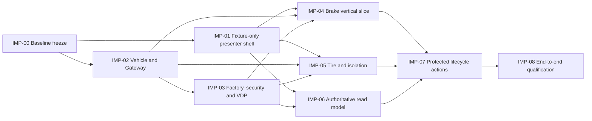

<!-- SPDX-FileCopyrightText: 2026 maninblack -->
<!-- SPDX-License-Identifier: MIT -->

# Demo Implementation Plan

- Status: P1 isolated source implementation in progress; integration remains gated
- Version: 1.2
- Prepared: 2026-08-27
- Accepted: 2026-08-28
- Updated: 2026-08-29
- Owner: Demo Solution Team with Platform, Gateway and Function Team owners
- Architecture input: [High-Level Architecture 1.5](../../architecture/high-level-architecture.md)
- Scenario input: [Demo Scenarios 2.0](../../demo/staged-post-sop-brake-health-demo-scenarios.md)
- Flow input: [Architecture Flows 2.0](../../architecture/demo-scenario-architecture-flows.md)
- System requirements input: [System Requirements 2.0](../../requirements/system-requirements-and-traceability.md)
- Component input: [Component Register 2.0](../../requirements/component-decomposition-and-interface-register.md)
- End-to-end input: [End-to-End Acceptance 0.8](../../requirements/components/end-to-end-acceptance.md)
- Fleet and Unit Set identity input: [D4-012.1 Dedicated Demo Fleet and Unit Set Identity](../../requirements/d4-decision-register.md#d4-012-1)
- UI inputs: [Surface Register 0.14](../../demo/mockups/README.md), [Interaction Specification 2.5](../../demo/mockups/aosedge-demo-interaction-specification.md), [UI Traceability Register 1.2](../../demo/mockups/aosedge-demo-ui-traceability-register.md)
- Brake Cloud repository creation completed on 2026-08-28; no additional
  repository creation, product implementation, build, signing, Cloud, Unit, VM
  or CARLA mutation is authorized by this plan alone

## Purpose

This plan turns the accepted design into bounded, independently reviewable
implementation increments. It defines ordering, repository ownership,
dependencies, verification and the evidence required before a following
increment begins. It does not restate component requirements and does not
authorize implementation by itself.

The intended result is a demonstrable `M0 -> M1 -> G0 -> G1 -> G2 -> G3 ->
G4 -> T1 -> R0` product in which:

- the presenter uses the accepted composed workspace and linear release story;
- Test Vehicle qualification precedes identical Production Vehicle rollout;
- Platform, Brake and Tire teams progress independently on disjoint resources;
- independent OEM Release Authority authorizes exact deployments after the
  owning team's evidence-backed acceptance;
- AosEdge remains the authoritative lifecycle, identity, permission, log and
  resource state source; and
- all artifacts are prepared before a presentation: no compilation, image
  build, container build or source editing occurs during the demo.

## Authorization Model

Every implementation increment has its own state:

| State | Meaning |
| --- | --- |
| `PLANNED` | Scope is described, but no implementation is authorized. |
| `READY_FOR_REVIEW` | Inputs and exact change boundary are complete. |
| `AUTHORIZED` | The user has explicitly authorized this exact increment. |
| `IMPLEMENTED` | Code/artifacts exist and isolated checks pass. |
| `QUALIFIED` | Required integration/live evidence and human review pass. |
| `BLOCKED` | A named design, external-platform, repository or evidence gate is unresolved. |

Authorization is never inherited from a parent workstream or prior increment.
Before changing code, the increment review must freeze:

1. exact repositories and paths;
2. requirements, interfaces and UI rules in scope;
3. current code/artifact baseline and gaps;
4. tests to add or update;
5. whether repository creation, build, signing or an external mutation is
   included; and
6. explicit exclusions and rollback/recovery boundary.

Read-only inspection, fixture creation and local tests do not authorize a
Cloud, Unit, VM, CARLA, signing or publication operation. Any increment that
needs one of those operations receives a separate live-operation approval
after its static and isolated gates pass.

## Repository and Ownership Map

| Boundary | Primary implementation repository | Notes |
| --- | --- | --- |
| CARLA virtual physical vehicle | `CarlaSim` | Existing simulator; restricted Unreal source remains outside public solution repositories. |
| Scenario, controller, Gateway, VISS, advisory handler and Engineering Telematics Dashboard | `carla-ego-runtime` | Existing implementation is extended rather than replaced. |
| Factory assembly, OEM Component Runtime, removable `CMP-KAC`, KUKSA integration and VDP v1-v3 | `aos-vehicle-platform` | Factory/System artifacts and VDP FOTA retain separate lifecycle identities. |
| Brake in-vehicle service | `brake-health-service` | Existing scaffold is assessed and extended. |
| Brake backend and Function Dashboard | `brake-health-cloud` | Isolated foundation `68fe61b` over public baseline `6da2926`; data packet is proposed/review required. |
| Tire in-vehicle service | proposed `tire-health-service` | Repository creation requires its own explicit authorization. |
| Tire backend and Function Dashboard | planned `tire-health-cloud` | Repository creation requires its own explicit authorization. |
| Presenter UI, native helper, VM/Unit orchestration and E2E qualification | `aosedge-sdv-demo` | Integration repository; must not absorb product source owned above. |
| AosCore and AosCloud | external released platform | No project-owned unit tests; qualify only the consumed contracts and observed integration behavior. |

`workspace/repositories.json` changes only after a proposed repository exists,
its license and initial boundary are reviewed, and the repository-addition
increment is explicitly authorized.

## Increment Dependency View

`IMP-01` and the read-only assessment portion of `IMP-02` may proceed in
parallel after separate authorization. The graph does not serialize
independent Platform, Brake and Tire engineering work; it only records the
shared evidence needed before integrated deployment and qualification.

## Parallel Execution Operating Model

### Coordination topology

The implementation uses one Integration Coordinator and up to three concurrent
worker instances. The limit is an execution-control choice, not an
architectural restriction. Workers rotate between lanes as one wave reaches
its fan-in gate.

| Role | Owns | Must not own |
| --- | --- | --- |
| Integration Coordinator | Accepted baseline, work-packet approval, shared-contract control, cross-repository dependency view, merge order, integration gates and user-facing status | Unreviewed product behavior, silent contract changes or automatic external mutations |
| Repository worker | One authorized work packet in one repository ownership boundary, its unit tests and its completion packet | Another worker's repository, shared-contract acceptance, `main` integration or live Cloud/VM/CARLA authority |
| Integration runner | Approved composed tests after component fan-in; normally performed by the Coordinator | Product fixes during a qualification run or bypass of a failed component gate |
| Operator | Explicitly confirms signing, publication, Cloud, VM, Unit, CARLA and destructive operations when a qualified increment reaches that gate | Delegating open-ended mutation authority to a worker |

The Integration Coordinator remains active while workers run. It reviews
dependency questions, receives blocked-state reports and keeps unrelated lanes
moving. A worker never waits on another worker by editing that worker's source
or inventing a temporary incompatible interface.

### Allocation rule

Parallel work is allocated by repository ownership boundary rather than by the
number of logical `CMP-*` components. Components that share a repository and
frequently touch the same build, configuration or test surfaces stay under one
worker. Two concurrent writers in one repository are prohibited unless a
separate review proves disjoint directories, disjoint build outputs and a
single named integration owner.

The default lane ownership is:

| Lane | Increments and repository boundary | Default worker scope |
| --- | --- | --- |
| `L-UI` | `IMP-01`, then UI part of `IMP-06`; `aosedge-sdv-demo` | Presenter application, fixtures and read-adapter boundary only |
| `L-VEH` | `IMP-02`; primarily `carla-ego-runtime`, with `CarlaSim` only when its hardware model must change | Scenario, controls, Gateway, VISS, advisories and Engineering Dashboard |
| `L-PLATFORM` | `IMP-03`; `aos-vehicle-platform` | Factory/runtime/KAC/KUKSA integration and VDP v1-v3 |
| `L-BRAKE` | `IMP-04`; `brake-health-service` and, after creation approval, `brake-health-cloud` | Brake in-vehicle and Cloud product boundary |
| `L-TIRE` | `IMP-05`; proposed Tire repositories after creation approval | Tire in-vehicle and Cloud product boundary |
| `L-LIFECYCLE` | non-UI part of `IMP-06` and `IMP-07`; `aosedge-sdv-demo` | Authoritative reads, protected helper and lifecycle orchestration |
| `L-E2E` | `IMP-08`; integration repository plus read-only evidence from owners | Composition, qualification and human acceptance only |

`L-UI` and `L-LIFECYCLE` share the integration repository and therefore do not
write it concurrently by default. The Coordinator may sequence them or approve
an exact directory split only after their application boundary is known.

### Work packet and branch isolation

Every worker starts from a reviewed work packet. It contains:

1. one stable work-packet ID and owning increment/lane;
2. repository, accepted base commit, dedicated `codex/imp-*` branch and
   isolated worktree;
3. exact writable paths and explicit read-only dependencies;
4. in-scope `REQ-*`, `UT-*`, `IF-*`, contract versions and UI rules;
5. required fixtures, test commands and exit evidence;
6. allowed local processes and reserved ports/volumes, if any;
7. forbidden changes and external-operation boundary; and
8. escalation owner for a missing or conflicting design decision.

The worker must begin from a clean worktree and record unexpected pre-existing
state rather than removing or absorbing it. Generated output is written only
to reviewed ignored/build locations. A worker commits only its own packet and
does not push directly to another lane or to `main`.

Suggested branch names are descriptive rather than permanent identifiers:

- `codex/imp-01-presenter-shell`;
- `codex/imp-02-vehicle-gateway`;
- `codex/imp-03-platform-vdp`;
- `codex/imp-04-brake-health`;
- `codex/imp-05-tire-health`; and
- `codex/imp-06-cloud-read-model`.

Each repository branches from its own reviewed accepted revision; a solution-
repository commit must never be treated as the base commit of a sibling
product repository.

### Contract freeze and change requests

The work packet pins every consumed contract by repository revision, semantic
version and content digest. Shared contracts in `aosedge-sdv-demo` are
read-only worker inputs. Producer and consumer workers may independently build
against the same fixtures, but neither may silently change the contract to make
its local tests pass.

When implementation exposes a contract problem, the worker produces a bounded
change request containing:

- the failing contract/requirement and reproducible case;
- producer and consumer impact;
- proposed compatible or breaking resolution;
- required Level A, B or C cascade; and
- whether unrelated work can continue safely.

The Coordinator either resolves the request through the accepted change
control or marks only affected packets `BLOCKED`. A changed shared contract is
merged and repinned before affected workers rebase or restart; ad hoc dual
contract variants are prohibited.

### Parallel waves

| Wave | Concurrent worker assignments | Fan-in outcome |
| --- | --- | --- |
| `P0` — Readiness | Coordinator freezes work packets; workers may perform read-only repository assessments | Clean bases, exact deltas, test commands and contract digests are reviewed |
| `P1` — Foundations | `L-UI` implements `IMP-01`; `L-VEH` implements the authorized `IMP-02` slice; `L-PLATFORM` implements `IMP-03` only after its package gates close | Presenter shell, vehicle/Gateway contract and platform/VDP artifacts pass isolated gates |
| `P2` — Independent products | `L-BRAKE` implements `IMP-04`; `L-TIRE` implements `IMP-05`; the third worker performs the authorized `IMP-06` read-model slice | Both Function Team products and authoritative read projections pass contract tests independently |
| `P3` — Lifecycle integration | One worker owns `L-LIFECYCLE`; other workers fix only defects routed back to their owning repositories | Protected operations pass fixture, interruption and reconciliation gates without live mutation |
| `P4` — Live composition | Coordinator runs authorized Test Vehicle integration first, then identical Production rollout and `IMP-08` qualification | Machine and human acceptance for the exact baseline; successful R0 |

Wave membership is not a global product release order. A lane may advance to
its next isolated packet when its own dependencies pass. Fan-in occurs only
where the dependency graph requires composed evidence.

### Worker completion packet

A worker reports completion with one reviewable packet rather than a prose
claim. The packet records:

- branch and commit SHA;
- changed files and confirmed repository boundary;
- implemented and explicitly unimplemented requirements;
- exact test commands and results;
- contract versions/digests and fixture results;
- generated artifact identities where applicable;
- open gaps, assumptions and change requests;
- confirmation that no forbidden external operation occurred; and
- the recommended next fan-in or owner action.

`IMPLEMENTED` requires the isolated completion packet to pass. It does not mean
the component is integrated or qualified. The Coordinator changes a packet to
`QUALIFIED` only after its required composed evidence passes.

### Fan-in and integration gates

Integration proceeds through five gates; a later gate cannot compensate for a
failed earlier one:

1. **Repository gate:** unit/static/package tests and secret/license checks
   pass in the owning repository.
2. **Contract gate:** producer and consumer suites pass independently against
   the same pinned fixtures and negative vectors.
3. **Host composition gate:** UI, local backends, adapters and simulated
   vehicle boundaries work without AosCloud/Unit mutation.
4. **Test Vehicle gate:** the exact integrated graph is deployed, exercised,
   accepted by its owning team and retained as the Production decision basis.
5. **Production/E2E gate:** identical accepted artifacts are authorized for
   Production, released behavior and failure claims are proved, and R0 passes.

When fan-in fails, the defect returns to the one owning lane. Integration code
must not patch around a component defect or create a second authority/state
store. Unaffected lanes remain eligible to continue.

### Shared-resource concurrency

Code, fixtures and isolated tests may run in parallel. The following shared
resources require explicit allocation even before live qualification:

- one repository worktree and build-output namespace per worker;
- unique local backend ports, Compose project names and volumes;
- no reuse of another worker's credential path or helper socket;
- one selected live CARLA/Gateway source at a time; and
- no shared Test/Production VM or AosCloud Unit/Unit Set mutation from a
  worker packet.

Live provisioning, source handover/reset, identity retirement and R0 remain
run-exclusive. Other Cloud operations may be concurrent only after `IMP-07`
proves their exact disjoint resource-conflict keys. Parallel implementation is
never evidence that live external operations are safe to parallelize.

### Blocked, failed and interrupted workers

A blocked worker commits no speculative workaround. It preserves its branch,
test output and minimal sanitized diagnostic evidence, then reports the exact
gate to the Coordinator. The slot may be reassigned to an unrelated ready lane.

If a worker is interrupted, a replacement starts only from the reviewed branch
and completion packet, re-runs the packet's tests and confirms repository
ownership before editing. Uncommitted partial state is not treated as a valid
handoff.

## Implementation Increments

### `IMP-00` — Freeze and assess the implementation baseline

- State: `QUALIFIED`; all three P0 assessments completed on 2026-08-28 and no
  product implementation was in scope.
- Repositories: all accepted workspace repositories, read-only.
- Outcome: record current revisions, existing behavior, reusable evidence,
  exact gaps and dirty-worktree ownership without changing product code.
- Required checks: documentation gate, repository-boundary guard,
  confidential-input guard, full integration-repository unit suite and clean
  link/identifier/Mermaid validation.
- Exit: one accepted baseline commit and no unclassified local artifact or
  confidential Honda input in Git.

### `IMP-01` — Fixture-only presenter application shell

- State: `IMPLEMENTED` through `WP-P1-UI-001` on 2026-08-28; native/live
  integration and qualification remain in later increments.
- Repository: `aosedge-sdv-demo` only.
- Scope: implement the accepted full-screen composition and right-hand
  Dashboard structure from the standalone review mockup, including fixed
  vehicle surfaces, shared header, team perspectives, global lifecycle view,
  fixed team context, version-only scrolling, Details overlays and the native
  terminal boundary.
- Data boundary: deterministic local fixtures behind explicit adapters. No
  AosCloud credentials, helper execution, VM operations, CARLA control,
  signing, publication or lifecycle mutation.
- Required tests: state reducer/navigation, independent team scroll/focus,
  Test/Production representation mapping, action visibility, modal focus and
  redaction, broken-image/asset checks, responsive full-screen composition and
  all fixture-applicable `UI-AT-*` cases.
- Exit: the application reproduces the accepted mockup semantics and human
  presenter review passes; all protected actions remain visibly simulated and
  impossible to submit externally.

### `IMP-02` — Vehicle stimulus, control and Gateway evidence

- State: `PLANNED` overall; the bounded `IMP-02A` wheel angular-speed semantics
  slice is `IMPLEMENTED` through `WP-P1-VEH-001` on 2026-08-28. Remaining
  Gateway superset, advisory, trust, Safe Stop and live qualification work is
  not implied by that completed slice.
- The next source-only slice,
  [`WP-P1-VEH-002`](work-packets/p1-vehicle-gateway-safe-stop-projection.md),
  is `IMPLEMENTED` at isolated final commit `8af302d`. It adds the six missing
  frame-coherent control/reset VSS projection facts, passes all 16 core, 18
  VISS and 21 shared-contract tests, and passed independent review. It does not
  make the live controller handoff or selected-Unit mTLS Safe Stop path
  operational or qualified.
- The controller-to-C++ handoff and accepted macOS framed-stream correction are
  `IMPLEMENTED / INTEGRATED` through product train `d4a20c85196e`,
  `a8d27194fa74` and final fail-closed tip
  `162eaa3c65ed1c4e9a981b4efd133a9287e8ebe2`. The cumulative delta remains
  inside the exact fourteen-path boundary. Normal and sanitizer CTest each
  passed 18/18, Python/M6 passed 85/85, and the changed arm64 Gateway/runtime
  target compiled and linked with `CARLA_EGO_WITH_CARLA=ON` against the
  accepted installed LibCarla prefix. No CARLA/Unreal/LibCarla rebuild,
  dependency retrieval or live run occurred. Native wrong-UID macOS execution
  remains a documented platform-test limitation, not fabricated evidence.
  Live CARLA/Gateway/Safe Stop qualification remains open.
- The later selected-Unit mTLS packet retains its accepted trust decisions but
  is not entry-ready: its frozen source, digests, assessment and twenty-file
  boundary still describe `d4a20c`. It is `REBASELINE REQUIRED` on accepted
  predecessor `162eaa3` before product implementation may start.
- Repositories: `CarlaSim` only if the installed hardware model itself needs a
  change; otherwise `carla-ego-runtime` for scenario, controller, Gateway,
  VISS, advisory and Engineering Dashboard changes.
- Scope: assess the complete selected CARLA hardware manifest, expose all
  declared data points and actuators through the Gateway contract, implement
  missing typed Brake/Tire advisories and status, preserve the accepted
  scenario/autopilot/manual transition matrix, add the one vehicle-external-
  connectivity control, and provide fresh Safe Stop evidence to the OEM
  Component Runtime.
- Open empirical gate: D4-003 Tire stimulus and calibration is frozen only
  from controlled measurements; no invented thresholds enter product claims.
- Required tests: owner-package `UT-VEHICLE-SIM-*` and `UT-GATEWAY-*`, VSS/VISS
  contract fixtures, denied advisory/write vectors, mode-transition/reset
  cases, same-actor continuity and deterministic repeated stimulus evidence.
- Exit: isolated suites pass and live local CARLA/Gateway qualification proves
  the exact signals, controls and evidence without AosCloud deployment.

### `IMP-03` — Factory substrate, current-release security and VDP family

- State: `FACTORY BASELINE ACCEPTED / VDP ARTIFACTS PREPARED / OFFLINE VALIDATED`;
  `CR-FACTORY` 0.5,
  `CR-KAC` 0.12, `CR-VDP` 0.9 and
  `CR-CROSS` 0.4 were accepted on 2026-08-28 and Platform baseline
  `bdc72aba97a83c9868d454588189ef139710a6d7` was reconciled to `origin/main`.
  `IMP-03-IAM-001` fixes OEM Factory Image ownership and the product-layer
  build-time enablement of the native IAM Permission Handler.
  `IMP-03-KAC-001` fixes the separate C++/Yocto/systemd helper boundary and its
  direct native IAM v6 permission lookup without the secret-logging wrapper.
  `IMP-03-KAC-002` fixes dedicated per-Unit PKCS#11 signer creation through
  native provisioning, SoftHSM token/PIN separation, atomic public-verifier
  preparation and reboot/R0 trust lifecycle.
  `IMP-03-KAC-003` fixes the native Aos named-resource definition, private Unix
  transport and per-Function-Team Service-bootstrap ownership boundary.
  `IMP-03-KAC-004` corrects the sandbox for the released native IAM transport:
  fixed TLS loopback `127.0.0.1:8090` with Aos CA/server-name verification,
  no DNS, external IP, caller-selected endpoint or KAC TCP listener.
  `IMP-03-KAC-005` fixes the minimum per-boot time synchronization and
  pre-issue/pre-renew clock gate without a throw-away lifecycle controller.
  `IMP-03-KAC-006` fixes exact runtime paths/owners/modes, private systemd PIN
  delivery, pinned SoftHSM/OpenSSL provider/token parameters and separate
  least-privilege KAC/verifier-preparation SELinux domains, with no automatic
  policy widening or hardware-HSM claim.
  Factory/runtime, IAM and KAC source have now been integrated and qualified in
  accepted Factory baseline `6.1.1-maninblack.21`, source
  `667afb1512cf43ff27f1ab5327293208bf73045b`, image SHA-256
  `80e0c0dc4f7f9c51a25d3461047e2e3d85bf540059c7052af3944ce8650e19e1`.
  Offline unprovisioned and single-attempt online provisioning gates passed;
  the complete normal-mode Factory KUKSA chain passed with zero restarts and
  scoped AVCs while the VDP slot remained intentionally empty.
  The VDP v1-v3 packet
  [`WP-P1-PLATFORM-VDP-001`](work-packets/p1-platform-vdp-family.md) is
  source-complete at `67123333775a696a1143d0281013651b3736f0fd` and integrated
  through `f565251` in the accepted `.21` source history. Three unsigned ARM64
  component candidates are now prepared and offline validated through product
  commits `db4fb4c6fd86` and `1d5fe77f9c74`. Their exact prepared-artifact
  SHA-256 values are v1 `22a29384babc34262f6b16d9f7b438a655da9c6766c46f2c0c2ac3a223760599`,
  v2 `794c9f1040920b44d7e1a77a03c61b67d62a110e8d5ebb3887fe1d483cc69ef6`
  and v3 `9db0de1621c694d5048ad48ea6d75e6a143856179e348842bb3b579c2defa82c`.
  They are not signed, published, installed or live-qualified.
  The earlier proposed source/recipe/offline-compile boundary in
  [`WP-P1-PLATFORM-KAC-COMPILE-INTEGRATION-001`](work-packets/p1-platform-kac-compile-integration.md)
  is retained only as pre-execution planning history; the completed `.21`
  source/image evidence supersedes it as the current Platform status and the
  file grants no new execution authority.
  The accepted artifact train was fast-forwarded and pushed to
  `aos-vehicle-platform/main`; local and remote `main` now equal
  `1d5fe77f9c74bfeab17b8154063bdd89c7656b9f`. The pre-implementation review
  had proved that the earlier v1-v3 path produced only `notDeployable` source
  prebuilds while the deployable envelope was hard-coded to historical Provider
  `0.2.0`. The completed
  [`WP-P1-PLATFORM-VDP-ARTIFACTS-001`](work-packets/p1-platform-vdp-artifacts.md)
  now provides the finite deployable builder/validator, three producer
  manifests and deterministic offline artifact preparation while preserving
  Provider `0.2.0`. It is `PREPARED / OFFLINE VALIDATED — INTEGRATED TO MAIN`;
  signing, publication, VM VISS/KUKSA/A-B proof and FOTA qualification remain
  open.
- Repository: `aos-vehicle-platform`.
- Scope: build the successor OEM Demo Factory Image with stock Aos IAM
  `enablePermissionsHandler: true`, no provisioned identity or pre-populated
  Service secret/permission state, unmodified KUKSA, separately removable
  `CMP-KAC`, per-Unit signer/verifier preparation and the provider-specific
  empty-slot OEM Component Runtime. Implement VDP v1-v3 and enforce Platform
  FOTA application only from fresh Gateway Safe Stop evidence.
- Required tests: package-owned unit tests for all owned runtime/helper/VDP
  logic; factory manifest and secret-negative scans; JWT scope, expiry,
  renewal, reboot and cross-Unit negatives; Safe Stop waiting/recovery;
  identical-artifact and A/B recovery qualification.
- External gate: image build, signing, FOTA upload and live two-Unit
  qualification each require explicit authorization after isolated checks.
- Exit: immutable artifacts and digests are frozen, tests pass, and qualified
  evidence truthfully distinguishes factory contents from post-SOP VDP FOTA.

### `IMP-04` — Brake Health vertical slice

- State: `V1/V2 DOMAIN AND CLOUD DATA IMPLEMENTED / INTEGRATED`; `CR-BHS` 0.8
  and D4-017 are accepted. V3, Service adapters/packaging, Cloud UI/integration
  and live qualification remain open.
- Repositories: `brake-health-service` and `brake-health-cloud`.
- Accepted Service packet order: `BHS-CORE-001` foundation/v1,
  `BHS-CORE-002` v2, `BHS-CORE-003` v3, `BHS-ADAPTERS-001` external adapters
  and `BHS-PACKAGING-001` immutable v1-v3 composition. These packets are
  sequential writers in `brake-health-service`; the separate Cloud repository
  may proceed concurrently after its own gates close.
- The first bounded packet,
  [`WP-P1-BHS-CORE-001`](work-packets/p1-brake-health-core-v1.md), is accepted
  and source-complete at `7c0a658`. It is integrated as the first commit of the
  accepted v1/v2 train now on product `main`/`origin/main` at `63b0c5f`. This
  does not imply runtime composition, packaging or qualification.
- The next source packet,
  [`WP-P1-BHS-CORE-002`](work-packets/p1-brake-health-core-v2.md), is
  `IMPLEMENTED — V2 DOMAIN CORE INTEGRATED TO MAIN` through commits `840a1bd`,
  `1609225`, `c5544f5` and final identity-ledger correction
  `63b0c5fd43572ff96c508abc5e35818218d3500a`. The exact twelve-path boundary,
  strict Python 6/6, combined CTest 2/2, v2-only CTest 1/1, quality and
  ASan+UBSan 2/2 gates passed; accepted v1 digests remain unchanged. V3,
  adapters, executable composition, packaging and live qualification remain
  separately gated.
- The proposed source-only v3 packet,
  [`WP-P1-BHS-CORE-003`](work-packets/p1-brake-health-core-v3.md), freezes the
  accepted producer restart/replacement lifecycle and a nine-path C++17
  advisory-core boundary on product base `63b0c5f`. It is
  `PROPOSED — REVIEW REQUIRED`; it authorizes no product edit, packaging,
  network, Cloud, VM, merge or push action.
- Cloud packet order: `BRAKE-CLOUD-FOUNDATION-001`,
  `BRAKE-CLOUD-DATA-001`, proposed additive
  `BRAKE-CLOUD-WINDOW-DETAIL-001`, `BRAKE-CLOUD-UI-001`,
  `BRAKE-CLOUD-INTEGRATION-001` and `BRAKE-CLOUD-QUALIFICATION-001`. The
  current repository tip is `brake-health-cloud@1320dde`; each later product
  packet remains separately bounded and reviewed.
- The first bounded Cloud packet,
  [`WP-P1-BRAKE-CLOUD-FOUNDATION-001`](work-packets/p1-brake-cloud-foundation.md),
  is source-complete at `68fe61b` and integrated as the first commit of the
  accepted foundation/data train now on product `main`/`origin/main` at
  `1320dde`. It implements only the exact npm workspace, loopback backend/
  SQLite foundation and fixture-only three-view Dashboard shell.
- The next bounded Cloud packet,
  [`WP-P1-BRAKE-CLOUD-DATA-001`](work-packets/p1-brake-cloud-data.md), is
  `IMPLEMENTED — DATA CORRECTION ACCEPTED / INTEGRATED TO MAIN` through
  `012b60a`, `a4b5b33` and final correction
  `1320dde24ae0f72771ea9320c2bd2212c20726ba`. Offline typecheck, 19 Node tests,
  12 Vitest tests, build, quality, lock/dependency, secret/license and diff
  gates passed. Its source-only data boundary
  consumes an injected current Test/Production Unit context sourced from the
  provisioning journal, while live context wiring remains deferred. It stores
  later out-of-order chunks without projecting them before authoritative
  window start, keeps VDP provenance nullable until exact assessment
  correlation and binds cleanup to an explicit canonical row set plus a
  process-local confirmation key. It excludes synchronization completion,
  source-generation/run binding and Test/Production comparative-success claims
  pending D4-024.
- The proposed additive point-read packet,
  [`WP-P1-BRAKE-CLOUD-WINDOW-DETAIL-001`](work-packets/p1-brake-cloud-window-detail.md),
  is `PROPOSED — REVIEW REQUIRED` on product base `1320dde`. It owns exactly
  five backend source/test paths and no migration. It may add only
  `GET /api/v1/brake/units/{systemUid}/windows/{eventId}` with a closed
  zero-to-150-sample response over already accepted canonical chunk content.
  The four collection bodies, SSE, `CurrentUnitContext`, paging, errors,
  listener/security boundary and migration 002 remain unchanged. The packet
  authorizes no product edit until independent review and explicit acceptance.
- Scope: implement the prepared Brake v1-v3 candidates, bounded v1
  pre/active/post window, v2 synthetic local assessment and derived-only
  reporting, v3 typed maintenance advisory, bounded offline queue, backend,
  Vehicle Data/Release Candidates/Service Logs views and fixed `brake-sp1`
  publication-client boundary.
- Required tests: all `UT-BHS-*` and `UT-BRAKE-CLOUD-*`, schema and
  idempotency fixtures, queue/restart/overflow cases, KUKSA least-privilege and
  advisory negatives, ARM64 container health and Dashboard/API tests.
- Exit: all three artifacts are prebuilt and immutable, local backend/UI work
  without AosCloud, and integration passes against qualified VDP contracts.

### `IMP-05` — Tire Health and multi-tenant isolation

- State: `BLOCKED — DESIGN BASELINE RECONCILED`. `CR-TIRE` and
  `CR-TIRE-CLOUD` now consistently reference accepted D4-018/D4-019 and
  accepted D4-027/design-reviewed D4-020 inputs through
  [`WP-P0-TIRE-001`](work-packets/p0-tire-readiness-reconciliation.md). Product
  work remains blocked until D4-003 empirical values and both proposed Tire
  repository creations are accepted.
- Repositories: proposed `tire-health-service` and `tire-health-cloud`.
- Scope: implement one mature Tire v1.0 candidate requiring VDP v3, bounded
  persistent condition state and reporting, typed inspection advisory,
  backend/Dashboard, fixed `tire-sp2` publication-client boundary and the
  prepared bounded CPU-load mode inside the actual Tire Service instance.
- Required tests: all `UT-TIRE-*` and `UT-TIRE-CLOUD-*`, state migration,
  queue/offline/restart/overflow, contract/auth negatives, ARM64 container and
  Dashboard/API tests. Integration proves that AosCore caps Tire at its quota
  while Brake and the shared platform remain healthy; demo code never acts as
  a resource manager.
- Exit: the one Tire artifact is prebuilt and immutable and the isolation
  claim passes controlled qualification.

### `IMP-06` — Authoritative Dashboard read model

- State: `FIXTURE-FIRST READ PROJECTION IMPLEMENTED / INTEGRATED; LIVE TRANSPORT
  DEFERRED`. The accepted product train is `a18f569`, `7c8d906`, `7fa4b1c` and
  final fail-closed tip `a8bc6d0c57a2`. It remained inside the exact 23-path
  boundary with package/lock bytes unchanged; offline typecheck, unit, browser,
  architecture, quality and negative gates passed. Current solution
  `main == origin/main` at `3d4c87fb`. All records remain explicitly
  `CONTRACT_SYNTHETIC`/fixture-only; live wire shape, browser-safe transport,
  credentials, account qualification, log delivery and mutations remain later
  packets.
- Repository: `aosedge-sdv-demo`.
- Scope: replace fixture projections incrementally with read-only adapters for
  authoritative AosCloud lifecycle, Unit/Node/Unit Set, batch/campaign,
  permissions and native-log state plus Brake/Tire backend data. Preserve
  explicit source, freshness, unavailable/stale/error and redaction states.
- Required tests: response-shape fixtures, role/permission routing, stale and
  partial reads, exact recipient derivation, wrong-Unit and Unit Set mismatch,
  log scope, no second state store and browser secret-negative scans.
- Exit: every displayed authoritative fact has one traceable source; no read
  adapter can perform a mutation and no fixture fact is presented as live.

### `IMP-07` — Protected publication and vehicle lifecycle actions

- State: `BLOCKED` until all prior artifact-producing increments are
  implemented, exact current AosCloud APIs are qualified and this live
  mutation increment receives separate authorization.
- Repository: `aosedge-sdv-demo`.
- Scope: implement the session-scoped non-root native helper, fixed
  `platform-oem`, `brake-sp1` and `tire-sp2` publication surfaces, M0/M1,
  provisioning/Unit Set reconciliation, Test-first deployment, independent
  owner acceptance, OEM Release Authority authorization, exact recipient
  equality, Test-to-Production source handover, connectivity fault/recovery,
  native log requests and dependent-first R0.
- One-time topology prerequisite: OEM/AosCloud administration, outside this
  increment, has created Fleet `52cadaf9-5294-4d32-937f-16e3f441b81b`
  (`AosEdge SDV Demo Fleet`), validation-enabled Test role Unit Set
  `a3399102-3b62-4874-89a4-f2a0206b9ea7`
  (`AosEdge SDV Demo / Test Vehicles`) and non-validation Production role Unit
  Set `a8bfc280-1146-4b99-90cf-3058a5e21730`
  (`AosEdge SDV Demo / Production Vehicles`). `IMP-07` implements fail-closed
  identity/property verification plus per-run membership add/remove only; it
  shall expose no create, rename, reconfigure, move or delete operation for the
  Fleet or Unit Set objects and shall preserve unrelated classifications.
- Concurrency rule: operations with disjoint candidate/resource-conflict keys
  may progress independently. Only overlapping resources block; provisioning,
  identity retirement, live-source handover/reset and R0 are run-exclusive.
- Required tests: wrong UUID/title/Fleet/validation-flag topology negatives;
  persistent-object no-mutation proof; helper protocol
  and credential-custody negatives; operation journal/reconciliation;
  response-loss/no-blind-retry; target equality and unrelated-classification
  preservation;
  authority separation, offline/reconnect and R0 fixtures before any live
  call.
- External gate: signing, publication, Cloud mutation, VM operation,
  provisioning, deployment, CARLA control and retirement are individually
  confirmed by the operator and followed by authoritative re-read.
- Exit: every protected action is bounded, recoverable and truthfully rendered
  from current external state.

### `IMP-08` — Integrated qualification and audience acceptance

- State: `BLOCKED` until `IMP-01` through `IMP-07` satisfy their exits.
- Repository: `aosedge-sdv-demo` for orchestration and evidence composition;
  owning repositories retain their product evidence.
- Scope: implement D4-025 atomic stages and execute the complete accepted
  sequence in the four D4-026 modes. Produce one sanitized current Demo
  Baseline Qualification Dossier only for a predesignated qualification run;
  ordinary audience runs retain no project-owned history after R0.
- Required proof: all `AT-E2E-*`, controlled negative/destructive cases,
  current authoritative preflight, human presenter rehearsal and visual/
  semantic human veto over machine success.
- Exit: machine qualification and human acceptance both pass for the exact
  baseline, R0 completes, no forbidden data is retained and the demo is ready
  to show. This proves the bounded demo solution, not production-fleet or
  safety certification.

## First Parallel Batch Result and P1 Recommendation

`P0` completed on 2026-08-28 with three concurrent read-only assessments. It
froze clean evidence bases, exact deltas, writable paths, test commands and
contract digests without authorizing or changing product code.

The completed packets are:

1. accepted [`WP-P0-UI-001`](work-packets/p0-ui-readiness.md);
2. accepted [`WP-P0-VEH-001`](work-packets/p0-vehicle-gateway-readiness.md); and
3. accepted [`WP-P0-PLATFORM-001`](work-packets/p0-platform-readiness.md).

The first P1 code batch has the following current state:

1. [`WP-P1-UI-001`](work-packets/p1-ui-presenter-shell.md) for the `IMP-01`
   fixture-only presenter shell in `L-UI` is `IMPLEMENTED`;
2. [`WP-P1-VEH-001`](work-packets/p1-vehicle-gateway-wheel-units.md) for the
   `IMP-02A` frozen VSS wheel angular-speed semantics in `L-VEH` is
   `IMPLEMENTED`; and
3. the integrated Factory/runtime/IAM/KAC substrate in `L-PLATFORM` remains the
   accepted Factory baseline `.21`; VDP v1-v3 are now prepared/offline validated
   and integrated through `aos-vehicle-platform@1d5fe77`, with three exact
   unsigned artifact digests. Signing, publication, VM VISS/KUKSA/A-B and FOTA
   qualification remain open;
4. the Brake Service v1/v2 dependency-free domain train is integrated through
   `brake-health-service@63b0c5f`; v3, adapters, executable composition,
   packaging and live qualification remain open;
5. the Brake Cloud foundation/data train is integrated through
   `brake-health-cloud@1320dde`; Dashboard data UI, container/ARM64 packaging,
   external adapters and live qualification remain open;
6. the Gateway controller handoff/macOS correction is integrated through
   `carla-ego-runtime@162eaa3`; live CARLA/Safe Stop qualification remains open
   and the selected-Unit mTLS packet requires a bounded rebaseline on that tip;
   and
7. the fixture-only read projection is integrated through product tip
   `a8bc6d0` on current solution `main@3d4c87f`; live transport and protected
   actions remain deferred.

Further packets may enter a free slot only after their own contract,
repository, rebaseline where required and packet-authorization gates close.

Before code starts, the Coordinator requires a separately accepted
authorization record that pins the current repository base, exact writable
files, commands, tests, exclusions and completion evidence. P0 readiness is
not code authorization. The Factory/KAC portion of `IMP-03` is closed by
accepted `.21`; `WP-P1-PLATFORM-VDP-ARTIFACTS-001`, the Demo Interface Train
and Brake v2 now have bounded source/offline authorization, but none may start
until this synchronized readiness checkpoint is committed and their exact
entry gates pass. Proposed historical packets grant no residual product or
external-operation authority.

## Change Control During Implementation

Implementation discoveries are classified before documentation changes:

| Class | Handling |
| --- | --- |
| No requirement or observable-contract change | Keep the change and tests in the owning repository; update only the increment record if the implementation boundary changed. |
| Level A presentation clarification | Update the UI register/specification/traceability and mockup together before continuing the affected UI work. |
| Level B behavior or contract refinement inside accepted architecture | Pause the affected increment and cascade scenario/flow/requirements/contracts/tests through stable IDs. |
| Level C component, interface, authority, lifecycle, repository or data-direction change | Stop the affected implementation and update Draw.io/HLA first, then cascade all downstream documents. |

Stable IDs are never renumbered for convenience. A superseded requirement or
contract remains resolvable with an explicit replacement. Unrelated teams and
increments may continue when their dependencies and resource keys are
disjoint.

## Plan Acceptance Gate

Version 1.1 is accepted for parallel implementation sequencing only when
reviewers
confirm that:

1. every increment has one bounded outcome and exact repository ownership;
2. dependencies do not serialize independent OEM teams unnecessarily;
3. current, target and blocked states remain truthful;
4. owned executable behavior has unit-test obligations while external
   AosCore/AosCloud are verified only at consumed contract/integration levels;
5. demo-time work uses only prebuilt frozen artifacts;
6. no planned Dashboard/helper owns AosCloud lifecycle state or OEM approval;
7. every external mutation remains separately authorized and reconciled; and
8. one Coordinator plus at most three workers, one-writer-per-repository and
   isolated worktree rules are accepted;
9. work packets pin exact contracts and completion packets provide reviewable
   evidence rather than prose success claims;
10. the five fan-in gates preserve component, contract, host, Test Vehicle and
    Production/E2E truth; and
11. `P0` prepares `L-UI`, `L-VEH` and `L-PLATFORM`, while each subsequent code
    packet still requires independent authorization.

Acceptance of this plan will not itself change any increment from `PLANNED` or
`BLOCKED` to `AUTHORIZED`.
