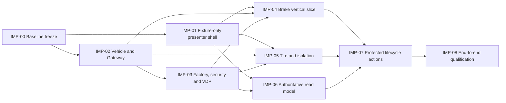

<!-- SPDX-FileCopyrightText: 2026 maninblack -->
<!-- SPDX-License-Identifier: MIT -->

# Demo Implementation Plan

- Status: D5 review candidate
- Version: 1.0
- Prepared: 2026-08-27
- Owner: Demo Solution Team with Platform, Gateway and Function Team owners
- Architecture input: [High-Level Architecture 1.5](../../architecture/high-level-architecture.md)
- Scenario input: [Demo Scenarios 2.0](../../demo/staged-post-sop-brake-health-demo-scenarios.md)
- Flow input: [Architecture Flows 2.0](../../architecture/demo-scenario-architecture-flows.md)
- System requirements input: [System Requirements 2.0](../../requirements/system-requirements-and-traceability.md)
- Component input: [Component Register 2.0](../../requirements/component-decomposition-and-interface-register.md)
- End-to-end input: [End-to-End Acceptance 0.8](../../requirements/components/end-to-end-acceptance.md)
- UI inputs: [Surface Register 0.14](../../demo/mockups/README.md), [Interaction Specification 2.5](../../demo/mockups/aosedge-demo-interaction-specification.md), [UI Traceability Register 1.1](../../demo/mockups/aosedge-demo-ui-traceability-register.md)
- Implementation, repository creation, build, signing, Cloud, Unit, VM or CARLA mutation authorized: no

## Purpose

This plan turns the accepted design into bounded, independently reviewable
implementation increments. It defines ordering, repository ownership,
dependencies, verification and the evidence required before a following
increment begins. It does not restate component requirements and does not
authorize implementation by itself.

The intended result is a demonstrable `M0 -> M1 -> G0 -> G1 -> G2 -> G3 ->
G4 -> T1 -> R0` product in which:

- the presenter uses the accepted composed workspace and linear release story;
- Test Vehicle qualification precedes identical Production Vehicle rollout;
- Platform, Brake and Tire teams progress independently on disjoint resources;
- independent OEM Release Authority authorizes exact deployments after the
  owning team's evidence-backed acceptance;
- AosEdge remains the authoritative lifecycle, identity, permission, log and
  resource state source; and
- all artifacts are prepared before a presentation: no compilation, image
  build, container build or source editing occurs during the demo.

## Authorization Model

Every implementation increment has its own state:

| State | Meaning |
| --- | --- |
| `PLANNED` | Scope is described, but no implementation is authorized. |
| `READY_FOR_REVIEW` | Inputs and exact change boundary are complete. |
| `AUTHORIZED` | The user has explicitly authorized this exact increment. |
| `IMPLEMENTED` | Code/artifacts exist and isolated checks pass. |
| `QUALIFIED` | Required integration/live evidence and human review pass. |
| `BLOCKED` | A named design, external-platform, repository or evidence gate is unresolved. |

Authorization is never inherited from a parent workstream or prior increment.
Before changing code, the increment review must freeze:

1. exact repositories and paths;
2. requirements, interfaces and UI rules in scope;
3. current code/artifact baseline and gaps;
4. tests to add or update;
5. whether repository creation, build, signing or an external mutation is
   included; and
6. explicit exclusions and rollback/recovery boundary.

Read-only inspection, fixture creation and local tests do not authorize a
Cloud, Unit, VM, CARLA, signing or publication operation. Any increment that
needs one of those operations receives a separate live-operation approval
after its static and isolated gates pass.

## Repository and Ownership Map

| Boundary | Primary implementation repository | Notes |
| --- | --- | --- |
| CARLA virtual physical vehicle | `CarlaSim` | Existing simulator; restricted Unreal source remains outside public solution repositories. |
| Scenario, controller, Gateway, VISS, advisory handler and Engineering Telematics Dashboard | `carla-ego-runtime` | Existing implementation is extended rather than replaced. |
| Factory assembly, OEM Component Runtime, removable `CMP-KAC`, KUKSA integration and VDP v1-v3 | `aos-vehicle-platform` | Factory/System artifacts and VDP FOTA retain separate lifecycle identities. |
| Brake in-vehicle service | `brake-health-service` | Existing scaffold is assessed and extended. |
| Brake backend and Function Dashboard | planned `brake-health-cloud` | Repository creation requires its own explicit authorization. |
| Tire in-vehicle service | proposed `tire-health-service` | Repository creation requires its own explicit authorization. |
| Tire backend and Function Dashboard | planned `tire-health-cloud` | Repository creation requires its own explicit authorization. |
| Presenter UI, native helper, VM/Unit orchestration and E2E qualification | `aosedge-sdv-demo` | Integration repository; must not absorb product source owned above. |
| AosCore and AosCloud | external released platform | No project-owned unit tests; qualify only the consumed contracts and observed integration behavior. |

`workspace/repositories.json` changes only after a proposed repository exists,
its license and initial boundary are reviewed, and the repository-addition
increment is explicitly authorized.

## Increment Dependency View

`IMP-01` and the read-only assessment portion of `IMP-02` may proceed in
parallel after separate authorization. The graph does not serialize
independent Platform, Brake and Tire engineering work; it only records the
shared evidence needed before integrated deployment and qualification.

## Implementation Increments

### `IMP-00` — Freeze and assess the implementation baseline

- State: `READY_FOR_REVIEW`; documentation-only freeze is part of this plan
  commit, product implementation is not.
- Repositories: all accepted workspace repositories, read-only.
- Outcome: record current revisions, existing behavior, reusable evidence,
  exact gaps and dirty-worktree ownership without changing product code.
- Required checks: documentation gate, repository-boundary guard,
  confidential-input guard, full integration-repository unit suite and clean
  link/identifier/Mermaid validation.
- Exit: one accepted baseline commit and no unclassified local artifact or
  confidential Honda input in Git.

### `IMP-01` — Fixture-only presenter application shell

- State: `PLANNED`; recommended first code increment after plan review.
- Repository: `aosedge-sdv-demo` only.
- Scope: implement the accepted full-screen composition and right-hand
  Dashboard structure from the standalone review mockup, including fixed
  vehicle surfaces, shared header, team perspectives, global lifecycle view,
  fixed team context, version-only scrolling, Details overlays and the native
  terminal boundary.
- Data boundary: deterministic local fixtures behind explicit adapters. No
  AosCloud credentials, helper execution, VM operations, CARLA control,
  signing, publication or lifecycle mutation.
- Required tests: state reducer/navigation, independent team scroll/focus,
  Test/Production representation mapping, action visibility, modal focus and
  redaction, broken-image/asset checks, responsive full-screen composition and
  all fixture-applicable `UI-AT-*` cases.
- Exit: the application reproduces the accepted mockup semantics and human
  presenter review passes; all protected actions remain visibly simulated and
  impossible to submit externally.

### `IMP-02` — Vehicle stimulus, control and Gateway evidence

- State: `PLANNED`.
- Repositories: `CarlaSim` only if the installed hardware model itself needs a
  change; otherwise `carla-ego-runtime` for scenario, controller, Gateway,
  VISS, advisory and Engineering Dashboard changes.
- Scope: assess the complete selected CARLA hardware manifest, expose all
  declared data points and actuators through the Gateway contract, implement
  missing typed Brake/Tire advisories and status, preserve the accepted
  scenario/autopilot/manual transition matrix, add the one vehicle-external-
  connectivity control, and provide fresh Safe Stop evidence to the OEM
  Component Runtime.
- Open empirical gate: D4-003 Tire stimulus and calibration is frozen only
  from controlled measurements; no invented thresholds enter product claims.
- Required tests: owner-package `UT-VEHICLE-SIM-*` and `UT-GATEWAY-*`, VSS/VISS
  contract fixtures, denied advisory/write vectors, mode-transition/reset
  cases, same-actor continuity and deterministic repeated stimulus evidence.
- Exit: isolated suites pass and live local CARLA/Gateway qualification proves
  the exact signals, controls and evidence without AosCloud deployment.

### `IMP-03` — Factory substrate, current-release security and VDP family

- State: `BLOCKED` until the latest `CR-FACTORY`, `CR-KAC`, `CR-VDP` and
  `CR-CROSS` deltas are formally accepted and their exact implementation
  parameters are frozen.
- Repository: `aos-vehicle-platform`.
- Scope: build the successor OEM Demo Factory Image with stock Aos IAM
  `enablePermissionsHandler: true`, no provisioned identity or pre-populated
  Service secret/permission state, unmodified KUKSA, separately removable
  `CMP-KAC`, per-Unit signer/verifier preparation and the provider-specific
  empty-slot OEM Component Runtime. Implement VDP v1-v3 and enforce Platform
  FOTA application only from fresh Gateway Safe Stop evidence.
- Required tests: package-owned unit tests for all owned runtime/helper/VDP
  logic; factory manifest and secret-negative scans; JWT scope, expiry,
  renewal, reboot and cross-Unit negatives; Safe Stop waiting/recovery;
  identical-artifact and A/B recovery qualification.
- External gate: image build, signing, FOTA upload and live two-Unit
  qualification each require explicit authorization after isolated checks.
- Exit: immutable artifacts and digests are frozen, tests pass, and qualified
  evidence truthfully distinguishes factory contents from post-SOP VDP FOTA.

### `IMP-04` — Brake Health vertical slice

- State: `BLOCKED` until the current `CR-BHS`/D4-017 contract delta and the
  planned `brake-health-cloud` repository creation are accepted.
- Repositories: `brake-health-service` and planned `brake-health-cloud`.
- Scope: implement the prepared Brake v1-v3 candidates, bounded v1
  pre/active/post window, v2 synthetic local assessment and derived-only
  reporting, v3 typed maintenance advisory, bounded offline queue, backend,
  Vehicle Data/Release Candidates/Service Logs views and fixed `brake-sp1`
  publication-client boundary.
- Required tests: all `UT-BHS-*` and `UT-BRAKE-CLOUD-*`, schema and
  idempotency fixtures, queue/restart/overflow cases, KUKSA least-privilege and
  advisory negatives, ARM64 container health and Dashboard/API tests.
- Exit: all three artifacts are prebuilt and immutable, local backend/UI work
  without AosCloud, and integration passes against qualified VDP contracts.

### `IMP-05` — Tire Health and multi-tenant isolation

- State: `BLOCKED` until current `CR-TIRE` contracts, D4-003 empirical values
  and both proposed Tire repository creations are accepted.
- Repositories: proposed `tire-health-service` and `tire-health-cloud`.
- Scope: implement one mature Tire v1.0 candidate requiring VDP v3, bounded
  persistent condition state and reporting, typed inspection advisory,
  backend/Dashboard, fixed `tire-sp2` publication-client boundary and the
  prepared bounded CPU-load mode inside the actual Tire Service instance.
- Required tests: all `UT-TIRE-*` and `UT-TIRE-CLOUD-*`, state migration,
  queue/offline/restart/overflow, contract/auth negatives, ARM64 container and
  Dashboard/API tests. Integration proves that AosCore caps Tire at its quota
  while Brake and the shared platform remain healthy; demo code never acts as
  a resource manager.
- Exit: the one Tire artifact is prebuilt and immutable and the isolation
  claim passes controlled qualification.

### `IMP-06` — Authoritative Dashboard read model

- State: `PLANNED`; may begin only after `IMP-01` acceptance and exact API
  response fixtures are reviewed.
- Repository: `aosedge-sdv-demo`.
- Scope: replace fixture projections incrementally with read-only adapters for
  authoritative AosCloud lifecycle, Unit/Node/Unit Set, batch/campaign,
  permissions and native-log state plus Brake/Tire backend data. Preserve
  explicit source, freshness, unavailable/stale/error and redaction states.
- Required tests: response-shape fixtures, role/permission routing, stale and
  partial reads, exact recipient derivation, wrong-Unit and Unit Set mismatch,
  log scope, no second state store and browser secret-negative scans.
- Exit: every displayed authoritative fact has one traceable source; no read
  adapter can perform a mutation and no fixture fact is presented as live.

### `IMP-07` — Protected publication and vehicle lifecycle actions

- State: `BLOCKED` until all prior artifact-producing increments are
  implemented, exact current AosCloud APIs are qualified and this live
  mutation increment receives separate authorization.
- Repository: `aosedge-sdv-demo`.
- Scope: implement the session-scoped non-root native helper, fixed
  `platform-oem`, `brake-sp1` and `tire-sp2` publication surfaces, M0/M1,
  provisioning/Unit Set reconciliation, Test-first deployment, independent
  owner acceptance, OEM Release Authority authorization, exact recipient
  equality, Test-to-Production source handover, connectivity fault/recovery,
  native log requests and dependent-first R0.
- Concurrency rule: operations with disjoint candidate/resource-conflict keys
  may progress independently. Only overlapping resources block; provisioning,
  identity retirement, live-source handover/reset and R0 are run-exclusive.
- Required tests: helper protocol and credential-custody negatives, operation
  journal/reconciliation, response-loss/no-blind-retry, target equality,
  authority separation, offline/reconnect and R0 fixtures before any live
  call.
- External gate: signing, publication, Cloud mutation, VM operation,
  provisioning, deployment, CARLA control and retirement are individually
  confirmed by the operator and followed by authoritative re-read.
- Exit: every protected action is bounded, recoverable and truthfully rendered
  from current external state.

### `IMP-08` — Integrated qualification and audience acceptance

- State: `BLOCKED` until `IMP-01` through `IMP-07` satisfy their exits.
- Repository: `aosedge-sdv-demo` for orchestration and evidence composition;
  owning repositories retain their product evidence.
- Scope: implement D4-025 atomic stages and execute the complete accepted
  sequence in the four D4-026 modes. Produce one sanitized current Demo
  Baseline Qualification Dossier only for a predesignated qualification run;
  ordinary audience runs retain no project-owned history after R0.
- Required proof: all `AT-E2E-*`, controlled negative/destructive cases,
  current authoritative preflight, human presenter rehearsal and visual/
  semantic human veto over machine success.
- Exit: machine qualification and human acceptance both pass for the exact
  baseline, R0 completes, no forbidden data is retained and the demo is ready
  to show. This proves the bounded demo solution, not production-fleet or
  safety certification.

## First Increment Recommendation

After this plan is reviewed, authorize only `IMP-01` first. It is the smallest
useful implementation slice, validates the accepted presenter interaction
model in real code and does not depend on unresolved platform builds,
repository creation, credentials or external mutations. In parallel, perform
the read-only `IMP-02` current-code assessment so its exact code delta can be
reviewed next; assessment does not authorize edits.

Before `IMP-01` authorization, its review record shall name the selected UI
technology, application entry point, exact files, local run command, test
command, asset strategy and the boundary between fixture adapters and future
live adapters. Those choices are implementation details and must not alter the
accepted interaction contract.

## Change Control During Implementation

Implementation discoveries are classified before documentation changes:

| Class | Handling |
| --- | --- |
| No requirement or observable-contract change | Keep the change and tests in the owning repository; update only the increment record if the implementation boundary changed. |
| Level A presentation clarification | Update the UI register/specification/traceability and mockup together before continuing the affected UI work. |
| Level B behavior or contract refinement inside accepted architecture | Pause the affected increment and cascade scenario/flow/requirements/contracts/tests through stable IDs. |
| Level C component, interface, authority, lifecycle, repository or data-direction change | Stop the affected implementation and update Draw.io/HLA first, then cascade all downstream documents. |

Stable IDs are never renumbered for convenience. A superseded requirement or
contract remains resolvable with an explicit replacement. Unrelated teams and
increments may continue when their dependencies and resource keys are
disjoint.

## Plan Acceptance Gate

Version 1.0 is accepted for implementation sequencing only when reviewers
confirm that:

1. every increment has one bounded outcome and exact repository ownership;
2. dependencies do not serialize independent OEM teams unnecessarily;
3. current, target and blocked states remain truthful;
4. owned executable behavior has unit-test obligations while external
   AosCore/AosCloud are verified only at consumed contract/integration levels;
5. demo-time work uses only prebuilt frozen artifacts;
6. no planned Dashboard/helper owns AosCloud lifecycle state or OEM approval;
7. every external mutation remains separately authorized and reconciled; and
8. `IMP-01` is the only recommended first code authorization.

Acceptance of this plan will not itself change any increment from `PLANNED` or
`BLOCKED` to `AUTHORIZED`.
