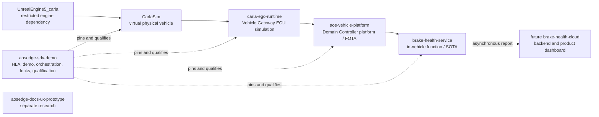

<!-- SPDX-FileCopyrightText: 2026 maninblack -->
<!-- SPDX-License-Identifier: MIT -->

# Repository Inventory and Migration Plan

- Status: Approved; execution in progress
- Inventory date: 2026-08-16
- Scope: local workspace, Git repositories, generated artifacts, and launchers
- File migration, reviewed post-acceptance deletion, branch consolidation, and guarded VM restart authorized: yes
- Cloud provisioning, deprovisioning, signing, upload, assignment, or rollback authorized: no
- HLA baseline: `aosedge-sdv-demo` commit `ace271a`

## Purpose

Make the demonstration workspace understandable to another engineer without
mixing simulator, vehicle-gateway, vehicle-platform, functional-service, and
solution-level responsibilities. Preserve the working CARLA launchers,
provisioned AosVM identities, accepted R6.1 evidence, and incremental Yocto
build state while removing obsolete experiments and reproducible output.

This document was the review gate before migration. The six review decisions
below were jointly accepted on 2026-08-16. Execution remains split into the
guarded phases below; unrelated Cloud mutation is not authorized.

## Execution Status

| Phase | Status | Evidence |
| --- | --- | --- |
| 0 — approve the map | Complete | Approved plan checkpoint and six accepted review decisions |
| 1 — repair AosVM references | Complete | [VM repair record](../qualification/repository-rename-vm-repair.md) |
| 2 — add the workspace contract | Complete | `workspace/repositories.json`, `scripts/workspace-doctor`, and automated tests |
| 3 — functional-service rename | Complete | GitHub/local history preserved; Brake Health package identity and solution lock updated |
| 4 — branch consolidation | Complete | Both active baselines fast-forwarded to `main`; protective tags created before cleanup |
| 5 — pre-cleanup acceptance | Complete | CARLA, AosVM, builder, repository, and license gates passed; Main `.1` operational state explicitly accepted |
| 6–7 — cleanup and regression | Pending | Delete only after Phase 5; repeat smoke checks afterward |

## Action Vocabulary

| Action | Meaning |
| --- | --- |
| Keep | Retain in the current repository and location. |
| Move or rename | Preserve content and Git history, but place it under the proposed owner or name after review. |
| Archive | Retain only immutable, sanitized evidence or a Git tag; remove it from the active working set later. |
| Delete | Remove reproducible, generated, secret-bearing, or obsolete local output after all dependency guards pass. |
| Repair first | Keep the state, but correct a broken absolute reference before any restart or cleanup. |

Tracked upstream source trees are classified as a unit. Generated and local
top-level trees are classified explicitly. This avoids pretending that every
file in the 104 GiB CARLA content tree or 116 GiB Unreal Engine tree is an
independent migration decision.

## Git Inventory

The configured local upstream refs report zero ahead/behind differences. One
Unreal Engine file is untracked; every other Git working tree is clean before
this draft is added.

| Repository | Current branch | Upstream | Ahead / behind | Working tree | Approximate disk use |
| --- | --- | --- | --- | --- | ---: |
| `CarlaSim` | `macos-apple-silicon` | `personal/macos-apple-silicon` | 0 / 0 | clean | 111 GiB |
| `UnrealEngine5_carla` | `macos-xcode26-compat` | `personal/macos-xcode26-compat` | 0 / 0 | `Engine/Config/DefaultEngine.ini` untracked | 140 GiB |
| `carla-ego-runtime` | `main` | `origin/main` | 0 / 0 | clean | 76 MiB |
| `aos-vehicle-platform` | `main` | `origin/main` | 0 / 0 | clean | 781 MiB |
| `brake-health-service` | `main` | `origin/main` | 0 / 0 | clean | 420 KiB |
| `aosedge-sdv-demo` | `main` | `origin/main` | 0 / 0 | clean before this draft | 33 GiB |
| `aosedge-docs-ux-prototype` | `main` | `origin/main` | 0 / 0 | clean | 352 KiB |

### Branch disposition

| Repository | Branches | Proposed disposition |
| --- | --- | --- |
| `CarlaSim` | `ue5-dev`, `macos-apple-silicon` | Keep both. The macOS branch contains six Apple Silicon commits not in upstream. |
| `UnrealEngine5_carla` | `ue5-dev-carla`, `macos-xcode26-compat` | Keep both. The compatibility branch contains two required Apple toolchain commits. |
| `aos-vehicle-platform` | `main` | The 45-commit feature baseline was fast-forwarded to `main`, tagged, and removed after remote verification. |
| `aosedge-sdv-demo` | `main` | The 65-commit baseline was fast-forwarded to `main`; all three ancestor feature branches were removed after remote verification. |
| Other custom repositories | `main` | Keep. |

CARLA and Unreal compatibility branches remain long-lived. Historical platform
and demo feature branches were deleted only after `main` and protective tags
contained their complete history.

## External Runtime-State Inventory

Not all important state lives below a Git checkout. The following host-local
state is part of the working system and is included in migration guards.

| State | Current condition | Action |
| --- | --- | --- |
| Main AosVM QEMU process | running from the pre-rename command line | Keep running until an approved controlled shutdown |
| Validation AosVM QEMU process | running from the pre-rename command line | Keep running until an approved controlled shutdown |
| R6.1 Yocto builder QEMU process | running; 220 GiB virtual / 61.6 GiB allocated overlay | Keep; this is the incremental build environment |
| Yocto builder Ubuntu base image | 670 MiB | Keep; backing file for the builder overlay |
| Main and validation pre/post-provision backups | four standalone qcow2 files, about 2.8 GiB total | Keep privately; they contain recoverable Unit state |
| CARLA Desktop launcher state | about 65 MiB plus launch commands | Keep until regenerated launchers pass a cold start |

The Yocto builder lives below the host's Application Support directory, not in
`.local/r6-1-qualification`. Its overlay, base image, seed, SSH state, and
cache are a protected unit. They are never part of repository housekeeping.

## Current Dependency Guards

### CARLA desktop launchers

The signed Desktop applications use generated launch commands under:

```text
~/Library/Application Support/CARLA Ego Runtime/launchers/
```

They currently contain machine-local absolute paths to:

```text
$WORKSPACE_ROOT/CarlaSim
$WORKSPACE_ROOT/UnrealEngine5_carla
$WORKSPACE_ROOT/carla-ego-runtime
$WORKSPACE_ROOT/CarlaSim/Build-ego-runtime-m4
$WORKSPACE_ROOT/CarlaSim/Build-macos-client-v3
$WORKSPACE_ROOT/CarlaSim/.venv-m5
$WORKSPACE_ROOT/CarlaSim/LocalRuntime/m5/tls
```

`$WORKSPACE_ROOT` is notation for the host-local checkout parent. The generated
launcher files contain its expanded absolute value; this document deliberately
does not publish the personal host path.

Therefore CARLA, Unreal Engine, `carla-ego-runtime`, the accepted runtime build,
the LibCarla v3 build, Python environment, and local TLS material stay in
place. A future path change must regenerate both Desktop applications and run
a cold-start manual-drive acceptance test in the same commit boundary.

### AosVM repository-rename defect

The local repository was renamed from `carla-aosedge-integration` to
`aosedge-sdv-demo`. Nine qcow2 overlays and two provisioning lock files still
embed the old absolute path. Read-only process inspection confirms that the
Main VM, validation VM, and Yocto builder are running. Main and validation
continue to work because QEMU opened their files before the directory rename.

The new lifecycle scripts reject the old process command lines as not owned,
and `qemu-img` cannot resolve either active overlay's backing file through the
old path. The existing processes must not be killed or casually restarted.
They require a controlled guest/QMP shutdown followed by an offline path
repair and identity-preserving restart.

The two identity-bearing overlays themselves remain present and must not be
reset, copied to another Unit, or deleted:

```text
.local/aosvm-main-overlay.qcow2
.local/r6-1-validation/aosvm-r6-1-validation-overlay.qcow2
```

The repair must be an offline metadata-only rebase to the same backing bytes
under the new path, preceded by an APFS clone backup and followed by
`qemu-img check`, backing-chain verification, boot, identity, persistence,
network, and Cloud-online checks. Provisioning lock paths must be updated in
the same guarded change. Stale qualification overlays with missing backing
images are deleted only after the accepted evidence is preserved. The builder
disk does not require a backing-path rebase, but its DNS bridge also uses the
old script path; it gets a separate controlled restart only when no build is
active.

## Classification by Repository

### `CarlaSim` — virtual physical vehicle

| Path or group | Action | Reason or guard |
| --- | --- | --- |
| All tracked CARLA source, Unreal project files, maps, and content | Keep | Upstream fork plus accepted Apple Silicon port. |
| `Build-macos-client-v3/` | Keep | Accepted installed LibCarla used by `Build-ego-runtime-m4`. |
| `Build-ego-runtime-m4/` | Keep | Executables used by both Desktop launchers. |
| `.venv-m5/` | Keep locally | Python runtime used by both Desktop launchers. Never commit. |
| `LocalRuntime/m5/tls/` | Keep locally | Active VISS TLS material. Never commit or archive publicly. |
| Generated `Unreal/CarlaUnreal/{Binaries,Build,Content,DerivedDataCache,Intermediate,Saved}` | Keep locally | Required by the currently working editor and city scene; reproducible only at high cost. |
| `Build-macos-client/`, `Build-macos-client-v2/` | Delete after smoke guard | Superseded LibCarla builds; launchers and accepted CMake cache use v3. |
| Other `Build-ego-runtime-*` directories | Delete after smoke guard | Superseded milestone, stub, prototype, and test builds. |
| `LocalRuntime/m6_1/` and the old `LocalRuntime/m6_2/` copy | Archive one sanitized accepted manifest, then delete | Replaced by generated state under Application Support. |
| `M5-*` and `M6-*` run directories | Archive selected sanitized acceptance manifests, then delete raw runs | Historical local evidence and logs, not source or runtime dependencies. |
| `.DS_Store` and other generated metadata | Delete | Reproducible host noise. |

The ignored `carla-ego-runtime` build in this repository contains personal
absolute paths by design. That is acceptable only because it remains ignored
and machine-local.

### `UnrealEngine5_carla` — restricted engine dependency

| Path or group | Action | Reason or guard |
| --- | --- | --- |
| All tracked Unreal Engine source | Keep in place | Restricted Epic/CarlaUnreal dependency; never move into a public repository. |
| Generated `Engine/Binaries/Mac`, intermediates, dependencies, and derived data | Keep locally | Required by the working native editor; rebuilding is expensive. |
| `.uedependencies` and downloaded feature packs | Keep as replaceable cache | Useful to avoid a large redownload; never commit. |
| `Engine/Config/DefaultEngine.ini` | Delete, then add a targeted ignore rule | Generated Android File Server configuration contains a local security token and has no place in Git or an archive. |
| `.DS_Store`, generated Xcode workspaces, and unused editor metadata | Delete when the editor is closed | Reproducible host output. |

No Unreal Engine file is moved into `aosedge-sdv-demo` or another public
repository.

### `carla-ego-runtime` — simulated Vehicle Gateway ECU

| Path or group | Action | Reason or guard |
| --- | --- | --- |
| All tracked source, VSS overlay, configs, tests, tools, and component documentation | Keep | Correct owner for ego lifecycle, control, normalization, VSS, and VISS. |
| `build/` | Delete after repository tests | Small generic CMake output. |
| `build-m62/` | Delete after launcher check | Generated output not referenced by current Desktop launchers. |
| `.DS_Store` | Delete | Host noise. |

### `aos-vehicle-platform` — Domain Controller platform/FOTA integration

| Path or group | Action | Reason or guard |
| --- | --- | --- |
| `contracts/`, `providers/`, `meta-aos-vehicle-platform/`, `packaging/`, `authorization/`, `config/`, `tests/`, and `tools/` | Keep | Correct OEM Vehicle Platform Team ownership. |
| Accepted provider `0.2.0` bytes and candidate metadata from revision `e972d2b` | Archive one verified copy | Immutable accepted evidence for the current baseline. |
| Duplicate A/B deterministic build copies | Delete after digest comparison | Byte-identical pairs already found. |
| `build/r6-1-provider-candidate-a` through `-z` and superseded `accepted-*` directories | Delete after accepted-copy archive | Reproducible development iterations; about 0.7 GiB in total. |
| `build/r6-1-wheelhouse/` | Keep as replaceable cache until the next provider build | Saves dependency download time. |
| Empty local `patches/` and `qualification/` directories | Delete or leave absent | Git does not track them and current source no longer uses them. |
| `.DS_Store` | Delete | Host noise. |

### `brake-health-service` — Brake Health SOTA scaffold

| Path or group | Action | Reason or guard |
| --- | --- | --- |
| All tracked source, Aos packaging, tests, and governance | Keep under the renamed repository | Git and local rename completed with history preserved; package codename and executable now match Brake Health ownership. |
| `.DS_Store` | Delete | Host noise. |

The repository and checkout were renamed from `vehicle-telemetry-service` to
`brake-health-service` before adding product behavior. It remains the
in-vehicle SOTA service owned by
the Brake Health Function Team. A future `brake-health-cloud` repository may
own the function backend and product dashboard when their implementation
starts; they do not belong in the in-vehicle service repository or in the
vehicle-platform repository.

The rename was approved and completed in Phase 3.

### `aosedge-sdv-demo` — solution, orchestration, and documentation home

| Path or group | Action | Reason or guard |
| --- | --- | --- |
| All tracked architecture, demo, planning, operations, qualification, locks, manifests, scripts, and tests | Keep | Correct system-level owner and reproducibility boundary. |
| `.local/aosvm-main-overlay.qcow2` and Main provisioning lock | Keep and repair first | Unique demonstration Unit identity and persistent state. |
| `.local/r6-1-validation/` identity overlay and lock | Keep and repair first | Unique validation Unit identity and persistent state. |
| `.cache/aosvm/v6.1.0/` | Keep | Official base image backing both identity overlays. Replaceable, but currently required. |
| `.local/r6-1-qualification/store-workdirs.qcow2` | Delete with the obsolete `store` fixture after evidence is retained | Disposable 2 GiB qualification data disk; it is not the Yocto builder. |
| `.local/r6-1-qualification/bootstrap.qcow2` | Keep and repair first | Disposable qualification overlay for accepted `.11`. |
| Other qualification qcow2 overlays | Archive required metadata, then delete | Stale experiments; several already reference missing backing files. |
| `artifacts/r6-1/bootstrap-6.1.1-maninblack.11/` | Keep locally | Current frozen unsigned rootfs candidate and exact metadata. Never commit. |
| `.2` signed batch and compact candidate metadata | Archive | Historical deployed validation update evidence. |
| `.2`, `.10`, and `upstream` raw 6.5–6.8 GiB images | Delete after all overlay references are removed and digests retained | Superseded raw outputs; not the incremental Yocto cache. |
| Old `fota-r6-1-5*`, side-load binaries, and superseded qualification binaries | Archive compact metadata/digests, then delete payloads | Old implementation cycles, not selected by the current baseline. |
| `runs/` | Archive only selected sanitized JSON evidence, then delete raw logs | Contains historical logs and old absolute paths. |
| `.run/` | Delete while all VMs are stopped | Stale PID, socket, and supervisor state; regenerated on start. |

The current 27 GiB `artifacts/r6-1` tree is dominated by four raw images. The
accepted `.11` image is retained. Removing only superseded raw images after
dependency repair should recover roughly 20 GiB without sacrificing
incremental Yocto build state.

The real incremental builder below Application Support occupies about 62 GiB
and is explicitly retained. The four standalone pre/post-provision backups
occupy about 2.8 GiB and are also retained as private recovery assets.

### `aosedge-docs-ux-prototype` — separate documentation research

| Path or group | Action | Reason or guard |
| --- | --- | --- |
| Entire tracked repository | Keep separate for the current review cycle | It is not a demo runtime component and must not be mixed into the solution repository. |
| Repository after findings are accepted upstream | Archive or retain as a labelled experiment | Separate future decision. |

## Duplicate and Absolute-Path Findings

### Exact duplicates

- No custom source-code file is byte-identical across the five custom
  repositories.
- The only tracked cross-repository duplicates are standard MIT and
  Apache-2.0 license texts; these are intentional.
- Provider output contains many byte-identical A/B build pairs. One verified
  accepted copy is sufficient after reproducibility evidence is retained.
- Three older FOTA directories use byte-identical `config.yaml` files but
  contain different boot and rootfs bytes. They are iterations, not safe
  byte-level duplicates; retention is based on accepted-baseline relevance,
  not filename similarity.

### Absolute paths

- No pre-draft tracked repository file contains the personal macOS home path
  used by this workspace.
- `/home/yocto` paths in the pinned R6.1 manifests and builder scripts are
  intentional guest-build contracts, not host leakage.
- CARLA Desktop launchers and generated CMake caches intentionally contain
  local absolute paths and remain outside Git.
- The old repository name remains intentionally in ADR 0007 and the
  documentation map as rename history.
- The old repository path remains unintentionally in nine qcow2 headers, two
  provisioning locks, and stale logs. The two active identity overlays and
  locks require repair; stale logs and obsolete overlays are cleanup items.

## Proposed Target Repository Map

The physical directories remain siblings under the current `OpenAI` workspace.
CARLA and Unreal Engine are not moved.



`aosedge-sdv-demo` should add a machine-readable sibling-repository manifest
and a read-only workspace doctor. That gives a new engineer one starting point
without vendoring repositories, creating Git submodules, or forcing local
directory moves.

## Proposed Migration Sequence

Every phase is separately reviewable and reversible. A failed guard stops the
migration; later phases do not run.

### Phase 0 — Approve this map

Resolve the review decisions below. Do not change paths, branches, overlays,
or artifacts before approval.

### Phase 1 — Repair AosVM references caused by the completed repository rename

1. Capture the running Main, validation, and builder process/QMP state without
   changing it.
2. Use the existing validation QMP and guest channel for an orderly shutdown;
   do not rely on the lifecycle ownership check that currently rejects the old
   command line.
3. Create an APFS clone backup of the stopped validation overlay and lock.
4. Verify that old and new backing files are the same immutable bytes.
5. Offline-rebase only the validation backing filename to
   `aosedge-sdv-demo`, then update its provisioning lock path.
6. Run `qemu-img check`, inspect the complete chain, restart validation, and
   verify disk persistence, Unit identity, networking, and Cloud-online state.
7. Repeat the controlled stop, clone, rebase, lock update, checks, and restart
   for Main only after validation passes.
8. When no Yocto build is active, stop and restart the builder through its
   QMP/guest channel so the DNS bridge uses the new script path. Verify its
   existing 220 GiB overlay, Yocto downloads, sstate cache, workdirs, and SSH
   identity; do not recreate the builder.

This phase gets its own corrective commit for scripts or documentation. VM
images, locks, and local paths remain ignored and are never committed.

### Phase 2 — Add the workspace contract

1. Add a sibling-repository manifest to `aosedge-sdv-demo` with repository URL,
   expected local directory, role, visibility, and accepted revision.
2. Add a read-only doctor that reports missing repositories, dirty trees,
   unexpected branches, old paths, and launcher dependencies.
3. Keep existing component locks authoritative for accepted release inputs.
4. Test the doctor from the current workspace without moving anything.

### Phase 3 — Clarify the functional-service repository

1. Rename `vehicle-telemetry-service` to `brake-health-service` on GitHub and
   locally while preserving history.
2. Update only solution locks, repository-boundary documentation, package
   identity, and links required by that decision.
3. Keep the service independent of CARLA, VISS, platform source, VM scripts,
   and the future cloud backend.
4. Run service and repository-boundary gates before proceeding.

### Phase 4 — Consolidate accepted branches

1. Merge the accepted `aos-vehicle-platform` feature baseline to `main` and
   tag it.
2. Merge the accepted `aosedge-sdv-demo` feature baseline to `main` and tag the
   HLA/checkpoint baseline.
3. Verify every component lock against the resulting commits.
4. Remove stacked historical feature branches only after remote tags and main
   contain their full history.
5. Keep the CARLA and Unreal compatibility branches unchanged.

### Phase 5 — Pre-cleanup end-to-end acceptance

1. Cold-start `CARLA Manual Drive.app` and verify the city, vehicle, telemetry
   dashboard, manual control, autopilot, and safe stop.
2. Start both AosVM roles one at a time and verify their original Unit
   identities and Cloud state.
3. Run repository quality gates and the cross-repository workspace doctor.
4. Record the accepted pre-cleanup baseline.

### Phase 6 — Housekeeping after acceptance

1. Preserve compact accepted digests, manifests, and sanitized evidence.
2. Repair or remove every overlay dependency before removing a backing image.
3. Delete obsolete provider builds, old raw rootfs images, stale runtime
   state, old CARLA milestone builds, and raw run logs in small reviewed sets.
4. Recheck disk use and all Git working trees after each set.
5. Never delete the two provisioned identity overlays, their private recovery
   backups, `.11`, the official AosVM base image, the Application Support Yocto
   builder, active CARLA builds, or Unreal editor output.

Expected safe recovery is approximately 23–25 GiB, mostly from superseded raw
VM images and old native builds. The exact total is measured after each set.

### Phase 7 — Post-cleanup regression acceptance

1. Repeat a short CARLA manual-drive and telemetry smoke test.
2. Recheck both AosVM identities and Cloud state.
3. Re-run repository and workspace gates.
4. Record the new clean baseline and only then begin the next design iteration.

## Proposed Commit Boundaries

1. `fix: repair AosVM paths after repository rename`
2. `chore: define reproducible SDV demo workspace`
3. `refactor: rename telemetry scaffold to brake health service` — only if approved
4. `chore: consolidate accepted platform baseline`
5. `chore: consolidate accepted demo baseline`
6. `chore: harden local artifact ignore rules`

Ignored artifact deletion itself does not need a Git commit. Any new retention
rule, doctor, or ignore guard does.

## Review Decisions

1. Keep `CarlaSim`, `UnrealEngine5_carla`, and `carla-ego-runtime` at their
   current local paths? Recommendation: yes.
2. Keep `aosedge-sdv-demo` as the single home for HLA, demo material,
   orchestration, locks, operations, and end-to-end qualification?
   Recommendation: yes.
3. Rename `vehicle-telemetry-service` to `brake-health-service` before
   implementation? Accepted and completed.
4. Reserve a future separate `brake-health-cloud` repository for backend and
   product dashboard? Recommendation: yes, create it only when implementation
   begins.
5. Merge the two active R6.1 feature baselines to `main` after the path repair
   and repository-map acceptance? Recommendation: yes.
6. Use compact immutable evidence plus Git history instead of retaining every
   raw local build iteration? Recommendation: yes.

All six decisions were jointly accepted. Cleanup remains gated by the
pre-cleanup end-to-end acceptance, followed by a post-cleanup smoke regression.
