<!-- SPDX-FileCopyrightText: 2026 maninblack -->
<!-- SPDX-License-Identifier: MIT -->

# R6.1-3 Atomic Vehicle-Data Provider Lifecycle

- Status: Complete; local and disposable ARM64 qualification passed
- Date: 2026-08-14
- Baseline: AosVM 6.1.0, one `aos-vm-main` Node
- Component type:
  `aos-vm-1.0.0-main-qemuarm64-vehicle-data-provider`
- Persistent root:
  `/var/aos/workdirs/sm/runtimes/systemd-slot-component`
- Qualification:
  [R6.1-3 atomic lifecycle record](r6-1-atomic-component-lifecycle-qualification.md)

## Scope and Safety Boundary

R6.1-3 implements and locally qualifies the bootstrap-owned lifecycle for an
independently delivered vehicle-data-provider component. It may rebuild and
boot disposable, non-provisioned ARM64 images and may use unsigned synthetic
qualification payloads.

It does not authorize:

- uploading or publishing a component in AosCloud;
- changing a Cloud catalog, assignment, Unit Model, Node Type, or Unit;
- modifying the active provisioned AosVM disk;
- deprovisioning or reprovisioning any Unit;
- using an OEM signing key, Unit identity, user certificate, or Cloud token;
- calling a locally qualified payload a signed production FOTA release.

The existing Yocto builder disk, downloads, shared state, and build tree remain
persistent. R6.1-3 must use incremental builds and must not delete or recreate
the builder.

## Aos Runtime Contract

The pinned Service Manager passes an `InstanceInfo` containing the component
version, manifest digest, identity, and runtime ID to `RuntimeItf::StartInstance`.
The runtime resolves that digest through the local Image Manager, loads the OCI
manifest, and obtains the already verified and unpacked layer path through
`ItemInfoProviderItf`.

R6.1-3 uses that existing contract rather than adding a second downloader or
Cloud protocol. Component activation is completed synchronously by
`StartInstance`; ordinary provider operations never call `RebootRequired` and
`Reboot()` remains unsupported.

Service Manager reports:

- `Activating` before prepare or switching begins;
- `Active` only after the candidate passes the bounded local health gate;
- `Failed` for the candidate when prepare, start, or health fails;
- the restored previous release as `Active` after a successful rollback;
- `Inactive` after an explicit stop.

## Persistent Layout

```text
$ROOT/
├── slots/
│   ├── a/                         # immutable prepared payload
│   │   ├── component.json
│   │   ├── bin/vehicle-data-provider
│   │   ├── config/provider.json
│   │   └── .aos-instance.json     # runtime-owned release record
│   └── b/                         # immutable prepared payload
├── active -> slots/a|slots/b      # the only execution selector
├── state/
│   ├── installed.json             # committed active release
│   ├── transaction.json           # durable in-progress transition
│   ├── last-failure.json          # bounded sanitized evidence
│   └── staging/                    # candidate before slot rename
└── credentials/                   # provisioned separately; never copied
```

Only the two fixed slot names are valid. The stable launcher follows only the
relative targets `slots/a` and `slots/b`. It never accepts an absolute target,
an additional slot name, or a payload-selected executable path.

The active symlink is replaced with one same-filesystem atomic rename. State
files are written to a non-symbolic temporary file, flushed, renamed, and
followed by a directory flush before the next external side effect.

## Declarative Payload Contract

R6.1-3 accepts exactly one uncompressed restricted USTAR OCI layer with the
bootstrap-owned media type
`application/vnd.aos.vehicle-data-provider.layer.v1.tar`. Generic Aos service
layer behavior is unchanged.

Image Manager owns transport digest validation. Before it invokes the released
BusyBox `tar`, a provider-specific preflight parser validates every 512-byte
header, checksum, path, mode, type, duplicate, declared size, payload total,
entry count, and two-block end marker. It rejects compressed, PAX, GNU,
symbolic-link, hard-link, device, FIFO, socket, sparse, escaping, or otherwise
unsupported archives before the extraction destination is created. The
component runtime then treats the extracted directory as untrusted input and
recursively validates it again before copying anything to its persistent
store.

The layer root contains this fixed metadata shape:

```json
{
  "schemaVersion": 1,
  "component": "vehicle-data-provider",
  "version": "0.2.0",
  "architecture": "arm64",
  "os": "linux",
  "runtimeInterface": 1,
  "entrypoint": "bin/vehicle-data-provider",
  "configuration": "config/provider.json"
}
```

The runtime requires the metadata version to equal `InstanceInfo.mVersion`.
Versions use canonical `MAJOR.MINOR.PATCH` syntax. A normal update may keep or
increase the version; a downgrade is rejected unless a later reviewed policy
explicitly permits it.

The entry point and configuration paths are fixed by the bootstrap profile.
Payload metadata cannot select a systemd unit, command, hook, credential,
health program, SELinux label, KUKSA endpoint, or arbitrary host path.

The validator rejects:

- a missing, malformed, multi-layer, empty, or unsupported OCI manifest;
- a malformed or incompatible `component.json`;
- an architecture, OS, runtime-interface, version, or component mismatch;
- absolute, non-normalized, escaping, control-character, or oversized paths;
- symbolic links, non-regular files, devices, sockets, FIFOs, setuid/setgid
  bits, unexpected executable files, or group/world-writable content;
- a missing or non-executable fixed provider entry point;
- payloads over the configured size limit or with insufficient reserved free
  storage.

No archive-provided installer or lifecycle hook is executed. The old R6
side-load `install-provider` script is therefore not part of this component
contract.

## Lifecycle State Machine

```mermaid
stateDiagram-v2
    [*] --> Installed
    Installed --> Preparing: desired digest differs
    Preparing --> Prepared: validation and offline self-test pass
    Preparing --> Error: candidate rejected
    Prepared --> Starting: mark VSS paths unavailable; stop previous
    Starting --> Pending: atomic active switch; start candidate
    Pending --> Applying: local health passes
    Pending --> Reverting: start or health fails
    Applying --> Installed: commit installed.json; clear transaction
    Reverting --> Installed: restore previous slot and health
    Reverting --> Error: no healthy previous slot
    Error --> Installed: previous release remained/restored
    Error --> [*]: no release was previously installed
```



The durable transaction phases are `prepared`, `unavailable`,
`previous-stopped`, `switched`, and `candidate-started`. Each phase records the
candidate, target slot, and optional previous release before the next side
effect can occur.

The switching order is:

1. validate and copy the candidate to `state/staging`;
2. run the fixed bootstrap-owned offline self-test;
3. atomically rename staging onto the inactive slot;
4. persist the `prepared` transaction;
5. ask the fixed profile adapter to mark all provider-owned VSS paths
   unavailable;
6. stop the previous provider and persist that boundary;
7. atomically switch `active` to the candidate slot;
8. start the fixed systemd unit and run the bounded local health adapter;
9. atomically commit `installed.json`;
10. remove the transaction and retain the previous slot for rollback.

Only one operation runs at a time under the runtime mutex. A desired release
that already matches the committed digest is idempotent and returns `Active`.
A second different update is rejected while a transaction exists.

## Recovery and Rollback

At runtime startup, `transaction.json` is processed before a new request is
accepted:

| Durable observation | Recovery action |
| --- | --- |
| No transaction, valid installed state and active link | Verify/start the committed release and report it active. |
| Transaction exists, candidate is not committed | Stop any candidate, select the recorded previous slot, start and health-check it, then report candidate failed and previous active. |
| Candidate is committed, active link selects it, health passes | Treat the commit as complete and remove the stale transaction. |
| First-install transaction has no previous slot | Stop the unit, remove `active`, keep VSS paths unavailable, and report the candidate failed. |
| Previous metadata, slot, or health is invalid | Keep the unit stopped, remove `active`, retain sanitized failure evidence, and return a startup error. |
| Stale staging or temporary state without a transaction | Remove only the runtime-owned stale item; never touch either valid slot. |

Recovery is deliberately conservative: an uncertain candidate is never
promoted. No VM checkpoint or manual file repair is part of the accepted
recovery path.

## Fixed Provider Profile and Health Boundary

The bootstrap owns the systemd unit, launcher, health adapter, timeouts, and
the list of provider-owned KUKSA/VSS paths. The runtime invokes only these
fixed interfaces. The payload cannot replace them.

Required profile calls are:

- offline self-test of the inactive slot without CARLA or Internet, executed
  by a fixed one-shot systemd template with `DynamicUser`, `PrivateNetwork`,
  an empty capability set, and the same immutable launcher boundary;
- mark all owned values `NotAvailable` before stopping or switching writers;
- bounded stop and start of `aos-vehicle-data-provider.service`;
- local post-start health, including process identity, payload identity, local
  KUKSA authentication, and `NotAvailable` behavior when CARLA is absent.

The health controller never executes a payload binary directly. It asks
systemd to start the sandboxed self-test unit or reload the active sandboxed
provider unit. `ExecReload` invokes the stable launcher in
`--mark-unavailable` mode under the provider's existing DynamicUser,
credentials, SELinux domain, and sandbox. Every external helper call is
bounded by a bootstrap-owned watchdog.

R6.1-3 unit tests use a deterministic profile double to prove call ordering and
failure behavior. The real ARM64 adapter and KUKSA effects are exercised on a
disposable VM in R6.1-5 before any Cloud deployment is permitted.

## Retention and Garbage Collection

The two slots are the complete payload retention set. A successful update
keeps the immediately previous release in the inactive slot. A later prepare
may replace only that inactive slot. Garbage collection may remove stale
staging, temporary state, and one bounded failure record; it must never remove
the slot selected by `active`, the slot named by `installed.json`, or a slot
referenced by an active transaction.

## Local Qualification Matrix

R6.1-3 must pass, without Cloud or a provisioned identity:

1. empty-store startup and first installation;
2. idempotent re-request of the installed digest;
3. A-to-B update and retention of A;
4. candidate offline-test, start, and health failures with rollback to A;
5. first-install failure with no active provider;
6. explicit stop with fail-safe unavailability;
7. restart recovery from every durable transaction phase;
8. stale transaction after commit;
9. malformed manifest, USTAR header/checksum/end marker, and metadata;
10. pre-extraction and post-extraction rejection of unsafe links, file types,
    paths, modes, duplicates, architecture, runtime interface, version, size,
    and free-space failures;
11. failure of the previous release during rollback;
12. proof that no lifecycle path requests a Node reboot;
13. incremental ARM64 compile and unit tests against the exact locked AosCore
    sources;
14. disposable image boot with the accepted AOS-0 security and empty-store
    gates still passing.

## Exit Criteria

R6.1-3 is complete only when the implementation and tests prove atomic apply,
automatic rollback, restart recovery, bounded storage, accurate status
reporting, and fail-safe single-writer sequencing without a VM checkpoint or
manual repair. A signed provider bundle, Cloud publication, and live
provisioned-Unit migration remain R6.1-4 through R6.1-8 work.
