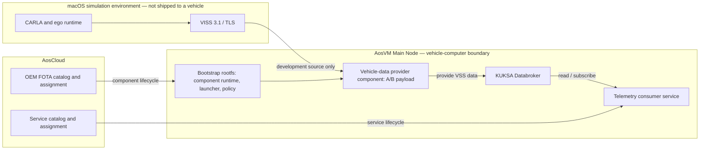

<!-- SPDX-FileCopyrightText: 2026 maninblack -->
<!-- SPDX-License-Identifier: MIT -->

# R6.1 Vehicle-Data Provider FOTA Component Design

- Status: R6.1-5 complete; accepted provider signed and verified locally
- Date: 2026-08-15
- Baseline: AosVM 6.1.0, one `aos-vm-main` Node, provider 0.1.1
- Depends on: R6/AOS-2, ADR 0005, ADR 0006

## Accepted Decision

R6/AOS-2 proved the CARLA VISS-to-KUKSA data path, but installed the provider
as a host `systemd` daemon in the provisioned VM's writable overlay. That was
an appropriate functional prototype. It is not the required vehicle-platform
lifecycle because AosCloud cannot identify, version, deploy, or roll back that
daemon as an independent component.

R6.1 proposes to make the logical **vehicle-data provider** a dedicated,
Cloud-visible Aos FOTA component. Its implementation may initially remain the
development-only CARLA VISS-to-KUKSA provider. The independently deployed
telemetry consumer remains an Aos SOTA service.

The preferred integration mechanism is a new slot-based component runtime in
the Aos Service Manager used by AosVM 6.1.0. A separately integrated legacy
Update Manager is not the default because it is not present in the released
VM and its compatibility with the current Communication Manager protocol has
not been demonstrated.

R6.1-1 through R6.1-5 are complete. The
atomic A/B lifecycle passed its exact
ARM64 tests, corrected incremental image build, disposable non-provisioned boot
gate, and unsigned bootstrap FOTA regression. Review identified a required
R6.1-3.1 interface-closure gate before artifact production: the real Python
provider must implement the fixed launcher, health, configuration, trust, and
credential contracts without carrying forward its R6 side-load installer.
The real provider interface and reproducible unsigned candidate then passed
the complete disposable ARM64 offline matrix. The exact accepted digests are
frozen in the
[R6.1-5 qualification record](r6-1-offline-provider-qualification.md).
Only the accepted provider candidate was signed and verified locally.
Bootstrap deployment or signing, provider upload, Cloud assignment,
deprovisioning, reprovisioning, and any mutation of the active Unit remain
unauthorized.

## Why R6.1 Exists

The accepted R6 installation has these properties:

| Property | R6 functional baseline | R6.1 target |
| --- | --- | --- |
| Execution | Host `systemd` daemon | Platform component launched by a component runtime |
| Cloud inventory | Not visible | Visible as an independently versioned component |
| Delivery | Guarded SSH installation | Signed Aos FOTA bundle |
| Update unit | Files in `/var` and `/etc` | One atomic provider payload |
| Rollback | Uninstall script or VM checkpoint | Component-level A/B rollback |
| Rootfs relationship | Side-loaded into released image | One bootstrap image, then independent provider updates |
| Service lifecycle | Separate by convention | Explicit FOTA provider and SOTA consumer lifecycles |

The R6 provider survives an ordinary restart of the same persistent disk, but
that is not equivalent to surviving an OEM rootfs slot change or participating
in a managed FOTA lifecycle.

## Verified AosVM 6.1.0 Constraints

The design is based on the released software rather than only on the generic
platform diagrams:

- the VM runs Communication Manager, IAM, and Service Manager; it does not run
  a standalone `aos_updatemanager` daemon;
- current generic documentation describes CM-to-Update-Manager component
  commands, while the released VM realizes its boot and rootfs component
  handling inside Service Manager runtimes; R6.1-1 must prove the exact
  protocol and status mapping instead of treating either description as a
  complete implementation contract;
- the released Service Manager configuration declares only the `container`,
  `rootfs`, and `boot` runtimes;
- `rootfs` and `boot` are the two component runtimes reported by the released
  Main Node;
- the pinned Service Manager runtime factory supports only those three plugin
  names;
- setting `isComponent: true` on the container runtime does not turn a service
  container into a system component;
- the existing rootfs runtime is specialized for a complete root filesystem
  and is not a safe generic file-package handler;
- an Aos Layer is shared service filesystem content, not an independently
  executable or health-managed platform component.

Consequently, none of these shortcuts meets the target:

1. representing the provider as an Aos Layer;
2. representing it as a normal Aos Service and calling it FOTA;
3. adding only `isComponent: true` to a container configuration;
4. publishing it under a fake rootfs type without a dedicated runtime;
5. retaining the direct installer as the long-term lifecycle mechanism.

## Lifecycle Boundary



In a production vehicle, CAN, SOME/IP, DDS, or an OEM-specific data source
replaces the CARLA/VISS input. The component boundary, KUKSA contract, FOTA
lifecycle, and SOTA consumer boundary remain the same.

## Component Identity and Compatibility

Use a role-based component identity rather than a simulator-specific identity:

```text
logical name: vehicle-data-provider
proposed Aos runtime/component type:
  aos-vm-1.0.0-main-qemuarm64-vehicle-data-provider
initial implementation: carla-viss-kuksa
architecture: linux/arm64
```

The final prefix must be confirmed against the provisioned Unit Model and the
runtime type reported by the Main Node. The FOTA bundle's component `type`
must match the runtime type exactly. Cloud acceptance of a newly reported
runtime type is an explicit R6.1-1 gate; it must not be assumed.

Component versions follow semantic versioning independently of the bootstrap
rootfs. The first FOTA-managed release should be a new version rather than
relabeling the side-loaded 0.1.1 artifact. A candidate starting point is
`0.2.0`, subject to review after the artifact format is fixed.

Every provider release declares compatibility with:

- the AosVM Main Node model and ARM64 architecture;
- a bootstrap/runtime interface version;
- the KUKSA API and supported VSS tree;
- the vehicle telemetry profile version or range;
- the authorization/trust interface version;
- any required system policy version.

Changing from CARLA to a production provider does not require changing the
consumer contract. It may require a different component implementation or
variant, but only one active provider may own a given set of KUKSA paths.

## Bootstrap Image Versus FOTA Payload

One initial custom AosVM rootfs build is expected. It adds stable platform
machinery, not the mutable provider release.

### Bootstrap rootfs owns

- the component runtime or handler integrated with Service Manager;
- the stable launcher and `systemd` integration;
- the component store configuration and A/B state metadata;
- signature, digest, manifest, and compatibility validation integration;
- SELinux policy and the minimum fixed privileges;
- bounded health, apply, and revert control;
- KUKSA resource and credential attachment points;
- recovery behavior when neither component slot is usable.

### Provider component payload owns

- the versioned provider executable or runtime environment;
- exact ARM64 runtime dependencies;
- the provider's non-secret default configuration and schema;
- the vehicle telemetry contract reference;
- version, build provenance, SBOM, license, and third-party notices;
- payload-level self-test metadata.

### Provisioned state owns

- the Aos Unit and Node identities;
- private keys, certificates, JWTs, and other credentials;
- vehicle-specific endpoint configuration;
- runtime logs and operational state.

Secrets and provisioned identities must never be copied into a FOTA payload,
embedded in the bootstrap image, copied between component slots, or committed
to Git. A component update consumes credentials through the stable bootstrap
interface.

### Artifact boundary is mandatory

The runtime and provider may be developed in the same platform repository and
qualified in the same integration baseline. They must never be packaged as one
deployable artifact:

| Artifact | Contains | Delivery lifecycle |
| --- | --- | --- |
| Bootstrap rootfs | Generic component runtime, launcher, policy, and stable interfaces | Infrequent OEM rootfs FOTA |
| Vehicle-data-provider component | Provider implementation, dependencies, manifest, and self-test metadata | Independent provider FOTA |
| Provisioned state | Unit identity, private credentials, and vehicle-specific configuration | Provisioning and secure operations |
| Telemetry consumer | KUKSA/VSS application only | Independent Aos service/SOTA |

A provider-only change must not rebuild or redistribute the component runtime.
A runtime interface change requires a compatible bootstrap/rootfs release to
reach the Unit before a provider that depends on that interface is assigned.

## Preferred Runtime Mechanism

### Preferred: dedicated Service Manager component runtime

Add a generic slot-based runtime, tentatively named
`systemd-slot-component`, to the Service Manager build used by AosVM. Configure
one instance for the vehicle-data-provider component type. The runtime owns
prepare, start, health, apply, revert, and status reporting while `systemd`
owns process supervision.

The generic runtime does not contain CARLA, VISS, KUKSA, signal paths, or
provider code. A bootstrap-owned component profile binds the provider type to
its fixed `systemd` unit, bounded health adapter, slot limits, timeouts, and
rollback policy. Payload metadata may select only declared interface options;
it cannot supply an unrestricted root hook.

This is preferred because it extends the component mechanism already used by
the released Main Node, preserves one desired-state authority, and allows the
provider to appear in the same component inventory as boot and rootfs.

The current runtime factory is statically compiled. R6.1 therefore requires
either a reviewed AosCore patch carried by the vehicle platform Yocto layer or
a pinned fork if the change is too large for a downstream patch. An upstream
contribution can follow qualification; it does not block the prototype.

### Conditional fallback: standalone Update Manager

The historical `aos_updatemanager` project supports pluggable update modules,
but the daemon is absent from AosVM 6.1.0 and the available module examples
focus on whole-rootfs or boot-partition updates. It may be selected only if a
bounded compatibility spike proves all of the following against the exact
release:

- current Communication Manager protocol compatibility;
- IAM identity and certificate provisioning for the additional daemon;
- component status and rollback reporting visible in AosCloud;
- no competing desired-state owner with Service Manager;
- a maintained generic package/slot module suitable for a non-rebooting
  provider update.

Failure of any item rejects this fallback. No legacy daemon is added merely
because its repository exists.

## Component Store and Slot Model

The runtime must use a persistent writable store that survives rootfs updates.
The exact root directory is selected in R6.1-1 after verifying the released
Service Manager storage and SELinux conventions. Its logical structure is:

```text
$COMPONENT_STORE/vehicle-data-provider/
├── slots/
│   ├── A/<immutable versioned payload>
│   └── B/<immutable versioned payload>
├── current -> slots/A
├── previous -> slots/B
├── state.json
└── staging/<transaction-id>
```

Required properties:

- prepare writes only to `staging` and the inactive slot;
- payload files become immutable before activation;
- activation is one atomic pointer/state transition;
- active and previous versions are always identifiable;
- interrupted prepare, start, apply, and revert are recoverable after reboot;
- storage has explicit size and retention limits;
- arbitrary paths, links, ownership, capabilities, and device nodes are
  rejected by the unpacker;
- garbage collection never removes the active or rollback slot.

The payload must not write directly to `/etc`, replace the stable launcher,
install a new SELinux policy, or mutate another component's data. A release
that needs those changes requires a compatible bootstrap/rootfs update first.

### Live FOTA storage-boundary finding

The first provisioned-Unit rootfs deployment invalidated one part of the
accepted store model. The release VM mounts `/var/aos/workdirs` with the fixed
SELinux mount context `aos_var_run_t`. A fixed-context mount cannot assign
`vehicle_data_provider_store_t` to only the provider subtree: `restorecon` and
`chcon` cannot change per-file labels there, and the tmpfiles `Z` rule leaves
the mount-wide label unchanged. The full factory image did not expose this
migration constraint because its storage was prepared as part of image
construction; rootfs FOTA preserves the already formatted provisioned
workdirs volume.

Granting the provider domain general access to `aos_var_run_t` would weaken
isolation across all Aos workdirs and is not accepted as the automatic fix.
Before provider assignment, R6.1 requires a reviewed persistent-storage
boundary that can carry a distinct SELinux context, or a different policy and
process boundary with equivalent least privilege. This finding does not
invalidate the rootfs runtime, A/B update, Cloud targeting, or `.2` install;
it blocks the provider payload stage.

The dedicated architecture discussion, alternatives, migration constraints,
and proposed qualification matrix are maintained in
[R6.1 Persistent Store SELinux Architecture Review](r6-1-selinux-persistent-store-architecture.md).

## Update State Machine

| State | Required behavior |
| --- | --- |
| `Installed` | Active slot is healthy and reported with its exact version and digest. |
| `Preparing` | Validate signature, digest, architecture, manifest, dependencies, space, paths, and licenses; unpack only into staging. |
| `Prepared` | Run offline import/self-tests in the inactive slot without changing the active provider. |
| `Starting` | Mark owned KUKSA paths unavailable, stop the old provider, atomically select the candidate, and start it. |
| `Pending` | Run bounded local health checks and retain the previous slot. |
| `Applying` | Commit the candidate and preserve the previous slot for the configured rollback window. |
| `Reverting` | Stop the candidate, atomically select the previous slot, start it, and verify health. |
| `Error` | Publish no stale data, report the exact failure, and retain evidence without exposing credentials. |

The target is a provider-only restart, not a complete VM reboot. A reboot is
acceptable only if the selected Aos lifecycle interface requires it and the
R6.1-1 spike proves that no safe component-level transition exists.

At every stop, crash, source disconnect, failed start, and rollback boundary,
all seven provider-owned KUKSA paths must become explicitly unavailable. Old
values must never remain valid merely because an update is in progress.

## Health Contract

FOTA health cannot depend on CARLA or Internet availability. A real vehicle
may update while its external data source, Wi-Fi, cellular link, or Cloud
connection is unavailable.

The mandatory local health gate verifies:

1. the active payload version and digest match the selected slot;
2. the provider process is active under the expected sandbox and identity;
3. its configuration and exact runtime dependencies load successfully;
4. local KUKSA TLS and authorization succeed;
5. every declared path is writable by the provider and readable under the
   qualification identity;
6. absence of CARLA produces `NotAvailable`, not stale data or zero;
7. bounded shutdown and restart work without orphaned processes;
8. AosCore, KUKSA, SELinux, rootfs read-only state, and Node identity remain
   healthy.

A live CARLA end-to-end stream is a post-deployment integration gate, not a
component installation health prerequisite.

Before switching slots, the runtime distinguishes candidate failures from
pre-existing platform failures. If KUKSA or required credentials are already
unhealthy, the transaction fails its precondition without replacing a healthy
active provider. If both candidate and previous versions fail because of the
same external dependency, the runtime reports that dependency failure rather
than falsely claiming a successful rollback.

## Security and Supply Chain

- Use the Aos FOTA bundle format and the normal OEM signing and verification
  path; the raw R6 tar archive is not a deployable FOTA artifact.
- Verify the outer bundle, component digest, manifest, and every payload file
  before activation.
- Build reproducibly from exact source and dependency locks for `linux/arm64`.
- Include SBOM, provenance, dependency inventory, and complete notices.
- Keep process privileges at or below the accepted R6 `DynamicUser`, empty
  capability set, read-only filesystem, and path-scoped KUKSA authorization.
- Reject payload attempts to add setuid files, capabilities, devices,
  unexpected owners, absolute paths, escaping links, or executable hooks
  outside the declared interface.
- Redact credentials and account-specific identifiers from update evidence and
  Cloud-visible errors.
- Preserve the future AOS-5 Authorization Adapter boundary; R6.1 must not
  embed temporary JWT issuance into the provider.

## Cloud Lifecycle and Visibility

The accepted lifecycle must demonstrate this sequence through the AosCloud UI
and API:

1. the Main Node reports support for the exact provider component type;
2. an OEM publishes a signed component release with version and compatibility
   metadata;
3. the release is approved according to the target fleet policy;
4. a desired-state assignment selects the component for a validation Unit;
5. Cloud reports download, prepare, start, apply, and final installed state;
6. the Unit's Components view shows the provider identity and exact version;
7. an intentionally bad candidate produces a visible error and successful
   rollback to the previous version;
8. removing or replacing the assignment follows an explicitly defined policy
   and never leaves stale KUKSA values.

The existing development Verification Set may reduce approval friction, but
the design must not rely on that bypass as a production security model.

R6.1-1 must determine whether adding the runtime type requires a Unit Model or
Node Type revision in AosCloud. No active Unit or Cloud catalog is changed
until this is known and separately approved.

## Repository Ownership

### `aos-vehicle-platform` — Apache-2.0

Owns:

- the generic slot-based component runtime integration, which is not part of
  the provider payload;
- the Yocto layer or exact downstream AosCore patch;
- the CARLA provider FOTA payload and builder definition;
- component manifests, schemas, SBOM, notices, and conformance tests;
- update, health, interruption, and rollback tests.

The likely structure is:

```text
aos-vehicle-platform/
├── meta-aos-vehicle-platform/          # bootstrap/rootfs integration
├── packaging/aos-fota/
│   └── vehicle-data-provider/          # FOTA artifact definition
├── providers/carla-viss-kuksa/         # provider implementation
└── tests/fota/                          # lifecycle and rollback tests
```

Prefer carrying a small, auditable patch against the exact upstream AosCore
revision in the Yocto layer. Create a public fork only if maintaining or
upstreaming a substantial runtime change is clearer than carrying the patch.
All original files use the accepted `maninblack` Apache-2.0 SPDX header;
upstream headers and notices remain intact.

### `carla-aosedge-integration` — MIT

Owns:

- a pinned Moulin build manifest and reproducible custom AosVM orchestration;
- non-secret source, image, and artifact locks;
- local VM lifecycle and protected checkpoint gates;
- guarded Cloud/API qualification workflows;
- exact bootstrap, component, contract, and source revision locks;
- end-to-end CARLA, KUKSA, update, rollback, restart, and network-transition
  evidence.

It consumes released platform artifacts and does not copy provider or runtime
source.

### `vehicle-telemetry-service` — Apache-2.0

No R6.1 implementation change is required. It remains a KUKSA contract
consumer delivered through SOTA and must not depend on the provider artifact,
component store, or FOTA handler.

## Yocto Build Architecture

Yocto builds must not run directly on macOS or inside the identity-bearing
provisioned AosVM. Use a separate Linux ARM64 builder VM accelerated by Apple
Hypervisor Framework. The initial target is Ubuntu 22.04 ARM64 with its source,
download cache, shared-state cache, and build tree on an ext4 virtual disk.

The builder is tooling infrastructure, not an Aos Unit. It has no provisioned
Unit identity and must not retain OEM private credentials in its disk or
snapshots. A remote Linux x86-64 builder remains the fallback if a pinned
native build dependency proves incompatible with an ARM64 build host.

The integration repository owns a custom, pinned Moulin manifest derived from
the official AosVM 6.1.0 `aos-vm.yaml`. It adds the exact
`meta-aos-vehicle-platform` revision without modifying or silently advancing
the upstream source pins. The platform repository owns the layer itself.

Required build sequence:

1. provision the separate builder VM and persistent caches;
2. build the unchanged pinned upstream `qemuarm64` Main Node first;
3. boot that image and pass the applicable AOS-0 baseline gates;
4. add `meta-aos-vehicle-platform` to the pinned manifest;
5. build the bootstrap image and its full rootfs FOTA bundle;
6. boot the complete image only on a disposable unprovisioned VM;
7. qualify the rootfs FOTA transaction separately before touching the active
   provisioned Unit;
8. build provider component releases independently of the complete rootfs.

The upstream-baseline gate requires exact source pins, a successful clean
build, expected package/component versions, and accepted boot behavior. It
does not require the locally generated disk bytes to equal a published image
whose complete release build environment is not available.

The outputs remain separate:

| Output | Purpose |
| --- | --- |
| Complete Main Node disk image | Disposable boot and platform qualification |
| Full rootfs FOTA bundle | One-time bootstrap of the component runtime on an existing Unit |
| Vehicle-data-provider FOTA bundle | Independent provider installation and updates |
| Build lock, digests, SBOM, and provenance | Reproducibility and release evidence |

Build and signing are separate trust stages. The builder produces a verified,
reproducible unsigned provider layer, configuration, and envelope witness.
The official signer recomposes a readable inner archive and signs its hash
together with the configuration; it does not encrypt the local bundle or sign
the deterministic unsigned envelope as an opaque file. The post-signing gate
must prove that the recomposed bundle embeds the exact accepted layer and
configuration before accepting the final signed-bundle digest. Signing and
Cloud publication use separate guarded OEM workflows with temporary credential
access; the signing identity is never committed to the manifest, copied into
an image, or retained in a builder snapshot.

## Provisioning Continuity

The active demonstration Unit must remain provisioned throughout R6.1. Its
existing system ID, Node ID, Unit Model, Node Type, certificates, encrypted
storage, Subjects, and Cloud registration are retained.

The bootstrap reaches the Unit through rootfs FOTA rather than replacement of
the identity-bearing virtual disk. The official AosVM full-rootfs FOTA excludes
`/var` and `/home`; R6.1 must verify that every provisioned identity and
credential path remains in preserved storage before deployment.

The preferred Cloud-side change is to extend the existing Target System Unit
Configuration with the provider component definition while keeping:

```text
Unit Model: aos-vm;1.0.0
Node Type:  aos-vm-main
```

R6.1-1 determines the exact Unit Model and component-type requirements without
mutating the catalog. If the current Target System cannot accept the new type,
the next action is a separately provisioned validation Unit with its own
identity, not deprovisioning of the demonstration Unit. Deprovisioning or
reprovisioning that Unit is outside the accepted plan and requires a new
explicit decision backed by recovery and migration evidence.

## Validation Topology

The product topology remains one Main Node per Unit. A second validation Unit,
if used, is another independent single-Node Unit with its own provisioned
identity; it is not a return to the deferred multi-Node topology.

Recommended sequence:

1. build and boot an unprovisioned disposable single-Node VM for local runtime
   and failure-injection tests;
2. use a separately provisioned single-Node validation Unit for the first
   Cloud FOTA transaction, if account capacity permits;
3. update the current demonstration Unit only after update and rollback pass;
4. never run two copies of the same provisioned disk identity concurrently.

If a separate validation Unit is not available, the current Unit may be used
only after offline qualification, verified recovery media, an explicit
single-Unit risk acceptance, and a separately approved Cloud change window.

## Migration From the R6 Side-Load

The current 0.1.1 payload under persistent `/var` must remain verified and
recoverable until the first FOTA-managed provider is accepted. It remains the
only active writer before cutover and is retained inert only during the bounded
migration rollback window. The bootstrap rootfs contains only migration
control and a compatibility launcher; it does not embed or repackage the
legacy provider payload.

Required cutover sequence:

1. verify the exact accepted legacy payload digest and existing credentials;
2. install the bootstrap rootfs and runtime while keeping the legacy provider
   as the only active writer;
3. prepare and verify the first provider FOTA payload in the inactive component
   slot without starting it;
4. mark all owned KUKSA paths unavailable and stop the legacy unit;
5. atomically activate and health-check the FOTA-managed provider;
6. if activation fails, stop the candidate and re-enable the verified legacy
   provider as the migration-only rollback path;
7. after the FOTA provider is applied and stable, permanently disable the
   compatibility launcher and remove only the obsolete legacy payload;
8. retain normal A/B component rollback for every later provider update.

At no point may the legacy and FOTA-managed providers run concurrently. A
fresh Unit without the legacy payload skips compatibility mode and keeps the
declared KUKSA paths unavailable until its first provider component is active.

## Implementation Plan After Approval

R6.1-0 is the original design/review gate. The plan below records completed
work as well as the remaining explicitly gated packages.

### R6.1-1 — Prove the lifecycle mechanism

- pin the exact AosVM, `meta-aos-vm`, `meta-aos`, AosCore, and Cloud API
  versions;
- provision the separate Linux ARM64 builder needed for the isolated runtime
  harness, without adding an Aos Unit identity or OEM signing credentials;
- build a minimal runtime harness and trace component operations and reporting;
- prove locally that the proposed component type is reported through the
  Node/CM path, and determine its Cloud and Unit Model prerequisites from the
  pinned API and schema; actual Cloud acceptance remains R6.1-6;
- decide custom Service Manager runtime versus the conditional Update Manager
  fallback;
- resolve Unit Model/Node Type implications and exact persistent storage root;
- record the decision in an accepted ADR.

Exit: one mechanism is proven through the local Node/CM boundary; protocol,
identity, storage, and Cloud prerequisite questions are closed without a Cloud
catalog or active-Unit mutation.

### R6.1-2 — Build the bootstrap platform image

- finish the builder's persistent ext4 download and shared-state cache setup;
- create the pinned Moulin manifest in the integration repository;
- build and boot the unchanged upstream AosVM 6.1.0 `qemuarm64` Main Node
  before enabling the project layer;
- create the Apache-2.0 Yocto integration layer;
- add the runtime, launcher, policy, storage, and health interfaces;
- preserve the official image inputs and make the custom delta reproducible;
- produce both a disposable complete image and a full bootstrap rootfs FOTA
  bundle without embedding signing credentials;
- boot a disposable ARM64 Main Node and rerun all AOS-0 kernel, runtime,
  network, read-only-root, SELinux, and clean-restart gates.

Exit: a reproducible bootstrap image supports an empty provider component
store without weakening the accepted VM baseline.

### R6.1-3 — Implement atomic component lifecycle

- implement prepare, offline self-test, start, apply, revert, recovery, status,
  retention, and garbage collection;
- implement A/B slots and interruption recovery at every state boundary;
- invoke the fixed bootstrap-owned provider profile and health adapter to
  enforce fail-safe KUKSA unavailability and single-provider ownership;
- add negative tests for malformed archives, links, paths, permissions,
  architecture, versions, and insufficient storage.

Exit: local lifecycle tests prove atomic activation and rollback without a VM
checkpoint or manual file repair.

### R6.1-3.1 — Close the real-provider/bootstrap interface

- replace the provider 0.1.1 side-load assumptions with the fixed launcher
  command interface: normal operation, offline self-test, and fail-safe mark
  unavailable;
- pin the executable model to the qualified bootstrap CPython 3.12 ABI and
  normalize the exact locked ARM64 dependencies without running `pip` or
  creating a virtual environment on the Unit;
- define immutable payload defaults separately from vehicle-specific endpoint
  configuration, public trust, and the systemd-delivered KUKSA credential;
- remove dependencies on the legacy unit name, `/var/lib` install tree,
  installer, rootfs remount, `/etc` mutation, and credential injection;
- test the real provider through the fixed launcher and sandboxed units in a
  disposable ARM64 VM;
- if the stable bootstrap interface must change, rebuild it incrementally and
  rerun the complete R6.1-2 and R6.1-3 regressions.

Exit: the actual provider conforms to a documented runtime interface and runs
from a synthetic component tree without any legacy side-load lifecycle action.

Detailed gate:
[R6.1-3.1 real provider interface closure](r6-1-real-provider-interface-closure.md).

### R6.1-4 — Produce the reproducible unsigned component candidate

- define the provider component manifest and compatibility metadata;
- confirm `0.2.0` as the first immutable FOTA-managed release version after
  the R6.1-3.1 interface is fixed;
- never reuse a recorded or published component version for different bytes;
  any post-freeze payload change requires a new semantic version;
- assemble exactly one uncompressed restricted USTAR layer with media type
  `application/vnd.aos.vehicle-data-provider.layer.v1.tar` and the exact
  Cloud-visible component type;
- reuse only provider source, normalized locked runtime dependencies,
  non-secret configuration/schema, licenses, and notices from 0.1.1; exclude
  its installer, uninstaller, systemd unit, `/etc` drop-ins, trust injection,
  and credential inputs;
- build twice from clean staging roots and require byte-identical payload and
  unsigned Aos envelope digests;
- generate SBOM, provenance, dependency inventory, and complete notices;
- validate path, ownership, mode, size, architecture, OS, runtime-interface,
  manifest, media-type, and secret-exclusion contracts locally;
- do not access an OEM signing identity or Cloud API in this stage.

Exit: one exact, reproducible, unsigned ARM64 provider candidate passes local
payload and Aos bundle validation without using any signing credential.

### R6.1-5 — Qualify offline and sign the accepted candidate

- test install, no-source startup, live source, source loss, restart, update,
  downgrade policy, bad candidate, rollback, disk-full, power interruption,
  and corrupted state;
- drive these operations through the real Service Manager component runtime,
  not the legacy installer or a second lifecycle helper;
- verify KUKSA path authorization and absence of stale values at every
  transition;
- rerun security, SELinux, rootfs, resource, and secret-exclusion gates;
- prove coexistence with SOTA services without giving them FOTA privileges;
- freeze the accepted provider layer and configuration as the immutable
  signing inputs and retain the deterministic unsigned-envelope digest as a
  reproducibility witness;
- only after the unsigned matrix passes, stop for explicit approval to access
  the OEM signing identity, let the official signer compose and sign the
  deployment bundle, verify that its inner layer and configuration are the
  exact accepted bytes, validate the signed hashes and RS256 signature, and
  retain no signing material in Git, logs, artifacts, or the builder VM;
- do not publish or assign the signed candidate in this stage.

Exit: all mandatory tests pass on a disposable single-Node ARM64 VM and one
signed, locally verified release candidate is ready for a separately approved
Cloud gate without using the active Cloud Unit.

### R6.1-6 — Establish the validation Unit and qualify first Cloud deployment

- decide and record the validation topology before mutation: prefer a new
  independently provisioned single-Main-Node Unit; if account capacity blocks
  it, stop for explicit single-Unit risk acceptance rather than silently using
  the demonstration Unit;
- obtain explicit approval for provisioning, bootstrap, catalog, publication,
  and assignment mutations in the selected isolated scope;
- select a new immutable bootstrap component version rather than reusing the
  installed `6.1.0`; the accepted decision is boot `6.1.0` plus a rootfs-only
  full-image release `6.1.1-maninblack.2`, with no boot or incremental item;
  rebuild, qualify, and freeze that exact release;
- install the qualified bootstrap runtime on the validation Unit either by
  provisioning it from the custom complete image or by a separately qualified
  signed full-rootfs FOTA transaction; if the FOTA path is selected, reproduce,
  freeze, locally validate, and sign the exact bootstrap bundle only after a
  separate signing approval and before upload; never clone the demonstration
  Unit identity;
- verify preserved or newly issued Unit identity, normal restart persistence,
  bootstrap version, runtime-type reporting, and an empty provider store before
  publishing the provider;
- perform a read-only API preflight of the exact Unit, Unit Model, Node Type,
  component type, Subject, and Verification Set targets;
- publish the component to an isolated validation scope;
- verify runtime discovery, catalog metadata, assignment, progress, final
  status, logs, and Components-view visibility through UI and API;
- retain sanitized evidence and remove failed test assignments safely.

Exit: Cloud shows the independent provider component and its exact installed
version on a validation Unit.

Detailed execution record:
[R6.1-6 first Cloud deployment](r6-1-first-cloud-deployment.md).

### R6.1-7 — Prove update and rollback through Cloud

- deploy version N, update to N+1, and verify uninterrupted contract behavior;
- deploy an intentionally invalid candidate and prove bounded automatic
  rollback;
- repeat across VM restart, Mac sleep, Wi-Fi transition, CARLA absence, and
  later CARLA reconnect;
- prove that the Unit identity, AosCore, KUKSA, and an assigned SOTA consumer
  remain healthy.

Exit: both successful update and failed-update rollback are visible and
repeatable without manual guest repair.

### R6.1-8 — Migrate and accept the demonstration Unit

- verify protected recovery state and approve the active-Unit change window;
- deploy the bootstrap compatibility launcher while the verified R6 provider
  remains the only active writer;
- prepare and verify the accepted FOTA component in its inactive slot;
- replace the R6 side-loaded unit through the documented atomic cutover without
  running two providers concurrently;
- qualify the live CARLA-to-KUKSA path through the active FOTA component;
- retain the legacy provider only as the first-install rollback path, then
  remove it after the FOTA component is applied and stable;
- update component locks, roadmap, runbooks, release metadata, and sanitized
  acceptance evidence;
- commit and push each owning repository only after review.

Exit: the demonstration Unit reports the provider as a Cloud-managed FOTA
component, the side-load lifecycle is retired, and the accepted baseline is
reproducibly pinned.

## Global Acceptance Criteria

R6.1 is complete only when all of these are true:

- AosCloud shows the provider as a component distinct from boot, rootfs, and
  SOTA services;
- the component has an exact identity, version, digest, compatibility range,
  and signed provenance;
- update and rollback are atomic, bounded, observable, and restart-safe;
- CARLA absence never blocks local component health and never creates stale
  KUKSA data;
- a provider update does not require rebuilding rootfs after the one-time
  bootstrap;
- credentials and provisioned identities remain outside every artifact and
  repository;
- the consumer remains independently updateable through SOTA;
- the one-Main-Node product topology and active Unit identity are preserved;
- all source, artifact, and integration revisions are pinned in the accepted
  baseline.

## Accepted Review Decisions

- [x] Accept the dedicated role-based `vehicle-data-provider` component.
- [x] Accept the Service Manager component runtime; R6.1-1 passed and the
      Update Manager fallback is not selected without a new blocker.
- [x] Accept one initial custom bootstrap/rootfs build followed by independent
      provider FOTA releases.
- [x] Accept the runtime and provider as separate deployable artifacts even
      when they are developed in the same platform repository.
- [x] Accept a separate Linux ARM64 Yocto builder VM and an unchanged upstream
      baseline build before enabling the project layer.
- [x] Accept a provider-only restart as the target update behavior.
- [x] Accept the A/B persistent slot and fail-safe KUKSA semantics.
- [x] Prefer a separate single-Node validation Unit; the protected
      demonstration Unit may be used only after offline gates and explicit
      single-Unit risk acceptance if account capacity prevents that option.
- [x] Preserve the active demonstration Unit's provisioning and identity;
      deprovisioning or reprovisioning requires a new explicit decision.
- [x] Confirm `0.2.0` as the first FOTA-managed provider release after exact
      ARM64 artifact and runtime compatibility passed.
- [x] Authorize R6.1-1; later Cloud and active-Unit mutations still
      require their own explicit gates.
- [x] Complete R6.1-1 with an accepted runtime ADR, exact Cloud/API and source
      baseline, persistent storage root, and unchanged Unit identity.
- [x] Authorize R6.1-2 bootstrap-image implementation with disposable,
      non-provisioned images only; Cloud and active-Unit mutations remain
      forbidden.
- [x] Complete R6.1-2 with an incrementally reproducible bootstrap image,
      disposable ARM64 boot qualification, and validated unsigned rootfs FOTA
      output.
- [x] Authorize the local R6.1-3 atomic lifecycle implementation defined in
      `r6-1-atomic-component-lifecycle.md`; signed provider publication, Cloud,
      and active-Unit mutations remain forbidden.
- [x] Use a provider-specific uncompressed restricted USTAR OCI media type and
      preflight it inside Image Manager before BusyBox `tar`; keep generic Aos
      service-layer handling unchanged.
- [x] Complete R6.1-3 with atomic A/B apply and rollback, recovery from every
      durable transaction phase, restricted archive and payload validation,
      an exact ARM64 compile and 40-test lifecycle matrix, a corrected
      incremental bootstrap image, and a disposable guest regression.
- [x] Insert R6.1-3.1 before artifact production because the real provider does
      not yet implement the fixed launcher commands, configuration/credential
      boundary, or component-native Python layout.
- [x] Separate deterministic unsigned artifact production in R6.1-4 from OEM
      signing; signing occurs only after offline acceptance and a separate
      approval in R6.1-5.
- [x] Require a validation Unit to run the qualified bootstrap runtime and
      report the new component type before the first provider Cloud assignment.
- [x] Complete R6.1-3.1 real-provider interface closure and R6.1-4
      reproducible unsigned artifact production.
- [x] Complete every unsigned R6.1-5 offline, security, lifecycle, and
      bootstrap-regression gate and freeze the accepted digests.
- [x] Obtain explicit approval to access the OEM signing identity for only the
      accepted R6.1-5 provider candidate; Cloud, provisioning, publication,
      assignment, bootstrap signing, and active-Unit mutations remain
      forbidden.
- [x] Reverify the accepted layer, configuration, and envelope witness; sign
      locally, prove that the signed bundle embeds the accepted bytes, verify
      RS256, record sanitized evidence, and stop before Cloud upload.
- [x] Select a separate validation Unit, rootfs-only bootstrap packaging, and
      immutable replacement rootfs version `6.1.1-maninblack.2` for R6.1-6.
- [x] Complete R6.1-6 local build and qualification, then stop for separate
      bootstrap-signing and Cloud-mutation approvals.
- [x] Obtain explicit approval to sign only the frozen rootfs
      `6.1.1-maninblack.2` candidate; no upload or Unit mutation is included.
- [x] Reverify the frozen rootfs and configuration, sign only those accepted
      bytes, validate the embedded payload, signed hashes, and RS256 signature,
      and stop before Cloud or Unit mutation.
- [x] Obtain explicit approval for the isolated validation Unit and exact
      Cloud mutations defined by R6.1-6.4.
- [x] Replace the invalid stale-scope `.1` batch with `.2`, prove validation-only
      targeting, and install `.2` without changing the demonstration Unit.
- [ ] Resolve and qualify the provider persistent-store SELinux boundary on the
      provisioned fixed-context workdirs mount before provider assignment.

## References

- [AosEdge key concepts and deployable items](https://docs.aosedge.tech/docs/aos-core/system-overview/key-concepts)
- [AosEdge deployment flows](https://docs.aosedge.tech/docs/aos-core/deployment-flows)
- [Aos FOTA bundle format](https://docs.aosedge.tech/docs/reference/file-formats/fota-bundle-format)
- [Aos Layer format](https://docs.aosedge.tech/docs/reference/file-formats/layer-format)
- [AosVM 6.1.0 Service Manager configuration](https://github.com/AosEdge/meta-aos-vm/blob/v6.1.0/meta-aos-vm-main/recipes-aos/aos-servicemanager/files/sm.cfg)
- [AosVM 6.1.0 FOTA documentation](https://github.com/AosEdge/meta-aos-vm/blob/v6.1.0/doc/fota.md)
- [AosVM 6.1.0 build instructions](https://github.com/AosEdge/meta-aos-vm/blob/v6.1.0/README.md)
- [AosVM 6.1.0 Moulin manifest](https://github.com/AosEdge/meta-aos-vm/blob/v6.1.0/aos-vm.yaml)
- [Yocto Project build-host requirements](https://docs.yoctoproject.org/scarthgap/ref-manual/system-requirements.html)
- [AosEdge Unit configuration](https://docs.aosedge.tech/docs/reference/core-component-configs/unit-config/)
- [AosEdge Node identity](https://docs.aosedge.tech/docs/aos-core/architecture/identity-access-manager/node-identity)
- [Pinned Service Manager runtime factory](https://github.com/AosEdge/aos_core_cpp/blob/9eecb80c4994937b5c8cbe0464970f81e8ad4c2d/src/sm/launcher/runtimes.cpp)
- [Historical Aos Update Manager](https://github.com/AosEdge/aos_updatemanager/tree/v6.0.2)
- [ADR 0005: KUKSA vehicle-data boundary](decisions/0005-kuksa-vehicle-data-boundary.md)
- [ADR 0006: lifecycle-based repository ownership](decisions/0006-lifecycle-based-repository-ownership.md)
- [R6/AOS-2 qualification record](aos-2-carla-kuksa-qualification.md)
