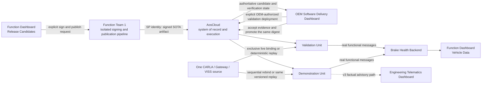

<!-- SPDX-FileCopyrightText: 2026 maninblack -->
<!-- SPDX-License-Identifier: MIT -->

# Brake Health Cloud Product Component Requirements

- Status: D3 design-reviewed
- Package: [`CR-BRAKE-CLOUD`](../component-decomposition-and-interface-register.md#cr-brake-cloud)
- Version: 0.1
- Prepared: 2026-08-19
- Accepted: 2026-08-19
- Owner: Function Team 1 / Service Provider 1 functional Cloud product
- Architecture input: [High-Level Architecture 1.4](../../architecture/high-level-architecture.md)
- Scenario input: [Demo Scenarios 1.7](../../demo/staged-post-sop-brake-health-demo-scenarios.md)
- Flow input: [Architecture Flows 1.6](../../architecture/demo-scenario-architecture-flows.md)
- System-requirements input: [System Requirements 0.9](../system-requirements-and-traceability.md)
- Component-register input: [Component Register 1.0](../component-decomposition-and-interface-register.md)
- Accepted architecture decisions: [ADR 0009](../../architecture/decisions/0009-separate-release-decision-from-cloud-execution.md) and [ADR 0011](../../architecture/decisions/0011-qm-service-containment-and-evidence-backed-oem-approval.md)
- Implementation baseline: no `brake-health-cloud` repository or executable exists
- Implementation, repository creation, signing, Cloud, or Unit mutation authorized: no

## Purpose

This package defines the Function Team 1 Cloud product used to prepare and
present the three Brake Health service releases and to receive the real
functional data produced by those releases. It expands the accepted
`CR-BRAKE-CLOUD` allocation into two components: the automatic Brake Health
Backend and the Brake Health Function Dashboard.

The demonstration is **presenter-controlled and system-executed**. The
presenter manually selects a prepared release candidate and explicitly invokes
sign and publish actions. The real release pipeline signs and publishes the
artifact, AosCloud owns technical verification and lifecycle state, and the
OEM Software Delivery Dashboard owns the separate OEM-authorized deployment
and promotion interaction. Runtime ingestion, reconstruction, persistence and
dashboard updates are automatic and shall never be replaced by manually
fabricated results.

The Function Dashboard may be delivered as one web application with two
visually and logically separated views:

1. **Release Candidates** presents the immutable prepared v1, v2 and v3
   candidates and delegates explicit sign/publish actions to the Function Team
   release pipeline;
2. **Vehicle Data** presents only data and status returned by the Brake Health
   Backend.

This UI grouping does not combine their authorities. The browser is neither a
signing-key store nor an AosCloud lifecycle database, and the functional
backend has no authority to deploy software to a Unit.

For the self-contained demonstration, the logical Function Team Cloud product
is physically hosted on the same Apple Silicon Mac as CARLA and QEMU. The
backend and static dashboard are packaged as one native `linux/arm64` Docker
container with a dedicated persistent data volume. A browser remains a
separate host application. The protected release helper remains a separate
native macOS process so that signing credentials can stay in the login
Keychain rather than being copied or mounted into the container.

## Reader Summary

| Question | Answer |
| --- | --- |
| What this package owns | Brake Health functional-message ingestion, idempotent v1 window reconstruction, v2/v3 derived-result persistence, query/subscription APIs, version-aware functional presentation, prepared candidate catalogue and presenter controls that delegate signing/publication to the Function Team pipeline |
| What this package does not own | In-vehicle Brake Health behavior, model training, CARLA/VISS/KUKSA, artifact compilation during the demo, signing-key custody, AosCloud state, OEM approval, Unit targeting, deployment, promotion, native logs, Engineering Telematics Dashboard or production driver HMI |
| Intended result | A presenter can explain and publish each already-built service version, then show the real change from v1 braking windows to v2 derived health and v3 advisory facts on Validation and Demonstration Units |
| Accountable lifecycle owner | Function Team 1 owns the service release decision; Service Provider 1 publishes; an authorized OEM identity approves Unit deployment and promotion outside this product |
| Primary repository | Planned public `brake-health-cloud`; it will own the ARM64 container, backend, embedded static dashboard and local demo deployment definition; repository creation remains a later implementation action |

## Product Views and Authority

| View or adjacent surface | Presented information or action | Authoritative source | Explicit prohibition |
| --- | --- | --- | --- |
| Release Candidates | Prepared v1-v3 purpose, bytes/metadata digest, requested KUKSA resources, quotas, architecture, required VDP range, functional output and explicit sign/publish controls | Immutable candidate catalogue plus Function Team 1 release pipeline result | No source edit/build, private key in browser, OEM approval or invented Cloud state |
| Vehicle Data | Growing/completed v1 windows; v2/v3 assessment, event and advisory facts; Unit role; source/event time; delivery state | Brake Health Backend | No direct CARLA, VISS, KUKSA or AosCloud query and no manually injected success result |
| OEM Software Delivery Dashboard | Technical verification, exact target, evidence, active OEM role, validation deployment and promotion | AosCloud and current Unit state | Not implemented by `CR-BRAKE-CLOUD` |
| Engineering Telematics Dashboard | Vehicle/Gateway telemetry and factual v3 advisory receipt/status | Vehicle Gateway VISS endpoint | Not implemented by `CR-BRAKE-CLOUD`; no production driver-display claim |

## Local Demo Deployment Topology

The primary demo mode is containerized. A direct native backend process may be
kept as a development fallback, but it is not a second supported presentation
architecture and must execute the same application, contracts and tests.

The container exposes the dashboard/API only on a host loopback listener. The
VM-to-backend route uses the QEMU guest-visible host path and an authenticated,
allowlisted ingestion endpoint; it must not require a listener exposed to the
office, home or customer LAN. The exact Docker/QEMU route is a D4 experiment
and qualification gate rather than an assumed behavior.

One demo launcher, owned later by `CR-DEMO`, starts or verifies Docker Desktop,
starts the product container, waits for its health endpoint, starts the native
release helper, and only then opens the browser. The launcher reports a clear
blocked state when Docker Desktop, the volume, the helper or the network route
is unavailable; it never silently falls back to fabricated data.

## Prepared Release Catalogue

All three candidates are compiled, packaged, tested and frozen before the
presentation. Live source modification or compilation is outside the demo.
The unsigned payload and metadata have stable digests before selection; the
signed envelope receives its exact digest when the presenter explicitly
invokes signing. The identical accepted signed bytes and digest are used for
Validation Unit qualification and Demonstration Unit promotion.

| Candidate | Declared VDP compatibility | Requested KUKSA capability | Functional Cloud product | Vehicle-side advisory |
| --- | --- | --- | --- | --- |
| Brake Health v1 | VDP Component v1 compatible range | Read/subscribe only to the accepted v1 Brake Health paths | Ordered finite `BrakeTelemetryWindow` chunks plus one completion record | None |
| Brake Health v2 | VDP Component v2 compatible range | Read/subscribe to the accepted v2 superset | `BrakeHealthAssessment` plus threshold/change `BrakeHealthEvent`; no normal v1 high-detail window | None |
| Brake Health v3 | VDP Component v3 compatible range | Accepted reads plus one typed Brake Health advisory target | v2 derived products plus correlated advisory fact and synchronization state | One typed QM maintenance advisory request |

The catalogue displays the declared compatibility requirement and actual
observed readiness as evidence. It shall not claim that the current AosCloud
release natively rejects an incompatible SOTA before desired-state change or
transfer. That admission feature remains deferred; the service-side
compatibility/readiness check remains fail closed.

## Presenter-Controlled Release and Evidence Flow

The current demonstration has one visible CARLA/Vehicle Gateway/VISS source,
not two simultaneous vehicles. Validation and Demonstration evidence therefore
uses either exclusive sequential live binding or the same deterministic,
versioned replay. Selection of that mechanism belongs to `CR-DEMO`; this
package must preserve the exact source/Unit/run correlation supplied to it.

## Component Boundary

### In scope

- authenticated ingestion of the versioned `IF-FUNC-001` message family;
- schema, version, size, Unit, run, source-time and correlation validation;
- idempotent ordered reconstruction of v1 event-window chunks and completion;
- automatic persistence and query/subscription of growing and completed v1 windows;
- idempotent v2/v3 assessment, event and advisory-fact ingestion;
- original sample/event time, receipt time and synchronization-state preservation;
- bounded run-scoped retention, archive/clear action and exact deletion scope;
- a Function Team dashboard with separated `Release Candidates` and `Vehicle Data` views;
- an immutable prepared v1-v3 catalogue with human-readable purpose,
  compatibility, permissions, quotas, architecture, digests and outputs;
- explicit, confirmation-gated delegation of sign and publish actions to the
  Function Team 1 release pipeline;
- clear success, pending, offline, partial, duplicate, invalid and failed states;
- one native `linux/arm64` container containing the backend and embedded static
  dashboard, with immutable application image and runtime configuration;
- a dedicated persistent SQLite data volume, explicit health endpoint and
  graceful stop/restart behavior;
- loopback-only browser exposure and an authenticated, allowlisted QEMU
  guest-to-host functional-ingestion route without LAN exposure;
- a native macOS release helper that uses the login Keychain and exposes no
  reusable private key or certificate material to the container;
- unit tests, contract fixtures, health, logs and operational metrics for owned logic.

### Out of scope

- compiling, rebuilding or changing service sources during the presentation;
- creating the Brake Health service artifact, service metadata or model;
- custody or use of a private signing key inside the browser or backend;
- independent desired-state, Unit, batch, Campaign, approval or native-log storage;
- OEM validation acceptance, deployment approval, target calculation or promotion;
- a temporary replacement for deferred native AosCloud SOTA-to-FOTA admission;
- CARLA control, source switching/replay, VISS, KUKSA or VDP implementation;
- local Brake Health inference, advisory authorization or time-critical decision logic;
- Engineering Telematics Dashboard, IVI, Instrument Cluster or driver acknowledgement;
- live model training or claims of production diagnostic accuracy.
- Docker Desktop implementation or licensing, production public-Cloud hosting,
  Internet exposure, LAN access or multi-host high availability;

### Dependencies and assumptions

| Dependency or assumption | Owner | Required state | Failure consequence |
| --- | --- | --- | --- |
| Versioned functional messages | [`CR-BHS`](brake-health-service.md) | Accepted v1 chunk/completion and v2/v3 derived schemas, authentication and idempotency identifiers | Reject/quarantine invalid input; never fabricate a dashboard result |
| Prepared immutable candidates | [`CR-BHS`](brake-health-service.md) release pipeline | v1-v3 ARM64 payload, metadata and tests frozen before the presentation | Candidate cannot be selected or signed |
| Signing and publication pipeline | Function Team 1 / [`IF-LC-002`](../component-decomposition-and-interface-register.md#if-lc-002) | Explicit confirmation, protected key handling, Service Provider 1 identity and machine-readable result | Display failure; no Cloud success claim or retry without a new explicit action |
| AosCloud and OEM delivery surface | [`CR-AOS`](aos-lifecycle.md) and future `CR-DEMO` | Authoritative verification, target, approval, deployment and promotion state | Release view stops at the last verified pipeline result and directs the presenter to the authoritative surface |
| VDP compatibility | [`CR-VDP`](vehicle-data-platform.md) and [`CR-BHS`](brake-health-service.md) | Candidate-declared range and fail-closed service readiness | Display declared/actual evidence; do not implement local admission control |
| Run and Unit correlation | Future `CR-DEMO` | Bounded run time, VU/DU identities, Unit roles and exact selected/replayed source | Data is quarantined as unassigned and excluded from audience success views |
| One source, two Unit roles | Future `CR-DEMO` | Exclusive sequential live binding or deterministic versioned replay | Evidence is incomplete; dashboard must not imply two simultaneous CARLA vehicles |
| Engineering advisory evidence | [`CR-GATEWAY`](vehicle-gateway.md) | Gateway VISS is authoritative for v3 advisory receipt/status | Function dashboard shows only its correlated backend fact, never a driver-display claim |
| Apple Silicon container runtime | Docker Desktop on the demo Mac | Running native ARM64 engine, available named volume and health-capable container runtime | Launcher reports blocked; no dashboard/runtime-data success claim |
| QEMU-to-container route | Future `CR-DEMO` plus this package | Authenticated selected-Unit ingestion reaches the backend without LAN exposure | Integration gate fails; Unit data stays queued and the dashboard shows offline |
| macOS Keychain release helper | Function Team 1 release owner | Native helper available through a local authenticated boundary; key remains non-exportable to browser/container | Sign/publish control is disabled with a factual reason |

## Current Implementation Baseline

| Capability | Current evidence | State for this package |
| --- | --- | --- |
| Repository | Component Register plans `brake-health-cloud`; no repository exists | `NEW` |
| Backend | No ingestion, schema, persistence, API or functional authentication implementation | `NEW` |
| Dashboard | No Release Candidates or Vehicle Data application exists | `NEW` |
| Candidate catalogue | Service v1-v3 target behavior is specified in `CR-BHS`; no machine-readable UI catalogue exists | `NEW` |
| Signing/publication UI seam | `IF-LC-002` defines the ownership boundary; no isolated helper integration exists | `NEW / QUALIFY` |
| Local Docker runtime | Docker Desktop 4.87.0 / engine 29.7.2 reports native `arm64`/`aarch64` on the current Mac | `CURRENT` host dependency; product image and launcher `NEW` |
| Containerized product | No Dockerfile, Compose definition, health endpoint, image, volume schema or QEMU ingestion qualification exists | `NEW` |
| Contract fixtures | `IF-FUNC-001` message family is defined conceptually; executable shared fixtures are absent | `NEW` |
| Tests | No package repository or owned test suite exists | `NEW` |

## Testability Boundary

Backend parsing, validation, reconstruction, idempotency, persistence, retention
and query behavior shall be independent of web transport and storage vendor.
Dashboard state derivation shall be independent of browser rendering. Candidate
catalogue validation and release-action state transitions shall be independent
of a real signing key or AosCloud account.

Unit tests inject:

- valid, duplicate, missing, reordered, corrupt and incompatible functional messages;
- deterministic clocks, Unit IDs, run windows, source/event/receipt times and roles;
- in-memory transactional storage with restart and failure points;
- release catalogue entries and malformed digest, permission, quota or compatibility metadata;
- signing/publication helper results including confirmation cancellation,
  timeout, partial result and retry;
- ARM64 image metadata, Compose configuration, loopback port publication,
  volume ownership, health and secret-mount rejection;
- selected-Unit ingestion routes, unauthorized clients, LAN-address probes and
  container/helper restart transitions;
- backend connection, subscription, pagination and retention faults.

Owned logic must run without CARLA, QEMU, AosCloud, a real service, signing
credentials or network access. Contract and integration tests then prove the
real packaged backend, UI and release helper against controlled adjacent
components.

## Interface Summary

| Interface | Direction | Data or command | Contract/version | Failure behavior | Authority |
| --- | --- | --- | --- | --- | --- |
| [Functional message family (`IF-FUNC-001`)](../component-decomposition-and-interface-register.md#if-func-001) | In | v1 ordered chunks/completion; v2/v3 assessments/events/advisory facts | Versioned Function Team 1 schema | Reject/quarantine invalid input; acknowledge only durable accepted state; retry remains bounded in vehicle | Service result plus backend acknowledgement |
| [Function dashboard API (`IF-FUNC-002`)](../component-decomposition-and-interface-register.md#if-func-002) | Out | Reconstructed v1 windows and persisted v2/v3 results/status | Versioned query/subscription API | Expose stale/disconnected/partial state; never synthesize current values | Brake Health Backend |
| [Brake Health SOTA publication (`IF-LC-002`)](../component-decomposition-and-interface-register.md#if-lc-002) | Delegated adjacent action | Explicit request to sign/publish one selected immutable candidate; structured result | Function Team 1 release-pipeline contract | Cancel/failure produces no success state; uncertain result requires reconciliation | Service Provider 1 pipeline and AosCloud verification record |
| [Function Team 1 OEM approval (`IF-LC-009`)](../component-decomposition-and-interface-register.md#if-lc-009) | Out of package / handoff | Candidate identity and digest are available for later OEM review | OEM Software Delivery Dashboard contract | No local approval control or inferred approval | Function Team 1 decision through authorized OEM identity |

## Verification Strategy

| Level | Purpose | Dependency boundary | Required for this package | Planned evidence |
| --- | --- | --- | --- | --- |
| Unit | Prove catalogue validation, ingestion, reconstruction, idempotency, view-state, release-action and retention logic | Deterministic message, clock, storage, helper and API doubles | Yes | `UT-BRAKE-CLOUD-*` suite |
| Component | Prove packaged backend and dashboard through public APIs and browser behavior | Controlled service producer, storage and release-helper stub | Yes | Backend/UI component suite and health evidence |
| Contract | Prove `IF-FUNC-001`, `IF-FUNC-002` and release-helper schema agreement | Digest-addressed shared fixtures | Yes | Producer/consumer conformance and negative fixtures |
| Integration | Prove real Service v1-v3 ingestion and protected release-helper delegation | Validation environment with accepted adjacent revisions; non-production test credentials | Yes | G2/G3/G4 integration records |
| End-to-end | Prove presenter-controlled publication, VU evidence and same-digest DU promotion without fake runtime data | One CARLA source used sequentially or by deterministic replay | Yes | `AF-G2-*`, `AF-G3-*`, `AF-G4-*`, `AF-X-SOURCE` and `AF-X-OBS` evidence |

## Requirement Summary

| Requirement | Plain-language obligation | Verification levels | State |
| --- | --- | --- | --- |
| [Separated product views (`REQ-BRAKE-CLOUD-001`)](#req-brake-cloud-001) | Keep release presentation, runtime data and lifecycle authority visibly distinct | Unit, Component, Integration, End-to-end | D3 design-reviewed |
| [Prepared candidate catalogue (`REQ-BRAKE-CLOUD-002`)](#req-brake-cloud-002) | Present immutable v1-v3 candidates without live build or source changes | Unit, Component, Contract, Integration | D3 design-reviewed |
| [Complete candidate metadata (`REQ-BRAKE-CLOUD-003`)](#req-brake-cloud-003) | Show purpose, digests, compatibility, KUKSA access, quotas and outputs before signing | Unit, Component, Contract | D3 design-reviewed |
| [Explicit protected signing and publication (`REQ-BRAKE-CLOUD-004`)](#req-brake-cloud-004) | Delegate a confirmed action to the protected release pipeline and preserve the exact signed digest | Unit, Component, Integration, End-to-end | D3 design-reviewed |
| [No lifecycle authority (`REQ-BRAKE-CLOUD-005`)](#req-brake-cloud-005) | Never own OEM approval, desired state, targeting, deployment or promotion | Unit, Component, Integration | D3 design-reviewed |
| [Idempotent v1 reconstruction (`REQ-BRAKE-CLOUD-006`)](#req-brake-cloud-006) | Reconstruct one finite pre/active/post braking window from ordered or retried chunks | Unit, Component, Contract, Integration | D3 design-reviewed |
| [Live v1 presentation (`REQ-BRAKE-CLOUD-007`)](#req-brake-cloud-007) | Show a factual growing then completed v1 window | Unit, Component, Integration, End-to-end | D3 design-reviewed |
| [Derived v2 data product (`REQ-BRAKE-CLOUD-008`)](#req-brake-cloud-008) | Present assessments/events instead of a normal high-detail v1 stream | Unit, Component, Contract, Integration, End-to-end | D3 design-reviewed |
| [Correlated v3 advisory fact (`REQ-BRAKE-CLOUD-009`)](#req-brake-cloud-009) | Present the backend advisory fact without claiming Gateway/driver display authority | Unit, Component, Contract, Integration, End-to-end | D3 design-reviewed |
| [Offline synchronization and recovery (`REQ-BRAKE-CLOUD-010`)](#req-brake-cloud-010) | Preserve original times and converge idempotently after reconnect | Unit, Component, Integration, End-to-end | D3 design-reviewed |
| [Run, Unit and source correlation (`REQ-BRAKE-CLOUD-011`)](#req-brake-cloud-011) | Bind every accepted result to the exact run, Unit role and source evidence | Unit, Component, Contract, Integration | D3 design-reviewed |
| [Honest VU/DU evidence (`REQ-BRAKE-CLOUD-012`)](#req-brake-cloud-012) | Never imply two simultaneous CARLA vehicles when one source is reused | Unit, Component, Integration, End-to-end | D3 design-reviewed |
| [Run-scoped retention and clearing (`REQ-BRAKE-CLOUD-013`)](#req-brake-cloud-013) | Archive or clear only exact functional run data without touching Cloud audit state | Unit, Component, Integration | D3 design-reviewed |
| [Failure and freshness visibility (`REQ-BRAKE-CLOUD-014`)](#req-brake-cloud-014) | Show invalid, stale, partial, offline and failed states without fabricated success | Unit, Component, Integration, End-to-end | D3 design-reviewed |
| [Mac-local ARM64 container deployment (`REQ-BRAKE-CLOUD-015`)](#req-brake-cloud-015) | Run backend and static dashboard in one health-checked ARM64 container with persistent data | Unit, Component, Integration | D3 design-reviewed |
| [Local network and signing isolation (`REQ-BRAKE-CLOUD-016`)](#req-brake-cloud-016) | Keep browser local, authenticate VM ingestion and keep Keychain signing outside Docker | Unit, Component, Integration, End-to-end | D3 design-reviewed |

## Detailed Requirements

### Separated product views

- ID: `REQ-BRAKE-CLOUD-001`
- Statement: The Brake Health Cloud product shall separate the `Release Candidates` and `Vehicle Data` views, identify each view's authoritative source, and prevent runtime backend data from becoming release or lifecycle authority.
- Rationale: Presenter convenience must not collapse Function Team release ownership, backend data and AosCloud lifecycle state into one ambiguous dashboard.
- Parent system requirement: [Authoritative demo surfaces (`SYS-OBS-001`)](../system-requirements-and-traceability.md#sys-obs-001)
- Architecture flow: [Cross-stage evidence (`AF-X-OBS`)](../../architecture/demo-scenario-architecture-flows.md#af-x-obs)
- Components: [`CMP-BRAKE-BE`](../component-decomposition-and-interface-register.md#cmp-brake-be), [`CMP-BRAKE-DASH`](../component-decomposition-and-interface-register.md#cmp-brake-dash)
- Interfaces: [`IF-FUNC-002`](../component-decomposition-and-interface-register.md#if-func-002), adjacent [`IF-LC-002`](../component-decomposition-and-interface-register.md#if-lc-002)
- Verification levels: Unit / Component / Integration / End-to-end
- Required evidence: view/authority labels, access-control matrix and negative UI/API tests
- State: D3 design-reviewed

#### Acceptance criteria

1. Runtime views obtain functional results only from the backend API.
2. Release views label pipeline and AosCloud results distinctly from local catalogue state.
3. Neither view stores or presents an independent OEM approval or Unit desired state.

### Prepared candidate catalogue

- ID: `REQ-BRAKE-CLOUD-002`
- Statement: The Release Candidates view shall expose exactly the prepared Brake Health v1, v2 and v3 immutable candidates and shall provide no source-edit, build or repackage operation during the presentation.
- Rationale: The demo shows post-SOP delivery, not a live software-development exercise.
- Parent system requirement: [Immutable release candidates (`SYS-REL-001`)](../system-requirements-and-traceability.md#sys-rel-001)
- Architecture flow: [Independent SOTA 1 delivery (`AF-G2-LC`)](../../architecture/demo-scenario-architecture-flows.md#af-g2-lc)
- Components: [`CMP-BRAKE-DASH`](../component-decomposition-and-interface-register.md#cmp-brake-dash), adjacent [`CMP-BHS`](../component-decomposition-and-interface-register.md#cmp-bhs)
- Interfaces: adjacent [`IF-LC-002`](../component-decomposition-and-interface-register.md#if-lc-002)
- Verification levels: Unit / Component / Contract / Integration
- Required evidence: signed catalogue manifest, digest verification and absence of build/source mutation controls
- State: D3 design-reviewed

#### Acceptance criteria

1. Each candidate catalogue entry resolves to immutable payload and metadata bytes.
2. A missing, changed or digest-mismatched candidate is disabled and visibly rejected.
3. Candidate selection does not modify source, model, metadata or payload bytes.

### Complete candidate metadata

- ID: `REQ-BRAKE-CLOUD-003`
- Statement: Before signing, the Release Candidates view shall present the candidate purpose, version, payload and metadata digests, ARM64 architecture, requested KUKSA paths/modes, Aos quotas, required VDP compatibility range, functional output types and v2/v3 synthetic-model identity where applicable.
- Rationale: The audience must see what changes between versions and what authority/resources each candidate requests.
- Parent system requirements: [Service capability compatibility (`SYS-REL-003`)](../system-requirements-and-traceability.md#sys-rel-003), [Evidence-backed final OEM approval (`SYS-REL-010`)](../system-requirements-and-traceability.md#sys-rel-010)
- Architecture flow: [Predictive-function proof (`AF-G3-OB`)](../../architecture/demo-scenario-architecture-flows.md#af-g3-ob)
- Components: [`CMP-BRAKE-DASH`](../component-decomposition-and-interface-register.md#cmp-brake-dash)
- Interfaces: adjacent [`IF-LC-002`](../component-decomposition-and-interface-register.md#if-lc-002)
- Verification levels: Unit / Component / Contract
- Required evidence: catalogue-schema conformance and UI snapshot for all three candidates
- State: D3 design-reviewed

#### Acceptance criteria

1. Every required field is machine validated before the sign control is enabled.
2. v1 and v2 show no advisory write; v3 shows only the accepted typed advisory target.
3. Compatibility is labelled declared/readiness evidence, not current native Cloud admission.

### Explicit protected signing and publication

- ID: `REQ-BRAKE-CLOUD-004`
- Statement: The Release Candidates view shall require explicit presenter confirmation before delegating signing and publication to an isolated Function Team 1 pipeline, shall never expose private-key material to the browser/backend, and shall retain the resulting signed artifact digest for unchanged VU-to-DU promotion evidence.
- Rationale: A visible manual decision is required while cryptographic custody and actual publication remain in their proper boundary.
- Parent system requirements: [Immutable release candidates (`SYS-REL-001`)](../system-requirements-and-traceability.md#sys-rel-001), [OEM-authorized deployment approval (`SYS-REL-008`)](../system-requirements-and-traceability.md#sys-rel-008), [Validate before promotion (`SYS-REL-004`)](../system-requirements-and-traceability.md#sys-rel-004)
- Architecture flow: [Independent SOTA 1 delivery (`AF-G2-LC`)](../../architecture/demo-scenario-architecture-flows.md#af-g2-lc)
- Components: [`CMP-BRAKE-DASH`](../component-decomposition-and-interface-register.md#cmp-brake-dash), adjacent Function Team 1 pipeline
- Interfaces: [`IF-LC-002`](../component-decomposition-and-interface-register.md#if-lc-002)
- Verification levels: Unit / Component / Integration / End-to-end
- Required evidence: confirmation record, helper result, absence-of-key inspection and exact VU/DU signed digest comparison
- State: D3 design-reviewed

#### Acceptance criteria

1. Cancelled confirmation causes no signing or publication request.
2. A helper timeout or uncertain result is shown as requiring reconciliation and is never converted into success.
3. The digest shown after signing is the digest later observed for both VU and DU; no rebuild or re-sign occurs between them.
4. The helper runs as a native macOS process and uses Keychain-backed credentials without copying key material into Docker configuration, image, volume, browser storage or application logs.

### No lifecycle authority

- ID: `REQ-BRAKE-CLOUD-005`
- Statement: The Brake Health Cloud product shall not approve, target, install, validate, promote or roll back Unit software and shall direct those actions and authoritative states to AosCloud through the OEM Software Delivery Dashboard.
- Rationale: Function data and convenient candidate selection must not become an alternate lifecycle control plane.
- Parent system requirements: [Team-owned release decisions (`SYS-REL-007`)](../system-requirements-and-traceability.md#sys-rel-007), [Cloud-authoritative delivery dashboard (`SYS-OBS-002`)](../system-requirements-and-traceability.md#sys-obs-002)
- Architecture flow: [Cross-stage evidence (`AF-X-OBS`)](../../architecture/demo-scenario-architecture-flows.md#af-x-obs)
- Components: [`CMP-BRAKE-BE`](../component-decomposition-and-interface-register.md#cmp-brake-be), [`CMP-BRAKE-DASH`](../component-decomposition-and-interface-register.md#cmp-brake-dash)
- Interfaces: out-of-package [`IF-LC-005`](../component-decomposition-and-interface-register.md#if-lc-005), [`IF-LC-009`](../component-decomposition-and-interface-register.md#if-lc-009)
- Verification levels: Unit / Component / Integration
- Required evidence: API/permission inventory and negative tests proving lifecycle mutations are absent
- State: D3 design-reviewed

#### Acceptance criteria

1. No backend/dashboard credential can perform an OEM Unit lifecycle mutation.
2. The product never stores an independent desired-state, approval or batch database.
3. A candidate published successfully is still labelled not deployed until the authoritative OEM surface reports otherwise.

### Idempotent v1 reconstruction

- ID: `REQ-BRAKE-CLOUD-006`
- Statement: The Backend shall durably accept, validate, deduplicate and reconstruct each v1 `BrakeTelemetryWindow` from bounded pre-trigger, active-braking and post-trigger chunks plus exactly one completion record without duplicating samples or completing across different event, Unit, service, contract or run identities.
- Rationale: Retry and reconnect must produce one truthful finite braking episode.
- Parent system requirement: [Bounded v1 Brake Telemetry Window (`SYS-BHS-005`)](../system-requirements-and-traceability.md#sys-bhs-005)
- Architecture flow: [Bounded braking-event acquisition (`AF-G2-RT`)](../../architecture/demo-scenario-architecture-flows.md#af-g2-rt)
- Components: [`CMP-BRAKE-BE`](../component-decomposition-and-interface-register.md#cmp-brake-be)
- Interfaces: [`IF-FUNC-001`](../component-decomposition-and-interface-register.md#if-func-001)
- Verification levels: Unit / Component / Contract / Integration
- Required evidence: reconstruction suite covering reordered, duplicate, missing, conflicting and late messages
- State: D3 design-reviewed

#### Acceptance criteria

1. Duplicate identical chunks and completion records are idempotently acknowledged.
2. Missing chunks keep the window incomplete; conflicting duplicates are rejected/quarantined.
3. Completion is accepted only after all declared chunks and phase bounds are durable and consistent.

### Live v1 presentation

- ID: `REQ-BRAKE-CLOUD-007`
- Statement: The Vehicle Data view shall present a v1 window as growing while accepted chunks arrive and completed only after the Backend accepts the completion record, with visible pre/active/post phases, service version, Unit role, original event time and delivery state.
- Rationale: The first service version visibly proves event-focused Cloud data collection.
- Parent system requirements: [Bounded v1 Brake Telemetry Window (`SYS-BHS-005`)](../system-requirements-and-traceability.md#sys-bhs-005), [Authoritative demo surfaces (`SYS-OBS-001`)](../system-requirements-and-traceability.md#sys-obs-001)
- Architecture flow: [First functional-service proof (`AF-G2-OB`)](../../architecture/demo-scenario-architecture-flows.md#af-g2-ob)
- Components: [`CMP-BRAKE-BE`](../component-decomposition-and-interface-register.md#cmp-brake-be), [`CMP-BRAKE-DASH`](../component-decomposition-and-interface-register.md#cmp-brake-dash)
- Interfaces: [`IF-FUNC-002`](../component-decomposition-and-interface-register.md#if-func-002)
- Verification levels: Unit / Component / Integration / End-to-end
- Required evidence: deterministic progress-state tests and VU/DU dashboard capture
- State: D3 design-reviewed

#### Acceptance criteria

1. The first accepted pre-trigger chunk makes the window visible before completion.
2. UI phase and sample counts derive from persisted backend state.
3. Disconnection leaves the last state visibly stale/offline rather than complete or current.

### Derived v2 data product

- ID: `REQ-BRAKE-CLOUD-008`
- Statement: For Service v2 normal operation, the Backend and Vehicle Data view shall ingest and present versioned `BrakeHealthAssessment` and threshold/change `BrakeHealthEvent` messages with model identity, provenance, result, quality and original event time, and shall distinguish this bounded derived product from the v1 high-detail telemetry window.
- Rationale: The audience-visible data-product change proves that processing moved into the vehicle.
- Parent system requirement: [Derived v2 Cloud data product (`SYS-BHS-006`)](../system-requirements-and-traceability.md#sys-bhs-006)
- Architecture flow: [Deterministic local assessment and derived reporting (`AF-G3-RT`)](../../architecture/demo-scenario-architecture-flows.md#af-g3-rt)
- Components: [`CMP-BRAKE-BE`](../component-decomposition-and-interface-register.md#cmp-brake-be), [`CMP-BRAKE-DASH`](../component-decomposition-and-interface-register.md#cmp-brake-dash)
- Interfaces: [`IF-FUNC-001`](../component-decomposition-and-interface-register.md#if-func-001), [`IF-FUNC-002`](../component-decomposition-and-interface-register.md#if-func-002)
- Verification levels: Unit / Component / Contract / Integration / End-to-end
- Required evidence: v2 fixtures, absence-of-normal-v1-window assertion and dashboard comparison
- State: D3 design-reviewed

#### Acceptance criteria

1. v2 derived messages with valid identity are durably idempotent.
2. Native, derived, estimated and simulated provenance labels remain visible.
3. A normal v2 session does not appear as a v1 raw/high-detail window stream.

### Correlated v3 advisory fact

- ID: `REQ-BRAKE-CLOUD-009`
- Statement: For Service v3, the Backend and Vehicle Data view shall associate the advisory fact with its assessment/event, service/model version, Unit, source event and original time while labelling it as a functional backend fact rather than proof of Gateway receipt, driver display or acknowledgement.
- Rationale: The functional backend and engineering vehicle surface prove different parts of the advisory path.
- Parent system requirements: [Offline local continuity (`SYS-BHS-004`)](../system-requirements-and-traceability.md#sys-bhs-004), [QM service and Gateway containment (`SYS-SEC-007`)](../system-requirements-and-traceability.md#sys-sec-007), [Authoritative demo surfaces (`SYS-OBS-001`)](../system-requirements-and-traceability.md#sys-obs-001)
- Architecture flow: [Local advisory round trip (`AF-G4-RT`)](../../architecture/demo-scenario-architecture-flows.md#af-g4-rt)
- Components: [`CMP-BRAKE-BE`](../component-decomposition-and-interface-register.md#cmp-brake-be), [`CMP-BRAKE-DASH`](../component-decomposition-and-interface-register.md#cmp-brake-dash)
- Interfaces: [`IF-FUNC-001`](../component-decomposition-and-interface-register.md#if-func-001), [`IF-FUNC-002`](../component-decomposition-and-interface-register.md#if-func-002)
- Verification levels: Unit / Component / Contract / Integration / End-to-end
- Required evidence: correlation fixtures and paired Function/Engineering dashboard proof
- State: D3 design-reviewed

#### Acceptance criteria

1. An uncorrelated advisory fact is quarantined or visibly uncorrelated, not attached heuristically.
2. The Function Dashboard never labels the fact as displayed to or acknowledged by a driver.
3. Gateway receipt/status is referenced only from the authoritative Engineering Dashboard evidence.

### Offline synchronization and recovery

- ID: `REQ-BRAKE-CLOUD-010`
- Statement: The Backend shall converge idempotently when delayed v1 chunks/completion or v2/v3 derived messages arrive after functional-backend reconnection, preserve original sample/event times separately from receipt time and expose delayed/offline synchronization state.
- Rationale: Cloud connectivity loss must delay reporting without falsifying event order or stopping local service behavior.
- Parent system requirement: [Offline local continuity (`SYS-BHS-004`)](../system-requirements-and-traceability.md#sys-bhs-004)
- Architecture flow: [Connectivity domains (`AF-X-OFFLINE`)](../../architecture/demo-scenario-architecture-flows.md#af-x-offline)
- Components: [`CMP-BRAKE-BE`](../component-decomposition-and-interface-register.md#cmp-brake-be), [`CMP-BRAKE-DASH`](../component-decomposition-and-interface-register.md#cmp-brake-dash)
- Interfaces: [`IF-FUNC-001`](../component-decomposition-and-interface-register.md#if-func-001), [`IF-FUNC-002`](../component-decomposition-and-interface-register.md#if-func-002)
- Verification levels: Unit / Component / Integration / End-to-end
- Required evidence: disconnect/queue/reconnect tests with duplicate and delayed delivery
- State: D3 design-reviewed

#### Acceptance criteria

1. Reconnect completes the same event/result identity rather than creating a new event.
2. Original event time, receipt time and synchronization state remain distinct.
3. Delayed messages outside retention or schema limits fail visibly and do not corrupt accepted data.

### Run, Unit and source correlation

- ID: `REQ-BRAKE-CLOUD-011`
- Statement: Every accepted functional record and dashboard observation shall carry the bounded demo run, exact Unit ID and role, service/contract/model versions, source event identity and original/receipt times sufficient to correlate it with CARLA, Gateway and lifecycle evidence.
- Rationale: Similar repeated braking scenarios must remain attributable across VU and DU phases.
- Parent system requirement: [Per-run correlation (`SYS-OBS-004`)](../system-requirements-and-traceability.md#sys-obs-004)
- Architecture flow: [Cross-stage evidence (`AF-X-OBS`)](../../architecture/demo-scenario-architecture-flows.md#af-x-obs)
- Components: [`CMP-BRAKE-BE`](../component-decomposition-and-interface-register.md#cmp-brake-be), [`CMP-BRAKE-DASH`](../component-decomposition-and-interface-register.md#cmp-brake-dash)
- Interfaces: [`IF-FUNC-001`](../component-decomposition-and-interface-register.md#if-func-001), [`IF-FUNC-002`](../component-decomposition-and-interface-register.md#if-func-002)
- Verification levels: Unit / Component / Contract / Integration
- Required evidence: schema constraints, cross-Unit collision tests and retained correlation record
- State: D3 design-reviewed

#### Acceptance criteria

1. Records missing exact Unit/run binding are excluded from audience success views.
2. VU and DU records with otherwise equal event identifiers cannot collide.
3. Query filters can select one run, Unit role, service version and bounded time range exactly.

### Honest VU/DU evidence

- ID: `REQ-BRAKE-CLOUD-012`
- Statement: The Function Dashboard shall present Validation and Demonstration observations as separate sequential source bindings or separate deterministic replay executions and shall not imply that two CARLA vehicles were simultaneously connected when one source was reused.
- Rationale: The demo must show honest qualification/promotion evidence despite one visible simulated vehicle source.
- Parent system requirements: [Exact source-to-Unit binding (`SYS-SRC-001`)](../system-requirements-and-traceability.md#sys-src-001), [Honest single-source presentation (`SYS-SRC-002`)](../system-requirements-and-traceability.md#sys-src-002)
- Architecture flow: [One visible source, two Unit roles (`AF-X-SOURCE`)](../../architecture/demo-scenario-architecture-flows.md#af-x-source)
- Components: [`CMP-BRAKE-DASH`](../component-decomposition-and-interface-register.md#cmp-brake-dash)
- Interfaces: [`IF-FUNC-002`](../component-decomposition-and-interface-register.md#if-func-002)
- Verification levels: Unit / Component / Integration / End-to-end
- Required evidence: role/source labels and a VU-then-DU or replay-twice demo record
- State: D3 design-reviewed

#### Acceptance criteria

1. VU and DU observations show distinct Unit IDs and execution intervals.
2. Reused live-source or replay identity is labelled explicitly.
3. Any overlap or ambiguous source binding blocks a comparative success claim.

### Run-scoped retention and clearing

- ID: `REQ-BRAKE-CLOUD-013`
- Statement: The Backend shall archive or clear functional run data only by exact Unit IDs and bounded run time, provide dry-run/count evidence before deletion, and leave authoritative AosCloud lifecycle/audit state untouched.
- Rationale: The next demo needs a clean functional view without deleting the lifecycle system of record.
- Parent system requirement: [Clear functional run data (`SYS-RET-002`)](../system-requirements-and-traceability.md#sys-ret-002)
- Architecture flow: [Controlled retirement (`AF-R0-LC`)](../../architecture/demo-scenario-architecture-flows.md#af-r0-lc)
- Components: [`CMP-BRAKE-BE`](../component-decomposition-and-interface-register.md#cmp-brake-be), [`CMP-BRAKE-DASH`](../component-decomposition-and-interface-register.md#cmp-brake-dash)
- Interfaces: [`IF-FUNC-002`](../component-decomposition-and-interface-register.md#if-func-002)
- Verification levels: Unit / Component / Integration
- Required evidence: dry-run, scoped-delete, unrelated-run preservation and audit-boundary tests
- State: D3 design-reviewed

#### Acceptance criteria

1. An empty, wildcard or unresolved Unit/run selector is rejected.
2. Data outside the exact selected Unit IDs and time window remains unchanged.
3. The operation neither calls nor claims deletion of AosCloud audit/lifecycle records.

### Failure and freshness visibility

- ID: `REQ-BRAKE-CLOUD-014`
- Statement: The Backend and Function Dashboard shall distinguish current, growing, complete, delayed, stale, duplicate, partial, quarantined, offline and failed states and shall never transform dependency failure, missing data or manually selected candidate state into a runtime success result.
- Rationale: A convincing demo must remain truthful during expected faults and transitions.
- Parent system requirements: [Authoritative demo surfaces (`SYS-OBS-001`)](../system-requirements-and-traceability.md#sys-obs-001), [Separate local and Cloud latency (`SYS-TIM-002`)](../system-requirements-and-traceability.md#sys-tim-002)
- Architecture flow: [Service and backend isolation (`AF-G2-FR`)](../../architecture/demo-scenario-architecture-flows.md#af-g2-fr), [Connectivity domains (`AF-X-OFFLINE`)](../../architecture/demo-scenario-architecture-flows.md#af-x-offline)
- Components: [`CMP-BRAKE-BE`](../component-decomposition-and-interface-register.md#cmp-brake-be), [`CMP-BRAKE-DASH`](../component-decomposition-and-interface-register.md#cmp-brake-dash)
- Interfaces: [`IF-FUNC-001`](../component-decomposition-and-interface-register.md#if-func-001), [`IF-FUNC-002`](../component-decomposition-and-interface-register.md#if-func-002)
- Verification levels: Unit / Component / Integration / End-to-end
- Required evidence: fault-state matrix, state-transition tests and audience-visible negative path
- State: D3 design-reviewed

#### Acceptance criteria

1. Every non-current state has an explicit reason and authoritative timestamp.
2. Backend or subscription loss preserves the last factual state but marks it stale/offline.
3. Candidate selection or publication alone cannot create a functional window, assessment, event or advisory fact.

### Mac-local ARM64 container deployment

- ID: `REQ-BRAKE-CLOUD-015`
- Statement: The Brake Health Backend and embedded static Function Dashboard shall be packaged as one immutable native `linux/arm64` application container for Docker Desktop on the demo Mac, expose a bounded health endpoint, persist functional run data in a dedicated external volume and recover factual accepted state across container restart.
- Rationale: One reproducible local package makes the demonstration portable across Apple Silicon Macs without placing the functional Cloud product inside AosVM.
- Parent system requirements: [Authoritative demo surfaces (`SYS-OBS-001`)](../system-requirements-and-traceability.md#sys-obs-001), [Clear functional run data (`SYS-RET-002`)](../system-requirements-and-traceability.md#sys-ret-002)
- Architecture flow: [Cross-stage evidence (`AF-X-OBS`)](../../architecture/demo-scenario-architecture-flows.md#af-x-obs)
- Components: [`CMP-BRAKE-BE`](../component-decomposition-and-interface-register.md#cmp-brake-be), [`CMP-BRAKE-DASH`](../component-decomposition-and-interface-register.md#cmp-brake-dash)
- Interfaces: [`IF-FUNC-001`](../component-decomposition-and-interface-register.md#if-func-001), [`IF-FUNC-002`](../component-decomposition-and-interface-register.md#if-func-002)
- Verification levels: Unit / Component / Integration
- Required evidence: pinned ARM64 image digest, SBOM/license evidence, Compose/config inspection, health/restart test and volume persistence/clear test
- State: D3 design-reviewed

#### Acceptance criteria

1. The built image declares and runs as `linux/arm64` without x86 emulation on the accepted Docker Desktop baseline.
2. Application code and static dashboard are immutable in the image; SQLite/run data is stored only in the dedicated external volume.
3. Health remains failed until schema initialization and required read/write checks succeed, and becomes failed on unrecoverable backend/storage state.
4. Restart preserves accepted run data and explicit synchronization state; the separate scoped reset operation satisfies `REQ-BRAKE-CLOUD-013`.
5. No signing key, client certificate, one-time token or personal absolute path exists in image layers, Compose files, health output or the functional-data volume.

### Local network and signing isolation

- ID: `REQ-BRAKE-CLOUD-016`
- Statement: The local deployment shall publish the browser/dashboard boundary only on host loopback, accept functional ingestion only from authenticated allowlisted service identities through the qualified QEMU guest-visible host route, reject LAN and unauthorized access, and delegate confirmed signing/publication only to the native Keychain-backed macOS helper.
- Rationale: Hosting the Cloud product locally must not expose it whenever the Mac changes office, home or customer networks or weaken signing-key custody.
- Parent system requirements: [Authoritative demo surfaces (`SYS-OBS-001`)](../system-requirements-and-traceability.md#sys-obs-001), [Per-run correlation (`SYS-OBS-004`)](../system-requirements-and-traceability.md#sys-obs-004)
- Architecture flow: [Connectivity domains (`AF-X-OFFLINE`)](../../architecture/demo-scenario-architecture-flows.md#af-x-offline), [One visible source, two Unit roles (`AF-X-SOURCE`)](../../architecture/demo-scenario-architecture-flows.md#af-x-source)
- Components: [`CMP-BRAKE-BE`](../component-decomposition-and-interface-register.md#cmp-brake-be), [`CMP-BRAKE-DASH`](../component-decomposition-and-interface-register.md#cmp-brake-dash), adjacent native Function Team 1 release helper
- Interfaces: [`IF-FUNC-001`](../component-decomposition-and-interface-register.md#if-func-001), [`IF-FUNC-002`](../component-decomposition-and-interface-register.md#if-func-002), adjacent [`IF-LC-002`](../component-decomposition-and-interface-register.md#if-lc-002)
- Verification levels: Unit / Component / Integration / End-to-end
- Required evidence: listener inspection, LAN negative probe, VU/DU authenticated ingestion, unauthorized-client rejection, helper/key inspection and network-change recovery
- State: D3 design-reviewed

#### Acceptance criteria

1. Browser/dashboard publication is bound to `127.0.0.1` and is not reachable through active Mac LAN addresses.
2. The selected VU or DU reaches the ingestion endpoint through the qualified guest-visible host route without opening a wildcard/LAN listener.
3. Missing, stale, malformed or unauthorized functional credentials are rejected and produce no accepted backend record.
4. The container contacts the native helper only through the accepted local authenticated boundary; the helper accepts no LAN request and returns no private key.
5. Docker, route or helper loss becomes a visible blocked/offline state and recovers without relabelling stale data as current.

## Unit-Test Obligations

| Unit-test obligation | Requirements proved | Behavior and branches | Isolation / doubles | Required assertions | Repository / suite | State |
| --- | --- | --- | --- | --- | --- | --- |
| `UT-BRAKE-CLOUD-001` — View/authority separation | [REQ-BRAKE-CLOUD-001](#req-brake-cloud-001), [REQ-BRAKE-CLOUD-005](#req-brake-cloud-005) | Allowed data sources/actions and prohibited lifecycle mutations | Backend, pipeline and Cloud doubles | Correct labels/routes; no approval/desired-state store or mutation | Planned `brake-health-cloud` unit suite | Draft |
| `UT-BRAKE-CLOUD-002` — Candidate catalogue integrity | [REQ-BRAKE-CLOUD-002](#req-brake-cloud-002), [REQ-BRAKE-CLOUD-003](#req-brake-cloud-003) | Valid v1-v3, missing field, changed bytes, invalid permission/quota/range | Immutable catalogue fixtures | Enable only exact valid candidates; no build/mutation path | Planned catalogue suite | Draft |
| `UT-BRAKE-CLOUD-003` — Explicit release action | [REQ-BRAKE-CLOUD-004](#req-brake-cloud-004) | Confirm, cancel, success, failure, timeout, uncertain result, retry | Release-helper fake and deterministic clock | One explicit call; no key exposure; exact resulting digest; no false success | Planned release-workspace suite | Draft |
| `UT-BRAKE-CLOUD-004` — v1 reconstruction | [REQ-BRAKE-CLOUD-006](#req-brake-cloud-006) | Ordered/reordered, duplicate, missing, conflicting, cross-run and completion cases | Message fixtures and transactional store fake | One coherent window; durable ack; quarantine conflicts | Planned backend suite | Draft |
| `UT-BRAKE-CLOUD-005` — v1 presentation states | [REQ-BRAKE-CLOUD-007](#req-brake-cloud-007) | Empty, growing, delayed, complete, stale and disconnected | Backend-query fixtures | Exact phases/counts/version/role/times and no premature complete | Planned dashboard state suite | Draft |
| `UT-BRAKE-CLOUD-006` — v2 derived product | [REQ-BRAKE-CLOUD-008](#req-brake-cloud-008) | Assessment/event normal, duplicate, invalid provenance/model and forbidden normal-v1 presentation | v2 contract fixtures | Idempotent result; visible provenance; no v1 stream claim | Planned backend/dashboard suite | Draft |
| `UT-BRAKE-CLOUD-007` — v3 advisory fact | [REQ-BRAKE-CLOUD-009](#req-brake-cloud-009) | Correlated, missing, conflicting and duplicate advisory facts | v3 fixtures | Correct association and explicit no-driver/Gateway authority label | Planned backend/dashboard suite | Draft |
| `UT-BRAKE-CLOUD-008` — Offline convergence | [REQ-BRAKE-CLOUD-010](#req-brake-cloud-010) | Disconnect, delayed/out-of-order, duplicate reconnect, restart and retention expiry | Transport/store fake and clocks | Same identity converges; original/receipt time separation; visible failures | Planned backend suite | Draft |
| `UT-BRAKE-CLOUD-009` — Correlation isolation | [REQ-BRAKE-CLOUD-011](#req-brake-cloud-011) | Missing binding, equal IDs on VU/DU, wrong role and range filters | Run/Unit/source fixtures | No collision or unassigned success; exact query scope | Planned backend suite | Draft |
| `UT-BRAKE-CLOUD-010` — Honest source presentation | [REQ-BRAKE-CLOUD-012](#req-brake-cloud-012) | Sequential live, deterministic replay, overlap and ambiguous binding | Source/run evidence fixtures | Correct labels; overlap/ambiguity blocks comparison | Planned dashboard state suite | Draft |
| `UT-BRAKE-CLOUD-011` — Scoped retention | [REQ-BRAKE-CLOUD-013](#req-brake-cloud-013) | Dry run, exact clear/archive, empty/wildcard selector, unrelated data | Multi-run store fixture | Exact counts; only selected rows change; no Cloud call | Planned backend suite | Draft |
| `UT-BRAKE-CLOUD-012` — Failure/freshness state machine | [REQ-BRAKE-CLOUD-014](#req-brake-cloud-014) | Every accepted state and transition, malformed input, dependency loss/recovery | Deterministic clocks and dependency fakes | Explicit reason/time; no fabricated current/success state | Planned backend/dashboard suite | Draft |
| `UT-BRAKE-CLOUD-013` — Container manifest and persistence policy | [REQ-BRAKE-CLOUD-015](#req-brake-cloud-015) | ARM64 platform, immutable image, health, volume, secret and path policy | Parsed Docker/Compose fixtures and in-memory storage | Correct platform/bind/volume; reject embedded secrets, writable app paths and personal paths | Planned packaging suite | Draft |
| `UT-BRAKE-CLOUD-014` — Local boundary policy | [REQ-BRAKE-CLOUD-016](#req-brake-cloud-016) | Loopback, authenticated ingestion, helper identity, unauthorized/LAN and dependency transitions | Listener/identity/helper/network doubles | Allow only accepted local/Unit paths; no LAN or key exposure; factual recovery state | Planned deployment-policy suite | Draft |

Every obligation is deterministic, blocking and runnable without personal
credentials, network access or a real Cloud/VM/simulator. Test output shall not
contain keys, tokens, raw certificates or unrestricted telemetry dumps.

## Verification Traceability

| Requirement | Unit obligations | Component proof | Contract proof | Integration proof | End-to-end proof |
| --- | --- | --- | --- | --- | --- |
| [REQ-BRAKE-CLOUD-001](#req-brake-cloud-001) | [UT-001](#ut-brake-cloud-001) | Required; two-view route/authority suite | N/A; internal presentation boundary | Required; real backend and release-helper boundary | Required; `AF-X-OBS` |
| [REQ-BRAKE-CLOUD-002](#req-brake-cloud-002) | [UT-002](#ut-brake-cloud-002) | Required; catalogue load/inspection | Required; candidate manifest | Required; prepared v1-v3 artifacts | N/A; implementation readiness proof |
| [REQ-BRAKE-CLOUD-003](#req-brake-cloud-003) | [UT-002](#ut-brake-cloud-002) | Required; metadata UI | Required; service metadata/catalogue | N/A; no live system needed | N/A; D3 metadata proof |
| [REQ-BRAKE-CLOUD-004](#req-brake-cloud-004) | [UT-003](#ut-brake-cloud-003) | Required; release-helper client | N/A; helper contract included in integration | Required; test signing/publication | Required; G2/G3/G4 exact digest |
| [REQ-BRAKE-CLOUD-005](#req-brake-cloud-005) | [UT-001](#ut-brake-cloud-001) | Required; permission/API inventory | N/A; absence/authority proof | Required; no lifecycle mutation capability | N/A; negative boundary proof |
| [REQ-BRAKE-CLOUD-006](#req-brake-cloud-006) | [UT-004](#ut-brake-cloud-004) | Required; packaged ingestion | Required; `IF-FUNC-001` v1 fixtures | Required; Service v1 | Required; `AF-G2-RT` |
| [REQ-BRAKE-CLOUD-007](#req-brake-cloud-007) | [UT-005](#ut-brake-cloud-005) | Required; dashboard state | N/A; uses proven API | Required; real growing/completed window | Required; `AF-G2-OB` |
| [REQ-BRAKE-CLOUD-008](#req-brake-cloud-008) | [UT-006](#ut-brake-cloud-006) | Required; derived view | Required; v2 fixtures | Required; Service v2 | Required; `AF-G3-RT/OB` |
| [REQ-BRAKE-CLOUD-009](#req-brake-cloud-009) | [UT-007](#ut-brake-cloud-007) | Required; advisory fact view | Required; v3 fixtures | Required; Service v3 plus Engineering evidence | Required; `AF-G4-RT/OB` |
| [REQ-BRAKE-CLOUD-010](#req-brake-cloud-010) | [UT-008](#ut-brake-cloud-008) | Required; packaged restart/convergence | N/A; timing/retry is integration behavior | Required; disconnect/reconnect | Required; `AF-X-OFFLINE` |
| [REQ-BRAKE-CLOUD-011](#req-brake-cloud-011) | [UT-009](#ut-brake-cloud-009) | Required; query/correlation | Required; identity fields | Required; VU/DU records | N/A; supports cross-stage evidence |
| [REQ-BRAKE-CLOUD-012](#req-brake-cloud-012) | [UT-010](#ut-brake-cloud-010) | Required; source-label state | N/A; presentation rule | Required; selected source mode | Required; `AF-X-SOURCE` |
| [REQ-BRAKE-CLOUD-013](#req-brake-cloud-013) | [UT-011](#ut-brake-cloud-011) | Required; retention API | N/A; package-local operation | Required; next-run reset | N/A; operational acceptance |
| [REQ-BRAKE-CLOUD-014](#req-brake-cloud-014) | [UT-012](#ut-brake-cloud-012) | Required; full state matrix | N/A; statuses carried by proven APIs | Required; dependency faults | Required; G2/G4 negative paths |
| [REQ-BRAKE-CLOUD-015](#req-brake-cloud-015) | [UT-013](#ut-brake-cloud-013) | Required; real ARM64 container/health/volume | N/A; packaging boundary | Required; Docker Desktop restart and reset | N/A; host deployment qualification |
| [REQ-BRAKE-CLOUD-016](#req-brake-cloud-016) | [UT-014](#ut-brake-cloud-014) | Required; listener/helper boundary | Required; ingestion/helper authentication | Required; real VU/DU route and LAN negative probe | Required; offline/network-change presentation |

## Cross-Cutting Constraints

| Concern | Applicable obligation | Component response | Verification |
| --- | --- | --- | --- |
| Security and authority | [REQ-BRAKE-CLOUD-004](#req-brake-cloud-004), [REQ-BRAKE-CLOUD-005](#req-brake-cloud-005) | Protected signing seam; no browser key; no OEM lifecycle credential or mutation | Unit, inspection, integration |
| Privacy and redaction | [Operational log controls (`SYS-OBS-003`)](../system-requirements-and-traceability.md#sys-obs-003) | Structured allowlisted fields; redact credentials; avoid unrestricted telemetry/log dumps | Unit, component, analysis |
| Resource bounds | [Bounded v1 window (`SYS-BHS-005`)](../system-requirements-and-traceability.md#sys-bhs-005), [Offline continuity (`SYS-BHS-004`)](../system-requirements-and-traceability.md#sys-bhs-004) | Message, window, page, queue, retention and upload bounds frozen at D4 | Unit, load, integration |
| Timing | [Separate local and Cloud latency (`SYS-TIM-002`)](../system-requirements-and-traceability.md#sys-tim-002) | Preserve event/receipt/sync times and never present backend latency as local advisory latency | Unit, analysis, end-to-end |
| Offline and recovery | [REQ-BRAKE-CLOUD-010](#req-brake-cloud-010) | Idempotent reconnect and explicit delayed/offline state | Unit, integration, end-to-end |
| Observability | [REQ-BRAKE-CLOUD-001](#req-brake-cloud-001), [REQ-BRAKE-CLOUD-014](#req-brake-cloud-014) | Backend is authoritative only for functional data; every non-current state is visible | Component, integration, demo |
| Local hosting | [REQ-BRAKE-CLOUD-015](#req-brake-cloud-015), [REQ-BRAKE-CLOUD-016](#req-brake-cloud-016) | Native ARM64 container, persistent volume, loopback UI, authenticated VM route and native Keychain helper | Packaging, component, integration |

## D3 Acceptance Record

Version 0.1 was accepted for D3 after reviewers confirmed that:

1. the two-view UI decision is accepted without creating a new lifecycle authority;
2. Component Register 1.0 includes the prepared candidate catalogue and
   delegated presenter controls within `CMP-BRAKE-DASH` and
   `CR-BRAKE-CLOUD` without creating a new lifecycle authority;
3. all sixteen requirements and fourteen stable unit-test obligations are accepted;
4. the split between protected Function Team signing/publication and OEM
   Software Delivery approval is accepted;
5. the v1/v2/v3 dashboard products and same-digest VU-to-DU rule are accepted;
6. exact D4 schema, retention, authentication and performance decisions are
   assigned without being misrepresented as implemented behavior;
7. the documentation gate passes.

Acceptance of this D3 package does not create the planned repository, sign an
artifact, call AosCloud or mutate either Unit.

## Open Issues for D4

| Issue | Impact | Owner | Decision gate |
| --- | --- | --- | --- |
| Exact `IF-FUNC-001` schemas, message/field/size bounds and authentication | Backend, service and contract tests | Function Team 1 | Before implementation starts |
| Exact v1 pre/active/post display and chart fields | Dashboard fixtures and presentation | Function Team 1 | Before UI implementation |
| Backend technology, storage engine, API transport and deployment environment | Repository scaffold and component tests | Function Team 1 | D4 technical design |
| Protected local signing helper protocol and key custody | Release Workspace integration | Function Team 1 security/release owner | Before signing implementation |
| Exact Docker Desktop startup/wait behavior and accepted minimum version | Demo launcher and colleague reproduction | `CR-DEMO` plus Function Team 1 | Before launcher implementation |
| Exact QEMU guest-visible host to loopback-published Docker route | Functional ingestion without LAN exposure | `CR-DEMO` plus Function Team 1 | D4 network experiment before implementation is accepted |
| Exact SQLite schema, Docker volume name/location, backup and migration policy | Restart, reset and service-version evolution | Function Team 1 | D4 storage design |
| Functional-data retention/archive/clear limits | Storage sizing and R0 | Function Team 1 plus Demo owner | Before end-to-end qualification |
| Exact live-source rebinding versus deterministic replay | VU/DU evidence labels and orchestration | `CR-DEMO` | Before source-orchestrator implementation |
| Native AosCloud service-to-VDP admission | Negative dependency scenario | AosEdge platform | Deferred until an official implementing release is available |

## Change Rules

- Editorial clarification preserves stable IDs.
- A material semantic replacement receives a new ID; the old definition is
  retained in a clearly labelled retired section with a replacement link.
- A changed authority, lifecycle, trust boundary, data direction or new HLA
  component follows the Level-C architecture cascade before this package changes.
- A changed behavior inside accepted boundaries follows the Level-B cascade
  and updates requirements, obligations, tests and evidence together.
- Implementation test names may change, but accepted `UT-BRAKE-CLOUD-*`
  obligation IDs and their `REQ-BRAKE-CLOUD-*` mappings remain stable until
  deliberately retired.
