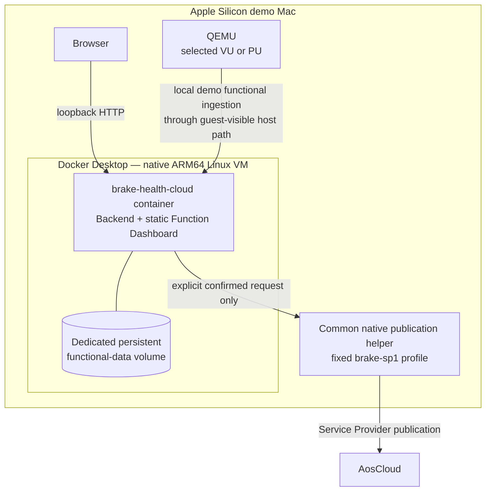
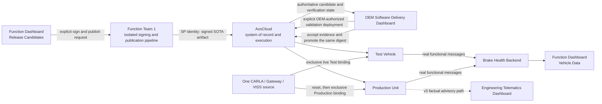

<!-- SPDX-FileCopyrightText: 2026 maninblack -->
<!-- SPDX-License-Identifier: MIT -->

# Brake Health Cloud Product Component Requirements

- Status: D4 design accepted; source foundation complete; next bounded data packet proposed for review
- Package: [`CR-BRAKE-CLOUD`](../component-decomposition-and-interface-register.md#cr-brake-cloud)
- Version: 0.5
- Prepared: 2026-08-19
- Accepted: 2026-08-28
- Owner: Function Team 1 / Service Provider 1 functional Cloud product
- Architecture input: [High-Level Architecture 1.5](../../architecture/high-level-architecture.md)
- Scenario input: [Demo Scenarios 2.0](../../demo/staged-post-sop-brake-health-demo-scenarios.md)
- Flow input: [Architecture Flows 2.0](../../architecture/demo-scenario-architecture-flows.md)
- System-requirements input: [System Requirements 2.0](../system-requirements-and-traceability.md)
- Component-register input: [Component Register 2.0](../component-decomposition-and-interface-register.md)
- Accepted architecture decisions: [ADR 0009](../../architecture/decisions/0009-separate-release-decision-from-cloud-execution.md) and [ADR 0011](../../architecture/decisions/0011-qm-service-containment-and-evidence-backed-oem-approval.md)
- Accepted D4 compatibility input: [D4-007 VDP Compatibility Profile](../../../contracts/vdp-compatibility-profile/vdp-compatibility-profile.v1.json)
- Accepted D4 publication input: [D4-010.3 Artifact Publication Credential Profile](../../../contracts/artifact-publication-profile/artifact-publication-profile.v1.json)
- Accepted D4 v1 logical input: [D4-016.1/.2 decision](../d4-decision-register.md#d4-016) and [Brake Telemetry Window Contract](../../../contracts/brake-telemetry-window/README.md)
- Accepted D4 product contract and design-reviewed hosting boundary: [Brake Cloud API](../../../contracts/brake-cloud-api/README.md) and [Local Demo Hosting and VM Route](../../../contracts/local-demo-hosting/README.md)
- Implementation baseline: public `brake-health-cloud`; isolated source
  foundation commit `68fe61b292b0b9671b1af0dc1881fe37dc5f97de` over governance
  base `6da2926ba96df5e470bfbc3514e983f5d54c3975`
- Repository creation completed: 2026-08-28; the bounded foundation packet is
  complete and `BRAKE-CLOUD-DATA-001` is `PROPOSED — REVIEW REQUIRED` only;
  signing, Cloud, container, VM or Unit mutation is not authorized

## Purpose

This package defines the Function Team 1 Cloud product used to prepare and
present the three Brake Health service releases and to receive the real
functional data produced by those releases. It expands the accepted
`CR-BRAKE-CLOUD` allocation into two components: the automatic Brake Health
Backend and the Brake Health Function Dashboard.

The demonstration is **presenter-controlled and system-executed**. The
presenter manually selects a prepared release candidate and explicitly invokes
sign and publish actions. The real release pipeline signs and publishes the
artifact, AosCloud owns technical verification and lifecycle state, and the
OEM Software Delivery Dashboard owns the separate OEM-authorized deployment
and promotion interaction. Runtime ingestion, reconstruction, persistence and
dashboard updates are automatic and shall never be replaced by manually
fabricated results.

The Function Dashboard may be delivered as one web application with three
visually and logically separated views:

1. **Release Candidates** presents the immutable prepared v1, v2 and v3
   candidates and delegates explicit sign/publish actions to the Function Team
   release pipeline;
2. **Vehicle Data** presents only data and status returned by the Brake Health
   Backend.

This UI grouping does not combine their authorities. The browser is neither a
signing-key store nor an AosCloud lifecycle database, and the functional
backend has no authority to deploy software to a Unit.

For the self-contained demonstration, the logical Function Team Cloud product
is physically hosted on the same Apple Silicon Mac as CARLA and QEMU. The
backend and static dashboard are packaged as one native `linux/arm64` Docker
container with a dedicated persistent data volume. A browser remains a
separate host application. The protected release helper remains a separate
native macOS process. Under D4-010.3, this dashboard surface is pre-bound to
`brake-sp1`; only that helper may read the fixed local mode-`0600` passwordless
PKCS#12 used by installed `aos-signer` 2.0.1. The credential is never copied
or mounted into the container and is not described as Keychain-backed or
non-exportable.

## Reader Summary

| Question | Answer |
| --- | --- |
| What this package owns | Brake Health functional-message ingestion, idempotent v1 window reconstruction, v2/v3 derived-result persistence, query/subscription APIs, version-aware functional presentation, prepared candidate catalogue, presenter controls that delegate signing/publication, and an SP1-scoped Service Logs view over native AosCloud service/crash-log records |
| What this package does not own | In-vehicle Brake Health behavior, model training, CARLA/VISS/KUKSA, artifact compilation during the demo, signing-key custody, authoritative AosCloud log storage or Unit lifecycle state, OEM approval, Unit targeting, deployment, promotion, system/VDP or other-team logs, Engineering Telematics Dashboard or production driver HMI |
| Intended result | A presenter can explain and publish each already-built service version, then show the real change from v1 braking windows to v2 derived health and v3 advisory facts on the Test Vehicle and Production Vehicle |
| Accountable lifecycle owner | Function Team 1 publishes and accepts the exact Test Vehicle result; independent OEM Release Authority authorizes Test deployment and Production rollout outside this product |
| Primary repository | Public `brake-health-cloud`; isolated source foundation `68fe61b` owns the workspace, loopback health/migration seam and fixture-only Dashboard shell; data, ARM64 packaging and live integration remain unimplemented |

## Product Views and Authority

| View or adjacent surface | Presented information or action | Authoritative source | Explicit prohibition |
| --- | --- | --- | --- |
| Release Candidates | Prepared v1-v3 purpose, bytes/metadata digest, requested KUKSA resources, quotas, architecture, required VDP range, functional output and explicit sign/publish controls | Immutable candidate catalogue plus Function Team 1 release pipeline result | No source edit/build, private key in browser, OEM approval or invented Cloud state |
| Vehicle Data | Growing/completed v1 windows; v2/v3 assessment, event and advisory facts; Unit role; source/event time; delivery state | Brake Health Backend | No direct CARLA, VISS, KUKSA or AosCloud query and no manually injected success result |
| Service Logs | Explicit SP1-scoped service-instance/crash-log request, verbatim Cloud state and sanitized bounded preview | AosCloud `/api/v11/service-logs/` through the separate SP1 operational context | No system log, SP2 log, browser credential, second archive or claimed retention duration |
| OEM Software Delivery Dashboard | Technical verification, exact target/evidence, owning-team Test acceptance and independent OEM Release Authority actions for Test deployment and Production rollout | AosCloud and current Unit state | Not implemented by `CR-BRAKE-CLOUD` |
| Engineering Telematics Dashboard | Vehicle/Gateway telemetry and factual v3 advisory receipt/status | Vehicle Gateway VISS endpoint | Not implemented by `CR-BRAKE-CLOUD`; no production driver-display claim |

## Local Demo Deployment Topology

The primary demo mode is containerized. A direct native backend process may be
kept as a development fallback, but it is not a second supported presentation
architecture and must execute the same application, contracts and tests.

The container exposes the dashboard/API only on a host loopback listener. The
VM-to-backend route uses the isolated QEMU guest-visible host path and must not
require a listener exposed to the office, home or customer LAN. The first demo
adds no per-Unit functional-backend credential lifecycle and makes no
production backend-authentication claim; that responsibility belongs to
Function Team 1. D4-020 defines the exact design-reviewed Docker/QEMU route;
two-VM and LAN-negative checks remain live qualification gates.

One demo launcher, owned later by `CR-DEMO`, starts or verifies Docker Desktop,
starts the product container, waits for its health endpoint, starts the native
release helper, and only then opens the browser. The launcher reports a clear
blocked state when Docker Desktop, the volume, the helper or the network route
is unavailable; it never silently falls back to fabricated data.

## Prepared Release Catalogue

All three candidates are compiled, packaged, tested and frozen before the
presentation. Live source modification or compilation is outside the demo.
The unsigned payload and metadata have stable digests before selection; the
signed envelope receives its exact digest when the presenter explicitly
invokes signing. The identical accepted signed bytes and digest are used for
Test Vehicle qualification and Production Vehicle promotion.

| Candidate | Declared VDP compatibility | Requested KUKSA capability | Functional Cloud product | Vehicle-side advisory |
| --- | --- | --- | --- | --- |
| Brake Health v1 | VDP Component v1-v3 | Read/subscribe only to the accepted D4-016 v1 Brake Health paths | Ordered finite `BrakeTelemetryWindow` chunks plus one completion record | None |
| Brake Health v2 | VDP Component v2-v3 | Read/subscribe to the accepted D4-016 v2 subset | `BrakeHealthAssessment` plus threshold/change `BrakeHealthEvent`; no normal v1 high-detail window | None |
| Brake Health v3 | VDP Component v3 only | Accepted reads plus one typed D4-008 Brake Health advisory target | v2 derived products plus correlated advisory fact and synchronization state | One typed QM maintenance advisory request |

The catalogue displays the declared compatibility requirement and actual
observed readiness as evidence. It shall not claim that the current AosCloud
release natively rejects an incompatible SOTA before desired-state change or
transfer. That admission feature remains deferred; the service-side
compatibility/readiness check remains fail closed.

## Presenter-Controlled Release and Evidence Flow

The current demonstration has one visible CARLA/Vehicle Gateway/VISS source,
not two simultaneous vehicles. Test and Production evidence therefore
uses exclusive sequential live binding with an explicit detach and
deterministic reset between roles. Telemetry replay is deferred. `CR-DEMO`
owns the handover mechanism; this package must preserve the exact
source/Unit/run correlation supplied to it.

## Component Boundary

### In scope

- local-demo ingestion of the versioned `IF-FUNC-001` message family;
- schema, version, size, Unit, run, source-time and correlation validation;
- idempotent ordered reconstruction of v1 event-window chunks and completion;
- automatic persistence and query/subscription of growing and completed v1 windows;
- idempotent v2/v3 assessment, event and advisory-fact ingestion;
- original sample/event time, receipt time and synchronization-state preservation;
- current-run persistence, exact preview/delete action and complete R0 deletion scope;
- a Function Team dashboard with separated `Release Candidates` and `Vehicle Data` views;
- an immutable prepared v1-v3 catalogue with human-readable purpose,
  compatibility, permissions, quotas, architecture, digests and outputs;
- explicit, confirmation-gated delegation of sign and publish actions to the
  Function Team 1 release pipeline;
- clear success, pending, offline, partial, duplicate, invalid and failed states;
- one native `linux/arm64` container containing the backend and embedded static
  dashboard, with immutable application image and runtime configuration;
- a dedicated persistent SQLite data volume, explicit health endpoint and
  graceful stop/restart behavior;
- loopback-only browser exposure and an isolated QEMU guest-to-host
  functional-ingestion route without LAN exposure;
- client integration with the common native helper pre-bound to `brake-sp1`,
  with its local PKCS#12 excluded from Git, the browser, container and logs;
- unit tests, contract fixtures, health, logs and operational metrics for owned logic.

### Out of scope

- compiling, rebuilding or changing service sources during the presentation;
- creating the Brake Health service artifact, service metadata or model;
- custody or use of a private signing key inside the browser or backend;
- independent desired-state, Unit, batch, Campaign, approval or native-log storage;
- OEM validation acceptance, deployment approval, target calculation or promotion;
- a temporary replacement for deferred native AosCloud Service-to-FOTA VDP
  Component admission;
- CARLA control, sequential live source handover, deferred telemetry replay,
  VISS, KUKSA or VDP implementation;
- local Brake Health inference, advisory authorization or time-critical decision logic;
- Engineering Telematics Dashboard, IVI, Instrument Cluster or driver acknowledgement;
- live model training or claims of production diagnostic accuracy.
- Docker Desktop implementation or licensing, production public-Cloud hosting,
  Internet exposure, LAN access or multi-host high availability;
- production functional-backend authentication, client certificates and
  credential provisioning/rotation/revocation, which belong to Function Team 1;

### Dependencies and assumptions

| Dependency or assumption | Owner | Required state | Failure consequence |
| --- | --- | --- | --- |
| Versioned functional messages | [`CR-BHS`](brake-health-service.md) | Accepted v1 chunk/completion and v2/v3 derived schemas and idempotency identifiers | Reject/quarantine invalid input; never fabricate a dashboard result |
| Prepared immutable candidates | [`CR-BHS`](brake-health-service.md) release pipeline | v1-v3 ARM64 payload, metadata and tests frozen before the presentation | Candidate cannot be selected or signed |
| Signing and publication pipeline | Function Team 1 / [`IF-LC-002`](../component-decomposition-and-interface-register.md#if-lc-002) | Explicit confirmation, D4-010.3 `brake-sp1` binding, exact candidate/digests, protected local mode-`0600` PKCS#12 and machine-readable result | Wrong profile/candidate/path/URL or custody failure blocks before signing; ambiguous result becomes `UNCERTAIN` and is reconciled without blind retry |
| AosCloud and OEM delivery surface | [`CR-AOS`](aos-lifecycle.md) and [`CR-DEMO`](demo-orchestration.md) | Authoritative verification, target, approval, deployment and promotion state | Release view stops at the last verified pipeline result and directs the presenter to the authoritative surface |
| VDP compatibility | [`CR-VDP`](vehicle-data-platform.md) and [`CR-BHS`](brake-health-service.md) | Candidate-declared range and fail-closed service readiness | Display declared/actual evidence; do not implement local admission control |
| Run and Unit correlation | [`CR-DEMO`](demo-orchestration.md) | Test/Production identities and later accepted run/source-generation binding evidence | Data handling uses exact Unit identity only; composed run or comparative success remains blocked until D4-024 closes |
| One source, two Unit roles | [`CR-DEMO`](demo-orchestration.md) | VU attach/run/detach, deterministic reset/new generation and PU attach/run/detach | Evidence is incomplete; dashboard must not imply two simultaneous CARLA vehicles |
| Engineering advisory evidence | [`CR-GATEWAY`](vehicle-gateway.md) | Gateway VISS is authoritative for v3 advisory receipt/status | Function dashboard shows only its correlated backend fact, never a driver-display claim |
| Apple Silicon container runtime | Docker Desktop on the demo Mac | Running native ARM64 engine, available named volume and health-capable container runtime | Launcher reports blocked; no dashboard/runtime-data success claim |
| QEMU-to-container route | [`CR-DEMO`](demo-orchestration.md) plus this package | Selected VU/PU reaches the correct local endpoint without LAN exposure; reported `system_uid` is correlation-only | Integration gate fails; Unit data stays queued and the dashboard shows offline |
| Native `brake-sp1` publication helper | Function Team 1 release owner | Common session-scoped helper available through a local authenticated boundary; fixed PKCS#12 exists with mode `0600` outside Git and every browser/container/VM/artifact | Sign/publish control is disabled with a factual reason |

## Current Implementation Baseline

| Capability | Current evidence | State for this package |
| --- | --- | --- |
| Repository | Public `brake-health-cloud`; isolated foundation commit `68fe61b` over governance base `6da2926` | Foundation source `CURRENT` on isolated branch; main merge remains Coordinator-owned |
| Backend | Loopback health/readiness server, explicit lifecycle and transactional migration seam; no D4 ingestion/query/admin behavior | Foundation `CURRENT`; data behavior `NEW` |
| Dashboard | Fixture-only Release Candidates, Vehicle Data and Service Logs shell with non-live labels | Foundation `CURRENT`; real adapters/UI `NEW` |
| Candidate catalogue | Service v1-v3 target behavior is specified in `CR-BHS`; no machine-readable UI catalogue exists | `NEW` |
| Signing/publication UI seam | `IF-LC-002` defines the ownership boundary; no isolated helper integration exists | `NEW / QUALIFY` |
| Local Docker runtime | Docker Desktop 4.87.0 / engine 29.7.2 reports native `arm64`/`aarch64` on the current Mac | `CURRENT` host dependency; product image and launcher `NEW` |
| Containerized product | No Dockerfile, Compose definition, health endpoint, image, volume schema or QEMU ingestion qualification exists | `NEW` |
| Contract fixtures | Accepted D4-016/D4-017 message, acknowledgement and cleanup fixtures exist in the solution repository | `CURRENT` read-only inputs; product conformance `NEW` |
| Tests | Foundation has five Node, ten Vitest and four architecture tests plus strict type/build/quality gates | Foundation `CURRENT`; D4 data tests `NEW` |

## Accepted Technology and Implementation Decomposition

The accepted first-demo product is one npm-workspace repository using Node.js
26, npm 11, strict TypeScript, the built-in `node:http`, `node:sqlite` and
`node:test` APIs, plus the same pinned React/Vite/TypeScript frontend baseline
as the Presenter UI. No ORM or heavyweight backend framework is introduced.
The production composition is one native `linux/arm64` container containing
the Node backend and built static Dashboard, with SQLite in the accepted
dedicated `/data` volume.

Repository responsibilities are separated into `apps/backend`,
`apps/dashboard`, framework-independent `packages/domain`, closed contract
types/validators in `packages/contracts`, deterministic fixtures in
`packages/test-support`, forward-only `migrations`, and later deployment files
under `deploy`. The Dashboard may reuse the accepted visual language and exact
dependency versions but must not import Presenter UI source or become an OEM
lifecycle authority.

Implementation proceeds through bounded packets:

1. `BRAKE-CLOUD-FOUNDATION-001` — governance completion, npm workspace,
   TypeScript boundaries, SQLite/migration seam, deterministic test
   architecture and fixture-only three-view shell;
2. `BRAKE-CLOUD-DATA-001` — D4-017 ingestion, durable acknowledgement,
   idempotent persistence/reconstruction, query/SSE projections and cleanup;
3. `BRAKE-CLOUD-UI-001` — complete Release Candidates, Vehicle Data and
   Service Logs states over typed adapters;
4. `BRAKE-CLOUD-INTEGRATION-001` — fixed `brake-sp1` helper adapter,
   AosCloud log adapter, ARM64 container, persistent volume and local route
   configuration; and
5. `BRAKE-CLOUD-QUALIFICATION-001` — restart, two-VM route, LAN-negative,
   current-run cleanup and human UI qualification.

Foundation, data and UI work remain inside this repository. Live helper,
Docker/QEMU route, Cloud and reset operations require their later explicit
gates.

## Testability Boundary

Backend parsing, validation, reconstruction, idempotency, persistence, retention
and query behavior shall be independent of web transport and storage vendor.
Dashboard state derivation shall be independent of browser rendering. Candidate
catalogue validation and release-action state transitions shall be independent
of a real signing key or AosCloud account.

Unit tests inject:

- valid, duplicate, missing, reordered, corrupt and incompatible functional messages;
- deterministic clocks, Unit IDs, run windows, source/event/receipt times and roles;
- in-memory transactional storage with restart and failure points;
- release catalogue entries and malformed digest, permission, quota or compatibility metadata;
- signing/publication helper results including confirmation cancellation,
  timeout, partial result and retry;
- ARM64 image metadata, Compose configuration, loopback port publication,
  volume ownership, health and secret-mount rejection;
- selected-Unit ingestion routes, unauthorized clients, LAN-address probes and
  container/helper restart transitions;
- backend connection, subscription, pagination and retention faults.

Owned logic must run without CARLA, QEMU, AosCloud, a real service, signing
credentials or network access. Contract and integration tests then prove the
real packaged backend, UI and release helper against controlled adjacent
components.

## Interface Summary

| Interface | Direction | Data or command | Contract/version | Failure behavior | Authority |
| --- | --- | --- | --- | --- | --- |
| [Functional message family (`IF-FUNC-001`)](../component-decomposition-and-interface-register.md#if-func-001) | In | v1 ordered chunks/completion; v2/v3 assessments/events/advisory facts | Versioned Function Team 1 schema | Reject/quarantine invalid input; acknowledge only durable accepted state; retry remains bounded in vehicle | Service result plus backend acknowledgement |
| [Function dashboard API (`IF-FUNC-002`)](../component-decomposition-and-interface-register.md#if-func-002) | Bidirectional | Reconstructed v1 windows and persisted v2/v3 results/status, plus exact current-run cleanup preview/delete | Versioned query/subscription and administration API | Expose stale/disconnected/partial state; reject unsafe cleanup scope; never synthesize current values | Brake Health Backend |
| [Native Service logs (`IF-OBS-001`)](../component-decomposition-and-interface-register.md#if-obs-001) | Bidirectional / delegated | Explicit SP1-owned service/crash list/create/read/download/delete | OpenAPI v11 `6.1.26` through separate `brake-sp1` operational allowlist | Wrong owner/type blocks; verbatim Cloud states; bounded sanitized temporary preview only | AosCloud request/file state while retained |
| [Brake Health SOTA publication (`IF-LC-002`)](../component-decomposition-and-interface-register.md#if-lc-002) | Delegated adjacent action | Explicit request to sign/publish one selected immutable candidate; structured result | Function Team 1 release-pipeline contract | Cancel/failure produces no success state; uncertain result requires reconciliation | Service Provider 1 pipeline and AosCloud verification record |
| [Function Team 1 acceptance and OEM Release Authority authorization (`IF-LC-009`)](../component-decomposition-and-interface-register.md#if-lc-009) | Out of package / handoff | Candidate identity and digest are available for Test authorization; accepted Test result is available for Production authorization | OEM Software Delivery Dashboard contract | No local approval control or inferred authorization | Function Team 1 acceptance plus independent Release Authority decisions |

## Verification Strategy

| Level | Purpose | Dependency boundary | Required for this package | Planned evidence |
| --- | --- | --- | --- | --- |
| Unit | Prove catalogue validation, ingestion, reconstruction, idempotency, view-state, release-action and retention logic | Deterministic message, clock, storage, helper and API doubles | Yes | `UT-BRAKE-CLOUD-*` suite |
| Component | Prove packaged backend and dashboard through public APIs and browser behavior | Controlled service producer, storage and release-helper stub | Yes | Backend/UI component suite and health evidence |
| Contract | Prove `IF-FUNC-001`, `IF-FUNC-002` and release-helper schema agreement | Digest-addressed shared fixtures | Yes | Producer/consumer conformance and negative fixtures |
| Integration | Prove real Service v1-v3 ingestion and protected release-helper delegation | Validation environment with accepted adjacent revisions; non-production test credentials | Yes | G2/G3/G4 integration records |
| End-to-end | Prove presenter-controlled publication, VU evidence and same-digest PU promotion without fake runtime data | One live CARLA source used sequentially with proven detach/reset | Yes | `AF-G2-*`, `AF-G3-*`, `AF-G4-*`, `AF-X-SOURCE` and `AF-X-OBS` evidence |

## Requirement Summary

| Requirement | Plain-language obligation | Verification levels | State |
| --- | --- | --- | --- |
| [Separated product views (`REQ-BRAKE-CLOUD-001`)](#req-brake-cloud-001) | Keep release presentation, runtime data and lifecycle authority visibly distinct | Unit, Component, Integration, End-to-end | D3 design-reviewed |
| [Prepared candidate catalogue (`REQ-BRAKE-CLOUD-002`)](#req-brake-cloud-002) | Present immutable v1-v3 candidates without live build or source changes | Unit, Component, Contract, Integration | D3 design-reviewed |
| [Complete candidate metadata (`REQ-BRAKE-CLOUD-003`)](#req-brake-cloud-003) | Show purpose, digests, compatibility, KUKSA access, quotas and outputs before signing | Unit, Component, Contract | D3 design-reviewed |
| [Explicit protected signing and publication (`REQ-BRAKE-CLOUD-004`)](#req-brake-cloud-004) | Delegate a confirmed action to the protected release pipeline and preserve the exact signed digest | Unit, Component, Integration, End-to-end | D3 design-reviewed |
| [No lifecycle authority (`REQ-BRAKE-CLOUD-005`)](#req-brake-cloud-005) | Never own OEM approval, desired state, targeting, deployment or promotion | Unit, Component, Integration | D3 design-reviewed |
| [Idempotent v1 reconstruction (`REQ-BRAKE-CLOUD-006`)](#req-brake-cloud-006) | Reconstruct one finite pre/active/post braking window from ordered or retried chunks | Unit, Component, Contract, Integration | D3 design-reviewed |
| [Live v1 presentation (`REQ-BRAKE-CLOUD-007`)](#req-brake-cloud-007) | Show a factual growing then completed v1 window | Unit, Component, Integration, End-to-end | D3 design-reviewed |
| [Derived v2 data product (`REQ-BRAKE-CLOUD-008`)](#req-brake-cloud-008) | Present assessments/events instead of a normal high-detail v1 stream | Unit, Component, Contract, Integration, End-to-end | D3 design-reviewed |
| [Correlated v3 advisory fact (`REQ-BRAKE-CLOUD-009`)](#req-brake-cloud-009) | Present the backend advisory fact without claiming Gateway/driver display authority | Unit, Component, Contract, Integration, End-to-end | D3 design-reviewed |
| [Offline synchronization and recovery (`REQ-BRAKE-CLOUD-010`)](#req-brake-cloud-010) | Preserve original times and converge idempotently after reconnect | Unit, Component, Integration, End-to-end | D3 design-reviewed |
| [Run, Unit and source correlation (`REQ-BRAKE-CLOUD-011`)](#req-brake-cloud-011) | Bind every accepted result to the exact run, Unit role and source evidence | Unit, Component, Contract, Integration | D3 design-reviewed |
| [Honest VU/PU evidence (`REQ-BRAKE-CLOUD-012`)](#req-brake-cloud-012) | Never imply two simultaneous CARLA vehicles when one source is reused | Unit, Component, Integration, End-to-end | D3 design-reviewed |
| [Complete current-run deletion (`REQ-BRAKE-CLOUD-013`)](#req-brake-cloud-013) | Delete all exact current-run functional data without touching Cloud audit state | Unit, Component, Integration | D3 design-reviewed |
| [Failure, freshness and Service-log visibility (`REQ-BRAKE-CLOUD-014`)](#req-brake-cloud-014) | Show functional failures plus role-scoped native Service-log evidence without fabricated success or a second archive | Unit, Component, Integration, End-to-end | D3 design-reviewed; D4-014 design accepted |
| [Mac-local ARM64 container deployment (`REQ-BRAKE-CLOUD-015`)](#req-brake-cloud-015) | Run backend and static dashboard in one health-checked ARM64 container with persistent data | Unit, Component, Integration | D3 design-reviewed |
| [Local network and signing isolation (`REQ-BRAKE-CLOUD-016`)](#req-brake-cloud-016) | Keep browser local, authenticate VM ingestion and keep the `brake-sp1` credential outside Docker | Unit, Component, Integration, End-to-end | D3 design-reviewed; D4-010.3 accepted |

## Detailed Requirements

### Separated product views

- ID: `REQ-BRAKE-CLOUD-001`
- Statement: The Brake Health Cloud product shall separate the `Release Candidates` and `Vehicle Data` views, identify each view's authoritative source, and prevent runtime backend data from becoming release or lifecycle authority.
- Rationale: Presenter convenience must not collapse Function Team release ownership, backend data and AosCloud lifecycle state into one ambiguous dashboard.
- Parent system requirement: [Authoritative demo surfaces (`SYS-OBS-001`)](../system-requirements-and-traceability.md#sys-obs-001)
- Architecture flow: [Cross-stage evidence (`AF-X-OBS`)](../../architecture/demo-scenario-architecture-flows.md#af-x-obs)
- Components: [`CMP-BRAKE-BE`](../component-decomposition-and-interface-register.md#cmp-brake-be), [`CMP-BRAKE-DASH`](../component-decomposition-and-interface-register.md#cmp-brake-dash)
- Interfaces: [`IF-FUNC-002`](../component-decomposition-and-interface-register.md#if-func-002), adjacent [`IF-LC-002`](../component-decomposition-and-interface-register.md#if-lc-002)
- Verification levels: Unit / Component / Integration / End-to-end
- Required evidence: view/authority labels, access-control matrix and negative UI/API tests
- State: D3 design-reviewed

#### Acceptance criteria

1. Runtime views obtain functional results only from the backend API.
2. Release views label pipeline and AosCloud results distinctly from local catalogue state.
3. Neither view stores or presents an independent OEM approval or Unit desired state.

### Prepared candidate catalogue

- ID: `REQ-BRAKE-CLOUD-002`
- Statement: The Release Candidates view shall expose exactly the Brake Health v1, v2 and v3 entries pinned by the Demo Release Set to producer-owned canonical manifests and immutable prepared artifacts in the local content-addressed store; it shall provide no source-edit, build, metadata-generation, package-content regeneration or fallback operation during the presentation.
- Rationale: The demo shows post-SOP delivery, not a live software-development exercise.
- Parent system requirement: [Immutable release candidates (`SYS-REL-001`)](../system-requirements-and-traceability.md#sys-rel-001)
- Architecture flow: [Independent SOTA 1 delivery (`AF-G2-LC`)](../../architecture/demo-scenario-architecture-flows.md#af-g2-lc)
- Components: [`CMP-BRAKE-DASH`](../component-decomposition-and-interface-register.md#cmp-brake-dash), adjacent [`CMP-BHS`](../component-decomposition-and-interface-register.md#cmp-bhs)
- Interfaces: adjacent [`IF-LC-002`](../component-decomposition-and-interface-register.md#if-lc-002)
- Verification levels: Unit / Component / Contract / Integration
- Required evidence: three producer manifests, pinned release-set entries, prepared/manifest digest verification, content-addressed-store resolution and absence of build/source/metadata mutation controls
- State: D3 design-reviewed; D4-013 catalogue and storage design accepted; schema implementation remains open

#### Acceptance criteria

1. Each candidate catalogue entry resolves to immutable payload and metadata bytes.
2. A missing, changed or digest-mismatched candidate is disabled and visibly rejected.
3. Candidate selection does not modify source, model, metadata or payload bytes.

### Complete candidate metadata

- ID: `REQ-BRAKE-CLOUD-003`
- Statement: Before signing, the Release Candidates view shall present the producer candidate ID, semantic version, prepared artifact SHA-256, RFC-8785 canonical manifest SHA-256, ARM64 architecture, requested KUKSA paths/modes, Aos quotas, required VDP compatibility range, functional output types and v2/v3 synthetic-model identity where applicable.
- Rationale: The audience must see what changes between versions and what authority/resources each candidate requests.
- Parent system requirements: [Service capability compatibility (`SYS-REL-003`)](../system-requirements-and-traceability.md#sys-rel-003), [Evidence-backed final OEM approval (`SYS-REL-010`)](../system-requirements-and-traceability.md#sys-rel-010)
- Architecture flow: [Predictive-function proof (`AF-G3-OB`)](../../architecture/demo-scenario-architecture-flows.md#af-g3-ob)
- Components: [`CMP-BRAKE-DASH`](../component-decomposition-and-interface-register.md#cmp-brake-dash)
- Interfaces: adjacent [`IF-LC-002`](../component-decomposition-and-interface-register.md#if-lc-002)
- Verification levels: Unit / Component / Contract
- Required evidence: catalogue-schema conformance and UI snapshot for all three candidates
- State: D3 design-reviewed

#### Acceptance criteria

1. Every required field is machine validated before the sign control is enabled.
2. v1 and v2 show no advisory write; v3 shows only the accepted typed advisory target.
3. Compatibility is labelled declared/readiness evidence, not current native Cloud admission.

### Explicit protected signing and publication

- ID: `REQ-BRAKE-CLOUD-004`
- Statement: The Release Candidates view shall require explicit presenter confirmation before delegating only one pinned Brake Health candidate ID and expected prepared/manifest SHA-256 values to the common native helper pre-bound to `brake-sp1`; it shall send no profile, credential path, candidate path or Cloud URL. The helper shall resolve and re-hash the allowlisted content-addressed input, use `aos-signer` 2.0.1 and the fixed mode-`0600` PKCS#12, compute the exact signed/uploaded-file SHA-256 and bind the authenticated response to the unique AosCloud Service UUID/version and independently re-read Service Version configuration. Because API 6.1.26 exposes no service-artifact digest, the UI shall label the signed digest as locally verified and shall not call it Cloud-confirmed. Interruption or response loss persists only the current `.run/publication/` receipt, becomes `UNCERTAIN` and is reconciled without blind retry. VU and PU use the same Cloud Service Version; promotion performs no rebuild, re-sign or re-upload.
- Rationale: A visible manual decision is required while cryptographic custody and actual publication remain in their proper boundary.
- Parent system requirements: [Immutable release candidates (`SYS-REL-001`)](../system-requirements-and-traceability.md#sys-rel-001), [role-bound protected publication (`SYS-REL-011`)](../system-requirements-and-traceability.md#sys-rel-011), [OEM-authorized deployment approval (`SYS-REL-008`)](../system-requirements-and-traceability.md#sys-rel-008), [Validate before promotion (`SYS-REL-004`)](../system-requirements-and-traceability.md#sys-rel-004)
- Architecture flow: [Independent SOTA 1 delivery (`AF-G2-LC`)](../../architecture/demo-scenario-architecture-flows.md#af-g2-lc)
- Components: [`CMP-BRAKE-DASH`](../component-decomposition-and-interface-register.md#cmp-brake-dash), adjacent Function Team 1 pipeline
- Interfaces: [`IF-LC-002`](../component-decomposition-and-interface-register.md#if-lc-002)
- Verification levels: Unit / Component / Integration / End-to-end
- Required evidence: D4-010.3 and D4-013 contract/schema validation; confirmation record; exact `brake-sp1` and release-set binding; wrong-profile/candidate/type/path/URL negatives; content-addressed-store and file-exclusion proof; prepared/signed/Service-Version mapping; independent configuration re-read; visible missing-Cloud-digest limitation; current-receipt recovery, no-blind-retry and absence-of-key/PKCS#12-output inspection; same VU/PU Cloud Service Version proof
- State: D3 design-reviewed; D4-010.3 and D4-013 designs accepted; exact schema implementation plus signer and live SOTA qualification remain open

#### Acceptance criteria

1. Cancelled confirmation causes no signing or publication request.
2. A helper timeout or uncertain result is shown as requiring reconciliation and is never converted into success.
3. The locally verified signed/uploaded digest remains bound to the same Cloud Service Version used by both VU and PU; the UI does not claim that the current Cloud API or Unit reports that service-artifact digest, and no rebuild, re-sign or re-upload occurs between lanes.
4. The common helper runs as a native macOS process pre-bound to `brake-sp1`; it alone may read the fixed mode-`0600` PKCS#12, and no key, certificate bundle or caller-selected path enters Docker configuration, image, volume, browser storage or application logs.
5. Technical SP1 publication does not perform OEM Test deployment or Production promotion approval.

### No lifecycle authority

- ID: `REQ-BRAKE-CLOUD-005`
- Statement: The Brake Health Cloud product shall not approve, target, install, validate, promote or roll back Unit software and shall direct those actions and authoritative states to AosCloud through the OEM Software Delivery Dashboard. Its only direct AosCloud operational surface is the D4-014 role-routed `service-logs` list/create/read/download/delete contract for SP1-owned records; it shall keep no independent log state or raw archive.
- Rationale: Function data and convenient candidate selection must not become an alternate lifecycle control plane.
- Parent system requirements: [Team-owned release decisions (`SYS-REL-007`)](../system-requirements-and-traceability.md#sys-rel-007), [Cloud-authoritative delivery dashboard (`SYS-OBS-002`)](../system-requirements-and-traceability.md#sys-obs-002)
- Architecture flow: [Cross-stage evidence (`AF-X-OBS`)](../../architecture/demo-scenario-architecture-flows.md#af-x-obs)
- Components: [`CMP-BRAKE-BE`](../component-decomposition-and-interface-register.md#cmp-brake-be), [`CMP-BRAKE-DASH`](../component-decomposition-and-interface-register.md#cmp-brake-dash)
- Interfaces: out-of-package [`IF-LC-005`](../component-decomposition-and-interface-register.md#if-lc-005), [`IF-LC-009`](../component-decomposition-and-interface-register.md#if-lc-009)
- Verification levels: Unit / Component / Integration
- Required evidence: API/permission inventory, lifecycle-mutation negatives, fixed Service-log allowlist and absence of independent log storage
- State: D3 design-reviewed

#### Acceptance criteria

1. No backend/dashboard credential can perform an OEM Unit lifecycle mutation.
2. The product never stores an independent desired-state, approval or batch database.
3. A candidate published successfully is still labelled not deployed until the authoritative OEM surface reports otherwise.

### Idempotent v1 reconstruction

- ID: `REQ-BRAKE-CLOUD-006`
- Statement: The Backend shall consume the accepted [Brake Telemetry Window Contract](../../../contracts/brake-telemetry-window/README.md) and durably accept, validate, deduplicate and reconstruct each v1 `HARD_BRAKING_EPISODE_V1` from bounded PRE/ACTIVE/POST `WINDOW_CHUNK` messages plus exactly one `WINDOW_COMPLETION`, without duplicating samples or combining different event, Unit, Service-artifact or VDP-contract identities. It shall verify RFC-8785/SHA-256 content/window commitments, treat an identical `(eventId, chunkIndex)` plus digest as a retry, reject/quarantine the same key with different content, and never require a project `demoRunId`.
- Rationale: Retry and reconnect must produce one truthful finite braking episode.
- Parent system requirement: [Bounded v1 Brake Telemetry Window (`SYS-BHS-005`)](../system-requirements-and-traceability.md#sys-bhs-005)
- Architecture flow: [Bounded braking-event acquisition (`AF-G2-RT`)](../../architecture/demo-scenario-architecture-flows.md#af-g2-rt)
- Components: [`CMP-BRAKE-BE`](../component-decomposition-and-interface-register.md#cmp-brake-be)
- Interfaces: [`IF-FUNC-001`](../component-decomposition-and-interface-register.md#if-func-001)
- Verification levels: Unit / Component / Contract / Integration
- Required evidence: shared golden schemas/fixtures plus reconstruction suite covering ordered/reordered, duplicate, missing, conflicting, corrupt and late messages
- State: D4-016.2 logical schema and D4-017 local-transport/durable-ack protocol accepted; implementation/qualification open; production backend authentication is out of scope

#### Acceptance criteria

1. Duplicate identical chunks and completion records are idempotently handled; D4-017 freezes the exact durable acknowledgement response.
2. Missing chunks keep the window incomplete; conflicting duplicates are rejected/quarantined.
3. A schema-valid completion is durably accepted and acknowledged independently
   of projection completeness. The window remains `PARTIAL` and non-terminal
   until every declared chunk index, ordered digest, count, phase bound and
   `windowSha256` is durable and consistent; any inconsistent combined set is
   quarantined and non-terminal.

### Live v1 presentation

- ID: `REQ-BRAKE-CLOUD-007`
- Statement: The Vehicle Data view shall present a v1 window as growing while accepted chunks arrive and terminal only after the Backend has durably accepted the completion record and validated every declared chunk index plus the ordered digest/count/phase/window commitments, with visible PRE/ACTIVE/POST samples, speed, longitudinal acceleration, accelerator/brake pedal positions, Service/VDP versions, Unit role, original event time, delivery state and one of the D4-016.1/.2 completion states. It shall label the event `HARD_BRAKING_EPISODE_V1` and never imply native ABS/AEB/EBS activation or brake-component health.
- Rationale: The first service version visibly proves event-focused Cloud data collection.
- Parent system requirements: [Bounded v1 Brake Telemetry Window (`SYS-BHS-005`)](../system-requirements-and-traceability.md#sys-bhs-005), [Authoritative demo surfaces (`SYS-OBS-001`)](../system-requirements-and-traceability.md#sys-obs-001)
- Architecture flow: [First functional-service proof (`AF-G2-OB`)](../../architecture/demo-scenario-architecture-flows.md#af-g2-ob)
- Components: [`CMP-BRAKE-BE`](../component-decomposition-and-interface-register.md#cmp-brake-be), [`CMP-BRAKE-DASH`](../component-decomposition-and-interface-register.md#cmp-brake-dash)
- Interfaces: [`IF-FUNC-002`](../component-decomposition-and-interface-register.md#if-func-002)
- Verification levels: Unit / Component / Integration / End-to-end
- Required evidence: deterministic progress-state tests and VU/PU dashboard capture
- State: D4-017 factual v1 query/presentation contract accepted; implementation/qualification open

#### Acceptance criteria

1. The first accepted pre-trigger chunk makes the window visible before completion.
2. UI phase and sample counts derive from persisted backend state.
3. Disconnection leaves the last state visibly stale/offline rather than complete or current.

### Derived v2 data product

- ID: `REQ-BRAKE-CLOUD-008`
- Statement: For Service v2 normal operation, the Backend and Vehicle Data view shall ingest and present versioned `BrakeHealthAssessment` and threshold/change `BrakeHealthEvent` messages with model identity, provenance, result, quality and original event time, and shall distinguish this bounded derived product from the v1 high-detail telemetry window.
- Rationale: The audience-visible data-product change proves that processing moved into the vehicle.
- Parent system requirement: [Derived v2 Cloud data product (`SYS-BHS-006`)](../system-requirements-and-traceability.md#sys-bhs-006)
- Architecture flow: [Deterministic local assessment and derived reporting (`AF-G3-RT`)](../../architecture/demo-scenario-architecture-flows.md#af-g3-rt)
- Components: [`CMP-BRAKE-BE`](../component-decomposition-and-interface-register.md#cmp-brake-be), [`CMP-BRAKE-DASH`](../component-decomposition-and-interface-register.md#cmp-brake-dash)
- Interfaces: [`IF-FUNC-001`](../component-decomposition-and-interface-register.md#if-func-001), [`IF-FUNC-002`](../component-decomposition-and-interface-register.md#if-func-002)
- Verification levels: Unit / Component / Contract / Integration / End-to-end
- Required evidence: v2 fixtures, absence-of-normal-v1-window assertion and dashboard comparison
- State: D4-017 v2 derived-message ingestion/presentation contract accepted; implementation/qualification open

#### Acceptance criteria

1. v2 derived messages with valid identity are durably idempotent.
2. Native, derived, estimated and simulated provenance labels remain visible.
3. A normal v2 session does not appear as a v1 raw/high-detail window stream.

### Correlated v3 advisory fact

- ID: `REQ-BRAKE-CLOUD-009`
- Statement: For Service v3, the Backend and Vehicle Data view shall associate the advisory fact with its assessment/event, service/model version, Unit, source event and original time while labelling it as a functional backend fact rather than proof of Gateway receipt, driver display or acknowledgement.
- Rationale: The functional backend and engineering vehicle surface prove different parts of the advisory path.
- Parent system requirements: [Offline local continuity (`SYS-BHS-004`)](../system-requirements-and-traceability.md#sys-bhs-004), [QM service and Gateway containment (`SYS-SEC-007`)](../system-requirements-and-traceability.md#sys-sec-007), [Authoritative demo surfaces (`SYS-OBS-001`)](../system-requirements-and-traceability.md#sys-obs-001)
- Architecture flow: [Local advisory round trip (`AF-G4-RT`)](../../architecture/demo-scenario-architecture-flows.md#af-g4-rt)
- Components: [`CMP-BRAKE-BE`](../component-decomposition-and-interface-register.md#cmp-brake-be), [`CMP-BRAKE-DASH`](../component-decomposition-and-interface-register.md#cmp-brake-dash)
- Interfaces: [`IF-FUNC-001`](../component-decomposition-and-interface-register.md#if-func-001), [`IF-FUNC-002`](../component-decomposition-and-interface-register.md#if-func-002)
- Verification levels: Unit / Component / Contract / Integration / End-to-end
- Required evidence: correlation fixtures and paired Function/Engineering dashboard proof
- State: D4-017 v3 advisory-fact ingestion/presentation contract accepted; implementation/qualification open

#### Acceptance criteria

1. An uncorrelated advisory fact is quarantined or visibly uncorrelated, not attached heuristically.
2. The Function Dashboard never labels the fact as displayed to or acknowledged by a driver.
3. Gateway receipt/status is referenced only from the authoritative Engineering Dashboard evidence.

### Offline synchronization and recovery

- ID: `REQ-BRAKE-CLOUD-010`
- Statement: The Backend shall converge idempotently when delayed v1 chunks/completion or v2/v3 derived messages arrive after functional-backend reconnection, preserve original sample/event times separately from receipt time and expose delayed/offline synchronization state.
- Rationale: Functional-backend transport loss must delay reporting without falsifying event order or stopping local service behavior; it is owner-package qualification, not the first-demo connectivity fault.
- Parent system requirement: [Offline local continuity (`SYS-BHS-004`)](../system-requirements-and-traceability.md#sys-bhs-004)
- Architecture flows: [Service and backend isolation (`AF-G2-FR`)](../../architecture/demo-scenario-architecture-flows.md#af-g2-fr) and [targeted vehicle external-connectivity loss (`AF-X-OFFLINE`)](../../architecture/demo-scenario-architecture-flows.md#af-x-offline)
- Components: [`CMP-BRAKE-BE`](../component-decomposition-and-interface-register.md#cmp-brake-be), [`CMP-BRAKE-DASH`](../component-decomposition-and-interface-register.md#cmp-brake-dash)
- Interfaces: [`IF-FUNC-001`](../component-decomposition-and-interface-register.md#if-func-001), [`IF-FUNC-002`](../component-decomposition-and-interface-register.md#if-func-002)
- Verification levels: Unit / Component / Integration / End-to-end
- Required evidence: disconnect/queue/reconnect tests with duplicate and delayed delivery
- State: D4-017 retry/durable-ack and D4-024 shared evidence design reviewed;
  `BRAKE-CLOUD-DATA-001` covers only immutable source/local/receipt times and
  duplicate/out-of-order facts. Synchronization completion and outbox-drain
  claims remain deferred to later integration/qualification.

#### Acceptance criteria

1. Reconnect completes the same event/result identity rather than creating a new event.
2. Original event time, receipt time and synchronization state remain distinct.
3. Delayed messages outside retention or schema limits fail visibly and do not corrupt accepted data.

### Run, Unit and source correlation

- ID: `REQ-BRAKE-CLOUD-011`
- Statement: Every accepted functional record and dashboard observation shall carry the exact Unit ID and role, service/contract/model versions, source event identity and original/receipt times sufficient for later correlation with CARLA, Gateway and lifecycle evidence. Run/source-generation binding is external orchestration evidence and is not invented as a Brake message, cleanup selector or data-packet success claim.
- Rationale: Similar repeated braking scenarios must remain attributable across VU and PU phases.
- Parent system requirement: [Per-run correlation (`SYS-OBS-004`)](../system-requirements-and-traceability.md#sys-obs-004)
- Architecture flow: [Cross-stage evidence (`AF-X-OBS`)](../../architecture/demo-scenario-architecture-flows.md#af-x-obs)
- Components: [`CMP-BRAKE-BE`](../component-decomposition-and-interface-register.md#cmp-brake-be), [`CMP-BRAKE-DASH`](../component-decomposition-and-interface-register.md#cmp-brake-dash)
- Interfaces: [`IF-FUNC-001`](../component-decomposition-and-interface-register.md#if-func-001), [`IF-FUNC-002`](../component-decomposition-and-interface-register.md#if-func-002)
- Verification levels: Unit / Component / Contract / Integration
- Required evidence: schema constraints, cross-Unit collision tests and retained correlation record
- State: D4-017 common correlation fields and exact Unit-scoped queries
  accepted; Unit-scoped data handling belongs to `BRAKE-CLOUD-DATA-001`, while
  run/source-generation binding remains deferred under D4-024.

#### Acceptance criteria

1. Records missing an exact Unit binding are excluded from audience success views;
   absence of later run/source-generation evidence blocks a composed success claim.
2. VU and PU records with otherwise equal event identifiers cannot collide.
3. Query filters select one exact Unit with stable resource-specific ordering;
   run and source-generation selection is outside the data API.

### Honest VU/PU evidence

- ID: `REQ-BRAKE-CLOUD-012`
- Statement: The Function Dashboard shall present Test Vehicle and Production Vehicle observations as separate sequential live source bindings with distinct execution intervals and generation/frame ranges, and shall not imply that two CARLA vehicles were simultaneously connected when one source was reused. The internal wire role for the Test Vehicle remains `VALIDATION`. Telemetry replay is outside the first implementation.
- Rationale: The demo must show honest qualification/promotion evidence despite one visible simulated vehicle source.
- Parent system requirements: [Exact source-to-Unit binding (`SYS-SRC-001`)](../system-requirements-and-traceability.md#sys-src-001), [Honest single-source presentation (`SYS-SRC-002`)](../system-requirements-and-traceability.md#sys-src-002)
- Architecture flow: [One visible source, two Unit roles (`AF-X-SOURCE`)](../../architecture/demo-scenario-architecture-flows.md#af-x-source)
- Components: [`CMP-BRAKE-DASH`](../component-decomposition-and-interface-register.md#cmp-brake-dash)
- Interfaces: [`IF-FUNC-002`](../component-decomposition-and-interface-register.md#if-func-002)
- Verification levels: Unit / Component / Integration / End-to-end
- Required evidence: role/source/generation labels and an ordered VU attach/run/detach, reset, then PU attach/run/detach demo record
- State: D3 design-reviewed; source-generation/run binding and comparative
  VU/PU success are excluded from `BRAKE-CLOUD-DATA-001` and remain deferred
  until D4-024 provides an accepted watermark/binding contract

#### Acceptance criteria

1. VU and PU observations show distinct Unit IDs and execution intervals.
2. Reused live-source identity, deterministic reset boundary and new generation are labelled explicitly.
3. Any overlap or ambiguous source binding blocks a comparative success claim.

### Complete current-run deletion

- ID: `REQ-BRAKE-CLOUD-013`
- Statement: The Backend shall provide a preview/count for an exact non-wildcard selector and then permanently delete all telemetry windows, assessments, events, advisory facts and dashboard-visible records for the exact current Test Vehicle and Production Vehicle Unit IDs obtained from the provisioning journal. `VALIDATION` remains the internal wire role for the user-facing Test Vehicle. The selector contains the two sorted `system_uid` values only, with no `demoRunId` or time range. After successful R0 it shall retain no matching Brake Health functional history and shall leave authoritative AosCloud lifecycle/audit state untouched.
- Rationale: The next demo needs an empty functional product view; authoritative lifecycle history belongs to AosCloud rather than to this demo backend.
- Parent system requirement: [Clear functional run data (`SYS-RET-002`)](../system-requirements-and-traceability.md#sys-ret-002)
- Architecture flow: [Controlled retirement (`AF-R0-LC`)](../../architecture/demo-scenario-architecture-flows.md#af-r0-lc)
- Components: [`CMP-BRAKE-BE`](../component-decomposition-and-interface-register.md#cmp-brake-be), [`CMP-BRAKE-DASH`](../component-decomposition-and-interface-register.md#cmp-brake-dash)
- Interfaces: [`IF-FUNC-002`](../component-decomposition-and-interface-register.md#if-func-002)
- Verification levels: Unit / Component / Integration
- Required evidence: exact preview, complete current-run deletion, empty-dashboard result, unrelated-data preservation and Cloud audit-boundary tests
- State: D4-017 exact current-Unit reset preview/execute contract accepted; implementation/qualification open

#### Acceptance criteria

1. An empty, wildcard, unsorted, non-two-UID or unresolved Unit selector is rejected.
2. Data outside the exact selected Unit IDs remains unchanged.
3. The operation neither calls nor claims deletion of AosCloud audit/lifecycle records.

### Failure, freshness and Service-log visibility

- ID: `REQ-BRAKE-CLOUD-014`
- Statement: The Backend and Function Dashboard shall distinguish current, growing, complete, delayed, stale, duplicate, partial, quarantined, offline and failed functional states and shall never transform dependency failure, missing data or manually selected candidate state into a runtime success result. A separate Service Logs view shall use only the role-routed `/api/v11/service-logs/` adapter under the SP1 operational context for Service Provider 1-owned service-instance/crash records; preserve documented Cloud states verbatim; sanitize allowlisted structured events; remove bounded temporary downloads; and show `Retention policy not exposed by current API` without keeping a second archive.
- Rationale: A convincing demo must remain truthful during expected faults and transitions.
- Parent system requirements: [Authoritative demo surfaces (`SYS-OBS-001`)](../system-requirements-and-traceability.md#sys-obs-001), [Operational log controls (`SYS-OBS-003`)](../system-requirements-and-traceability.md#sys-obs-003), [Separate on-board and Cloud chronology (`SYS-TIM-002`)](../system-requirements-and-traceability.md#sys-tim-002)
- Architecture flow: [Service and backend isolation (`AF-G2-FR`)](../../architecture/demo-scenario-architecture-flows.md#af-g2-fr)
- Components: [`CMP-BRAKE-BE`](../component-decomposition-and-interface-register.md#cmp-brake-be), [`CMP-BRAKE-DASH`](../component-decomposition-and-interface-register.md#cmp-brake-dash)
- Interfaces: [`IF-FUNC-001`](../component-decomposition-and-interface-register.md#if-func-001), [`IF-FUNC-002`](../component-decomposition-and-interface-register.md#if-func-002), [`IF-OBS-001`](../component-decomposition-and-interface-register.md#if-obs-001)
- Verification levels: Unit / Component / Integration / End-to-end
- Required evidence: functional fault-state matrix; SP1/SP2/system ownership negatives; Service-log create-array, verbatim-state, redaction, download/delete and online/offline/reconnect fixtures; audience-visible negative path
- State: D3 design-reviewed; D4-014 design accepted, live log-lifecycle qualification remains required

#### Acceptance criteria

1. Every non-current state has an explicit reason and authoritative timestamp.
2. Backend or subscription loss preserves the last factual state but marks it stale/offline.
3. Candidate selection or publication alone cannot create a functional window, assessment, event or advisory fact.
4. The Service Logs view cannot request or display Unit system logs or another Service Provider's records and never stores raw downloaded history.

### Mac-local ARM64 container deployment

- ID: `REQ-BRAKE-CLOUD-015`
- Statement: The Brake Health Backend and embedded static Function Dashboard shall be packaged as one immutable native `linux/arm64` application container for Docker Desktop on the demo Mac, expose a bounded health endpoint, persist functional run data in a dedicated external volume and recover factual accepted state across container restart.
- Rationale: One reproducible local package makes the demonstration portable across Apple Silicon Macs without placing the functional Cloud product inside AosVM.
- Parent system requirements: [Authoritative demo surfaces (`SYS-OBS-001`)](../system-requirements-and-traceability.md#sys-obs-001), [Clear functional run data (`SYS-RET-002`)](../system-requirements-and-traceability.md#sys-ret-002)
- Architecture flow: [Cross-stage evidence (`AF-X-OBS`)](../../architecture/demo-scenario-architecture-flows.md#af-x-obs)
- Components: [`CMP-BRAKE-BE`](../component-decomposition-and-interface-register.md#cmp-brake-be), [`CMP-BRAKE-DASH`](../component-decomposition-and-interface-register.md#cmp-brake-dash)
- Interfaces: [`IF-FUNC-001`](../component-decomposition-and-interface-register.md#if-func-001), [`IF-FUNC-002`](../component-decomposition-and-interface-register.md#if-func-002)
- Verification levels: Unit / Component / Integration
- Required evidence: pinned ARM64 image digest, SBOM/license evidence, Compose/config inspection, health/restart test and volume persistence/clear test
- State: D4-020 exact ARM64 container/port/volume baseline design reviewed; implementation and live qualification open

#### Acceptance criteria

1. The built image declares and runs as `linux/arm64` without x86 emulation on the accepted Docker Desktop baseline.
2. Application code and static dashboard are immutable in the image; SQLite/run data is stored only in the dedicated external volume.
3. Health remains failed until schema initialization and required read/write checks succeed, and becomes failed on unrecoverable backend/storage state.
4. Restart preserves accepted current-run data and explicit synchronization state until R0; the separate exact reset operation then satisfies `REQ-BRAKE-CLOUD-013` by deleting it completely.
5. No signing key, publication credential, per-Unit backend client credential or personal absolute path exists in image layers, Compose files, health output or the functional-data volume.

### Local network and signing isolation

- ID: `REQ-BRAKE-CLOUD-016`
- Statement: The local deployment shall publish the browser/dashboard boundary only on host loopback and accept first-demo functional messages only through the qualified isolated QEMU guest-visible host route without LAN exposure. It shall validate the Brake schema, bounds and current VU/PU correlation while explicitly treating reported `system_uid` as correlation rather than authenticated backend identity. Production functional-backend authentication and credential lifecycle belong to Function Team 1 and are outside the first-demo claim. Confirmed signing/publication shall still use only the authenticated common native helper surface pre-bound to `brake-sp1`; the PKCS#12 shall remain outside the Docker image, configuration, container, volume and browser, and the helper shall reject caller-selected profile/path/URL input.
- Rationale: Hosting the Cloud product locally must not expose it whenever the Mac changes office, home or customer networks or weaken signing-key custody.
- Parent system requirements: [Authoritative demo surfaces (`SYS-OBS-001`)](../system-requirements-and-traceability.md#sys-obs-001), [Per-run correlation (`SYS-OBS-004`)](../system-requirements-and-traceability.md#sys-obs-004), [role-bound protected publication (`SYS-REL-011`)](../system-requirements-and-traceability.md#sys-rel-011)
- Architecture flows: [Common release flow (`AF-X-RELEASE`)](../../architecture/demo-scenario-architecture-flows.md#af-x-release) and [one visible source, two Unit roles (`AF-X-SOURCE`)](../../architecture/demo-scenario-architecture-flows.md#af-x-source)
- Components: [`CMP-BRAKE-BE`](../component-decomposition-and-interface-register.md#cmp-brake-be), [`CMP-BRAKE-DASH`](../component-decomposition-and-interface-register.md#cmp-brake-dash), adjacent native Function Team 1 release helper
- Interfaces: [`IF-FUNC-001`](../component-decomposition-and-interface-register.md#if-func-001), [`IF-FUNC-002`](../component-decomposition-and-interface-register.md#if-func-002), adjacent [`IF-LC-002`](../component-decomposition-and-interface-register.md#if-lc-002)
- Verification levels: Unit / Component / Integration
- Required evidence: listener inspection, LAN negative probe, VU/PU local-route ingestion, malformed/cross-function schema rejection, explicit no-backend-security-claim label, helper/profile/file-mode/exclusion inspection, caller-selector negatives and network-change recovery
- State: D4-010.3 accepted and D4-020 helper/local-route profile design reviewed; implementation and live two-VM route qualification remain required

#### Acceptance criteria

1. Browser/dashboard publication is bound to `127.0.0.1` and is not reachable through active Mac LAN addresses.
2. The selected VU or PU reaches the ingestion endpoint through the qualified guest-visible host route without opening a wildcard/LAN listener.
3. Missing, stale, malformed, oversized or cross-function messages are rejected and produce no accepted backend record; `system_uid` is never displayed as cryptographically authenticated.
4. The container contacts the native helper only through the accepted local authenticated boundary; the helper accepts no LAN request and returns no private key, PKCS#12, credential path or raw tool output.
5. Docker, route or helper loss becomes a visible blocked/offline state and recovers without relabelling stale data as current.

## Unit-Test Obligations

| Unit-test obligation | Requirements proved | Behavior and branches | Isolation / doubles | Required assertions | Repository / suite | State |
| --- | --- | --- | --- | --- | --- | --- |
| `UT-BRAKE-CLOUD-001` — View/authority separation | [REQ-BRAKE-CLOUD-001](#req-brake-cloud-001), [REQ-BRAKE-CLOUD-005](#req-brake-cloud-005) | Allowed data sources/actions and prohibited lifecycle mutations | Backend, pipeline and Cloud doubles | Correct labels/routes; no approval/desired-state store or mutation | `brake-health-cloud` unit suite | Design accepted; implementation open |
| `UT-BRAKE-CLOUD-002` — Candidate catalogue integrity | [REQ-BRAKE-CLOUD-002](#req-brake-cloud-002), [REQ-BRAKE-CLOUD-003](#req-brake-cloud-003) | Valid v1-v3, missing field, changed bytes, invalid permission/quota/range | Immutable catalogue fixtures | Enable only exact valid candidates; no build/mutation path | Planned catalogue suite | Design accepted; implementation open |
| `UT-BRAKE-CLOUD-003` — Explicit release action | [REQ-BRAKE-CLOUD-004](#req-brake-cloud-004) | Confirm, cancel, success, failure, timeout, uncertain result, wrong profile/candidate/type/path/URL and retry attempt | D4-010.3 helper/profile fake, Cloud result fake and deterministic clock | Only `brake-sp1` plus an exact catalogue candidate passes; no key/PKCS#12 exposure or blind retry; exact resulting digest; `PUBLISHED` only after Cloud re-read | Planned release-workspace suite | Design accepted; implementation open |
| `UT-BRAKE-CLOUD-004` — v1 reconstruction | [REQ-BRAKE-CLOUD-006](#req-brake-cloud-006) | Ordered/reordered, duplicate, missing, conflicting, corrupt, cross-Unit/Service/VDP and completion-before-chunks cases | Shared D4-016.2 fixtures and transactional store fake | Completion receipt may be durably ACKed while projection stays `PARTIAL`; one terminal digest-verified window only after the complete consistent set; idempotent retry; inconsistent set quarantined non-terminal | Planned backend suite | D4-016.2 and D4-017 accepted; implementation proposed in `BRAKE-CLOUD-DATA-001` |
| `UT-BRAKE-CLOUD-005` — v1 presentation states | [REQ-BRAKE-CLOUD-007](#req-brake-cloud-007) | Empty, growing, delayed, complete, stale and disconnected | Backend-query fixtures | Exact phases/counts/version/role/times and no premature complete | Planned dashboard state suite | Design accepted; implementation open |
| `UT-BRAKE-CLOUD-006` — v2 derived product | [REQ-BRAKE-CLOUD-008](#req-brake-cloud-008) | Assessment/event normal, duplicate, invalid provenance/model and forbidden normal-v1 presentation | v2 contract fixtures | Idempotent result; visible provenance; no v1 stream claim | Planned backend/dashboard suite | Design accepted; implementation open |
| `UT-BRAKE-CLOUD-007` — v3 advisory fact | [REQ-BRAKE-CLOUD-009](#req-brake-cloud-009) | Correlated, missing, conflicting and duplicate advisory facts | v3 fixtures | Correct association and explicit no-driver/Gateway authority label | Planned backend/dashboard suite | Design accepted; implementation open |
| `UT-BRAKE-CLOUD-008` — Delayed/out-of-order data handling | [REQ-BRAKE-CLOUD-010](#req-brake-cloud-010) | Delayed/out-of-order messages, duplicate identity, restart and retention expiry | Store fake and deterministic source/local/receipt clocks | Same identity remains idempotent; original/local/receipt time separation; duplicate/out-of-order facts visible; no synchronization-complete or outbox-drained claim | Planned backend suite | Source-only subset proposed in `BRAKE-CLOUD-DATA-001`; reconnect/drain qualification deferred |
| `UT-BRAKE-CLOUD-009` — Unit correlation isolation | [REQ-BRAKE-CLOUD-011](#req-brake-cloud-011) | Missing Unit binding, equal IDs on Test/Production Units and wrong role | Exact Unit/source-message fixtures | No cross-Unit collision or unassigned success; exact Unit query scope; no fabricated run/source-generation binding | Planned backend suite | Unit subset proposed in `BRAKE-CLOUD-DATA-001`; composed binding deferred under D4-024 |
| `UT-BRAKE-CLOUD-010` — Honest source presentation | [REQ-BRAKE-CLOUD-012](#req-brake-cloud-012) | Sequential live Test/reset/Production, overlap, uncertain detach/reset and ambiguous binding | Source/run evidence fixtures | Correct labels and generation boundaries; overlap/ambiguity blocks comparison | Planned dashboard state suite | Excluded from `BRAKE-CLOUD-DATA-001`; deferred until D4-024 binding/watermark acceptance |
| `UT-BRAKE-CLOUD-011` — Exact current-Unit deletion | [REQ-BRAKE-CLOUD-013](#req-brake-cloud-013) | Preview/execute, exact sorted Test+Production UIDs, empty/wildcard/unsorted/non-two-UID selector, stale/expired token, incomplete deletion and unrelated data | Multi-Unit store fixture | All selected records removed, zero matching rows, unchanged nonmatching digest and no Cloud call; no `demoRunId` or time selector | Planned backend suite | D4-017 annex accepted; implementation proposed in `BRAKE-CLOUD-DATA-001` |
| `UT-BRAKE-CLOUD-012` — Failure/freshness and Service-log state machine | [REQ-BRAKE-CLOUD-014](#req-brake-cloud-014) | Every functional state plus SP1-owned service/crash logs, cross-owner/system negatives, documented log states, array response, redaction, download/delete and offline/reconnect | Deterministic clocks, dependency and role-scoped log API fakes | Explicit reason/time; exact endpoint/owner; no fabricated state, browser credential, secret, second archive or retention-duration claim | Planned backend/dashboard suite | Design accepted; implementation open |
| `UT-BRAKE-CLOUD-013` — Container manifest and persistence policy | [REQ-BRAKE-CLOUD-015](#req-brake-cloud-015) | ARM64 platform, immutable image, health, volume, secret and path policy | Parsed Docker/Compose fixtures and in-memory storage | Correct platform/bind/volume; reject embedded secrets, writable app paths and personal paths | Planned packaging suite | Design accepted; implementation open |
| `UT-BRAKE-CLOUD-014` — Local boundary policy | [REQ-BRAKE-CLOUD-016](#req-brake-cloud-016) | Loopback, isolated local ingestion, schema/function separation, correlation-only `system_uid`, helper/profile identity, PKCS#12 exclusion, LAN and dependency transitions | Listener/message/helper/profile/filesystem/network doubles | Accept valid VU/PU Brake messages only on the local route; reject malformed/cross-function input; claim no backend client authentication; enforce fixed `brake-sp1`, no LAN/caller selector/key exposure and factual recovery | Planned deployment-policy suite | Design accepted; implementation open |

Every obligation is deterministic, blocking and runnable without personal
credentials, network access or a real Cloud/VM/simulator. Test output shall not
contain keys, tokens, raw certificates or unrestricted telemetry dumps.

## Verification Traceability

| Requirement | Unit obligations | Component proof | Contract proof | Integration proof | End-to-end proof |
| --- | --- | --- | --- | --- | --- |
| [REQ-BRAKE-CLOUD-001](#req-brake-cloud-001) | [UT-001](#ut-brake-cloud-001) | Required; three-view route/authority suite | N/A; internal presentation boundary | Required; real backend, log and release-helper boundaries | Required; `AF-X-OBS` |
| [REQ-BRAKE-CLOUD-002](#req-brake-cloud-002) | [UT-002](#ut-brake-cloud-002) | Required; catalogue load/inspection | Required; candidate manifest | Required; prepared v1-v3 artifacts | N/A; implementation readiness proof |
| [REQ-BRAKE-CLOUD-003](#req-brake-cloud-003) | [UT-002](#ut-brake-cloud-002) | Required; metadata UI | Required; service metadata/catalogue | N/A; no live system needed | N/A; D3 metadata proof |
| [REQ-BRAKE-CLOUD-004](#req-brake-cloud-004) | [UT-003](#ut-brake-cloud-003) | Required; release-helper client | Required; D4-010.3 profile/helper conformance | Required; test signing/publication and Cloud reconciliation | Required; G2/G3/G4 exact digest |
| [REQ-BRAKE-CLOUD-005](#req-brake-cloud-005) | [UT-001](#ut-brake-cloud-001) | Required; permission/API inventory | N/A; absence/authority proof | Required; no lifecycle mutation capability | N/A; negative boundary proof |
| [REQ-BRAKE-CLOUD-006](#req-brake-cloud-006) | [UT-004](#ut-brake-cloud-004) | Required; packaged ingestion | Required; `IF-FUNC-001` v1 fixtures | Required; Service v1 | Required; `AF-G2-RT` |
| [REQ-BRAKE-CLOUD-007](#req-brake-cloud-007) | [UT-005](#ut-brake-cloud-005) | Required; dashboard state | N/A; uses proven API | Required; real growing/completed window | Required; `AF-G2-OB` |
| [REQ-BRAKE-CLOUD-008](#req-brake-cloud-008) | [UT-006](#ut-brake-cloud-006) | Required; derived view | Required; v2 fixtures | Required; Service v2 | Required; `AF-G3-RT/OB` |
| [REQ-BRAKE-CLOUD-009](#req-brake-cloud-009) | [UT-007](#ut-brake-cloud-007) | Required; advisory fact view | Required; v3 fixtures | Required; Service v3 plus Engineering evidence | Required; `AF-G4-RT/OB` |
| [REQ-BRAKE-CLOUD-010](#req-brake-cloud-010) | [UT-008](#ut-brake-cloud-008) | Required; packaged restart/convergence | N/A; timing/retry is integration behavior | Required; functional-backend disconnect/reconnect | Required; `AF-X-OFFLINE` vehicle fault |
| [REQ-BRAKE-CLOUD-011](#req-brake-cloud-011) | [UT-009](#ut-brake-cloud-009) | Required; query/correlation | Required; identity fields | Required; VU/PU records | N/A; supports cross-stage evidence |
| [REQ-BRAKE-CLOUD-012](#req-brake-cloud-012) | [UT-010](#ut-brake-cloud-010) | Required; source-label state | N/A; presentation rule | Required; sequential live binding | Required; `AF-X-SOURCE` |
| [REQ-BRAKE-CLOUD-013](#req-brake-cloud-013) | [UT-011](#ut-brake-cloud-011) | Required; retention API | N/A; package-local operation | Required; next-run reset | N/A; operational acceptance |
| [REQ-BRAKE-CLOUD-014](#req-brake-cloud-014) | [UT-012](#ut-brake-cloud-012) | Required; full functional/log state matrix | Required; D4-014 Service-log role/API fixtures | Required; dependency faults plus live SP1 ownership/lifecycle qualification | Required; G2/G4 negative paths and selected log evidence |
| [REQ-BRAKE-CLOUD-015](#req-brake-cloud-015) | [UT-013](#ut-brake-cloud-013) | Required; real ARM64 container/health/volume | N/A; packaging boundary | Required; Docker Desktop restart and reset | N/A; host deployment qualification |
| [REQ-BRAKE-CLOUD-016](#req-brake-cloud-016) | [UT-014](#ut-brake-cloud-014) | Required; listener/helper boundary | Required; ingestion/helper authentication | Required; real VU/PU route and LAN negative probe | Not part of the first-demo connectivity scenario |

## Cross-Cutting Constraints

| Concern | Applicable obligation | Component response | Verification |
| --- | --- | --- | --- |
| Security and authority | [REQ-BRAKE-CLOUD-004](#req-brake-cloud-004), [REQ-BRAKE-CLOUD-005](#req-brake-cloud-005) | Protected signing seam; no browser key; no OEM lifecycle credential or mutation | Unit, inspection, integration |
| Privacy and redaction | [Operational log controls (`SYS-OBS-003`)](../system-requirements-and-traceability.md#sys-obs-003) | Structured allowlisted fields; redact credentials; avoid unrestricted telemetry/log dumps | Unit, component, analysis |
| Resource bounds | [Bounded v1 window (`SYS-BHS-005`)](../system-requirements-and-traceability.md#sys-bhs-005), [Offline continuity (`SYS-BHS-004`)](../system-requirements-and-traceability.md#sys-bhs-004) | Message, window, page, queue, retention and upload bounds frozen at D4 | Unit, load, integration |
| Chronology | [Separate on-board and Cloud chronology (`SYS-TIM-002`)](../system-requirements-and-traceability.md#sys-tim-002) | Preserve event/receipt/sync times and never present backend delivery as part of the local advisory path | Unit, analysis, end-to-end |
| Offline and recovery | [REQ-BRAKE-CLOUD-010](#req-brake-cloud-010) | Idempotent reconnect and explicit delayed/offline state | Unit, integration, end-to-end |
| Observability | [REQ-BRAKE-CLOUD-001](#req-brake-cloud-001), [REQ-BRAKE-CLOUD-014](#req-brake-cloud-014) | Backend is authoritative only for functional data; AosCloud is authoritative for SP1 Service-log state/file while retained; every non-current state is visible | Component, integration, demo |
| Local hosting | [REQ-BRAKE-CLOUD-015](#req-brake-cloud-015), [REQ-BRAKE-CLOUD-016](#req-brake-cloud-016) | Native ARM64 container, persistent volume, loopback UI, authenticated VM route and native D4-010.3 `brake-sp1` helper boundary | Packaging, component, contract, integration |

## Acceptance Record and Version 0.5 Reconciliation

Version 0.3 was revalidated on 2026-08-22 after D4-010.3 accepted the
current-demo artifact-publication profile. `REQ-BRAKE-CLOUD-004`,
`REQ-BRAKE-CLOUD-016`, `UT-BRAKE-CLOUD-003` and `UT-BRAKE-CLOUD-014` now bind
the Release Candidates surface to `brake-sp1`, record the installed
`aos-signer` 2.0.1 file-backed PKCS#12 limitation and forbid caller-selected
profile/path/URL input. The credential remains outside Git, the browser,
Docker, VM images and artifacts; technical SP1 publication still has no OEM
Unit-approval authority.

Version 0.1 was accepted for D3 after reviewers confirmed that:

1. the three-view UI decision is accepted without creating a new lifecycle authority or log archive;
2. Component Register 1.0 includes the prepared candidate catalogue and
   delegated presenter controls within `CMP-BRAKE-DASH` and
   `CR-BRAKE-CLOUD` without creating a new lifecycle authority;
3. all sixteen requirements and fourteen stable unit-test obligations are accepted;
4. the split between protected Function Team signing/publication and OEM
   Software Delivery approval is accepted;
5. the v1/v2/v3 dashboard products and same-digest VU-to-PU rule are accepted;
6. exact D4 schema, retention, authentication and performance decisions are
   assigned without being misrepresented as implemented behavior;
7. the documentation gate passes.

Acceptance of this D3 package does not create the planned repository, sign an
artifact, call AosCloud or mutate either Unit.

Version 0.5 reconciles the package with accepted D4-017 and design-reviewed
D4-020. The functional API, durable store, Dashboard authority, local hosting
topology and cleanup boundaries are design accepted. Repository creation,
implementation and live route/LAN-negative qualification remain separate
gates; this acceptance authorizes none of them by itself.

## Open Issues for D4

The accepted D4-017 API/storage/reset and design-reviewed D4-020
hosting/helper/route packages replace the former undefined design choices.
Rows below are retained only as implementation or live-qualification gates;
they no longer represent open product design.

| Issue | Impact | Owner | Decision gate |
| --- | --- | --- | --- |
| Implement accepted D4-017 `IF-FUNC-001` local transport, endpoint discovery, retry/backoff and durable acknowledgement | Delivery and backend completion still block integration; production authentication is intentionally out of scope | Function Team 1 | Backend implementation and qualification |
| Implement accepted v1 pre/active/post display and chart fields | Dashboard fixtures and presentation remain to be built | Function Team 1 | UI implementation and human review |
| Implement accepted HTTP/SQLite/container deployment boundary | Repository scaffold and component tests remain to be built | Function Team 1 | Repository and implementation packets |
| Implement exact common-helper request/result transport, D4-010.3 `brake-sp1` configuration and authoritative Cloud reconciliation lookup | Accepted profile/custody semantics are closed; executable integration remains open | Function Team 1 security/release owner + Demo Solution | Publication integration packet |
| Exact Docker Desktop startup/wait behavior and accepted minimum version | Demo launcher and colleague reproduction | `CR-DEMO` plus Function Team 1 | Before launcher implementation |
| Qualify the design-reviewed QEMU guest-visible host to loopback-published Docker route | Functional ingestion without LAN exposure | `CR-DEMO` plus Function Team 1 | D4-020 two-VM/LAN-negative qualification |
| Implement accepted SQLite schema, volume, no-backup and forward-only migration policy | Restart, reset and service-version evolution | Function Team 1 | Backend implementation and restart tests |
| Implement accepted exact current-run deletion selector and completeness proof | Storage cleanup and R0 | Function Team 1 plus Demo owner | Backend tests and end-to-end qualification |
| Exact sequential live VU attach/detach, deterministic reset/new generation and PU attach/detach | VU/PU evidence labels and orchestration | `CR-DEMO` | Before source-orchestrator implementation |
| Native AosCloud service-to-VDP admission | Negative dependency scenario | AosEdge platform | Deferred until an official implementing release is available |

## Change Rules

- Editorial clarification preserves stable IDs.
- A material semantic replacement receives a new ID; the old definition is
  retained in a clearly labelled retired section with a replacement link.
- A changed authority, lifecycle, trust boundary, data direction or new HLA
  component follows the Level-C architecture cascade before this package changes.
- A changed behavior inside accepted boundaries follows the Level-B cascade
  and updates requirements, obligations, tests and evidence together.
- Implementation test names may change, but accepted `UT-BRAKE-CLOUD-*`
  obligation IDs and their `REQ-BRAKE-CLOUD-*` mappings remain stable until
  deliberately retired.
