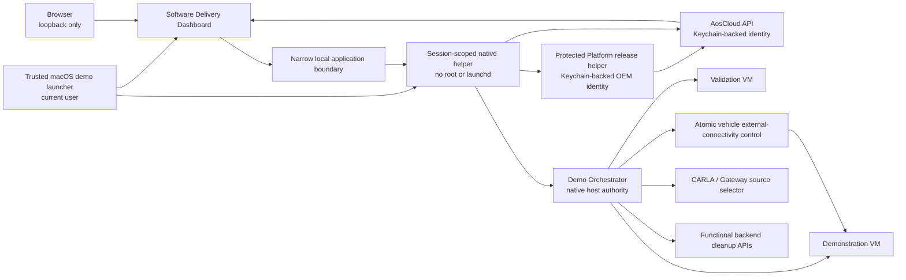

<!-- SPDX-FileCopyrightText: 2026 maninblack -->
<!-- SPDX-License-Identifier: MIT -->

# Demo Orchestration Component Requirements

- Status: D3 design-reviewed
- Package: [`CR-DEMO`](../component-decomposition-and-interface-register.md#cr-demo)
- Version: 0.5
- Prepared: 2026-08-19
- Accepted: 2026-08-20
- Owner: Demo Solution Team
- Architecture input: [High-Level Architecture 1.4](../../architecture/high-level-architecture.md)
- Scenario input: [Demo Scenarios 1.9](../../demo/staged-post-sop-brake-health-demo-scenarios.md)
- Flow input: [Architecture Flows 1.8](../../architecture/demo-scenario-architecture-flows.md)
- System-requirements input: [System Requirements 1.0](../system-requirements-and-traceability.md)
- Component-register input: [Component Register 1.1](../component-decomposition-and-interface-register.md)
- Accepted architecture decisions: [ADR 0009](../../architecture/decisions/0009-separate-release-decision-from-cloud-execution.md) and [ADR 0011](../../architecture/decisions/0011-qm-service-containment-and-evidence-backed-oem-approval.md)
- Accepted D4 source decision: [D4-005 Exclusive Live-Source Assignment](../../../contracts/exclusive-live-source-assignment/exclusive-live-source-assignment.v1.json)
- Accepted D4 VISS decision: [D4-006 VISS Trust and Telemetry Profile](../../../contracts/viss-trust-telemetry-profile/viss-trust-telemetry-profile.v1.json)
- Implementation, signing, Cloud, Unit, VM, or CARLA mutation authorized: no

## Purpose

This package defines the audience-facing software-delivery experience and the
safe local orchestration needed to execute one complete bounded demonstration
run. It expands the accepted `CR-DEMO` allocation into two logical components:

- the OEM Software Delivery Dashboard (`CMP-SW-DASH`), which presents and
  re-reads authoritative AosCloud state, presents prebuilt Platform Team
  candidates, delegates their protected sign/publish operation and exposes
  only explicitly confirmed OEM-authorized Unit operations; and
- the Demo Orchestrator (`CMP-ORCH`), which coordinates factory-derived VM
  overlays, provisioning, Unit roles, one visible CARLA source, ordered release
  stages, evidence correlation, retirement and next-run reset.

Neither component becomes a second lifecycle control plane. AosCloud remains
the system of record for Units, Unit Sets, desired/reported actual state,
batches, Campaigns, approvals, native log requests/results and audit history.
The owning Platform or Function Team makes the release decision, and an
authorized OEM identity confirms every Unit-affecting operation.

## Reader Summary

| Question | Answer |
| --- | --- |
| What this package owns | Local dashboard presentation, explicit confirmation workflow, current-target/evidence validation, run correlation, VM/source orchestration, one atomic vehicle external-connectivity control and safe retirement sequencing |
| What this package does not own | Artifact source/build/package work, signing keys or signing authority, team release decisions, AosCloud lifecycle state, functional data, CARLA/Gateway behavior, VDP/service behavior, native dependency admission or production-fleet policy |
| Intended result | A presenter can execute and explain `M0 -> M1 -> G0 -> G1 -> G2 -> G3 -> G4 -> T1 -> R0` with two honest Unit roles, one visible vehicle source and authoritative evidence |
| Accountable lifecycle owner | Demo Solution Team for facilitation and local orchestration; Platform/Function Teams and authorized OEM roles retain release/deployment authority |
| Primary repository | `aosedge-sdv-demo`; existing launchers are evidence, while the unified dashboard/orchestrator is new work |

## Logical Views and Authority

The Software Delivery Dashboard may use several routes or panels, but each
audience claim has one explicit authority:

| View | Content | Authoritative source | Prohibited claim or action |
| --- | --- | --- | --- |
| Run Overview | Run window, factory digest, VU/DU identities and roles, source binding, current stage and blocked reason | Local run correlation plus fresh AosCloud/launcher reads | No parallel desired state or invented completion |
| Units and Unit Sets | Unit/Node IDs, role, online state, current graph, set membership and membership mismatch | AosCloud current Unit/Unit Set state | No role inference from local VM name alone |
| Platform Releases | Prebuilt, tested and content-frozen VDP v1-v3 candidates: purpose, compatible Factory Image/runtime baseline, unsigned artifact/metadata digests, contract delta, permissions, resource envelope, retained qualification evidence, protected sign/publish control and prepared-to-signed-to-Cloud identity chain | Immutable Platform Team catalogue plus protected pipeline and AosCloud verification results | No source edit, compilation, Yocto/rootfs/container build, package or metadata generation, model training, full qualification run, browser-held key, automatic approval, identity conflation or invented publication result |
| Delivery and Approvals | Signed candidate/metadata digests, requested permissions, owner acceptance, effective recipients, validation evidence, active OEM role and final confirmed Unit operation | Team release evidence plus AosCloud current state | No automatic approval, hidden target or dashboard-owned release decision |
| Lifecycle Activity | Requested and observed lifecycle transitions, source timestamps and unresolved/reconciled outcomes | AosCloud plus correlated local operation journal | No success inferred from request submission and no Cloud-duration KPI |
| Native Logs | Explicit request, processing state, archive metadata, Cloud-retained result and scoped download/delete controls | AosCloud native log APIs and stored request/related-file state | No independent continuous log pipeline, second archive or indefinite-retention claim |
| Coverage and Claims | Sanitized concern catalogue, proof mode, evidence status and claim boundary | Versioned local catalogue plus accepted qualification evidence | No confidential source, customer identity or conversion of `UNKNOWN`/`PLANNED` into proof |
| Retirement | Ordered shutdown, deprovision/delete, Unit Set reconciliation, data/simulation cleanup, overlay disposal and factory-digest verification | AosCloud, local launcher state and owned cleanup results | No OTA rollback or production-fleet deletion claim |

Functional results remain on the Brake Health and Tire Health dashboards.
Vehicle/Gateway telemetry and advisory status remain on the Engineering
Telematics Dashboard. The Software Delivery Dashboard may link to those
surfaces but must not copy their data into a new authoritative store.

## Local Demo Topology

The browser is never given private keys, reusable certificates, VM shell
authority or arbitrary command execution. The local application boundary is
authenticated, loopback-only and allowlists exact operations. Keychain-backed
Cloud access and host VM/process control remain native to macOS; they are not
mounted into a browser or an untrusted container. Whether the UI/backend is a
native process or an ARM64 container plus native helper is a D4 packaging
decision, not a new logical component.

The trusted macOS demo launcher starts the native helper explicitly for one
demo session under the logged-in user identity before it starts the dashboard
backend and opens the browser. The helper is neither root-owned nor installed
as a persistent login/boot daemon. It accepts only the authenticated
session-scoped application channel, is supervised by the launcher, rejects new
operations after session shutdown, and exits when the launcher ends the demo
or after a bounded orphan/idle condition. A later move to persistent `launchd`
operation would require a separate architecture and security review.

An `OEM identity` or `Service Provider identity` names the accountable Cloud
role; it does not assert that API client authentication and artifact signing
use the same certificate, key pair or SDK operation. D4 shall freeze a
credential profile for Platform FOTA, Brake SOTA and Tire SOTA that identifies
the API-authentication credential, artifact-signing credential, certificate
chain/role, protected storage, helper/SDK operation and returned verification
record. Until that profile is qualified, credentials remain logically
separate and no key or certificate reuse is assumed.

The dashboard is stateless with respect to authoritative lifecycle and log
state. Platform candidate signing/publication is performed by the protected
native helper for one exact confirmed digest; technical publication is not
deployment approval. The orchestrator may preserve a minimal restart-safe
operation journal containing run correlation, exact requested operation,
external operation IDs, last observed result and reconciliation status. That
journal is transient recovery context only; every resume decision re-reads the
authoritative external source, and successful R0 deletes the journal rather
than retaining it as demo-run history.

## Component Boundary

### In scope

- create one bounded run identity and correlate local roles before provisioning;
- create two fresh overlays from one verified immutable factory-image digest;
- invoke qualified provisioning once per overlay and reconcile uncertain results;
- bind exact Unit/Node IDs to Validation and Demonstration roles;
- assign and verify run-scoped membership in the persistent Verification and
  Demonstration Unit Sets;
- normalize fresh AosCloud reads into truthful dashboard states;
- present exactly the prebuilt, tested and content-frozen VDP v1-v3 catalogue
  with purpose, exact Factory Image/runtime baseline, contract delta, digests,
  permissions, resource envelope, required evidence and identity chain;
- delegate explicit protected Platform Team signing/publication without
  exposing keys or allowing presentation-time build/repackaging;
- present exact candidates, permissions, evidence, owner decisions, active role
  and current effective recipients before enabling an OEM-authorized action;
- require explicit confirmation, perform one bounded action and re-read Cloud;
- enforce VU-first qualification and identical-digest DU promotion sequencing;
- bind the one visible live CARLA/Gateway source sequentially and exclusively
  to VU, then after detach/reset to DU; telemetry replay is deferred;
- expose one stateful vehicle external-connectivity control that atomically
  blocks/restores DU-to-AosCloud and installed service-to-functional-backend
  paths without interrupting presenter-to-AosCloud or in-vehicle paths;
- request and present native AosCloud log status/results without local archival;
- preserve requested/observed lifecycle facts and reconcile uncertain outcomes without presenting Cloud-operation duration as a vehicle KPI;
- retire Units, reconcile Unit Sets, clear exact functional run data, reset the
  scenario, discard safe overlays and verify the factory digest;
- expose incomplete cleanup and block the next live run until reconciliation;
- present the sanitized automotive-orchestration coverage catalogue honestly;
- provide deterministic unit, contract, component and integration seams.

### Out of scope

- source editing, compilation, Yocto/rootfs/container build, packaging or
  repackaging, metadata generation, model training, or full qualification-test
  execution during presentation;
- Cloud lifecycle, authentication, signing, approval or operator-interaction
  performance benchmarking;
- signing/publishing functional SOTA candidates, which remains owned by each
  Function Team Cloud product and protected Service Provider pipeline;
- making Platform Team or Function Team release decisions;
- storing an independent desired-state, approval, Unit, batch, Campaign or log database;
- implementing a temporary SOTA-to-FOTA admission controller;
- directly modifying KUKSA, VISS, Gateway, CARLA or functional-service behavior;
- presenting local qualification records as functional-safety certification;
- deleting Cloud audit history or confidential/OEM source material;
- production driver HMI, production vehicle manufacturing, Fleet Operator or
  production-fleet deletion policy.

### Dependencies and assumptions

| Dependency or assumption | Owner | Required state | Failure consequence |
| --- | --- | --- | --- |
| OEM Demo Factory Image | `CR-FACTORY` | Accepted immutable digest and fresh-overlay contract | M0 blocked; existing provisioned disks are never substituted |
| Aos lifecycle/API behavior | `CR-AOS` and AosCloud | Qualified identity, Unit Set, batch, Campaign, approval, log and retirement operations | Action disabled or marked `UNKNOWN`; no guessed transition |
| Prepared Platform FOTA candidates | `CR-VDP` and Platform Team release pipeline | Immutable prebuilt v1-v3 bytes/digests, metadata, exact Factory Image/runtime compatibility and current evidence | Platform Releases action disabled on absent/mismatched bytes, baseline or evidence; no build fallback |
| Prepared SOTA candidates | `CR-BHS`, `CR-TIRE` and their Cloud products | Immutable bytes/digests, metadata, owner acceptance and evidence | Delivery stage blocked before OEM confirmation |
| Vehicle Data Platform compatibility | `CR-VDP` plus services | Declared range and fail-closed readiness | Display mismatch and block accepted-graph promotion |
| CARLA/Gateway lifecycle | `CR-VEHICLE-SIM` and `CR-GATEWAY` | Qualified start, source identity, scenario/reset and advisory status boundaries | Source-dependent stage blocked; no second simulated vehicle claim |
| Functional backend cleanup | `CR-BRAKE-CLOUD` and `CR-TIRE-CLOUD` | Exact run/Unit/time selector with preview | R0 remains incomplete; Cloud audit remains untouched |
| Local credential custody | macOS Keychain and role-specific helpers | Exact OEM role selected and credentials not exposed to browser/process logs | Mutating control disabled with factual reason |
| Native Service-to-FOTA VDP Component admission | Future AosCloud release | Current release still supports component-to-component and service-to-layer dependencies but not this cross-lifecycle rule | Negative scenario remains visibly deferred; no local substitute |

## Current Implementation Baseline

| Capability | Current evidence | State for this package |
| --- | --- | --- |
| Main and Validation VM profiles | `scripts/aosvm` and `scripts/r6-1-validation-vm` isolate ports, overlays, state and launchers | `EVIDENCE`; current disks are persistent provisioned assets, not accepted fresh-run overlays |
| Factory-derived overlay safety | Launcher verifies qcow2 backing/digest and protects provisioned overlays from reset/copy | `PARTIAL`; two fresh per-run overlays from the accepted factory artifact are not implemented |
| Single-Node onboarding | `scripts/aosvm-macos-onboard` has preflight, exactly-once attempt journal and post-provision verification | `EVIDENCE`; dual-role orchestration and partial cross-Unit reconciliation are `NEW` |
| Unit Set lifecycle | Previous qualification proves APIs and exposes stale-target risk | `PARTIAL`; persistent-set assignment/reconciliation workflow is `NEW / QUALIFY` |
| Software Delivery Dashboard | Sanitized coverage matrix/schema and documentation exist | Executable dashboard, Cloud read model and approval flow are `NEW` |
| Platform Releases catalogue/helper | Existing provider/component signing evidence and Keychain-backed identity access exist separately | Unified v1-v3 catalogue, protected helper protocol and live publication flow are `NEW / QUALIFY` |
| Cloud lifecycle adapter | User certificate setup and read-only qualification utilities exist | Normalized scoped dashboard API and confirmed mutation seam are `NEW / QUALIFY` |
| Source binding | One CARLA/Gateway source and two Units exist | Sequential exclusive live VU-to-DU handover and evidence are `NEW`; telemetry replay is deferred |
| Vehicle external-connectivity control | No accepted atomic dual-path fault control exists | One stateful control, exact fault-scope probes and synchronized restore are `NEW / QUALIFY` |
| Native logs | AosEdge path is documented as external platform behavior | Dashboard request/status/result qualification is `NEW / QUALIFY` |
| R0 retirement | Individual stop/reset safety mechanisms exist | Deprovision/delete/set reconciliation/backend cleanup/full reset are `NEW / QUALIFY` |
| Workspace checks | Component locks, confidential-input guard, docs and workspace doctor exist | `CURRENT` reusable preflight evidence |

Existing provisioned Unit identities and `.1/.2` runtime evidence must not be
presented as the target per-run manufacturing baseline. They remain valuable
qualification inputs until fresh M0/M1/R0 behavior is implemented.

## Testability Boundary

Dashboard rendering uses a normalized read model independent of the AosCloud
transport. Approval gates, target comparison, stage state, freshness and claim
labels are pure deterministic decisions over versioned fixtures. The
orchestrator separates operation planning from execution and receives injected
Cloud, QEMU, CARLA/Gateway, functional-backend, filesystem, clock and Keychain
adapters.

Unit tests run without Unreal, CARLA, QEMU, AosCloud, Docker, credentials or
network access. They inject current/stale/conflicting Cloud snapshots, two role
manifests, exact candidate/evidence records, timeouts, interrupted operations,
filesystem failures and cleanup results. Contract/integration tests then prove
the real supported APIs and launchers.

## Interface Summary

| Interface | Direction | Data or command | Contract/version | Failure behavior | Authority |
| --- | --- | --- | --- | --- | --- |
| [Software Delivery API (`IF-LC-005`)](../component-decomposition-and-interface-register.md#if-lc-005) | Bidirectional | Scoped reads, decision basis, one confirmed mutation and post-action re-read | D4 normalized AosCloud adapter | Block/`UNKNOWN` on missing, stale or unauthorized state | AosCloud current state |
| [Platform FOTA publication (`IF-LC-001`)](../component-decomposition-and-interface-register.md#if-lc-001) | Delegated adjacent action | Exact selected unsigned VDP candidate plus protected sign/publish result and signed digest | Platform Team pipeline/helper contract | Cancel/failure produces no success; uncertain result requires Cloud reconciliation | Platform Team OEM identity and AosCloud verification record |
| [Cloud-to-Unit lifecycle (`IF-LC-004`)](../component-decomposition-and-interface-register.md#if-lc-004) | External adjacent action | Provisioning, desired state, update delivery, status and retirement | Qualified AosCloud/AosCore contract | Uncertain or unsupported result blocks continuation and requires reconciliation | AosCloud and current Unit state |
| [Platform approval (`IF-LC-008`)](../component-decomposition-and-interface-register.md#if-lc-008) | Handoff | Exact FOTA decision basis and final OEM confirmation | Platform release contract | No mutation without current owner acceptance and OEM role | Platform Team decision plus AosCloud record |
| [Brake approval (`IF-LC-009`)](../component-decomposition-and-interface-register.md#if-lc-009) | Handoff | Exact Brake SOTA decision basis and final OEM confirmation | Function Team 1 release contract | Same fail-closed behavior | Function Team 1 decision plus AosCloud record |
| [Tire approval (`IF-LC-010`)](../component-decomposition-and-interface-register.md#if-lc-010) | Handoff | Exact Tire SOTA decision basis and final OEM confirmation | Function Team 2 release contract | Same fail-closed behavior | Function Team 2 decision plus AosCloud record |
| [Native logs (`IF-OBS-001`)](../component-decomposition-and-interface-register.md#if-obs-001) | Bidirectional | Explicit scoped request and authoritative status/result | Supported AosCloud API | Pending/failed/offline shown; no local substitute archive | AosCloud log state |
| [Orchestrated VM lifecycle (`IF-DEMO-001`)](../component-decomposition-and-interface-register.md#if-demo-001) | Out/local | Overlay, role, start/stop, source and retirement operations | D4 run-manifest and adapter contracts | Preserve evidence and enter reconciliation; never blind retry/delete | Local journal plus fresh external reads |
| [Brake Health dashboard API (`IF-FUNC-002`)](../component-decomposition-and-interface-register.md#if-func-002) | Bidirectional | Exact current-run cleanup preview and permanent-delete request/result | D4 backend administration contract | Empty, wildcard, unresolved or mismatched scope is rejected | Brake Health Backend |
| [Tire Health dashboard API (`IF-TIRE-004`)](../component-decomposition-and-interface-register.md#if-tire-004) | Bidirectional | Exact current-run cleanup preview and permanent-delete request/result | D4 backend administration contract | Empty, wildcard, unresolved or mismatched scope is rejected | Tire Health Backend |

## Verification Strategy

| Level | Purpose | Dependency boundary | Required | Planned evidence |
| --- | --- | --- | --- | --- |
| Unit | Prove dashboard gates, target comparison, stage state, operation plans and recovery branches | All external systems replaced by deterministic doubles | Yes | `UT-DEMO-*` suite |
| Component | Prove local UI/API/orchestrator package, auth, persistence and restart | Controlled fake Cloud/VM/source adapters | Yes | Browser/API/launcher component suite |
| Contract | Prove AosCloud normalization, run manifest, helper and cleanup APIs | Versioned fixtures/conformance harnesses | Yes | D4 contract suites and digests |
| Integration | Prove real Keychain/API, two launchers, Unit Sets, source switching and R0 operations | Dedicated non-production demo environment | Yes | Exact revisions, IDs and redacted operation records |
| End-to-end | Prove the complete staged run on VU then DU and clean R0 | Accepted target graph | Yes | `CR-E2E` retained evidence |

## Requirement Summary

| Requirement | Plain-language obligation | Verification levels | State |
| --- | --- | --- | --- |
| [Bounded run correlation (`REQ-DEMO-001`)](#req-demo-001) | Identify one run before provisioning and bind exact identities afterward | Unit, Contract, Integration | D3 design-reviewed |
| [Fresh dual-overlay preparation (`REQ-DEMO-002`)](#req-demo-002) | Create two clean role-bound overlays from one verified factory digest | Unit, Component, Integration | D3 design-reviewed |
| [Exactly-once provisioning reconciliation (`REQ-DEMO-003`)](#req-demo-003) | Provision each overlay once and reconcile uncertainty before any retry | Unit, Contract, Integration | D3 design-reviewed |
| [Authoritative Unit and Unit Set binding (`REQ-DEMO-004`)](#req-demo-004) | After each run's provisioning, assign the new VU and DU Unit IDs to the two persistent disjoint sets | Unit, Contract, Integration, End-to-end | D3 design-reviewed |
| [Cloud-authoritative dashboard (`REQ-DEMO-005`)](#req-demo-005) | Present fresh AosCloud state without a parallel lifecycle database | Unit, Component, Contract, Integration | D3 design-reviewed |
| [Visible decision basis (`REQ-DEMO-006`)](#req-demo-006) | Show exact candidate, permissions, evidence, owner and OEM role | Unit, Component, Integration, End-to-end | D3 design-reviewed |
| [Effective-recipient guard (`REQ-DEMO-007`)](#req-demo-007) | Derive current pending recipients and block mismatches | Unit, Contract, Integration, End-to-end | D3 design-reviewed |
| [Explicit OEM action and re-read (`REQ-DEMO-008`)](#req-demo-008) | Confirm one authorized mutation and reconcile its authoritative result | Unit, Component, Integration, End-to-end | D3 design-reviewed |
| [Validation-first identical promotion (`REQ-DEMO-009`)](#req-demo-009) | Qualify VU before promoting the exact digest to DU | Unit, Contract, Integration, End-to-end | D3 design-reviewed |
| [Honest single-source binding (`REQ-DEMO-010`)](#req-demo-010) | Run one live CARLA source sequentially on VU, then detach/reset and run it on DU | Unit, Contract, Integration, End-to-end | D3 design-reviewed |
| [Native log request presentation (`REQ-DEMO-011`)](#req-demo-011) | Request and show Cloud-retained scoped AosCloud log state without a second archive | Unit, Component, Integration | D3 design-reviewed |
| [Ordered Unit retirement (`REQ-DEMO-013`)](#req-demo-013) | Deprovision, stop, delete and reconcile both Units safely | Unit, Contract, Integration, End-to-end | D3 design-reviewed |
| [Run-data and simulation cleanup (`REQ-DEMO-014`)](#req-demo-014) | Delete current-run functional data, reset scenario and preserve factory image | Unit, Component, Integration | D3 design-reviewed |
| [Restart-safe partial-failure recovery (`REQ-DEMO-015`)](#req-demo-015) | Preserve uncertain operations temporarily and block the next run until reconciled | Unit, Component, Integration, End-to-end | D3 design-reviewed |
| [Local least-privilege deployment (`REQ-DEMO-016`)](#req-demo-016) | Keep browser local and credentials/host authority in a launcher-owned session helper | Unit, Component, Integration | D3 design-reviewed |
| [Honest coverage and deferred claims (`REQ-DEMO-017`)](#req-demo-017) | Present version-bound evidence state and deferred capabilities without invented proof | Unit, Component, Inspection, End-to-end | D3 design-reviewed |
| [Prepared Platform candidate catalogue (`REQ-DEMO-018`)](#req-demo-018) | Present exactly three frozen VDP candidates with baseline compatibility and complete identity | Unit, Component, Contract, Integration | D3 design-reviewed |
| [Protected Platform publication (`REQ-DEMO-019`)](#req-demo-019) | Delegate one confirmed sign/publish operation over the available presenter control plane | Unit, Component, Integration, End-to-end | D3 design-reviewed |
| [Atomic vehicle external-connectivity control (`REQ-DEMO-020`)](#req-demo-020) | Use one stateful control to disconnect or reconnect all DU external paths together | Unit, Component, Contract, Integration, End-to-end | D3 design-reviewed |
| [AosCore tenant-isolation proof (`REQ-DEMO-021`)](#req-demo-021) | Trigger one prepared Tire CPU load and present authoritative quota/isolation evidence without managing resources | Unit, Component, Contract, Integration, End-to-end | D3 design-reviewed |

## Detailed Requirements

### Bounded run correlation

- ID: `REQ-DEMO-001`
- Statement: Before provisioning, the orchestrator shall create one unique bounded run record containing start time, factory digest and local VU/DU overlay roles; after provisioning it shall bind the exact Unit/Node IDs, establish a unique VISS client identity for each Unit outside the Factory Image/FOTA boundary and preserve the same run window in every dashboard, release, source, functional-data and retirement record. Any local correlation UUID is an opaque implementation detail rather than an architecture-level vehicle identity or retained demo-history key; authoritative post-provision identity remains the exact Unit IDs plus the bounded run window, and successful R0 removes the local record and retires both per-Unit VISS credentials.
- Parents: [per-run correlation (`SYS-OBS-004`)](../system-requirements-and-traceability.md#sys-obs-004) and [one identity per overlay (`SYS-ID-001`)](../system-requirements-and-traceability.md#sys-id-001)
- Flows: [manufacturing (`AF-M0-LC`)](../../architecture/demo-scenario-architecture-flows.md#af-m0-lc) and [provisioning (`AF-M1-LC`)](../../architecture/demo-scenario-architecture-flows.md#af-m1-lc)
- Components/interfaces: `CMP-ORCH`, `CMP-SW-DASH`, `IF-DEMO-001`
- Verification: Unit, Contract, Integration
- Evidence: schema fixture, unique local correlation key, exact role/ID/time/certificate-fingerprint binding, secret-negative proof, R0 credential retirement and collision rejection
- State: D3 design-reviewed; D4-006 per-Unit VISS identity contract accepted

### Fresh dual-overlay preparation

- ID: `REQ-DEMO-002`
- Statement: M0 shall verify the accepted factory-image digest and create exactly two fresh non-provisioned copy-on-write overlays with distinct local role/instance material, restrictive permissions and no reusable Cloud identity; it shall never copy or reset a provisioned overlay.
- Parents: [unique fresh overlays (`SYS-MFG-003`)](../system-requirements-and-traceability.md#sys-mfg-003) and [preserve factory artifact (`SYS-RET-005`)](../system-requirements-and-traceability.md#sys-ret-005)
- Flow: [factory overlays (`AF-M0-LC`)](../../architecture/demo-scenario-architecture-flows.md#af-m0-lc)
- Components/interfaces: `CMP-ORCH`, `IF-DEMO-001`
- Verification: Unit, Component, Integration
- Evidence: backing/digest/permission/identity-absence proof and provisioned-overlay negative cases
- State: D3 design-reviewed

### Exactly-once provisioning reconciliation

- ID: `REQ-DEMO-003`
- Statement: M1 shall invoke qualified single-Node provisioning at most once for each fresh overlay, durably correlate each attempt and the resulting unique AosCloud Unit and Main Node IDs, classify timeout/partial/response-loss outcomes as uncertain and require guest/Cloud reconciliation before retry, disposal or Unit Set role binding.
- Parents: [reconcile partial provisioning (`SYS-ID-002`)](../system-requirements-and-traceability.md#sys-id-002) and [one identity per overlay (`SYS-ID-001`)](../system-requirements-and-traceability.md#sys-id-001)
- Flow: [provisioning lifecycle (`AF-M1-LC`)](../../architecture/demo-scenario-architecture-flows.md#af-m1-lc)
- Components/interfaces: `CMP-ORCH`, `IF-DEMO-001`, `IF-LC-004`
- Verification: Unit, Contract, Integration
- Evidence: success/timeout/response-loss/one-Unit-failure matrix and no-blind-retry proof
- State: D3 design-reviewed

### Authoritative Unit and Unit Set binding

- ID: `REQ-DEMO-004`
- Statement: After both current-run provisioning outcomes are reconciled, the orchestrator shall use the qualified supported AosCloud membership operation to assign the newly created Validation **Unit ID** to the persistent Verification Unit Set and the newly created Demonstration **Unit ID** to the persistent Demonstration Unit Set. Main Node IDs shall be retained and verified as children of their Units but shall not be used as Unit Set members. This run-scoped assignment shall be repeated after provisioning in every demo run; the two Unit Set objects shall remain persistent configuration rather than being recreated per run. Before M1 completes and before every later stage, the orchestrator shall re-read Unit IDs, Node IDs, role, exact disjoint membership, online state and actual software graph from AosCloud and block on prior-run, crossed, duplicate, absent or ambiguous membership.
- Parents: [prove current Unit state (`SYS-ID-003`)](../system-requirements-and-traceability.md#sys-id-003) and [reconcile Unit Sets (`SYS-RET-006`)](../system-requirements-and-traceability.md#sys-ret-006)
- Flows: [provisioning evidence (`AF-M1-OB`)](../../architecture/demo-scenario-architecture-flows.md#af-m1-ob) and [common release (`AF-X-RELEASE`)](../../architecture/demo-scenario-architecture-flows.md#af-x-release)
- Components/interfaces: `CMP-ORCH`, `CMP-SW-DASH`, `IF-LC-005`
- Verification: Unit, Contract, Integration, End-to-end
- Evidence: qualified membership-operation record, exact Unit-versus-Node binding, per-run membership snapshots, persistent-set identity, duplicate/cross-set/prior-run/stale-role negatives and stage preflight
- State: D3 design-reviewed

### Cloud-authoritative dashboard

- ID: `REQ-DEMO-005`
- Statement: The dashboard shall obtain lifecycle and native-log state through scoped supported AosCloud APIs, preserve and expose the exact authoritative source value with object identity, source time, freshness and error, render missing or conflicting state as `UNKNOWN` or blocked, and shall not keep a parallel desired-state, approval, Unit, batch, Campaign or log archive. Friendly labels and local orchestration/acceptance states shall remain visibly separate from verbatim AosCloud state.
- Parents: [Cloud-authoritative dashboard (`SYS-OBS-002`)](../system-requirements-and-traceability.md#sys-obs-002) and [authoritative surfaces (`SYS-OBS-001`)](../system-requirements-and-traceability.md#sys-obs-001)
- Flow: [evidence architecture (`AF-X-OBS`)](../../architecture/demo-scenario-architecture-flows.md#af-x-obs)
- Components/interfaces: `CMP-SW-DASH`, `IF-LC-005`, `IF-OBS-001`
- Verification: Unit, Component, Contract, Integration
- Evidence: normalized read-model fixtures, stale/error states and storage/API inventory
- State: D3 design-reviewed

### Visible decision basis

- ID: `REQ-DEMO-006`
- Statement: Before enabling a Unit-affecting action, the dashboard shall show the exact artifact and metadata digests, requested permissions, compatibility, intended and effective targets, validation evidence/freshness, owning-team acceptance and active OEM role, with every missing or mismatched prerequisite explained.
- Parents: [evidence-backed final approval (`SYS-REL-010`)](../system-requirements-and-traceability.md#sys-rel-010) and [visible decision basis (`SYS-OBS-006`)](../system-requirements-and-traceability.md#sys-obs-006)
- Flow: [common release (`AF-X-RELEASE`)](../../architecture/demo-scenario-architecture-flows.md#af-x-release)
- Components/interfaces: `CMP-SW-DASH`, `IF-LC-005`, `IF-LC-008/009/010`
- Verification: Unit, Component, Integration, End-to-end
- Evidence: complete/absent/stale/mismatch/wrong-role decision matrices and rendered snapshots
- State: D3 design-reviewed

### Effective-recipient guard

- ID: `REQ-DEMO-007`
- Statement: Immediately before confirmation, the dashboard shall read the intended Unit Set, enumerate with complete pagination every Unit in the applicable Fleet/OEM visibility scope, read each Unit's current component and service pending-batch references, derive the exact Unit-ID set referring to the candidate batch and require exact equality with the intended Unit Set. It shall block stale, absent, additional or ambiguous recipients, incomplete pagination or insufficient API visibility; scanning only the intended Unit Set members is insufficient proof.
- Parent: [current effective-target validation (`SYS-REL-002`)](../system-requirements-and-traceability.md#sys-rel-002)
- Flow: [common release (`AF-X-RELEASE`)](../../architecture/demo-scenario-architecture-flows.md#af-x-release)
- Components/interfaces: `CMP-SW-DASH`, `IF-LC-005`
- Verification: Unit, Contract, Integration, End-to-end
- Evidence: OpenAPI contract, complete-pagination and visibility-scope proof, FOTA/SOTA pending-reference fixtures, exact-set match, current/stale/unexpected/missing recipient negatives and fresh corrected-object proof
- State: D3 design-reviewed

### Explicit OEM action and re-read

- ID: `REQ-DEMO-008`
- Statement: A current authorized OEM identity shall explicitly confirm one exact validation, deployment, promotion, Unit Set, log or retirement operation; the system shall assign an idempotency/correlation identity, prevent double submission, represent the local operation as `READY`, `BLOCKED`, `SUBMITTING`, `UNCERTAIN` or `RECONCILING`, and re-read authoritative AosCloud state before assigning a separate `PASSED`, `FAILED` or `ABORTED` acceptance result. These local states shall never replace or be written as an AosCloud lifecycle state.
- Parents: [OEM-authorized approval (`SYS-REL-008`)](../system-requirements-and-traceability.md#sys-rel-008) and [Cloud-authoritative dashboard (`SYS-OBS-002`)](../system-requirements-and-traceability.md#sys-obs-002)
- Flow: [common release (`AF-X-RELEASE`)](../../architecture/demo-scenario-architecture-flows.md#af-x-release)
- Components/interfaces: `CMP-SW-DASH`, `IF-LC-005`, `IF-LC-008/009/010`
- Verification: Unit, Component, Integration, End-to-end
- Evidence: cancel/success/failure/timeout/response-loss/reconciliation records and no-double-submit proof
- State: D3 design-reviewed

### Validation-first identical promotion

- ID: `REQ-DEMO-009`
- Statement: The workflow shall deploy a candidate only to VU first, require accepted component/integration evidence and every applicable owner acceptance, then promote the identical artifact/metadata digests to a freshly revalidated DU target and verify actual readiness.
- Parents: [validate before promotion (`SYS-REL-004`)](../system-requirements-and-traceability.md#sys-rel-004) and [combined-graph owner gate (`SYS-REL-009`)](../system-requirements-and-traceability.md#sys-rel-009)
- Flow: [common release (`AF-X-RELEASE`)](../../architecture/demo-scenario-architecture-flows.md#af-x-release)
- Components/interfaces: `CMP-SW-DASH`, `CMP-ORCH`, `IF-LC-005`
- Verification: Unit, Contract, Integration, End-to-end
- Evidence: VU actual/readiness, owner records, digest identity, DU target and DU actual/readiness
- State: D3 design-reviewed

### Honest single-source binding

- ID: `REQ-DEMO-010`
- Statement: The audience shall see a Validation Vehicle and a Demonstration Vehicle, with exactly one marked `CURRENT VEHICLE`; technical detail maps each to its exact AosCloud Unit/Node/Unit Set. The first demo implementation shall assign the exact live CARLA/Gateway source, contract, authenticated Unit peer, generation and frame range exclusively to VU for qualification, then prove detach, perform a D4-004 canonical reset/new generation with no Unit attached and assign the same live source exclusively to DU for presentation. The primary UI shall offer `Continue with Demonstration Vehicle` and shall not expose attach/detach, VM or source-gate plumbing as vehicle behavior. Both Units may remain Cloud Online. Overlap, uncertain detach/reset or ambiguous ranges shall block evidence and the next assignment. Vehicle role shall not enter the VSS/KUKSA production path. Telemetry replay is deferred and shall not be implemented or claimed in this iteration.
- Parents: [exact source binding (`SYS-SRC-001`)](../system-requirements-and-traceability.md#sys-src-001) and [honest presentation (`SYS-SRC-002`)](../system-requirements-and-traceability.md#sys-src-002)
- Flow: [one visible source (`AF-X-SOURCE`)](../../architecture/demo-scenario-architecture-flows.md#af-x-source)
- Components/interfaces: `CMP-ORCH`, `IF-DEMO-001`
- Executable contract: [Exclusive Live-Source Assignment 1.0.0](../../../contracts/exclusive-live-source-assignment/exclusive-live-source-assignment.v1.json)
- Verification: Unit, Contract, Integration, End-to-end
- Evidence: ordered VU attach/run/detach and DU attach/run/detach records, deterministic reset/new-generation evidence, exact frame ranges, collision lock and honest live-source dashboard label
- State: D3 design-reviewed; D4-005 contract accepted, implementation and qualification open

### Native log request presentation

- ID: `REQ-DEMO-011`
- Statement: The dashboard shall require explicit confirmation for a scoped system, service-instance or crash-log request and present the authoritative Cloud-retained request/status/result/file state, source timestamps, progress, qualified retention duration, explicit deletion effect and request behavior when the target Unit is online or offline. This Unit state shall not be conflated with the presenter Mac control-plane precondition. The dashboard shall keep no second archive, shall remove bounded temporary downloads and shall expose neither secrets, an indefinite-retention claim nor a vehicle-performance claim based on retrieval duration.
- Parent: [operational log controls (`SYS-OBS-003`)](../system-requirements-and-traceability.md#sys-obs-003)
- Flow: [evidence architecture (`AF-X-OBS`)](../../architecture/demo-scenario-architecture-flows.md#af-x-obs)
- Components/interfaces: `CMP-SW-DASH`, `IF-OBS-001`
- Verification: Unit, Component, Integration
- Evidence: role/scope matrix, request polling, success/failure/offline, redaction, Cloud retention policy, delete-with-related-files result and temporary-download removal
- State: D3 design-reviewed; exact live RBAC, retention duration, deletion effect and offline behavior remain D4 qualification gates

### Retired lifecycle timing requirement

- ID: `REQ-DEMO-012`
- Retired parent: [retired lifecycle timing (`SYS-TIM-001`)](../system-requirements-and-traceability.md#sys-tim-001)
- State: Retired from the first-demo scope.
- Replacement: Future
  [Edge Runtime Performance Qualification](../../planning/roadmap.md#future-implementation-workstreams)
  focused on VM/service startup, recovery, local processing and resource
  overhead rather than Cloud lifecycle timing.
- Preserved behavior: operation-specific timeout, uncertainty and
  reconciliation remain in `REQ-DEMO-003`, `REQ-DEMO-008`, `REQ-DEMO-013` and
  `REQ-DEMO-015`; a local timeout is never sufficient evidence of Cloud
  failure.

### Ordered Unit retirement

- ID: `REQ-DEMO-013`
- Statement: R0 shall block new lifecycle actions, close or stop only the current run's active assignments/Campaign execution as the qualified contract requires without deleting Cloud history, capture the final authoritative online snapshot, place VU and DU offline through a qualified bounded local operation and wait until AosCloud reports each `Offline`. It shall then explicitly deprovision each offline Unit through the qualified AosCloud API, reconcile the no-content response by authoritative re-read, perform a bounded reconnect attempt proving retired credentials cannot return either Unit `Online`, leave and stop both VM instances, remove retired Unit Set memberships and delete both Units plus any separately owned Nodes through qualified AosCloud API operations, then re-read active inventory and both persistent Unit Sets and prove that the retired Units are absent and both memberships are empty.
- Parents: [retire Units (`SYS-RET-001`)](../system-requirements-and-traceability.md#sys-ret-001), [identity retirement (`SYS-ID-004`)](../system-requirements-and-traceability.md#sys-id-004) and [reconcile Unit Sets (`SYS-RET-006`)](../system-requirements-and-traceability.md#sys-ret-006)
- Flow: [controlled retirement (`AF-R0-LC`)](../../architecture/demo-scenario-architecture-flows.md#af-r0-lc)
- Components/interfaces: `CMP-ORCH`, `CMP-SW-DASH`, `IF-DEMO-001`, `IF-LC-005`
- Verification: Unit, Contract, Integration, End-to-end
- Evidence: exact API endpoint/method/role/idempotency contract, final online snapshot, Cloud-reported offline precondition, separate offline/deprovision/re-read/credential-reconnect/stop/delete/membership outcomes and final authoritative Cloud snapshot
- State: D3 design-reviewed; current API offline precondition is known, while D4 must qualify the exact offline mechanism, post-204 state, required role, retired-credential behavior, Node ownership, membership effects, idempotency and deprovision/delete ordering before implementation

### Run-data and simulation cleanup

- ID: `REQ-DEMO-014`
- Statement: After identity retirement is reconciled, R0 shall preview exact deletion scope and permanently delete all functional backend/dashboard data belonging to the current run's VU/DU Unit IDs and bounded session time window. It shall retain no historical demo-run telemetry, derived events, advisories or dashboard records, invoke the qualified CARLA/Gateway scenario reset, discard only stopped retired overlays and run-local state, and verify the immutable factory digest remains unchanged. Authoritative AosCloud lifecycle, Batch, Campaign and audit history shall not be deleted by this cleanup.
- Parents: [clear functional data (`SYS-RET-002`)](../system-requirements-and-traceability.md#sys-ret-002), [reset simulation (`SYS-RET-003`)](../system-requirements-and-traceability.md#sys-ret-003), [no rollback or fleet claim (`SYS-RET-004`)](../system-requirements-and-traceability.md#sys-ret-004) and [preserve factory (`SYS-RET-005`)](../system-requirements-and-traceability.md#sys-ret-005)
- Flow: [controlled retirement (`AF-R0-LC`)](../../architecture/demo-scenario-architecture-flows.md#af-r0-lc)
- Components/interfaces: `CMP-ORCH`, `IF-DEMO-001`, `IF-FUNC-002`, `IF-TIRE-004`
- Verification: Unit, Component, Integration
- Evidence: exact dry-run selectors/counts, complete current-run deletion, unrelated-data and Cloud-history negatives, empty dashboards, scenario leak check, overlay handles and factory digest
- State: D3 design-reviewed

### Restart-safe partial-failure recovery

- ID: `REQ-DEMO-015`
- Statement: An interrupted or uncertain provisioning, Cloud mutation, source transition, retirement or cleanup shall retain only a minimal redacted operation journal, record the local operation as `UNCERTAIN`, enter `RECONCILING` after restart and block destructive continuation or the next live run until fresh external reads prove a safe state. Reconciliation shall preserve the exact external source value separately and shall either resume from a proven applied state, permit a new explicit action after proving no application, or remain blocked. The journal is transient recovery state rather than demo history and shall be deleted after successful R0 reconciliation; it shall contain no retained telemetry, functional events, advisories, Cloud audit copy or secret material.
- Parents: [reconcile partial provisioning (`SYS-ID-002`)](../system-requirements-and-traceability.md#sys-id-002) and [retire Units (`SYS-RET-001`)](../system-requirements-and-traceability.md#sys-ret-001)
- Flow: [retirement failures (`AF-R0-FR`)](../../architecture/demo-scenario-architecture-flows.md#af-r0-fr)
- Components/interfaces: `CMP-ORCH`, `CMP-SW-DASH`, `IF-DEMO-001`, `IF-LC-005`
- Verification: Unit, Component, Integration, End-to-end
- Evidence: crash/restart at every side-effect boundary, journal redaction, correct reconcile/block result and successful-journal deletion
- State: D3 design-reviewed

### Local least-privilege deployment

- ID: `REQ-DEMO-016`
- Statement: The trusted macOS demo launcher shall start a session-scoped native helper under the logged-in non-root user before starting the dashboard backend and opening the browser. The product shall expose browser access only on loopback through an authenticated session, keep private keys, reusable certificates, Keychain access and host authority in the native helper boundary, allowlist exact Cloud/VM/source/cleanup operations, reject arbitrary shell/path/URL input and redact all UI, journal and log output. The helper shall not be installed as a persistent `launchd` or login service, shall accept no operation outside its authenticated demo session, and shall stop on orderly demo completion or after a bounded launcher-loss/orphan condition.
- Parents: [Cloud-authoritative dashboard (`SYS-OBS-002`)](../system-requirements-and-traceability.md#sys-obs-002) and [authoritative surfaces (`SYS-OBS-001`)](../system-requirements-and-traceability.md#sys-obs-001)
- Flow: [evidence architecture (`AF-X-OBS`)](../../architecture/demo-scenario-architecture-flows.md#af-x-obs)
- Components/interfaces: `CMP-SW-DASH`, `CMP-ORCH`, `IF-LC-005`, `IF-DEMO-001`
- Verification: Unit, Component, Integration
- Evidence: launcher/helper/backend/browser startup and shutdown order, non-root process identity, no-persistent-service inspection, listener/session/CSRF/allowlist/path/secret-negative tests, launcher-loss/orphan timeout and Keychain boundary inspection
- State: D3 design-reviewed; exact dashboard packaging, helper transport/session protocol and supervision timeout remain D4 gates

### Honest coverage and deferred claims

- ID: `REQ-DEMO-017`
- Statement: The dashboard shall load only the sanitized versioned coverage catalogue; distinguish `UNKNOWN`, `PARTIAL`, `PLANNED`, `DOCUMENTARY_ONLY`, `ACCEPTED` and `STALE`; and show every claim boundary. `ACCEPTED` shall require a concrete evidence ID and verification time bound to the exact subject version/digest, AosEdge platform release and configuration digest. A mismatch or superseding baseline shall automatically render the previous proof `STALE` with a reason rather than retaining a successful state. Released component-to-component and service-to-layer dependencies shall remain visible as supported platform capabilities. Only native Cloud admission of a SOTA service against a required FOTA Vehicle Data Platform Component version shall remain visibly deferred until a qualified AosCloud release provides it; no local admission substitute or confidential source reference is permitted.
- Parents: [authoritative surfaces (`SYS-OBS-001`)](../system-requirements-and-traceability.md#sys-obs-001), [visible decision basis (`SYS-OBS-006`)](../system-requirements-and-traceability.md#sys-obs-006) and deferred [Cloud dependency rejection (`SYS-REL-006`)](../system-requirements-and-traceability.md#sys-rel-006)
- Flows: [evidence architecture (`AF-X-OBS`)](../../architecture/demo-scenario-architecture-flows.md#af-x-obs) and [common release (`AF-X-RELEASE`)](../../architecture/demo-scenario-architecture-flows.md#af-x-release)
- Components/interfaces: `CMP-SW-DASH`, `IF-LC-005`
- Verification: Unit, Component, Inspection, End-to-end
- Evidence: catalogue/schema validation, all six status renderings, missing-evidence and changed-version/digest/platform/configuration stale transitions, confidential-term guard and deferred-feature negative API/action proof
- State: D3 design-reviewed

### Prepared Platform candidate catalogue

- ID: `REQ-DEMO-018`
- Statement: The Platform Releases view shall load exactly the prebuilt, tested and content-frozen VDP Component v1, v2 and v3 candidates. Before publication is enabled, it shall show and validate each purpose; unsigned artifact and metadata digests; `linux/arm64` target; exact compatible OEM Demo Factory Image digest and component-runtime version; backward-compatible versioned signal/advisory contract delta; requested permissions; resource envelope; retained qualification evidence and provenance. The view shall preserve distinct prepared-candidate, signed-artifact and AosCloud component-version identities and present their verified digest/object mapping as one continuous chain without conflating technical publication with Validation deployment or OEM promotion approval. It shall expose no source editor, compiler, Yocto/rootfs/container build, package or metadata generator, model-training or full qualification-test action, repackaging path or hidden alternate candidate; presentation-time work starts only with digest and baseline verification of the selected frozen candidate, and any mismatch blocks publication without a build fallback.
- Parents: [immutable candidates (`SYS-REL-001`)](../system-requirements-and-traceability.md#sys-rel-001), [team-owned decisions (`SYS-REL-007`)](../system-requirements-and-traceability.md#sys-rel-007) and [evidence-backed final approval (`SYS-REL-010`)](../system-requirements-and-traceability.md#sys-rel-010)
- Flows: [VDP v1 lifecycle (`AF-G1-LC`)](../../architecture/demo-scenario-architecture-flows.md#af-g1-lc), [VDP v2 lifecycle (`AF-G3-LC`)](../../architecture/demo-scenario-architecture-flows.md#af-g3-lc) and [VDP v3 lifecycle (`AF-G4-LC`)](../../architecture/demo-scenario-architecture-flows.md#af-g4-lc)
- Components/interfaces: `CMP-SW-DASH`, `CMP-VDP`, `IF-LC-001`
- Verification: Unit, Component, Contract, Integration
- Evidence: exactly-three catalogue manifest/digests, exact Factory Image/runtime bindings, v1-to-v3 compatibility/contract deltas, complete rendered metadata, prepared/signed/Cloud identity-chain fixtures and malformed/missing/mismatched/alternate negatives
- State: D3 design-reviewed; exact catalogue schema, release-storage layout, canonical metadata digest and Cloud returned-identity mapping remain D4 gates

### Protected Platform publication

- ID: `REQ-DEMO-019`
- Statement: After explicit Platform Team confirmation, the Platform Releases view shall delegate exactly one selected prepared candidate plus its verified artifact/metadata digests and Factory Image/runtime binding to an authenticated native helper, and shall preserve the verified identity mapping from prepared candidate through signed artifact/metadata digests to the returned AosCloud component object/version. Presenter Mac/Native Helper connectivity to AosCloud is a required demo precondition: if unavailable, signing/publication is blocked with a factual infrastructure error and is neither presented nor tested as automotive offline behavior. `PUBLISHED` requires an independent authoritative AosCloud re-read. A helper/process interruption or lost local result persistence may produce `UNCERTAIN` and require reconciliation, but this defensive state is not a Dashboard-to-Cloud offline feature. The view shall never access/export private key material and shall visibly separate technical publication from later Validation deployment and promotion approval.
- Parents: [immutable candidates (`SYS-REL-001`)](../system-requirements-and-traceability.md#sys-rel-001), [team-owned release decisions (`SYS-REL-007`)](../system-requirements-and-traceability.md#sys-rel-007) and [Cloud-authoritative dashboard (`SYS-OBS-002`)](../system-requirements-and-traceability.md#sys-obs-002)
- Flow: [common release (`AF-X-RELEASE`)](../../architecture/demo-scenario-architecture-flows.md#af-x-release)
- Components/interfaces: `CMP-SW-DASH`, `IF-LC-001`, `IF-LC-005`
- Verification: Unit, Component, Integration, End-to-end
- Evidence: connectivity preflight/block, confirm/cancel/success/failure, helper/process interruption and lost-local-result reconciliation, independent authoritative Cloud re-read, helper authentication, no-key proof and exact prepared/signed/Cloud identity chain
- State: D3 design-reviewed; exact signing SDK/envelope, credential profiles, helper/result schema, AosCloud publication/verification API and reconciliation lookup remain D4 gates

### Atomic vehicle external-connectivity control

- ID: `REQ-DEMO-020`
- Statement: The demo UI shall expose exactly one stateful `Vehicle External Connectivity` button for the Demonstration Unit. While online it offers `Disconnect Vehicle`; while offline it becomes `Restore Vehicle Connectivity`. Its disconnect transition shall atomically apply one qualified fault policy that blocks both DU-to-AosCloud and every installed service-to-functional-backend path, while preserving presenter-to-AosCloud and simulated in-vehicle connectivity. Its restore transition shall remove the complete policy as one operation. The control shall show `ONLINE`, `TRANSITIONING`, `OFFLINE`, `RECOVERING` or `FAILED/PARTIAL` from independently observed probes and shall never present a partial channel result as vehicle offline/online success. No per-channel connectivity switches shall be exposed.
- Parent: [targeted vehicle external-connectivity continuity (`SYS-OBS-007`)](../system-requirements-and-traceability.md#sys-obs-007)
- Flow: [targeted vehicle external-connectivity loss (`AF-X-OFFLINE`)](../../architecture/demo-scenario-architecture-flows.md#af-x-offline)
- Components/interfaces: `CMP-SW-DASH`, `CMP-ORCH`, `IF-DEMO-001`
- Verification: Unit, Component, Contract, Integration, End-to-end
- Evidence: single-control UI inspection; atomic plan/rollback state-machine fixtures; positive probes for presenter-to-AosCloud and in-vehicle paths; negative probes for DU-to-AosCloud and each installed functional-backend path; partial-apply/removal failures; authoritative AosCloud state; bounded backend queue/synchronization; same-Unit recovery
- State: D3 design-reviewed; exact macOS/QEMU network mechanism, probe set, privilege boundary, atomicity/rollback and recovery timeout remain D4 gates

### AosCore tenant-isolation proof orchestration

- ID: `REQ-DEMO-021`
- Statement: At `T1`, the Software Delivery Dashboard shall read the approved Brake and Tire service quotas plus current usage/status or alert evidence from authoritative AosCloud state, and the Demo Orchestrator shall expose one bounded start/stop action for a prebuilt CPU-load profile inside the actual Tire Health service instance. The action shall not set, override or enforce quotas and shall not introduce a scheduler or resource manager. Success shall be shown only when AosCore caps Tire at its approved CPU quota, Brake Health remains ready and processes the deterministic CARLA event without restart, VDP/KUKSA/Gateway/AosCore remain healthy, and Tire returns to normal after stop without reinstall or restart. Mac-local functional backends and aggregate multi-service-per-provider quotas shall be labelled outside this proof.
- Parent: [AosCore-enforced service-tenant isolation (`SYS-RES-001`)](../system-requirements-and-traceability.md#sys-res-001)
- Flow: [AosCore tenant isolation (`AF-TIRE-RES`)](../../architecture/demo-scenario-architecture-flows.md#af-tire-res)
- Components/interfaces: `CMP-SW-DASH`, `CMP-ORCH`, `IF-DEMO-001`, `IF-LC-005`, `IF-LC-006`
- Verification: Unit, Component, Contract, Integration, End-to-end
- Evidence: exact service/digest and quota metadata; load start/stop identity; Cloud-reported Tire CPU usage/cap and status or alert; concurrent Brake deterministic-event result/readiness; platform health; post-stop Tire recovery; explicit scope labels
- State: D3 design-reviewed; exact metadata mapping, CPU unit/tolerance, Cloud monitoring API and safe in-instance load-control contract remain D4 gates

## Unit-Test Obligations

| Unit-test obligation | Requirements proved | Required behavior and branches | Isolation / doubles | Required assertions | Repository / suite | State |
| --- | --- | --- | --- | --- | --- | --- |
| `UT-DEMO-001` — Run correlation and role binding | `REQ-DEMO-001`, `004` | New run, collision, incomplete and cross-role identity | Deterministic ID/clock and Cloud fixtures | One bounded run; exact IDs/roles; ambiguous state blocked | `aosedge-sdv-demo` | Draft |
| `UT-DEMO-002` — Overlay plan safety | `REQ-DEMO-002` | Valid factory, wrong digest, existing/symlink/provisioned/running target | Filesystem/qcow2/process doubles | Two safe role overlays only; factory unchanged; no secret copy | `aosedge-sdv-demo` | Draft |
| `UT-DEMO-003` — Provisioning reconciliation | `REQ-DEMO-003` | Success, timeout, response loss, one-Unit failure, restart | Provisioning/guest/Cloud doubles | No blind retry; exact uncertain state and reconciliation outcome | `aosedge-sdv-demo` | Draft |
| `UT-DEMO-004` — Unit Set reconciliation | `REQ-DEMO-004`, `013` | Correct new-run Unit membership, attempted Node-ID membership, duplicate, crossed, absent, prior-run, stale and retired membership | Cloud Unit/Node/Set fixtures | Persistent set IDs remain stable; only the two new Unit IDs become exact disjoint members; invalid state blocks; both sets are empty after R0 | `aosedge-sdv-demo` | Draft |
| `UT-DEMO-005` — Authoritative read model | `REQ-DEMO-005` | Current, missing, stale, conflicting, offline and malformed API responses | AosCloud adapter fixtures and clock | Factual source/freshness/error; no parallel desired/log state | `aosedge-sdv-demo` | Draft |
| `UT-DEMO-006` — Decision-basis and coverage gate | `REQ-DEMO-006`, `017` | All six coverage states; complete/missing evidence binding; changed subject version/digest, platform release or configuration; missing permission/owner/role; deferred feature | Candidate/evidence/role/catalogue fixtures | `ACCEPTED` only for an exact current binding; baseline changes become `STALE`; exact blocked reason and claim boundary; no deferred success | `aosedge-sdv-demo` | Draft |
| `UT-DEMO-007` — Effective-target guard | `REQ-DEMO-007` | Exact FOTA/SOTA match, unexpected out-of-set Unit, absent, stale, ambiguous, truncated pagination and insufficient-scope recipients | Paginated Fleet Unit/detail, Unit Set, batch and Campaign fixtures | Every visible applicable Unit is scanned; exact Unit-ID set equality is required; membership-only, incomplete or mismatched results block | `aosedge-sdv-demo` | Draft |
| `UT-DEMO-008` — Confirmed action state machine | `REQ-DEMO-008` | Cancel, success, failure, timeout, response loss, duplicate click, recovery | Mutation adapter, journal and clock doubles | One request identity; no auto approval/retry; post-read required | `aosedge-sdv-demo` | Draft |
| `UT-DEMO-009` — VU-to-DU promotion gate | `REQ-DEMO-009` | DU-first, changed digest, missing owner, stale evidence, target change, success | Release graph and Cloud fixtures | Only identical accepted bytes reach current DU target | `aosedge-sdv-demo` | Draft |
| `UT-DEMO-010` — Source lock and evidence | `REQ-DEMO-010` | VU attach/run/detach, reset/new generation, DU attach/run/detach, overlap, uncertain detach/reset, wrong frame range and orchestrator restart | Live source/handover fixtures | One exact live binding; VU always precedes DU; detach and reset are proven; overlap/ambiguity blocks; honest label | `aosedge-sdv-demo` | Draft |
| `UT-DEMO-011` — Native log request | `REQ-DEMO-011` | Scope/role confirm, pending, failed, offline, redaction, retained result, download and delete | Log API/Keychain/storage fixtures | Authoritative Cloud state; related-file deletion; bounded temporary removal; no second archive, secret or indefinite claim | `aosedge-sdv-demo` | Draft |
| `UT-DEMO-013` — Retirement planner | `REQ-DEMO-013`, `015` | All success plus failure at each ordered side effect, including response loss | Cloud/VM/journal doubles | No unsafe next action; uncertain state preserved only until reconciled; successful journal removed | `aosedge-sdv-demo` | Draft |
| `UT-DEMO-014` — Scoped cleanup | `REQ-DEMO-014` | Preview, exact delete, wildcard, unrelated run, actor leak, open overlay | Backend/CARLA/filesystem doubles | All current-run functional data removed; unrelated data, factory and Cloud audit untouched; dashboards empty | `aosedge-sdv-demo` | Draft |
| `UT-DEMO-015` — Local application boundary | `REQ-DEMO-016` | Launcher startup/shutdown, non-root identity, no persistent daemon, loopback/non-loopback, auth/CSRF, launcher loss/orphan timeout, arbitrary command/path/URL and secret fixtures | Launcher/process/HTTP/helper/Keychain/listener doubles | Correct session order and termination; unauthorized input rejected; no root, persistent helper, key/browser/shell leakage | `aosedge-sdv-demo` | Draft |
| `UT-DEMO-016` — Platform candidate catalogue | `REQ-DEMO-018` | Exact v1-v3 set; missing/duplicate/alternate entry; incomplete metadata; changed artifact/metadata/Factory Image digest; wrong runtime; broken contract compatibility; incomplete identity mapping | Catalogue/schema/release-result fixtures | Exactly three complete frozen baseline-compatible entries; prepared/signed/Cloud identities remain distinct and linked; mismatch blocks; no edit/compile/build/package/metadata/model/test endpoint | `aosedge-sdv-demo` | Draft |
| `UT-DEMO-017` — Protected Platform publication | `REQ-DEMO-019` | Presenter-connectivity preflight, confirm/cancel/success/failure, helper/process interruption, lost local result, `UNCERTAIN` reconciliation, duplicate request and wrong helper identity | Helper/Keychain/Cloud result doubles | Unavailable control plane blocks without a Unit-offline label; one exact candidate; `PUBLISHED` only after independent Cloud re-read; no key access/blind retry; publication distinct from approval | `aosedge-sdv-demo` | Draft |
| `UT-DEMO-018` — Atomic vehicle connectivity | `REQ-DEMO-020` | Disconnect/restore, duplicate click, partial apply/remove, missing backend, stale probe and restart while transitioning | Fault-planner, channel-probe, Cloud and backend fixtures | One visible control; both external channel classes change together; excluded paths stay available; partial state never reports success; restore reconciles the same Unit and queued messages | `aosedge-sdv-demo` | Draft |
| `UT-DEMO-019` — Tenant-isolation proof state | `REQ-DEMO-021` | Start/stop, duplicate request, wrong service, missing/stale quota or metric, uncapped/over-quota result, Tire restart, Brake degradation/restart, platform degradation and partial evidence | Load-control, AosCloud monitoring, Brake event and platform-health fixtures | No project quota mutation; success only for exact Tire service/digest capped at approved quota with healthy Brake/platform and clean post-stop recovery; excluded Mac-backend and aggregate-provider claims remain visible | `aosedge-sdv-demo` | Draft |

### Retired Unit-Test Obligation

| Retired identifier | Replacement | Reason |
| --- | --- | --- |
| `UT-DEMO-012` | Deferred Edge Runtime Performance Qualification | Its parent `REQ-DEMO-012` and Cloud lifecycle timing KPI were retired from first-demo scope; operation-specific uncertainty tests remain under their owning requirements |

Every obligation is deterministic, credential-free, network-free and blocking
in the repository gate. Integration and end-to-end tests add real external
proof; they do not replace these isolated decisions and failure branches.

## Verification Traceability

| Requirement | Unit obligations | Component proof | Contract proof | Integration proof | End-to-end proof |
| --- | --- | --- | --- | --- | --- |
| `REQ-DEMO-001` | `UT-001` | Run API/state | Run-manifest schema | Two-role creation | M0-M1 correlation |
| `REQ-DEMO-002` | `UT-002` | Overlay planner | Factory/overlay contract | Real qcow2 pair | M0 evidence |
| `REQ-DEMO-003` | `UT-003` | Provisioning state machine | Attempt/result schema | Two real fresh Units | M1 evidence |
| `REQ-DEMO-004` | `UT-001`, `UT-004` | Role/set view | Unit/Set adapter | Real disjoint sets | Stage preflights and R0 |
| `REQ-DEMO-005` | `UT-005` | Dashboard states | AosCloud read model | Current account APIs | `AF-X-OBS` |
| `REQ-DEMO-006` | `UT-006` | Decision UI | Candidate/evidence schema | Current roles/evidence | `AF-X-RELEASE` |
| `REQ-DEMO-007` | `UT-007` | Target guard | Recipient derivation fixtures | Real pending state | Release negatives |
| `REQ-DEMO-008` | `UT-008` | Confirm/action UI | Mutation/result schema | Authorized test operation | Every approved transition |
| `REQ-DEMO-009` | `UT-009` | Promotion gate | Release-graph schema | VU then DU | G1-G4/T1 |
| `REQ-DEMO-010` | `UT-010` | Source view/lock | Live handover/run manifest | Real sequential attach/detach/reset | VU/DU functional proof |
| `REQ-DEMO-011` | `UT-011` | Log UI | Native log adapter | Scoped log request | Operational evidence |
| `REQ-DEMO-013` | `UT-004`, `UT-013` | Retirement state machine | Retirement API fixtures | Real qualified deletion | R0 lifecycle |
| `REQ-DEMO-014` | `UT-014` | Cleanup planner | Backend/scenario cleanup contracts | Exact real run cleanup | R0 evidence |
| `REQ-DEMO-015` | `UT-003`, `UT-008`, `UT-013` | Restart/reconcile | Journal schema | Interrupted-operation drills | Recovery path |
| `REQ-DEMO-016` | `UT-015` | Local app package | Helper/auth protocol | Listener/Keychain proof | Security boundary |
| `REQ-DEMO-017` | `UT-006` | Coverage/claim view | Coverage schema | Accepted evidence links | Honest audience narrative |
| `REQ-DEMO-018` | `UT-016` | Platform Releases view | Candidate catalogue schema | Prepared v1-v3 inputs | G1/G3/G4 candidate proof |
| `REQ-DEMO-019` | `UT-017` | Publication state machine | Protected helper/result schema | Test sign/publish and Cloud verify | Exact signed digest handoff |
| `REQ-DEMO-020` | `UT-018` | Connectivity-control state machine | Atomic fault-plan and probe schema | Real dual-path block/restore with excluded-path probes | `AF-X-OFFLINE` same-Unit and backend-synchronization proof |
| `REQ-DEMO-021` | `UT-019` | Isolation-proof state machine | Load-control and quota/monitoring evidence schema | Real Tire cgroup CPU cap with concurrent Brake/platform continuity | `AF-TIRE-RES` audience proof |

## Cross-Cutting Constraints

| Concern | Component response | Verification |
| --- | --- | --- |
| Authority | Team decision, OEM authorization, AosCloud state and dashboard facilitation remain separate | Unit, API inspection, integration |
| Credentials | Role-specific Keychain use; no browser/container secret mount or journal/log value | Unit, secret scan, integration |
| Publication separation | Protected FOTA sign/publish is distinct from evidence-backed validation/promotion approval | Unit, UI/API inspection, integration |
| Target safety | Current pending recipients derived immediately before confirmation | Unit, contract, integration |
| Privacy/redaction | Allowlisted IDs/digests/status; no token, private certificate, confidential source or unrestricted raw log | Unit, static guard, inspection |
| Resource bounds | Dashboard/orchestrator stay bounded; they present but do not enforce Aos service quotas. AosCore is the sole in-vehicle authority | Unit, load, restart and real cgroup integration |
| Vehicle external connectivity | One stateful control atomically blocks/restores DU-to-AosCloud and installed service-to-functional-backend paths; installed functions continue locally, excluded paths remain available and partial application never reports success | Unit, contract, integration, end-to-end |
| Service-tenant isolation | One prepared Tire in-instance CPU load is capped by AosCore while Brake and the platform graph stay healthy; no project resource manager or Mac-backend isolation claim | Unit, contract, integration, end-to-end |
| Presenter control plane | Mac Dashboard/Native Helper connectivity to AosCloud is a demo precondition; loss blocks administrative actions and is never labelled or demonstrated as Unit offline behavior | Unit, preflight, integration |
| Simulated in-vehicle network | Gateway-to-Domain-Controller loss is independent from external Cloud connectivity and produces unavailable vehicle data without a fabricated Cloud state | Unit, integration |
| Destructive safety | Preview, exact selectors, ordered dependencies and fresh state reads precede retirement/cleanup | Unit, contract, integration |

## Open D4 Gates

| Gate | Impact | Owner |
| --- | --- | --- |
| Exact supported AosCloud read/mutation/log endpoints, schemas, roles and idempotency behavior | Dashboard adapter and safe operations | Demo Solution + AosEdge Platform Team |
| Native versus ARM64-container dashboard packaging, narrow local helper transport/session protocol and launcher supervision timeout | Local deployment and security tests; helper remains non-root and session-scoped in either packaging | Demo Solution |
| Role-specific credential profile: API client certificate versus artifact-signing key/certificate, chain, storage, SDK operation and verification record for Platform FOTA, Brake SOTA and Tire SOTA | Prevent credential-purpose ambiguity and prove correct OEM/SP authority | Platform Team + both Function Teams + AosEdge security/API owners |
| Platform v1-v3 catalogue schema, release-storage layout, Factory Image/runtime binding, metadata canonicalization and prepared/signed/AosCloud identity mapping | Platform Releases implementation and evidence | Platform Team + Demo Solution |
| Accepted factory artifact, two-overlay naming/location and per-run host-state layout | M0 and R0 | Platform Team + Demo Solution |
| Qualified two-Unit provisioning, Node ownership and uncertain-result reconciliation | M1 and R0 | Demo Solution + AosEdge Platform Team |
| Persistent Verification/Demonstration Unit Set identities, supported membership-write endpoint/schema, required OEM role, idempotency behavior and mutation ordering | M1 targeting and R0 reset | OEM/AosCloud owner |
| Implement and qualify the accepted sequential live-source assignment, selected-Unit mTLS credential lifecycle, technical drill-down and audience transition | VU/DU functional evidence; contract choices are closed | Demo Solution + Gateway owner; accepted [`D4-005`](../d4-decision-register.md#d4-005) and [`D4-006`](../d4-decision-register.md#d4-006) |
| Functional backend exact-preview and permanent-deletion APIs, including Unit-ID and bounded-time selectors | R0 with no demo-history retention | Both Function Teams |
| CARLA/Gateway reset/start/stop contract | R0 and next run | Simulator/Gateway owner |
| Journal retention/redaction and interrupted-operation recovery policy | Restart safety | Demo Solution |
| Atomic macOS/QEMU vehicle external-connectivity mechanism, exact dual-path selectors, excluded-path probes, privilege boundary, rollback and recovery timeout | `REQ-DEMO-020` and `AF-X-OFFLINE` | Demo Solution + AosCloud integration + both Function Teams |
| Exact service-metadata-to-AosCore quota mapping, CPU units/tolerance, Cloud usage/status or alert API, prepared Tire in-instance load-control contract and Brake/platform unaffected thresholds | `REQ-DEMO-021` and `AF-TIRE-RES` | Demo Solution + AosCore integration + both Function Teams |
| Native Service-to-FOTA VDP Component admission release | Deferred negative demo stage | AosEdge Platform Team |

## Package Acceptance

The package is ready for D3 acceptance when reviewers confirm:

1. dashboard, orchestrator, team-owner and AosCloud authorities are separated;
2. the minimal local journal is recovery evidence, not a desired-state database;
3. the proposed views cover the audience flow without absorbing functional dashboards;
4. every Unit-affecting action is current, evidence-backed, explicit and re-read;
5. one source/two Unit roles and fresh-run Unit Set behavior are honest;
6. R0 ordering cannot delete an uncertain identity or modify the factory image;
7. all twenty active requirements are design-reviewed and eighteen active
   unit-test obligations are defined, while retired `REQ-DEMO-012` and
   `UT-DEMO-012` remain traceable;
8. open D4 choices are visible and no target behavior is labelled current;
9. the documentation quality gate passes.

Acceptance authorizes D4 contract design only. It does not authorize code,
repository mutation, signing, Cloud calls, VM operations, provisioning,
deprovisioning, CARLA control or data deletion.

## D3 Acceptance Record

Version 0.3 was revalidated on 2026-08-20 after the service-tenant isolation
proof was accepted. `REQ-DEMO-021` and `UT-DEMO-019` define one bounded
start/stop action for a prepared CPU load inside the actual Tire instance and
authoritative presentation of AosCore/AosCloud quota, usage and health facts.
The Dashboard and Orchestrator never set or enforce service quotas; Brake and
the shared platform must remain healthy and functional. Mac-local backends and
aggregate multi-service-per-provider quota enforcement are outside the claim.
The package now contains twenty active requirements and eighteen active unit-
test obligations.

Version 0.2 was revalidated on 2026-08-20 after the vehicle-connectivity model
was clarified. `REQ-DEMO-020` and `UT-DEMO-018` add one stateful control that
interrupts/restores DU-to-AosCloud and installed service-to-functional-backend
paths together. Presenter-to-AosCloud and simulated in-vehicle paths remain
available; partial channel state is never accepted. The change adds no
lifecycle authority, product component or per-channel switch.

This revalidation authorizes D4 contract design only. It does not authorize
implementation or external mutation.

### Version 0.1 acceptance

Version 0.1 was accepted on 2026-08-20 after reviewers confirmed all package
acceptance conditions above. The acceptance closes eighteen active component
requirements and defines sixteen active unit-test obligations; retired
`REQ-DEMO-012` and `UT-DEMO-012` remain traceable. Exact contracts, API
schemas, packaging choices and external qualification remain D4 work.

This acceptance authorizes D4 contract design only. It does not authorize
implementation, signing, AosCloud calls, VM or CARLA operations, provisioning,
deprovisioning or data deletion.

## Change Rules

- Editorial clarification preserves stable `REQ-DEMO-*` and `UT-DEMO-*` IDs.
- A semantic replacement receives a new ID and retains the prior mapping.
- Changed authority, trust boundary, component, lifecycle or data direction
  follows the Level-C architecture cascade.
- Changed behavior inside accepted boundaries follows the Level-B cascade and
  updates requirements, fixtures, tests and evidence together.
- Implementation names may change, but accepted obligation IDs remain stable
  until deliberately retired.
