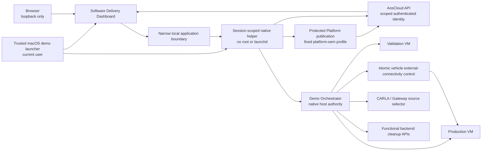

<!-- SPDX-FileCopyrightText: 2026 maninblack -->
<!-- SPDX-License-Identifier: MIT -->

# Demo Orchestration Component Requirements

- Status: D3 design-reviewed
- Package: [`CR-DEMO`](../component-decomposition-and-interface-register.md#cr-demo)
- Version: 1.1
- Prepared: 2026-08-19
- Accepted: 2026-08-20
- Owner: Demo Solution Team
- Architecture input: [High-Level Architecture 1.5](../../architecture/high-level-architecture.md)
- Scenario input: [Demo Scenarios 2.0](../../demo/staged-post-sop-brake-health-demo-scenarios.md)
- Flow input: [Architecture Flows 2.0](../../architecture/demo-scenario-architecture-flows.md)
- System-requirements input: [System Requirements 2.0](../system-requirements-and-traceability.md)
- Component-register input: [Component Register 2.0](../component-decomposition-and-interface-register.md)
- Accepted architecture decisions: [ADR 0009](../../architecture/decisions/0009-separate-release-decision-from-cloud-execution.md) and [ADR 0011](../../architecture/decisions/0011-qm-service-containment-and-evidence-backed-oem-approval.md)
- Accepted D4 Cloud authority input: [D4-011 Cloud Role and Action Matrix](../d4-decision-register.md#d4-011)
- Accepted D4 source decision: [D4-005 Exclusive Live-Source Assignment](../../../contracts/exclusive-live-source-assignment/exclusive-live-source-assignment.v1.json)
- Accepted D4 VISS decision: [D4-006 VISS Trust and Telemetry Profile](../../../contracts/viss-trust-telemetry-profile/viss-trust-telemetry-profile.v1.json)
- Accepted D4 Safe Stop freshness decision: [D4-028](../d4-decision-register.md#d4-028)
- Accepted D4 publication decision: [D4-010.3 Artifact Publication Credential Profile](../../../contracts/artifact-publication-profile/artifact-publication-profile.v1.json)
- Accepted D4 qualification/presentation/update-state decision: [D4-026.1–.19](../d4-decision-register.md#d4-026)
- Accepted D4 run-state and recovery decision: [D4-021 / Demo Run State 1.1.0](../../../contracts/demo-run-state/README.md)
- Prepared D4 functional/hosting review candidates: [Brake Cloud API](../../../contracts/brake-cloud-api/README.md), [Tire Cloud API](../../../contracts/tire-cloud-api/README.md), and [Local Demo Hosting and VM Route](../../../contracts/local-demo-hosting/README.md)
- Implementation, signing, Cloud, Unit, VM, or CARLA mutation authorized: no

## Purpose

This package defines the audience-facing software-delivery experience and the
safe local orchestration needed to execute one complete bounded demonstration
run. It expands the accepted `CR-DEMO` allocation into two logical components:

- the OEM Software Delivery Dashboard (`CMP-SW-DASH`), which presents and
  re-reads authoritative AosCloud state, presents prebuilt Platform Team
  candidates, delegates their protected sign/publish operation and exposes
  only explicitly confirmed OEM-authorized Unit operations, while its
  stateless Representation Layer owns the shared-header meaning and team
  navigation from the same browser read model; and
- the Demo Orchestrator (`CMP-ORCH`), which coordinates factory-derived VM
  overlays, provisioning, Unit roles, one visible CARLA source, ordered release
  stages, evidence correlation, retirement and next-run reset, while its
  trusted Presenter Launcher owns measured physical header/native/browser
  window composition and safe local layout restoration.

Neither component becomes a second lifecycle control plane. AosCloud remains
the system of record for Units, Unit Sets, desired/reported actual state,
batches, Campaigns, approvals, native log requests/results and audit history.
The owning Platform or Function Team makes the Validation acceptance decision,
and independent OEM Release Authority confirms every Unit-affecting operation
through the authorized OEM delivery context.

## Reader Summary

| Question | Answer |
| --- | --- |
| What this package owns | Local dashboard/header presentation, explicit confirmation workflow, current-target/evidence validation, run correlation, VM/source orchestration, measured physical presenter-workspace composition and restoration, one atomic vehicle external-connectivity control and safe retirement sequencing |
| What this package does not own | Artifact source/build/package work, signing keys or signing authority, team release decisions, AosCloud lifecycle state, functional data, CARLA/Gateway behavior, VDP/service behavior, native dependency admission or production-fleet policy |
| Intended result | A presenter can execute and explain `M0 -> M1 -> G0 -> G1 -> G2 -> G3 -> G4 -> T1 -> R0` with two honest Unit roles, one visible vehicle source and authoritative evidence |
| Accountable lifecycle owner | Demo Solution Team for facilitation and local orchestration; Platform/Function Teams retain Validation acceptance, while independent OEM Release Authority retains Test-deployment and Production-rollout authorization |
| Primary repository | `aosedge-sdv-demo`; existing launchers are evidence, while the unified dashboard/orchestrator is new work |

The accepted audience envelope is a planned 30-minute core narrative inside a
45-minute reserved slot, with Q&A separate. The complete M0/M1, G0–G4, T1 and
R0 story and all real preflights, validation, owner/OEM decisions, recipient
checks and authoritative re-reads remain mandatory. The UI may summarize but
not skip or simulate them. Real Cloud waiting remains visible and is evaluated
as presenter usability, not an AosCloud or vehicle performance KPI.

## Logical Views and Authority

The Software Delivery Dashboard may use several routes or panels, but each
audience claim has one explicit authority:

| View | Content | Authoritative source | Prohibited claim or action |
| --- | --- | --- | --- |
| Run Overview | Run window, factory digest, VU/PU identities and roles, source binding, current stage and blocked reason | Local run correlation plus fresh AosCloud/launcher reads | No parallel desired state or invented completion |
| Units and Unit Sets | Unit/Node IDs, role, online state, current graph, set membership and membership mismatch | AosCloud current Unit/Unit Set state | No role inference from local VM name alone |
| Platform Releases | Prebuilt, tested and content-frozen VDP v1-v3 candidates: purpose, compatible Factory Image/runtime baseline, unsigned artifact/metadata digests, contract delta, permissions, resource envelope, retained qualification evidence, protected sign/publish control and prepared-to-signed-to-Cloud identity chain | Immutable Platform Team catalogue plus protected pipeline and AosCloud verification results | No source edit, compilation, Yocto/rootfs/container build, package or metadata generation, model training, full qualification run, browser-held key, automatic approval, identity conflation or invented publication result |
| Delivery and Approvals | Signed candidate/metadata digests, requested permissions, owner acceptance, effective recipients, validation evidence, active OEM role and final confirmed Unit operation | Team release evidence plus AosCloud current state | No automatic approval, hidden target or dashboard-owned release decision |
| Lifecycle Activity | Requested and observed lifecycle transitions, source timestamps and unresolved/reconciled outcomes | AosCloud plus correlated local operation journal | No success inferred from request submission and no Cloud-duration KPI |
| System / VDP Logs | Explicit `unit-logs` request, verbatim processing state, archive metadata, Cloud result and scoped download/delete controls through `oem-delivery` | AosCloud request and related-file state while retained | No Service-log omni-credential, independent pipeline, second archive or fixed/indefinite-retention claim |
| Coverage and Claims | Sanitized concern catalogue, proof mode, evidence status and claim boundary | Versioned local catalogue plus accepted qualification evidence | No confidential source, customer identity or conversion of `UNKNOWN`/`PLANNED` into proof |
| Retirement | Ordered shutdown, deprovision/delete, Unit Set reconciliation, data/simulation cleanup, overlay disposal and factory-digest verification | AosCloud, local launcher state and owned cleanup results | No OTA rollback or production-fleet deletion claim |

Functional results remain on the Brake Health and Tire Health dashboards.
Vehicle/Gateway telemetry and advisory status remain on the Engineering
Telematics Dashboard. The Software Delivery Dashboard may link to those
surfaces but must not copy their data into a new authoritative store.

## Local Demo Topology

The browser is never given private keys, reusable certificates, VM shell
authority or arbitrary command execution. The local application boundary is
authenticated, loopback-only and allowlists exact operations. Publication
credentials and host VM/process control remain native to macOS; they are not
mounted into a browser or an untrusted container. Whether the UI/backend is a
native process or an ARM64 container plus native helper is a D4 packaging
decision, not a new logical component.

The trusted macOS demo launcher starts the native helper explicitly for one
demo session under the logged-in user identity before it starts the dashboard
backend and opens the browser. The helper is neither root-owned nor installed
as a persistent login/boot daemon. It accepts only the authenticated
session-scoped application channel, is supervised by the launcher, rejects new
operations after session shutdown, and exits when the launcher ends the demo
or after a bounded orphan/idle condition. A later move to persistent `launchd`
operation would require a separate architecture and security review.

An `OEM identity` or `Service Provider identity` names the accountable Cloud
role. D4-010.3 freezes three non-interchangeable technical-publication
profiles: `platform-oem`, `brake-sp1` and `tire-sp2`. The installed
`aos-signer` 2.0.1 compatibility path uses the same passwordless PKCS#12 per
profile for signing and mTLS upload. The three mode-`0600` files stay under
`~/.aos/security`, outside Git and every browser/container/VM/artifact, and
only the session helper may read their fixed allowlisted paths. This does not
make technical publication an OEM Unit-approval action; any separate Cloud API
session credential remains governed by its own qualified operation boundary.

The dashboard is stateless with respect to authoritative lifecycle and log
state. Platform candidate signing/publication is performed by the protected
native helper for one exact confirmed digest; technical publication is not
deployment approval. The three publication surfaces remain distinct from the
separately authenticated D4-011 `oem-delivery` surface used for technical
Verification Batch, Fleet Validation, Campaign and Subject-service lifecycle
mutations. The orchestrator may preserve a minimal restart-safe operation
journal with a bounded registry containing run correlation and, for every
non-terminal operation, its exact request, conflict keys, external IDs, last
observed result and reconciliation status. That journal is transient recovery
context only; every resume decision re-reads each authoritative external
source, and successful R0 deletes the journal rather than retaining it as
demo-run history.

## Component Boundary

### In scope

- create one bounded run identity and correlate local roles before provisioning;
- create two fresh overlays from one verified immutable factory-image digest;
- invoke qualified provisioning once per overlay and reconcile uncertain results;
- bind exact Unit/Node IDs to Validation and Production roles;
- assign and verify run-scoped membership in the persistent Verification and
  Production Unit Sets;
- normalize fresh AosCloud reads into truthful dashboard states;
- present exactly the prebuilt, tested and content-frozen VDP v1-v3 catalogue
  with purpose, exact Factory Image/runtime baseline, contract delta, digests,
  permissions, resource envelope, required evidence and identity chain;
- delegate explicit protected Platform Team signing/publication without
  exposing keys or allowing presentation-time build/repackaging;
- present exact candidates, permissions, evidence, owner decisions, active role
  and current effective recipients before enabling an OEM-authorized action;
- require explicit confirmation, perform one bounded action and re-read Cloud;
- enforce VU-first qualification and identical-digest PU promotion sequencing;
- bind the one visible live CARLA/Gateway source sequentially and exclusively
  to VU, then after detach/reset to PU; telemetry replay is deferred;
- expose one stateful vehicle external-connectivity control that atomically
  blocks/restores the currently selected VU/PU AosCloud and installed
  service-to-functional-backend paths without interrupting the other VM,
  presenter-to-AosCloud or in-vehicle paths; the normative offline story uses
  PU;
- request and present native AosCloud log status/results without local archival;
- preserve requested/observed lifecycle facts and reconcile uncertain outcomes without presenting Cloud-operation duration as a vehicle KPI;
- support the D4-026.6 mandatory core flow inside the reviewed presenter
  envelope while keeping optional drill-down distinct from required gates;
- retire Units, reconcile Unit Sets, clear exact functional run data, reset the
  scenario, discard safe overlays and verify the factory digest;
- expose incomplete cleanup and block the next live run until reconciliation;
- present the sanitized automotive-orchestration coverage catalogue honestly;
- provide deterministic unit, contract, component and integration seams.

### Out of scope

- source editing, compilation, Yocto/rootfs/container build, packaging or
  repackaging, metadata generation, model training, or full qualification-test
  execution during presentation;
- Cloud lifecycle, authentication, signing, approval or operator-interaction
  performance benchmarking;
- signing/publishing functional SOTA candidates, which remains owned by each
  Function Team Cloud product and protected Service Provider pipeline;
- making Platform Team or Function Team release decisions;
- storing an independent desired-state, approval, Unit, batch, Campaign or log database;
- implementing a temporary SOTA-to-FOTA admission controller;
- directly modifying KUKSA, VISS, Gateway, CARLA or functional-service behavior;
- presenting local qualification records as functional-safety certification;
- deleting Cloud audit history or confidential/OEM source material;
- production driver HMI, production vehicle manufacturing, Fleet Operator or
  production-fleet deletion policy.

### Dependencies and assumptions

| Dependency or assumption | Owner | Required state | Failure consequence |
| --- | --- | --- | --- |
| OEM Demo Factory Image | `CR-FACTORY` | Accepted immutable digest and fresh-overlay contract | M0 blocked; existing provisioned disks are never substituted |
| Aos lifecycle/API behavior | `CR-AOS` and AosCloud | Qualified identity, Unit Set, batch, Campaign, approval, log and retirement operations | Action disabled or marked `UNKNOWN`; no guessed transition |
| Prepared Platform FOTA candidates | `CR-VDP` and Platform Team release pipeline | Immutable prebuilt v1-v3 bytes/digests, metadata, exact Factory Image/runtime compatibility and current evidence | Platform Releases action disabled on absent/mismatched bytes, baseline or evidence; no build fallback |
| Prepared SOTA candidates | `CR-BHS`, `CR-TIRE` and their Cloud products | Immutable bytes/digests, metadata, owner acceptance and evidence | Delivery stage blocked before OEM confirmation |
| Vehicle Data Platform compatibility | `CR-VDP` plus services | Declared range and fail-closed readiness | Display mismatch, preserve independent lifecycles and block only the dependent Service until required VDP readiness |
| CARLA/Gateway lifecycle | `CR-VEHICLE-SIM` and `CR-GATEWAY` | Qualified start, source identity, scenario/reset and advisory status boundaries | Source-dependent stage blocked; no second simulated vehicle claim |
| Functional backend cleanup | `CR-BRAKE-CLOUD` and `CR-TIRE-CLOUD` | Exact run/Unit/time selector with preview | R0 remains incomplete; Cloud audit remains untouched |
| Publication credential custody | D4-010.3 role-bound native-helper profiles | Exact pre-bound profile, local mode-`0600` PKCS#12, no caller-selected path and no browser/container/VM/artifact/log exposure | Sign/publish control disabled with factual reason |
| Native Service-to-FOTA VDP Component admission | Future AosCloud release | Current release still supports component-to-component and service-to-layer dependencies but not this cross-lifecycle rule | Negative scenario remains visibly deferred; no local substitute |

## Current Implementation Baseline

| Capability | Current evidence | State for this package |
| --- | --- | --- |
| Main and Validation VM profiles | `scripts/aosvm` and `scripts/r6-1-validation-vm` isolate ports, overlays, state and launchers | `EVIDENCE`; current disks are persistent provisioned assets, not accepted fresh-run overlays |
| Factory-derived overlay safety | Launcher verifies qcow2 backing/digest and protects provisioned overlays from reset/copy | `PARTIAL`; two fresh per-run overlays from the accepted factory artifact are not implemented |
| Single-Node onboarding | `scripts/aosvm-macos-onboard` has preflight, exactly-once attempt journal and post-provision verification | `EVIDENCE`; dual-role orchestration and partial cross-Unit reconciliation are `NEW` |
| Unit Set lifecycle | Previous qualification proves APIs and exposes stale-target risk | `PARTIAL`; persistent-set assignment/reconciliation workflow is `NEW / QUALIFY` |
| Software Delivery Dashboard | Sanitized coverage matrix/schema and documentation exist | Executable dashboard, Cloud read model and approval flow are `NEW` |
| Platform Releases catalogue/helper | Installed `aos-signer` 2.0.1 and local OEM/SP PKCS#12 inputs exist as separate evidence | D4-010.3 profile enforcement, unified v1-v3 catalogue, protected helper protocol and live publication flow are `NEW / QUALIFY` |
| Cloud lifecycle adapter | User certificate setup and read-only qualification utilities exist | Normalized scoped dashboard API and confirmed mutation seam are `NEW / QUALIFY` |
| Source binding | One CARLA/Gateway source and two Units exist | Sequential exclusive live VU-to-PU handover and evidence are `NEW`; telemetry replay is deferred |
| Vehicle external-connectivity control | No accepted atomic dual-path fault control exists | One stateful control, exact fault-scope probes and synchronized restore are `NEW / QUALIFY` |
| Native logs | AosEdge path is documented as external platform behavior | Dashboard request/status/result qualification is `NEW / QUALIFY` |
| R0 retirement | Individual stop/reset safety mechanisms exist | Deprovision/delete/set reconciliation/backend cleanup/full reset are `NEW / QUALIFY` |
| Workspace checks | Component locks, confidential-input guard, docs and workspace doctor exist | `CURRENT` reusable preflight evidence |

Existing provisioned Unit identities and `.1/.2` runtime evidence must not be
presented as the target per-run manufacturing baseline. They remain valuable
qualification inputs until fresh M0/M1/R0 behavior is implemented.

## Testability Boundary

Dashboard rendering uses a normalized read model independent of the AosCloud
transport. Approval gates, target comparison, stage state, freshness and claim
labels are pure deterministic decisions over versioned fixtures. The
orchestrator separates operation planning from execution and receives injected
Cloud, QEMU, CARLA/Gateway, functional-backend, filesystem, clock and
credential-profile adapters.

Unit tests run without Unreal, CARLA, QEMU, AosCloud, Docker, credentials or
network access. They inject current/stale/conflicting Cloud snapshots, two role
manifests, exact candidate/evidence records, timeouts, interrupted operations,
filesystem failures and cleanup results. Contract/integration tests then prove
the real supported APIs and launchers.

## Interface Summary

| Interface | Direction | Data or command | Contract/version | Failure behavior | Authority |
| --- | --- | --- | --- | --- | --- |
| [Software Delivery API (`IF-LC-005`)](../component-decomposition-and-interface-register.md#if-lc-005) | Bidirectional | Scoped reads, decision basis, one confirmed mutation and post-action re-read | D4 normalized AosCloud adapter | Block/`UNKNOWN` on missing, stale or unauthorized state | AosCloud current state |
| [Platform FOTA publication (`IF-LC-001`)](../component-decomposition-and-interface-register.md#if-lc-001) | Delegated adjacent action | Exact selected unsigned VDP candidate plus D4-010.3 `platform-oem` sign/publish result and signed digest | [Artifact Publication Credential Profile 1.0.0](../../../contracts/artifact-publication-profile/artifact-publication-profile.v1.json) | Wrong profile/candidate, cancel or failure produces no success; uncertain result requires Cloud reconciliation | Platform Team OEM technical-publication identity and AosCloud verification record; no Unit approval |
| [Cloud-to-Unit lifecycle (`IF-LC-004`)](../component-decomposition-and-interface-register.md#if-lc-004) | External adjacent action | Provisioning, desired state, update delivery, status and retirement | Qualified AosCloud/AosCore contract | Uncertain or unsupported result blocks continuation and requires reconciliation | AosCloud and current Unit state |
| [Platform approval (`IF-LC-008`)](../component-decomposition-and-interface-register.md#if-lc-008) | Handoff | Exact FOTA decision basis and final OEM confirmation | Platform release contract | No mutation without current owner acceptance and OEM role | Platform Team decision plus AosCloud record |
| [Brake approval (`IF-LC-009`)](../component-decomposition-and-interface-register.md#if-lc-009) | Handoff | Exact Brake SOTA decision basis and final OEM confirmation | Function Team 1 release contract | Same fail-closed behavior | Function Team 1 decision plus AosCloud record |
| [Tire approval (`IF-LC-010`)](../component-decomposition-and-interface-register.md#if-lc-010) | Handoff | Exact Tire SOTA decision basis and final OEM confirmation | Function Team 2 release contract | Same fail-closed behavior | Function Team 2 decision plus AosCloud record |
| [Native logs (`IF-OBS-001`)](../component-decomposition-and-interface-register.md#if-obs-001) | Bidirectional / role-routed | OEM `unit-logs` in this dashboard; separate SP1/SP2 `service-logs` adapters used only by matching Function Dashboards | OpenAPI v11 `6.1.26` list/create/read/download/delete | Verbatim Cloud states; mismatch/unavailable blocks; no local substitute archive | AosCloud request/file state while retained; API exposes no retention policy |
| [Orchestrated VM lifecycle (`IF-DEMO-001`)](../component-decomposition-and-interface-register.md#if-demo-001) | Out/local | Overlay, role, start/stop, source and retirement operations | D4 run-manifest and adapter contracts | Preserve evidence and enter reconciliation; never blind retry/delete | Local journal plus fresh external reads |
| [Brake Health dashboard API (`IF-FUNC-002`)](../component-decomposition-and-interface-register.md#if-func-002) | Bidirectional | Exact current-run cleanup preview and permanent-delete request/result | D4 backend administration contract | Empty, wildcard, unresolved or mismatched scope is rejected | Brake Health Backend |
| [Tire Health dashboard API (`IF-TIRE-004`)](../component-decomposition-and-interface-register.md#if-tire-004) | Bidirectional | Exact current-run cleanup preview and permanent-delete request/result | D4 backend administration contract | Empty, wildcard, unresolved or mismatched scope is rejected | Tire Health Backend |

## Verification Strategy

| Level | Purpose | Dependency boundary | Required | Planned evidence |
| --- | --- | --- | --- | --- |
| Unit | Prove dashboard gates, target comparison, stage state, operation plans and recovery branches | All external systems replaced by deterministic doubles | Yes | `UT-DEMO-*` suite |
| Component | Prove local UI/API/orchestrator package, auth, persistence and restart | Controlled fake Cloud/VM/source adapters | Yes | Browser/API/launcher component suite |
| Contract | Prove AosCloud normalization, run manifest, helper and cleanup APIs | Versioned fixtures/conformance harnesses | Yes | D4 contract suites and digests |
| Integration | Prove real D4-010.3 credential profiles/API, two launchers, Unit Sets, source switching and R0 operations | Dedicated non-production demo environment | Yes | Exact revisions, IDs and redacted operation records |
| End-to-end | Prove the complete staged run on VU then PU and clean R0 | Accepted target graph | Yes | `CR-E2E` retained evidence |

## Requirement Summary

| Requirement | Plain-language obligation | Verification levels | State |
| --- | --- | --- | --- |
| [Bounded run correlation (`REQ-DEMO-001`)](#req-demo-001) | Identify one run before provisioning and bind exact identities afterward | Unit, Contract, Integration | D3 design-reviewed |
| [Fresh dual-overlay preparation (`REQ-DEMO-002`)](#req-demo-002) | Create two clean role-bound overlays from one verified factory digest | Unit, Component, Integration | D3 design-reviewed |
| [Exactly-once provisioning reconciliation (`REQ-DEMO-003`)](#req-demo-003) | Provision each overlay once and reconcile uncertainty before any retry | Unit, Contract, Integration | D3 design-reviewed |
| [Authoritative Unit and Unit Set binding (`REQ-DEMO-004`)](#req-demo-004) | After each run's provisioning, assign the new VU and PU Unit IDs to the two persistent disjoint sets | Unit, Contract, Integration, End-to-end | D3 design-reviewed |
| [Cloud-authoritative dashboard (`REQ-DEMO-005`)](#req-demo-005) | Present fresh AosCloud state without a parallel lifecycle database | Unit, Component, Contract, Integration | D3 design-reviewed |
| [Visible decision basis (`REQ-DEMO-006`)](#req-demo-006) | Show exact candidate, permissions, evidence, owner and OEM role | Unit, Component, Integration, End-to-end | D3 design-reviewed |
| [Effective-recipient guard (`REQ-DEMO-007`)](#req-demo-007) | Derive current pending recipients and block mismatches | Unit, Contract, Integration, End-to-end | D3 design-reviewed |
| [Explicit OEM action and re-read (`REQ-DEMO-008`)](#req-demo-008) | Confirm one authorized mutation and reconcile its authoritative result | Unit, Component, Integration, End-to-end | D3 design-reviewed |
| [Validation-first identical promotion (`REQ-DEMO-009`)](#req-demo-009) | Qualify VU before promoting the exact digest to PU | Unit, Contract, Integration, End-to-end | D3 design-reviewed |
| [Honest single-source binding (`REQ-DEMO-010`)](#req-demo-010) | Run one live CARLA source sequentially on VU, then detach/reset and run it on PU | Unit, Contract, Integration, End-to-end | D3 design-reviewed |
| [Native log request presentation (`REQ-DEMO-011`)](#req-demo-011) | Route OEM Unit logs and SP-owned Service logs to their matching dashboards without a second archive | Unit, Component, Integration | D4-014 design accepted; live qualification open |
| [Ordered Unit retirement (`REQ-DEMO-013`)](#req-demo-013) | Reconcile offline deprovision, credential rejection, set/Unit deletion and Unit-owned Nodes for both Units | Unit, Contract, Integration, End-to-end | D4-015 design accepted; live qualification open |
| [Run-data and simulation cleanup (`REQ-DEMO-014`)](#req-demo-014) | Delete current-run functional data, reset scenario and preserve factory image | Unit, Component, Integration | D3 design-reviewed |
| [Restart-safe partial-failure recovery (`REQ-DEMO-015`)](#req-demo-015) | Preserve uncertain operations temporarily and block the next run until reconciled | Unit, Component, Integration, End-to-end | D3 design-reviewed |
| [Local least-privilege deployment (`REQ-DEMO-016`)](#req-demo-016) | Keep browser local and credentials/host authority in a launcher-owned session helper | Unit, Component, Integration | D3 design-reviewed |
| [Honest coverage and deferred claims (`REQ-DEMO-017`)](#req-demo-017) | Present version-bound evidence state and deferred capabilities without invented proof | Unit, Component, Inspection, End-to-end | D3 design-reviewed |
| [Prepared Platform candidate catalogue (`REQ-DEMO-018`)](#req-demo-018) | Present exactly three frozen VDP candidates with baseline compatibility and complete identity | Unit, Component, Contract, Integration | D3 design-reviewed |
| [Protected Platform publication (`REQ-DEMO-019`)](#req-demo-019) | Delegate one confirmed sign/publish operation over the available presenter control plane | Unit, Component, Integration, End-to-end | D3 design-reviewed |
| [Atomic vehicle external-connectivity control (`REQ-DEMO-020`)](#req-demo-020) | Use one stateful control to disconnect or reconnect all currently selected VU/PU external paths together; normative presentation uses PU | Unit, Component, Contract, Integration, End-to-end | D3 design-reviewed; D4-022.1 mechanism accepted |
| [AosCore tenant-isolation proof (`REQ-DEMO-021`)](#req-demo-021) | Trigger one prepared Tire CPU load and present authoritative quota/isolation evidence without managing resources | Unit, Component, Contract, Integration, End-to-end | D3 design-reviewed |
| [Independent resource-scoped operations (`REQ-DEMO-022`)](#req-demo-022) | Preserve independent Platform/Brake/Tire mutations while blocking exact conflicts and reconciling every non-terminal operation | Unit, Component, Contract, Integration, End-to-end | D4-021.2/.3 revalidated; implementation open |
| [Deterministic presenter workspace composition (`REQ-DEMO-023`)](#req-demo-023) | Compose and restore one measured native/browser workspace while preserving separate physical-shell, header-meaning and surface-content ownership | Unit, Component, Integration, End-to-end | D4-026.17 design accepted; implementation qualification open |
| [Global lifecycle workspace (`REQ-DEMO-024`)](#req-demo-024) | Present Qualification, M0/M1/G0, current lifecycle, R0 and recovery in the right browser region without creating a fourth producer or duplicating launcher actions | Unit, Component, Integration, End-to-end | D4-026.18 design accepted; implementation qualification open |

## Detailed Requirements

### Bounded run correlation

- ID: `REQ-DEMO-001`
- Statement: Before provisioning, the orchestrator shall create one unique bounded run record containing start time, factory digest and local VU/PU overlay roles; after provisioning it shall bind the exact Unit/Node IDs, establish a unique VISS client identity for each Unit outside the Factory Image/FOTA boundary and preserve the same run window in every dashboard, release, source, functional-data and retirement record. Any local correlation UUID is an opaque implementation detail rather than an architecture-level vehicle identity or retained demo-history key; authoritative post-provision identity remains the exact Unit IDs plus the bounded run window, and successful R0 removes the local record and retires both per-Unit VISS credentials.
- Parents: [per-run correlation (`SYS-OBS-004`)](../system-requirements-and-traceability.md#sys-obs-004) and [one identity per overlay (`SYS-ID-001`)](../system-requirements-and-traceability.md#sys-id-001)
- Flows: [manufacturing (`AF-M0-LC`)](../../architecture/demo-scenario-architecture-flows.md#af-m0-lc) and [provisioning (`AF-M1-LC`)](../../architecture/demo-scenario-architecture-flows.md#af-m1-lc)
- Components/interfaces: `CMP-ORCH`, `CMP-SW-DASH`, `IF-DEMO-001`
- Verification: Unit, Contract, Integration
- Evidence: schema fixture, unique local correlation key, exact role/ID/time/certificate-fingerprint binding, secret-negative proof, R0 credential retirement and collision rejection
- State: D3 design-reviewed; D4-006 per-Unit VISS identity contract accepted

### Fresh dual-overlay preparation

- ID: `REQ-DEMO-002`
- Statement: M0 shall be a separate explicit run-exclusive operation that verifies the accepted factory-image digest and creates exactly two fresh non-provisioned copy-on-write overlays with distinct local role/instance material, restrictive permissions and no reusable Cloud identity; it shall never copy or reset a provisioned overlay, assign a Current Vehicle or invoke M1 automatically. Its audience projection shall show Test and Production as `Manufactured · Awaiting provisioning` while exact local evidence remains available in Details.
- Parents: [unique fresh overlays (`SYS-MFG-003`)](../system-requirements-and-traceability.md#sys-mfg-003) and [preserve factory artifact (`SYS-RET-005`)](../system-requirements-and-traceability.md#sys-ret-005)
- Flow: [factory overlays (`AF-M0-LC`)](../../architecture/demo-scenario-architecture-flows.md#af-m0-lc)
- Components/interfaces: `CMP-ORCH`, `IF-DEMO-001`
- Verification: Unit, Component, Integration
- Evidence: backing/digest/permission/identity-absence proof, `Manufactured · Awaiting provisioning`, no-Current-Vehicle/no-auto-M1 proof and provisioned-overlay negative cases
- State: D3 design-reviewed

### Exactly-once provisioning reconciliation

- ID: `REQ-DEMO-003`
- Statement: M1 shall be a separate explicit run-exclusive operation available only for the exact fresh M0 pair. It shall invoke qualified single-Node provisioning at most once for each overlay, durably correlate each attempt and the resulting unique AosCloud Unit and Main Node IDs, classify timeout/partial/response-loss outcomes as uncertain and require guest/Cloud reconciliation before retry, disposal or Unit Set role binding. Infrastructure preflight shall never invoke M1.
- Parents: [reconcile partial provisioning (`SYS-ID-002`)](../system-requirements-and-traceability.md#sys-id-002) and [one identity per overlay (`SYS-ID-001`)](../system-requirements-and-traceability.md#sys-id-001)
- Flow: [provisioning lifecycle (`AF-M1-LC`)](../../architecture/demo-scenario-architecture-flows.md#af-m1-lc)
- Components/interfaces: `CMP-ORCH`, `IF-DEMO-001`, `IF-LC-004`
- Verification: Unit, Contract, Integration
- Evidence: success/timeout/response-loss/one-Unit-failure matrix and no-blind-retry proof
- State: D3 design-reviewed

### Authoritative Unit and Unit Set binding

- ID: `REQ-DEMO-004`
- Statement: After both current-run provisioning outcomes are reconciled, the orchestrator shall retain each role's exact `system_uid`, Cloud Unit UUID and Main Node UUID, then use scoped `POST /api/v11/unit-sets/{item_id}/units/` operations with `UnitsAssignInput.system_uids` to assign only VU to the persistent Verification Unit Set and only PU to the persistent Production Unit Set. Main Node UUIDs shall be verified as children of their Units but never submitted as Unit Set members. The orchestrator shall not use the all-membership replacement API. This run-scoped assignment shall be repeated after provisioning in every demo run; the two Unit Set objects remain persistent configuration. Because membership-write responses contain no authoritative result body, M1 and every later stage shall re-read complete membership, normalize it to Cloud Unit UUID and block on prior-run, crossed, duplicate, absent or ambiguous identity or membership. Only after these proofs may bounded M1 completion establish G0 by binding VU as the initial exclusive Current Vehicle and proving fresh CARLA/Gateway/Engineering telemetry with VDP and both Services absent; G0 introduces no third provisioning mutation.
- Parents: [prove current Unit state (`SYS-ID-003`)](../system-requirements-and-traceability.md#sys-id-003) and [reconcile Unit Sets (`SYS-RET-006`)](../system-requirements-and-traceability.md#sys-ret-006)
- Flows: [provisioning evidence (`AF-M1-OB`)](../../architecture/demo-scenario-architecture-flows.md#af-m1-ob) and [common release (`AF-X-RELEASE`)](../../architecture/demo-scenario-architecture-flows.md#af-x-release)
- Components/interfaces: `CMP-ORCH`, `CMP-SW-DASH`, `IF-LC-005`
- Verification: Unit, Contract, Integration, End-to-end
- Evidence: scoped membership requests using `system_uid`, authoritative post-write membership reads, exact `system_uid`/Cloud Unit UUID/Main Node UUID binding, per-run membership snapshots, persistent-set identity, replace-operation exclusion, duplicate/cross-set/prior-run/stale-role negatives and stage preflight
- State: D3 design-reviewed; D4-012 design contract accepted; live account/membership qualification remains required

### Cloud-authoritative dashboard

- ID: `REQ-DEMO-005`
- Statement: The dashboard shall obtain lifecycle and native-log state through scoped supported AosCloud APIs, preflight every authenticated surface with `/users/me/`, preserve and expose the exact authoritative source value plus active role, owner binding, `effective_permissions`, object identity, source time, freshness and error, render missing, unauthorized or conflicting state as `UNKNOWN` or blocked, and shall not keep a parallel desired-state, approval, Unit, batch, Campaign or log archive. Friendly labels and local orchestration/acceptance states shall remain visibly separate from verbatim AosCloud state.
- Parents: [Cloud-authoritative dashboard (`SYS-OBS-002`)](../system-requirements-and-traceability.md#sys-obs-002) and [authoritative surfaces (`SYS-OBS-001`)](../system-requirements-and-traceability.md#sys-obs-001)
- Flow: [evidence architecture (`AF-X-OBS`)](../../architecture/demo-scenario-architecture-flows.md#af-x-obs)
- Components/interfaces: `CMP-SW-DASH`, `IF-LC-005`, `IF-OBS-001`
- Verification: Unit, Component, Contract, Integration
- Evidence: normalized read-model fixtures, active-role/permission fixtures, `401`/`403`/`404`/`400`/`422` and stale/error states, and storage/API inventory
- State: D3 design-reviewed; D4-011 public role/action/error contract accepted

### Visible decision basis

- ID: `REQ-DEMO-006`
- Statement: Before enabling a Unit-affecting action, the dashboard shall show the exact artifact and metadata digests, requested permissions, compatibility, intended and effective targets, validation evidence/freshness, owning-team acceptance and the active `oem-delivery` OEM role with every required D4-011 `effective_permission`, with every missing or mismatched prerequisite explained. Publication-profile presence shall not satisfy this delivery-authority gate.
- Parents: [evidence-backed final approval (`SYS-REL-010`)](../system-requirements-and-traceability.md#sys-rel-010) and [visible decision basis (`SYS-OBS-006`)](../system-requirements-and-traceability.md#sys-obs-006)
- Flow: [common release (`AF-X-RELEASE`)](../../architecture/demo-scenario-architecture-flows.md#af-x-release)
- Components/interfaces: `CMP-SW-DASH`, `IF-LC-005`, `IF-LC-008/009/010`
- Verification: Unit, Component, Integration, End-to-end
- Evidence: complete/absent/stale/mismatch/wrong-role decision matrices and rendered snapshots
- State: D3 design-reviewed

### Effective-recipient guard

- ID: `REQ-DEMO-007`
- Statement: Immediately before technical Verification Batch approval, the dashboard shall re-read both persistent Unit Sets, enumerate with complete pagination every Unit in the applicable Fleet/OEM visibility scope, read component pending references through Unit detail and service pending references through the paginated Unit subject-service API, normalize identities to Cloud Unit UUID and require Verification membership=`{VU}`, Production membership=`{PU}`, effective pending recipients=`{VU}` and no matching PU pending reference. Before Campaign approval it shall separately require the accepted Fleet Validation Batch, expected Fleet, explicit sole Production Unit Set target and current `{PU}` membership; after approval it shall reconcile Campaign per-Unit results and PU actual state. It shall block stale, absent, additional or ambiguous recipients, changed membership, incomplete pagination or insufficient API visibility; scanning only the intended set is insufficient proof.
- Parent: [current effective-target validation (`SYS-REL-002`)](../system-requirements-and-traceability.md#sys-rel-002)
- Flow: [common release (`AF-X-RELEASE`)](../../architecture/demo-scenario-architecture-flows.md#af-x-release)
- Components/interfaces: `CMP-SW-DASH`, `IF-LC-005`
- Verification: Unit, Contract, Integration, End-to-end
- Evidence: OpenAPI contract, complete-pagination and visibility-scope proof, FOTA/SOTA pending-reference fixtures, normalized UUID exact-set match, Verification/Production set snapshots, Campaign target/result fixtures, current/stale/unexpected/missing recipient negatives and fresh corrected-object proof
- State: D3 design-reviewed; D4-012 guard and API design accepted; live Campaign field/timing qualification remains required

### Explicit OEM action and re-read

- ID: `REQ-DEMO-008`
- Statement: The current separately authenticated D4-011 `oem-delivery` identity shall explicitly confirm one exact technical verification, validation, deployment, promotion, Unit Set, log or retirement operation after an exact role/`effective_permissions` preflight. The system shall assign a local correlation identity, prevent double submission, make no server-idempotency claim, represent the local operation as `READY`, `BLOCKED`, `SUBMITTING`, `UNCERTAIN` or `RECONCILING`, and re-read authoritative AosCloud state before assigning a separate `PASSED`, `FAILED` or `ABORTED` acceptance result. A known-object mutation is reconciled through its authoritative `GET`; a lost create/upload result remains `UNCERTAIN` until the D4-013 immutable candidate-to-Cloud mapping proves the outcome. These local states shall never replace or be written as an AosCloud lifecycle state.
- Parents: [OEM-authorized approval (`SYS-REL-008`)](../system-requirements-and-traceability.md#sys-rel-008) and [Cloud-authoritative dashboard (`SYS-OBS-002`)](../system-requirements-and-traceability.md#sys-obs-002)
- Flow: [common release (`AF-X-RELEASE`)](../../architecture/demo-scenario-architecture-flows.md#af-x-release)
- Components/interfaces: `CMP-SW-DASH`, `IF-LC-005`, `IF-LC-008/009/010`
- Verification: Unit, Component, Integration, End-to-end
- Evidence: role/effective-permission preflight, cancel/success/`401`/`403`/`404`/`400`/`422`/timeout/response-loss/reconciliation records, no-double-submit and no-blind-retry proof
- State: D3 design-reviewed; D4-011 authority, error and idempotency decisions accepted; create/upload identity reconciliation remains owned by D4-013

### Validation-first identical promotion

- ID: `REQ-DEMO-009`
- Statement: The workflow shall use a fresh Verification Batch whose effective pending recipients are exactly `{VU}`. After prepared-candidate evidence review, independent OEM Release Authority shall authorize Test Vehicle deployment and the candidate shall be delivered only to VU. The owning team shall then complete validation and explicitly accept the exact component/service and applicable integration result. Only after that acceptance may OEM Release Authority separately authorize a fresh `rollout` Campaign bound to the accepted Fleet Validation Batch with only the Production Unit Set as target. The Campaign shall promote the identical artifact/metadata digests only to PU, without rebuild, re-sign or re-publication. Campaign result plus PU actual readiness shall confirm rollout health and shall not be presented as a second product-validation cycle; VU shall not appear as a Campaign recipient. For G3/G4, VDP and Brake retain two complete independent instances of this workflow: two owner acceptances, two OEM Production authorizations, two Cloud-object chains and two readiness outcomes. The VDP Campaign/application shall complete first on PU; only fresh required-VDP readiness may enable the dependent Brake Campaign. G3/G4 status shall be a read-only derived milestone and shall create no combined Campaign, group approval, hidden chained mutation or cross-team rollback. Platform FOTA authorization may be recorded while the current vehicle moves. The UI shall then present native AosCore `ACTIVATING` and fresh Gateway facts, derive the bounded `Waiting for Safe Stop before application` audience explanation, offer only the existing Vehicle Controller `Enter Safe Stop` action and observe eventual AosCore readiness; native runtime reason codes remain available through explicit on-demand logs, and the UI and AosCloud own no physical-state decision or substitute apply command. Brake/Tire QM Service SOTA shall not be blocked solely because the current vehicle moves.
- Parents: [validate before promotion (`SYS-REL-004`)](../system-requirements-and-traceability.md#sys-rel-004) and [dependent-release milestone gate (`SYS-REL-009`)](../system-requirements-and-traceability.md#sys-rel-009)
- Flow: [common release (`AF-X-RELEASE`)](../../architecture/demo-scenario-architecture-flows.md#af-x-release)
- Components/interfaces: `CMP-SW-DASH`, `CMP-ORCH`, `CMP-RUNTIME`, `CMP-GW`, `IF-LC-005`, `IF-LC-006`, `IF-VEH-007`
- Verification: Unit, Contract, Integration, End-to-end
- Executable contract: [Platform FOTA Safe Stop 1.1.1](../../../contracts/platform-fota-safe-stop/platform-fota-safe-stop-profile.v1.json)
- Evidence: per-artifact Verification Batch identity and `{VU}` pending-recipient proof, Test-deployment Release Authority decision, VU actual/readiness and owning-team acceptance, valid Fleet Validation Batch, unchanged digest identity, Production-rollout Release Authority decision, Campaign with sole Production Unit Set target, Campaign per-Unit result and PU rollout/readiness confirmation; for G3/G4, distinct VDP/Brake chains, provider-first readiness, prior-compatible-Service continuity, derived `0/2`/`1/2`/`2/2` milestone and no-group/no-cross-team-rollback negatives; plus native `ACTIVATING`, first-install-empty/replacement-active behavior, derived waiting explanation, on-demand runtime reasons, per-sample acquisition freshness, stability-history evidence and latest Gateway sample revalidation at every destructive Platform FOTA gate or in-motion evidence for QM Service SOTA
- State: D3 design-reviewed; D4-012 staged-target design accepted; live Campaign response-shape qualification remains required

### Honest single-source binding

- ID: `REQ-DEMO-010`
- Statement: The audience shall see a Test Vehicle and a Production Vehicle, with exactly one global `CURRENT VEHICLE` in stable state; `Test Vehicle` is the Representation Layer alias for the technical Validation Unit in the Verification Unit Set, and technical detail maps each vehicle to its exact AosCloud Unit/Node/Unit Set. Team-perspective navigation shall not change Current Vehicle. The first demo implementation shall assign the exact live CARLA/Gateway source, contract, authenticated Unit peer, generation and frame range exclusively to VU for qualification, then prove detach, perform a D4-004 canonical reset/new generation with no Unit attached and assign the same live source exclusively to PU for presentation. It shall support the reverse sequence for a later Test Vehicle release cycle. The primary UI shall offer `Continue with Production Vehicle` and `Continue testing on Test Vehicle`, shall show an honest changing/unavailable state until handover is proven, and shall not expose attach/detach, VM or source-gate plumbing as vehicle behavior. Both Units may remain Cloud Online. Overlap, uncertain detach/reset or ambiguous ranges shall block evidence and the next assignment. Vehicle role shall not enter the VSS/KUKSA production path. Telemetry replay is deferred and shall not be implemented or claimed in this iteration.
- Parents: [exact source binding (`SYS-SRC-001`)](../system-requirements-and-traceability.md#sys-src-001) and [honest presentation (`SYS-SRC-002`)](../system-requirements-and-traceability.md#sys-src-002)
- Flow: [one visible source (`AF-X-SOURCE`)](../../architecture/demo-scenario-architecture-flows.md#af-x-source)
- Components/interfaces: `CMP-ORCH`, `IF-DEMO-001`
- Executable contract: [Exclusive Live-Source Assignment 1.0.0](../../../contracts/exclusive-live-source-assignment/exclusive-live-source-assignment.v1.json)
- Verification: Unit, Contract, Integration, End-to-end
- Evidence: ordered bidirectional VU/PU attach/run/detach records, deterministic reset/new-generation evidence, exact frame ranges, collision lock, global current-vehicle state and honest changing/unavailable label
- State: D3 design-reviewed; D4-005 contract accepted, implementation and qualification open

### Native log request presentation

- ID: `REQ-DEMO-011`
- Statement: The Demo package shall provide a common protected role-routed native-log adapter while the OEM Software Delivery Dashboard shall request and present only `unit-logs` system/VDP evidence through `oem-delivery`. Separate SP1/SP2 operational contexts shall expose only the matching Service-owned `service-logs` records to the Brake/Tire Function Dashboards; no browser receives a Cloud credential. Every action requires explicit scope confirmation, preserves the documented Cloud state verbatim, treats create results as arrays, shows source time and actual online/offline behavior, and removes bounded temporary downloads without a second archive. The current API does not expose retention policy, so the UI shall say `Retention policy not exposed by current API`; retrieval time is not a vehicle KPI.
- Parent: [operational log controls (`SYS-OBS-003`)](../system-requirements-and-traceability.md#sys-obs-003)
- Flow: [evidence architecture (`AF-X-OBS`)](../../architecture/demo-scenario-architecture-flows.md#af-x-obs)
- Components/interfaces: `CMP-SW-DASH`, adjacent `CMP-BRAKE-DASH` and `CMP-TIRE-DASH`, `IF-OBS-001`
- Verification: Unit, Component, Integration
- Evidence: exact role/endpoint allowlist, Unit/Node/time identifiers, response cardinality, verbatim request states, ownership filtering, online/offline/reconnect behavior, structured redaction, explicit retention-not-exposed presentation, delete-with-related-file result and temporary-download removal
- State: D3 design-reviewed; D4-014 design accepted, live log-lifecycle qualification remains required

### Retired lifecycle timing requirement

- ID: `REQ-DEMO-012`
- Retired parent: [retired lifecycle timing (`SYS-TIM-001`)](../system-requirements-and-traceability.md#sys-tim-001)
- State: Retired from the first-demo scope.
- Replacement: Future
  [Edge Runtime Performance Qualification](../../planning/roadmap.md#future-implementation-workstreams)
  focused on VM/service startup, recovery, local processing and resource
  overhead rather than Cloud lifecycle timing.
- Preserved behavior: operation-specific timeout, uncertainty and
  reconciliation remain in `REQ-DEMO-003`, `REQ-DEMO-008`, `REQ-DEMO-013` and
  `REQ-DEMO-015`; a local timeout is never sufficient evidence of Cloud
  failure.

### Ordered Unit retirement

- ID: `REQ-DEMO-013`
- Statement: R0 shall be available for completed, failed and presenter-aborted runs without requiring or changing a `QUALIFIED` verdict. It shall block new lifecycle actions, capture final Unit UUID/`system_uid`/Main Node/set/state evidence, place VU and PU offline through a qualified bounded local operation and wait until AosCloud reports each `Offline`. Through `oem-delivery`, it shall call offline-only `DELETE /api/v11/units/{unit_uuid}/deprovision/` with `units_deprovision`, reconcile the no-body `204` by fresh Unit read, and perform a bounded reconnect proving old credentials cannot restore `Online`. It shall then stop the VM, complete exact current-run log-request cleanup, remove the Unit from its one role set through `DELETE /api/v11/unit-sets/{set_uuid}/units/remove/` using the current `system_uid`, re-read membership, delete the Unit through `DELETE /api/v11/units/{unit_uuid}/` with `units_delete`, and prove the Unit absent, both sets empty and nested Unit-owned Node state inaccessible. No standalone Node-delete operation exists in API v11 and none shall be invented; surviving/reachable Node state blocks R0 and overlay disposal. Successful completion shall end at `READY_FOR_M0` with no Current Vehicle and shall not create or provision the next pair; an unproven step shall remain recovery-required.
- Parents: [retire Units (`SYS-RET-001`)](../system-requirements-and-traceability.md#sys-ret-001), [identity retirement (`SYS-ID-004`)](../system-requirements-and-traceability.md#sys-id-004) and [reconcile Unit Sets (`SYS-RET-006`)](../system-requirements-and-traceability.md#sys-ret-006)
- Flow: [controlled retirement (`AF-R0-LC`)](../../architecture/demo-scenario-architecture-flows.md#af-r0-lc)
- Components/interfaces: `CMP-ORCH`, `CMP-SW-DASH`, `IF-DEMO-001`, `IF-LC-005`
- Verification: Unit, Contract, Integration, End-to-end
- Evidence: exact endpoint/method/role/permission/body contract, final identity/online snapshot, Cloud `Offline` precondition, deprovision `204` plus re-read, old-credential rejection, VM stop, log cleanup, `system_uid` set removal plus membership re-read, Unit delete plus active/detail/nested-Node reads, audit preservation and final empty sets
- State: D3 design-reviewed; D4-015 design accepted, live two-Unit retirement qualification remains required

### Run-data and simulation cleanup

- ID: `REQ-DEMO-014`
- Statement: Before deleting Unit records, R0 shall delete only the exact native-log request IDs created by the current run and prove each corresponding detail and file-download operation unavailable afterward. After identity retirement is reconciled, it shall ask both functional backends to preview deletion selected by exact equality with the current VU and PU `system_uid` values, compare the returned count/digest/short-lived confirmation token, and then permanently delete precisely that scope. Empty, wildcard, partial or additional Unit selectors shall block the action. Because every run provisions fresh Unit identities, no independent time-window selector or historical run archive is required. R0 shall retain no demo-run telemetry, derived events, advisories, dashboard records or temporary downloads, invoke the qualified CARLA/Gateway scenario reset, discard only stopped retired overlays and run-local state, clear the Current Vehicle, verify the immutable factory digest remains unchanged and stop at `READY_FOR_M0`. It shall not automatically create overlays, provision Units or begin another run. Other authoritative AosCloud lifecycle, Batch, Campaign and audit history shall not be deleted by this cleanup.
- Parents: [clear functional data (`SYS-RET-002`)](../system-requirements-and-traceability.md#sys-ret-002), [reset simulation (`SYS-RET-003`)](../system-requirements-and-traceability.md#sys-ret-003), [no rollback or fleet claim (`SYS-RET-004`)](../system-requirements-and-traceability.md#sys-ret-004) and [preserve factory (`SYS-RET-005`)](../system-requirements-and-traceability.md#sys-ret-005)
- Flow: [controlled retirement (`AF-R0-LC`)](../../architecture/demo-scenario-architecture-flows.md#af-r0-lc)
- Components/interfaces: `CMP-ORCH`, `CMP-SW-DASH`, adjacent Function Dashboards, `IF-DEMO-001`, `IF-OBS-001`, `IF-FUNC-002`, `IF-TIRE-004`
- Verification: Unit, Component, Integration
- Evidence: exact current-run log-request ID list and post-delete detail/file negatives, exact VU/PU `system_uid` preview selectors/count/digest/token, complete deletion, unrelated-data and Cloud-history negatives, empty dashboards, scenario leak check, overlay handles and factory digest
- State: D3 design-reviewed; D4-017/D4-019 cleanup APIs accepted

### Restart-safe partial-failure recovery

- ID: `REQ-DEMO-015`
- Statement: An interrupted or uncertain provisioning, Cloud mutation, source transition, retirement or cleanup shall retain only its minimal redacted entry in the bounded current-operation registry, record the local operation as `UNCERTAIN` and enter `RECONCILING` after restart. Fresh external reads shall independently classify every non-terminal entry before its affected scope continues. An unresolved ordinary release operation shall block only overlapping conflict keys; unresolved run-exclusive provisioning, identity, source or R0 work and any corrupt registry shall block further mutations and the next live run. Reconciliation shall preserve the exact external source value separately and shall either resume from a proven applied state, permit a new explicit action after proving no application, or remain blocked without blind retry. The journal is transient recovery state rather than demo history and shall be deleted after successful R0 reconciliation; it shall contain no retained telemetry, functional events, advisories, Cloud audit copy or secret material.
- Parents: [reconcile partial provisioning (`SYS-ID-002`)](../system-requirements-and-traceability.md#sys-id-002), [independent resource-scoped release operations (`SYS-REL-012`)](../system-requirements-and-traceability.md#sys-rel-012) and [retire Units (`SYS-RET-001`)](../system-requirements-and-traceability.md#sys-ret-001)
- Flow: [retirement failures (`AF-R0-FR`)](../../architecture/demo-scenario-architecture-flows.md#af-r0-fr)
- Components/interfaces: `CMP-ORCH`, `CMP-SW-DASH`, `IF-DEMO-001`, `IF-LC-005`
- Verification: Unit, Component, Integration, End-to-end
- Evidence: crash/restart at every side-effect boundary, simultaneous disjoint-operation and overlapping-resource fixtures, journal redaction, exact per-scope reconcile/block result, corrupt-registry mutation block and successful-journal deletion
- State: D3 design-reviewed

### Local least-privilege deployment

- ID: `REQ-DEMO-016`
- Statement: The trusted macOS demo launcher shall start a session-scoped native helper under the logged-in non-root user before starting the dashboard backend and opening the browser. The product shall expose browser access only on loopback through an authenticated session, keep private keys, reusable certificates, credential-store access and host authority in the native helper boundary, allowlist exact Cloud/VM/source/cleanup operations, reject arbitrary shell/path/URL input and redact all UI, journal and log output. For D4-010.3 publication, the helper alone may read the fixed role-bound mode-`0600` PKCS#12 paths; the caller may not select a profile, credential path, candidate path or Cloud URL. One explicit `Start or Restore Demo Environment` operation shall start the helper, dashboards/backends and accepted CARLA/Gateway/Controller support plus one shared session-scoped loopback DNS bridge on `127.0.0.1:18053`. At `READY_FOR_M0`, readiness shall not require a VU/PU overlay, Cloud Unit or `Online` state. During an active run, the launcher shall safely remove only exact owned stale PID/socket runtime state after proving the process and listener absent and the overlay unopened, then start only the exact current-run VU and PU. It shall expose `VM Running`, `Guest Ready`, `DNS Ready`, `AosCore Connected` and `Unit Online` separately for each role and report active-run readiness only after fresh AosCloud reads prove both existing Units Online. Startup shall not create an overlay, provision, reprovision or change Unit identity, certificates, keys, Unit Sets, Current Vehicle or lifecycle stage. Missing, corrupt or contradictory active-run state shall enter recovery instead of being treated as a new run. The helper shall not be installed as a persistent `launchd` or login service, shall accept no operation outside its authenticated demo session, and shall stop on orderly demo completion or after a bounded launcher-loss/orphan condition.
- Parents: [Cloud-authoritative dashboard (`SYS-OBS-002`)](../system-requirements-and-traceability.md#sys-obs-002), [authoritative surfaces (`SYS-OBS-001`)](../system-requirements-and-traceability.md#sys-obs-001) and [role-bound protected publication (`SYS-REL-011`)](../system-requirements-and-traceability.md#sys-rel-011)
- Flow: [evidence architecture (`AF-X-OBS`)](../../architecture/demo-scenario-architecture-flows.md#af-x-obs)
- Components/interfaces: `CMP-SW-DASH`, `CMP-ORCH`, `IF-LC-005`, `IF-DEMO-001`
- Verification: Unit, Component, Integration
- Evidence: launcher/helper/backend/browser startup and shutdown order, `READY_FOR_M0` support-stack readiness with no VM/Unit/Online dependency, shared-DNS-before-active-run-VM ordering and independence from either VM, clean and crash-stale exact dual-VM restore, wrong/missing/corrupt-run and stale-runtime ownership/open-overlay negatives, per-role readiness transitions and fresh dual-Unit Online proof, no overlay/provisioning/identity/certificate/Unit-Set/Current-Vehicle/stage change, non-root process identity, no-persistent-service inspection, listener/session/CSRF/allowlist/profile/path/URL/secret-negative tests, publication-file mode/location/exclusion proof, launcher-loss/orphan timeout and credential-boundary inspection
- State: D3 design-reviewed; D4-010.3 publication profile accepted and D4-020 exact packaging/helper/session/supervision profile prepared for review

### Honest coverage and deferred claims

- ID: `REQ-DEMO-017`
- Statement: The dashboard shall load only the sanitized versioned coverage catalogue; distinguish `UNKNOWN`, `PARTIAL`, `PLANNED`, `DOCUMENTARY_ONLY`, `ACCEPTED` and `STALE`; and show every claim boundary. `ACCEPTED` shall require a concrete evidence ID and verification time bound to the exact subject version/digest, AosEdge platform release and configuration digest. A mismatch or superseding baseline shall automatically render the previous proof `STALE` with a reason rather than retaining a successful state. Released component-to-component and service-to-layer dependencies shall remain visible as supported platform capabilities. Only native Cloud admission of a SOTA service against a required FOTA Vehicle Data Platform Component version shall remain visibly deferred until a qualified AosCloud release provides it; no local admission substitute or confidential source reference is permitted.
- Parents: [authoritative surfaces (`SYS-OBS-001`)](../system-requirements-and-traceability.md#sys-obs-001), [visible decision basis (`SYS-OBS-006`)](../system-requirements-and-traceability.md#sys-obs-006) and deferred [Cloud dependency rejection (`SYS-REL-006`)](../system-requirements-and-traceability.md#sys-rel-006)
- Flows: [evidence architecture (`AF-X-OBS`)](../../architecture/demo-scenario-architecture-flows.md#af-x-obs) and [common release (`AF-X-RELEASE`)](../../architecture/demo-scenario-architecture-flows.md#af-x-release)
- Components/interfaces: `CMP-SW-DASH`, `IF-LC-005`
- Verification: Unit, Component, Inspection, End-to-end
- Evidence: catalogue/schema validation, all six status renderings, missing-evidence and changed-version/digest/platform/configuration stale transitions, confidential-term guard and deferred-feature negative API/action proof
- State: D3 design-reviewed

### Prepared Platform candidate catalogue

- ID: `REQ-DEMO-018`
- Statement: The Platform Releases view shall load exactly the three VDP Component entries pinned by `manifests/demo-release-set.v1.json` to producer-owned RFC-8785 canonical manifests and prepared artifacts staged in the Git-excluded content-addressed store. Before publication is enabled, it shall show and validate candidate ID, purpose, semantic version, prepared SHA-256, canonical manifest SHA-256, `linux/arm64` target, exact compatible OEM Demo Factory Image digest and component-runtime version, backward-compatible signal/advisory contract delta, requested permissions, resource envelope, retained qualification evidence and provenance. It shall preserve distinct prepared, signed/uploaded and AosCloud upload/Component identities and present their verified mapping as one chain without conflating publication with Validation or promotion. It shall expose no source editor, compiler, Yocto/rootfs/container build, package-content or metadata generator, model training, full qualification run, hidden candidate or fallback rebuild; presentation-time work is limited to integrity/baseline verification and protected signing/upload of frozen inputs.
- Parents: [immutable candidates (`SYS-REL-001`)](../system-requirements-and-traceability.md#sys-rel-001), [team-owned decisions (`SYS-REL-007`)](../system-requirements-and-traceability.md#sys-rel-007) and [evidence-backed final approval (`SYS-REL-010`)](../system-requirements-and-traceability.md#sys-rel-010)
- Flows: [VDP v1 lifecycle (`AF-G1-LC`)](../../architecture/demo-scenario-architecture-flows.md#af-g1-lc), [VDP v2 lifecycle (`AF-G3-LC`)](../../architecture/demo-scenario-architecture-flows.md#af-g3-lc) and [VDP v3 lifecycle (`AF-G4-LC`)](../../architecture/demo-scenario-architecture-flows.md#af-g4-lc)
- Components/interfaces: `CMP-SW-DASH`, `CMP-VDP`, `IF-LC-001`
- Verification: Unit, Component, Contract, Integration
- Evidence: exactly-three producer manifests plus pinned Demo Release Set, content-addressed-store integrity, exact Factory Image/runtime bindings, v1-to-v3 compatibility/contract deltas, complete rendered metadata, prepared/signed/Cloud identity-chain fixtures and malformed/missing/mismatched/alternate negatives
- State: D3 design-reviewed; D4-013 catalogue/storage/identity design accepted; schema implementation, signer and live FOTA mapping qualification remain open

### Protected Platform publication

- ID: `REQ-DEMO-019`
- Statement: After explicit Platform Team confirmation, the Platform Releases view shall delegate only the pinned candidate ID and expected prepared/manifest SHA-256 values to the authenticated common native helper pre-bound to `platform-oem`; it shall send no profile, credential path, candidate path or Cloud URL. The helper shall resolve and re-hash the allowlisted content-addressed input, use the fixed mode-`0600` PKCS#12 and `aos-signer` 2.0.1, compute the exact signed/uploaded-file SHA-256 and FOTA comparison SHA-1/size, and preserve the D4-013 prepared-to-upload-to-Cloud mapping. `PUBLISHED` requires independent upload-batch and processed-Component re-reads. Interruption or response loss shall persist only a current-operation `.run/publication/` receipt, enter `UNCERTAIN` and reconcile without blind retry. Presenter-Mac Cloud connectivity remains a precondition; the view never accesses key material and visibly separates publication from Validation and promotion.
- Parents: [immutable candidates (`SYS-REL-001`)](../system-requirements-and-traceability.md#sys-rel-001), [team-owned release decisions (`SYS-REL-007`)](../system-requirements-and-traceability.md#sys-rel-007), [role-bound protected publication (`SYS-REL-011`)](../system-requirements-and-traceability.md#sys-rel-011) and [Cloud-authoritative dashboard (`SYS-OBS-002`)](../system-requirements-and-traceability.md#sys-obs-002)
- Flow: [common release (`AF-X-RELEASE`)](../../architecture/demo-scenario-architecture-flows.md#af-x-release)
- Components/interfaces: `CMP-SW-DASH`, `IF-LC-001`, `IF-LC-005`
- Verification: Unit, Component, Integration, End-to-end
- Evidence: contract-schema validation, exact `platform-oem` binding, wrong-profile/candidate/type/path/URL negatives, file-mode and exclusion proof, connectivity preflight/block, confirm/cancel/success/failure, helper/process interruption and lost-local-result reconciliation, no-blind-retry proof, independent authoritative Cloud re-read, helper authentication, no-key/PKCS#12-output proof and exact prepared/signed/Cloud identity chain
- State: D3 design-reviewed; D4-010.3 custody and D4-013 helper input/identity/reconciliation designs accepted; exact schema implementation plus signer and live FOTA qualification remain open

### Atomic vehicle external-connectivity control

- ID: `REQ-DEMO-020`
- Statement: The demo UI shall expose exactly one stateful `Vehicle External Connectivity` button for the currently selected Validation or Production Unit; the normative `G4/X-OFFLINE` presentation selects PU. While online it offers `Disconnect Vehicle`; while offline it becomes `Restore Vehicle Connectivity`. Its disconnect transition shall use the accepted D4-022.1 two-plane mechanism to change only that Unit's external QEMU link, blocking both selected-Unit-to-AosCloud and every installed service-to-functional-backend path while preserving the other VM, presenter-to-AosCloud and simulated in-vehicle connectivity. Its restore transition shall restore the same link as one operation. The helper shall set an exact desired state rather than toggle, journal the exact target and last confirmed state before mutation, reconcile every lost response or restart before any retry/mutation, and compensate a partial/forbidden effect only to the last confirmed state through the same selector. Repeated achieved-state requests are probed idempotent no-ops; blind retry is forbidden. Recovery shall preserve the same Unit and installed graph and synchronize bounded messages idempotently without reprovisioning, reinstalling or restarting. The control shall show `ONLINE`, `TRANSITIONING`, `OFFLINE`, `RECOVERING` or `FAILED/PARTIAL` from independently observed probes and shall never present a partial channel result as vehicle offline/online success. No per-channel connectivity switches shall be exposed.
- Parent: [targeted vehicle external-connectivity continuity (`SYS-OBS-007`)](../system-requirements-and-traceability.md#sys-obs-007)
- Flow: [targeted vehicle external-connectivity loss (`AF-X-OFFLINE`)](../../architecture/demo-scenario-architecture-flows.md#af-x-offline)
- Components/interfaces: `CMP-SW-DASH`, `CMP-ORCH`, `IF-DEMO-001`
- Verification: Unit, Component, Contract, Integration, End-to-end
- Evidence: single-control UI inspection; exact selected-role/QMP-socket/external-net binding; dual-interface route table; atomic plan/rollback state-machine fixtures; positive probes for other-VM, presenter-to-AosCloud and in-vehicle paths; negative probes for selected-Unit-to-AosCloud and each installed functional-backend path; partial-apply/removal failures; authoritative AosCloud state; bounded backend queue/synchronization; same-Unit recovery
- State: D3 design-reviewed; D4-022 design-reviewed; implementation, live-qualified Cloud/backend bounds and final live evidence remain acceptance gates

### AosCore tenant-isolation proof orchestration

- ID: `REQ-DEMO-021`
- Statement: At `T1`, the Software Delivery Dashboard shall read the approved Brake and Tire service quotas plus current usage/state and optional alert facts from authoritative AosCloud state. The Tire Function Dashboard shall expose the single `Start CPU Isolation Proof` control through its Mac-local backend, and the actual Tire Service shall obtain only fixed idempotent start/stop commands over its existing outbound backend route. Commands shall bind the current Unit, Tire version/digest and fixed profile, accept no caller-selected shell/worker/intensity/duration, run at most one worker inside the actual Tire Aos-managed cgroup, stop on backend-lease loss or the 180-second ceiling and never persist/resume across Service or VM restart. This control state shall not be presented as enforcement evidence and shall not introduce a scheduler, resource manager, extra load container or administrative bypass. Verdict evaluation shall require three consecutive fresh Cloud samples for baseline, qualified saturation and post-stop recovery, using freshness/bands/cgroup tolerance frozen by the exact baseline-bound qualification profile rather than an arbitrary percentage. `PASS` additionally requires exact Tire/150-DMIPS identity, bound cgroup cap/throttle proof, the same Tire instance, one completed deterministic Brake event without Brake restart/degradation, healthy VDP/KUKSA/Gateway/AosCore/Unit and recovery without reinstall/restart. The existing deterministic-scenario timeout applies without a new latency KPI. Cap/mapping, restart, peer/platform or recovery failure is `FAIL`; incomplete/stale/ambiguous evidence or early auto-stop is `INCONCLUSIVE`; offline Unit, wrong Tire version or stale/missing profile is `NOT_READY`. A quota alert never decides the result. Mac-local functional backends and aggregate multi-service-per-provider quotas shall be labelled outside this proof.
- Parent: [AosCore-enforced service-tenant isolation (`SYS-RES-001`)](../system-requirements-and-traceability.md#sys-res-001)
- Flow: [AosCore tenant isolation (`AF-TIRE-RES`)](../../architecture/demo-scenario-architecture-flows.md#af-tire-res)
- Components/interfaces: `CMP-SW-DASH`, `CMP-ORCH`, `CMP-TIRE-DASH`, `CMP-TIRE-BE`, `CMP-TIRE`, `IF-DEMO-001`, `IF-TIRE-003`, `IF-TIRE-004`, `IF-LC-005`, `IF-LC-006`
- Verification: Unit, Component, Contract, Integration, End-to-end
- Evidence: exact service/digest and approved quota metadata; exact current Unit/Node/Service/version/instance binding; fresh Cloud-reported Tire CPU usage in DMIPS and instance state; optional factual quota alert; separately labelled sanitized cgroup `cpu.max`/`cpu.stat` qualification bound to Factory/AosCore/Service/configuration/Node-DMIPS baselines; three VU characterization cycles followed by profile freeze, two independent passing VU cycles, the live fault matrix and one passing PU rehearsal; concurrent Brake deterministic-event result/readiness; platform health; post-stop Tire recovery; one sanitized retained dossier and explicit scope labels
- State: D3 design-reviewed; D4-023 design reviewed through D4-023.6; implementation and the complete live qualification dossier remain acceptance gates

### Independent resource-scoped operations

- ID: `REQ-DEMO-022`
- Statement: The Software Delivery Dashboard and Demo Orchestrator shall coordinate protected mutations through the D4-021.2 bounded per-operation registry rather than a demo-wide external-operation lock. Each non-terminal entry shall bind one local operation ID, owning team, exact candidate or operation class, authority context, target, request fingerprint, external IDs, local state, reconciliation result and exact conflict keys. Platform, Brake and Tire operations on disjoint candidate/digest/profile, resulting Cloud-object, Verification Batch, Fleet Validation Batch, Campaign, Unit and Unit-Set keys shall remain independently actionable; an active or unresolved operation shall block only an overlapping key set. Provisioning, identity retirement, exclusive live-source handover/reset and R0 freeze/cleanup shall use run-exclusive scopes and start only after every other mutation is reconciled. The single writer shall atomically replace the registry; after restart it shall re-read and classify every non-terminal operation before any affected scope continues. `UNCERTAIN`, `CONTRADICTORY` or `UNOBSERVABLE` shall never permit blind retry; a corrupt registry shall block all mutations but preserve read-only diagnosis. A full registry or busy helper shall affect only the requested action, shall not be presented as an AosCloud restriction and shall not automatically queue, submit or trigger another team's action. Perspective switching and authoritative reads shall remain available.
- Parents: [independent resource-scoped release operations (`SYS-REL-012`)](../system-requirements-and-traceability.md#sys-rel-012) and [Cloud-authoritative dashboard (`SYS-OBS-002`)](../system-requirements-and-traceability.md#sys-obs-002)
- Flow: [common release (`AF-X-RELEASE`)](../../architecture/demo-scenario-architecture-flows.md#af-x-release)
- Components/interfaces: `CMP-SW-DASH`, `CMP-ORCH`, `IF-LC-001`, `IF-LC-005`, `IF-LC-006`, `IF-LC-007`, `IF-DEMO-001`
- Executable contract: [Demo Run State, Overlays and Cleanup 1.1.0](../../../contracts/demo-run-state/README.md)
- Verification: Unit, Component, Contract, Integration, End-to-end
- Evidence: disjoint Platform/Brake/Tire operation fixtures; exact candidate/profile/Cloud-object/Batch/Campaign/Unit/Unit-Set conflict matrix; run-exclusive provisioning/source/retirement/R0 cases; registry-capacity and helper-busy cases; atomic-write interruption; restart with several mixed non-terminal outcomes; corrupt-registry diagnosis; no-hidden-success, no-blind-retry and no-automatic-cross-team-queue proof
- State: D3 design-reviewed; D4-021.2/.3 Level-B revalidation accepted 2026-08-25; implementation and live interruption qualification remain open

### Deterministic presenter workspace composition

- ID: `REQ-DEMO-023`
- Statement: On the qualified presenter Mac and measured single display, the trusted `CMP-ORCH` Presenter Launcher shall identify only its exact owned windows and compose one reserved shared-header strip, CARLA in the upper-left evidence region, Vehicle Controller and Engineering Telematics in the lower-left region, and the browser release workspace on the right. Composition shall run as a bounded local substep after required surfaces start under `Start or Restore Demo Environment`; an explicit `Restore workspace layout` may safely reapply only the accepted geometry. The launcher shall prove each required surface visible, on-screen, materially non-overlapping and readable and shall preserve every surface's content. `CMP-SW-DASH` shall provide the stateless shared-header title, one Current Vehicle projection, Platform/Brake/Tire summaries and perspective navigation from the same read model as the right browser workspace, without a separate Cloud read or state store. A team selection shall change only the right perspective. In every team perspective, `CMP-SW-DASH` shall keep the compact one-line team purpose, compact non-selectable OEM Release Authority line, current-state summaries and current team evidence panels fixed while only that team's release/version region scrolls; each team shall preserve its own release/version scroll and focus context. The global Demo Lifecycle page may retain its own independent whole-page right-region scroll. Missing, duplicated, off-screen, overlapped or unreadable surfaces shall produce `WORKSPACE INCOMPLETE`, never Cloud/vehicle/release failure or false readiness. Composition or restoration shall not create/provision/operate a VM or Unit, call AosCloud, change Current Vehicle, alter vehicle control, advance a release or mutate any lifecycle state. CARLA and Controller shall remain native windows and shall not be embedded, streamed or screen-captured into the browser. The exact macOS window selectors and positioning mechanism shall be qualified on the actual presenter Mac without a persistent privileged daemon.
- Parents: [authoritative demo surfaces (`SYS-OBS-001`)](../system-requirements-and-traceability.md#sys-obs-001) and [honest single-source presentation (`SYS-SRC-002`)](../system-requirements-and-traceability.md#sys-src-002)
- Flow: [cross-cutting observability (`AF-X-OBS`)](../../architecture/demo-scenario-architecture-flows.md#af-x-obs)
- Components/interfaces: `CMP-ORCH`, `CMP-SW-DASH`, `CMP-CARLA`, `CMP-GW`, `IF-DEMO-002`
- Verification: Unit, Component, Integration, End-to-end
- Evidence: measured viewport profile; exact window-selector inventory; clean start and per-surface/host-restart fixtures; missing/duplicate/off-screen/overlap/readability negatives; shared-header same-read-model and navigation proof; fixed team-context and version-only-scroll fixtures at the qualified viewport; independent per-team release scroll/focus restoration; local restore/no-lifecycle-mutation proof; native-window/no-capture inspection; qualified presenter-Mac screenshots plus machine geometry report
- State: D4-026.17/.19 design accepted; implementation and presenter-Mac qualification remain open

### Global lifecycle workspace

- ID: `REQ-DEMO-024`
- Statement: Selecting `AosEdge Software Evolution Demo` in the shared header shall navigate only the right browser region to one global `Demo Lifecycle` page while keeping the header and fixed CARLA, Vehicle Controller and Engineering Telematics surfaces visible and operational. The page shall present the current bounded Qualification Status, the explicit M0/M1 preparation actions and resulting G0 baseline, current global lifecycle and recovery state, and the protected R0 action/result from their accepted sources. It shall preserve every producer perspective's independent focus and state, shall not appear as a fourth producer and shall not give Qualification Status lifecycle or release authority or a manual green override. `Start or Restore Demo Environment` and `Restore workspace layout` shall remain native Presenter Launcher actions; the browser may present their reconciled result but shall not duplicate or invoke them.
- Parents: [authoritative demo surfaces (`SYS-OBS-001`)](../system-requirements-and-traceability.md#sys-obs-001), [unique fresh overlays (`SYS-MFG-003`)](../system-requirements-and-traceability.md#sys-mfg-003) and [retire Units and overlays (`SYS-RET-001`)](../system-requirements-and-traceability.md#sys-ret-001)
- Flows: [manufacturing (`AF-M0-LC`)](../../architecture/demo-scenario-architecture-flows.md#af-m0-lc), [provisioning (`AF-M1-LC`)](../../architecture/demo-scenario-architecture-flows.md#af-m1-lc) and [retirement (`AF-R0-LC`)](../../architecture/demo-scenario-architecture-flows.md#af-r0-lc)
- Components/interfaces: `CMP-SW-DASH`, `CMP-ORCH`, `CMP-CARLA`, `CMP-GW`, `IF-DEMO-001`, `IF-DEMO-002`
- Interaction contract: [`UI-INT-079`](../../demo/mockups/aosedge-demo-interaction-specification.md#ui-int-079) and [`UI-AT-050`](../../demo/mockups/aosedge-demo-interaction-specification.md#ui-at-050)
- Verification: Unit, Component, Integration, End-to-end
- Evidence: title/global/team navigation fixtures; preserved scroll/focus and independent team state; exact Qualification Status vocabulary/source and no-override negatives; M0/M1/G0/R0/recovery rendering; fixed-left-surface geometry proof; launcher-action non-duplication and lifecycle-call spies; qualified presenter-Mac human review
- State: D4-026.18 design accepted; implementation and live qualification remain open

## Unit-Test Obligations

| Unit-test obligation | Requirements proved | Required behavior and branches | Isolation / doubles | Required assertions | Repository / suite | State |
| --- | --- | --- | --- | --- | --- | --- |
| `UT-DEMO-001` — Run correlation and role binding | `REQ-DEMO-001`, `004` | New run, collision, incomplete and cross-role identity | Deterministic ID/clock and Cloud fixtures | One bounded run; exact IDs/roles; ambiguous state blocked | `aosedge-sdv-demo` | Draft |
| `UT-DEMO-002` — Overlay plan safety | `REQ-DEMO-002` | Valid factory, wrong digest, existing/symlink/provisioned/running target | Filesystem/qcow2/process doubles | Two safe role overlays only; factory unchanged; no secret copy | `aosedge-sdv-demo` | Draft |
| `UT-DEMO-003` — Provisioning reconciliation | `REQ-DEMO-003` | Success, timeout, response loss, one-Unit failure, restart | Provisioning/guest/Cloud doubles | No blind retry; exact uncertain state and reconciliation outcome | `aosedge-sdv-demo` | Draft |
| `UT-DEMO-004` — Unit Set reconciliation | `REQ-DEMO-004`, `013` | Correct new-run Unit membership, attempted Node-ID membership, duplicate, crossed, absent, prior-run, stale and retired membership | Cloud Unit/Node/Set fixtures | Persistent set IDs remain stable; only the two new Unit IDs become exact disjoint members; invalid state blocks; both sets are empty after R0 | `aosedge-sdv-demo` | Draft |
| `UT-DEMO-005` — Authoritative read model | `REQ-DEMO-005` | Current, missing, stale, conflicting, offline, wrong-role, missing-permission and malformed API responses | AosCloud adapter, `/users/me/` and clock fixtures | Factual role/owner/effective-permission/source/freshness/error; no parallel desired/log state | `aosedge-sdv-demo` | Draft |
| `UT-DEMO-006` — Decision-basis and coverage gate | `REQ-DEMO-006`, `017` | All six coverage states; complete/missing evidence binding; changed subject version/digest, platform release or configuration; missing permission/owner/role; deferred feature | Candidate/evidence/role/catalogue fixtures | `ACCEPTED` only for an exact current binding; baseline changes become `STALE`; exact blocked reason and claim boundary; no deferred success | `aosedge-sdv-demo` | Draft |
| `UT-DEMO-007` — Effective-target guard | `REQ-DEMO-007` | Exact FOTA/SOTA match, unexpected out-of-set Unit, absent, stale, ambiguous, truncated pagination and insufficient-scope recipients | Paginated Fleet Unit/detail, Unit Set, batch and Campaign fixtures | Every visible applicable Unit is scanned; exact Unit-ID set equality is required; membership-only, incomplete or mismatched results block | `aosedge-sdv-demo` | Draft |
| `UT-DEMO-008` — Confirmed action state machine | `REQ-DEMO-008` | Cancel, success, all D4-011 error classes, timeout, response loss, duplicate click, wrong authority and recovery | Mutation adapter, `/users/me/`, journal and clock doubles | Only `oem-delivery` with exact effective permission proceeds; one local correlation identity; no server-idempotency claim, auto approval or blind retry; authoritative post-read required | `aosedge-sdv-demo` | Draft |
| `UT-DEMO-009` — VU-to-PU promotion gate | `REQ-DEMO-009` | missing Test authorization, PU-first, changed digest, missing owner acceptance, missing Production authorization, stale evidence, target change, authorization while moving, runtime waiting/timeout/restart, explicit Safe Stop, stopped and moving QM Service SOTA, G3/G4 VDP-only/Service-first/Service-failure/group-action cases, success | Per-artifact release graph, authority, Gateway vehicle-state, runtime reason, milestone and Cloud fixtures | Only exact VU-accepted bytes reach current PU target after separate per-artifact Release Authority decisions; dependent Service waits for actual VDP readiness; milestone is derived; Service failure preserves healthy VDP; PU confirmation is rollout health rather than product validation; Platform FOTA authorization remains allowed in motion but runtime application requires proven Safe Stop; UI owns no apply gate; QM Service SOTA is not motion-blocked | `aosedge-sdv-demo` | Draft |
| `UT-DEMO-010` — Source lock and evidence | `REQ-DEMO-010` | VU and PU attach/run/detach in both directions, reset/new generation, team navigation, overlap, uncertain detach/reset, wrong frame range and orchestrator restart | Live source/handover fixtures | One exact live binding; Test/Production cycles are repeatable; team navigation changes no binding; detach and reset are proven; overlap/ambiguity blocks; honest label | `aosedge-sdv-demo` | Draft |
| `UT-DEMO-011` — Native log request | `REQ-DEMO-011` | OEM Unit-log versus SP1/SP2 Service-log route, scope/role/owner confirm, every documented state, array response, online/offline/reconnect, redaction, result, download and delete | Log API/credential/storage fixtures | Exact endpoint/allowlist; no cross-team or browser credential; verbatim Cloud state; related-file deletion; bounded temporary removal; no second archive, secret or retention-duration claim | `aosedge-sdv-demo` | Draft |
| `UT-DEMO-013` — Retirement planner | `REQ-DEMO-013`, `015` | Offline precondition; deprovision `204`/lost response; old-cert reconnect; VM stop; set removal; Unit delete; authorization-masked `404`; Node persists; failure at every boundary | Cloud/VM/journal doubles | Exact D4-015 order; no invented Node delete or unsafe next action; uncertainty preserves record/overlay until reconciled; successful journal removed | `aosedge-sdv-demo` | Draft |
| `UT-DEMO-014` — Scoped cleanup | `REQ-DEMO-014` | Exact current-run log-request IDs, post-delete detail/file, functional preview/delete, wildcard, unrelated run, actor leak, open overlay | Native-log API, backend, CARLA and filesystem doubles | Exact log requests and all current-run functional data removed; unrelated Cloud/data, factory and audit untouched; dashboards empty | `aosedge-sdv-demo` | Draft |
| `UT-DEMO-015` — Local application boundary | `REQ-DEMO-016` | Launcher startup/shutdown, non-root identity, no persistent daemon, loopback/non-loopback, auth/CSRF, launcher loss/orphan timeout, arbitrary profile/command/path/URL and secret fixtures | Launcher/process/HTTP/helper/credential-profile/listener doubles | Correct session order and termination; unauthorized input rejected; no root, persistent helper, key/PKCS#12/browser/shell leakage | `aosedge-sdv-demo` | Draft |
| `UT-DEMO-016` — Platform candidate catalogue | `REQ-DEMO-018` | Exact v1-v3 set; missing/duplicate/alternate entry; incomplete metadata; changed artifact/metadata/Factory Image digest; wrong runtime; broken contract compatibility; incomplete identity mapping | Catalogue/schema/release-result fixtures | Exactly three complete frozen baseline-compatible entries; prepared/signed/Cloud identities remain distinct and linked; mismatch blocks; no edit/compile/build/package/metadata/model/test endpoint | `aosedge-sdv-demo` | Draft |
| `UT-DEMO-017` — Protected Platform publication | `REQ-DEMO-019` | Presenter-connectivity preflight, confirm/cancel/success/failure, helper/process interruption, lost local result, `UNCERTAIN` reconciliation, duplicate request, wrong profile/candidate/type/path/URL and helper identity | D4-010.3 helper/profile/Cloud result doubles | Unavailable control plane blocks without a Unit-offline label; only `platform-oem` and exact VDP candidate pass; `PUBLISHED` only after independent Cloud re-read; no key/PKCS#12 access or blind retry; publication distinct from approval | `aosedge-sdv-demo` | Draft |
| `UT-DEMO-018` — Atomic vehicle connectivity | `REQ-DEMO-020` | Disconnect/restore, duplicate achieved-state request, lost QMP response, partial/forbidden effect, compensation failure, missing backend, stale probe and restart while transitioning | Fault-planner, journal, QMP desired-state setter, channel-probe, Cloud and backend fixtures | One visible control; both external channel classes change together; excluded paths stay available; no blind toggle/retry; intent precedes mutation; uncertain restart reconciles before mutation; compensation returns only to the last confirmed state; partial state never reports success; restore reconciles the same Unit and queued messages | `aosedge-sdv-demo` | Draft |
| `UT-DEMO-019` — Tenant-isolation proof state | `REQ-DEMO-021` | Start/stop, duplicate request, wrong service, missing/stale/mismatched quota or metric, supplementary alert presence/absence, missing/stale/wrong-baseline cgroup evidence, uncapped/over-quota result, Tire restart, Brake degradation/restart, platform degradation and partial evidence | Load-control, AosCloud monitoring, cgroup-qualification, Brake event and platform-health fixtures | No project quota mutation; Cloud facts and qualification evidence never conflated; success only for exact Tire service/digest capped at approved quota with healthy Brake/platform and clean post-stop recovery; excluded Mac-backend and aggregate-provider claims remain visible | `aosedge-sdv-demo` | Draft |
| `UT-DEMO-020` — Resource-scoped operation registry | `REQ-DEMO-008`, `015`, `022` | Three disjoint team operations; same/different candidate, profile and Cloud-object combinations; Batch/Campaign/Unit/Unit-Set conflicts; every run-exclusive class; registry full; helper busy; mixed restart outcomes; corrupt registry | Operation-registry, journal writer, helper-capacity and authoritative-source doubles | Disjoint operations remain actionable; exact overlap alone blocks; read-only views remain; each uncertain entry reconciles independently without blind retry; run-exclusive action waits for all mutations; helper busy affects one request; no automatic queue/trigger; corrupt registry blocks mutations only | `aosedge-sdv-demo` | Draft |
| `UT-DEMO-021` — Presenter workspace shell | `REQ-DEMO-023` | Clean start; each surface missing, duplicated, off-screen, overlapped or below readability bounds; browser/header/native restart; host application restart; team navigation; long Platform/Brake/Tire version stories; independent team scroll positions; stale/duplicate header model; repeated restore | Measured-display, exact-window-inventory, geometry, process, header-read-model, nested-scroll and lifecycle-call-spy fixtures | Exact layout and ownership split; all surfaces proved before ready; same header/browser read model; team navigation changes only right view; team context remains fixed and fully visible while only the version region scrolls; each team restores its own version scroll/focus; local restore is idempotent and makes no Cloud/VM/Unit/vehicle/release call; native surfaces are not embedded/captured; failures remain `WORKSPACE INCOMPLETE` | `aosedge-sdv-demo` | Draft |
| `UT-DEMO-022` — Global lifecycle workspace | `REQ-DEMO-024` | Every qualification state; M0/M1/G0, active, recovery and R0 states; title/global/team navigation; presenter-Mac viewport; attempted fourth producer, full-screen replacement, manual qualification override and duplicated launcher actions | Dashboard read-model, bounded qualification-status, run-lifecycle, navigation, geometry and protected-action call-spy fixtures | Only the right region changes; fixed evidence remains visible; team state/focus is preserved; exact global facts and sanitized reasons are shown; no fourth producer, source-of-truth transfer, launcher-action duplication or hidden lifecycle mutation | `aosedge-sdv-demo` | Draft |

### Retired Unit-Test Obligation

| Retired identifier | Replacement | Reason |
| --- | --- | --- |
| `UT-DEMO-012` | Deferred Edge Runtime Performance Qualification | Its parent `REQ-DEMO-012` and Cloud lifecycle timing KPI were retired from first-demo scope; operation-specific uncertainty tests remain under their owning requirements |

Every obligation is deterministic, credential-free, network-free and blocking
in the repository gate. Integration and end-to-end tests add real external
proof; they do not replace these isolated decisions and failure branches.

## Verification Traceability

| Requirement | Unit obligations | Component proof | Contract proof | Integration proof | End-to-end proof |
| --- | --- | --- | --- | --- | --- |
| `REQ-DEMO-001` | `UT-001` | Run API/state | Run-manifest schema | Two-role creation | M0-M1 correlation |
| `REQ-DEMO-002` | `UT-002` | Overlay planner | Factory/overlay contract | Real qcow2 pair | M0 evidence |
| `REQ-DEMO-003` | `UT-003` | Provisioning state machine | Attempt/result schema | Two real fresh Units | M1 evidence |
| `REQ-DEMO-004` | `UT-001`, `UT-004` | Role/set view | Unit/Set adapter | Real disjoint sets | Stage preflights and R0 |
| `REQ-DEMO-005` | `UT-005` | Dashboard states | AosCloud read model | Current account APIs | `AF-X-OBS` |
| `REQ-DEMO-006` | `UT-006` | Decision UI | Candidate/evidence schema | Current roles/evidence | `AF-X-RELEASE` |
| `REQ-DEMO-007` | `UT-007` | Target guard | Recipient derivation fixtures | Real pending state | Release negatives |
| `REQ-DEMO-008` | `UT-008` | Confirm/action UI | Mutation/result schema | Authorized test operation | Every approved transition |
| `REQ-DEMO-009` | `UT-009` | Promotion gate | Release-graph schema | VU then PU | G1-G4/T1 |
| `REQ-DEMO-010` | `UT-010` | Source view/lock | Live handover/run manifest | Real sequential attach/detach/reset | VU/PU functional proof |
| `REQ-DEMO-011` | `UT-011` | Log UI | Native log adapter | Scoped log request | Operational evidence |
| `REQ-DEMO-013` | `UT-004`, `UT-013` | Retirement state machine | Retirement API fixtures | Real qualified deletion | R0 lifecycle |
| `REQ-DEMO-014` | `UT-014` | Cleanup planner | Backend/scenario cleanup contracts | Exact real run cleanup | R0 evidence |
| `REQ-DEMO-015` | `UT-003`, `UT-008`, `UT-013`, `UT-020` | Restart/reconcile | Bounded operation-registry schema | Mixed interrupted-operation drills | Per-scope recovery path |
| `REQ-DEMO-016` | `UT-015` | Local app package | Helper/auth plus D4-010.3 profile contract | Listener/credential-custody proof | Security boundary |
| `REQ-DEMO-017` | `UT-006` | Coverage/claim view | Coverage schema | Accepted evidence links | Honest audience narrative |
| `REQ-DEMO-018` | `UT-016` | Platform Releases view | Candidate catalogue schema | Prepared v1-v3 inputs | G1/G3/G4 candidate proof |
| `REQ-DEMO-019` | `UT-017` | Publication state machine | D4-010.3 profile plus protected helper/result schema | Test sign/publish and Cloud reconcile | Exact signed digest handoff |
| `REQ-DEMO-020` | `UT-018` | Connectivity-control state machine | Atomic fault-plan and probe schema | Real dual-path block/restore with excluded-path probes | `AF-X-OFFLINE` same-Unit and backend-synchronization proof |
| `REQ-DEMO-021` | `UT-019` | Isolation-proof state machine | Load-control and quota/monitoring evidence schema | Real Tire cgroup CPU cap with concurrent Brake/platform continuity | `AF-TIRE-RES` audience proof |
| `REQ-DEMO-022` | `UT-008`, `UT-020` | Per-operation conflict and recovery coordination | Demo Run State 1.1.0 registry/conflict profile | Concurrent disjoint calls plus overlapping and interrupted-operation qualification | Independent producer flows without global lock |
| `REQ-DEMO-023` | `UT-021` | Presenter workspace shell and shared header | Measured workspace/profile and ownership contract | Real native/browser composition and restart restoration on presenter Mac | One-screen core flow with no tab/Space/layout intervention |
| `REQ-DEMO-024` | `UT-022` | Global lifecycle workspace | Qualification/run-lifecycle/navigation contract | Real bounded qualification and run-state adapters in the composed workspace | Global lifecycle story with fixed vehicle evidence and independent team state |

## Cross-Cutting Constraints

| Concern | Component response | Verification |
| --- | --- | --- |
| Authority | Team decision, OEM authorization, AosCloud state and dashboard facilitation remain separate | Unit, API inspection, integration |
| Credentials | Three D4-010.3 role-bound local PKCS#12 profiles; no caller selector, Git/browser/container/VM/artifact mount or journal/log value | Unit, contract, mode/path inspection, secret scan, integration |
| Publication separation | Protected FOTA sign/publish is distinct from evidence-backed validation/promotion approval | Unit, UI/API inspection, integration |
| Operation coordination | Bounded per-operation registry permits disjoint producer mutations, blocks exact resource overlap and preserves run-exclusive provisioning/source/retirement/R0 operations | Unit, contract, restart, integration |
| Workspace ownership | Presenter Launcher owns physical window composition/restoration; the stateless Dashboard owns shared-header meaning; each surface owner retains content; workspace recovery has no lifecycle authority | Unit, integration, qualified-Mac human inspection |
| Global lifecycle presentation | Dashboard composes bounded qualification and run-wide lifecycle facts in the right region; native launcher actions stay native and team state stays independent | Unit, integration, qualified-Mac human inspection |
| Target safety | Current pending recipients derived immediately before confirmation | Unit, contract, integration |
| Privacy/redaction | Allowlisted IDs/digests/status; no token, private certificate, confidential source or unrestricted raw log | Unit, static guard, inspection |
| Resource bounds | Dashboard/orchestrator stay bounded; they present but do not enforce Aos service quotas. AosCore is the sole in-vehicle authority | Unit, load, restart and real cgroup integration |
| Vehicle external connectivity | One stateful control changes only the currently selected VU/PU external QEMU plane and atomically blocks/restores its AosCloud and installed service-to-functional-backend paths; the other VM and in-vehicle plane remain available, local functions continue and partial application never reports success; normative presentation uses PU | Unit, contract, integration, end-to-end |
| Service-tenant isolation | One prepared Tire in-instance CPU load is capped by AosCore while Brake and the platform graph stay healthy; no project resource manager or Mac-backend isolation claim | Unit, contract, integration, end-to-end |
| Presenter control plane | Mac Dashboard/Native Helper connectivity to AosCloud is a demo precondition; loss blocks administrative actions and is never labelled or demonstrated as Unit offline behavior | Unit, preflight, integration |
| Simulated in-vehicle network | Gateway-to-Domain-Controller loss is independent from external Cloud connectivity and produces unavailable vehicle data without a fabricated Cloud state | Unit, integration |
| Destructive safety | Preview, exact selectors, ordered dependencies and fresh state reads precede retirement/cleanup | Unit, contract, integration |

## Open D4 Gates

D4-017/D4-019 define accepted exact functional-backend reset previews and D4-020
defines the proposed container/helper/local-route layout. Human acceptance and
the live two-VM route/LAN-negative tests remain gates; production functional-
backend authentication is deliberately Function Team-owned and out of scope.
These rows no longer represent an absence of a concrete design.

| Gate | Impact | Owner |
| --- | --- | --- |
| Current account positive/negative qualification against accepted D4-011 endpoints, roles and effective permissions; live confirmation of documented API anomalies | Blocks live operation, not dashboard adapter contract design | Demo Solution + AosEdge Platform Team |
| Native versus ARM64-container dashboard packaging, narrow local helper transport/session protocol and launcher supervision timeout | Local deployment and security tests; helper remains non-root and session-scoped in either packaging | Demo Solution |
| Exact presenter-Mac display profile, native/browser window selectors, geometry/readability thresholds and restart-safe local restoration mechanism | `REQ-DEMO-023`, `UI-INT-078` and `UI-AT-049`; blocks workspace qualification, not Cloud/vehicle lifecycle design | Demo Solution + visible-surface owners |
| Platform v1-v3 catalogue schema, release-storage layout, Factory Image/runtime binding, metadata canonicalization and prepared/signed/AosCloud identity mapping | Platform Releases implementation and evidence | Platform Team + Demo Solution |
| Accepted factory artifact, two-overlay naming/location and per-run host-state layout | M0 and R0 | Platform Team + Demo Solution |
| D4-015 live two-Unit deprovision, post-`204` state, old-credential rejection, scoped set removal, Unit deletion, Unit-owned Node disappearance and uncertain-result reconciliation | R0 implementation acceptance | Demo Solution + AosCloud Platform Team |
| Live account qualification for D4-012 scoped Verification/Production Unit Set add/remove operations and exact re-read behavior | M1 targeting and R0 reset | OEM/AosCloud owner |
| Implement and qualify the accepted sequential live-source assignment, selected-Unit mTLS credential lifecycle, technical drill-down and audience transition | VU/PU functional evidence; contract choices are closed | Demo Solution + Gateway owner; accepted [`D4-005`](../d4-decision-register.md#d4-005) and [`D4-006`](../d4-decision-register.md#d4-006) |
| Functional backend exact-preview and permanent-deletion APIs, selected by exact current VU/PU `system_uid` equality with no independent time-window selector | R0 with no demo-history retention | Both Function Teams |
| CARLA/Gateway reset/start/stop contract | R0 and next run | Simulator/Gateway owner |
| Implement the D4-021.2/.3 bounded per-operation registry, exact conflict keys, mixed-operation restart reconciliation and run-exclusive gates | Restart safety and independent producer operation | Demo Solution |
| Atomic macOS/QEMU vehicle external-connectivity mechanism, exact dual-path selectors, excluded-path probes, privilege boundary, rollback and recovery timeout | `REQ-DEMO-020` and `AF-X-OFFLINE` | Demo Solution + AosCloud integration + both Function Teams |
| Implement and live-qualify the design-reviewed D4-023 mapping, fixed Tire control, Cloud/cgroup evidence, three-cycle characterization, two independent VU passes, fault matrix, one PU rehearsal and sanitized dossier | `REQ-DEMO-021` and `AF-TIRE-RES` | Demo Solution + AosCore integration + both Function Teams |
| Native Service-to-FOTA VDP Component admission release | Deferred negative demo stage | AosEdge Platform Team |

## Package Acceptance

The package is ready for D3 acceptance when reviewers confirm:

1. dashboard, orchestrator, team-owner and AosCloud authorities are separated;
2. the minimal local journal is recovery evidence, not a desired-state database;
3. the proposed views cover the audience flow without absorbing functional dashboards;
4. every Unit-affecting action is current, evidence-backed, explicit and re-read;
5. one source/two Unit roles and fresh-run Unit Set behavior are honest;
6. R0 ordering cannot delete an uncertain identity or modify the factory image;
7. all twenty-three active requirements are design-reviewed and twenty-one active
   unit-test obligations are defined, while retired `REQ-DEMO-012` and
   `UT-DEMO-012` remain traceable;
8. open D4 choices are visible and no target behavior is labelled current;
9. the documentation quality gate passes.

Acceptance authorizes D4 contract design only. It does not authorize code,
repository mutation, signing, Cloud calls, VM operations, provisioning,
deprovisioning, CARLA control or data deletion.

## D3 Acceptance Record

Version 1.1 was revalidated on 2026-08-26 after D4-026.19 accepted the fixed
team-context and version-only-scroll presentation refinement. `REQ-DEMO-023`
and `UT-DEMO-021` now keep the one-line team purpose, compact Release Authority
line, current-state summaries and team evidence panels visible while only the
release/version region scrolls, with independent per-team scroll/focus
restoration. No new requirement, component, interface, authority, lifecycle
state or external mutation is introduced.

Version 1.0 was revalidated on 2026-08-26 after D4-026.18 fixed the global
right-hand Demo Lifecycle workspace. New `REQ-DEMO-024` and `UT-DEMO-022`
assign Qualification Status, M0/M1/G0, current lifecycle/recovery and R0
composition to the existing stateless Dashboard view, keep launcher preflight
and layout restoration native, preserve the fixed left evidence workspace and
create no fourth producer or new HLA component. The package now contains
twenty-three active requirements and twenty-one active unit-test obligations.

Version 0.9 was revalidated on 2026-08-26 after D4-026.17 fixed composed-
workspace ownership. New `REQ-DEMO-023` and `UT-DEMO-021` assign physical
window composition, proof and safe restoration to `CMP-ORCH`/Presenter
Launcher, while `CMP-SW-DASH` owns shared-header meaning and navigation from
its existing stateless browser read model. Surface owners retain content;
workspace recovery changes no Cloud, VM, Unit, vehicle or release state. The
package now contains twenty-two active requirements and twenty active unit-
test obligations, adds only the `IF-DEMO-002` interface refinement and leaves
the HLA component graph and authorities unchanged.

Version 0.8 was revalidated on 2026-08-25 after the Interaction Specification
Section 2 review corrected the earlier demo-wide mutation lock. New
`REQ-DEMO-022` and `UT-DEMO-020` bind D4-021.2/.3 contract 1.1.0: Platform,
Brake and Tire operations may proceed on disjoint exact resource keys, while
overlapping resources and run-exclusive provisioning/source/retirement/R0
remain blocked. Restart reconciles every non-terminal entry independently,
helper capacity affects only one request and no automatic cross-team queue is
introduced. The package now contains twenty-one active requirements and
nineteen active unit-test obligations without changing the HLA graph,
interfaces or authorities.

Version 0.7 was revalidated on 2026-08-22 after D4-011 accepted the current
Cloud role/action matrix. `REQ-DEMO-005`, `006`, `008`, `UT-DEMO-005` and
`UT-DEMO-008` now bind Unit-affecting operations to the separately
authenticated `oem-delivery` context, require `/users/me/` role and
`effective_permissions` preflight, distinguish public API errors and make no
server-idempotency claim. Every ambiguous mutation remains `UNCERTAIN` until
an authoritative re-read proves the outcome; lost create/upload identity
mapping remains D4-013 work.

Version 0.6 was revalidated on 2026-08-22 after D4-010.3 accepted the
current-demo artifact-publication profile. `REQ-DEMO-016`, `REQ-DEMO-019`,
`UT-DEMO-015` and `UT-DEMO-017` now bind Platform FOTA publication to
`platform-oem`, forbid caller-selected profile/path/URL input and record the
installed `aos-signer` 2.0.1 file-backed PKCS#12 limitation. Three local
mode-`0600` credentials remain outside Git, dashboards, containers, VM images
and deployable artifacts; `PUBLISHED` still requires an independent Cloud
re-read and never grants OEM Unit approval. Exact helper wire/result and Cloud
reconciliation lookup remain implementation gates.

Version 0.3 was revalidated on 2026-08-20 after the service-tenant isolation
proof was accepted. `REQ-DEMO-021` and `UT-DEMO-019` define one bounded
start/stop action for a prepared CPU load inside the actual Tire instance and
authoritative presentation of AosCore/AosCloud quota, usage and health facts.
The Dashboard and Orchestrator never set or enforce service quotas; Brake and
the shared platform must remain healthy and functional. Mac-local backends and
aggregate multi-service-per-provider quota enforcement are outside the claim.
The package now contains twenty active requirements and eighteen active unit-
test obligations.

Version 0.2 was revalidated on 2026-08-20 and cascaded on 2026-08-23 after the
complete vehicle-connectivity design was accepted. `REQ-DEMO-020` and
`UT-DEMO-018` define one stateful control for the currently selected VU/PU;
the normative story uses PU. D4-022.1 changes only the selected VM's external
QEMU plane, interrupting AosCloud and installed service-backend paths together
while the other VM, presenter and in-vehicle plane remain available. Partial
channel state is never accepted. D4-022.2/.3 freeze probe, UI, desired-state,
journal, reconciliation and compensation behavior. D4-022.4 requires two live
cycles per role, controlled negative cases and live-qualified operational
bounds before acceptance, retaining one sanitized qualification record but no
ordinary demo-run history. The change adds no lifecycle authority, product
component or per-channel switch.

This revalidation authorizes D4 contract design only. It does not authorize
implementation or external mutation.

### Version 0.1 acceptance

Version 0.1 was accepted on 2026-08-20 after reviewers confirmed all package
acceptance conditions above. The acceptance closes eighteen active component
requirements and defines sixteen active unit-test obligations; retired
`REQ-DEMO-012` and `UT-DEMO-012` remain traceable. Exact contracts, API
schemas, packaging choices and external qualification remain D4 work.

This acceptance authorizes D4 contract design only. It does not authorize
implementation, signing, AosCloud calls, VM or CARLA operations, provisioning,
deprovisioning or data deletion.

## Change Rules

- Editorial clarification preserves stable `REQ-DEMO-*` and `UT-DEMO-*` IDs.
- A semantic replacement receives a new ID and retains the prior mapping.
- Changed authority, trust boundary, component, lifecycle or data direction
  follows the Level-C architecture cascade.
- Changed behavior inside accepted boundaries follows the Level-B cascade and
  updates requirements, fixtures, tests and evidence together.
- Implementation names may change, but accepted obligation IDs remain stable
  until deliberately retired.
