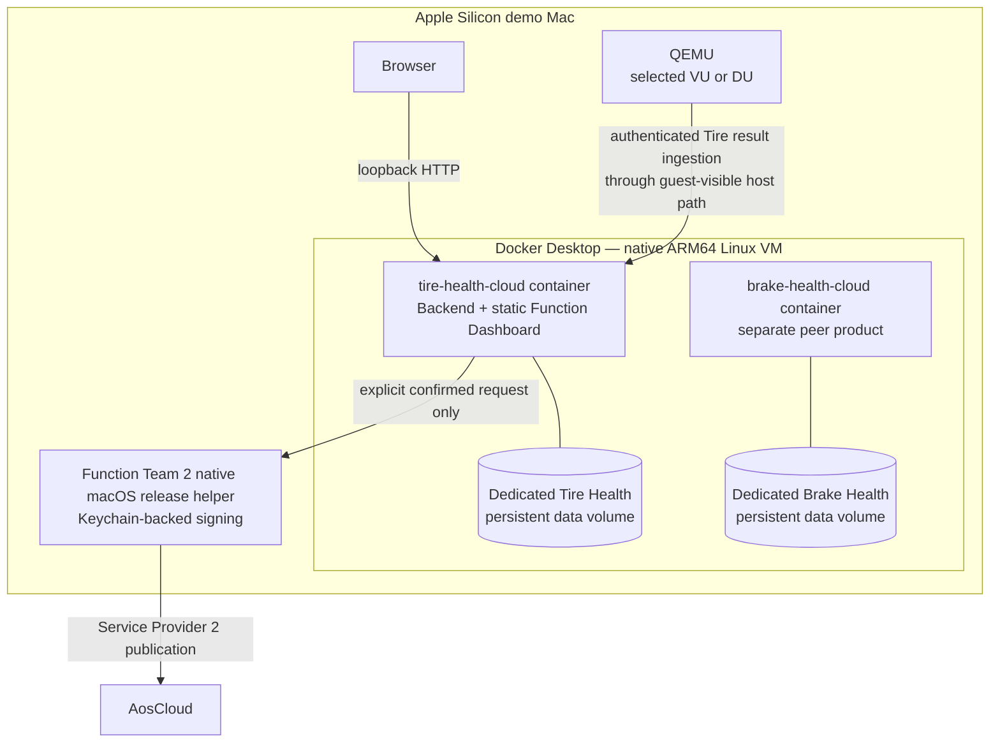
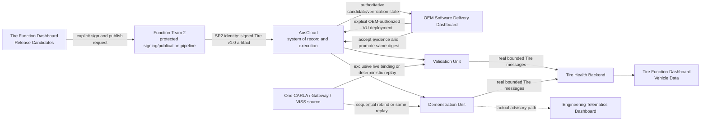

<!-- SPDX-FileCopyrightText: 2026 maninblack -->
<!-- SPDX-License-Identifier: MIT -->

# Tire Health Cloud Product Component Requirements

- Status: D3 design-reviewed
- Package: [`CR-TIRE-CLOUD`](../component-decomposition-and-interface-register.md#cr-tire-cloud)
- Version: 0.1
- Prepared: 2026-08-19
- Accepted: 2026-08-19
- Owner: Function Team 2 / Service Provider 2 functional Cloud product
- Architecture input: [High-Level Architecture 1.4](../../architecture/high-level-architecture.md)
- Scenario input: [Demo Scenarios 1.7](../../demo/staged-post-sop-brake-health-demo-scenarios.md)
- Flow input: [Architecture Flows 1.6](../../architecture/demo-scenario-architecture-flows.md)
- System-requirements input: [System Requirements 0.9](../system-requirements-and-traceability.md)
- Component-register input: [Component Register 1.0](../component-decomposition-and-interface-register.md)
- Accepted architecture decisions: [ADR 0008](../../architecture/decisions/0008-use-tire-health-for-function-team-2.md), [ADR 0009](../../architecture/decisions/0009-separate-release-decision-from-cloud-execution.md), and [ADR 0011](../../architecture/decisions/0011-qm-service-containment-and-evidence-backed-oem-approval.md)
- Implementation baseline: no `tire-health-cloud` repository or executable exists
- Implementation, repository creation, signing, Cloud, or Unit mutation authorized: no

## Purpose

This package defines the independent Function Team 2 Cloud product that
presents one prepared Tire Health Service v1.0 release candidate and receives
the real bounded condition summaries and threshold events produced by the
deployed in-vehicle service. It expands the accepted `CR-TIRE-CLOUD`
allocation into the automatic Tire Health Backend and Tire Health Function
Dashboard.

The product demonstrates bounded OEM-internal multi-tenancy. It is separate
from Brake Health Cloud in repository, service-provider publication identity,
release helper, container, persistent volume, API namespace, functional data,
dashboard and failure boundary. Both products may share the same Apple Silicon
host and Docker Desktop engine, but they do not share lifecycle authority,
credentials or application state.

The demonstration is **presenter-controlled and system-executed**. The
presenter explicitly requests signing and publication of the one already-built
candidate. A protected Function Team 2 pipeline performs those actions,
AosCloud owns technical verification and lifecycle state, and the OEM Software
Delivery Dashboard owns the separate OEM-authorized validation deployment and
promotion interaction. Runtime ingestion and dashboard results are automatic
and shall never be manually fabricated.

## Reader Summary

| Question | Answer |
| --- | --- |
| What this package owns | Tire Health summary/event ingestion, idempotency, persistence, query/subscription API, Function Dashboard, one immutable v1.0 candidate catalogue and presenter controls delegating protected signing/publication |
| What this package does not own | In-vehicle estimation/advisory, CARLA/VISS/KUKSA/VDP, source building during the demo, signing-key custody in the browser/container, AosCloud state, OEM approval, Unit targeting, deployment, promotion, Engineering Telematics Dashboard or production HMI |
| Intended result | The presenter publishes one mature Tire Health product and then shows real local condition results arriving independently from Brake Health on Validation and Demonstration Units |
| Accountable lifecycle owner | Function Team 2 owns the product/release decision; Service Provider 2 publishes, and an authorized OEM identity approves Unit deployment outside this package |
| Primary repository | Planned public `tire-health-cloud`, containing the ARM64 backend/dashboard container and local deployment definition; creation is a later implementation action |

## Product Views and Authority

The Function Dashboard may be one web application with two visually and
logically separated views:

| View or adjacent surface | Presented information or action | Authoritative source | Explicit prohibition |
| --- | --- | --- | --- |
| Release Candidates | Tire Health v1.0 purpose, payload/metadata digest, VDP v3 compatibility, requested KUKSA permissions, quotas, outputs and explicit sign/publish control | Immutable candidate catalogue plus Function Team 2 release-pipeline result | No live source edit/build, private key in browser, OEM approval or invented Cloud state |
| Vehicle Data | Condition summaries, threshold/change events, Unit role, source/event/receipt time, delivery/freshness and service/VDP versions | Tire Health Backend | No direct CARLA, VISS, KUKSA or AosCloud query and no manually injected success result |
| OEM Software Delivery Dashboard | Technical verification, exact target/evidence, active OEM role, validation deployment and promotion | AosCloud and current Unit state | Not implemented or stored by `CR-TIRE-CLOUD` |
| Engineering Telematics Dashboard | Native vehicle/Gateway telemetry and factual Tire advisory request/Gateway status | Vehicle Gateway VISS endpoint | Not implemented by this package; no production driver-display claim |

The Vehicle Data view may show the local inspection decision included in an
accepted Tire summary/event. It must not claim that the Function Backend made
the decision, that the driver saw it, or that Gateway accepted it. Gateway
status remains authoritative only on the Engineering Telematics Dashboard.

## Local Demo Deployment Topology

The primary demo mode is one immutable native `linux/arm64` container holding
the backend and embedded static dashboard. A direct native process may remain
a development fallback, but it is not a second presentation architecture and
must run the same code, contracts and tests.

The product has a dedicated persistent data volume and application namespace.
It must not mount the Brake Health volume, call the Brake Health backend, reuse
its release-helper authority or infer Tire results from Brake data. Distinct
host ports may be allocated by `CR-DEMO`, but browser exposure remains
loopback-only.

The selected AosVM reaches an authenticated allowlisted ingestion path through
a QEMU guest-visible host route without requiring exposure to the office,
home, customer or public LAN. The exact Docker/QEMU route is a D4 experiment
and qualification gate rather than an assumed behavior.

The native macOS release helper keeps Function Team 2 signing credentials in
the login Keychain. No private key, reusable certificate bundle or OEM
lifecycle credential is copied or mounted into the container.

## Prepared Release Catalogue

The only current presentation candidate is compiled, packaged and tested
before the demo. No source modification or build occurs while presenting.

| Candidate | Required platform | Requested KUKSA capability | Functional Cloud product | Vehicle-side output |
| --- | --- | --- | --- | --- |
| Tire Health v1.0 | Accepted VDP Component v3 compatible range | Accepted dynamics reads plus one typed Tire Health inspection-advisory target | Bounded `TireConditionSummary` and threshold/change `TireConditionEvent`; no continuous raw telemetry | One typed QM inspection-advisory request |

The catalogue presents declared compatibility and observed service-readiness
evidence. It shall not claim that the current AosCloud release natively rejects
an incompatible SOTA before desired-state change or transfer. Native
dependency admission remains deferred; release sequencing, OEM-reviewed
evidence and service-side fail-closed readiness remain explicit.

The catalogue also shows the accepted provisional in-vehicle envelope from
`CR-TIRE` 0.2: 150 CPU units, 16 MiB RAM, 2 MiB persistent model state, 2 MiB
temporary storage, 32 open files, and 8 processes. It separately labels the
normal summary cadence of at most one per 30 seconds and the offline queue
limit of 256 messages or 2 MiB. These are Tire Health SOTA candidate
requirements, not the hosting limits of the `tire-health-cloud` container.

## Presenter-Controlled Release and Evidence Flow

The current environment has one visible CARLA/Gateway/VISS source, not two
simultaneous vehicles. VU and DU evidence therefore uses exclusive sequential
binding or the same deterministic replay. `CR-DEMO` owns the exact mechanism;
this product preserves supplied run, Unit and source correlation and must not
imply concurrent vehicle evidence.

## Component Boundary

### In scope

- authenticated `IF-TIRE-003` ingestion and durable acknowledgement;
- version, schema, size, Unit, run, source/event/receipt time and correlation validation;
- idempotent persistence of `TireConditionSummary` and `TireConditionEvent`;
- original event time, receipt time, delivery/freshness and online/offline state;
- backend query/subscription API and automatic Function Dashboard refresh;
- one immutable prepared Tire Health v1.0 catalogue entry;
- explicit confirmation-gated delegation of sign/publish to Function Team 2;
- separated Release Candidates and Vehicle Data views;
- empty, current, delayed, stale, offline, duplicate, invalid and failed states;
- run-scoped retention, archive/clear preview and exact deletion scope;
- native `linux/arm64` backend/dashboard container, health endpoint and graceful restart;
- dedicated persistent volume and application namespace isolated from Brake Health;
- loopback-only browser UI and authenticated allowlisted VM ingestion route;
- native Keychain-backed Function Team 2 release helper;
- unit tests, contract fixtures, health, logs and metrics for all owned logic.

### Out of scope

- source compilation, model changes or candidate rebuilding during presentation;
- creating Tire Health service behavior, metadata or model;
- signing-key custody or use inside browser/container;
- OEM validation acceptance, deployment approval, target calculation or promotion;
- desired-state, Unit, batch, Campaign, approval or native-log database;
- a local substitute for deferred AosCloud dependency admission;
- CARLA control, source replay/switching, VISS, KUKSA, VDP or Gateway implementation;
- local tire estimation, advisory authorization or time-critical decision logic;
- direct access to hidden tire-degradation truth or continuous raw telemetry;
- Brake Health backend/data/dashboard/storage/helper integration;
- production driver HMI, safety claim, public-Cloud hosting, LAN/Internet exposure
  or multi-host availability.

### Dependencies and assumptions

| Dependency or assumption | Owner | Required state | Failure consequence |
| --- | --- | --- | --- |
| Tire functional messages | [`CR-TIRE`](tire-health-service.md) | Accepted bounded summary/event schema, authentication and idempotency identity | Reject/quarantine invalid input; never fabricate a dashboard result |
| Prepared immutable v1.0 candidate | [`CR-TIRE`](tire-health-service.md) release pipeline | ARM64 payload, metadata, unit/contract tests and unsigned digests frozen before presentation | Candidate cannot be selected or signed |
| Function Team 2 release pipeline | [`IF-LC-007`](../component-decomposition-and-interface-register.md#if-lc-007) | Explicit confirmation, protected key handling, SP2 identity and machine-readable result | Show failure/uncertain state; no Cloud success claim |
| AosCloud and OEM delivery surface | [`CR-AOS`](aos-lifecycle.md) and future `CR-DEMO` | Authoritative verification, target, approval, deployment and promotion | Release view stops at pipeline result and directs presenter to authoritative surface |
| VDP v3 compatibility | [`CR-VDP`](vehicle-data-platform.md) and [`CR-TIRE`](tire-health-service.md) | Candidate range plus fail-closed service readiness | Display declared/actual evidence; do not implement admission control |
| Run and Unit correlation | Future `CR-DEMO` | Bounded time window, VU/DU IDs/roles and selected/replayed source | Quarantine as unassigned and exclude from success views |
| Engineering advisory evidence | [`CR-GATEWAY`](vehicle-gateway.md) | Gateway VISS remains authoritative for request/status | Function view cannot claim Gateway receipt or driver display |
| Apple Silicon runtime | Docker Desktop on the demo Mac | Native ARM64 engine, dedicated volume and healthy container runtime | Launcher reports blocked; no functional-data success claim |
| QEMU-to-container route | Future `CR-DEMO` plus this package | Authenticated selected-Unit ingestion without LAN exposure | Unit data stays queued and dashboard shows offline |
| Function Team 2 Keychain helper | Function Team 2 release owner | Native authenticated helper; key non-exportable to browser/container | Sign/publish control disabled with factual reason |

## Current Implementation Baseline

| Capability | Current evidence | State for this package |
| --- | --- | --- |
| Repository | Component Register plans `tire-health-cloud`; repository does not exist | `NEW` |
| Backend and dashboard | No ingestion, persistence, API, catalogue or UI | `NEW` |
| Service candidate | `CR-TIRE` defines target v1.0; no artifact or catalogue entry | `NEW` |
| Signing/publication seam | `IF-LC-007` defines ownership; no helper integration | `NEW / QUALIFY` |
| Local container runtime | Docker Desktop ARM64 capability was qualified for Brake Health Cloud design | `CURRENT` shared host dependency; Tire product image/volume/launcher `NEW` |
| Multi-product isolation | Logical repository/component separation is accepted; no container/volume/port/helper proof | `NEW` |
| Contract fixtures and tests | `IF-TIRE-003/004` are conceptual; no executable fixtures or suite | `NEW` |

## Testability Boundary

Backend parsing, validation, idempotency, persistence, retention and query
behavior shall be independent of web transport and storage vendor. Dashboard
state derivation shall be independent of browser rendering. Candidate
validation and release-action transitions shall be independent of a real
signing key or AosCloud account.

Unit tests inject:

- valid, duplicate, conflicting, malformed and incompatible Tire messages;
- deterministic clocks, Unit IDs, roles, run windows and source/event/receipt times;
- transactional storage with restart, capacity and failure points;
- valid and malformed v1.0 catalogue metadata/digests/permissions/quotas;
- release-helper confirm/cancel/success/failure/timeout/uncertain results;
- Docker/Compose metadata, loopback publication, volume and secret/path policy;
- unauthorized VM/LAN clients and container/helper restart transitions;
- Brake Health identifiers, volumes and endpoints as negative isolation fixtures.

Owned logic must run without CARLA, QEMU, AosCloud, a real Tire service,
credentials or network access. Contract and integration tests then prove the
packaged product and protected helper against controlled adjacent components.

## Interface Summary

| Interface | Direction | Data or command | Contract/version | Failure behavior | Authority |
| --- | --- | --- | --- | --- | --- |
| [Tire result (`IF-TIRE-003`)](../component-decomposition-and-interface-register.md#if-tire-003) | In | Versioned bounded/idempotent condition summary or threshold event | Function Team 2 schema | Reject/quarantine invalid input; acknowledge only durable accepted state | Tire service result plus backend acknowledgement |
| [Tire dashboard API (`IF-TIRE-004`)](../component-decomposition-and-interface-register.md#if-tire-004) | Out | Persisted Tire results, correlation and delivery/freshness state | Versioned query/subscription API | Expose stale/offline/error state; never synthesize current values | Tire Health Backend |
| [Tire SOTA publication (`IF-LC-007`)](../component-decomposition-and-interface-register.md#if-lc-007) | Delegated adjacent action | Explicit request to sign/publish v1.0 plus structured result | Function Team 2 pipeline | Cancel/failure produces no success; uncertain result requires reconciliation | SP2 pipeline and AosCloud verification record |
| [Function Team 2 OEM approval (`IF-LC-010`)](../component-decomposition-and-interface-register.md#if-lc-010) | Out of package / handoff | Candidate/digest available for later OEM review | OEM Software Delivery Dashboard | No local approval control or inferred approval | Function Team 2 decision through authorized OEM identity |

## Verification Strategy

| Level | Purpose | Dependency boundary | Required | Planned evidence |
| --- | --- | --- | --- | --- |
| Unit | Prove catalogue, ingestion, idempotency, view state, release action, retention and isolation | Deterministic messages, clocks, storage, helper and API doubles | Yes | `UT-TIRE-CLOUD-*` suite |
| Component | Prove packaged backend/dashboard through public APIs and browser behavior | Controlled producer, storage and helper stub | Yes | Backend/UI health and persistence suite |
| Contract | Prove `IF-TIRE-003`, `IF-TIRE-004` and release-helper schemas | Digest-addressed shared fixtures | Yes | Producer/consumer conformance and negatives |
| Integration | Prove real Tire v1.0 ingestion and protected helper delegation | Validation environment with accepted adjacent revisions and test credentials | Yes | `T1` integration records |
| End-to-end | Prove publication, VU result and same-digest DU promotion without fabricated data | One source used sequentially or by replay | Yes | `AF-TIRE-*`, `AF-X-SOURCE`, and offline evidence |

## Requirement Summary

| Requirement | Plain-language obligation | Verification levels | State |
| --- | --- | --- | --- |
| [Separated product views (`REQ-TIRE-CLOUD-001`)](#req-tire-cloud-001) | Keep release presentation, runtime data and lifecycle authority visibly distinct | Unit, Component, Integration, End-to-end | D3 design-reviewed |
| [Single prepared candidate catalogue (`REQ-TIRE-CLOUD-002`)](#req-tire-cloud-002) | Present exactly one immutable v1.0 candidate without live build/source changes | Unit, Component, Contract, Integration | D3 design-reviewed |
| [Complete v1.0 metadata (`REQ-TIRE-CLOUD-003`)](#req-tire-cloud-003) | Show purpose, digests, VDP v3 range, KUKSA access, quotas and outputs before signing | Unit, Component, Contract | D3 design-reviewed |
| [Protected signing and publication (`REQ-TIRE-CLOUD-004`)](#req-tire-cloud-004) | Delegate one confirmed action and preserve the exact signed digest | Unit, Component, Integration, End-to-end | D3 design-reviewed |
| [No lifecycle authority (`REQ-TIRE-CLOUD-005`)](#req-tire-cloud-005) | Never own OEM approval, desired state, targeting, deployment or promotion | Unit, Component, Integration | D3 design-reviewed |
| [Idempotent Tire result ingestion (`REQ-TIRE-CLOUD-006`)](#req-tire-cloud-006) | Durably ingest bounded summary/events and quarantine conflicts | Unit, Component, Contract, Integration | D3 design-reviewed |
| [Factual Tire presentation (`REQ-TIRE-CLOUD-007`)](#req-tire-cloud-007) | Show condition/event/version/delivery facts without raw telemetry or Gateway claims | Unit, Component, Integration, End-to-end | D3 design-reviewed |
| [Offline convergence (`REQ-TIRE-CLOUD-008`)](#req-tire-cloud-008) | Preserve original time and converge idempotently after reconnect | Unit, Component, Integration, End-to-end | D3 design-reviewed |
| [Run, Unit and source correlation (`REQ-TIRE-CLOUD-009`)](#req-tire-cloud-009) | Bind every accepted result to exact run, Unit role and source evidence | Unit, Component, Contract, Integration | D3 design-reviewed |
| [Honest VU/DU evidence (`REQ-TIRE-CLOUD-010`)](#req-tire-cloud-010) | Never imply two simultaneous vehicles when one CARLA source is reused | Unit, Component, Integration, End-to-end | D3 design-reviewed |
| [Run-scoped retention (`REQ-TIRE-CLOUD-011`)](#req-tire-cloud-011) | Archive/clear exact functional run data without touching Cloud audit state | Unit, Component, Integration | D3 design-reviewed |
| [Failure and freshness visibility (`REQ-TIRE-CLOUD-012`)](#req-tire-cloud-012) | Show invalid, stale, offline and failed states without fabricated success | Unit, Component, Integration, End-to-end | D3 design-reviewed |
| [Mac-local ARM64 deployment (`REQ-TIRE-CLOUD-013`)](#req-tire-cloud-013) | Run one health-checked backend/dashboard container with dedicated persistence | Unit, Component, Integration | D3 design-reviewed |
| [Multi-product network/signing isolation (`REQ-TIRE-CLOUD-014`)](#req-tire-cloud-014) | Isolate Tire from Brake state/credentials while keeping browser local and VM ingestion authenticated | Unit, Component, Integration, End-to-end | D3 design-reviewed |

## Detailed Requirements

### Separated product views

- ID: `REQ-TIRE-CLOUD-001`
- Statement: The Function Dashboard shall separate Release Candidates from Vehicle Data and visibly distinguish Function Team publication, backend facts and the external OEM/AosCloud lifecycle authority.
- Parents: [authoritative surfaces (`SYS-OBS-001`)](../system-requirements-and-traceability.md#sys-obs-001) and [team-owned decisions (`SYS-REL-007`)](../system-requirements-and-traceability.md#sys-rel-007)
- Flows: [Tire lifecycle (`AF-TIRE-LC`)](../../architecture/demo-scenario-architecture-flows.md#af-tire-lc) and [Tire observability (`AF-TIRE-OB`)](../../architecture/demo-scenario-architecture-flows.md#af-tire-ob)
- Verification: Unit, Component, Integration, End-to-end
- Evidence: route/action inventory, source/authority labels and prohibited-API negative proof
- State: D3 design-reviewed

### Single prepared candidate catalogue

- ID: `REQ-TIRE-CLOUD-002`
- Statement: The Release Candidates view shall load exactly one prepared immutable Tire Health v1.0 entry for the current demo and shall expose no source editor, build, repackaging or alternate hidden Tire release.
- Parents: [immutable candidates (`SYS-REL-001`)](../system-requirements-and-traceability.md#sys-rel-001) and [single mature Tire service (`SYS-TIRE-001`)](../system-requirements-and-traceability.md#sys-tire-001)
- Flow: [Tire lifecycle (`AF-TIRE-LC`)](../../architecture/demo-scenario-architecture-flows.md#af-tire-lc)
- Verification: Unit, Component, Contract, Integration
- Evidence: catalogue manifest/digest, exactly-one-entry proof and absence of build endpoints
- State: D3 design-reviewed

### Complete v1.0 metadata

- ID: `REQ-TIRE-CLOUD-003`
- Statement: Before sign/publish is enabled, the dashboard shall show and validate the candidate purpose, unsigned payload and metadata digests, ARM64 target, VDP v3 compatibility, requested KUKSA paths/modes, the accepted CR-TIRE 0.2 in-vehicle resource envelope and application-level reporting/queue bounds, local outputs, functional message family, advisory target and required evidence; Cloud-container hosting limits shall be labelled separately.
- Parent: [evidence-backed OEM approval (`SYS-REL-010`)](../system-requirements-and-traceability.md#sys-rel-010)
- Flow: [Tire lifecycle (`AF-TIRE-LC`)](../../architecture/demo-scenario-architecture-flows.md#af-tire-lc)
- Verification: Unit, Component, Contract
- Evidence: complete/incomplete/malformed catalogue fixtures and exact rendered fields
- State: D3 design-reviewed; exact D4 metadata schema remains open

The view explains that Service Provider publication is not OEM deployment
approval and that native pre-transfer dependency admission is deferred.

### Protected signing and publication

- ID: `REQ-TIRE-CLOUD-004`
- Statement: After explicit presenter confirmation, the dashboard shall delegate exactly one selected v1.0 sign/publish request to an authenticated native Function Team 2 helper, expose pending/success/failure/uncertain states, preserve the exact resulting signed digest and never access or export private key material.
- Parents: [immutable candidates (`SYS-REL-001`)](../system-requirements-and-traceability.md#sys-rel-001) and [OEM-authorized deployment approval (`SYS-REL-008`)](../system-requirements-and-traceability.md#sys-rel-008)
- Flow: [Tire lifecycle (`AF-TIRE-LC`)](../../architecture/demo-scenario-architecture-flows.md#af-tire-lc)
- Verification: Unit, Component, Integration, End-to-end
- Evidence: confirm/cancel/failure/timeout/reconciliation records, helper authentication and signed digest
- State: D3 design-reviewed

Retries after an uncertain result require reconciliation with the Function Team
pipeline/AosCloud; a browser timeout must not cause blind republishing.

### No lifecycle authority

- ID: `REQ-TIRE-CLOUD-005`
- Statement: The product shall not store or mutate authoritative Unit, Unit Set, desired state, batch, Campaign, validation, approval, deployment, promotion or native-log state and shall expose no OEM approval action.
- Parents: [Cloud-authoritative delivery dashboard (`SYS-OBS-002`)](../system-requirements-and-traceability.md#sys-obs-002) and [OEM-authorized approval (`SYS-REL-008`)](../system-requirements-and-traceability.md#sys-rel-008)
- Flow: [Tire lifecycle (`AF-TIRE-LC`)](../../architecture/demo-scenario-architecture-flows.md#af-tire-lc)
- Verification: Unit, Component, Integration
- Evidence: API/credential/storage inventory and lifecycle-mutation negative tests
- State: D3 design-reviewed

### Idempotent Tire result ingestion

- ID: `REQ-TIRE-CLOUD-006`
- Statement: The backend shall authenticate and validate every `IF-TIRE-003` summary/event, persist accepted state transactionally before acknowledgement, treat an identical idempotency key/payload as one record, and quarantine conflicting duplicates, malformed schemas or cross-run identity collisions.
- Parents: [bounded Tire reporting (`SYS-TIRE-004`)](../system-requirements-and-traceability.md#sys-tire-004) and [independent Tire product (`SYS-TIRE-005`)](../system-requirements-and-traceability.md#sys-tire-005)
- Flow: [Tire runtime (`AF-TIRE-RT`)](../../architecture/demo-scenario-architecture-flows.md#af-tire-rt)
- Verification: Unit, Component, Contract, Integration
- Evidence: positive/duplicate/conflict/malformed/authentication fixtures and restart durability
- State: D3 design-reviewed; schema and authentication remain D4 gates

### Factual Tire presentation

- ID: `REQ-TIRE-CLOUD-007`
- Statement: The Vehicle Data view shall present only backend records: estimated condition band, confidence/quality, threshold/change event, local inspection decision, original event and receipt time, service/model/VDP versions, Unit role and delivery/freshness state; it shall not display continuous raw telemetry, hidden truth, exact tread depth or Gateway/driver acknowledgement.
- Parents: [independent Tire product (`SYS-TIRE-005`)](../system-requirements-and-traceability.md#sys-tire-005) and [authoritative surfaces (`SYS-OBS-001`)](../system-requirements-and-traceability.md#sys-obs-001)
- Flow: [Tire observability (`AF-TIRE-OB`)](../../architecture/demo-scenario-architecture-flows.md#af-tire-ob)
- Verification: Unit, Component, Integration, End-to-end
- Evidence: dashboard state fixtures, raw/oracle-negative proof and correlated real result
- State: D3 design-reviewed

### Offline convergence

- ID: `REQ-TIRE-CLOUD-008`
- Statement: Delayed and retried messages after vehicle/backend disconnection shall converge idempotently while preserving original event time separately from receipt/synchronization time; the dashboard shall show offline/delayed/synchronized states and retention failure explicitly.
- Parents: [bounded Tire reporting (`SYS-TIRE-004`)](../system-requirements-and-traceability.md#sys-tire-004) and [offline Tire advisory (`SYS-TIRE-006`)](../system-requirements-and-traceability.md#sys-tire-006)
- Flow: [offline continuity (`AF-X-OFFLINE`)](../../architecture/demo-scenario-architecture-flows.md#af-x-offline)
- Verification: Unit, Component, Integration, End-to-end
- Evidence: disconnect/restart/reconnect sequence, duplicates and time-field proof
- State: D3 design-reviewed

### Run, Unit and source correlation

- ID: `REQ-TIRE-CLOUD-009`
- Statement: Every accepted result and query shall be scoped by the current bounded run window, exact Unit identity and role, service instance/version and selected source/replay correlation; unbound or ambiguous input shall be quarantined and excluded from audience success views.
- Parents: [exact source binding (`SYS-SRC-001`)](../system-requirements-and-traceability.md#sys-src-001) and [per-run correlation (`SYS-OBS-004`)](../system-requirements-and-traceability.md#sys-obs-004)
- Flow: [one visible source (`AF-X-SOURCE`)](../../architecture/demo-scenario-architecture-flows.md#af-x-source)
- Verification: Unit, Component, Contract, Integration
- Evidence: VU/DU/run/source fixtures and unassigned/collision negatives
- State: D3 design-reviewed

### Honest VU/DU evidence

- ID: `REQ-TIRE-CLOUD-010`
- Statement: The dashboard shall label whether VU and DU evidence came from exclusive sequential live binding or deterministic replay and shall block comparison when source overlap, missing replay identity or ambiguous binding could imply two simultaneous CARLA vehicles.
- Parent: [honest single-source presentation (`SYS-SRC-002`)](../system-requirements-and-traceability.md#sys-src-002)
- Flow: [one visible source (`AF-X-SOURCE`)](../../architecture/demo-scenario-architecture-flows.md#af-x-source)
- Verification: Unit, Component, Integration, End-to-end
- Evidence: live/replay/overlap/ambiguous presentation-state fixtures
- State: D3 design-reviewed

### Run-scoped retention

- ID: `REQ-TIRE-CLOUD-011`
- Statement: The backend shall apply bounded run-scoped functional-data retention and provide previewed archive/clear operations requiring an exact non-wildcard selector; those operations shall not call AosCloud or erase Cloud audit/lifecycle state, Brake Health data or unrelated Tire runs.
- Parents: [clear functional run data (`SYS-RET-002`)](../system-requirements-and-traceability.md#sys-ret-002) and [bounded Tire reporting (`SYS-TIRE-004`)](../system-requirements-and-traceability.md#sys-tire-004)
- Flow: [Tire failure boundaries (`AF-TIRE-FR`)](../../architecture/demo-scenario-architecture-flows.md#af-tire-fr)
- Verification: Unit, Component, Integration
- Evidence: dry run, exact row/object counts, unrelated-run/Brake negative proof and restart result
- State: D3 design-reviewed

### Failure and freshness visibility

- ID: `REQ-TIRE-CLOUD-012`
- Statement: Every view shall expose empty, pending, current, stale, delayed, offline, invalid, quarantined, partial and failed states with timestamp/reason and shall never convert dependency loss, malformed input or absence into a current healthy condition.
- Parents: [authoritative surfaces (`SYS-OBS-001`)](../system-requirements-and-traceability.md#sys-obs-001) and [operational log controls (`SYS-OBS-003`)](../system-requirements-and-traceability.md#sys-obs-003)
- Flows: [Tire observability (`AF-TIRE-OB`)](../../architecture/demo-scenario-architecture-flows.md#af-tire-ob) and [failure boundaries (`AF-TIRE-FR`)](../../architecture/demo-scenario-architecture-flows.md#af-tire-fr)
- Verification: Unit, Component, Integration, End-to-end
- Evidence: complete UI/API state matrix and dependency fault/recovery evidence
- State: D3 design-reviewed

### Mac-local ARM64 deployment

- ID: `REQ-TIRE-CLOUD-013`
- Statement: The backend and embedded static dashboard shall run in one immutable native ARM64 container with an explicit health endpoint, read-only application content, dedicated persistent data volume, graceful stop/restart and no personal absolute path or reusable credential in image/configuration.
- Parents: [independent Tire product (`SYS-TIRE-005`)](../system-requirements-and-traceability.md#sys-tire-005) and [operational log controls (`SYS-OBS-003`)](../system-requirements-and-traceability.md#sys-obs-003)
- Flow: [Tire observability (`AF-TIRE-OB`)](../../architecture/demo-scenario-architecture-flows.md#af-tire-ob)
- Verification: Unit, Component, Integration
- Evidence: ARM64 image/Compose manifest, secret/path scan, health, volume and Docker restart proof
- State: D3 design-reviewed

### Multi-product network and signing isolation

- ID: `REQ-TIRE-CLOUD-014`
- Statement: Browser access shall be loopback-only; selected-Unit ingestion shall be authenticated and allowlisted without LAN exposure; the native Function Team 2 helper shall use only its Keychain-backed SP2 identity; and Tire processes/configuration shall not read Brake Health ports, volumes, API state, helper authority or credentials.
- Parents: [independent Tire product (`SYS-TIRE-005`)](../system-requirements-and-traceability.md#sys-tire-005), [least privilege (`SYS-SEC-001`)](../system-requirements-and-traceability.md#sys-sec-001), and [QM containment (`SYS-SEC-007`)](../system-requirements-and-traceability.md#sys-sec-007)
- Flows: [Tire lifecycle (`AF-TIRE-LC`)](../../architecture/demo-scenario-architecture-flows.md#af-tire-lc) and [failure boundaries (`AF-TIRE-FR`)](../../architecture/demo-scenario-architecture-flows.md#af-tire-fr)
- Verification: Unit, Component, Integration, End-to-end
- Evidence: listener/auth/helper/volume policy tests, unauthorized/LAN probes and simultaneous Brake/Tire isolation run
- State: D3 design-reviewed

## Stable Unit-Test Obligations

| Test obligation | Requirement coverage | Required proof |
| --- | --- | --- |
| `UT-TIRE-CLOUD-001` | `REQ-TIRE-CLOUD-001`, `005` | Correct view/source/authority labels and no lifecycle store/API/control |
| `UT-TIRE-CLOUD-002` | `REQ-TIRE-CLOUD-002`, `003` | Exactly one valid v1.0 entry; malformed/missing metadata and hidden alternate candidates fail |
| `UT-TIRE-CLOUD-003` | `REQ-TIRE-CLOUD-004` | Confirm/cancel/success/failure/timeout/uncertain flow with no key exposure or blind retry |
| `UT-TIRE-CLOUD-004` | `REQ-TIRE-CLOUD-006` | Durable idempotent summary/event ingestion; conflicting duplicate quarantine |
| `UT-TIRE-CLOUD-005` | `REQ-TIRE-CLOUD-007`, `012` | Exact factual presentation, all freshness/failure states and raw/oracle/Gateway negative claims |
| `UT-TIRE-CLOUD-006` | `REQ-TIRE-CLOUD-008` | Disconnect/restart/reconnect convergence with original/receipt times and retention failure |
| `UT-TIRE-CLOUD-007` | `REQ-TIRE-CLOUD-009`, `010` | Run/Unit/source isolation and honest sequential/replay presentation |
| `UT-TIRE-CLOUD-008` | `REQ-TIRE-CLOUD-011` | Preview and exact scoped clear/archive; wildcard/unrelated/Brake data unchanged |
| `UT-TIRE-CLOUD-009` | `REQ-TIRE-CLOUD-013` | ARM64 immutable image, health, dedicated volume, restart and secret/path policy |
| `UT-TIRE-CLOUD-010` | `REQ-TIRE-CLOUD-014` | Loopback UI, authenticated VM path, SP2 helper and Brake/Tire port/volume/credential isolation |

Every obligation is deterministic and runnable without personal credentials,
network access or a real Cloud, VM or simulator. Output shall not contain
keys, tokens, raw certificates, unrestricted telemetry or hidden truth.

## Verification Traceability

| Requirement | Unit | Component | Contract | Integration | End-to-end |
| --- | --- | --- | --- | --- | --- |
| `REQ-TIRE-CLOUD-001` | `UT-001` | Two-view authority suite | N/A | Backend/helper boundary | `AF-TIRE-OB` |
| `REQ-TIRE-CLOUD-002` | `UT-002` | Catalogue loading | Candidate manifest | Prepared v1.0 artifact | N/A |
| `REQ-TIRE-CLOUD-003` | `UT-002` | Metadata UI | Service metadata/catalogue | N/A | N/A |
| `REQ-TIRE-CLOUD-004` | `UT-003` | Helper client | Helper schema | Test signing/publication | Exact digest flow |
| `REQ-TIRE-CLOUD-005` | `UT-001` | API/permission inventory | N/A | No lifecycle mutation | Negative authority proof |
| `REQ-TIRE-CLOUD-006` | `UT-004` | Packaged ingestion | `IF-TIRE-003` fixtures | Real Tire v1.0 | `AF-TIRE-RT` |
| `REQ-TIRE-CLOUD-007` | `UT-005` | Dashboard states | `IF-TIRE-004` fixtures | Real result | `AF-TIRE-OB` |
| `REQ-TIRE-CLOUD-008` | `UT-006` | Restart/convergence | Timing/idempotency fixtures | Disconnect/reconnect | `AF-X-OFFLINE` |
| `REQ-TIRE-CLOUD-009` | `UT-007` | Correlation queries | Identity fields | VU/DU records | N/A |
| `REQ-TIRE-CLOUD-010` | `UT-007` | Source labels | N/A | Selected source mode | `AF-X-SOURCE` |
| `REQ-TIRE-CLOUD-011` | `UT-008` | Retention API | N/A | R0 preparation | N/A |
| `REQ-TIRE-CLOUD-012` | `UT-005` | State matrix | N/A | Fault recovery | `AF-TIRE-FR` |
| `REQ-TIRE-CLOUD-013` | `UT-009` | ARM64 container/health/volume | Packaging boundary | Docker restart | N/A |
| `REQ-TIRE-CLOUD-014` | `UT-010` | Local/isolation policy | Ingestion/helper auth | VU/DU route + Brake peer | Network/offline presentation |

## Cross-Cutting Constraints

| Concern | Component response | Verification |
| --- | --- | --- |
| Authority | Protected SP2 publication seam; no OEM lifecycle credential/mutation | Unit, inspection, integration |
| Multi-tenancy | Separate repository, container, volume, API namespace, helper identity, backend data and failure boundary from Brake Health | Unit, component, simultaneous integration |
| Redaction | Allowlisted structured fields; no secrets, raw certificates, unrestricted telemetry or hidden truth | Unit, component, analysis |
| Resource bounds | Message/page/storage/retention/upload limits frozen at D4 | Unit, load, integration |
| Timing | Preserve event/receipt/sync times; never present Cloud latency as local advisory latency | Unit, analysis, end-to-end |
| Offline | Idempotent reconnect and explicit delayed/offline/retention state | Unit, integration, end-to-end |
| Local hosting | Native ARM64 container, dedicated volume, loopback UI, authenticated VM route, native Keychain helper | Packaging, component, integration |

## Open D4 Gates

| Gate | Impact | Owner |
| --- | --- | --- |
| Exact `IF-TIRE-003/004` schemas, bounds, authentication and acknowledgement | Backend/service contract and fixtures | Function Team 2 |
| Condition/event dashboard fields, chart/state presentation and terminology | Audience UI and snapshot tests | Function Team 2 |
| Backend technology, API transport and storage schema | Repository scaffold and component tests | Function Team 2 |
| Protected SP2 helper protocol and Keychain identity selection | Publication integration and security | Function Team 2 release owner |
| Docker startup/minimum version, container/volume/port names and collision policy with Brake Cloud | Launcher and simultaneous products | `CR-DEMO` + both Function Teams |
| QEMU guest-visible authenticated route without LAN exposure | Real functional ingestion | `CR-DEMO` + Function Team 2 |
| Run retention/archive/clear bounds and next-run policy | Storage sizing and R0 | Function Team 2 + Demo owner |
| Exact live source rebinding versus deterministic replay | VU/DU labels and correlation | `CR-DEMO` |
| Native AosCloud service-to-VDP admission | Deferred negative scenario only; not a local product responsibility | AosEdge Platform Team |

## D3 Acceptance Record

The package was design-reviewed and accepted on 2026-08-19. Acceptance fixes
the following boundaries for implementation planning:

1. Tire Health Cloud is a Function Team 2 product isolated from Brake Health
   in repository, container, persistent volume, API namespace, release helper,
   Service Provider identity, data and failure boundary.
2. The presentation catalogue contains exactly one immutable Tire Health v1.0
   candidate; source editing, building and repackaging are outside the demo.
3. Release Candidates and Vehicle Data are separate views. The former delegates
   protected Service Provider 2 signing/publication; the latter presents only
   real bounded backend records.
4. AosCloud remains the lifecycle system of record, and an authorized OEM
   identity performs validation deployment and promotion outside this product.
5. The dashboard does not fabricate Tire results, expose continuous raw
   telemetry or hidden truth, or claim Gateway acceptance or driver display.
6. The demo product is hosted locally on the Apple Silicon Mac as a native
   ARM64 container with dedicated persistence, loopback browser access and a
   separate Keychain-backed native release helper.
7. The fourteen component requirements and ten stable unit-test obligations
   are accepted as the D3 verification baseline.

Exact message/API schemas, storage technology, container/network names,
QEMU-to-container routing, helper protocol and retention values remain D4
gates. This acceptance does not create a repository or artifact and does not
authorize signing, publication, Cloud mutation or Unit mutation.

## Change Rules

- Editorial clarification preserves stable `REQ-TIRE-CLOUD-*` and
  `UT-TIRE-CLOUD-*` IDs.
- A semantic replacement receives a new ID and retains the old definition with
  an explicit replacement mapping.
- Changed authority, lifecycle, trust boundary, data direction or HLA component
  follows the Level-C architecture cascade.
- Changed behavior within accepted boundaries follows the Level-B cascade and
  updates requirements, fixtures, tests and evidence together.
- Adding a future Tire candidate extends the catalogue explicitly; it never
  silently converts v1.0 into an untraceable mutable entry.
