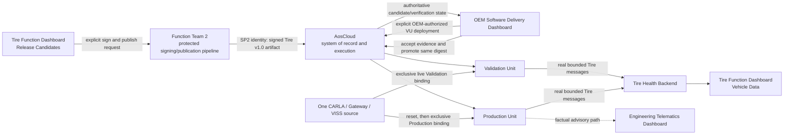

<!-- SPDX-FileCopyrightText: 2026 maninblack -->
<!-- SPDX-License-Identifier: MIT -->

# Tire Health Cloud Product Component Requirements

- Status: D3 design-reviewed; D4-018 and D4-019 accepted; D4-020 design-reviewed
- Package: [`CR-TIRE-CLOUD`](../component-decomposition-and-interface-register.md#cr-tire-cloud)
- Version: 0.4
- Prepared: 2026-08-19
- Accepted: 2026-08-19
- Reconciled: 2026-08-31
- Owner: Function Team 2 / Service Provider 2 functional Cloud product
- Architecture input: [High-Level Architecture 1.5](../../architecture/high-level-architecture.md)
- Scenario input: [Demo Scenarios 2.0](../../demo/staged-post-sop-brake-health-demo-scenarios.md)
- Flow input: [Architecture Flows 2.0](../../architecture/demo-scenario-architecture-flows.md)
- System-requirements input: [System Requirements 2.0](../system-requirements-and-traceability.md)
- Component-register input: [Component Register 2.0](../component-decomposition-and-interface-register.md)
- Accepted architecture decisions: [ADR 0008](../../architecture/decisions/0008-use-tire-health-for-function-team-2.md), [ADR 0009](../../architecture/decisions/0009-separate-release-decision-from-cloud-execution.md), and [ADR 0011](../../architecture/decisions/0011-qm-service-containment-and-evidence-backed-oem-approval.md)
- Accepted D4 compatibility input: [D4-007 VDP Compatibility Profile](../../../contracts/vdp-compatibility-profile/vdp-compatibility-profile.v1.json)
- Accepted D4 publication input: [D4-010.3 Artifact Publication Credential Profile](../../../contracts/artifact-publication-profile/artifact-publication-profile.v1.json)
- Accepted D4 product inputs: [Tire Health In-Vehicle Product Contract](../../../contracts/tire-health-model/README.md) and [Tire Cloud API](../../../contracts/tire-cloud-api/README.md); [Local Demo Hosting and VM Route](../../../contracts/local-demo-hosting/README.md) is design-reviewed and still requires implementation qualification
- Implementation baseline: no `tire-health-cloud` repository or executable exists
- Implementation, repository creation, signing, Cloud, or Unit mutation authorized: no

## Purpose

This package defines the independent Function Team 2 Cloud product that
presents one prepared Tire Health Service v1.0 release candidate and receives
the real bounded condition summaries and threshold events produced by the
deployed in-vehicle service. It expands the accepted `CR-TIRE-CLOUD`
allocation into the automatic Tire Health Backend and Tire Health Function
Dashboard.

The product demonstrates bounded OEM-internal multi-tenancy. It is separate
from Brake Health Cloud in repository, service-provider publication identity,
fixed helper profile/credential binding, container, persistent volume, API
namespace, functional data, dashboard and failure boundary. Both products may
share the same Apple Silicon host, Docker Desktop engine and common native
helper implementation, but they do not share lifecycle authority, credentials
or application state.

The demonstration is **presenter-controlled and system-executed**. The
presenter explicitly requests signing and publication of the one already-built
candidate. The common native helper surface pre-bound to `tire-sp2` performs
those technical actions,
AosCloud owns technical verification and lifecycle state, and the OEM Software
Delivery Dashboard owns the separate OEM-authorized validation deployment and
promotion interaction. Runtime ingestion and dashboard results are automatic
and shall never be manually fabricated.

## Reader Summary

| Question | Answer |
| --- | --- |
| What this package owns | Tire Health summary/event ingestion, idempotency, persistence, query/subscription API, Function Dashboard, one immutable v1.0 candidate catalogue, presenter controls delegating protected signing/publication and an SP2-scoped Service Logs view over native AosCloud service/crash-log records |
| What this package does not own | In-vehicle estimation/advisory, CARLA/VISS/KUKSA/VDP, source building during the demo, signing-key custody in the browser/container, authoritative AosCloud log storage or Unit lifecycle state, OEM approval, Unit targeting, deployment, promotion, system/VDP or other-team logs, Engineering Telematics Dashboard or production HMI |
| Intended result | The presenter publishes one mature Tire Health product and then shows real local condition results arriving independently from Brake Health on Validation and Production Units |
| Accountable lifecycle owner | Function Team 2 publishes and accepts the exact Validation Unit result; independent OEM Release Authority authorizes Test deployment and Production rollout outside this package |
| Primary repository | Planned public `tire-health-cloud`, containing the ARM64 backend/dashboard container and local deployment definition; creation is a later implementation action |

## Product Views and Authority

The Function Dashboard may be one web application with three visually and
logically separated views:

| View or adjacent surface | Presented information or action | Authoritative source | Explicit prohibition |
| --- | --- | --- | --- |
| Release Candidates | Tire Health v1.0 purpose, payload/metadata digest, VDP v3 compatibility, requested KUKSA permissions, quotas, outputs and explicit sign/publish control | Immutable candidate catalogue plus Function Team 2 release-pipeline result | No live source edit/build, private key in browser, OEM approval or invented Cloud state |
| Vehicle Data | Condition summaries, threshold/change events, Unit role, source/event/receipt time, delivery/freshness and service/VDP versions | Tire Health Backend | No direct CARLA, VISS, KUKSA or AosCloud query and no manually injected success result |
| Service Logs | Explicit SP2-scoped service-instance/crash-log request, verbatim Cloud state and sanitized bounded preview | AosCloud `/api/v11/service-logs/` through the separate SP2 operational context | No system log, SP1 log, browser credential, second archive or claimed retention duration |
| OEM Software Delivery Dashboard | Technical verification, exact target/evidence, owning-team Validation acceptance and independent OEM Release Authority actions for Test deployment and Production rollout | AosCloud and current Unit state | Not implemented or stored by `CR-TIRE-CLOUD` |
| Engineering Telematics Dashboard | Native vehicle/Gateway telemetry and factual Tire advisory request/Gateway status | Vehicle Gateway VISS endpoint | Not implemented by this package; no production driver-display claim |

The Vehicle Data view may show the local inspection decision included in an
accepted Tire summary/event. It must not claim that the Function Backend made
the decision, that the driver saw it, or that Gateway accepted it. Gateway
status remains authoritative only on the Engineering Telematics Dashboard.

## Local Demo Deployment Topology

The primary demo mode is one immutable native `linux/arm64` container holding
the backend and embedded static dashboard. A direct native process may remain
a development fallback, but it is not a second presentation architecture and
must run the same code, contracts and tests.

The product has a dedicated persistent data volume and application namespace.
It must not mount the Brake Health volume, call the Brake Health backend, reuse
its release-helper authority or infer Tire results from Brake data. Distinct
host ports may be allocated by `CR-DEMO`, but browser exposure remains
loopback-only.

The selected AosVM reaches the Tire ingestion endpoint through an isolated
QEMU guest-visible host route without requiring exposure to the office, home,
customer or public LAN. The first demo adds no per-Unit functional-backend
credential lifecycle and makes no production backend-authentication claim;
that responsibility belongs to Function Team 2. D4-020 defines the exact
design-reviewed route and retains live two-VM qualification as a gate.

The dashboard delegates publication to the common session-scoped native macOS
helper surface pre-bound to D4-010.3 profile `tire-sp2`. In the current
`aos-signer` 2.0.1 compatibility path, only that helper may read the fixed
local mode-`0600` passwordless PKCS#12 used for both signing and mTLS upload.
The file remains outside Git, the browser, Docker, every VM, every artifact and
all logs; this current implementation is not described as Keychain-backed or
non-exportable.

## Prepared Release Catalogue

The only current presentation candidate is compiled, packaged and tested
before the demo. No source modification or build occurs while presenting.

| Candidate | Required platform | Requested KUKSA capability | Functional Cloud product | Vehicle-side output |
| --- | --- | --- | --- | --- |
| Tire Health v1.0 | Accepted VDP Component v3 compatible range | Accepted dynamics reads plus one typed Tire Health inspection-advisory target | Bounded `TireHealthAssessment` (`TIRE_HEALTH_ASSESSMENT`) and threshold/change `TireHealthEvent` (`TIRE_CONDITION_BAND_CHANGED`); no continuous raw telemetry | One typed QM inspection-advisory request |

The catalogue presents declared compatibility and observed service-readiness
evidence. It shall not claim that the current AosCloud release natively rejects
an incompatible SOTA before desired-state change or transfer. Only native
Service-to-FOTA VDP Component admission remains deferred; released component-
to-component and service-to-layer dependency mechanisms remain supported.
Release sequencing, OEM-reviewed evidence and service-side fail-closed
readiness remain explicit.

The catalogue also shows the accepted provisional in-vehicle envelope from
`CR-TIRE` 0.2: 150 DMIPS CPU, 16 MiB RAM, 4 MiB persistent storage, 2 MiB persistent model state, 2 MiB
temporary storage, 32 open files, and 8 processes. It separately labels the
normal summary cadence of at most one per 30 seconds and the offline queue
limit of 256 messages or 2 MiB. These are Tire Health SOTA candidate
requirements, not the hosting limits of the `tire-health-cloud` container.

## Presenter-Controlled Release and Evidence Flow

The current environment has one visible CARLA/Gateway/VISS source, not two
simultaneous vehicles. VU and PU evidence therefore uses exclusive sequential
live binding with an explicit detach and deterministic reset between roles;
telemetry replay is deferred. `CR-DEMO` owns the exact handover mechanism;
this product preserves supplied run, Unit and source correlation and must not
imply concurrent vehicle evidence.

## Component Boundary

### In scope

- local-demo `IF-TIRE-003` ingestion and durable acknowledgement;
- version, schema, size, Unit, run, source/event/receipt time and correlation validation;
- idempotent persistence of `TireHealthAssessment`
  (`TIRE_HEALTH_ASSESSMENT`) and `TireHealthEvent`
  (`TIRE_CONDITION_BAND_CHANGED`);
- original event time, receipt time, delivery/freshness and online/offline state;
- backend query/subscription API and automatic Function Dashboard refresh;
- one immutable prepared Tire Health v1.0 catalogue entry;
- explicit confirmation-gated delegation of sign/publish to Function Team 2;
- separated Release Candidates and Vehicle Data views;
- empty, current, delayed, stale, offline, duplicate, invalid and failed states;
- current-run persistence, exact preview/delete action and complete R0 deletion scope;
- native `linux/arm64` backend/dashboard container, health endpoint and graceful restart;
- dedicated persistent volume and application namespace isolated from Brake Health;
- loopback-only browser UI and isolated VM ingestion route;
- client integration with the common native publication helper pre-bound to
  `tire-sp2`, with its local PKCS#12 excluded from Git, the browser, container
  and logs;
- unit tests, contract fixtures, health, logs and metrics for all owned logic.

### Out of scope

- source compilation, model changes or candidate rebuilding during presentation;
- creating Tire Health service behavior, metadata or model;
- signing-key custody or use inside browser/container;
- OEM validation acceptance, deployment approval, target calculation or promotion;
- desired-state, Unit, batch, Campaign, approval or native-log database;
- a local substitute for deferred AosCloud Service-to-FOTA VDP Component admission;
- CARLA control, sequential live source handover, deferred telemetry replay,
  VISS, KUKSA, VDP or Gateway implementation;
- local tire estimation, advisory authorization or time-critical decision logic;
- direct access to hidden tire-degradation truth or continuous raw telemetry;
- Brake Health backend/data/dashboard/storage/helper integration;
- production driver HMI, safety claim, public-Cloud hosting, LAN/Internet exposure
  or multi-host availability.
- production functional-backend authentication, client certificates and
  credential provisioning/rotation/revocation, which belong to Function Team 2;

### Dependencies and assumptions

| Dependency or assumption | Owner | Required state | Failure consequence |
| --- | --- | --- | --- |
| Tire functional messages | [`CR-TIRE`](tire-health-service.md) | Accepted bounded assessment/event schema and idempotency identity | Reject/quarantine invalid input; never fabricate a dashboard result |
| Prepared immutable v1.0 candidate | [`CR-TIRE`](tire-health-service.md) release pipeline | ARM64 payload, metadata, unit/contract tests and unsigned digests frozen before presentation | Candidate cannot be selected or signed |
| Function Team 2 release pipeline | [`IF-LC-007`](../component-decomposition-and-interface-register.md#if-lc-007) | Explicit confirmation, D4-010.3 `tire-sp2` binding, exact candidate/digests, protected local mode-`0600` PKCS#12 and machine-readable result | Wrong profile/candidate/path/URL or custody failure blocks before signing; ambiguous result becomes `UNCERTAIN` and is reconciled without blind retry |
| AosCloud and OEM delivery surface | [`CR-AOS`](aos-lifecycle.md) and [`CR-DEMO`](demo-orchestration.md) | Authoritative verification, target, approval, deployment and promotion | Release view stops at pipeline result and directs presenter to authoritative surface |
| VDP v3 compatibility | [`CR-VDP`](vehicle-data-platform.md) and [`CR-TIRE`](tire-health-service.md) | D4-007 candidate range, installed identity and fail-closed service readiness | Display declared/actual evidence and Platform Team handoff for real incompatibility; do not implement admission control |
| Run and Unit correlation | [`CR-DEMO`](demo-orchestration.md) | Bounded time window, VU/PU IDs/roles and exact sequential live source/generation/frame binding | Quarantine as unassigned and exclude from success views |
| Engineering advisory evidence | [`CR-GATEWAY`](vehicle-gateway.md) | Gateway VISS remains authoritative for request/status | Function view cannot claim Gateway receipt or driver display |
| Apple Silicon runtime | Docker Desktop on the demo Mac | Native ARM64 engine, dedicated volume and healthy container runtime | Launcher reports blocked; no functional-data success claim |
| QEMU-to-container route | [`CR-DEMO`](demo-orchestration.md) plus this package | Selected VU/PU reaches the Tire local endpoint without LAN exposure; reported `system_uid` is correlation-only | Unit data stays queued and dashboard shows offline |
| Native `tire-sp2` publication helper | Function Team 2 release owner | Common session-scoped helper available through a local authenticated boundary; fixed PKCS#12 exists with mode `0600` outside Git and every browser/container/VM/artifact | Sign/publish control disabled with a factual reason |

## Current Implementation Baseline

| Capability | Current evidence | State for this package |
| --- | --- | --- |
| Repository | Component Register plans `tire-health-cloud`; repository does not exist | `NEW` |
| Backend and dashboard | No ingestion, persistence, API, catalogue or UI | `NEW` |
| Service candidate | `CR-TIRE` defines target v1.0; no artifact or catalogue entry | `NEW` |
| Signing/publication seam | `IF-LC-007` defines ownership; no helper integration | `NEW / QUALIFY` |
| Local container runtime | Docker Desktop ARM64 capability was qualified for Brake Health Cloud design | `CURRENT` shared host dependency; Tire product image/volume/launcher `NEW` |
| Multi-product isolation | Logical repository/component separation is accepted; no container/volume/port/helper proof | `NEW` |
| Contract fixtures and tests | `IF-TIRE-003/004` are conceptual; no executable fixtures or suite | `NEW` |

## Testability Boundary

Backend parsing, validation, idempotency, persistence, retention and query
behavior shall be independent of web transport and storage vendor. Dashboard
state derivation shall be independent of browser rendering. Candidate
validation and release-action transitions shall be independent of a real
signing key or AosCloud account.

Unit tests inject:

- valid, duplicate, conflicting, malformed and incompatible Tire messages;
- deterministic clocks, Unit IDs, roles, run windows and source/event/receipt times;
- transactional storage with restart, capacity and failure points;
- valid and malformed v1.0 catalogue metadata/digests/permissions/quotas;
- release-helper confirm/cancel/success/failure/timeout/uncertain results;
- Docker/Compose metadata, loopback publication, volume and secret/path policy;
- unauthorized VM/LAN clients and container/helper restart transitions;
- Brake Health identifiers, volumes and endpoints as negative isolation fixtures.

Owned logic must run without CARLA, QEMU, AosCloud, a real Tire service,
credentials or network access. Contract and integration tests then prove the
packaged product and protected helper against controlled adjacent components.

## Interface Summary

| Interface | Direction | Data or command | Contract/version | Failure behavior | Authority |
| --- | --- | --- | --- | --- | --- |
| [Tire result (`IF-TIRE-003`)](../component-decomposition-and-interface-register.md#if-tire-003) | In | Versioned bounded/idempotent condition summary or threshold event | Function Team 2 schema | Reject/quarantine invalid input; acknowledge only durable accepted state | Tire service result plus backend acknowledgement |
| [Tire dashboard API (`IF-TIRE-004`)](../component-decomposition-and-interface-register.md#if-tire-004) | Bidirectional | Persisted Tire results, correlation and delivery/freshness state, plus exact current-run cleanup preview/delete | Versioned query/subscription and administration API | Expose stale/offline/error state; reject unsafe cleanup scope; never synthesize current values | Tire Health Backend |
| [Native Service logs (`IF-OBS-001`)](../component-decomposition-and-interface-register.md#if-obs-001) | Bidirectional / delegated | Explicit SP2-owned service/crash list/create/read/download/delete | OpenAPI v11 `6.1.26` through separate `tire-sp2` operational allowlist | Wrong owner/type blocks; verbatim Cloud states; bounded sanitized temporary preview only | AosCloud request/file state while retained |
| [Tire SOTA publication (`IF-LC-007`)](../component-decomposition-and-interface-register.md#if-lc-007) | Delegated adjacent action | Explicit request to sign/publish v1.0 plus structured result | Function Team 2 pipeline | Cancel/failure produces no success; uncertain result requires reconciliation | SP2 pipeline and AosCloud verification record |
| [Function Team 2 acceptance and OEM Release Authority authorization (`IF-LC-010`)](../component-decomposition-and-interface-register.md#if-lc-010) | Out of package / handoff | Candidate/digest available for Test authorization; accepted Test result is available for Production authorization | OEM Software Delivery Dashboard | No local approval control or inferred authorization | Function Team 2 acceptance plus independent Release Authority decisions |

## Verification Strategy

| Level | Purpose | Dependency boundary | Required | Planned evidence |
| --- | --- | --- | --- | --- |
| Unit | Prove catalogue, ingestion, idempotency, view state, release action, retention and isolation | Deterministic messages, clocks, storage, helper and API doubles | Yes | `UT-TIRE-CLOUD-*` suite |
| Component | Prove packaged backend/dashboard through public APIs and browser behavior | Controlled producer, storage and helper stub | Yes | Backend/UI health and persistence suite |
| Contract | Prove `IF-TIRE-003`, `IF-TIRE-004` and release-helper schemas | Digest-addressed shared fixtures | Yes | Producer/consumer conformance and negatives |
| Integration | Prove real Tire v1.0 ingestion and protected helper delegation | Validation environment with accepted adjacent revisions and test credentials | Yes | `T1` integration records |
| End-to-end | Prove publication, VU result and same-digest PU promotion without fabricated data | One live source used sequentially with proven detach/reset | Yes | `AF-TIRE-*`, `AF-X-SOURCE`, and offline evidence |

## Requirement Summary

| Requirement | Plain-language obligation | Verification levels | State |
| --- | --- | --- | --- |
| [Separated product views (`REQ-TIRE-CLOUD-001`)](#req-tire-cloud-001) | Keep release presentation, runtime data and lifecycle authority visibly distinct | Unit, Component, Integration, End-to-end | D3 design-reviewed |
| [Single prepared candidate catalogue (`REQ-TIRE-CLOUD-002`)](#req-tire-cloud-002) | Present exactly one immutable v1.0 candidate without live build/source changes | Unit, Component, Contract, Integration | D3 design-reviewed |
| [Complete v1.0 metadata (`REQ-TIRE-CLOUD-003`)](#req-tire-cloud-003) | Show purpose, digests, VDP v3 range, KUKSA access, quotas and outputs before signing | Unit, Component, Contract | D3 design-reviewed |
| [Protected signing and publication (`REQ-TIRE-CLOUD-004`)](#req-tire-cloud-004) | Delegate one confirmed action and preserve the exact signed digest | Unit, Component, Integration, End-to-end | D3 design-reviewed |
| [No lifecycle authority (`REQ-TIRE-CLOUD-005`)](#req-tire-cloud-005) | Never own OEM approval, desired state, targeting, deployment or promotion | Unit, Component, Integration | D3 design-reviewed |
| [Idempotent Tire result ingestion (`REQ-TIRE-CLOUD-006`)](#req-tire-cloud-006) | Durably ingest bounded summary/events and quarantine conflicts | Unit, Component, Contract, Integration | D3 design-reviewed |
| [Factual Tire presentation (`REQ-TIRE-CLOUD-007`)](#req-tire-cloud-007) | Show condition/event/version/delivery facts without raw telemetry or Gateway claims | Unit, Component, Integration, End-to-end | D3 design-reviewed |
| [Offline convergence (`REQ-TIRE-CLOUD-008`)](#req-tire-cloud-008) | Preserve original time and converge idempotently after reconnect | Unit, Component, Integration, End-to-end | D3 design-reviewed |
| [Run, Unit and source correlation (`REQ-TIRE-CLOUD-009`)](#req-tire-cloud-009) | Bind every accepted result to exact run, Unit role and source evidence | Unit, Component, Contract, Integration | D3 design-reviewed |
| [Honest VU/PU evidence (`REQ-TIRE-CLOUD-010`)](#req-tire-cloud-010) | Never imply two simultaneous vehicles when one CARLA source is reused | Unit, Component, Integration, End-to-end | D3 design-reviewed |
| [Complete current-run deletion (`REQ-TIRE-CLOUD-011`)](#req-tire-cloud-011) | Delete all exact functional run data without touching Cloud audit state | Unit, Component, Integration | D3 design-reviewed |
| [Failure, freshness and Service-log visibility (`REQ-TIRE-CLOUD-012`)](#req-tire-cloud-012) | Show functional failures plus role-scoped native Service-log evidence without fabricated success or a second archive | Unit, Component, Integration, End-to-end | D3 design-reviewed; D4-014 design accepted |
| [Mac-local ARM64 deployment (`REQ-TIRE-CLOUD-013`)](#req-tire-cloud-013) | Run one health-checked backend/dashboard container with dedicated persistence | Unit, Component, Integration | D3 design-reviewed |
| [Multi-product network/signing isolation (`REQ-TIRE-CLOUD-014`)](#req-tire-cloud-014) | Isolate Tire from Brake state/credentials while keeping browser local and VM ingestion authenticated | Unit, Component, Integration, End-to-end | D3 design-reviewed |
| [Fixed Tire CPU-isolation control (`REQ-TIRE-CLOUD-015`)](#req-tire-cloud-015) | Deliver one safe identity-bound fixed load command without becoming quota authority | Unit, Component, Contract, Integration | D4-023.3 accepted |

## Detailed Requirements

### Separated product views

- ID: `REQ-TIRE-CLOUD-001`
- Statement: The Function Dashboard shall separate Release Candidates from Vehicle Data and visibly distinguish Function Team publication, backend facts and the external OEM/AosCloud lifecycle authority.
- Parents: [authoritative surfaces (`SYS-OBS-001`)](../system-requirements-and-traceability.md#sys-obs-001) and [team-owned decisions (`SYS-REL-007`)](../system-requirements-and-traceability.md#sys-rel-007)
- Flows: [Tire lifecycle (`AF-TIRE-LC`)](../../architecture/demo-scenario-architecture-flows.md#af-tire-lc) and [Tire observability (`AF-TIRE-OB`)](../../architecture/demo-scenario-architecture-flows.md#af-tire-ob)
- Verification: Unit, Component, Integration, End-to-end
- Evidence: route/action inventory, source/authority labels and prohibited-API negative proof
- State: D3 design-reviewed

### Single prepared candidate catalogue

- ID: `REQ-TIRE-CLOUD-002`
- Statement: The Release Candidates view shall load exactly one Tire Health v1.0 entry pinned by the Demo Release Set to its producer-owned canonical manifest and immutable prepared artifact in the local content-addressed store; it shall expose no source editor, build, metadata generation, package-content regeneration, alternate hidden release or fallback.
- Parents: [immutable candidates (`SYS-REL-001`)](../system-requirements-and-traceability.md#sys-rel-001) and [single mature Tire service (`SYS-TIRE-001`)](../system-requirements-and-traceability.md#sys-tire-001)
- Flow: [Tire lifecycle (`AF-TIRE-LC`)](../../architecture/demo-scenario-architecture-flows.md#af-tire-lc)
- Verification: Unit, Component, Contract, Integration
- Evidence: producer manifest, pinned release-set entry, prepared/manifest digest and content-addressed-store verification, exactly-one-entry proof and absence of build/mutation endpoints
- State: D3 design-reviewed; D4-013 catalogue and storage design accepted; schema implementation remains open

### Complete v1.0 metadata

- ID: `REQ-TIRE-CLOUD-003`
- Statement: Before sign/publish is enabled, the dashboard shall show and validate the producer candidate ID, purpose, semantic version, prepared artifact SHA-256, RFC-8785 canonical manifest SHA-256, ARM64 target, VDP v3 compatibility, requested KUKSA paths/modes, the accepted CR-TIRE 0.2 in-vehicle resource envelope and application-level reporting/queue bounds, local outputs, functional message family, advisory target and required evidence; Cloud-container hosting limits shall be labelled separately.
- Parent: [evidence-backed OEM approval (`SYS-REL-010`)](../system-requirements-and-traceability.md#sys-rel-010)
- Flow: [Tire lifecycle (`AF-TIRE-LC`)](../../architecture/demo-scenario-architecture-flows.md#af-tire-lc)
- Verification: Unit, Component, Contract
- Evidence: complete/incomplete/malformed catalogue fixtures and exact rendered fields
- State: D3 design-reviewed; D4-013 metadata design accepted; schema implementation remains open

The view explains that Service Provider publication is not OEM deployment
approval and that native pre-transfer Service-to-FOTA VDP Component admission
is deferred.

### Protected signing and publication

- ID: `REQ-TIRE-CLOUD-004`
- Statement: After explicit presenter confirmation, the dashboard shall delegate only the pinned Tire Health v1.0 candidate ID and expected prepared/manifest SHA-256 values to the common native helper pre-bound to `tire-sp2`; it shall send no profile, credential path, candidate path or Cloud URL. The helper shall resolve and re-hash the allowlisted content-addressed input, use `aos-signer` 2.0.1 and the fixed mode-`0600` PKCS#12, compute the exact signed/uploaded-file SHA-256 and bind the authenticated response to the unique AosCloud Service UUID/version and independently re-read Service Version configuration. Because API 6.1.26 exposes no service-artifact digest, the UI shall label the signed digest as locally verified and shall not call it Cloud-confirmed. Interruption or response loss persists only the current `.run/publication/` receipt, becomes `UNCERTAIN` and is reconciled without blind retry. VU and PU use the same Cloud Service Version; promotion performs no rebuild, re-sign or re-upload.
- Parents: [immutable candidates (`SYS-REL-001`)](../system-requirements-and-traceability.md#sys-rel-001), [role-bound protected publication (`SYS-REL-011`)](../system-requirements-and-traceability.md#sys-rel-011), and [OEM-authorized deployment approval (`SYS-REL-008`)](../system-requirements-and-traceability.md#sys-rel-008)
- Flow: [Tire lifecycle (`AF-TIRE-LC`)](../../architecture/demo-scenario-architecture-flows.md#af-tire-lc)
- Verification: Unit, Component, Integration, End-to-end
- Evidence: D4-010.3 and D4-013 contract/schema validation; confirmation record; exact `tire-sp2` and release-set binding; wrong-profile/candidate/type/path/URL negatives; content-addressed-store and file-exclusion proof; prepared/signed/Service-Version mapping; independent configuration re-read; visible missing-Cloud-digest limitation; current-receipt recovery, no-blind-retry and absence-of-key/PKCS#12-output inspection; same VU/PU Cloud Service Version proof
- State: D3 design-reviewed; D4-010.3 and D4-013 designs accepted; exact schema implementation plus signer and live SOTA qualification remain open

Retries after an uncertain result require reconciliation with the Function Team
pipeline/AosCloud; a browser timeout must not cause blind republishing.

### No lifecycle authority

- ID: `REQ-TIRE-CLOUD-005`
- Statement: The product shall not store or mutate authoritative Unit, Unit Set, desired state, batch, Campaign, validation, approval, deployment or promotion state and shall expose no OEM approval action. Its only direct AosCloud operational surface is the D4-014 role-routed `service-logs` list/create/read/download/delete contract for SP2-owned records; it shall keep no independent log state or raw archive.
- Parents: [Cloud-authoritative delivery dashboard (`SYS-OBS-002`)](../system-requirements-and-traceability.md#sys-obs-002) and [OEM-authorized approval (`SYS-REL-008`)](../system-requirements-and-traceability.md#sys-rel-008)
- Flow: [Tire lifecycle (`AF-TIRE-LC`)](../../architecture/demo-scenario-architecture-flows.md#af-tire-lc)
- Verification: Unit, Component, Integration
- Evidence: API/credential/storage inventory, lifecycle-mutation negatives, fixed Service-log allowlist and absence of independent log storage
- State: D3 design-reviewed

### Idempotent Tire result ingestion

- ID: `REQ-TIRE-CLOUD-006`
- Statement: Over the D4-019.1 qualified isolated first-demo route, the backend shall schema-validate every `IF-TIRE-003` logical message without claiming application-layer client authentication, persist accepted state transactionally before acknowledgement, treat an identical idempotency key/payload as one record, and quarantine conflicting duplicates, malformed schemas or cross-Unit identity collisions.
- Parents: [bounded Tire reporting (`SYS-TIRE-004`)](../system-requirements-and-traceability.md#sys-tire-004) and [independent Tire product (`SYS-TIRE-005`)](../system-requirements-and-traceability.md#sys-tire-005)
- Flow: [Tire runtime (`AF-TIRE-RT`)](../../architecture/demo-scenario-architecture-flows.md#af-tire-rt)
- Verification: Unit, Component, Contract, Integration
- Evidence: positive/duplicate/conflict/malformed/authentication fixtures and restart durability
- State: D3 design-reviewed; D4-018 logical products and D4-019.1-.3
  schema/local-transport/durable acknowledgement/persistence accepted;
  production backend authentication is out of scope

### Factual Tire presentation

- ID: `REQ-TIRE-CLOUD-007`
- Statement: The Vehicle Data view shall use bounded, stably ordered exact-Unit REST state and SSE only as change notification to present backend records: estimated condition band, confidence/quality, threshold/change event, local inspection decision, original event and receipt time, service/model/VDP versions, Unit role and delivery/freshness state. It shall label `TIRE_FUNCTION_STATUS` as Function Team-reported rather than AosCore readiness and mark it `FUNCTION_STATUS_STALE` after 90 seconds without heartbeat while retaining the last reason. When that status reports `INCOMPATIBLE_VDP`, it shall show required and actual VDP identity, missing capability/path facts and a non-mutating action message directing the operator to the Platform Team. It shall keep stale/disconnected/access-denied reasons distinct and shall not display continuous raw telemetry, hidden truth, exact tread depth, remaining life, production/safety claims or uncorrelated Gateway/driver acknowledgement.
- Parents: [independent Tire product (`SYS-TIRE-005`)](../system-requirements-and-traceability.md#sys-tire-005) and [authoritative surfaces (`SYS-OBS-001`)](../system-requirements-and-traceability.md#sys-obs-001)
- Flow: [Tire observability (`AF-TIRE-OB`)](../../architecture/demo-scenario-architecture-flows.md#af-tire-ob)
- Verification: Unit, Component, Integration, End-to-end
- Evidence: dashboard state fixtures, raw/oracle-negative proof and correlated real result
- State: D3 design-reviewed; D4-019 exact factual presentation contract accepted

### Offline convergence

- ID: `REQ-TIRE-CLOUD-008`
- Statement: Delayed and retried messages after functional-backend transport disconnection shall converge idempotently while preserving original event time separately from receipt/synchronization time; the dashboard shall show delayed/synchronized states and retention failure explicitly.
- Parents: [bounded Tire reporting (`SYS-TIRE-004`)](../system-requirements-and-traceability.md#sys-tire-004) and [offline Tire advisory (`SYS-TIRE-006`)](../system-requirements-and-traceability.md#sys-tire-006)
- Flows: [Tire failure ownership (`AF-TIRE-FR`)](../../architecture/demo-scenario-architecture-flows.md#af-tire-fr) and [targeted vehicle external-connectivity loss (`AF-X-OFFLINE`)](../../architecture/demo-scenario-architecture-flows.md#af-x-offline)
- Verification: Unit, Component, Integration, End-to-end
- Evidence: disconnect/restart/reconnect sequence, duplicates and time-field proof
- State: D3 design-reviewed; D4-019 exact retry/convergence contract accepted

### Run, Unit and source correlation

- ID: `REQ-TIRE-CLOUD-009`
- Statement: Every accepted result and query shall be scoped by the current bounded run window, exact Unit identity and role, service instance/version and sequential live source/generation/frame correlation; unbound or ambiguous input shall be quarantined and excluded from audience success views.
- Parents: [exact source binding (`SYS-SRC-001`)](../system-requirements-and-traceability.md#sys-src-001) and [per-run correlation (`SYS-OBS-004`)](../system-requirements-and-traceability.md#sys-obs-004)
- Flow: [one visible source (`AF-X-SOURCE`)](../../architecture/demo-scenario-architecture-flows.md#af-x-source)
- Verification: Unit, Component, Contract, Integration
- Evidence: VU/PU/run/source fixtures and unassigned/collision negatives
- State: D4-019 common fields and D4-024 shared evidence design reviewed; implementation and live qualification remain open

### Honest VU/PU evidence

- ID: `REQ-TIRE-CLOUD-010`
- Statement: The dashboard shall label VU and PU evidence as separate exclusive sequential live bindings, including detach/reset/new-generation boundaries, and shall block comparison when overlap, uncertain cleanup or ambiguous binding could imply two simultaneous CARLA vehicles. Telemetry replay is outside the first implementation.
- Parent: [honest single-source presentation (`SYS-SRC-002`)](../system-requirements-and-traceability.md#sys-src-002)
- Flow: [one visible source (`AF-X-SOURCE`)](../../architecture/demo-scenario-architecture-flows.md#af-x-source)
- Verification: Unit, Component, Integration, End-to-end
- Evidence: ordered live VU/reset/PU, overlap, uncertain-detach/reset and ambiguous presentation-state fixtures
- State: D3 design-reviewed

### Complete current-run deletion

- ID: `REQ-TIRE-CLOUD-011`
- Statement: The backend shall persist Tire Health results only as needed for the active demo run and shall provide a previewed permanent-delete operation requiring the exact current-run Validation and Production Unit IDs plus a bounded time selector. After successful R0 it shall retain no Tire Health demo-run summary, event, advisory or dashboard history; deletion shall not call AosCloud or erase Cloud audit/lifecycle state, Brake Health data or unrelated data.
- Parents: [clear functional run data (`SYS-RET-002`)](../system-requirements-and-traceability.md#sys-ret-002) and [bounded Tire reporting (`SYS-TIRE-004`)](../system-requirements-and-traceability.md#sys-tire-004)
- Flow: [Tire failure boundaries (`AF-TIRE-FR`)](../../architecture/demo-scenario-architecture-flows.md#af-tire-fr)
- Verification: Unit, Component, Integration
- Evidence: exact preview, complete selected-row/object deletion, empty-dashboard result, unrelated-data/Brake negative proof and restart result
- State: D3 design-reviewed; D4-019 exact current-Unit reset preview/execute contract accepted

### Failure, freshness and Service-log visibility

- ID: `REQ-TIRE-CLOUD-012`
- Statement: Every functional view shall expose empty, pending, current, stale, delayed, offline, invalid, quarantined, partial and failed states with timestamp/reason and shall never convert dependency loss, malformed input or absence into a current healthy condition. A separate Service Logs view shall use only the role-routed `/api/v11/service-logs/` adapter under the SP2 operational context for Service Provider 2-owned service-instance/crash records; preserve documented Cloud states verbatim; sanitize allowlisted structured events; remove bounded temporary downloads; and show `Retention policy not exposed by current API` without keeping a second archive.
- Parents: [authoritative surfaces (`SYS-OBS-001`)](../system-requirements-and-traceability.md#sys-obs-001) and [operational log controls (`SYS-OBS-003`)](../system-requirements-and-traceability.md#sys-obs-003)
- Flows: [Tire observability (`AF-TIRE-OB`)](../../architecture/demo-scenario-architecture-flows.md#af-tire-ob) and [failure boundaries (`AF-TIRE-FR`)](../../architecture/demo-scenario-architecture-flows.md#af-tire-fr)
- Verification: Unit, Component, Integration, End-to-end
- Evidence: complete functional state matrix; SP2/SP1/system ownership negatives; Service-log create-array, verbatim-state, redaction, download/delete and online/offline/reconnect fixtures
- State: D3 design-reviewed; D4-014 design accepted, live log-lifecycle qualification remains required

### Mac-local ARM64 deployment

- ID: `REQ-TIRE-CLOUD-013`
- Statement: The backend and embedded static dashboard shall run in one immutable native ARM64 container with an explicit health endpoint, read-only application content, dedicated persistent data volume, graceful stop/restart and no personal absolute path or reusable credential in image/configuration.
- Parents: [independent Tire product (`SYS-TIRE-005`)](../system-requirements-and-traceability.md#sys-tire-005) and [operational log controls (`SYS-OBS-003`)](../system-requirements-and-traceability.md#sys-obs-003)
- Flow: [Tire observability (`AF-TIRE-OB`)](../../architecture/demo-scenario-architecture-flows.md#af-tire-ob)
- Verification: Unit, Component, Integration
- Evidence: ARM64 image/Compose manifest, secret/path scan, health, volume and Docker restart proof
- State: D3 design-reviewed; D4-020 exact ARM64 container/port/volume baseline design-reviewed; implementation qualification open

### Multi-product network and signing isolation

- ID: `REQ-TIRE-CLOUD-014`
- Statement: Browser access shall be loopback-only; first-demo Tire messages shall use only the qualified isolated QEMU guest-visible route without LAN exposure; Tire schema/bounds and current VU/PU correlation shall be validated while reported `system_uid` remains correlation rather than authenticated backend identity. Production functional-backend authentication and credential lifecycle belong to Function Team 2 and are outside the first-demo claim. Confirmed signing/publication shall still use only the authenticated common native helper surface pre-bound to `tire-sp2`; the PKCS#12 shall remain outside the Docker image, configuration, container, volume and browser; the helper shall reject caller-selected profile/path/URL input; and Tire processes/configuration shall not read Brake Health ports, volumes, API state or helper authority.
- Parents: [independent Tire product (`SYS-TIRE-005`)](../system-requirements-and-traceability.md#sys-tire-005), [least privilege (`SYS-SEC-001`)](../system-requirements-and-traceability.md#sys-sec-001), and [QM containment (`SYS-SEC-007`)](../system-requirements-and-traceability.md#sys-sec-007)
- Flows: [Tire lifecycle (`AF-TIRE-LC`)](../../architecture/demo-scenario-architecture-flows.md#af-tire-lc) and [failure boundaries (`AF-TIRE-FR`)](../../architecture/demo-scenario-architecture-flows.md#af-tire-fr)
- Verification: Unit, Component, Integration, End-to-end
- Evidence: listener/local-route/helper/profile/filesystem/volume policy tests, malformed/cross-function message and LAN probes, explicit no-backend-security-claim label and simultaneous Brake/Tire isolation run
- State: D3 design-reviewed; D4-010.3 accepted and D4-020 helper/local-route profile design-reviewed; live two-VM route qualification remains required

### Fixed Tire CPU-isolation control

- ID: `REQ-TIRE-CLOUD-015`
- Statement: The Tire Function Dashboard shall expose only one demo-only `Start CPU Isolation Proof` control plus its stop action. Its Mac-local backend shall bind only fixed idempotent `START_FIXED_CPU_LOAD`/`STOP_FIXED_CPU_LOAD` commands to the exact current `system_uid`, Tire Service version/artifact digest and `TIRE_CPU_ISOLATION_PROOF_V1`; accept no caller-selected shell, worker count, intensity or duration; and make the command available only through the Tire Service's existing service-initiated outbound route. The Service shall run at most one worker in its own Aos-managed cgroup. Dashboard/backend lease loss or the unconditional 180-second ceiling shall stop the worker; Service/VM restart shall return it to `INACTIVE` without persistence or resume. The control shall be disabled while the selected vehicle is externally offline. Its `INACTIVE`, `STARTING`, `ACTIVE`, `STOPPING`, `AUTO_STOPPED` and `FAILED` states are Function Team facts and shall never be presented as evidence that AosCore enforced the quota. SSH, runtime exec, signals, an administrator bypass, another load container and a project resource manager are forbidden.
- Parent: [AosCore-enforced service-tenant isolation (`SYS-RES-001`)](../system-requirements-and-traceability.md#sys-res-001)
- Flow: [AosCore tenant isolation (`AF-TIRE-RES`)](../../architecture/demo-scenario-architecture-flows.md#af-tire-res)
- Verification: Unit, Component, Contract, Integration
- Evidence: exact command/binding fixtures; wrong Unit/version/digest/profile and parameter negatives; duplicate start; lease loss; 180-second ceiling; Service/VM restart-to-inactive; same-cgroup inspection; no exec/signal/admin endpoint; externally-offline disabled state
- State: D4-023.3 accepted; implementation and live same-cgroup/lease qualification remain open

## Stable Unit-Test Obligations

| Test obligation | Requirement coverage | Required proof |
| --- | --- | --- |
| `UT-TIRE-CLOUD-001` | `REQ-TIRE-CLOUD-001`, `005` | Correct view/source/authority labels and no lifecycle store/API/control |
| `UT-TIRE-CLOUD-002` | `REQ-TIRE-CLOUD-002`, `003` | Exactly one valid v1.0 entry; malformed/missing metadata and hidden alternate candidates fail |
| `UT-TIRE-CLOUD-003` | `REQ-TIRE-CLOUD-004` | Confirm/cancel/success/failure/timeout/uncertain flow, exact `tire-sp2` binding, wrong profile/candidate/type/path/URL rejection, independent Cloud re-read and no key/PKCS#12 exposure or blind retry |
| `UT-TIRE-CLOUD-004` | `REQ-TIRE-CLOUD-006` | Durable idempotent summary/event ingestion; conflicting duplicate quarantine |
| `UT-TIRE-CLOUD-005` | `REQ-TIRE-CLOUD-007`, `012` | Exact factual presentation; all freshness/failure states; SP2-owned Service-log route, documented states, array response, redaction/download/delete/offline behavior; SP1/system/raw/oracle/Gateway negative claims; no browser credential, second archive or retention-duration claim |
| `UT-TIRE-CLOUD-006` | `REQ-TIRE-CLOUD-008` | Disconnect/restart/reconnect convergence with original/receipt times and retention failure |
| `UT-TIRE-CLOUD-007` | `REQ-TIRE-CLOUD-009`, `010` | Run/Unit/source isolation and honest sequential live VU/reset/PU presentation |
| `UT-TIRE-CLOUD-008` | `REQ-TIRE-CLOUD-011` | Preview and complete exact current-run deletion; wildcard rejected; unrelated and Brake data unchanged; dashboard empty |
| `UT-TIRE-CLOUD-009` | `REQ-TIRE-CLOUD-013` | ARM64 immutable image, health, dedicated volume, restart and secret/path policy |
| `UT-TIRE-CLOUD-010` | `REQ-TIRE-CLOUD-014` | Loopback UI, authenticated VM path, fixed `tire-sp2` helper, PKCS#12 mode/exclusion and Brake/Tire port/volume/credential isolation |
| `UT-TIRE-CLOUD-011` | `REQ-TIRE-CLOUD-015` | Exact fixed start/stop binding; wrong identity/version/digest/profile/parameter rejection; duplicate start; lease/ceiling/restart stop; offline-disabled UI; no admin bypass or enforcement claim |

Every obligation is deterministic and runnable without personal credentials,
network access or a real Cloud, VM or simulator. Output shall not contain
keys, tokens, raw certificates, unrestricted telemetry or hidden truth.

## Verification Traceability

| Requirement | Unit | Component | Contract | Integration | End-to-end |
| --- | --- | --- | --- | --- | --- |
| `REQ-TIRE-CLOUD-001` | `UT-001` | Three-view authority suite | N/A | Backend/log/helper boundaries | `AF-TIRE-OB` |
| `REQ-TIRE-CLOUD-002` | `UT-002` | Catalogue loading | Candidate manifest | Prepared v1.0 artifact | N/A |
| `REQ-TIRE-CLOUD-003` | `UT-002` | Metadata UI | Service metadata/catalogue | N/A | N/A |
| `REQ-TIRE-CLOUD-004` | `UT-003` | Helper client | D4-010.3 profile/helper conformance | Test signing/publication and Cloud reconciliation | Exact digest flow |
| `REQ-TIRE-CLOUD-005` | `UT-001` | API/permission inventory | N/A | No lifecycle mutation | Negative authority proof |
| `REQ-TIRE-CLOUD-006` | `UT-004` | Packaged ingestion | `IF-TIRE-003` fixtures | Real Tire v1.0 | `AF-TIRE-RT` |
| `REQ-TIRE-CLOUD-007` | `UT-005` | Dashboard states | `IF-TIRE-004` fixtures | Real result | `AF-TIRE-OB` |
| `REQ-TIRE-CLOUD-008` | `UT-006` | Restart/convergence | Timing/idempotency fixtures | Functional-backend disconnect/reconnect | Required; `AF-X-OFFLINE` vehicle fault |
| `REQ-TIRE-CLOUD-009` | `UT-007` | Correlation queries | Identity fields | VU/PU records | N/A |
| `REQ-TIRE-CLOUD-010` | `UT-007` | Source labels | N/A | Sequential live binding | `AF-X-SOURCE` |
| `REQ-TIRE-CLOUD-011` | `UT-008` | Exact deletion API | N/A | R0 cleanup | N/A |
| `REQ-TIRE-CLOUD-012` | `UT-005` | Functional and Service-log state matrix | D4-014 Service-log role/API fixtures | Fault recovery plus live SP2 ownership/lifecycle qualification | `AF-TIRE-FR` and selected log evidence |
| `REQ-TIRE-CLOUD-013` | `UT-009` | ARM64 container/health/volume | Packaging boundary | Docker restart | N/A |
| `REQ-TIRE-CLOUD-014` | `UT-010` | Local/isolation policy | Ingestion/helper auth | VU/PU route + Brake peer | Network/offline presentation |
| `REQ-TIRE-CLOUD-015` | `UT-011` | Fixed control state machine | D4-023.3 command/profile | Real Tire outbound route and same-cgroup worker | Bounded CPU-isolation proof action |

## Cross-Cutting Constraints

| Concern | Component response | Verification |
| --- | --- | --- |
| Authority | Protected SP2 publication seam; no OEM lifecycle credential/mutation | Unit, inspection, integration |
| Multi-tenancy | Separate repository, container, volume, API namespace, helper identity, backend data and failure boundary from Brake Health | Unit, component, simultaneous integration |
| Redaction | Allowlisted structured fields and sanitized SP2 Service-log preview; no secrets, raw certificates, unrestricted/high-rate telemetry or hidden truth | Unit, component, analysis |
| Resource bounds | Message/page/storage/retention/upload limits plus one fixed, lease/ceiling-bounded Tire CPU-load control; no quota authority | Unit, load, integration |
| Chronology | Preserve event/receipt/sync times; never present Cloud delivery as part of the local advisory path | Unit, analysis, end-to-end |
| Offline | Idempotent reconnect and explicit delayed/offline/retention state | Unit, integration, end-to-end |
| Local hosting | Native ARM64 container, dedicated volume, loopback UI, authenticated VM route and native D4-010.3 `tire-sp2` helper boundary | Packaging, component, contract, integration |

## Open D4 Gates

The accepted D4-018/D4-019 packages and design-reviewed D4-020 profile provide exact
contracts for the in-vehicle logical products, Cloud API/storage/reset and Mac
hosting boundary. The remaining gates below are human acceptance, repository
implementation or live qualification rather than unspecified architecture.

| Gate | Impact | Owner |
| --- | --- | --- |
| Implement and qualify the accepted `IF-TIRE-003/004` schemas, bounds, local transport and acknowledgement | Backend/service conformance; production authentication remains Function Team-owned and out of scope | Function Team 2 |
| Condition/event dashboard fields, chart/state presentation and terminology | Audience UI and snapshot tests | Function Team 2 |
| Repository framework plus implementation of the accepted HTTP API and SQLite schema | Repository scaffold and component tests | Function Team 2 |
| Exact common-helper request/result transport, D4-010.3 `tire-sp2` configuration and authoritative Cloud reconciliation lookup | Publication integration; accepted profile/custody semantics are closed | Function Team 2 security/release owner + Demo Solution |
| Docker startup/minimum version, container/volume/port names and collision policy with Brake Cloud | Launcher and simultaneous products | `CR-DEMO` + both Function Teams |
| QEMU guest-visible local route without LAN exposure | Real functional ingestion | `CR-DEMO` + Function Team 2 |
| Exact current-run deletion selector and completeness proof | Storage cleanup and R0 | Function Team 2 + Demo owner |
| Exact sequential live VU attach/detach, deterministic reset/new generation and PU attach/detach | VU/PU labels and correlation | `CR-DEMO` |
| Native AosCloud service-to-VDP admission | Deferred negative scenario only; not a local product responsibility | AosEdge Platform Team |
| D4-023 implementation and live qualification dossier | Design is closed; Tire control state is not proof and live AosCore/AosCloud/cgroup evidence remains separately required | AosCore integration + Demo Solution |

## D3 Acceptance Record

The package was design-reviewed and accepted on 2026-08-19. Acceptance fixes
the following boundaries for implementation planning:

1. Tire Health Cloud is a Function Team 2 product isolated from Brake Health
   in repository, container, persistent volume, API namespace, fixed helper
   profile/credential binding, Service Provider identity, data and failure
   boundary; the native helper implementation itself is common.
2. The presentation catalogue contains exactly one immutable Tire Health v1.0
   candidate; source editing, building and repackaging are outside the demo.
3. Release Candidates and Vehicle Data are separate views. The former delegates
   protected Service Provider 2 signing/publication; the latter presents only
   real bounded backend records.
4. AosCloud remains the lifecycle system of record. Independent OEM Release
   Authority uses the authorized OEM delivery context for Test deployment and
   Production rollout outside this product; Function Team 2 separately accepts
   the exact Validation result.
5. The dashboard does not fabricate Tire results, expose continuous raw
   telemetry or hidden truth, or claim Gateway acceptance or driver display.
6. The demo product is hosted locally on the Apple Silicon Mac as a native
   ARM64 container with dedicated persistence and loopback browser access. It
   delegates publication to the common native helper pre-bound to `tire-sp2`;
   the current file-backed PKCS#12 remains outside Docker and the browser.
7. The fifteen component requirements and eleven stable unit-test obligations
   are accepted as the D3 verification baseline.

Version 0.3 was revalidated on 2026-08-22 after D4-010.3 accepted the
role-bound publication profile, current `aos-signer` 2.0.1 file-backed
PKCS#12 limitation and independent Cloud reconciliation rule. Technical
publication remains separate from OEM approval.

Version 0.4 was revalidated on 2026-08-23 after D4-023.3 accepted the fixed,
identity-bound Tire CPU-isolation control. The current package contains fifteen
requirements and eleven stable unit-test obligations; live enforcement
evidence remains required by the design-reviewed D4-023 qualification plan.

The message/API schemas, HTTP transport, SQLite durability model and
container/network identities are accepted design inputs. Repository framework,
schema implementation, QEMU-to-container route qualification, helper transport
implementation and runtime evidence remain open gates. This acceptance does
not create a repository or artifact and does not authorize signing,
publication, Cloud mutation or Unit mutation.

## Change Rules

- Editorial clarification preserves stable `REQ-TIRE-CLOUD-*` and
  `UT-TIRE-CLOUD-*` IDs.
- A semantic replacement receives a new ID and retains the old definition with
  an explicit replacement mapping.
- Changed authority, lifecycle, trust boundary, data direction or HLA component
  follows the Level-C architecture cascade.
- Changed behavior within accepted boundaries follows the Level-B cascade and
  updates requirements, fixtures, tests and evidence together.
- Adding a future Tire candidate extends the catalogue explicitly; it never
  silently converts v1.0 into an untraceable mutable entry.
