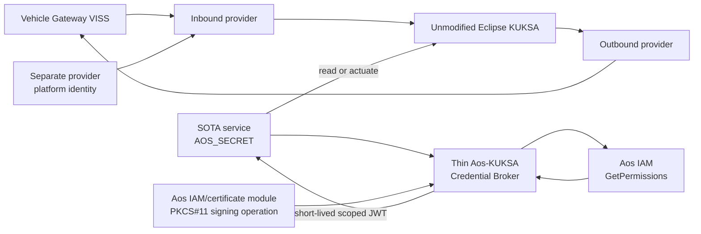

<!-- SPDX-FileCopyrightText: 2026 maninblack -->
<!-- SPDX-License-Identifier: MIT -->

# Vehicle Data Platform Component Requirements

- Status: Reviewed draft
- Package: [`CR-VDP`](../component-decomposition-and-interface-register.md#cr-vdp)
- Version: 0.2
- Prepared: 2026-08-19
- Owner: Platform Team / independent component FOTA
- Architecture input: [High-Level Architecture 1.4](../../architecture/high-level-architecture.md)
- Scenario input: [Demo Scenarios 1.5](../../demo/staged-post-sop-brake-health-demo-scenarios.md)
- Flow input: [Architecture Flows 1.4](../../architecture/demo-scenario-architecture-flows.md)
- System-requirements input: [System Requirements 0.7](../system-requirements-and-traceability.md)
- Component-register input: [Component Register 0.7](../component-decomposition-and-interface-register.md)
- Accepted architecture decisions: [ADR 0010](../../architecture/decisions/0010-aos-kuksa-credential-broker.md) and [ADR 0011](../../architecture/decisions/0011-qm-service-containment-and-evidence-backed-oem-approval.md)
- Implementation evidence: `aos-vehicle-platform@15b6abb`; provider `0.2.0`
  source pinned to `e972d2bd7f14e27646bb5d7c10c7186ecdecfa9f`

## Purpose

This package defines the post-SOP Vehicle Data Platform Component delivered by
the Platform Team into the provider-specific empty slot. It owns the versioned
vehicle-data contract, VISS-to-KUKSA publication, outbound advisory path and
the thin Aos-to-KUKSA credential translation required by unmodified Eclipse
KUKSA.

It deliberately does not own SOTA service identity. Aos Service Manager and
IAM create, register, resolve and invalidate each service instance's
`AOS_SECRET` and declared permissions. The Credential Broker consumes that
native result; it does not create a parallel identity store or duplicate
per-service OEM policy database.

Aos IAM/KUKSA permission mapping is a cybersecurity least-privilege mechanism
inside the QM domain, not a functional-safety argument. Neither successful
credential issuance nor this component's outbound validation grants safety or
vehicle-motion authority.

## Reader Summary

| Question | Answer |
| --- | --- |
| What this package owns | VDP v1-v3 artifacts, VISS client, signal validation/normalization, KUKSA contract/configuration, outbound advisory validation, thin Credential Broker, KUKSA public verifier, and provider platform-credential integration |
| What this package does not own | Factory Image, Aos SOTA identity/secret registration, a duplicate service-policy database, functional-service metadata, Cloud deployment approval, KUKSA executable fork, Gateway implementation or functional backends |
| Factory dependency | Healthy provider-specific empty slot, enabled stock IAM permission handler, KUKSA executable, and non-secret IAM/PKCS#11 signing-key seam |
| Intended lifecycle | Immutable component FOTA: Validation Unit first, then identical accepted bytes promoted to Demonstration Unit |
| Current state | Inbound provider and FOTA/runtime qualification evidence exist; accepted v1-v3 graph, thin broker, outbound path and provider identity binding remain work |

## Component and Credential Boundary

The broker accepts no user-supplied identity claim or independent permission
document. It maps only the currently registered IAM result and only within the
installed VDP contract. OEM review and authorized deployment remain lifecycle
decisions. Native pre-transfer Cloud permission admission is deferred until a
supporting AosEdge release is available and qualified.

## Current Implementation Baseline

| Capability | Current evidence | Required disposition |
| --- | --- | --- |
| Inbound provider | Provider `0.2.0`, seven-path profile `0.1.1`, VISS TLS, KUKSA publication, source timestamps, unavailable-state handling and reconnect qualification | Reuse and align to accepted v1-v3 contract |
| Component FOTA | Immutable package, local signature verification, A/B runtime lifecycle and rollback evidence | Freeze final artifact schema and Validation-to-Demonstration flow |
| KUKSA executable | External Eclipse KUKSA 0.5.0 using `kuksa.val.v1` | Keep unchanged; change only contract and verifier configuration |
| Provider credential | Host-generated static qualification JWT delivered through systemd credentials | Historical qualification only; replace with the accepted short-lived platform identity flow |
| SOTA credential broker | Not implemented | Implement thin IAM translation only |
| Signing key integration | Generic Aos IAM/certificate-module and PKCS#11 capability exists; no accepted broker binding | Qualify per-Unit protected-key operation; never use a baked or repository file key |
| Outbound advisory | Not implemented | Add typed, allowlisted v3 KUKSA-to-VISS-to-Gateway path |

## Interface Summary

| Interface | Contract | Failure behavior |
| --- | --- | --- |
| [`IF-VEH-005`](../component-decomposition-and-interface-register.md#if-veh-005) | TLS VISS Get/Subscribe input | Mark affected data unavailable; bounded reconnect; never fabricate zero |
| [`IF-DATA-001`](../component-decomposition-and-interface-register.md#if-data-001) | Validated actual values, freshness and provenance into KUKSA | Reject invalid value; publish explicit availability state |
| [`IF-ADV-002`](../component-decomposition-and-interface-register.md#if-adv-002) / [`IF-ADV-003`](../component-decomposition-and-interface-register.md#if-adv-003) | Typed KUKSA target to narrow VISS Set | Reject unknown caller/path/type/value; no unrestricted tunnel |
| [`IF-AUTH-001`](../component-decomposition-and-interface-register.md#if-auth-001) / [`IF-AUTH-002`](../component-decomposition-and-interface-register.md#if-auth-002) | Per-instance `AOS_SECRET` and IAM `GetPermissions` | Invalid, stale or unregistered secret returns no token |
| [`IF-AUTH-003`](../component-decomposition-and-interface-register.md#if-auth-003) | Exact IAM permission mapping to short-lived JWT | Unknown mode, malformed path or contract excess rejects the request; never widens or silently trims |
| [`IF-AUTH-004`](../component-decomposition-and-interface-register.md#if-auth-004) / [`IF-AUTH-005`](../component-decomposition-and-interface-register.md#if-auth-005) | KUKSA public verifier and platform-protected signing operation | Missing trust/key facility keeps broker unready; no file-key fallback |
| [`IF-AUTH-006`](../component-decomposition-and-interface-register.md#if-auth-006) | Separate short-lived provider credential | Missing or excessive provider identity keeps publication disabled |
| [`IF-LC-001`](../component-decomposition-and-interface-register.md#if-lc-001) / [`IF-LC-006`](../component-decomposition-and-interface-register.md#if-lc-006) | Immutable component FOTA and A/B runtime | Failed candidate leaves or restores previous accepted slot |

## Verification Strategy

| Level | Required proof |
| --- | --- |
| Unit | Signal mapping, type/range/freshness, permission parsing/mapping, JWT claims/expiry, advisory allowlist, state transitions and redaction with all external systems replaced by fakes |
| Component | Provider, broker and outbound path readiness/failure behavior in a disposable guest with test KUKSA/IAM/VISS endpoints |
| Contract | v1-v3 compatibility, VSS/KUKSA paths, Aos permission metadata, JWT verifier/audience/scope and FOTA runtime type |
| Integration | Real Aos IAM permission lifecycle, protected signing operation, unmodified KUKSA, VISS source loss, provider identity and A/B update/rollback |
| End-to-end | Validation-first FOTA, both independent SOTA consumers, offline local operation, typed advisory and identical promotion bytes |

## Requirement Summary

| Requirement | Plain-language obligation | State |
| --- | --- | --- |
| [Immutable lifecycle (`REQ-VDP-001`)](#req-vdp-001) | One identifiable FOTA artifact per release and identical promotion bytes | `PARTIAL` |
| [Versioned v1 data contract (`REQ-VDP-002`)](#req-vdp-002) | Publish only the accepted first read-only subset with explicit quality | `PARTIAL` |
| [Backward-compatible v2 (`REQ-VDP-003`)](#req-vdp-003) | Add Brake Health inputs without breaking v1 consumers | `TARGET` |
| [Explicit degraded state (`REQ-VDP-004`)](#req-vdp-004) | Never substitute fabricated normal values | `CURRENT / EXTEND` |
| [Defense-in-depth outbound v3 advisory (`REQ-VDP-005`)](#req-vdp-005) | Permit only typed QM Brake/Tire advisories; Gateway remains authoritative | `TARGET` |
| [Native-IAM credential translation (`REQ-VDP-006`)](#req-vdp-006) | Translate current IAM permissions without a parallel identity/policy store | `TARGET` |
| [Protected signing and KUKSA trust (`REQ-VDP-007`)](#req-vdp-007) | Use per-Unit protected key and public verifier only | `TARGET` |
| [Separate provider authority (`REQ-VDP-008`)](#req-vdp-008) | Give provider only bounded short-lived provide/create authority | `DESIGN GATE` |
| [Readiness and resource bounds (`REQ-VDP-009`)](#req-vdp-009) | Fail closed and remain bounded under dependency/resource failures | `PARTIAL` |
| [Compatibility and rollback (`REQ-VDP-010`)](#req-vdp-010) | Preserve supported services and rollback dependent-first | `TARGET / PARTIAL` |

## Detailed Requirements

### Immutable component lifecycle

The Platform Team shall build each VDP release as an immutable, versioned and
digest-addressed component FOTA artifact targeting only the accepted
provider-specific runtime. The exact accepted bytes shall move from Validation
to Demonstration without rebuild.

- Parents: [`SYS-REL-001`](../system-requirements-and-traceability.md#sys-rel-001), [`SYS-REL-004`](../system-requirements-and-traceability.md#sys-rel-004), [`SYS-REL-007`](../system-requirements-and-traceability.md#sys-rel-007), [`SYS-REL-008`](../system-requirements-and-traceability.md#sys-rel-008)
- Flows: [`AF-G1-LC`](../../architecture/demo-scenario-architecture-flows.md#af-g1-lc), [`AF-X-RELEASE`](../../architecture/demo-scenario-architecture-flows.md#af-x-release)
- Verification: unit, contract, integration and end-to-end

### Versioned v1 data contract

VDP v1 shall expose exactly the accepted first read-only subset with defined
VSS/KUKSA path, type, unit, range, cadence, timestamp, freshness, availability
and provenance semantics. No service shall see CARLA-only qualification truth.

- Parents: [`SYS-VDP-002`](../system-requirements-and-traceability.md#sys-vdp-002), [`SYS-SRC-004`](../system-requirements-and-traceability.md#sys-src-004)
- Flow: [`AF-G1-RT`](../../architecture/demo-scenario-architecture-flows.md#af-g1-rt)
- Verification: unit, contract, integration and end-to-end

### Backward-compatible v2

VDP v2 shall be a backward-compatible superset of v1, add only the accepted
Brake Health inputs and preserve the behavior of every supported v1 consumer.

- Parent: [`SYS-VDP-003`](../system-requirements-and-traceability.md#sys-vdp-003)
- Flow: [`AF-G3-RT`](../../architecture/demo-scenario-architecture-flows.md#af-g3-rt)
- Verification: unit, contract, integration and end-to-end

### Explicit degraded state

For each input and derived output, the component shall validate type/range,
preserve source time and distinguish available, stale, malformed, disconnected
and unavailable state. It shall clear retained values according to the
contract and shall never replace missing data with zero or another normal
value.

- Parent: [`SYS-VDP-005`](../system-requirements-and-traceability.md#sys-vdp-005)
- Flows: [`AF-G1-RT`](../../architecture/demo-scenario-architecture-flows.md#af-g1-rt), [`AF-G1-FR`](../../architecture/demo-scenario-architecture-flows.md#af-g1-fr)
- Verification: unit, component, integration and end-to-end

### Defense-in-depth outbound v3 advisory

VDP v3 shall accept only the versioned Brake Health and Tire Health advisory
targets, authorized callers, types and enum/range values; map them to the
narrow VISS Set contract; and expose factual accepted/rejected/Gateway status.
It shall not provide arbitrary display text, arbitrary VSS writes or
vehicle-motion authority. These services are QM-domain applications. This VDP
check is defense in depth and shall not be presented as the authoritative
vehicle-side or functional-safety boundary; the Vehicle Gateway independently
enforces the final deny-by-default QM-channel policy.

- Parents: [`SYS-VDP-004`](../system-requirements-and-traceability.md#sys-vdp-004), [`SYS-SEC-003`](../system-requirements-and-traceability.md#sys-sec-003), [`SYS-SEC-007`](../system-requirements-and-traceability.md#sys-sec-007)
- Flows: [`AF-G4-RT`](../../architecture/demo-scenario-architecture-flows.md#af-g4-rt), [`AF-TIRE-RT`](../../architecture/demo-scenario-architecture-flows.md#af-tire-rt), [`AF-X-QM`](../../architecture/demo-scenario-architecture-flows.md#af-x-qm)
- Verification: unit, contract, integration and end-to-end

### Native-IAM credential translation

The broker shall authenticate the presented per-instance `AOS_SECRET` only by
calling Aos IAM `GetPermissions(secret, "kuksa")` and shall map exactly the
currently registered `r`, `w` or `rw` paths that are valid in the installed VDP
contract into a short-lived KUKSA JWT. It shall reject the complete exchange on
invalid/stale secret, unknown mode, malformed path or contract excess, never
widen the IAM result, retain no service secret, and maintain no parallel
identity or per-service policy database.

- Parents: [`SYS-SEC-001`](../system-requirements-and-traceability.md#sys-sec-001), [`SYS-SEC-006`](../system-requirements-and-traceability.md#sys-sec-006)
- Flow: [`AF-X-AUTH`](../../architecture/demo-scenario-architecture-flows.md#af-x-auth)
- Verification: unit, contract, integration and end-to-end

### Protected signing and KUKSA trust

The broker shall sign through the accepted per-Unit Aos
IAM/certificate-module and PKCS#11 facility without reading or exporting key
bytes. KUKSA shall trust only the configured public verifier and shall validate
issuer, audience, expiry and path permissions. Missing key/trust state shall
keep the broker unready. Signing keys, `AOS_SECRET` and JWTs shall not enter
Git, image/update artifacts, command lines or logs.

- Parent: [`SYS-SEC-004`](../system-requirements-and-traceability.md#sys-sec-004)
- Flow: [`AF-X-AUTH`](../../architecture/demo-scenario-architecture-flows.md#af-x-auth)
- Verification: unit, contract, integration and inspection

### Separate provider authority

The inbound provider shall obtain a separate short-lived platform credential
limited to the exact accepted `provide`/`create` paths. It shall not reuse a
functional-service credential or a static qualification token. D4 and
implementation shall not begin until the FOTA-component identity binding,
renewal, revocation and failure behavior are accepted and qualified.

- Parent: [`SYS-SEC-005`](../system-requirements-and-traceability.md#sys-sec-005)
- Flow: [`AF-X-AUTH`](../../architecture/demo-scenario-architecture-flows.md#af-x-auth)
- Verification: contract, integration and end-to-end; unit tests for owned client state after mechanism selection

### Readiness and resource bounds

The component shall remain unready and fail closed when VISS, KUKSA, IAM,
protected signing, provider identity, contract or storage dependencies are
missing or inconsistent. CPU, memory, file/process count, storage, reconnect,
queue, token and log volume shall be bounded, and logs shall contain only
factual redacted state.

- Parents: [`SYS-SEC-003`](../system-requirements-and-traceability.md#sys-sec-003), [`SYS-OBS-003`](../system-requirements-and-traceability.md#sys-obs-003), [`SYS-TIM-001`](../system-requirements-and-traceability.md#sys-tim-001)
- Flows: [`AF-G0-FR`](../../architecture/demo-scenario-architecture-flows.md#af-g0-fr), [`AF-X-OBS`](../../architecture/demo-scenario-architecture-flows.md#af-x-obs)
- Verification: unit, component, integration and end-to-end

### Compatibility and rollback

Each release shall publish a machine-readable contract version and compatible
service range. Update, restart, interruption and rollback shall preserve the
previous accepted component until commit; any incompatible dependent service
shall be stopped or rolled back before the platform component, while unrelated
service lifecycles remain unchanged.

- Parents: [`SYS-REL-003`](../system-requirements-and-traceability.md#sys-rel-003), [`SYS-REL-005`](../system-requirements-and-traceability.md#sys-rel-005)
- Flows: [`AF-G3-LC`](../../architecture/demo-scenario-architecture-flows.md#af-g3-lc), [`AF-G3-FR`](../../architecture/demo-scenario-architecture-flows.md#af-g3-fr)
- Verification: unit, contract, integration and end-to-end

## Unit-Test Obligations

| Obligation | Requirements | Required isolated proof |
| --- | --- | --- |
| `UT-VDP-001` — Artifact and contract identity | `REQ-VDP-001`, `REQ-VDP-002`, `REQ-VDP-003`, `REQ-VDP-010` | Exact version/digest/runtime type, v1-v3 schema compatibility, wrong target and forbidden rebuild inputs |
| `UT-VDP-002` — Signal quality state machine | `REQ-VDP-002`, `REQ-VDP-004` | Valid/invalid/range/stale/disconnect/reconnect transitions, source time and no fabricated value |
| `UT-VDP-003` — Defense-in-depth advisory policy | `REQ-VDP-005` | Each accepted Brake/Tire request plus unknown caller/path/type/value, stale/replay/rate/correlation and vehicle-motion/safety negatives; prove Gateway still enforces independently |
| `UT-VDP-004` — IAM permission mapping | `REQ-VDP-006` | Invalid/stale secrets, exact `r`/`w`/`rw` mapping, malformed path/mode, contract excess, no widening and no retained secret |
| `UT-VDP-005` — JWT lifecycle and redaction | `REQ-VDP-007`, `REQ-VDP-009` | Claims, audience, expiry/refresh, permission removal, clock bounds, missing signer/verifier and no secret/token logging |
| `UT-VDP-006` — Provider credential lifecycle | `REQ-VDP-008` | After identity mechanism acceptance: obtain, renew, revoke, excessive scope, unavailable identity and no static-token fallback |
| `UT-VDP-007` — Readiness and recovery | `REQ-VDP-004`, `REQ-VDP-009`, `REQ-VDP-010` | Dependency loss/recovery, bounded reconnect/resources, update interruption and previous-slot preservation |

Unit tests replace VISS, KUKSA, Aos IAM, protected signing, clock, filesystem
and runtime control with deterministic fakes. They do not start CARLA, QEMU,
AosCloud or a real Databroker. Real IAM registration, PKCS#11 signing, KUKSA
verification and component FOTA remain required integration evidence.

## Open Design and Qualification Gates

| Gate | Why it remains open | Owner |
| --- | --- | --- |
| Exact provider platform identity binding | A FOTA provider does not automatically receive the SOTA `AOS_SECRET`; static token reuse is prohibited | Platform Team plus Aos platform architecture |
| Exact broker signing module/key lifecycle | Generic Aos IAM/certificate-module and PKCS#11 facilities exist, but the accepted per-Unit broker binding is not configured or qualified | Platform Team plus Aos security architecture |
| Final v1-v3 signal/advisory contract | Current profile is engineering evidence, not the accepted staged demo contract | Platform Team plus Gateway and Function Teams |
| Native Cloud permission admission | Platform roadmap capability is not released; no project-side substitute is allowed | AosEdge Platform Team |

Acceptance of this package does not authorize implementation, image rebuild,
signing, Cloud upload, VM restart, provisioning or Unit mutation.
