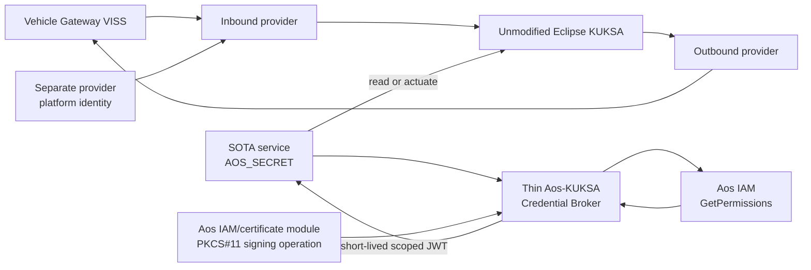

<!-- SPDX-FileCopyrightText: 2026 maninblack -->
<!-- SPDX-License-Identifier: MIT -->

# Vehicle Data Platform Component Requirements

- Status: D3 design-reviewed
- Package: [`CR-VDP`](../component-decomposition-and-interface-register.md#cr-vdp)
- Version: 0.3
- Prepared: 2026-08-19
- Owner: Platform Team / independent component FOTA
- Architecture input: [High-Level Architecture 1.4](../../architecture/high-level-architecture.md)
- Scenario input: [Demo Scenarios 1.7](../../demo/staged-post-sop-brake-health-demo-scenarios.md)
- Flow input: [Architecture Flows 1.6](../../architecture/demo-scenario-architecture-flows.md)
- System-requirements input: [System Requirements 0.9](../system-requirements-and-traceability.md)
- Component-register input: [Component Register 0.9](../component-decomposition-and-interface-register.md)
- Accepted architecture decisions: [ADR 0010](../../architecture/decisions/0010-aos-kuksa-credential-broker.md) and [ADR 0011](../../architecture/decisions/0011-qm-service-containment-and-evidence-backed-oem-approval.md)
- Implementation evidence: `aos-vehicle-platform@15b6abb`; provider `0.2.0`
  source pinned to `e972d2bd7f14e27646bb5d7c10c7186ecdecfa9f`

## Purpose

This package defines the post-SOP Vehicle Data Platform Component delivered by
the Platform Team into the provider-specific empty slot. It owns the versioned
vehicle-data contract, VISS-to-KUKSA publication, outbound advisory path and
the thin Aos-to-KUKSA credential translation required by unmodified Eclipse
KUKSA.

It deliberately does not own SOTA service identity. Aos Service Manager and
IAM create, register, resolve and invalidate each service instance's
`AOS_SECRET` and declared permissions. The Credential Broker consumes that
native result; it does not create a parallel identity store or duplicate
per-service OEM policy database.

Aos IAM/KUKSA permission mapping is a cybersecurity least-privilege mechanism
inside the QM domain, not a functional-safety argument. Neither successful
credential issuance nor this component's outbound validation grants safety or
vehicle-motion authority.

## Reader Summary

| Question | Answer |
| --- | --- |
| What this package owns | VDP v1-v3 artifacts, VISS client, signal validation/normalization, KUKSA contract/configuration, outbound advisory validation, thin Credential Broker, KUKSA public verifier, and provider platform-credential integration |
| What this package does not own | Factory Image, Aos SOTA identity/secret registration, a duplicate service-policy database, functional-service metadata, Cloud deployment approval, KUKSA executable fork, Gateway implementation or functional backends |
| Factory dependency | Healthy provider-specific empty slot, enabled stock IAM permission handler, KUKSA executable, and non-secret IAM/PKCS#11 signing-key seam |
| Intended lifecycle | Immutable component FOTA: Validation Unit first, then identical accepted bytes promoted to Demonstration Unit |
| Current state | Inbound provider and FOTA/runtime qualification evidence exist; accepted v1-v3 graph, thin broker, outbound path and provider identity binding remain work |

## Component and Credential Boundary

The broker accepts no user-supplied identity claim or independent permission
document. It maps only the currently registered IAM result and only within the
installed VDP contract. OEM review and authorized deployment remain lifecycle
decisions. Native pre-transfer Cloud permission admission is deferred until a
supporting AosEdge release is available and qualified.

## Current Implementation Baseline

| Capability | Current evidence | Required disposition |
| --- | --- | --- |
| Inbound provider | Provider `0.2.0`, seven-path profile `0.1.1`, VISS TLS, KUKSA publication, source timestamps, unavailable-state handling and reconnect qualification | Reuse and align to accepted v1-v3 contract |
| Component FOTA | Immutable package, local signature verification, A/B runtime lifecycle and rollback evidence | Freeze final artifact schema and Validation-to-Demonstration flow |
| KUKSA executable | External Eclipse KUKSA 0.5.0 using `kuksa.val.v1` | Keep unchanged; change only contract and verifier configuration |
| Provider credential | Host-generated static qualification JWT delivered through systemd credentials | Historical qualification only; replace with the accepted short-lived platform identity flow |
| SOTA credential broker | Not implemented | Implement thin IAM translation only |
| Signing key integration | Generic Aos IAM/certificate-module and PKCS#11 capability exists; no accepted broker binding | Qualify per-Unit protected-key operation; never use a baked or repository file key |
| Outbound advisory | Not implemented | Add typed, allowlisted v3 KUKSA-to-VISS-to-Gateway path |

## Testability Boundary

Owned mapping, freshness, permission translation, JWT construction, advisory
validation, readiness, retry and rollback decisions shall be testable without
CARLA, QEMU, AosCloud or a real KUKSA Databroker. VISS, KUKSA, Aos IAM,
protected signing, component runtime, persistence and clocks are deterministic
test seams. The unmodified Eclipse KUKSA executable is not unit-tested by this
project; its verifier, authorization and data behavior are proved through
versioned contract and integration tests.

Live Service Manager identity registration, per-Unit PKCS#11 signing,
unmodified KUKSA verification, provider identity and component FOTA remain
integration obligations and shall not be replaced by mocks in acceptance
evidence.

## Interface Summary

| Interface | Direction at VDP | Data or command | Failure behavior | Authority |
| --- | --- | --- | --- | --- |
| [`IF-VEH-005`](../component-decomposition-and-interface-register.md#if-veh-005) | In | TLS VISS Get/Subscribe values, metadata and source state | Mark affected data unavailable; bounded reconnect; never fabricate zero | Vehicle Gateway VISS |
| [`IF-DATA-001`](../component-decomposition-and-interface-register.md#if-data-001) | Out | Validated actual values, freshness and provenance into KUKSA | Reject invalid values and expose explicit availability | Installed VDP contract plus source state |
| [`IF-ADV-002`](../component-decomposition-and-interface-register.md#if-adv-002) | In | Typed Brake/Tire KUKSA advisory targets | Reject unknown caller/path/type/value, stale or replayed request | Aos IAM permission plus installed VDP contract |
| [`IF-ADV-003`](../component-decomposition-and-interface-register.md#if-adv-003) | Out | Narrow typed VISS Set request and correlated status | Reject contract excess; no arbitrary VSS tunnel | Vehicle Gateway is final enforcement authority |
| [`IF-AUTH-001`](../component-decomposition-and-interface-register.md#if-auth-001) / [`IF-AUTH-002`](../component-decomposition-and-interface-register.md#if-auth-002) | In/Out | Per-instance `AOS_SECRET` and IAM `GetPermissions` lookup | Invalid, stale or unregistered secret returns no token | Aos Service Manager and IAM |
| [`IF-AUTH-003`](../component-decomposition-and-interface-register.md#if-auth-003) | Out | Exact IAM permission mapping to short-lived JWT | Unknown mode, malformed path or contract excess rejects the complete exchange | Current IAM permission result bounded by installed VDP contract |
| [`IF-AUTH-004`](../component-decomposition-and-interface-register.md#if-auth-004) / [`IF-AUTH-005`](../component-decomposition-and-interface-register.md#if-auth-005) | Out/Dependency | KUKSA public verifier and platform-protected signing operation | Missing trust/key facility keeps broker unready; no file-key fallback | Per-Unit Aos protected-key lifecycle and configured KUKSA verifier |
| [`IF-AUTH-006`](../component-decomposition-and-interface-register.md#if-auth-006) | In | Separate short-lived provider credential | Missing, stale or excessive authority disables publication | Accepted provider platform-identity mechanism |
| [`IF-LC-001`](../component-decomposition-and-interface-register.md#if-lc-001) / [`IF-LC-006`](../component-decomposition-and-interface-register.md#if-lc-006) | In/Out | Immutable component FOTA and A/B runtime state | Failed candidate leaves or restores the previous accepted slot | AosCloud desired state and Service Manager actual state |

## Verification Strategy

| Level | Purpose | Dependency boundary | Required | Planned evidence |
| --- | --- | --- | --- | --- |
| Unit | Prove mapping, freshness, permission translation, JWT, advisory, readiness and recovery decisions | All external systems replaced by deterministic fakes | Yes | `UT-VDP-*` repository-gate report |
| Component | Prove provider, broker and outbound path behavior through packaged boundaries | Disposable guest with controlled VISS/KUKSA/IAM/signing doubles | Yes | Component readiness, failure and recovery report |
| Contract | Prove v1-v3 compatibility, permission metadata, JWT and runtime type | Versioned schemas, fixtures and conformance harness | Yes | D4 contract-suite result and fixture digests |
| Integration | Prove native IAM, protected signing, unmodified KUKSA, provider identity and A/B lifecycle | Disposable AosVM and controlled adjacent real components | Yes | Exact revisions, configuration and redacted integration record |
| End-to-end | Prove validation-first FOTA, independent SOTA consumers, offline operation, advisory and identical promotion bytes | Complete Validation and Demonstration lanes | Yes | G1-G4/T1 lifecycle and runtime evidence |

## Requirement Summary

| Requirement | Plain-language obligation | Verification levels | Design state | Implementation state |
| --- | --- | --- | --- | --- |
| [Immutable lifecycle (`REQ-VDP-001`)](#req-vdp-001) | One identifiable FOTA artifact per release and identical promotion bytes | Unit, Contract, Integration, End-to-end | D3 design-reviewed | `PARTIAL` |
| [Versioned v1 data contract (`REQ-VDP-002`)](#req-vdp-002) | Publish only the accepted first read-only subset with explicit quality | Unit, Contract, Integration, End-to-end | D3 design-reviewed | `PARTIAL` |
| [Backward-compatible v2 (`REQ-VDP-003`)](#req-vdp-003) | Add Brake Health inputs without breaking v1 consumers | Unit, Contract, Integration, End-to-end | D3 design-reviewed | `TARGET` |
| [Explicit degraded state (`REQ-VDP-004`)](#req-vdp-004) | Never substitute fabricated normal values | Unit, Component, Integration, End-to-end | D3 design-reviewed | `CURRENT / EXTEND` |
| [Defense-in-depth outbound v3 advisory (`REQ-VDP-005`)](#req-vdp-005) | Permit only typed QM Brake/Tire advisories; Gateway remains authoritative | Unit, Contract, Integration, End-to-end | D3 design-reviewed | `TARGET` |
| [Native-IAM credential translation (`REQ-VDP-006`)](#req-vdp-006) | Translate current IAM permissions without a parallel identity/policy store | Unit, Contract, Integration, End-to-end | D3 design-reviewed | `TARGET` |
| [Protected signing and KUKSA trust (`REQ-VDP-007`)](#req-vdp-007) | Use per-Unit protected key and public verifier only | Unit, Contract, Integration, Inspection | D3 design-reviewed | `TARGET` |
| [Separate provider authority (`REQ-VDP-008`)](#req-vdp-008) | Give provider only bounded short-lived provide/create authority | Unit after mechanism selection, Contract, Integration, End-to-end | D3 design-reviewed | `DESIGN GATE` |
| [Readiness and resource bounds (`REQ-VDP-009`)](#req-vdp-009) | Fail closed and remain bounded under dependency/resource failures | Unit, Component, Integration, End-to-end | D3 design-reviewed | `PARTIAL` |
| [Compatibility and rollback (`REQ-VDP-010`)](#req-vdp-010) | Preserve supported services and rollback dependent-first | Unit, Contract, Integration, End-to-end | D3 design-reviewed | `TARGET / PARTIAL` |

## Detailed Requirements

### Immutable component lifecycle

The Platform Team shall build each VDP release as an immutable, versioned and
digest-addressed component FOTA artifact targeting only the accepted
provider-specific runtime. The exact accepted bytes shall move from Validation
to Demonstration without rebuild.

- Parents: [`SYS-REL-001`](../system-requirements-and-traceability.md#sys-rel-001), [`SYS-REL-004`](../system-requirements-and-traceability.md#sys-rel-004), [`SYS-REL-007`](../system-requirements-and-traceability.md#sys-rel-007), [`SYS-REL-008`](../system-requirements-and-traceability.md#sys-rel-008)
- Flows: [`AF-G1-LC`](../../architecture/demo-scenario-architecture-flows.md#af-g1-lc), [`AF-X-RELEASE`](../../architecture/demo-scenario-architecture-flows.md#af-x-release)
- Components: [Vehicle Data Platform (`CMP-VDP`)](../component-decomposition-and-interface-register.md#cmp-vdp), [AosCloud (`CMP-AOS-CLOUD`)](../component-decomposition-and-interface-register.md#cmp-aos-cloud), [AosCore (`CMP-AOS-CORE`)](../component-decomposition-and-interface-register.md#cmp-aos-core) and [Empty-Slot Runtime (`CMP-RUNTIME`)](../component-decomposition-and-interface-register.md#cmp-runtime)
- Interfaces: [platform FOTA (`IF-LC-001`)](../component-decomposition-and-interface-register.md#if-lc-001), [Platform Team approval (`IF-LC-008`)](../component-decomposition-and-interface-register.md#if-lc-008) and [runtime enforcement (`IF-LC-006`)](../component-decomposition-and-interface-register.md#if-lc-006)
- Verification: unit, contract, integration and end-to-end
- Required evidence: exact artifact/metadata digests, approval basis, target, runtime type, accepted Validation result and identical Demonstration bytes
- Requirement state: D3 design-reviewed

### Versioned v1 data contract

VDP v1 shall expose exactly the accepted first read-only subset with defined
VSS/KUKSA path, type, unit, range, cadence, timestamp, freshness, availability
and provenance semantics. No service shall see CARLA-only qualification truth.

- Parents: [`SYS-VDP-002`](../system-requirements-and-traceability.md#sys-vdp-002), [`SYS-SRC-004`](../system-requirements-and-traceability.md#sys-src-004)
- Flow: [`AF-G1-RT`](../../architecture/demo-scenario-architecture-flows.md#af-g1-rt)
- Components: [Vehicle Data Platform (`CMP-VDP`)](../component-decomposition-and-interface-register.md#cmp-vdp) and [KUKSA (`CMP-KUKSA`)](../component-decomposition-and-interface-register.md#cmp-kuksa)
- Interfaces: [VISS input (`IF-VEH-005`)](../component-decomposition-and-interface-register.md#if-veh-005) and [KUKSA publication (`IF-DATA-001`)](../component-decomposition-and-interface-register.md#if-data-001)
- Verification: unit, contract, integration and end-to-end
- Required evidence: v1 manifest and fixture digest, positive/negative publication results and explicit quality/unavailable-state evidence
- Requirement state: D3 design-reviewed

### Backward-compatible v2

VDP v2 shall be a backward-compatible superset of v1, add only the accepted
Brake Health inputs and preserve the behavior of every supported v1 consumer.

- Parent: [`SYS-VDP-003`](../system-requirements-and-traceability.md#sys-vdp-003)
- Flow: [`AF-G3-RT`](../../architecture/demo-scenario-architecture-flows.md#af-g3-rt)
- Components: [Vehicle Data Platform (`CMP-VDP`)](../component-decomposition-and-interface-register.md#cmp-vdp) and [KUKSA (`CMP-KUKSA`)](../component-decomposition-and-interface-register.md#cmp-kuksa)
- Interfaces: [VISS input (`IF-VEH-005`)](../component-decomposition-and-interface-register.md#if-veh-005), [KUKSA publication (`IF-DATA-001`)](../component-decomposition-and-interface-register.md#if-data-001) and [Brake subscription (`IF-DATA-002`)](../component-decomposition-and-interface-register.md#if-data-002)
- Verification: unit, contract, integration and end-to-end
- Required evidence: v1/v2 compatibility report, unchanged v1 fixtures and live v1 consumer operation on v2
- Requirement state: D3 design-reviewed

### Explicit degraded state

For each input and derived output, the component shall validate type/range,
preserve source time and distinguish available, stale, malformed, disconnected
and unavailable state. It shall clear retained values according to the
contract and shall never replace missing data with zero or another normal
value.

- Parent: [`SYS-VDP-005`](../system-requirements-and-traceability.md#sys-vdp-005)
- Flows: [`AF-G1-RT`](../../architecture/demo-scenario-architecture-flows.md#af-g1-rt), [`AF-G1-FR`](../../architecture/demo-scenario-architecture-flows.md#af-g1-fr)
- Components: [Vehicle Data Platform (`CMP-VDP`)](../component-decomposition-and-interface-register.md#cmp-vdp) and [KUKSA (`CMP-KUKSA`)](../component-decomposition-and-interface-register.md#cmp-kuksa)
- Interfaces: [VISS input (`IF-VEH-005`)](../component-decomposition-and-interface-register.md#if-veh-005) and [KUKSA publication (`IF-DATA-001`)](../component-decomposition-and-interface-register.md#if-data-001)
- Verification: unit, component, integration and end-to-end
- Required evidence: deterministic quality-state transition report plus live disconnect/reconnect record with source timestamps
- Requirement state: D3 design-reviewed

### Defense-in-depth outbound v3 advisory

VDP v3 shall accept only the versioned Brake Health and Tire Health advisory
targets, authorized callers, types and enum/range values; map them to the
narrow VISS Set contract; and expose factual accepted/rejected/Gateway status.
It shall not provide arbitrary display text, arbitrary VSS writes or
vehicle-motion authority. These services are QM-domain applications. This VDP
check is defense in depth and shall not be presented as the authoritative
vehicle-side or functional-safety boundary; the Vehicle Gateway independently
enforces the final deny-by-default QM-channel policy.

- Parents: [`SYS-VDP-004`](../system-requirements-and-traceability.md#sys-vdp-004), [`SYS-SEC-003`](../system-requirements-and-traceability.md#sys-sec-003), [`SYS-SEC-007`](../system-requirements-and-traceability.md#sys-sec-007)
- Flows: [`AF-G4-RT`](../../architecture/demo-scenario-architecture-flows.md#af-g4-rt), [`AF-TIRE-RT`](../../architecture/demo-scenario-architecture-flows.md#af-tire-rt), [`AF-X-QM`](../../architecture/demo-scenario-architecture-flows.md#af-x-qm)
- Components: [Vehicle Data Platform (`CMP-VDP`)](../component-decomposition-and-interface-register.md#cmp-vdp), [KUKSA (`CMP-KUKSA`)](../component-decomposition-and-interface-register.md#cmp-kuksa) and [Gateway Advisory Handler (`CMP-GW-ADV`)](../component-decomposition-and-interface-register.md#cmp-gw-adv)
- Interfaces: [KUKSA advisory target (`IF-ADV-002`)](../component-decomposition-and-interface-register.md#if-adv-002), [outbound VISS Set (`IF-ADV-003`)](../component-decomposition-and-interface-register.md#if-adv-003) and [Gateway status (`IF-ADV-005`)](../component-decomposition-and-interface-register.md#if-adv-005)
- Verification: unit, contract, integration and end-to-end
- Required evidence: complete allow/deny matrix, correlated VISS/Gateway status and proof of independent authoritative Gateway rejection
- Requirement state: D3 design-reviewed

### Native-IAM credential translation

The broker shall authenticate the presented per-instance `AOS_SECRET` only by
calling Aos IAM `GetPermissions(secret, "kuksa")` and shall map exactly the
currently registered `r`, `w` or `rw` paths that are valid in the installed VDP
contract into a short-lived KUKSA JWT. It shall reject the complete exchange on
invalid/stale secret, unknown mode, malformed path or contract excess, never
widen the IAM result, retain no service secret, and maintain no parallel
identity or per-service policy database.

- Parents: [`SYS-SEC-001`](../system-requirements-and-traceability.md#sys-sec-001), [`SYS-SEC-006`](../system-requirements-and-traceability.md#sys-sec-006)
- Flow: [`AF-X-AUTH`](../../architecture/demo-scenario-architecture-flows.md#af-x-auth)
- Components: [Vehicle Data Platform Credential Broker (`CMP-VDP`)](../component-decomposition-and-interface-register.md#cmp-vdp), [AosCore IAM (`CMP-AOS-CORE`)](../component-decomposition-and-interface-register.md#cmp-aos-core) and [KUKSA (`CMP-KUKSA`)](../component-decomposition-and-interface-register.md#cmp-kuksa)
- Interfaces: [service credential request (`IF-AUTH-001`)](../component-decomposition-and-interface-register.md#if-auth-001), [IAM permission lookup (`IF-AUTH-002`)](../component-decomposition-and-interface-register.md#if-auth-002) and [short-lived JWT (`IF-AUTH-003`)](../component-decomposition-and-interface-register.md#if-auth-003)
- Verification: unit, contract, integration and end-to-end
- Required evidence: permission-to-JWT conformance, invalid/excess negative results, native IAM integration and proof of no parallel identity/policy state
- Requirement state: D3 design-reviewed

### Protected signing and KUKSA trust

The broker shall sign through the accepted per-Unit Aos
IAM/certificate-module and PKCS#11 facility without reading or exporting key
bytes. KUKSA shall trust only the configured public verifier and shall validate
issuer, audience, expiry and path permissions. Missing key/trust state shall
keep the broker unready. Signing keys, `AOS_SECRET` and JWTs shall not enter
Git, image/update artifacts, command lines or logs.

- Parent: [`SYS-SEC-004`](../system-requirements-and-traceability.md#sys-sec-004)
- Flow: [`AF-X-AUTH`](../../architecture/demo-scenario-architecture-flows.md#af-x-auth)
- Components: [Vehicle Data Platform Credential Broker (`CMP-VDP`)](../component-decomposition-and-interface-register.md#cmp-vdp), [AosCore (`CMP-AOS-CORE`)](../component-decomposition-and-interface-register.md#cmp-aos-core) and [KUKSA (`CMP-KUKSA`)](../component-decomposition-and-interface-register.md#cmp-kuksa)
- Interfaces: [KUKSA verifier (`IF-AUTH-004`)](../component-decomposition-and-interface-register.md#if-auth-004) and [protected signing substrate (`IF-AUTH-005`)](../component-decomposition-and-interface-register.md#if-auth-005)
- Verification: unit, contract, integration and inspection
- Required evidence: disposable per-Unit protected-sign result, public-verifier conformance and secret/key/token-negative artifact and log scans
- Requirement state: D3 design-reviewed

### Separate provider authority

The inbound provider shall obtain a separate short-lived platform credential
limited to the exact accepted `provide`/`create` paths. It shall not reuse a
functional-service credential or a static qualification token. D4 and
implementation shall not begin until the FOTA-component identity binding,
renewal, revocation and failure behavior are accepted and qualified.

- Parent: [`SYS-SEC-005`](../system-requirements-and-traceability.md#sys-sec-005)
- Flow: [`AF-X-AUTH`](../../architecture/demo-scenario-architecture-flows.md#af-x-auth)
- Components: [Vehicle Data Platform provider (`CMP-VDP`)](../component-decomposition-and-interface-register.md#cmp-vdp) and [AosCore (`CMP-AOS-CORE`)](../component-decomposition-and-interface-register.md#cmp-aos-core)
- Interface: [provider platform credential (`IF-AUTH-006`)](../component-decomposition-and-interface-register.md#if-auth-006)
- Verification: contract, integration and end-to-end; unit tests for owned client state after mechanism selection
- Required evidence: accepted identity-mechanism decision, bounded scope/renew/revoke cases and proof that no static qualification token remains
- Requirement state: D3 design-reviewed; implementation remains blocked on the named identity-mechanism gate

### Readiness and resource bounds

The component shall remain unready and fail closed when VISS, KUKSA, IAM,
protected signing, provider identity, contract or storage dependencies are
missing or inconsistent. CPU, memory, file/process count, storage, reconnect,
queue, token and log volume shall be bounded, and logs shall contain only
factual redacted state.

- Parents: [`SYS-SEC-003`](../system-requirements-and-traceability.md#sys-sec-003), [`SYS-OBS-003`](../system-requirements-and-traceability.md#sys-obs-003), [`SYS-TIM-001`](../system-requirements-and-traceability.md#sys-tim-001)
- Flows: [`AF-G0-FR`](../../architecture/demo-scenario-architecture-flows.md#af-g0-fr), [`AF-X-OBS`](../../architecture/demo-scenario-architecture-flows.md#af-x-obs)
- Components: [Vehicle Data Platform (`CMP-VDP`)](../component-decomposition-and-interface-register.md#cmp-vdp), [KUKSA (`CMP-KUKSA`)](../component-decomposition-and-interface-register.md#cmp-kuksa) and [AosCore (`CMP-AOS-CORE`)](../component-decomposition-and-interface-register.md#cmp-aos-core)
- Interfaces: [VISS input (`IF-VEH-005`)](../component-decomposition-and-interface-register.md#if-veh-005), [KUKSA publication (`IF-DATA-001`)](../component-decomposition-and-interface-register.md#if-data-001), [IAM permission lookup (`IF-AUTH-002`)](../component-decomposition-and-interface-register.md#if-auth-002) and [runtime enforcement (`IF-LC-006`)](../component-decomposition-and-interface-register.md#if-lc-006)
- Verification: unit, component, integration and end-to-end
- Required evidence: bounded resource and retry metrics, readiness transitions, redacted native logs and dependency fault/recovery results
- Requirement state: D3 design-reviewed

### Compatibility and rollback

Each release shall publish a machine-readable contract version and compatible
service range. Update, restart, interruption and rollback shall preserve the
previous accepted component until commit; any incompatible dependent service
shall be stopped or rolled back before the platform component, while unrelated
service lifecycles remain unchanged.

- Parents: [`SYS-REL-003`](../system-requirements-and-traceability.md#sys-rel-003), [`SYS-REL-005`](../system-requirements-and-traceability.md#sys-rel-005)
- Flows: [`AF-G3-LC`](../../architecture/demo-scenario-architecture-flows.md#af-g3-lc), [`AF-G3-FR`](../../architecture/demo-scenario-architecture-flows.md#af-g3-fr)
- Components: [Vehicle Data Platform (`CMP-VDP`)](../component-decomposition-and-interface-register.md#cmp-vdp), [AosCore (`CMP-AOS-CORE`)](../component-decomposition-and-interface-register.md#cmp-aos-core) and [Empty-Slot Runtime (`CMP-RUNTIME`)](../component-decomposition-and-interface-register.md#cmp-runtime)
- Interfaces: [platform FOTA (`IF-LC-001`)](../component-decomposition-and-interface-register.md#if-lc-001) and [runtime enforcement (`IF-LC-006`)](../component-decomposition-and-interface-register.md#if-lc-006)
- Verification: unit, contract, integration and end-to-end
- Required evidence: machine-readable compatibility range, dependent-first stop/rollback ordering, previous-slot recovery and unrelated-service continuity
- Requirement state: D3 design-reviewed

## Requirement Acceptance Criteria

This table is normative for D3. D4 replaces the provisional case descriptions
with executable fixtures, bounds and evidence locations without changing the
requirement semantics.

| Requirement | Positive acceptance | Boundary or malformed acceptance | Dependency/failure/recovery acceptance |
| --- | --- | --- | --- |
| [`REQ-VDP-001`](#req-vdp-001) | Exact version, digest, runtime type and bytes are retained from Validation acceptance through Demonstration promotion | Wrong target, type, version/digest mismatch or rebuilt promotion bytes are rejected before apply | Interrupted or unhealthy candidate never replaces the previous accepted slot |
| [`REQ-VDP-002`](#req-vdp-002) | Every accepted v1 path has the frozen type, unit, cadence, freshness, provenance and availability semantics | Unknown path, wrong type/range or qualification-only truth is rejected without widening the contract | Missing/stale source becomes explicit unavailable state and recovers only from a valid fresh sample |
| [`REQ-VDP-003`](#req-vdp-003) | Every v1 fixture and consumer remains valid after the accepted v2 Brake input subset is added | Duplicate, incompatible or semantically changed v1 definitions fail compatibility validation | A failed v2 candidate preserves the accepted v1 release and consumer operation |
| [`REQ-VDP-004`](#req-vdp-004) | Valid source data preserves source time and produces the corresponding quality state | Future, stale, malformed, out-of-range or out-of-order input cannot appear as a normal value | Disconnect clears or marks affected state by contract; reconnect resumes only after valid fresh input |
| [`REQ-VDP-005`](#req-vdp-005) | An authorized, fresh, typed Brake or Tire advisory maps to exactly one narrow VISS Set request with correlation | Wrong caller/path/type/value, arbitrary text/VSS, replay, rate excess and all motion/safety commands are rejected with no Set side effect | VISS/Gateway rejection is reported factually; Gateway independently denies requests outside its own QM-channel policy |
| [`REQ-VDP-006`](#req-vdp-006) | A current registered `AOS_SECRET` maps its exact valid `r`, `w` or `rw` paths into one short-lived JWT | Invalid/stale secret, malformed mode/path or any permission outside the installed contract rejects the complete exchange without silent trimming | IAM unavailability issues no token; recovery requires a fresh IAM result and no retained service secret |
| [`REQ-VDP-007`](#req-vdp-007) | The broker signs through the accepted per-Unit protected operation and KUKSA validates issuer, audience, expiry and path permissions | Wrong verifier, audience, claims, expiry or file-key configuration is rejected | Missing key/module/verifier keeps the broker unready; key bytes, secrets and JWTs never enter artifacts, commands or logs |
| [`REQ-VDP-008`](#req-vdp-008) | The provider obtains and renews only the accepted short-lived provide/create scope | Excessive, stale, revoked or service-derived credentials cannot publish | Identity service loss disables publication and recovery requires a newly valid credential; static-token fallback is prohibited |
| [`REQ-VDP-009`](#req-vdp-009) | All mandatory dependencies and resource limits produce ready state and bounded normal operation | Queue, reconnect, file/process, storage, token or log limits reject or degrade work without unbounded growth | Any inconsistent mandatory dependency produces fail-closed unready state; bounded recovery is factual and secret-free |
| [`REQ-VDP-010`](#req-vdp-010) | Supported services remain compatible across the declared contract range and identical accepted bytes promote | Unsupported service/component combinations are detected before a destructive transition | Interruption preserves the prior slot; incompatible dependents stop or roll back before VDP while unrelated services remain unchanged |

## Unit-Test Obligations

| Obligation | Requirements | Required isolated proof |
| --- | --- | --- |
| `UT-VDP-001` — Artifact and contract identity | `REQ-VDP-001`, `REQ-VDP-002`, `REQ-VDP-003`, `REQ-VDP-010` | Exact version/digest/runtime type, v1-v3 schema compatibility, wrong target and forbidden rebuild inputs |
| `UT-VDP-002` — Signal quality state machine | `REQ-VDP-002`, `REQ-VDP-004` | Valid/invalid/range/stale/disconnect/reconnect transitions, source time and no fabricated value |
| `UT-VDP-003` — Defense-in-depth advisory policy | `REQ-VDP-005` | Each accepted Brake/Tire request plus unknown caller/path/type/value, stale/replay/rate/correlation and vehicle-motion/safety negatives; prove Gateway still enforces independently |
| `UT-VDP-004` — IAM permission mapping | `REQ-VDP-006` | Invalid/stale secrets, exact `r`/`w`/`rw` mapping, malformed path/mode, contract excess, no widening and no retained secret |
| `UT-VDP-005` — JWT lifecycle and redaction | `REQ-VDP-007`, `REQ-VDP-009` | Claims, audience, expiry/refresh, permission removal, clock bounds, missing signer/verifier and no secret/token logging |
| `UT-VDP-006` — Provider credential lifecycle | `REQ-VDP-008` | After identity mechanism acceptance: obtain, renew, revoke, excessive scope, unavailable identity and no static-token fallback |
| `UT-VDP-007` — Readiness and recovery | `REQ-VDP-004`, `REQ-VDP-009`, `REQ-VDP-010` | Dependency loss/recovery, bounded reconnect/resources, update interruption and previous-slot preservation |

Unit tests replace VISS, KUKSA, Aos IAM, protected signing, clock, filesystem
and runtime control with deterministic fakes. They do not start CARLA, QEMU,
AosCloud or a real Databroker. Real IAM registration, PKCS#11 signing, KUKSA
verification and component FOTA remain required integration evidence.

## Verification Traceability

| Requirement | Unit obligations | Component proof | Contract proof | Integration proof | End-to-end proof |
| --- | --- | --- | --- | --- | --- |
| [`REQ-VDP-001`](#req-vdp-001) | [`UT-VDP-001`](#ut-vdp-001) | Artifact and readiness inspection | Component/runtime manifest conformance | A/B apply/recovery | G1 identical-byte promotion |
| [`REQ-VDP-002`](#req-vdp-002) | [`UT-VDP-001`](#ut-vdp-001), [`UT-VDP-002`](#ut-vdp-002) | v1 provider output | v1 signal fixtures | Real VISS-to-KUKSA path | G1 telemetry evidence |
| [`REQ-VDP-003`](#req-vdp-003) | [`UT-VDP-001`](#ut-vdp-001) | v2 provider output | v1/v2 compatibility suite | v1 consumer on v2 component | G3 compatibility evidence |
| [`REQ-VDP-004`](#req-vdp-004) | [`UT-VDP-002`](#ut-vdp-002), [`UT-VDP-007`](#ut-vdp-007) | Quality/readiness state | Quality and freshness fixtures | VISS loss/recovery | Offline/degraded evidence |
| [`REQ-VDP-005`](#req-vdp-005) | [`UT-VDP-003`](#ut-vdp-003) | Outbound adapter status | Typed advisory negative matrix | KUKSA-to-Gateway round trip | G4/T1 advisory evidence |
| [`REQ-VDP-006`](#req-vdp-006) | [`UT-VDP-004`](#ut-vdp-004) | Broker permission result | Aos metadata-to-JWT fixtures | Native IAM service instance | Independent SOTA-service access |
| [`REQ-VDP-007`](#req-vdp-007) | [`UT-VDP-005`](#ut-vdp-005) | Broker readiness/redaction | JWT verifier and claim suite | Per-Unit PKCS#11 plus unmodified KUKSA | G0/G2/T1 credential evidence |
| [`REQ-VDP-008`](#req-vdp-008) | [`UT-VDP-006`](#ut-vdp-006) | Provider readiness | Provider-scope contract | Accepted platform identity mechanism | G1-G4/T1 publication continuity |
| [`REQ-VDP-009`](#req-vdp-009) | [`UT-VDP-002`](#ut-vdp-002), [`UT-VDP-005`](#ut-vdp-005), [`UT-VDP-007`](#ut-vdp-007) | Resource/readiness metrics | Limits and state schema | Dependency/resource fault injection | Bounded offline/recovery evidence |
| [`REQ-VDP-010`](#req-vdp-010) | [`UT-VDP-001`](#ut-vdp-001), [`UT-VDP-007`](#ut-vdp-007) | Update/recovery state | Compatibility and rollback fixtures | Dependent-first rollback | G3 failure/recovery and promotion |

## Cross-Cutting Constraints

| Concern | Applicable obligation | Component response | Verification |
| --- | --- | --- | --- |
| QM containment | [`REQ-VDP-005`](#req-vdp-005) | Defense-in-depth typed advisory validation; no motion or safety authority; Gateway remains final authority | Complete unit/contract negative matrix plus Gateway integration |
| Security and least privilege | [`REQ-VDP-006`](#req-vdp-006), [`REQ-VDP-007`](#req-vdp-007), [`REQ-VDP-008`](#req-vdp-008) | Native IAM result, short-lived exact-scope credentials and protected key | Unit, contract, integration and inspection |
| Privacy and redaction | [`REQ-VDP-007`](#req-vdp-007), [`REQ-VDP-009`](#req-vdp-009) | No keys, secrets or JWTs in artifacts, commands or logs | Repository/image scan and negative log tests |
| Resource bounds | [`REQ-VDP-009`](#req-vdp-009) | Bounded CPU, memory, queues, reconnect, storage, token and log volume | Component metrics and fault injection |
| Timing and freshness | [`REQ-VDP-004`](#req-vdp-004), [`REQ-VDP-005`](#req-vdp-005), [`REQ-VDP-007`](#req-vdp-007) | Source-time preservation, freshness/replay limits and short-lived credentials | Deterministic-clock unit cases and live timing evidence |
| Offline and recovery | [`REQ-VDP-004`](#req-vdp-004), [`REQ-VDP-009`](#req-vdp-009), [`REQ-VDP-010`](#req-vdp-010) | Explicit degraded state, fail-closed dependencies and previous-slot recovery | Unit, component, integration and end-to-end fault cases |
| Observability | [`REQ-VDP-005`](#req-vdp-005), [`REQ-VDP-009`](#req-vdp-009) | Factual accepted/rejected/readiness state through native logs and agreed status contracts | Native Aos log retrieval and dashboard evidence |

## D3 Review Closure and Product Acceptance

The component and credential boundary, ten requirement obligations, interface
ownership, measurable acceptance criteria, verification levels and stable
`UT-VDP-*` obligations were design-reviewed on 2026-08-19 and are accepted as
input to D4. This closes the `CR-VDP` D3 package. It does not claim that the
thin broker, outbound path, protected signing or provider identity mechanism
is implemented or qualified.

Product acceptance remains open until the gates below are resolved, D4
contracts are executable, required unit/component/contract/integration tests
are green, and identical accepted bytes complete Validation-to-Demonstration
promotion. This closure does not authorize implementation, image rebuild,
signing, Cloud upload, VM restart, provisioning or Unit mutation.

## Open Design and Qualification Gates

| Gate | Why it remains open | Owner |
| --- | --- | --- |
| Exact provider platform identity binding | A FOTA provider does not automatically receive the SOTA `AOS_SECRET`; static token reuse is prohibited | Platform Team plus Aos platform architecture |
| Exact broker signing module/key lifecycle | Generic Aos IAM/certificate-module and PKCS#11 facilities exist, but the accepted per-Unit broker binding is not configured or qualified | Platform Team plus Aos security architecture |
| Final v1-v3 signal/advisory contract | Current profile is engineering evidence, not the accepted staged demo contract | Platform Team plus Gateway and Function Teams |
| Native Cloud permission admission | Platform roadmap capability is not released; no project-side substitute is allowed | AosEdge Platform Team |

## Change Rules

- Editorial clarification preserves stable requirement and unit-obligation IDs.
- A material semantic replacement receives a new ID and explicitly retires the
  superseded definition.
- A changed lifecycle, authority, trust boundary, data direction or QM scope
  follows the Level-C architecture cascade before this package changes.
- A changed signal/advisory behavior inside accepted boundaries follows the
  Level-B cascade and updates requirements, D4 contracts, tests and evidence
  together.
- Implementation test names may change, but accepted `UT-VDP-*` obligation IDs
  and their `REQ-VDP-*` mappings remain stable until deliberately retired.
