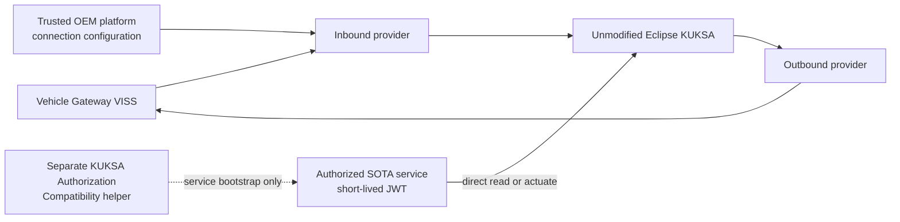

<!-- SPDX-FileCopyrightText: 2026 maninblack -->
<!-- SPDX-License-Identifier: MIT -->

# Vehicle Data Platform Component Requirements

- Status: D3 review candidate
- Package: [`CR-VDP`](../component-decomposition-and-interface-register.md#cr-vdp)
- Version: 0.8
- Prepared: 2026-08-21
- Owner: Platform Team / independent component FOTA
- Architecture input: [High-Level Architecture 1.5](../../architecture/high-level-architecture.md)
- Scenario input: [Demo Scenarios 2.0](../../demo/staged-post-sop-brake-health-demo-scenarios.md)
- Flow input: [Architecture Flows 2.0](../../architecture/demo-scenario-architecture-flows.md)
- System-requirements input: [System Requirements 2.0](../system-requirements-and-traceability.md)
- Component-register input: [Component Register 2.0](../component-decomposition-and-interface-register.md)
- Accepted architecture decisions: [ADR 0011](../../architecture/decisions/0011-qm-service-containment-and-evidence-backed-oem-approval.md), [ADR 0012](../../architecture/decisions/0012-authorize-running-workloads-not-software-artifacts.md) and [ADR 0013](../../architecture/decisions/0013-current-release-kuksa-authorization-compatibility.md)
- Previous accepted package: Version 0.7, design-reviewed on 2026-08-19
- Accepted D4 input: [D4-002 Vehicle Hardware Capability Profile](../d4-decision-register.md#d4-002)
- Accepted D4 VISS input: [D4-006 VISS Trust and Telemetry Profile](../../../contracts/viss-trust-telemetry-profile/viss-trust-telemetry-profile.v1.json)
- Accepted D4 compatibility input: [D4-007 VDP Compatibility Profile](../../../contracts/vdp-compatibility-profile/vdp-compatibility-profile.v1.json)
- Accepted D4 advisory input: [D4-008 Typed QM Advisory Profile](../../../contracts/qm-advisory-profile/qm-advisory-profile.v1.json)
- Implementation evidence: `aos-vehicle-platform@15b6abb`; provider `0.2.0`
  source pinned to `e972d2bd7f14e27646bb5d7c10c7186ecdecfa9f`

## Purpose

This package defines the post-SOP Vehicle Data Platform Component delivered by
the Platform Team into the provider-specific empty slot. It owns the versioned
vehicle-data contract, VISS-to-KUKSA publication and outbound advisory path.
It does not own KUKSA, the current-release KUKSA Authorization Compatibility
helper or SOTA-service identity and authorization.

The Provider is an OEM Platform Team integration component inside the trusted
Vehicle Data Platform boundary. For the first demo, its KUKSA-side connection
configuration is qualified as part of that platform integration; the project
does not add dynamic Provider IAM/JWT exchange, per-component attestation or
malicious-Provider containment. Service JWTs never grant Provider authority.

Aos IAM/KUKSA permission mapping is a cybersecurity least-privilege mechanism
inside the QM domain, not a functional-safety argument. Neither successful
credential issuance nor this component's outbound validation grants safety or
vehicle-motion authority.

## Reader Summary

| Question | Answer |
| --- | --- |
| What this package owns | VDP v1-v3 artifacts, trusted OEM Provider, VISS client, signal validation/normalization, versioned KUKSA data contract and outbound advisory validation |
| What this package does not own | Factory Image, KUKSA executable, KUKSA Authorization Compatibility helper, SOTA identity/JWT lifecycle, functional-service metadata, Cloud deployment approval, Gateway implementation or functional backends |
| Factory dependency | Healthy provider-specific empty slot, unmodified KUKSA and the separately packaged authorization compatibility substrate required by SOTA services |
| Intended lifecycle | Immutable component FOTA: Validation Unit first, then identical accepted bytes promoted to Demonstration Unit |
| Current state | Inbound Provider and FOTA/runtime qualification evidence exist; accepted v1-v3 graph, outbound path and final trusted Provider connection qualification remain work |

## Component and Authorization Boundary

The KUKSA Authorization Compatibility helper and all Service JWT lifecycle
rules are specified by `CR-KAC`, outside this package. OEM review and
authorized deployment remain lifecycle decisions. The Provider's trusted
platform configuration is not reusable by SOTA services and is not presented
as the generic workload-authorization model.

## Current Implementation Baseline

| Capability | Current evidence | Required disposition |
| --- | --- | --- |
| Inbound provider | Provider `0.2.0`, seven-path profile `0.1.1`, VISS TLS, KUKSA publication, source timestamps, unavailable-state handling and reconnect qualification | Reuse and align to accepted v1-v3 contract |
| Component FOTA | Immutable package, local signature verification, A/B runtime lifecycle and rollback evidence | Freeze final artifact schema and Validation-to-Demonstration flow |
| KUKSA executable | External Eclipse KUKSA 0.5.0 using `kuksa.val.v1` | Keep unchanged; change only contract and verifier configuration |
| Trusted Provider connection | Host-generated qualification credential delivered through systemd credentials | Treat as OEM platform integration; freeze and qualify the final non-service mechanism without adding Provider IAM/JWT exchange in the first demo |
| SOTA authorization compatibility | Not implemented | Owned by separate `CR-KAC`; not delivered in the VDP FOTA artifact |
| Outbound advisory | Not implemented | Add typed, allowlisted v3 KUKSA-to-VISS-to-Gateway path |

## Testability Boundary

Owned mapping, freshness, advisory validation, readiness, retry and rollback
decisions shall be testable without
CARLA, QEMU, AosCloud or a real KUKSA Databroker. VISS, KUKSA, component
runtime, persistence and clocks are deterministic test seams. The unmodified
Eclipse KUKSA executable and the separate authorization helper are not
unit-tested by this package.

Live trusted Provider-to-KUKSA connection and component FOTA remain integration
obligations and shall not be replaced by mocks in acceptance evidence.

## Interface Summary

| Interface | Direction at VDP | Data or command | Failure behavior | Authority |
| --- | --- | --- | --- | --- |
| [`IF-VEH-005`](../component-decomposition-and-interface-register.md#if-veh-005) | In | mTLS VISS Get/Subscribe values, metadata and source state as the exact selected Unit peer | Mark affected data unavailable; bounded reconnect; never fabricate zero | Vehicle Gateway VISS plus D4-005/D4-006 selected-Unit assignment |
| [`IF-DATA-001`](../component-decomposition-and-interface-register.md#if-data-001) | Out | Validated actual values, freshness and provenance into KUKSA | Reject invalid values and expose explicit availability | Installed VDP contract plus source state |
| [`IF-ADV-002`](../component-decomposition-and-interface-register.md#if-adv-002) | In | Typed Brake/Tire KUKSA advisory targets | Reject unknown caller/path/type/value, stale or replayed request | Aos IAM permission plus installed VDP contract |
| [`IF-ADV-003`](../component-decomposition-and-interface-register.md#if-adv-003) | Out | Narrow typed VISS Set request and correlated status | Reject contract excess; no arbitrary VSS tunnel | Vehicle Gateway is final enforcement authority |
| [`IF-LC-001`](../component-decomposition-and-interface-register.md#if-lc-001) / [`IF-LC-006`](../component-decomposition-and-interface-register.md#if-lc-006) | In/Out | Immutable component FOTA and A/B runtime state | Failed candidate leaves or restores the previous accepted slot | AosCloud desired state and Service Manager actual state |

## Verification Strategy

| Level | Purpose | Dependency boundary | Required | Planned evidence |
| --- | --- | --- | --- | --- |
| Unit | Prove mapping, freshness, advisory, readiness and recovery decisions | All external systems replaced by deterministic fakes | Yes | `UT-VDP-*` repository-gate report |
| Component | Prove Provider and outbound-path behavior through packaged boundaries | Disposable guest with controlled VISS/KUKSA doubles | Yes | Component readiness, failure and recovery report |
| Contract | Prove v1-v3 data/advisory compatibility and runtime type | Versioned schemas, fixtures and conformance harness | Yes | D4 contract-suite result and fixture digests |
| Integration | Prove trusted Provider-to-KUKSA connection and A/B lifecycle | Disposable AosVM and controlled adjacent real components | Yes | Exact revisions, configuration and redacted integration record |
| End-to-end | Prove validation-first FOTA, independent SOTA consumers, offline operation, advisory and identical promotion bytes | Complete Validation and Demonstration lanes | Yes | G1-G4/T1 lifecycle and runtime evidence |

## Requirement Summary

| Requirement | Plain-language obligation | Verification levels | Design state | Implementation state |
| --- | --- | --- | --- | --- |
| [Immutable lifecycle (`REQ-VDP-001`)](#req-vdp-001) | One identifiable FOTA artifact per release and identical promotion bytes | Unit, Contract, Integration, End-to-end | D3 design-reviewed | `PARTIAL` |
| [Versioned v1 data contract (`REQ-VDP-002`)](#req-vdp-002) | Publish only the accepted first read-only subset with explicit quality | Unit, Contract, Integration, End-to-end | D3 design-reviewed | `PARTIAL` |
| [Backward-compatible v2 (`REQ-VDP-003`)](#req-vdp-003) | Add Brake Health inputs without breaking v1 consumers | Unit, Contract, Integration, End-to-end | D3 design-reviewed | `TARGET` |
| [Explicit degraded state (`REQ-VDP-004`)](#req-vdp-004) | Never substitute fabricated normal values | Unit, Component, Integration, End-to-end | D3 design-reviewed | `CURRENT / EXTEND` |
| [Defense-in-depth outbound v3 advisory (`REQ-VDP-005`)](#req-vdp-005) | Permit only typed QM Brake/Tire advisories; Gateway remains authoritative | Unit, Contract, Integration, End-to-end | D3 design-reviewed | `TARGET` |
| [Readiness and resource bounds (`REQ-VDP-009`)](#req-vdp-009) | Fail closed and remain bounded under dependency/resource failures | Unit, Component, Integration, End-to-end | D3 design-reviewed | `PARTIAL` |
| [Compatibility and rollback (`REQ-VDP-010`)](#req-vdp-010) | Preserve supported services and rollback dependent-first | Unit, Contract, Integration, End-to-end | D3 design-reviewed | `TARGET / PARTIAL` |
| [Trusted OEM Provider integration (`REQ-VDP-011`)](#req-vdp-011) | Qualify the Provider as an OEM platform integration without creating service authority | Contract, Integration, End-to-end | D3 review candidate | `PARTIAL` |

## Detailed Requirements

### Immutable component lifecycle

The Platform Team shall build each VDP release as an immutable, versioned and
digest-addressed component FOTA artifact targeting only the accepted
provider-specific runtime. The exact accepted bytes shall move from Validation
to Demonstration without rebuild.

- Parents: [`SYS-REL-001`](../system-requirements-and-traceability.md#sys-rel-001), [`SYS-REL-004`](../system-requirements-and-traceability.md#sys-rel-004), [`SYS-REL-007`](../system-requirements-and-traceability.md#sys-rel-007), [`SYS-REL-010`](../system-requirements-and-traceability.md#sys-rel-010)
- Flows: [`AF-G1-LC`](../../architecture/demo-scenario-architecture-flows.md#af-g1-lc), [`AF-X-RELEASE`](../../architecture/demo-scenario-architecture-flows.md#af-x-release)
- Components: [Vehicle Data Platform (`CMP-VDP`)](../component-decomposition-and-interface-register.md#cmp-vdp), [AosCloud (`CMP-AOS-CLOUD`)](../component-decomposition-and-interface-register.md#cmp-aos-cloud), [AosCore (`CMP-AOS-CORE`)](../component-decomposition-and-interface-register.md#cmp-aos-core) and [Empty-Slot Runtime (`CMP-RUNTIME`)](../component-decomposition-and-interface-register.md#cmp-runtime)
- Interfaces: [platform FOTA (`IF-LC-001`)](../component-decomposition-and-interface-register.md#if-lc-001), [Platform Team approval (`IF-LC-008`)](../component-decomposition-and-interface-register.md#if-lc-008) and [runtime enforcement (`IF-LC-006`)](../component-decomposition-and-interface-register.md#if-lc-006)
- Verification: unit, contract, integration and end-to-end
- Required evidence: exact artifact/metadata digests, approval basis, target, runtime type, accepted Validation result and identical Demonstration bytes
- Requirement state: D3 design-reviewed

### Versioned v1 data contract

VDP v1 shall expose exactly the accepted first read-only subset with defined
VSS/KUKSA path, type, unit, range, cadence, timestamp, freshness, availability
and provenance semantics. Every selected input shall resolve to an installed
and Gateway-accounted entry in the accepted
[Vehicle Hardware Capability Profile](../../../contracts/vehicle-hardware-profile/vehicle-hardware-capability-profile.v1.json).
The service-facing subset may be narrower than the physical profile, but it
shall not imply that an unselected or `NOT_INSTALLED` capability is available.
No service shall see CARLA-only qualification or demo-visualization truth.

- Parents: [`SYS-VDP-002`](../system-requirements-and-traceability.md#sys-vdp-002), [`SYS-SRC-004`](../system-requirements-and-traceability.md#sys-src-004)
- Flow: [`AF-G1-RT`](../../architecture/demo-scenario-architecture-flows.md#af-g1-rt)
- Components: [Vehicle Data Platform (`CMP-VDP`)](../component-decomposition-and-interface-register.md#cmp-vdp) and [KUKSA (`CMP-KUKSA`)](../component-decomposition-and-interface-register.md#cmp-kuksa)
- Interfaces: [VISS input (`IF-VEH-005`)](../component-decomposition-and-interface-register.md#if-veh-005) and [KUKSA publication (`IF-DATA-001`)](../component-decomposition-and-interface-register.md#if-data-001)
- Verification: unit, contract, integration and end-to-end
- Required evidence: v1 manifest and fixture digest, positive/negative publication results and explicit quality/unavailable-state evidence
- Executable input contract: [VISS Trust and Telemetry Profile 1.0.0](../../../contracts/viss-trust-telemetry-profile/viss-trust-telemetry-profile.v1.json)
- Executable output contract: [VDP Compatibility Profile 1.0.0](../../../contracts/vdp-compatibility-profile/vdp-compatibility-profile.v1.json)
- Requirement state: D3 design-reviewed; D4-002, D4-006 and the exact D4-007 v1 subset accepted

### Backward-compatible v2

VDP v2 shall be the strict backward-compatible D4-007 superset of v1. It adds
exactly four standard wheel-speed and four standard wheel-angular-speed paths
and preserves the behavior of every supported v1 consumer.

- Parent: [`SYS-VDP-003`](../system-requirements-and-traceability.md#sys-vdp-003)
- Flow: [`AF-G3-RT`](../../architecture/demo-scenario-architecture-flows.md#af-g3-rt)
- Components: [Vehicle Data Platform (`CMP-VDP`)](../component-decomposition-and-interface-register.md#cmp-vdp) and [KUKSA (`CMP-KUKSA`)](../component-decomposition-and-interface-register.md#cmp-kuksa)
- Interfaces: [VISS input (`IF-VEH-005`)](../component-decomposition-and-interface-register.md#if-veh-005), [KUKSA publication (`IF-DATA-001`)](../component-decomposition-and-interface-register.md#if-data-001) and [Brake subscription (`IF-DATA-002`)](../component-decomposition-and-interface-register.md#if-data-002)
- Verification: unit, contract, integration and end-to-end
- Required evidence: v1/v2 compatibility report, unchanged v1 fixtures and live v1 consumer operation on v2
- Executable output contract: [VDP Compatibility Profile 1.0.0](../../../contracts/vdp-compatibility-profile/vdp-compatibility-profile.v1.json)
- Requirement state: D3 design-reviewed; D4-007 staged subset accepted

### Explicit degraded state

For each input and derived output, the component shall validate type/range,
preserve source time and distinguish available, stale, malformed, disconnected
and unavailable state. It shall clear retained values according to the
contract and shall never replace missing data with zero or another normal
value.

- Parent: [`SYS-VDP-005`](../system-requirements-and-traceability.md#sys-vdp-005)
- Flows: [`AF-G1-RT`](../../architecture/demo-scenario-architecture-flows.md#af-g1-rt), [`AF-G1-FR`](../../architecture/demo-scenario-architecture-flows.md#af-g1-fr)
- Components: [Vehicle Data Platform (`CMP-VDP`)](../component-decomposition-and-interface-register.md#cmp-vdp) and [KUKSA (`CMP-KUKSA`)](../component-decomposition-and-interface-register.md#cmp-kuksa)
- Interfaces: [VISS input (`IF-VEH-005`)](../component-decomposition-and-interface-register.md#if-veh-005) and [KUKSA publication (`IF-DATA-001`)](../component-decomposition-and-interface-register.md#if-data-001)
- Verification: unit, component, integration and end-to-end
- Required evidence: deterministic quality-state transition report plus live disconnect/reconnect record with source timestamps
- Requirement state: D3 design-reviewed

### Defense-in-depth outbound v3 advisory

VDP v3 shall preserve the complete v1/v2 path set, add the accepted four
longitudinal-slip and four lateral-slip-angle paths, and accept only the
two D4-008 Brake Health and Tire Health schema-bound advisory targets,
authorized callers, size, canonical encoding, endpoint-specific enums,
freshness/lease, request identity, rate and replay rules; map them to the
narrow VISS Set contract; and publish the read-only factual Gateway Status back
into KUKSA without treating KUKSA/VISS Set success as application success.
It shall not provide arbitrary display text, arbitrary VSS writes or
vehicle-motion authority. These services are QM-domain applications. This VDP
check is defense in depth and shall not be presented as the authoritative
vehicle-side or functional-safety boundary; the Vehicle Gateway independently
enforces the final deny-by-default QM-channel policy.

- Parents: [`SYS-VDP-004`](../system-requirements-and-traceability.md#sys-vdp-004), [`SYS-SEC-003`](../system-requirements-and-traceability.md#sys-sec-003), [`SYS-SEC-007`](../system-requirements-and-traceability.md#sys-sec-007)
- Flows: [`AF-G4-RT`](../../architecture/demo-scenario-architecture-flows.md#af-g4-rt), [`AF-TIRE-RT`](../../architecture/demo-scenario-architecture-flows.md#af-tire-rt), [`AF-X-QM`](../../architecture/demo-scenario-architecture-flows.md#af-x-qm)
- Components: [Vehicle Data Platform (`CMP-VDP`)](../component-decomposition-and-interface-register.md#cmp-vdp), [KUKSA (`CMP-KUKSA`)](../component-decomposition-and-interface-register.md#cmp-kuksa) and [Gateway Advisory Handler (`CMP-GW-ADV`)](../component-decomposition-and-interface-register.md#cmp-gw-adv)
- Interfaces: [KUKSA advisory target (`IF-ADV-002`)](../component-decomposition-and-interface-register.md#if-adv-002), [outbound VISS Set (`IF-ADV-003`)](../component-decomposition-and-interface-register.md#if-adv-003) and [Gateway status (`IF-ADV-005`)](../component-decomposition-and-interface-register.md#if-adv-005)
- Verification: unit, contract, integration and end-to-end
- Required evidence: complete allow/deny matrix, correlated VISS/Gateway status and proof of independent authoritative Gateway rejection
- Executable compatibility contract: [VDP Compatibility Profile 1.0.0](../../../contracts/vdp-compatibility-profile/vdp-compatibility-profile.v1.json)
- Executable advisory contract: [Typed QM Advisory Profile 1.0.1](../../../contracts/qm-advisory-profile/qm-advisory-profile.v1.json)
- Requirement state: D3 design-reviewed; D4-007 graph and D4-008 advisory contract accepted

### Retired: Native-IAM credential translation

Retired by Version 0.8. This obligation belongs to the separately packaged
KUKSA Authorization Compatibility helper and is replaced by `CR-KAC`
requirements `REQ-KAC-001` through `REQ-KAC-010`.

- Historical parent: [`SYS-SEC-001`](../system-requirements-and-traceability.md#sys-sec-001)

### Retired: Protected signing and KUKSA trust

Retired by Version 0.8. The KUKSA trust and Service JWT lifecycle are outside
the VDP FOTA boundary and are replaced by `CR-KAC` plus the Factory substrate.

- Historical parent: [`SYS-SEC-004`](../system-requirements-and-traceability.md#sys-sec-004)

### Retired: Separate dynamic Provider authority

Retired by Version 0.8 without a dynamic-IAM successor for the first demo. The
Provider is trusted OEM platform integration. Its fixed KUKSA-side connection
mechanism is qualified under `REQ-VDP-011`; it cannot be reused by a SOTA
service and Service JWTs cannot grant Provider authority.

- Historical parent: [`SYS-SEC-005`](../system-requirements-and-traceability.md#sys-sec-005)

### Readiness and resource bounds

The component shall keep process health separate from vehicle-data readiness
and remain unready or fail closed when its selected-Unit VISS identity, source,
assignment generation, KUKSA, trusted Provider connection, contract or storage
dependencies are missing, stale or inconsistent. Source
disconnect/staleness shall make the selected published subset atomically
`NotAvailable`, and recovery shall require the complete valid D4-006 snapshot.
CPU, memory, file/process count, storage, reconnect, queue and log volume
shall be bounded, and logs shall contain only factual redacted state.

- Parents: [`SYS-SEC-003`](../system-requirements-and-traceability.md#sys-sec-003), [`SYS-OBS-003`](../system-requirements-and-traceability.md#sys-obs-003)
- Flows: [`AF-G0-FR`](../../architecture/demo-scenario-architecture-flows.md#af-g0-fr), [`AF-X-OBS`](../../architecture/demo-scenario-architecture-flows.md#af-x-obs)
- Components: [Vehicle Data Platform (`CMP-VDP`)](../component-decomposition-and-interface-register.md#cmp-vdp), [KUKSA (`CMP-KUKSA`)](../component-decomposition-and-interface-register.md#cmp-kuksa) and [AosCore (`CMP-AOS-CORE`)](../component-decomposition-and-interface-register.md#cmp-aos-core)
- Interfaces: [VISS input (`IF-VEH-005`)](../component-decomposition-and-interface-register.md#if-veh-005), [KUKSA publication (`IF-DATA-001`)](../component-decomposition-and-interface-register.md#if-data-001) and [runtime enforcement (`IF-LC-006`)](../component-decomposition-and-interface-register.md#if-lc-006)
- Verification: unit, component, integration and end-to-end
- Required evidence: bounded resource and retry metrics, readiness transitions, redacted native logs and dependency fault/recovery results
- Requirement state: D3 design-reviewed; D4-006 source-readiness contract accepted

### Compatibility and rollback

Each release shall publish the D4-007 installed-identity fields and compatible
service range. Update, restart, interruption and rollback shall preserve the
previous accepted component until commit; any incompatible dependent service
shall be stopped or rolled back before the platform component, while unrelated
service lifecycles remain unchanged.

- Parents: [`SYS-REL-003`](../system-requirements-and-traceability.md#sys-rel-003), [`SYS-REL-005`](../system-requirements-and-traceability.md#sys-rel-005)
- Flows: [`AF-G3-LC`](../../architecture/demo-scenario-architecture-flows.md#af-g3-lc), [`AF-G3-FR`](../../architecture/demo-scenario-architecture-flows.md#af-g3-fr)
- Components: [Vehicle Data Platform (`CMP-VDP`)](../component-decomposition-and-interface-register.md#cmp-vdp), [AosCore (`CMP-AOS-CORE`)](../component-decomposition-and-interface-register.md#cmp-aos-core) and [Empty-Slot Runtime (`CMP-RUNTIME`)](../component-decomposition-and-interface-register.md#cmp-runtime)
- Interfaces: [platform FOTA (`IF-LC-001`)](../component-decomposition-and-interface-register.md#if-lc-001) and [runtime enforcement (`IF-LC-006`)](../component-decomposition-and-interface-register.md#if-lc-006)
- Verification: unit, contract, integration and end-to-end
- Required evidence: machine-readable compatibility range, dependent-first stop/rollback ordering, previous-slot recovery and unrelated-service continuity
- Executable compatibility contract: [VDP Compatibility Profile 1.0.0](../../../contracts/vdp-compatibility-profile/vdp-compatibility-profile.v1.json)
- Requirement state: D3 design-reviewed; compatibility identity and ranges accepted by D4-007

### Trusted OEM Provider integration

The Platform Team shall deliver and qualify the inbound and outbound Provider
as trusted OEM platform integration within the VDP component. Its KUKSA-side
connection configuration shall be bounded to the Provider's accepted data and
advisory contract, isolated from SOTA-service bootstrap material and validated
with the exact VDP artifact on both Unit roles. The first demo shall not add a
dynamic Provider IAM/JWT exchange, per-component attestation or a claim that a
malicious or substituted Provider is contained. A Service JWT shall never
grant Provider publication authority.

- Parents: [`SYS-SEC-001`](../system-requirements-and-traceability.md#sys-sec-001), [`SYS-SEC-003`](../system-requirements-and-traceability.md#sys-sec-003)
- Flows: [`AF-G1-RT`](../../architecture/demo-scenario-architecture-flows.md#af-g1-rt), [`AF-X-AUTH`](../../architecture/demo-scenario-architecture-flows.md#af-x-auth)
- Components: [Vehicle Data Platform (`CMP-VDP`)](../component-decomposition-and-interface-register.md#cmp-vdp) and [KUKSA (`CMP-KUKSA`)](../component-decomposition-and-interface-register.md#cmp-kuksa)
- Interfaces: [KUKSA publication (`IF-DATA-001`)](../component-decomposition-and-interface-register.md#if-data-001) and [KUKSA advisory target (`IF-ADV-002`)](../component-decomposition-and-interface-register.md#if-adv-002)
- Verification: contract, integration and end-to-end
- Required evidence: exact Provider/configuration identity, accepted publish/advisory contract, successful qualification on both Unit roles, separation from Service JWT/bootstrap material and explicit statement of the first-demo trust assumption
- Requirement state: D3 review candidate

## Requirement Acceptance Criteria

This table is normative for D3. D4 replaces the provisional case descriptions
with executable fixtures, bounds and evidence locations without changing the
requirement semantics.

| Requirement | Positive acceptance | Boundary or malformed acceptance | Dependency/failure/recovery acceptance |
| --- | --- | --- | --- |
| [`REQ-VDP-001`](#req-vdp-001) | Exact version, digest, runtime type and bytes are retained from Validation acceptance through Demonstration promotion | Wrong target, type, version/digest mismatch or rebuilt promotion bytes are rejected before apply | Interrupted or unhealthy candidate never replaces the previous accepted slot |
| [`REQ-VDP-002`](#req-vdp-002) | Every accepted v1 path has the frozen type, unit, cadence, freshness, provenance and availability semantics | Unknown path, wrong type/range or qualification-only truth is rejected without widening the contract | Missing/stale source becomes explicit unavailable state and recovers only from a valid fresh sample |
| [`REQ-VDP-003`](#req-vdp-003) | Every v1 fixture and consumer remains valid after the accepted v2 Brake input subset is added | Duplicate, incompatible or semantically changed v1 definitions fail compatibility validation | A failed v2 candidate preserves the accepted v1 release and consumer operation |
| [`REQ-VDP-004`](#req-vdp-004) | Valid source data preserves source time and produces the corresponding quality state | Future, stale, malformed, out-of-range or out-of-order input cannot appear as a normal value | Disconnect clears or marks affected state by contract; reconnect resumes only after valid fresh input |
| [`REQ-VDP-005`](#req-vdp-005) | An authorized, fresh, typed Brake or Tire advisory maps to exactly one narrow VISS Set request with correlation | Wrong caller/path/type/value, arbitrary text/VSS, replay, rate excess and all motion/safety commands are rejected with no Set side effect | VISS/Gateway rejection is reported factually; Gateway independently denies requests outside its own QM-channel policy |
| [`REQ-VDP-009`](#req-vdp-009) | All mandatory dependencies and resource limits produce ready state and bounded normal operation | Queue, reconnect, file/process, storage or log limits reject or degrade work without unbounded growth | Any inconsistent mandatory dependency produces fail-closed unready state; bounded recovery is factual and secret-free |
| [`REQ-VDP-010`](#req-vdp-010) | Supported services remain compatible across the declared contract range and identical accepted bytes promote | Unsupported service/component combinations are detected before a destructive transition | Interruption preserves the prior slot; incompatible dependents stop or roll back before VDP while unrelated services remain unchanged |
| [`REQ-VDP-011`](#req-vdp-011) | The exact trusted OEM Provider/configuration publishes and consumes only the accepted VDP contract on both Unit roles | A SOTA Service JWT/bootstrap resource cannot be reused as Provider authority; out-of-contract Provider behavior fails qualification | Missing or inconsistent trusted Provider connection keeps the VDP unready; no dynamic Provider IAM/JWT fallback is introduced |

## Unit-Test Obligations

| Obligation | Requirements | Required isolated proof |
| --- | --- | --- |
| `UT-VDP-001` — Artifact and contract identity | `REQ-VDP-001`, `REQ-VDP-002`, `REQ-VDP-003`, `REQ-VDP-010` | Exact version/digest/runtime type, v1-v3 schema compatibility, wrong target and forbidden rebuild inputs |
| `UT-VDP-002` — Signal quality state machine | `REQ-VDP-002`, `REQ-VDP-004` | Valid/invalid/range/stale/disconnect/reconnect transitions, source time and no fabricated value |
| `UT-VDP-003` — Defense-in-depth advisory policy | `REQ-VDP-005` | Each accepted Brake/Tire request plus unknown caller/path/type/value, stale/replay/rate/correlation and vehicle-motion/safety negatives; prove Gateway still enforces independently |
| `UT-VDP-007` — Readiness and recovery | `REQ-VDP-004`, `REQ-VDP-009`, `REQ-VDP-010` | Dependency loss/recovery, bounded reconnect/resources, update interruption and previous-slot preservation |
| `UT-VDP-008` — Trusted Provider contract | `REQ-VDP-011` | Exact Provider/configuration identity, accepted data/advisory paths, no Service JWT/bootstrap dependency and fail-closed missing/inconsistent connection |

Retired obligations keep their anchors for traceability:

| Retired obligation | Disposition |
| --- | --- |
| `UT-VDP-004` — IAM permission mapping | Retired with `REQ-VDP-006`; replaced by `CR-KAC` unit obligations |
| `UT-VDP-005` — JWT lifecycle and redaction | Retired with `REQ-VDP-007`; replaced by `CR-KAC` and Factory obligations |
| `UT-VDP-006` — Provider credential lifecycle | Retired with `REQ-VDP-008`; no dynamic Provider-IAM successor in the first demo |

Unit tests replace VISS, KUKSA, clock, filesystem and runtime control with
deterministic fakes. They do not start CARLA, QEMU, AosCloud or a real
Databroker. The real trusted Provider connection and component FOTA remain
required integration evidence.

## Verification Traceability

| Requirement | Unit obligations | Component proof | Contract proof | Integration proof | End-to-end proof |
| --- | --- | --- | --- | --- | --- |
| [`REQ-VDP-001`](#req-vdp-001) | [`UT-VDP-001`](#ut-vdp-001) | Artifact and readiness inspection | Component/runtime manifest conformance | A/B apply/recovery | G1 identical-byte promotion |
| [`REQ-VDP-002`](#req-vdp-002) | [`UT-VDP-001`](#ut-vdp-001), [`UT-VDP-002`](#ut-vdp-002) | v1 provider output | v1 signal fixtures | Real VISS-to-KUKSA path | G1 telemetry evidence |
| [`REQ-VDP-003`](#req-vdp-003) | [`UT-VDP-001`](#ut-vdp-001) | v2 provider output | v1/v2 compatibility suite | v1 consumer on v2 component | G3 compatibility evidence |
| [`REQ-VDP-004`](#req-vdp-004) | [`UT-VDP-002`](#ut-vdp-002), [`UT-VDP-007`](#ut-vdp-007) | Quality/readiness state | Quality and freshness fixtures | VISS loss/recovery | Offline/degraded evidence |
| [`REQ-VDP-005`](#req-vdp-005) | [`UT-VDP-003`](#ut-vdp-003) | Outbound adapter status | Typed advisory negative matrix | KUKSA-to-Gateway round trip | G4/T1 advisory evidence |
| [`REQ-VDP-009`](#req-vdp-009) | [`UT-VDP-002`](#ut-vdp-002), [`UT-VDP-007`](#ut-vdp-007) | Resource/readiness metrics | Limits and state schema | Dependency/resource fault injection | Bounded offline/recovery evidence |
| [`REQ-VDP-010`](#req-vdp-010) | [`UT-VDP-001`](#ut-vdp-001), [`UT-VDP-007`](#ut-vdp-007) | Update/recovery state | Compatibility and rollback fixtures | Dependent-first rollback | G3 failure/recovery and promotion |
| [`REQ-VDP-011`](#req-vdp-011) | [`UT-VDP-008`](#ut-vdp-008) | Provider readiness and configuration identity | VDP data/advisory contract | Real Provider-to-KUKSA connection on both Unit roles | G1-G4/T1 publication continuity under the declared trust assumption |

## Cross-Cutting Constraints

| Concern | Applicable obligation | Component response | Verification |
| --- | --- | --- | --- |
| QM containment | [`REQ-VDP-005`](#req-vdp-005) | Defense-in-depth typed advisory validation; no motion or safety authority; Gateway remains final authority | Complete unit/contract negative matrix plus Gateway integration |
| Security boundary | [`REQ-VDP-005`](#req-vdp-005), [`REQ-VDP-011`](#req-vdp-011) | Trusted OEM Provider integration is separated from SOTA-service authorization; Gateway remains final QM write authority | Contract, integration and explicit trust-assumption review |
| Privacy and redaction | [`REQ-VDP-009`](#req-vdp-009), [`REQ-VDP-011`](#req-vdp-011) | No Provider connection material or service JWT/bootstrap material in source, artifacts, commands or logs | Repository/image scan and negative log tests |
| Resource bounds | [`REQ-VDP-009`](#req-vdp-009) | Bounded CPU, memory, queues, reconnect, storage and log volume | Component metrics and fault injection |
| Timing and freshness | [`REQ-VDP-004`](#req-vdp-004), [`REQ-VDP-005`](#req-vdp-005) | Source-time preservation plus advisory freshness/replay limits | Deterministic-clock unit cases and live timing evidence |
| Offline and recovery | [`REQ-VDP-004`](#req-vdp-004), [`REQ-VDP-009`](#req-vdp-009), [`REQ-VDP-010`](#req-vdp-010) | Explicit degraded state, fail-closed dependencies and previous-slot recovery | Unit, component, integration and end-to-end fault cases |
| Observability | [`REQ-VDP-005`](#req-vdp-005), [`REQ-VDP-009`](#req-vdp-009) | Factual accepted/rejected/readiness state through native logs and agreed status contracts | Native Aos log retrieval and dashboard evidence |

## D3 Review Closure and Product Acceptance

Version 0.7 and its ten requirement obligations were design-reviewed on
2026-08-19. Version 0.8 is a new review candidate: it moves Service
authorization and KUKSA trust out of VDP, retires dynamic Provider IAM/JWT for
the first demo and adds the trusted OEM Provider integration obligation
`REQ-VDP-011`. The prior acceptance record is preserved; Version 0.8 requires
explicit review before it replaces that baseline.

Product acceptance remains open until the gates below are resolved, D4
contracts are executable, required unit/component/contract/integration tests
are green, and identical accepted bytes complete Validation-to-Demonstration
promotion. This closure does not authorize implementation, image rebuild,
signing, Cloud upload, VM restart, provisioning or Unit mutation.

## Open Design and Qualification Gates

| Gate | Why it remains open | Owner |
| --- | --- | --- |
| Exact trusted Provider connection configuration | The first demo intentionally does not add dynamic Provider IAM/JWT; exact protected configuration and two-Unit qualification evidence must still be frozen | Platform Team |
| Implement and qualify selected-Unit mTLS, readiness and atomic unavailable/recovery semantics | D4-006 contract is accepted but the current provider uses the historical server-authenticated profile | Platform Team plus Gateway and Demo Orchestration |
| Native Cloud permission admission | Platform roadmap capability is not released; no project-side substitute is allowed | AosEdge Platform Team |

## Change Rules

- Editorial clarification preserves stable requirement and unit-obligation IDs.
- A material semantic replacement receives a new ID and explicitly retires the
  superseded definition.
- A changed lifecycle, authority, trust boundary, data direction or QM scope
  follows the Level-C architecture cascade before this package changes.
- A changed signal/advisory behavior inside accepted boundaries follows the
  Level-B cascade and updates requirements, D4 contracts, tests and evidence
  together.
- Implementation test names may change, but accepted `UT-VDP-*` obligation IDs
  and their `REQ-VDP-*` mappings remain stable until deliberately retired.
