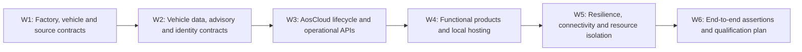

<!-- SPDX-FileCopyrightText: 2026 maninblack -->
<!-- SPDX-License-Identifier: MIT -->

# D4 Interface and Qualification Decision Register

- Status: Working D4 baseline
- Version: 0.9
- Prepared: 2026-08-21
- Inputs: accepted HLA 1.4, Demo Scenarios 1.9, Architecture Flows 1.8,
  System Requirements 1.0, Component Register 1.1 and all D3 design-reviewed
  component packages
- Implementation, signing, Cloud, Unit, VM or CARLA mutation authorized: no

## Purpose

This register is the single navigation and decision-control surface for D4.
It consolidates repeated package-level open gates into one stable decision ID
without moving requirements, interface ownership or tests out of their owning
component packages.

D4 freezes **how an accepted D3 obligation will be proved**: exact schemas,
profiles, API operations, roles, bounds, fixtures, failure semantics,
qualification environments and evidence. It does not silently change the
accepted architecture, component behavior or lifecycle authority.

## How to Read and Update This Register

Each shared question has exactly one `D4-*` ID. The decision summary lives
here; the normative contract, fixture or qualification procedure lives in the
named owning repository or documentation file and is linked from the accepted
decision record.

| State | Meaning |
| --- | --- |
| `OPEN` | Question and owners are known; no reviewed resolution exists |
| `RESEARCHING` | Read-only evidence or an experiment plan is in progress |
| `PROPOSED` | One complete resolution and its impact analysis are ready for review |
| `REVIEW_READY` | Contract, mappings and verification plan are complete enough for a decision |
| `DECIDED` | Owners accepted the resolution and every affected document was updated |
| `BLOCKED` | An identified external prerequisite prevents a truthful decision |
| `DEFERRED` | Explicitly outside the current implementation release; not a hidden blocker |

A decision can become `DECIDED` only when:

1. its exact contract or qualification output has a canonical local link;
2. accountable owners have reviewed the same version;
3. every affected `IF-*`, `REQ-*`, `UT-*` and `AT-*` mapping is updated;
4. normal, boundary, malformed, unavailable and recovery behavior is allocated
   where applicable;
5. secrets, confidential input and external authority are not copied into the
   repository;
6. any Level-B or Level-C change cascade has completed; and
7. the documentation quality gate passes.

## Execution Order

Research inside a later workstream may proceed early, but a decision may not
assume an unresolved upstream contract. Parallel packages shall reference the
same decision ID rather than create local variants.

## W1 — Factory, Vehicle and Source Contracts

| Decision | Question and required output | Primary owners | Main consumers | State |
| --- | --- | --- | --- | --- |
| `D4-001` — Factory artifact acceptance | Freeze reproducibility semantics, required Factory Image contents/manifest, immutable release identity and whether `.11` can qualify unchanged | Platform Team / System Architecture | `CR-FACTORY`, `CR-DEMO`, `CR-E2E` | `DECIDED` |
| `D4-002` — Vehicle hardware capability profile | Freeze the selected CARLA revision/blueprint, installed signals/sensors/actuators, provenance and complete Simulator↔Gateway accounting manifest | Vehicle Simulation + Gateway | `CR-VEHICLE-SIM`, `CR-GATEWAY`, `CR-VDP` | `DECIDED` |
| `D4-003` — Deterministic stimuli and calibration | Freeze Brake obstacle/event stimulus, Tire pre-aged/accelerated stimulus, hidden qualification truth, repeat count and tolerances | Vehicle Simulation + both Function Teams | `CR-VEHICLE-SIM`, `CR-BHS`, `CR-TIRE`, `CR-E2E` | `RESEARCHING` |
| `D4-004` — Drive-mode and scenario context | Freeze scenario/manual/autopilot transitions, obstacle ownership, reverse/reset behavior, mode/context/status VSS paths and discontinuity semantics | Vehicle Simulation + Gateway | `CR-VEHICLE-SIM`, `CR-GATEWAY`, Engineering Dashboard | `DECIDED` |
| `D4-005` — Exclusive VU/DU source handover | Freeze attach, prove exclusive binding, detach, canonical reset/new generation and attach-to-next-role protocol without replay or a second simulated vehicle | Demo Solution + Gateway + Vehicle Simulation | Every VU/DU functional proof | `DECIDED` |

### D4-001 Decision Record — Factory Artifact Acceptance

- Decision state: `DECIDED`
- Accepted: 2026-08-21
- Owners: Platform Team / System Architecture
- Canonical requirement package:
  [Factory Substrate](components/factory-substrate.md)

The accepted Factory Image contract is:

1. Candidate `.11` remains immutable engineering evidence and the input to an
   incremental successor build; it is not accepted unchanged as the final OEM
   Demo Factory Image.
2. The existing provider-specific empty-slot runtime is the accepted pre-SOP
   runtime model. A generic multi-provider runtime is not required by HLA 1.4
   and is not a reason to rebuild the image.
3. A new versioned Factory Image candidate shall be produced only after
   [`D4-009`](#d4-009) and [`D4-010`](#d4-010) freeze the stock Aos IAM
   permission, Credential Broker and protected-signing seams that must be
   present before provisioning.
4. The new candidate shall be produced from pinned source and build inputs;
   post-build binary patching is prohibited.
5. Release immutability and build reproducibility are separate proofs:

   - an accepted distributable image is identified by one exact byte size and
     SHA-256 digest and is used only as a read-only backing image for fresh
     overlays;
   - a controlled rebuild from the same source lock shall prove canonical
     equivalence of partition layout, installed-package manifest, immutable
     filesystem content, runtime inventory and security configuration;
   - raw-image byte identity is preferred but not mandatory when every
     difference is restricted to a reviewed allowlist of non-semantic image
     UUID/timestamp fields and is included in the evidence record.

6. One controlled reproducibility rebuild is required after candidate content
   is frozen. It is qualification work, not a presentation-time action and not
   a requirement to rebuild after every source edit.
7. The normative Factory Image manifest shall bind source lock, build graph,
   toolchain/configuration identity, artifact type, exact release digest,
   canonical equivalence evidence, required runtime/security inventory and
   secret/identity-negative results.
8. The actual successor version and digest are implementation/qualification
   outputs. They are not invented by this D4 decision.

Consequences:

- preserve the isolated Yocto builder and incremental caches;
- do not modify, sign, upload, provision from or relabel `.11` as accepted;
- do not start the successor build until `D4-009` and `D4-010` are decided;
- qualify two fresh overlays, clean first boot, distinct identities, empty-slot
  health and unchanged backing-image digest against the successor candidate;
- retain production provider-store selection as deferred `D4-X03` work.

### D4-002 Decision Record — Vehicle Hardware Capability Profile

- Decision state: `DECIDED`
- Accepted: 2026-08-21
- Owners: Vehicle Simulation / Vehicle Gateway
- Canonical contract:
  [profile](../../contracts/vehicle-hardware-profile/vehicle-hardware-capability-profile.v1.json),
  and [schema](../../contracts/vehicle-hardware-profile/vehicle-hardware-capability-profile.schema.json)
- Accepted profile SHA-256:
  `ac0ba26464219482dcb41e56ebbc1538489e13bd6c84725dbc124e59514cb7e5`

The accepted vehicle-hardware contract is:

1. The selected profile is `carla-lincoln-mkz-chaos` version `1.0.0`. It pins
   the checked repository revision
   `ac7d882cac496ccbf8b40aa543d6b38513e1173c`, the runtime compatibility
   revision `385927b6ac5efaaa204b5b9853a7aaa5c5917428`, Unreal Engine 5 Chaos and
   ego blueprint `vehicle.lincoln.mkz`.
2. One digest-addressed JSON profile is the cross-repository source of truth.
   Vehicle Simulation owns the physical installation declaration; Vehicle
   Gateway co-owns the complete mapping/disposition accounting.
3. Every capability is classified by installation, provenance, data shape,
   unit, frame, cadence, availability and Gateway disposition. Installed
   native/derived capabilities are distinct from `NOT_INSTALLED`, native
   unavailable, qualification-only and demo-visualization entries.
4. The installed baseline includes native vehicle dynamics and applied state,
   Chaos wheel telemetry, one 10 Hz GNSS sensor and the physical CARLA control
   capabilities. The scenario collision sensor is qualification-only and the
   chase camera is demo visualization, not a production vehicle signal.
5. IMU, radar, lidar, production cameras, lane-invasion, obstacle-detection and
   V2X/RSS facilities remain explicitly `NOT_INSTALLED`; CARLA's ability to
   spawn them does not imply that the selected virtual vehicle contains them.
6. Brake pressure/temperature/wear and tire pressure/temperature/tread/health
   have no truthful native source in this CARLA profile. A future synthetic
   model must identify its provenance and cannot be presented as native CARLA
   telemetry.
7. Every installed capability must have exactly one Gateway disposition:
   retained native, normalized, explicit unavailable or reviewed unsupported.
   No entry may disappear silently, and missing optional data may not be
   replaced by a plausible zero.
8. Throttle, brake, steering, handbrake, transmission/reverse/manual shift and
   vehicle-light controls are physical capabilities. Capability does not grant
   authority: current UI and mode ownership remain separately constrained, and
   the applied CARLA state is the execution evidence.
9. Scenario, Manual, Autopilot and Safe Stop are control modes, not actuators;
   their transition semantics remain allocated to [`D4-004`](#d4-004).
10. Qualification/world ground truth remains outside VSS/VISS and KUKSA.
    Exact VSS/VISS paths and freshness remain allocated to
    [`D4-006`](#d4-006), and typed advisory return remains allocated to
    [`D4-008`](#d4-008).
11. The static profile describes the expected installation. A qualified
    Gateway startup must reconcile the live source, blueprint, installed
    sensors and complete adapter coverage. Any mismatch invalidates the run;
    it does not mutate the accepted profile or produce a healthy result.

Consequences:

- the manifest contract is accepted, while runtime reconciliation and complete
  target adapter/actuator implementation remain qualification work;
- maps and Brake/Tire stimuli are not part of the hardware profile and remain
  under `D4-003`;
- implementation repositories may retain more native values than a narrower
  service-facing VSS/KUKSA release exposes, but must still account for them;
- changing the installed hardware profile produces a new profile version and
  digest and triggers the affected Simulator, Gateway and VDP contract cascade.

### D4-003 Working Decision Record — Deterministic Stimuli and Calibration

- Decision state: `RESEARCHING`
- Direction reviewed: 2026-08-21
- Owners: Vehicle Simulation / Function Team 1 / Function Team 2
- Canonical working plan:
  [D4-003 stimulus calibration plan](../qualification/d4-003-stimulus-calibration-plan.md)

The reviewed working direction is:

1. All coefficient selection, metric calibration and repeated qualification
   happen before the audience demonstration. A presentation executes only an
   already frozen live stimulus profile.
2. The implemented `stationary-obstacle-braking-v1` and unattended
   `brake_event_town10hd.json` are the Brake calibration input. Its current
   physical thresholds remain the starting contract, while an independent
   series must still freeze and prove the final repeatability envelope.
3. The Brake stimulus supplies a visible physical braking episode and
   qualification facts only. It does not fabricate native pad wear,
   temperature, pressure or health. Brake v2 synthetic assessment remains a
   Function Team 1 product decision under [`D4-016`](#d4-016).
4. The Tire stimulus shall use `preaged-tire-dynamics-v1` with `HEALTHY` and
   `PRE_AGED` profiles. `PRE_AGED` applies one calibrated symmetric relative
   reduction to all four wheels' `friction_force_multiplier`, followed by a
   bounded low-speed deterministic exercise and verified restoration of the
   exact original `VehiclePhysicsControl`.
5. The Tire service sees only native dynamics from the accepted hardware
   profile. Exact condition profile and friction multiplier are hidden
   qualification truth and may not enter Gateway production state, VISS,
   KUKSA, service input, backend payload or audience dashboard.
6. Five strict-reset calibration runs per Brake/Tire profile select and freeze
   the final Tire values, absolute physical bounds and native-feature
   separation margins before independent qualification.
7. Independent qualification then requires 20/20 Brake runs and 10 `HEALTHY`
   plus 10 `PRE_AGED` Tire runs, with no collisions/leaks, valid chronology,
   frozen-bound compliance, successful reset/physics restoration and oracle-
   negative proof.
8. Service algorithm correctness is intentionally separate: Brake model and
   Tire estimator/state/bands remain owned by `D4-016` and `D4-018`.
9. Overall system qualification/presenter modes remain under
   [`D4-026`](#d4-026); they consume, not redefine, these stimulus-specific
   results.

The direction is accepted but the decision is not yet `DECIDED`. Closure
requires a canonical schema, implemented Tire stimulus, frozen post-calibration
values/tolerances, passing independent series and complete oracle-negative
evidence.

### D4-004 Decision Record — Drive Mode and Scenario Context

- Decision state: `DECIDED`
- Accepted: 2026-08-21
- Owners: Vehicle Simulation / Vehicle Gateway
- Canonical contract:
  [Simulator Control and Context Contract 1.0.0](../../contracts/simulator-control-context/simulator-control-context.v1.json)

The accepted contract freezes:

1. the independent drive-mode states `SAFE_STOP`, `SCENARIO`, `MANUAL` and
   `AUTOPILOT`, and world contexts `FREE_DRIVE` and `BRAKE_EVENT`;
2. the complete `AF-X-DRIVE` transition matrix, with the Scenario Controller
   as the sole obstacle owner and the Gateway/controller as the only ego actor
   and synchronous-clock owner;
3. Scenario-to-Manual as an `ABORTED` attempt with the same pose and retained
   obstacle, so operator braking still produces truthful native telemetry;
4. every brake-context-to-Autopilot transition as safe stop, obstacle removal,
   same-actor zero-motion reset to canonical free drive, lane validation and
   only then Traffic Manager activation;
5. every Scenario start/restart as safe stop, canonical obstacle preparation,
   same-actor zero-motion reset, attempt-local evidence clear and new Scenario
   generation;
6. Safe Stop as a control action that never implicitly changes world context,
   deletes an obstacle or claims a reset;
7. project-owned `Vehicle.CarlaSimulation.Control.*`, `World.*`, `Scenario.*`
   and `Reset.*` engineering paths, including requested versus active mode,
   transaction state, monotonic generations and durable reset frame evidence;
8. a reset discontinuity flag on the first complete post-reset snapshot plus
   durable `Reset.Generation` and `Reset.FrameId`, so a missed transient flag
   cannot turn teleportation into apparent physical movement; and
9. reverse as a physical capability declared by D4-002 but not authorized in
   the first-demo Control UI. Recovery uses Scenario restart or the accepted
   Autopilot context reset; Traffic Manager obstacle avoidance is not claimed.

The contract is accepted independently of implementation. Current same-actor
Manual/Autopilot handover and Scenario restart are partial evidence; dynamic
obstacle lifecycle, transactional activation and the engineering VSS paths
must still be implemented and qualified. Failed cleanup, reset or lane
validation leaves `SAFE_STOP`, reports `FAILED` and never partially activates
the requested mode or newly requested context.

### D4-005 Decision Record — Exclusive Live-Source Assignment

- Decision state: `DECIDED`
- Accepted: 2026-08-21
- Owners: Demo Solution / Vehicle Gateway / Vehicle Simulation
- Canonical contract:
  [Exclusive Live-Source Assignment 1.0.0](../../contracts/exclusive-live-source-assignment/exclusive-live-source-assignment.v1.json)

The accepted contract deliberately separates two views:

1. The audience sees a **Validation Vehicle** and a **Demonstration Vehicle**.
   AosCloud technical detail maps those vehicles to the Validation Unit and
   Demonstration Unit Domain Controllers. Exactly one is the `CURRENT VEHICLE`.
2. The first-demo implementation uses one live CARLA/Gateway source and the
   host Demo Orchestrator assigns it sequentially and exclusively to those
   Units. This mechanism is demo infrastructure, not in-vehicle behavior or an
   AosCloud vehicle lifecycle operation.

The primary UI uses `Continue with Demonstration Vehicle` and never exposes
`Attach CARLA`, `Detach CARLA`, `Switch VM` or `Source Binding` as audience
actions. Both Units may remain Online in AosCloud; Cloud online state is
independent of which logical vehicle is current. Unit/Node/Unit Set, exact
source identity, assignment state, generation and frame range remain
available through technical details. Logical vehicle role is orchestration
state and shall not enter VSS/KUKSA production data.

The technical sequence is exact:

1. re-read both Unit identities and disjoint Unit Set roles;
2. select and accept only the authenticated Validation Unit peer, prove one
   selected-Unit VISS session and capture its first frame; the separately
   authenticated read-only Engineering Dashboard may remain connected;
3. execute qualification and close the bounded Validation frame range;
4. safe-stop, detach Validation, clear selection and prove no source consumer;
5. execute the D4-004 canonical reset with no Unit attached and prove a new
   Reset Generation;
6. select and accept only the authenticated Demonstration Unit peer, capture
   its first frame and prove the current baseline vehicle works; and
7. promote the identical accepted QM artifact while the Demonstration Vehicle
   is current, then detach it during cleanup/R0.

An unexpected/additional Unit peer, uncertain detach, identity mismatch,
overlapping or non-monotonic frame range, or failed reset selects safe stop and
blocks the next assignment. The exact authenticated VISS peer/trust mechanism
is owned by D4-006. Telemetry replay and a second simulated vehicle remain
explicitly deferred. Implementation and live qualification remain open even
though the assignment and audience contract are decided.

## W2 — Vehicle Data, Advisory and Identity Contracts

| Decision | Question and required output | Primary owners | Main consumers | State |
| --- | --- | --- | --- | --- |
| `D4-006` — VISS trust, telemetry and status profile | Freeze private peer authentication, Get/Subscribe/Set subset, types/units, freshness/degraded paths, source-loss and queue/error semantics | Gateway + Platform Team | `CR-GATEWAY`, `CR-VDP`, Engineering Dashboard | `DECIDED` |
| `D4-007` — VDP v1–v3 compatibility contract | Freeze the staged signal subsets, backward compatibility, actual installed capability identity and fail-closed service readiness metadata | Platform Team + both Function Teams | `CR-VDP`, `CR-BHS`, `CR-TIRE`, `CR-AOS` | `DECIDED` |
| `D4-008` — Typed QM advisory contract | Freeze Brake/Tire targets, payloads, status, correlation, freshness, rate, debounce/hysteresis and replay rules through KUKSA→VDP→VISS→Gateway | Gateway + Platform + both Function Teams | `CR-GATEWAY`, `CR-VDP`, `CR-BHS`, `CR-TIRE`, `CR-CROSS` | `DECIDED` |
| `D4-009` — Service IAM and KUKSA credential contract | Freeze Aos IAM `GetPermissions`, metadata path/mode mapping, broker request/response, JWT claims, refresh/revocation and failure behavior | Platform Team + Aos IAM/security owners | `CR-VDP`, both services, `CR-CROSS` | `DECIDED` |
| `D4-010` — Provider authority and protected signing | Freeze FOTA provider platform identity, per-Unit signer bootstrap/rotation/revocation, PKCS#11 operation and role-specific OEM/SP publication credential profiles | Platform Team + Aos security/API owners + Function Team release owners | `CR-VDP`, `CR-DEMO`, both Cloud products, `CR-CROSS` | `PARTIALLY DECIDED` — `D4-010.1` accepted; `D4-010.2` and `D4-010.3` open |

### D4-006 Decision Record — VISS Trust, Telemetry and Status Profile

- Decision state: `DECIDED`
- Accepted: 2026-08-21
- Owners: Vehicle Gateway / Platform Team
- Canonical contract:
  [VISS Trust and Telemetry Profile 1.0.0](../../contracts/viss-trust-telemetry-profile/viss-trust-telemetry-profile.v1.json)
- Accepted contract SHA-256:
  `24484919d916ade153111fd6075d06cecdf77d0bed7cfd016c0a4163e1b8fd53`

The accepted contract freezes:

1. The private in-vehicle boundary uses VISS 3.1 over `wss`, TLS 1.2 or later,
   server verification and mutual TLS. Plain WebSocket and unauthenticated
   clients are rejected.
2. Three authenticated peer roles exist: one selected Platform Unit,
   a permanently read-only Engineering Telematics Dashboard and a read-only
   qualification client. D4-005 exclusivity applies to Unit peers only; the
   independent Engineering Dashboard may remain connected.
3. The selected Unit is bound by exact Unit ID, Node ID, client-certificate
   fingerprint and assignment generation. A non-selected, additional,
   expired, revoked, unknown or mismatched Unit peer is rejected even when
   that Unit remains Online in AosCloud.
4. Each provisioned Unit has a unique client identity created only after its
   Cloud Unit/Node identity is known. Its private key is absent from the
   Factory Image, FOTA components, Git, logs and dashboards, is stored as a
   protected root-owned VM credential and is delivered with systemd
   `LoadCredential`. R0 retires it. Non-exportable TPM/PKCS#11 client keys are
   future hardening, not a first-demo claim.
5. The current provider cadence remains 50 ms, source freshness is 250 ms and
   reconnect backoff is bounded from 500 ms to 10 s. Client subscriptions,
   message size and pending-event queues are bounded; overflow is visible and
   never blocks CARLA frame processing.
6. Process health and vehicle-data readiness are different facts. Source
   states are `STARTING`, `AUTHENTICATING`, `LIVE`, `STALE`, `DISCONNECTED`,
   `AUTHENTICATION_FAILED` and `CONTRACT_MISMATCH`. Disconnect or stale input
   atomically becomes KUKSA `NotAvailable`; recovery requires a complete valid
   snapshot with matching contract, source and generation and a monotonic
   frame.
7. One machine-readable profile accounts for the complete D4-002 Gateway
   engineering superset and the entire D4-004 control/context projection. Each
   physical capability is either mapped to exact typed paths or explicitly
   excluded. D4-007 may select only staged subsets of this superset.
8. `Get`, `Subscribe` and `Unsubscribe` are accepted. Every `Set` remains
   rejected without side effects until D4-008 freezes the typed QM advisory
   contract; the Engineering Dashboard and qualification client remain
   permanently read-only.

Consequences:

- the previous server-only TLS and eight-generic-client baseline is evidence,
  not the accepted trust design;
- Gateway, provider, Unit onboarding/R0 and Dashboard implementations must be
  aligned and qualified against the same contract;
- the current CARLA runtime's native wheel angular speed in `rad/s` must be
  converted to the canonical VSS 6.0 `degrees/s` before that standard path is
  marked implemented;
- D4-007 owns staged KUKSA/VDP subsets, while D4-008 alone may introduce exact
  typed `Set` targets;
- accepting this contract does not claim that mTLS, the selected-Unit gate,
  complete target paths or live qualification are already implemented.

### D4-007 Decision Record — VDP v1-v3 Compatibility Contract

- Decision state: `DECIDED`
- Accepted: 2026-08-21
- Owners: Platform Team / Function Team 1 / Function Team 2
- Canonical contract:
  [VDP Compatibility Profile 1.0.0](../../contracts/vdp-compatibility-profile/vdp-compatibility-profile.v1.json)
- Accepted contract SHA-256:
  `4c00a3848eb2c961b048e74d3d1253bdc43e47c1467f64e62653046ba39ba12c`

The accepted compatibility contract freezes:

1. VDP v1 publishes the seven-path base-dynamics set: vehicle speed, three
   acceleration axes, accelerator/brake pedal position and Row 1 steering
   angle.
2. VDP v2 is a strict additive superset. It preserves all v1 paths and adds
   four standard wheel-speed plus four standard wheel-angular-speed paths.
3. VDP v3 is a strict additive superset. It preserves v1/v2, adds four
   longitudinal-slip plus four lateral-slip-angle paths and declares the Brake
   and Tire outbound-advisory capability families. `D4-008`, not this
   decision, owns their exact targets and payloads.
4. Brake Health v1 is compatible with VDP v1-v3, Brake Health v2 with v2-v3,
   Brake Health v3 only with v3, and Tire Health v1.0 only with v3. Exact
   model-consumed subsets remain owned by `D4-016` and `D4-018`.
5. Every installed VDP identity carries component/artifact/metadata identity,
   VDP contract identity and digest, hardware/VISS profile digests and a
   capability-manifest digest. Missing, malformed, unknown-future or
   semantically changed identity fails closed.
6. Process health is separate from functional readiness. Readiness evaluates
   `INBOUND_DATA`, `SERVICE_ACCESS` and, where required,
   `OUTBOUND_ADVISORY`; an incompatible service remains process-healthy but
   `NOT_READY`, produces no functional result or advisory and never enters a
   crash/restart loop.
7. A component-identity, capability, source or access change triggers
   re-evaluation. Installing VDP v3 after Tire Health was installed against
   v1/v2 lets the same service instance become `READY` automatically after a
   complete valid contract/data check; no SOTA reinstall is required.
8. When backend connectivity exists, Tire Health reports a structured
   incompatibility status. Its Function Dashboard shows required and actual
   VDP versions, missing capability/path facts and an explicit handoff to the
   Platform Team. Source stale/disconnected and access-denied cases use
   different reasons and are not mislabeled as a platform-version request.
9. Current runtime defense and dashboard guidance are not native AosCloud
   admission. The dashboard neither mutates lifecycle state nor implements a
   local admission proxy. Native pre-transfer rejection remains deferred in
   `D4-X01`.

Consequences:

- the three staged KUKSA publication sets and compatibility graph are no
  longer open design questions;
- implementation must expose the accepted installed-identity and readiness
  reasons and prove automatic blocked-to-ready recovery;
- D4-016/D4-018 still freeze model input subsets, while D4-008 freezes exact
  advisory targets and D4-009 freezes service access credentials;
- an incompatible SOTA may still be installed by the current platform, but it
  cannot truthfully become functionally ready or emit a successful result.

### D4-008 Decision Record — Typed QM Advisory Contract

- Decision state: `DECIDED`
- Accepted: 2026-08-21
- Owners: Vehicle Gateway / Platform Team / Function Team 1 / Function Team 2
- Canonical contract:
  [Typed QM Advisory Profile 1.0.0](../../contracts/qm-advisory-profile/qm-advisory-profile.v1.json)
- Profile SHA-256:
  `6c9d463d95624b4504a03fb2338e39e36e254f8dff5e19997f31dc87ba416802`
- Request-schema SHA-256:
  `f2102fd948734a714160efb8ee09885107d58da1daabd95771dce56785149910`
- Status-schema SHA-256:
  `1e0ecb28cc7548c65f1352b4c8b5874871400b8a83050a1b527c5f58f8493661`

The accepted advisory contract freezes:

1. Exactly two OEM-overlay actuator paths exist:
   `Vehicle.OEM.BrakeHealth.Advisory.Request` for Brake Health v3 and
   `Vehicle.OEM.TireHealth.Advisory.Request` for Tire Health v1.0. Each has a
   separate read-only `GatewayStatus` sensor path.
2. One canonical RFC 8785 UTF-8 JSON object is carried in one VSS `string`
   leaf, limited to 2048 request bytes and 1024 status bytes. It is a strict
   schema-bound typed envelope, not arbitrary display text. This preserves
   one-leaf atomicity with the current primitive `kuksa.val.v1` API without
   modifying Eclipse KUKSA.
3. Request identity is `requestId` plus persistent `producerEpoch` and
   monotonic `sequence`. `SET` carries only endpoint-allowed recommendation
   and reason enums; `CLEAR` is a new explicit request with
   `CONDITION_CLEARED`, never an implicit `NONE` overwrite.
4. KUKSA write success proves only broker acceptance and VISS Set success
   proves only protocol handling. Only matching Gateway Status `APPLIED` or
   `CLEARED` is authoritative application evidence.
5. Gateway states are `RECEIVED`, `APPLIED`, `CLEARED`, `REJECTED`, `EXPIRED`
   and `FAILED`; reason enums distinguish source/path authority, schema/value,
   stale, replay, sequence rollback, rate, QM policy and internal failure.
6. Gateway acceptance age is at most 2000 ms; the advisory lease is at most
   30000 ms; refresh is no faster than 10000 ms and state-changing requests no
   faster than 1000 ms per endpoint. Replay evidence is retained for at least
   300000 ms and 256 identities per endpoint.
7. Identical duplicates are idempotent, conflicting duplicates and sequence
   rollback are rejected, expired retained targets are not replayed after a
   restart, and lease expiry automatically clears the engineering advisory.
8. Brake and Tire services may write only their own Request target and read
   their own status. They cannot cross-write, send arbitrary VSS paths, issue
   free-form driver text or obtain motion/safety authority. VDP validates in
   depth and the Gateway independently remains the final deny-by-default
   authority.
9. The complete local chain remains operational when the Unit loses external
   connectivity. AosCloud and functional backends are not part of advisory
   decision or delivery; backend synchronization after reconnect remains in
   D4-017/D4-019.
10. D4-016/D4-018 still own model thresholds and decision hysteresis; D4-009
    still owns exact IAM/KUKSA credential issue and refresh. Production driver
    HMI and functional-safety claims remain out of scope.

Consequences:

- the exact advisory paths, envelope/status schemas and common transport
  protection are no longer open design questions;
- implementation must keep current deny-all Set behavior until both endpoints
  and the complete positive/negative contract matrix are implemented;
- the existing Engineering Dashboard stays read-only and may display only
  factual Request/Gateway Status state;
- VSS struct wire encoding may replace the string envelope only after the
  selected KUKSA/VISS implementations prove atomic end-to-end support without
  changing the semantic contract.

### D4-009 Decision Record — Service IAM and KUKSA Credential Contract

- Decision state: `DECIDED`
- Accepted: 2026-08-21
- Owners: Platform Team / Aos IAM and security owners
- Authoritative clarification: Platform Team response reported by the demo
  owner on 2026-08-21

Read-only inspection of the pinned AosVM 6.1.0 / meta-aos 9.1.0 sources and
the provisioned Units established the baseline facts: the current AosVM IAM
configuration does not contain `enablePermissionsHandler`; provisioning and
normal IAM use the same `/etc/aos/iam.cfg`; and provisioning does not rewrite
that file or toggle the option. The Platform Team then clarified the intended
contract: the permission handler shall be explicitly enabled in the IAM
configuration and its enabled state is independent of whether the Unit is
provisioned.

The accepted decision is:

1. the next OEM Demo Factory Image shall be built with the single shared
   `/etc/aos/iam.cfg` containing `enablePermissionsHandler: true`;
2. provisioning shall not generate, rewrite or select a second IAM
   configuration and no project-owned lifecycle switch shall be added;
3. enabling the handler does not bake a service identity, permission record,
   `AOS_SECRET` or reusable credential into the image: Service Manager and
   Aos IAM still create and register that state for each running SOTA service
   instance;
4. the VDP Credential Broker shall authenticate only by calling
   `GetPermissions(secret, "kuksa")`, map only the currently registered valid
   `r`, `w` or `rw` paths into a short-lived KUKSA JWT, and keep no parallel
   identity, allowlist or service-secret store;
5. invalid or stale secrets, unknown modes, malformed paths, permissions
   outside the installed VDP contract, IAM unavailability and removed service
   permissions shall fail closed and shall not produce or renew a token; and
6. image qualification shall prove the option is explicitly true in the
   effective configuration used by both IAM modes, prove that no service
   permission or secret is pre-populated in the unprovisioned image, and prove
   positive and negative `RegisterInstance`/`GetPermissions` behavior through
   the stock Service Manager/IAM lifecycle.

Consequences:

- the earlier two-configuration, provisioning-state-selected recommendation
  is withdrawn;
- the current `.1`, `.2` and `.11` evidence remains useful but none of those
  images is the accepted Factory Image while its effective configuration
  leaves the permission handler disabled;
- the correction belongs to the pre-SOP OEM Factory Baseline Assembly and
  therefore requires the planned successor VM-image build; it is not a demo
  provisioning step and is not delivered as the initial post-SOP FOTA; and
- D4-010.1 now owns the accepted per-Unit signing-key lifecycle; D4-010.2
  privileged provider authority and D4-010.3 publication credentials remain
  open.

### D4-010.1 Decision Record — Per-Unit KUKSA Signer and Verifier

- Decision state: `DECIDED`
- Accepted: 2026-08-21
- Owners: Platform Team / Aos IAM and security owners
- Remaining parent decision: `D4-010` stays `PARTIALLY DECIDED` until
  `D4-010.2` provider authority and `D4-010.3` artifact-publication
  credentials are accepted.

The accepted first-demo signing lifecycle is:

1. the OEM Demo Factory Image contains the dedicated non-secret
   `kuksa-jwt` certificate-module, PKCS#11 token/PIN references, public-key
   preparation service and systemd ordering, but contains no private signing
   key, reusable JWT, shared static verifier or file-key fallback;
2. successful provisioning creates one unique RSA key pair for the Unit in
   the dedicated PKCS#11 token through the Aos self-signed certificate-module
   lifecycle. The private key is non-exportable to the broker and is never
   copied into Git, logs, the Factory Image or any FOTA/SOTA artifact;
3. after provisioning, a Platform-owned preparation service exports only the
   public key and atomically installs the root-owned KUKSA verifier. KUKSA and
   the Credential Broker start only after this preparation succeeds and fail
   closed when the key, verifier or protected signing operation is missing or
   malformed;
4. the Credential Broker signs bounded short-lived `RS256` JWTs by invoking
   the PKCS#11 operation directly. The pinned unmodified KUKSA loads one public
   key at process start and enforces signature, fixed audience `kuksa.val`,
   expiry and path permissions. Its current implementation does not enforce
   the JWT `iss` claim; `iss` is therefore informational/audit metadata, not a
   security boundary;
5. the first demo performs no live signing-key rotation. One key is valid for
   one Unit provisioning lifecycle; permission removal prevents token renewal,
   and the next fresh provisioning lifecycle creates a new key and verifier;
6. deprovisioning stops the Broker and KUKSA and prevents further issuance,
   but the current asynchronous deprovision operation is not claimed to erase
   PKCS#11 material. R0 destroys the retired key by discarding the provisioned
   VM overlay after Cloud reconciliation; and
7. Validation and Demonstration Units shall expose different public-key
   fingerprints, and a token signed by either Unit shall be rejected by the
   other Unit's KUKSA instance.

Consequences:

- upstream KUKSA remains unchanged; JWKS, multiple simultaneous verifiers,
  hot reload and live key rotation are explicitly outside the first demo;
- short token lifetime and permission revalidation limit authorization
  lifetime, but do not replace final overlay destruction at R0;
- the current baked `/etc/kuksa-val/jwt.key.pub` pattern is qualification
  history and shall be removed from the successor Factory Image; and
- accepting D4-010.1 does not select the FOTA provider identity mechanism or
  the OEM/Service Provider credentials used to sign and publish artifacts.

### D4-010.2 Accepted Design Input — Generic Workload Token Security Model

The technology-neutral security model is accepted in
[ADR 0012: Authorize Running Workloads, Not Software Artifacts](../architecture/decisions/0012-authorize-running-workloads-not-software-artifacts.md).
It is a binding input to D4-010.2, but it does not yet close that AosEdge
mapping decision.

The accepted principles are:

1. artifact, device, running-workload and authorization identities are
   separate facts;
2. tokens are issued only to an active runtime-established workload instance,
   never to a passive component artifact;
3. the Platform Workload Credential Service and protected signer are outside
   the workload they authorize;
4. effective scope is a deny-by-default intersection of requested,
   OEM-approved, active-contract, workload-type and current-lifecycle
   authority;
5. short-lived local credentials preserve offline vehicle operation and stop
   renewing on stop, update, rollback, removal or lost authorization; and
6. libraries inherit their host process identity, while components needing
   independent authority require their own process/container/VM boundary.

D4-010.2 remains `OPEN` until the AosEdge mapping identifies the supported
non-SOTA/FOTA workload identity lifecycle, authoritative active-component
facts, Platform Credential Service placement, exact provider principals and
scopes, and the current VDP-owned Broker statements that must be superseded.
No implementation may treat a component digest alone, a fixed Unix account or
a caller-provided permission document as sufficient workload authentication.

## W3 — AosCloud Lifecycle and Operational APIs

| Decision | Question and required output | Primary owners | Main consumers | State |
| --- | --- | --- | --- | --- |
| `D4-011` — Cloud role and action matrix | Qualify exact read, publication, verification, validation, approval, promotion and reconciliation endpoints, schemas, roles, errors and idempotency | AosCloud integration + OEM administration | `CR-AOS`, `CR-DEMO`, both Function Teams, Platform Team | `OPEN` |
| `D4-012` — Unit Sets and effective targeting | Freeze persistent set identities, membership-write operation/order and exact recipient derivation from complete paginated Unit pending-batch state and Campaign records | AosCloud integration + Demo Solution | `CR-AOS`, `CR-DEMO`, `CR-E2E` | `OPEN` |
| `D4-013` — Candidate identity and metadata | Freeze artifact/metadata canonicalization, digest identity exposed by Cloud, prepared/signed/Cloud identity mapping, bundle boundary and catalogue storage layout | Platform + Function Teams + Demo Solution + AosCloud integration | Release dashboards, `CR-AOS`, `CR-E2E` | `OPEN` |
| `D4-014` — Native operational-log contract | Qualify roles, request/status/result/download/delete APIs, retention, redaction, source timestamps and online/offline behavior without a second archive | AosCloud integration + emitting owners | `CR-AOS`, `CR-DEMO`, `CR-CROSS`, `CR-E2E` | `OPEN` |
| `D4-015` — Update recovery and identity retirement | Freeze pre-Apply revert, post-Apply recovery limits, service-first dependency recovery, offline transition, post-204 reconciliation, old-credential reconnect proof, Unit/Node/set deletion ordering | AosCloud integration + Platform Team + Demo Solution | `CR-AOS`, `CR-DEMO`, `CR-E2E` | `OPEN` |

## W4 — Functional Products and Local Hosting

| Decision | Question and required output | Primary owners | Main consumers | State |
| --- | --- | --- | --- | --- |
| `D4-016` — Brake in-vehicle product contract | Freeze v1 event-window trigger/pre/active/post/chunk/queue contract, v2 synthetic assessment and v3 advisory, persistence, readiness, resource and log schemas | Function Team 1 + Platform + Gateway + Vehicle Simulation | `CR-BHS`, `CR-BRAKE-CLOUD`, `CR-E2E` | `OPEN` |
| `D4-017` — Brake Cloud product contract | Freeze functional API/auth/ack/idempotency, UI fields, backend/storage technology, retention/migration and exact current-run deletion proof | Function Team 1 | `CR-BRAKE-CLOUD`, `CR-DEMO`, `CR-E2E` | `OPEN` |
| `D4-018` — Tire in-vehicle product contract | Freeze input subset, synthetic estimator/state/bands/confidence, event/summary/advisory, persistence/offline and health/resource/log contracts | Function Team 2 + Platform + Gateway + Vehicle Simulation | `CR-TIRE`, `CR-TIRE-CLOUD`, `CR-E2E` | `OPEN` |
| `D4-019` — Tire Cloud product contract | Freeze functional API/auth/ack/idempotency, UI fields, backend/storage technology, retention/migration and exact current-run deletion proof | Function Team 2 | `CR-TIRE-CLOUD`, `CR-DEMO`, `CR-E2E` | `OPEN` |
| `D4-020` — Local hosting, helper and VM route | Choose native versus ARM64-container dashboard packaging; freeze Docker versions/names/ports/volumes, Keychain helper transport/session/supervision and authenticated QEMU guest→host routes without LAN exposure | Demo Solution + both Function Teams + Security | `CR-DEMO`, both Cloud products | `OPEN` |
| `D4-021` — Run state, overlays and cleanup | Freeze accepted artifact and overlay locations/names, provisioning journal and redaction, partial-operation reconciliation, CARLA/Gateway reset, backend deletion and factory-digest-preserving cleanup | Demo Solution + Platform + Simulator + both Function Teams | `CR-DEMO`, `CR-AOS`, `CR-E2E` | `OPEN` |

## W5 — Resilience, Connectivity and Resource Isolation

| Decision | Question and required output | Primary owners | Main consumers | State |
| --- | --- | --- | --- | --- |
| `D4-022` — Atomic vehicle external-connectivity fault | Freeze one macOS/QEMU operation that interrupts DU→AosCloud and service→backend together, excluded-path probes, privilege boundary, rollback, recovery timeout, idempotent synchronization and same-Unit reconnect | Demo Solution + AosCloud integration + both Function Teams | `CR-DEMO`, `CR-CROSS`, `CR-E2E` | `OPEN` |
| `D4-023` — AosCore service-tenant quota proof | Freeze service-metadata mapping, CPU units/tolerance, approved Brake/Tire envelopes, Cloud usage/status or alert API, Tire in-instance load trigger and unaffected Brake/platform thresholds | AosCore integration + both Function Teams + Demo Solution | `CR-TIRE`, `CR-BHS`, `CR-AOS`, `CR-DEMO`, `CR-CROSS`, `CR-E2E` | `OPEN` |
| `D4-024` — Shared evidence, correlation and chronology | Freeze run/Unit/source/event IDs, source/local/receipt/sync timestamps, structured log/redaction fields and cross-team collision/out-of-order behavior | Demo Solution + Gateway + both Function Teams | All dashboards, `CR-CROSS`, `CR-E2E` | `OPEN` |

## W6 — End-to-End Assertions and Qualification Plan

| Decision | Question and required output | Primary owners | Main consumers | State |
| --- | --- | --- | --- | --- |
| `D4-025` — Stage assertions and evidence dossier | Freeze machine-readable entry gate, one action, authoritative re-read, exit gate, verdict and sanitized dossier schema for every `AT-E2E-*` stage | System Acceptance + Demo Solution + all evidence owners | `CR-E2E`, `CR-DEMO` | `OPEN` |
| `D4-026` — Qualification modes and repeatability | Freeze live versus controlled qualification split, disposable identities/environment, destructive-test policy, in-motion readiness gap, repeat counts/tolerances, retained-dossier location and presenter duration/optional steps | System Acceptance + Demo owner + all engineering owners | Final qualification and presenter flow | `OPEN` |

## Explicitly Deferred or Out-of-Scope Items

These entries remain visible so that they cannot reappear as accidental local
implementation work. They do not block the current D4 sequence.

| Tracker | Boundary | Re-entry condition | State |
| --- | --- | --- | --- |
| `D4-X01` — Native Service-to-VDP admission | AosCloud-native rejection of a SOTA service against a missing/incompatible FOTA Vehicle Data Platform Component version | Official implementing release plus API and disposable qualification evidence | `DEFERRED` |
| `D4-X02` — Native pre-transfer permission upper bound | Cloud-native rejection when service metadata requests KUKSA access outside an independently configured OEM upper bound | Official platform contract and implementing release; no project admission proxy | `DEFERRED` |
| `D4-X03` — Production provider store | Production vehicle storage backend replacing the explicitly demo-only nested ext4 store | OEM production architecture programme | `DEFERRED` |

## Source-Package Coverage

This table proves that every package retains a route from its local open D4
section to the consolidated decisions. It is navigation, not reassignment of
ownership.

| Package | Consolidated decisions |
| --- | --- |
| [`CR-VEHICLE-SIM`](components/vehicle-simulation.md#open-issues) | `D4-002`, `003`, `004`, `005`, `021` |
| [`CR-GATEWAY`](components/vehicle-gateway.md#open-issues) | `D4-002`, `004`, `005`, `006`, `008` |
| [`CR-FACTORY`](components/factory-substrate.md#open-issues) | `D4-001`, `D4-X03` |
| [`CR-VDP`](components/vehicle-data-platform.md#open-design-and-qualification-gates) | `D4-002`, `006`, `007`, `008`, `009`, `010`, `D4-X01`, `D4-X02` |
| [`CR-AOS`](components/aos-lifecycle.md#open-issues) | `D4-011`, `012`, `013`, `014`, `015`, `D4-X01` |
| [`CR-BHS`](components/brake-health-service.md#open-issues) | `D4-007`, `008`, `009`, `016`, `023`, `024`, `D4-X01` |
| [`CR-BRAKE-CLOUD`](components/brake-health-cloud.md#open-issues-for-d4) | `D4-010`, `016`, `017`, `020`, `021`, `024`, `D4-X01` |
| [`CR-TIRE`](components/tire-health-service.md#open-d4-gates) | `D4-003`, `007`, `008`, `009`, `018`, `023`, `024`, `D4-X01` |
| [`CR-TIRE-CLOUD`](components/tire-health-cloud.md#open-d4-gates) | `D4-010`, `018`, `019`, `020`, `021`, `024`, `D4-X01` |
| [`CR-DEMO`](components/demo-orchestration.md#open-d4-gates) | `D4-005`, `006`, `010`–`015`, `017`, `019`–`026`, `D4-X01` |
| [`CR-CROSS`](components/cross-cutting.md#open-d4-gates) | `D4-006`, `008`–`010`, `014`, `022`–`025` |
| [`CR-E2E`](components/end-to-end-acceptance.md#open-d4-gates) | `D4-015`, `022`–`026`, plus accepted owner-package decisions required by each attempted stage |

## Decision Record Template

When a decision moves to `PROPOSED`, add a short subsection under the relevant
workstream or link a dedicated local design record containing:

- decision ID and proposed state;
- exact question and accepted option;
- alternatives considered and rejection reasons;
- affected components, interfaces, requirements and tests;
- security, lifecycle, compatibility and cleanup impact;
- canonical schema/profile/fixture/qualification links;
- migration or rollback consequences;
- owners and review date; and
- remaining implementation or qualification work.

## Change Rules

- Editorial clarification preserves every `D4-*` ID.
- Splitting a decision retains the original as a parent and creates new stable
  IDs; merging decisions leaves replacement links from retired IDs.
- A changed component, authority, interface, lifecycle, trust boundary or data
  direction follows the Level-C architecture cascade before this register.
- A changed behavior inside accepted architecture follows the Level-B cascade
  and updates the scenario, flows, system requirements, owner packages and
  this register together.
- A decision state never changes to `DECIDED` merely because implementation
  exists; the reviewed contract and traceability closure are mandatory.
