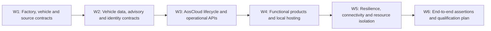

<!-- SPDX-FileCopyrightText: 2026 maninblack -->
<!-- SPDX-License-Identifier: MIT -->

# D4 Interface and Qualification Decision Register

- Status: Review candidate
- Version: 1.0
- Prepared: 2026-08-22
- Previous working baseline: Version 0.9
- Inputs: HLA 1.5, Demo Scenarios 2.0, Architecture Flows 2.0,
  System Requirements 2.0, Component Register 2.0 and the corresponding
  component-package review candidates
- Implementation, signing, Cloud, Unit, VM or CARLA mutation authorized: no

## Purpose

This register is the single navigation and decision-control surface for D4.
It consolidates repeated package-level open gates into one stable decision ID
without moving requirements, interface ownership or tests out of their owning
component packages.

D4 freezes **how an accepted D3 obligation will be proved**: exact schemas,
profiles, API operations, roles, bounds, fixtures, failure semantics,
qualification environments and evidence. It does not silently change the
accepted architecture, component behavior or lifecycle authority.

## How to Read and Update This Register

Each shared question has exactly one `D4-*` ID. The decision summary lives
here; the normative contract, fixture or qualification procedure lives in the
named owning repository or documentation file and is linked from the accepted
decision record.

| State | Meaning |
| --- | --- |
| `OPEN` | Question and owners are known; no reviewed resolution exists |
| `RESEARCHING` | Read-only evidence or an experiment plan is in progress |
| `PROPOSED` | One complete resolution and its impact analysis are ready for review |
| `REVIEW_READY` | Contract, mappings and verification plan are complete enough for a decision |
| `DECIDED` | Owners accepted the resolution and every affected document was updated |
| `BLOCKED` | An identified external prerequisite prevents a truthful decision |
| `DEFERRED` | Explicitly outside the current implementation release; not a hidden blocker |

A decision can become `DECIDED` only when:

1. its exact contract or qualification output has a canonical local link;
2. accountable owners have reviewed the same version;
3. every affected `IF-*`, `REQ-*`, `UT-*` and `AT-*` mapping is updated;
4. normal, boundary, malformed, unavailable and recovery behavior is allocated
   where applicable;
5. secrets, confidential input and external authority are not copied into the
   repository;
6. any Level-B or Level-C change cascade has completed; and
7. the documentation quality gate passes.

## Execution Order

Research inside a later workstream may proceed early, but a decision may not
assume an unresolved upstream contract. Parallel packages shall reference the
same decision ID rather than create local variants.

## W1 — Factory, Vehicle and Source Contracts

| Decision | Question and required output | Primary owners | Main consumers | State |
| --- | --- | --- | --- | --- |
| `D4-001` — Factory artifact acceptance | Freeze reproducibility semantics, required Factory Image contents/manifest, immutable release identity and whether `.11` can qualify unchanged | Platform Team / System Architecture | `CR-FACTORY`, `CR-DEMO`, `CR-E2E` | `DECIDED` |
| `D4-002` — Vehicle hardware capability profile | Freeze the selected CARLA revision/blueprint, installed signals/sensors/actuators, provenance and complete Simulator↔Gateway accounting manifest | Vehicle Simulation + Gateway | `CR-VEHICLE-SIM`, `CR-GATEWAY`, `CR-VDP` | `DECIDED` |
| `D4-003` — Deterministic stimuli and calibration | Freeze Brake obstacle/event stimulus, Tire pre-aged/accelerated stimulus, hidden qualification truth, repeat count and tolerances | Vehicle Simulation + both Function Teams | `CR-VEHICLE-SIM`, `CR-BHS`, `CR-TIRE`, `CR-E2E` | `RESEARCHING` |
| `D4-004` — Drive-mode and scenario context | Freeze scenario/manual/autopilot transitions, obstacle ownership, reverse/reset behavior, mode/context/status VSS paths and discontinuity semantics | Vehicle Simulation + Gateway | `CR-VEHICLE-SIM`, `CR-GATEWAY`, Engineering Dashboard | `DECIDED` |
| `D4-005` — Exclusive VU/DU source handover | Freeze attach, prove exclusive binding, detach, canonical reset/new generation and attach-to-next-role protocol without replay or a second simulated vehicle | Demo Solution + Gateway + Vehicle Simulation | Every VU/DU functional proof | `DECIDED` |

### D4-001 Decision Record — Factory Artifact Acceptance

- Decision state: `DECIDED`
- Accepted: 2026-08-21
- Owners: Platform Team / System Architecture
- Canonical requirement package:
  [Factory Substrate](components/factory-substrate.md)

The accepted Factory Image contract is:

1. Candidate `.11` remains immutable engineering evidence and the input to an
   incremental successor build; it is not accepted unchanged as the final OEM
   Demo Factory Image.
2. The existing provider-specific empty-slot runtime is the accepted pre-SOP
   runtime model. A generic multi-provider runtime is not required by HLA 1.4
   and is not a reason to rebuild the image.
3. A new versioned Factory Image candidate shall be produced only after
   [`D4-027`](#d4-027) and [`D4-010`](#d4-010) freeze the stock Aos IAM,
   separately packaged compatibility-helper and protected-signing seams that must be
   present before provisioning.
4. The new candidate shall be produced from pinned source and build inputs;
   post-build binary patching is prohibited.
5. Release immutability and build reproducibility are separate proofs:

   - an accepted distributable image is identified by one exact byte size and
     SHA-256 digest and is used only as a read-only backing image for fresh
     overlays;
   - a controlled rebuild from the same source lock shall prove canonical
     equivalence of partition layout, installed-package manifest, immutable
     filesystem content, runtime inventory and security configuration;
   - raw-image byte identity is preferred but not mandatory when every
     difference is restricted to a reviewed allowlist of non-semantic image
     UUID/timestamp fields and is included in the evidence record.

6. One controlled reproducibility rebuild is required after candidate content
   is frozen. It is qualification work, not a presentation-time action and not
   a requirement to rebuild after every source edit.
7. The normative Factory Image manifest shall bind source lock, build graph,
   toolchain/configuration identity, artifact type, exact release digest,
   canonical equivalence evidence, required runtime/security inventory and
   secret/identity-negative results.
8. The actual successor version and digest are implementation/qualification
   outputs. They are not invented by this D4 decision.

Consequences:

- preserve the isolated Yocto builder and incremental caches;
- do not modify, sign, upload, provision from or relabel `.11` as accepted;
- do not start the successor build until `D4-027` and the required `D4-010`
  signer/publication portions are decided;
- that D4 decision prerequisite is now satisfied by D4-027, D4-010.1 and
  D4-010.3, but the decision does not itself authorize the successor build;
- qualify two fresh overlays, clean first boot, distinct identities, empty-slot
  health and unchanged backing-image digest against the successor candidate;
- retain production provider-store selection as deferred `D4-X03` work.

### D4-002 Decision Record — Vehicle Hardware Capability Profile

- Decision state: `DECIDED`
- Accepted: 2026-08-21
- Owners: Vehicle Simulation / Vehicle Gateway
- Canonical contract:
  [profile](../../contracts/vehicle-hardware-profile/vehicle-hardware-capability-profile.v1.json),
  and [schema](../../contracts/vehicle-hardware-profile/vehicle-hardware-capability-profile.schema.json)
- Accepted profile SHA-256:
  `ac0ba26464219482dcb41e56ebbc1538489e13bd6c84725dbc124e59514cb7e5`

The accepted vehicle-hardware contract is:

1. The selected profile is `carla-lincoln-mkz-chaos` version `1.0.0`. It pins
   the checked repository revision
   `ac7d882cac496ccbf8b40aa543d6b38513e1173c`, the runtime compatibility
   revision `385927b6ac5efaaa204b5b9853a7aaa5c5917428`, Unreal Engine 5 Chaos and
   ego blueprint `vehicle.lincoln.mkz`.
2. One digest-addressed JSON profile is the cross-repository source of truth.
   Vehicle Simulation owns the physical installation declaration; Vehicle
   Gateway co-owns the complete mapping/disposition accounting.
3. Every capability is classified by installation, provenance, data shape,
   unit, frame, cadence, availability and Gateway disposition. Installed
   native/derived capabilities are distinct from `NOT_INSTALLED`, native
   unavailable, qualification-only and demo-visualization entries.
4. The installed baseline includes native vehicle dynamics and applied state,
   Chaos wheel telemetry, one 10 Hz GNSS sensor and the physical CARLA control
   capabilities. The scenario collision sensor is qualification-only and the
   chase camera is demo visualization, not a production vehicle signal.
5. IMU, radar, lidar, production cameras, lane-invasion, obstacle-detection and
   V2X/RSS facilities remain explicitly `NOT_INSTALLED`; CARLA's ability to
   spawn them does not imply that the selected virtual vehicle contains them.
6. Brake pressure/temperature/wear and tire pressure/temperature/tread/health
   have no truthful native source in this CARLA profile. A future synthetic
   model must identify its provenance and cannot be presented as native CARLA
   telemetry.
7. Every installed capability must have exactly one Gateway disposition:
   retained native, normalized, explicit unavailable or reviewed unsupported.
   No entry may disappear silently, and missing optional data may not be
   replaced by a plausible zero.
8. Throttle, brake, steering, handbrake, transmission/reverse/manual shift and
   vehicle-light controls are physical capabilities. Capability does not grant
   authority: current UI and mode ownership remain separately constrained, and
   the applied CARLA state is the execution evidence.
9. Scenario, Manual, Autopilot and Safe Stop are control modes, not actuators;
   their transition semantics remain allocated to [`D4-004`](#d4-004).
10. Qualification/world ground truth remains outside VSS/VISS and KUKSA.
    Exact VSS/VISS paths and freshness remain allocated to
    [`D4-006`](#d4-006), and typed advisory return remains allocated to
    [`D4-008`](#d4-008).
11. The static profile describes the expected installation. A qualified
    Gateway startup must reconcile the live source, blueprint, installed
    sensors and complete adapter coverage. Any mismatch invalidates the run;
    it does not mutate the accepted profile or produce a healthy result.

Consequences:

- the manifest contract is accepted, while runtime reconciliation and complete
  target adapter/actuator implementation remain qualification work;
- maps and Brake/Tire stimuli are not part of the hardware profile and remain
  under `D4-003`;
- implementation repositories may retain more native values than a narrower
  service-facing VSS/KUKSA release exposes, but must still account for them;
- changing the installed hardware profile produces a new profile version and
  digest and triggers the affected Simulator, Gateway and VDP contract cascade.

### D4-003 Working Decision Record — Deterministic Stimuli and Calibration

- Decision state: `RESEARCHING`
- Direction reviewed: 2026-08-21
- Owners: Vehicle Simulation / Function Team 1 / Function Team 2
- Canonical working plan:
  [D4-003 stimulus calibration plan](../qualification/d4-003-stimulus-calibration-plan.md)

The reviewed working direction is:

1. All coefficient selection, metric calibration and repeated qualification
   happen before the audience demonstration. A presentation executes only an
   already frozen live stimulus profile.
2. The implemented `stationary-obstacle-braking-v1` and unattended
   `brake_event_town10hd.json` are the Brake calibration input. Its current
   physical thresholds remain the starting contract, while an independent
   series must still freeze and prove the final repeatability envelope.
3. The Brake stimulus supplies a visible physical braking episode and
   qualification facts only. It does not fabricate native pad wear,
   temperature, pressure or health. Brake v2 synthetic assessment remains a
   Function Team 1 product decision under [`D4-016`](#d4-016).
4. The Tire stimulus shall use `preaged-tire-dynamics-v1` with `HEALTHY` and
   `PRE_AGED` profiles. `PRE_AGED` applies one calibrated symmetric relative
   reduction to all four wheels' `friction_force_multiplier`, followed by a
   bounded low-speed deterministic exercise and verified restoration of the
   exact original `VehiclePhysicsControl`.
5. The Tire service sees only native dynamics from the accepted hardware
   profile. Exact condition profile and friction multiplier are hidden
   qualification truth and may not enter Gateway production state, VISS,
   KUKSA, service input, backend payload or audience dashboard.
6. Five strict-reset calibration runs per Brake/Tire profile select and freeze
   the final Tire values, absolute physical bounds and native-feature
   separation margins before independent qualification.
7. Independent qualification then requires 20/20 Brake runs and 10 `HEALTHY`
   plus 10 `PRE_AGED` Tire runs, with no collisions/leaks, valid chronology,
   frozen-bound compliance, successful reset/physics restoration and oracle-
   negative proof.
8. Service algorithm correctness is intentionally separate: Brake model and
   Tire estimator/state/bands remain owned by `D4-016` and `D4-018`.
9. Overall system qualification/presenter modes remain under
   [`D4-026`](#d4-026); they consume, not redefine, these stimulus-specific
   results.

The direction is accepted but the decision is not yet `DECIDED`. Closure
requires a canonical schema, implemented Tire stimulus, frozen post-calibration
values/tolerances, passing independent series and complete oracle-negative
evidence.

### D4-004 Decision Record — Drive Mode and Scenario Context

- Decision state: `DECIDED`
- Accepted: 2026-08-21
- Owners: Vehicle Simulation / Vehicle Gateway
- Canonical contract:
  [Simulator Control and Context Contract 1.0.0](../../contracts/simulator-control-context/simulator-control-context.v1.json)

The accepted contract freezes:

1. the independent drive-mode states `SAFE_STOP`, `SCENARIO`, `MANUAL` and
   `AUTOPILOT`, and world contexts `FREE_DRIVE` and `BRAKE_EVENT`;
2. the complete `AF-X-DRIVE` transition matrix, with the Scenario Controller
   as the sole obstacle owner and the Gateway/controller as the only ego actor
   and synchronous-clock owner;
3. Scenario-to-Manual as an `ABORTED` attempt with the same pose and retained
   obstacle, so operator braking still produces truthful native telemetry;
4. every brake-context-to-Autopilot transition as safe stop, obstacle removal,
   same-actor zero-motion reset to canonical free drive, lane validation and
   only then Traffic Manager activation;
5. every Scenario start/restart as safe stop, canonical obstacle preparation,
   same-actor zero-motion reset, attempt-local evidence clear and new Scenario
   generation;
6. Safe Stop as a control action that never implicitly changes world context,
   deletes an obstacle or claims a reset;
7. project-owned `Vehicle.CarlaSimulation.Control.*`, `World.*`, `Scenario.*`
   and `Reset.*` engineering paths, including requested versus active mode,
   transaction state, monotonic generations and durable reset frame evidence;
8. a reset discontinuity flag on the first complete post-reset snapshot plus
   durable `Reset.Generation` and `Reset.FrameId`, so a missed transient flag
   cannot turn teleportation into apparent physical movement; and
9. reverse as a physical capability declared by D4-002 but not authorized in
   the first-demo Control UI. Recovery uses Scenario restart or the accepted
   Autopilot context reset; Traffic Manager obstacle avoidance is not claimed.

The contract is accepted independently of implementation. Current same-actor
Manual/Autopilot handover and Scenario restart are partial evidence; dynamic
obstacle lifecycle, transactional activation and the engineering VSS paths
must still be implemented and qualified. Failed cleanup, reset or lane
validation leaves `SAFE_STOP`, reports `FAILED` and never partially activates
the requested mode or newly requested context.

### D4-005 Decision Record — Exclusive Live-Source Assignment

- Decision state: `DECIDED`
- Accepted: 2026-08-21
- Owners: Demo Solution / Vehicle Gateway / Vehicle Simulation
- Canonical contract:
  [Exclusive Live-Source Assignment 1.0.0](../../contracts/exclusive-live-source-assignment/exclusive-live-source-assignment.v1.json)

The accepted contract deliberately separates two views:

1. The audience sees a **Validation Vehicle** and a **Demonstration Vehicle**.
   AosCloud technical detail maps those vehicles to the Validation Unit and
   Demonstration Unit Domain Controllers. Exactly one is the `CURRENT VEHICLE`.
2. The first-demo implementation uses one live CARLA/Gateway source and the
   host Demo Orchestrator assigns it sequentially and exclusively to those
   Units. This mechanism is demo infrastructure, not in-vehicle behavior or an
   AosCloud vehicle lifecycle operation.

The primary UI uses `Continue with Demonstration Vehicle` and never exposes
`Attach CARLA`, `Detach CARLA`, `Switch VM` or `Source Binding` as audience
actions. Both Units may remain Online in AosCloud; Cloud online state is
independent of which logical vehicle is current. Unit/Node/Unit Set, exact
source identity, assignment state, generation and frame range remain
available through technical details. Logical vehicle role is orchestration
state and shall not enter VSS/KUKSA production data.

The technical sequence is exact:

1. re-read both Unit identities and disjoint Unit Set roles;
2. select and accept only the authenticated Validation Unit peer, prove one
   selected-Unit VISS session and capture its first frame; the separately
   authenticated read-only Engineering Dashboard may remain connected;
3. execute qualification and close the bounded Validation frame range;
4. safe-stop, detach Validation, clear selection and prove no source consumer;
5. execute the D4-004 canonical reset with no Unit attached and prove a new
   Reset Generation;
6. select and accept only the authenticated Demonstration Unit peer, capture
   its first frame and prove the current baseline vehicle works; and
7. promote the identical accepted QM artifact while the Demonstration Vehicle
   is current, then detach it during cleanup/R0.

An unexpected/additional Unit peer, uncertain detach, identity mismatch,
overlapping or non-monotonic frame range, or failed reset selects safe stop and
blocks the next assignment. The exact authenticated VISS peer/trust mechanism
is owned by D4-006. Telemetry replay and a second simulated vehicle remain
explicitly deferred. Implementation and live qualification remain open even
though the assignment and audience contract are decided.

## W2 — Vehicle Data, Advisory and Identity Contracts

| Decision | Question and required output | Primary owners | Main consumers | State |
| --- | --- | --- | --- | --- |
| `D4-006` — VISS trust, telemetry and status profile | Freeze private peer authentication, Get/Subscribe/Set subset, types/units, freshness/degraded paths, source-loss and queue/error semantics | Gateway + Platform Team | `CR-GATEWAY`, `CR-VDP`, Engineering Dashboard | `DECIDED` |
| `D4-007` — VDP v1–v3 compatibility contract | Freeze the staged signal subsets, backward compatibility, actual installed capability identity and fail-closed service readiness metadata | Platform Team + both Function Teams | `CR-VDP`, `CR-BHS`, `CR-TIRE`, `CR-AOS` | `DECIDED` |
| `D4-008` — Typed QM advisory contract | Freeze Brake/Tire targets, payloads, status, correlation, freshness, rate, debounce/hysteresis and replay rules through KUKSA→VDP→VISS→Gateway | Gateway + Platform + both Function Teams | `CR-GATEWAY`, `CR-VDP`, `CR-BHS`, `CR-TIRE`, `CR-CROSS` | `DECIDED` |
| `D4-009` — Retired VDP-owned Service credential contract | Historical permission-handler and broker decision superseded by `D4-027`; stable anchor retained | Platform Team + Aos IAM/security owners | Historical trace only | `RETIRED` |
| `D4-010` — Protected signing and publication credentials | Freeze per-Unit signer bootstrap/retirement, PKCS#11 operation and role-specific OEM/SP artifact-publication credential profiles; dynamic Provider authorization is not a first-demo gate | Platform Team + Aos security/API owners + Function Team release owners | `CR-KAC`, `CR-FACTORY`, `CR-DEMO`, both Cloud products, `CR-CROSS` | `DECIDED` for current demo — `D4-010.1` and `D4-010.3` accepted; generic `D4-010.2` target deferred |
| `D4-027` — Current-release KUKSA authorization compatibility contract | Freeze fixed-resource Service bootstrap, IAM lookup, claim derivation, private volatile JWT delivery, renewal/reboot/stop/removal/offline behavior, helper bounds and native-migration deletion seam | Platform Team + Aos IAM/security owners + both Function Teams | `CR-KAC`, `CR-FACTORY`, `CR-AOS`, both services, `CR-CROSS`, `CR-E2E` | `DECIDED` — D4-027.1 through D4-027.8 accepted |

### D4-006 Decision Record — VISS Trust, Telemetry and Status Profile

- Decision state: `DECIDED`
- Accepted: 2026-08-21
- Owners: Vehicle Gateway / Platform Team
- Canonical contract:
  [VISS Trust and Telemetry Profile 1.0.0](../../contracts/viss-trust-telemetry-profile/viss-trust-telemetry-profile.v1.json)
- Accepted contract SHA-256:
  `24484919d916ade153111fd6075d06cecdf77d0bed7cfd016c0a4163e1b8fd53`

The accepted contract freezes:

1. The private in-vehicle boundary uses VISS 3.1 over `wss`, TLS 1.2 or later,
   server verification and mutual TLS. Plain WebSocket and unauthenticated
   clients are rejected.
2. Three authenticated peer roles exist: one selected Platform Unit,
   a permanently read-only Engineering Telematics Dashboard and a read-only
   qualification client. D4-005 exclusivity applies to Unit peers only; the
   independent Engineering Dashboard may remain connected.
3. The selected Unit is bound by exact Unit ID, Node ID, client-certificate
   fingerprint and assignment generation. A non-selected, additional,
   expired, revoked, unknown or mismatched Unit peer is rejected even when
   that Unit remains Online in AosCloud.
4. Each provisioned Unit has a unique client identity created only after its
   Cloud Unit/Node identity is known. Its private key is absent from the
   Factory Image, FOTA components, Git, logs and dashboards, is stored as a
   protected root-owned VM credential and is delivered with systemd
   `LoadCredential`. R0 retires it. Non-exportable TPM/PKCS#11 client keys are
   future hardening, not a first-demo claim.
5. The current provider cadence remains 50 ms, source freshness is 250 ms and
   reconnect backoff is bounded from 500 ms to 10 s. Client subscriptions,
   message size and pending-event queues are bounded; overflow is visible and
   never blocks CARLA frame processing.
6. Process health and vehicle-data readiness are different facts. Source
   states are `STARTING`, `AUTHENTICATING`, `LIVE`, `STALE`, `DISCONNECTED`,
   `AUTHENTICATION_FAILED` and `CONTRACT_MISMATCH`. Disconnect or stale input
   atomically becomes KUKSA `NotAvailable`; recovery requires a complete valid
   snapshot with matching contract, source and generation and a monotonic
   frame.
7. One machine-readable profile accounts for the complete D4-002 Gateway
   engineering superset and the entire D4-004 control/context projection. Each
   physical capability is either mapped to exact typed paths or explicitly
   excluded. D4-007 may select only staged subsets of this superset.
8. `Get`, `Subscribe` and `Unsubscribe` are accepted. Every `Set` remains
   rejected without side effects until D4-008 freezes the typed QM advisory
   contract; the Engineering Dashboard and qualification client remain
   permanently read-only.

Consequences:

- the previous server-only TLS and eight-generic-client baseline is evidence,
  not the accepted trust design;
- Gateway, provider, Unit onboarding/R0 and Dashboard implementations must be
  aligned and qualified against the same contract;
- the current CARLA runtime's native wheel angular speed in `rad/s` must be
  converted to the canonical VSS 6.0 `degrees/s` before that standard path is
  marked implemented;
- D4-007 owns staged KUKSA/VDP subsets, while D4-008 alone may introduce exact
  typed `Set` targets;
- accepting this contract does not claim that mTLS, the selected-Unit gate,
  complete target paths or live qualification are already implemented.

### D4-007 Decision Record — VDP v1-v3 Compatibility Contract

- Decision state: `DECIDED`
- Accepted: 2026-08-21
- Owners: Platform Team / Function Team 1 / Function Team 2
- Canonical contract:
  [VDP Compatibility Profile 1.0.0](../../contracts/vdp-compatibility-profile/vdp-compatibility-profile.v1.json)
- Accepted contract SHA-256:
  `4c00a3848eb2c961b048e74d3d1253bdc43e47c1467f64e62653046ba39ba12c`

The accepted compatibility contract freezes:

1. VDP v1 publishes the seven-path base-dynamics set: vehicle speed, three
   acceleration axes, accelerator/brake pedal position and Row 1 steering
   angle.
2. VDP v2 is a strict additive superset. It preserves all v1 paths and adds
   four standard wheel-speed plus four standard wheel-angular-speed paths.
3. VDP v3 is a strict additive superset. It preserves v1/v2, adds four
   longitudinal-slip plus four lateral-slip-angle paths and declares the Brake
   and Tire outbound-advisory capability families. `D4-008`, not this
   decision, owns their exact targets and payloads.
4. Brake Health v1 is compatible with VDP v1-v3, Brake Health v2 with v2-v3,
   Brake Health v3 only with v3, and Tire Health v1.0 only with v3. Exact
   model-consumed subsets remain owned by `D4-016` and `D4-018`.
5. Every installed VDP identity carries component/artifact/metadata identity,
   VDP contract identity and digest, hardware/VISS profile digests and a
   capability-manifest digest. Missing, malformed, unknown-future or
   semantically changed identity fails closed.
6. Process health is separate from functional readiness. Readiness evaluates
   `INBOUND_DATA`, `SERVICE_ACCESS` and, where required,
   `OUTBOUND_ADVISORY`; an incompatible service remains process-healthy but
   `NOT_READY`, produces no functional result or advisory and never enters a
   crash/restart loop.
7. A component-identity, capability, source or access change triggers
   re-evaluation. Installing VDP v3 after Tire Health was installed against
   v1/v2 lets the same service instance become `READY` automatically after a
   complete valid contract/data check; no SOTA reinstall is required.
8. When backend connectivity exists, Tire Health reports a structured
   incompatibility status. Its Function Dashboard shows required and actual
   VDP versions, missing capability/path facts and an explicit handoff to the
   Platform Team. Source stale/disconnected and access-denied cases use
   different reasons and are not mislabeled as a platform-version request.
9. Current runtime defense and dashboard guidance are not native AosCloud
   admission. The dashboard neither mutates lifecycle state nor implements a
   local admission proxy. Native pre-transfer rejection remains deferred in
   `D4-X01`.

Consequences:

- the three staged KUKSA publication sets and compatibility graph are no
  longer open design questions;
- implementation must expose the accepted installed-identity and readiness
  reasons and prove automatic blocked-to-ready recovery;
- D4-016/D4-018 still freeze model input subsets, while D4-008 freezes exact
  advisory targets and D4-027 freezes Service access credentials;
- an incompatible SOTA may still be installed by the current platform, but it
  cannot truthfully become functionally ready or emit a successful result.

### D4-008 Decision Record — Typed QM Advisory Contract

- Decision state: `DECIDED`
- Accepted: 2026-08-21
- Owners: Vehicle Gateway / Platform Team / Function Team 1 / Function Team 2
- Canonical contract:
  [Typed QM Advisory Profile 1.0.1](../../contracts/qm-advisory-profile/qm-advisory-profile.v1.json)
- Profile SHA-256:
  `5f50d5f27693d31a9726e78d52b5a039a43f9fa4e0368cac2fc7571508487614`
- Request-schema SHA-256:
  `f2102fd948734a714160efb8ee09885107d58da1daabd95771dce56785149910`
- Status-schema SHA-256:
  `1e0ecb28cc7548c65f1352b4c8b5874871400b8a83050a1b527c5f58f8493661`

The accepted advisory contract freezes:

Profile `1.0.1` is a metadata-only provenance revision: it replaces the
retired `D4-009` authorization reference with `D4-027`. No advisory path,
schema, payload, authority, timing or replay semantic changed from `1.0.0`.

1. Exactly two OEM-overlay actuator paths exist:
   `Vehicle.OEM.BrakeHealth.Advisory.Request` for Brake Health v3 and
   `Vehicle.OEM.TireHealth.Advisory.Request` for Tire Health v1.0. Each has a
   separate read-only `GatewayStatus` sensor path.
2. One canonical RFC 8785 UTF-8 JSON object is carried in one VSS `string`
   leaf, limited to 2048 request bytes and 1024 status bytes. It is a strict
   schema-bound typed envelope, not arbitrary display text. This preserves
   one-leaf atomicity with the current primitive `kuksa.val.v1` API without
   modifying Eclipse KUKSA.
3. Request identity is `requestId` plus persistent `producerEpoch` and
   monotonic `sequence`. `SET` carries only endpoint-allowed recommendation
   and reason enums; `CLEAR` is a new explicit request with
   `CONDITION_CLEARED`, never an implicit `NONE` overwrite.
4. KUKSA write success proves only broker acceptance and VISS Set success
   proves only protocol handling. Only matching Gateway Status `APPLIED` or
   `CLEARED` is authoritative application evidence.
5. Gateway states are `RECEIVED`, `APPLIED`, `CLEARED`, `REJECTED`, `EXPIRED`
   and `FAILED`; reason enums distinguish source/path authority, schema/value,
   stale, replay, sequence rollback, rate, QM policy and internal failure.
6. Gateway acceptance age is at most 2000 ms; the advisory lease is at most
   30000 ms; refresh is no faster than 10000 ms and state-changing requests no
   faster than 1000 ms per endpoint. Replay evidence is retained for at least
   300000 ms and 256 identities per endpoint.
7. Identical duplicates are idempotent, conflicting duplicates and sequence
   rollback are rejected, expired retained targets are not replayed after a
   restart, and lease expiry automatically clears the engineering advisory.
8. Brake and Tire services may write only their own Request target and read
   their own status. They cannot cross-write, send arbitrary VSS paths, issue
   free-form driver text or obtain motion/safety authority. VDP validates in
   depth and the Gateway independently remains the final deny-by-default
   authority.
9. The complete local chain remains operational when the Unit loses external
   connectivity. AosCloud and functional backends are not part of advisory
   decision or delivery; backend synchronization after reconnect remains in
   D4-017/D4-019.
10. D4-016/D4-018 still own model thresholds and decision hysteresis; D4-027
    still owns exact IAM/KUKSA credential issue and refresh. Production driver
    HMI and functional-safety claims remain out of scope.

Consequences:

- the exact advisory paths, envelope/status schemas and common transport
  protection are no longer open design questions;
- implementation must keep current deny-all Set behavior until both endpoints
  and the complete positive/negative contract matrix are implemented;
- the existing Engineering Dashboard stays read-only and may display only
  factual Request/Gateway Status state;
- VSS struct wire encoding may replace the string envelope only after the
  selected KUKSA/VISS implementations prove atomic end-to-end support without
  changing the semantic contract.

### D4-009 Retired Decision Record — VDP-Owned Service Credential Contract

- Decision state: `RETIRED`; superseded by [`D4-027`](#d4-027)
- Accepted: 2026-08-21
- Owners: Platform Team / Aos IAM and security owners
- Authoritative clarification: Platform Team response reported by the demo
  owner on 2026-08-21

Read-only inspection of the pinned AosVM 6.1.0 / meta-aos 9.1.0 sources and
the provisioned Units established the baseline facts: the current AosVM IAM
configuration does not contain `enablePermissionsHandler`; provisioning and
normal IAM use the same `/etc/aos/iam.cfg`; and provisioning does not rewrite
that file or toggle the option. The Platform Team then clarified the intended
contract: the permission handler shall be explicitly enabled in the IAM
configuration and its enabled state is independent of whether the Unit is
provisioned.

The historical decision was:

1. the next OEM Demo Factory Image shall be built with the single shared
   `/etc/aos/iam.cfg` containing `enablePermissionsHandler: true`;
2. provisioning shall not generate, rewrite or select a second IAM
   configuration and no project-owned lifecycle switch shall be added;
3. enabling the handler does not bake a service identity, permission record,
   `AOS_SECRET` or reusable credential into the image: Service Manager and
   Aos IAM still create and register that state for each running SOTA service
   instance;
4. the VDP Credential Broker shall authenticate only by calling
   `GetPermissions(secret, "kuksa")`, map only the currently registered valid
   `r`, `w` or `rw` paths into a short-lived KUKSA JWT, and keep no parallel
   identity, allowlist or service-secret store;
5. invalid or stale secrets, unknown modes, malformed paths, permissions
   outside the installed VDP contract, IAM unavailability and removed service
   permissions shall fail closed and shall not produce or renew a token; and
6. image qualification shall prove the option is explicitly true in the
   effective configuration used by both IAM modes, prove that no service
   permission or secret is pre-populated in the unprovisioned image, and prove
   positive and negative `RegisterInstance`/`GetPermissions` behavior through
   the stock Service Manager/IAM lifecycle.

Current disposition:

- items 1–3 and the image-qualification part of item 6 remain valid inputs to
  `D4-027` and `CR-FACTORY`;
- items 4–5 are superseded because Service authorization is no longer owned by
  VDP and callers no longer select paths or modes;
- the helper now belongs to separately packaged `CMP-KAC`, accepts only the
  instance credential plus fixed `kuksa` resource, and derives all JWT claims
  from the current IAM result; and
- no implementation may cite this retired record as authority for a broker
  inside VDP.

Historical consequences were:

- the earlier two-configuration, provisioning-state-selected recommendation
  is withdrawn;
- the current `.1`, `.2` and `.11` evidence remains useful but none of those
  images is the accepted Factory Image while its effective configuration
  leaves the permission handler disabled;
- the correction belongs to the pre-SOP OEM Factory Baseline Assembly and
  therefore requires the planned successor VM-image build; it is not a demo
  provisioning step and is not delivered as the initial post-SOP FOTA; and
- D4-010.1 owns the accepted per-Unit signing-key lifecycle; D4-010.3 owns the
  separate role-bound artifact-publication credentials. Dynamic Provider
  authorization is not a first-demo gate.

### D4-010.1 Decision Record — Per-Unit KUKSA Signer and Verifier

- Decision state: `DECIDED`
- Accepted: 2026-08-21
- Owners: Platform Team / Aos IAM and security owners
- Parent decision: `D4-010` is closed for the current demo by this record and
  D4-010.3. The generic native workload-token model is future-platform work,
  not a first-demo Provider gate.

The accepted first-demo signing lifecycle is:

1. the OEM Demo Factory Image contains the dedicated non-secret
   `kuksa-jwt` certificate-module, PKCS#11 token/PIN references, public-key
   preparation service and systemd ordering, but contains no private signing
   key, reusable JWT, shared static verifier or file-key fallback;
2. successful provisioning creates one unique RSA key pair for the Unit in
   the dedicated PKCS#11 token through the Aos self-signed certificate-module
   lifecycle. The private key is non-exportable to `CMP-KAC` and is never
   copied into Git, logs, the Factory Image or any FOTA/SOTA artifact;
3. after provisioning, a Platform-owned preparation service exports only the
   public key and atomically installs the root-owned KUKSA verifier. KUKSA and
   `CMP-KAC` start only after this preparation succeeds and fail
   closed when the key, verifier or protected signing operation is missing or
   malformed;
4. `CMP-KAC` signs bounded short-lived `RS256` JWTs by invoking
   the PKCS#11 operation directly. The pinned unmodified KUKSA loads one public
   key at process start and enforces signature, fixed audience `kuksa.val`,
   expiry and path permissions. Its current implementation does not enforce
   the JWT `iss` claim; `iss` is therefore informational/audit metadata, not a
   security boundary;
5. the first demo performs no live signing-key rotation. One key is valid for
   one Unit provisioning lifecycle; permission removal prevents token renewal,
   and the next fresh provisioning lifecycle creates a new key and verifier;
6. deprovisioning stops `CMP-KAC` and KUKSA and prevents further issuance,
   but the current asynchronous deprovision operation is not claimed to erase
   PKCS#11 material. R0 destroys the retired key by discarding the provisioned
   VM overlay after Cloud reconciliation; and
7. Validation and Demonstration Units shall expose different public-key
   fingerprints, and a token signed by either Unit shall be rejected by the
   other Unit's KUKSA instance.

Consequences:

- upstream KUKSA remains unchanged; JWKS, multiple simultaneous verifiers,
  hot reload and live key rotation are explicitly outside the first demo;
- short token lifetime and permission revalidation limit authorization
  lifetime, but do not replace final overlay destruction at R0;
- the current baked `/etc/kuksa-val/jwt.key.pub` pattern is qualification
  history and shall be removed from the successor Factory Image; and
- accepting D4-010.1 does not add dynamic Provider IAM/JWT; the separate
  OEM/Service Provider credentials used to sign and publish artifacts are
  selected by D4-010.3.

### D4-010.2 Deferred Target Input — Generic Workload Token Security Model

The technology-neutral security model is accepted in
[ADR 0012: Authorize Running Workloads, Not Software Artifacts](../architecture/decisions/0012-authorize-running-workloads-not-software-artifacts.md).
It is a binding input to D4-010.2, but it does not yet close that AosEdge
mapping decision.

The accepted principles are:

1. artifact, device, running-workload and authorization identities are
   separate facts;
2. tokens are issued only to an active runtime-established workload instance,
   never to a passive component artifact;
3. the Platform Workload Credential Service and protected signer are outside
   the workload they authorize;
4. effective scope is a deny-by-default intersection of requested,
   OEM-approved, active-contract, workload-type and current-lifecycle
   authority;
5. short-lived local credentials preserve offline vehicle operation and stop
   renewing on stop, update, rollback, removal or lost authorization; and
6. libraries inherit their host process identity, while components needing
   independent authority require their own process/container/VM boundary.

D4-010.2 remains a deferred target until a released AosEdge mapping identifies the supported
non-SOTA/FOTA workload identity lifecycle, authoritative active-component
facts, Platform Credential Service placement, principals, scopes and native
migration contract. The first demo treats the VDP Provider as trusted OEM
platform integration and does not claim this generic target is implemented.
No implementation may treat a component digest alone, a fixed Unix account or
a caller-provided permission document as sufficient workload authentication.

### D4-010.3 Decision Record — Artifact Signing and Publication Credential Profiles

- Decision state: `DECIDED`
- Accepted: 2026-08-22
- Owners: Platform Team / Function Team 1 / Function Team 2 / Demo Solution
- Canonical contract:
  [Artifact Publication Credential Profile 1.0.0](../../contracts/artifact-publication-profile/artifact-publication-profile.v1.json)
- Accepted contract SHA-256:
  `52bafd7b1249ec8bc10265e913265cdc7c2975f5f56db7ff3cd5cdbad4001c39`

The accepted current-demo publication contract is:

1. exactly three non-interchangeable profiles exist: `platform-oem` may sign
   and publish only the prepared VDP Component v1-v3 FOTA candidates;
   `brake-sp1` may sign and publish only Brake Health Service v1-v3 SOTA
   candidates; and `tire-sp2` may sign and publish only Tire Health Service
   v1.0;
2. one common native-helper implementation may serve all three products, but
   each authenticated dashboard surface is pre-bound to exactly one profile.
   No request may select a profile, credential path, arbitrary candidate path
   or Cloud URL;
3. the installed `aos-signer` 2.0.1/schema-2 baseline uses the same
   passwordless PKCS#12 per profile for bundle signing and mTLS upload, loads
   private-key material into its native process and does not provide a native
   macOS Keychain or PKCS#11 signing operation. Documentation shall not label
   this current path Keychain-backed or non-exportable;
4. the three PKCS#12 files are local demo prerequisites under
   `~/.aos/security`, mode `0600`, outside Git, every dashboard/container/VM
   image and every FOTA/SOTA artifact. Only the session-scoped non-root native
   helper may read the fixed allowlisted paths;
5. presentation-time work starts with digest verification of an already-built,
   tested, packaged and metadata-frozen catalogue candidate. No source edit,
   build, package generation, metadata mutation or repackaging is allowed;
6. the operation states are `PREPARED`, `SIGNING`, `SIGNED`, `PUBLISHING`,
   `PUBLISHED`, `FAILED` and `UNCERTAIN`. `PUBLISHED` requires an independent
   authoritative AosCloud re-read; a lost/ambiguous result becomes
   `UNCERTAIN` and is reconciled without blind upload retry;
7. technical publication never grants OEM Unit-deployment authority. A
   matching Service Provider publishes SOTA, the Platform Team OEM profile
   publishes FOTA, and an authorized OEM identity separately approves
   Validation deployment or Demonstration promotion. Passing evidence never
   auto-approves;
8. diagnostics may expose correlation/profile/candidate identifiers, exact
   prepared/signed digests, Cloud object identity, state and a bounded error
   code. They must not expose private-key, PKCS#12, certificate, credential
   path, session-secret, request-header or raw-tool-output content; and
9. Keychain/PKCS#11-backed non-exportable artifact signing is a later
   hardening migration behind the same dashboard-to-helper contract, after a
   qualified Aos signing client supports it. It is not a first-demo claim.

Consequences:

- the Platform, Brake and Tire publication identities remain distinct even
  though one helper implementation is reused;
- a wrong-profile, missing credential, changed digest or unsupported item type
  fails before signing and produces no publication-success state;
- OEM approval remains outside every Function Dashboard and outside the
  publication helper; and
- D4-010 is closed for the current demo. Deferred D4-010.2 does not block
  implementation because the first demo trusts the OEM Platform Team VDP
  Provider and makes no generic native-workload authorization claim.

### D4-027 Working Record — Current-Release KUKSA Authorization Compatibility

- Decision state: `DECIDED — D4-027.1 THROUGH D4-027.8 ACCEPTED`
- Owners: Platform Team / Aos IAM and security owners / both Function Teams
- Architecture authority: [ADR 0013](../architecture/decisions/0013-current-release-kuksa-authorization-compatibility.md)
- Requirement package: [`CR-KAC`](components/kuksa-authorization-compatibility.md)

Already accepted:

1. the shared IAM configuration contains `enablePermissionsHandler: true`
   independently of provisioning state;
2. `CMP-KAC` is a separately packaged removable Platform Team helper in the
   Factory Image, outside VDP and both SOTA products;
3. Service bootstrap carries only the active instance `AOS_SECRET` plus fixed
   resource `kuksa`; paths, modes, subject, audience, TTL and claims are not
   caller-selected;
4. every issue/renew action uses current Aos IAM `GetPermissions`; the helper
   has no parallel identity, permission or allowlist database;
5. the helper derives the pinned short-lived JWT itself, delivers it only via
   a Service-private volatile location and is absent from the subsequent
   Service-to-KUKSA data path;
6. reboot reconstructs authority from active Aos state; Service stop,
   unregistration or removal deletes private state and prevents renewal;
7. loss of vehicle external connectivity does not add a Cloud dependency to
   local authorization; and
8. the VDP Provider is trusted OEM platform integration and receives no
   authority from this Service credential path; and
9. `CMP-KAC` is the separately installable `aos-kuksa-auth-compat` factory
   package and `aos-kuksa-auth-compat.service`, runs as dedicated unprivileged
   `aos-kac:aos-kac`, and has no lifecycle dependency on VDP.
10. KUKSA-enabled Services reach `CMP-KAC` only through one platform-owned
    named resource and a private Unix-domain socket; a Service bootstrap keeps
    `AOS_SECRET` out of the analytics process and atomically maintains the JWT
    in a Service-private volatile tmpfs location.
11. the local exchange uses the strict versioned
    `aos-kuksa-auth-compat/v1` one-request/one-response JSON protocol; only
    `status` and `issue` operations exist, resource `kuksa` is implicit,
    responses use fixed status/error enums and all caller-selected authority is
    rejected.
12. IAM mode `r` maps to KUKSA `read:<exact-path>` and `rw` maps to
    `actuate:<exact-path>`; IAM `w`, unknown modes, wildcards and any request
    requiring partial permission trimming reject the complete issuance.
    Functional Service JWTs never receive KUKSA `provide` or `create`.
13. each JWT has a 300-second lifetime, renewal starts 180 seconds after issue
    and therefore reserves 120 seconds for bounded retry. Renewal repeats the
    IAM lookup, atomically replaces the private token and requires the Service
    to reconnect and recreate KUKSA subscriptions. Terminal denial deletes the
    token and disconnects immediately; transient failure may retain the current
    token only until signed expiry. No instant-revocation claim is made and
    Cloud connectivity is not part of renewal.
14. each provisioned Unit owns one protected `kuksa-jwt` RSA key pair. The
    private key never leaves PKCS#11. A post-provision preparation service
    verifies the protected signing path, atomically publishes only the public
    verifier in `/run`, and gates both KUKSA and `CMP-KAC`. Missing or malformed
    verifier state blocks startup rather than allowing authorization-disabled
    KUKSA. Reboot reconstructs the volatile verifier, Unit fingerprints differ,
    live rotation is outside the first demo, and R0 retires the key with the
    provisioned overlay.
15. trustworthy time requires one successful `systemd-timesyncd` NTP
    synchronization and 10 stable seconds per boot. UTC claims use
    `CLOCK_REALTIME`; scheduling uses `CLOCK_BOOTTIME`. A boot-ID-bound anchor
    survives helper restart only within that boot. Normal external-connectivity
    loss does not revoke trust, while a wall/boot-clock deviation above five
    seconds stops KUKSA, removes cooperating Service tokens and blocks issuance
    until a new synchronization and stable window complete. Cold offline boot
    leaves authorization `NOT_READY` without blocking unrelated AosCore work.
16. strict operational bounds cap frames, authority/JWT size, concurrency,
    backlog, per-peer/global rate, dependency and whole-request time, retry
    cadence and process resources. Excess input fails without trimming;
    transient retries use 1/2/4/8/16/30-second backoff with ±20% jitter and
    never cross JWT expiry. The helper has only `AF_UNIX`, 64-MiB memory,
    10%-CPU, 32-task and 128-descriptor envelopes, and emits only fixed
    redacted diagnostics.

### D4-027.1 Decision Record — Helper Package, Process and Startup Boundary

- Decision state: `DECIDED`
- Accepted: 2026-08-22
- Owners: Platform Team / Aos IAM and security owners

The accepted current-release deployment boundary is:

1. source belongs in the existing `aos-vehicle-platform` repository under the
   planned `authorization/aos-kuksa-compat/` boundary; Yocto integration uses
   a separate `aos-kuksa-auth-compat` recipe/package rather than adding files
   to the VDP component recipe;
2. the package owns `aos-kuksa-auth-compat.service`, its executable,
   dedicated system user/group declaration, non-secret configuration,
   systemd hardening, SELinux policy and runtime-directory declaration. It
   contains no `AOS_SECRET`, JWT, Service permission record, private key,
   shared verifier or functional data;
3. the process runs as dedicated `aos-kac:aos-kac`, with no root fallback,
   ambient capability or public listener. Access to the local Aos IAM client
   endpoint and protected signer shall be granted narrowly to this identity;
   inability to do so on the pinned release blocks implementation and reopens
   this decision rather than silently broadening privilege;
4. the unit is inactive in an unprovisioned Factory Image and uses the same
   existing provisioning-state boundary as `aos-iam.service`. After
   provisioning it requires and starts after `aos-iam.service` and the
   successful D4-027 signer/verifier-preparation gate. It starts with empty
   volatile state;
5. `aos-kuksa-auth-compat.service` neither requires nor orders the VDP. It is
   also not inserted as a global hard dependency of `aos-sm.service`: a KUKSA
   authorization failure must not prevent Aos from managing unrelated
   Services. A KUKSA-consuming Service may run as a process but remains
   functionally `NOT_READY` and uses only bounded retry until its private
   credential is prepared;
6. the helper is not a proxy and does not require
   `kuksa-databroker.service` to issue a credential. Unmodified KUKSA and the
   helper independently require successful public-verifier preparation; direct
   Service-to-KUKSA connectivity begins only after both are ready; and
7. the package boundary is independently removable. Migration to a released
   native AosCore credential contract deletes this package, unit and
   compatibility wiring without changing the VDP FOTA payload or either SOTA
   analytics implementation.

Read-only source inspection confirmed the pinned platform unit names
`aos-iam.service`, `aos-sm.service` and `kuksa-databroker.service`. No helper or
public-verifier-preparation unit exists in the current repository; their source
and recipe are therefore new implementation work, not renamed current units.
The exact wire schema, signer-preparation integration, trustworthy-time
behavior, sandbox and operational bounds are accepted in D4-027.3 through
D4-027.8. D4-027 has no remaining subdecision.

### D4-027.2 Decision Record — Local Transport and Private Credential Delivery

- Decision state: `DECIDED`
- Accepted: 2026-08-22
- Owners: Platform Team / Aos IAM and security owners / both Function Teams

The accepted current-release local transport and credential-delivery boundary
is:

1. the host helper exposes only the Unix-domain socket
   `/run/aos-kuksa-auth-compat/request.sock`; it exposes no TCP listener,
   public port or host-wide token directory;
2. a platform-owned Aos named resource `kuksa-auth-client` grants only an
   approved KUKSA-enabled Service instance a read-only bind mount of the socket
   directory at `/run/aosedge/platform/kuksa-auth`, supplementary membership
   in `aos-kuksa-clients`, and a container-private tmpfs at
   `/run/aosedge/secrets/kuksa`. The Service cannot select the host source,
   container destination, group, mount options or fixed KUKSA resource;
3. the host socket directory and container mount point may exist before the
   helper becomes ready. The socket is owned by `aos-kac:aos-kuksa-clients`
   and mode `0660`; the private credential directory is mode `0700` and its
   tmpfs is mounted `nosuid,nodev,noexec`;
4. the Service compatibility bootstrap, not the analytics application, reads
   the current instance `AOS_SECRET`, connects to `request.sock` and requests
   the one implicit fixed resource `kuksa`. It shall not send caller identity,
   paths, modes, claims, audience, TTL or signing input and shall execute the
   main application without `AOS_SECRET` in that application's environment;
5. native Aos IAM `GetPermissions` using the presented `AOS_SECRET` remains the
   authoritative identity and permission decision. Named-resource allocation,
   Unix group access and kernel peer credentials are defense in depth only and
   shall not replace or broaden that IAM decision;
6. on success, the bootstrap writes the returned JWT atomically to
   `/run/aosedge/secrets/kuksa/token.jwt` with mode `0400` and exposes only the
   fixed `KUKSA_TOKEN_FILE` path to the analytics process. Rejection creates no
   token file. No other Service instance may read the socket response, tmpfs or
   token file; and
7. the bootstrap remains the Service-local compatibility owner for renewal.
   Service stop, container replacement, removal, VM reboot or R0 overlay
   disposal destroys the private tmpfs and token; restart obtains a new token
   from current active Aos state rather than recovering a persisted credential.

This decision froze placement and isolation. D4-027.3 subsequently froze the
wire schema, D4-027.4 the JWT mapping, D4-027.5 the lifetime/renewal timing and
D4-027.6 the signer/verifier preparation. Trustworthy time and resource/rate
bounds remain open.

### D4-027.3 Decision Record — Local Request, Response and Readiness Protocol

- Decision state: `DECIDED`
- Accepted: 2026-08-22
- Owners: Platform Team / both Function Teams
- Machine-readable contract:
  [`kuksa-auth-compat.v1.json`](../../contracts/kuksa-current-demo-authorization/kuksa-auth-compat.v1.json)

The accepted current-release exchange protocol is:

1. protocol identifier `aos-kuksa-auth-compat/v1`; one Unix stream connection
   carries exactly one UTF-8 JSON object terminated by LF, one response object
   terminated by LF, and then server close;
2. the only request operations are `status` and `issue`. `status` contains no
   credential. `issue` contains only `protocol`, `operation` and opaque
   `aosSecret`; renewal repeats `issue` rather than using a distinct operation;
3. resource `kuksa` is implicit in this endpoint. Identity, Unit/instance ID,
   paths, modes, subject, audience, TTL, claims, signing input and caller
   correlation ID are not request fields. Unknown fields, duplicate object
   members, trailing objects and invalid UTF-8 are rejected;
4. a technically ready `status` exchange returns `status: ready`. This means
   only that local IAM/signer/verifier/time prerequisites are ready; it does
   not assert that any Service is authorized;
5. successful `issue` returns `status: issued`, a KAC-generated
   `correlationId`, `token`, `expiresAtUnixSeconds` and
   `renewAfterUnixSeconds`. The latter is earlier than expiry. The bootstrap
   writes the token using the already accepted D4-027.2 private-tmpfs contract;
6. every unsuccessful syntactically valid exchange returns `status: rejected`,
   a KAC-generated `correlationId`, fixed `code` and Boolean `retryable`. The
   complete code set is `INVALID_REQUEST`, `DENIED`, `POLICY_UNSUPPORTED`,
   `IAM_UNAVAILABLE`, `SIGNER_UNAVAILABLE`, `TIME_UNTRUSTED`, `BUSY` and
   `INTERNAL_ERROR`;
7. `DENIED` intentionally combines invalid/stale/inactive identity and absent
   authority. No response contains identity, permission paths/modes or free
   human-readable diagnostics. `AOS_SECRET`, JWT, private key and permission
   content never enter logs; server-generated `correlationId` is the only
   response-to-redacted-diagnostic join key; and
8. exact frame-size, connection/rate/concurrency limits and retry schedule are
   supplied by D4-027.8. D4-027.5 supplies the JWT timing values without
   changing this accepted schema.

Schema conformance alone does not authorize issuance: IAM result mapping,
pinned JWT claims, the accepted signer context and the D4-027.7 time gate
remain mandatory independent gates.

### D4-027.4 Decision Record — IAM Permission to KUKSA Claim Mapping

- Decision state: `DECIDED`
- Accepted: 2026-08-22
- Owners: Platform Team / both Function Teams
- Machine-readable contract:
  [`kuksa-auth-compat.v1.json`](../../contracts/kuksa-current-demo-authorization/kuksa-auth-compat.v1.json)

The accepted mapping is:

1. `CMP-KAC` calls `GetPermissions(AOS_SECRET, "kuksa")` and derives identity
   only from the returned Aos `InstanceIdent`; caller identity remains absent;
2. the pinned Service JWT uses `RS256`, fixed issuer
   `aosedge-kuksa-auth-compat`, fixed audience array containing only
   `kuksa.val`, required `sub`, `iss`, `aud`, `iat`, `exp` and `scope` claims,
   and a space-separated scope string;
3. IAM mode `r` on an exact VSS path maps to `read:<path>`;
4. IAM mode `rw` maps to `actuate:<path>` because pinned KUKSA `actuate`
   already includes read permission for the same path;
5. IAM mode `w` is unsupported because mapping it to `actuate` would silently
   add read permission. `w`, unknown modes, malformed paths, wildcards and
   empty or broadened authority therefore return `POLICY_UNSUPPORTED` without
   a token;
6. one unsupported entry rejects the complete issuance. The helper does not
   trim, rewrite or partially issue a reduced permission set; and
7. Service JWTs permit only `read` and `actuate`. `provide` and `create` remain
   outside this path and cannot be obtained by either functional Service.

This is a deterministic translation of current IAM authority, not a parallel
Service allowlist. First-demo Service metadata shall request exact leaf paths
and only `r` or `rw` modes.

### D4-027.5 Decision Record — JWT Lifetime and Renewal Boundary

- Decision state: `DECIDED`
- Accepted: 2026-08-22
- Owners: Platform Team / both Function Teams
- Machine-readable contract:
  [`kuksa-auth-compat.v1.json`](../../contracts/kuksa-current-demo-authorization/kuksa-auth-compat.v1.json)

The accepted timing boundary is:

1. `iat` is the trusted issue instant and `exp = iat + 300 seconds`;
2. `renewAfterUnixSeconds = iat + 180 seconds`, leaving a 120-second recovery
   reserve before expiry;
3. every renewal is a new `issue` exchange and repeats current Aos IAM
   `GetPermissions`; neither the previous JWT nor cached permission content is
   sufficient;
4. successful renewal atomically replaces the mode-`0400` private token and
   requires the Service KUKSA client to reconnect and recreate every
   subscription using the replacement JWT. File replacement alone does not
   re-authorize an already opened stream;
5. a retryable local failure may use the current JWT and retry only until its
   signed expiry. At expiry, the bootstrap deletes the token, disconnects KUKSA
   and reports functional `NOT_READY`;
6. terminal `DENIED` or `POLICY_UNSUPPORTED` renewal removes the token and
   disconnects the cooperating Service immediately. The previously issued
   self-contained token may remain cryptographically valid only until `exp`,
   so no instant-revocation claim is permitted; and
7. renewal uses only Unit-local IAM, helper, signer and KUKSA dependencies.
   Loss of Unit-to-Cloud and Service-to-backend connectivity does not prevent
   local renewal.

The exact retry schedule remains a later D4-027 bounds decision; it may not
extend the 300-second signed lifetime.

### D4-027.6 Decision Record — Per-Unit Signer and KUKSA Verifier Preparation

- Decision state: `DECIDED`
- Accepted: 2026-08-22
- Owners: Platform Team / Aos IAM and security owners
- Machine-readable contract:
  [`kuksa-auth-compat.v1.json`](../../contracts/kuksa-current-demo-authorization/kuksa-auth-compat.v1.json)

The accepted current-release signer/verifier integration is:

1. the Factory Image contains only the non-secret dedicated `kuksa-jwt`
   Aos self-signed certificate-module/PKCS#11 configuration,
   `aos-kuksa-verifier-prepare.service` and fail-closed systemd wiring. It
   contains no Unit key, JWT, shared verifier or file-key fallback;
2. successful provisioning creates one unique RSA key pair for that Unit
   provisioning lifecycle. The private key remains non-exportable behind the
   PKCS#11 operation and is never copied into `CMP-KAC`, a file, image,
   component, Service payload, log or retained evidence;
3. after provisioning, `aos-kuksa-verifier-prepare.service` locates the
   protected key, exports only its public key, performs a protected
   sign/verify self-test and atomically installs
   `/run/aos-kuksa-verifier/kuksa-jwt-public.pem` as `root:root` mode `0444`;
4. `kuksa-databroker.service` and `aos-kuksa-auth-compat.service` both require
   and start after the successful preparation unit. KUKSA is always invoked
   with
   `--jwt-public-key=/run/aos-kuksa-verifier/kuksa-jwt-public.pem`. Missing,
   malformed or unverified material blocks both consumers; KUKSA's
   authorization-disabled fallback is forbidden;
5. `CMP-KAC` invokes the protected PKCS#11 sign operation for each `RS256`
   JWT but cannot export private-key bytes. KUKSA loads the public key at
   process start; replacing a verifier therefore requires a KUKSA restart;
6. on VM reboot, the preparation unit recreates the volatile public verifier
   from the existing Unit key. KUKSA restarts with that verifier, `CMP-KAC`
   starts with empty credential state, and each Service obtains a fresh JWT;
7. live signing-key rotation and multiple simultaneous KUKSA verifiers are
   outside the first demo. Deprovisioning stops KUKSA and `CMP-KAC` and
   prevents further issuance. R0 retires the key by discarding the provisioned
   VM overlay after Cloud reconciliation; and
8. Validation and Demonstration Units expose different verifier fingerprints.
   A JWT signed in either Unit is rejected by the other Unit's KUKSA instance.

This materializes the already accepted D4-010.1 lifecycle for the current
compatibility helper; it does not introduce a second key authority or modify
upstream KUKSA.

### D4-027.7 Decision Record — Trustworthy Time and Clock Discontinuity

- Decision state: `DECIDED`
- Accepted: 2026-08-22
- Owners: Platform Team / Aos IAM and security owners
- Machine-readable contract:
  [`kuksa-auth-compat.v1.json`](../../contracts/kuksa-current-demo-authorization/kuksa-auth-compat.v1.json)

The accepted current-release trustworthy-time boundary is:

1. each VM boot requires one successful `systemd-timesyncd` NTP
   synchronization followed by a 10-second stable window before `CMP-KAC`
   reports technical readiness or issues a JWT;
2. JWT `iat` and `exp` use UTC `CLOCK_REALTIME`. Renewal, retry and stability
   scheduling use `CLOCK_BOOTTIME` and therefore do not rely on mutable wall
   time;
3. after the stable window, the helper atomically maintains a non-secret,
   current-boot-ID-bound anchor at
   `/run/aos-kuksa-auth-compat/time-anchor.json`, owned by
   `aos-kac:aos-kac` and mode `0600`. The anchor may restore helper state after
   process restart in the same boot, but `/run` deletion and boot-ID mismatch
   forbid reuse after VM reboot;
4. loss of Unit external connectivity after trust is established does not by
   itself revoke time trust and does not add a Cloud, backend or continuous-NTP
   dependency to local renewal;
5. the helper compares elapsed `CLOCK_REALTIME` with elapsed
   `CLOCK_BOOTTIME`. A deviation greater than five seconds in either direction
   is a clock discontinuity and makes the authorization domain
   `TIME_UNTRUSTED`;
6. on discontinuity, no issue or renewal succeeds, KUKSA is stopped through
   fail-closed systemd wiring, and cooperating Service bootstraps disconnect
   and delete their private JWTs. Unrelated AosCore services are not stopped;
7. recovery requires a new successful NTP synchronization and another
   10-second stable window, followed by KUKSA restart and fresh JWT issuance;
   no old bootstrap token is restored; and
8. a VM that cold-boots without external time synchronization keeps KUKSA
   authorization `NOT_READY`. The first demo does not claim offline cold-boot
   authorization continuity.

This gate is required because pinned KUKSA validates JWT epoch claims against
the VM wall clock; KUKSA has no independent trusted-time source.

### D4-027.8 Decision Record — Operational Bounds, Retry and Redaction

- Decision state: `DECIDED`
- Accepted: 2026-08-22
- Owners: Platform Team / both Function Teams
- Machine-readable contract:
  [`kuksa-auth-compat.v1.json`](../../contracts/kuksa-current-demo-authorization/kuksa-auth-compat.v1.json)

The accepted current-release operational envelope is:

1. one request frame is at most 16 KiB, one response at most 32 KiB, one JWT
   at most 16 KiB, one IAM result at most 64 permission entries and one VSS
   path at most 512 bytes. Oversized request syntax returns
   `INVALID_REQUEST`; oversized authority/JWT returns `POLICY_UNSUPPORTED` and
   rejects the complete issuance without trimming;
2. the helper accepts at most four concurrent requests with an eight-connection
   socket backlog. Per-peer rate is 12 requests/minute with burst four; global
   rate is 30/minute with burst ten. Rate or concurrency rejection returns
   retryable `BUSY`;
3. request framing has a two-second deadline, IAM and protected signing each
   have three-second deadlines, and the complete exchange has an eight-second
   deadline;
4. retryable results are `IAM_UNAVAILABLE`, `SIGNER_UNAVAILABLE`,
   `TIME_UNTRUSTED` and `BUSY`. Non-retryable results are `INVALID_REQUEST`,
   `DENIED`, `POLICY_UNSUPPORTED` and `INTERNAL_ERROR`;
5. retry waits 1, 2, 4, 8, 16 and then at most 30 seconds, each with ±20%
   jitter. With an existing JWT it stops at signed expiry. Without a JWT it may
   continue the capped retry while the Service remains `NOT_READY`;
6. systemd limits the helper to 64 MiB memory, 10% CPU, 32 tasks and 128 file
   descriptors. It has no ambient capability or TCP/IP family, uses only
   `AF_UNIX`, `NoNewPrivileges`, strict protected system content and private
   temporary storage. Limit failure closes the helper without stopping
   unrelated AosCore services;
7. diagnostic output may contain only fixed event code, KAC-generated
   correlation ID, outcome and retryability. It may not contain `AOS_SECRET`,
   JWT, permission content, VSS path, claims, signing input, private-key
   information, raw protocol frames, free-text protocol errors or
   high-cardinality identity labels; and
8. these numbers are the accepted first-demo envelope. Measurement may prove
   a reviewed change necessary, but implementation shall not widen them
   silently or truncate authority to fit.

D4-027 is now complete and authorizes no source, image, Cloud or Unit mutation
by itself. Implementation remains governed by the active change plan and the
other unresolved D4 owners.

This working record authorizes no helper implementation, image build, signing,
Cloud call or Unit mutation.

## W3 — AosCloud Lifecycle and Operational APIs

| Decision | Question and required output | Primary owners | Main consumers | State |
| --- | --- | --- | --- | --- |
| `D4-011` — Cloud role and action matrix | Qualify exact read, publication, verification, validation, approval, promotion and reconciliation endpoints, schemas, roles, errors and idempotency | AosCloud integration + OEM administration | `CR-AOS`, `CR-DEMO`, both Function Teams, Platform Team | `OPEN` |
| `D4-012` — Unit Sets and effective targeting | Freeze persistent set identities, membership-write operation/order and exact recipient derivation from complete paginated Unit pending-batch state and Campaign records | AosCloud integration + Demo Solution | `CR-AOS`, `CR-DEMO`, `CR-E2E` | `OPEN` |
| `D4-013` — Candidate identity and metadata | Freeze artifact/metadata canonicalization, digest identity exposed by Cloud, prepared/signed/Cloud identity mapping, bundle boundary and catalogue storage layout | Platform + Function Teams + Demo Solution + AosCloud integration | Release dashboards, `CR-AOS`, `CR-E2E` | `OPEN` |
| `D4-014` — Native operational-log contract | Qualify roles, request/status/result/download/delete APIs, retention, redaction, source timestamps and online/offline behavior without a second archive | AosCloud integration + emitting owners | `CR-AOS`, `CR-DEMO`, `CR-CROSS`, `CR-E2E` | `OPEN` |
| `D4-015` — Update recovery and identity retirement | Freeze pre-Apply revert, post-Apply recovery limits, service-first dependency recovery, offline transition, post-204 reconciliation, old-credential reconnect proof, Unit/Node/set deletion ordering | AosCloud integration + Platform Team + Demo Solution | `CR-AOS`, `CR-DEMO`, `CR-E2E` | `OPEN` |

## W4 — Functional Products and Local Hosting

| Decision | Question and required output | Primary owners | Main consumers | State |
| --- | --- | --- | --- | --- |
| `D4-016` — Brake in-vehicle product contract | Freeze v1 event-window trigger/pre/active/post/chunk/queue contract, v2 synthetic assessment and v3 advisory, persistence, readiness, resource and log schemas | Function Team 1 + Platform + Gateway + Vehicle Simulation | `CR-BHS`, `CR-BRAKE-CLOUD`, `CR-E2E` | `OPEN` |
| `D4-017` — Brake Cloud product contract | Freeze functional API/auth/ack/idempotency, UI fields, backend/storage technology, retention/migration and exact current-run deletion proof | Function Team 1 | `CR-BRAKE-CLOUD`, `CR-DEMO`, `CR-E2E` | `OPEN` |
| `D4-018` — Tire in-vehicle product contract | Freeze input subset, synthetic estimator/state/bands/confidence, event/summary/advisory, persistence/offline and health/resource/log contracts | Function Team 2 + Platform + Gateway + Vehicle Simulation | `CR-TIRE`, `CR-TIRE-CLOUD`, `CR-E2E` | `OPEN` |
| `D4-019` — Tire Cloud product contract | Freeze functional API/auth/ack/idempotency, UI fields, backend/storage technology, retention/migration and exact current-run deletion proof | Function Team 2 | `CR-TIRE-CLOUD`, `CR-DEMO`, `CR-E2E` | `OPEN` |
| `D4-020` — Local hosting, helper and VM route | Choose native versus ARM64-container dashboard packaging; freeze Docker versions/names/ports/volumes, authenticated helper transport/session/supervision, D4-010.3 fixed-profile client routing and authenticated QEMU guest→host routes without LAN exposure | Demo Solution + both Function Teams + Security | `CR-DEMO`, both Cloud products | `OPEN` |
| `D4-021` — Run state, overlays and cleanup | Freeze accepted artifact and overlay locations/names, provisioning journal and redaction, partial-operation reconciliation, CARLA/Gateway reset, backend deletion and factory-digest-preserving cleanup | Demo Solution + Platform + Simulator + both Function Teams | `CR-DEMO`, `CR-AOS`, `CR-E2E` | `OPEN` |

## W5 — Resilience, Connectivity and Resource Isolation

| Decision | Question and required output | Primary owners | Main consumers | State |
| --- | --- | --- | --- | --- |
| `D4-022` — Atomic vehicle external-connectivity fault | Freeze one macOS/QEMU operation that interrupts DU→AosCloud and service→backend together, excluded-path probes, privilege boundary, rollback, recovery timeout, idempotent synchronization and same-Unit reconnect | Demo Solution + AosCloud integration + both Function Teams | `CR-DEMO`, `CR-CROSS`, `CR-E2E` | `OPEN` |
| `D4-023` — AosCore service-tenant quota proof | Freeze service-metadata mapping, CPU units/tolerance, approved Brake/Tire envelopes, Cloud usage/status or alert API, Tire in-instance load trigger and unaffected Brake/platform thresholds | AosCore integration + both Function Teams + Demo Solution | `CR-TIRE`, `CR-BHS`, `CR-AOS`, `CR-DEMO`, `CR-CROSS`, `CR-E2E` | `OPEN` |
| `D4-024` — Shared evidence, correlation and chronology | Freeze run/Unit/source/event IDs, source/local/receipt/sync timestamps, structured log/redaction fields and cross-team collision/out-of-order behavior | Demo Solution + Gateway + both Function Teams | All dashboards, `CR-CROSS`, `CR-E2E` | `OPEN` |

## W6 — End-to-End Assertions and Qualification Plan

| Decision | Question and required output | Primary owners | Main consumers | State |
| --- | --- | --- | --- | --- |
| `D4-025` — Stage assertions and evidence dossier | Freeze machine-readable entry gate, one action, authoritative re-read, exit gate, verdict and sanitized dossier schema for every `AT-E2E-*` stage | System Acceptance + Demo Solution + all evidence owners | `CR-E2E`, `CR-DEMO` | `OPEN` |
| `D4-026` — Qualification modes and repeatability | Freeze live versus controlled qualification split, disposable identities/environment, destructive-test policy, in-motion readiness gap, repeat counts/tolerances, retained-dossier location and presenter duration/optional steps | System Acceptance + Demo owner + all engineering owners | Final qualification and presenter flow | `OPEN` |

## Explicitly Deferred or Out-of-Scope Items

These entries remain visible so that they cannot reappear as accidental local
implementation work. They do not block the current D4 sequence.

| Tracker | Boundary | Re-entry condition | State |
| --- | --- | --- | --- |
| `D4-X01` — Native Service-to-VDP admission | AosCloud-native rejection of a SOTA service against a missing/incompatible FOTA Vehicle Data Platform Component version | Official implementing release plus API and disposable qualification evidence | `DEFERRED` |
| `D4-X02` — Native pre-transfer permission upper bound | Cloud-native rejection when service metadata requests KUKSA access outside an independently configured OEM upper bound | Official platform contract and implementing release; no project admission proxy | `DEFERRED` |
| `D4-X03` — Production provider store | Production vehicle storage backend replacing the explicitly demo-only nested ext4 store | OEM production architecture programme | `DEFERRED` |
| `D4-X04` — Native AosCore Service JWT delivery | Replace and delete `CMP-KAC` only after a released native AosCore contract provides equivalent active-instance authorization, private delivery, renewal, stop/removal/reboot/offline behavior and passes the same negative suite | Official implementing release, inspected interface and disposable migration qualification | `DEFERRED` |

## Source-Package Coverage

This table proves that every package retains a route from its local open D4
section to the consolidated decisions. It is navigation, not reassignment of
ownership.

| Package | Consolidated decisions |
| --- | --- |
| [`CR-VEHICLE-SIM`](components/vehicle-simulation.md#open-issues) | `D4-002`, `003`, `004`, `005`, `021` |
| [`CR-GATEWAY`](components/vehicle-gateway.md#open-issues) | `D4-002`, `004`, `005`, `006`, `008` |
| [`CR-FACTORY`](components/factory-substrate.md#open-issues) | `D4-001`, `010.1`, `027`, `D4-X03` |
| [`CR-KAC`](components/kuksa-authorization-compatibility.md#open-d4-gates) | `D4-010.1`, `027` |
| [`CR-VDP`](components/vehicle-data-platform.md#open-design-and-qualification-gates) | `D4-002`, `006`, `007`, `008`, `010.1`, `027`, `D4-X01`, `D4-X02` |
| [`CR-AOS`](components/aos-lifecycle.md#open-issues) | `D4-010.3`, `011`, `012`, `013`, `014`, `015`, `D4-X01` |
| [`CR-BHS`](components/brake-health-service.md#open-issues) | `D4-007`, `008`, `027`, `016`, `023`, `024`, `D4-X01` |
| [`CR-BRAKE-CLOUD`](components/brake-health-cloud.md#open-issues-for-d4) | `D4-010.3`, `016`, `017`, `020`, `021`, `024`, `D4-X01` |
| [`CR-TIRE`](components/tire-health-service.md#open-d4-gates) | `D4-003`, `007`, `008`, `027`, `018`, `023`, `024`, `D4-X01` |
| [`CR-TIRE-CLOUD`](components/tire-health-cloud.md#open-d4-gates) | `D4-010.3`, `018`, `019`, `020`, `021`, `024`, `D4-X01` |
| [`CR-DEMO`](components/demo-orchestration.md#open-d4-gates) | `D4-005`, `006`, `010.3`, `011`–`015`, `017`, `019`–`026`, `D4-X01` |
| [`CR-CROSS`](components/cross-cutting.md#open-d4-gates) | `D4-006`, `008`, `010.1`, `010.3`, `027`, `014`, `022`–`025` |
| [`CR-E2E`](components/end-to-end-acceptance.md#open-d4-gates) | `D4-010.1`, `010.3`, `015`, `022`–`027`, plus accepted owner-package decisions required by each attempted stage |

## Decision Record Template

When a decision moves to `PROPOSED`, add a short subsection under the relevant
workstream or link a dedicated local design record containing:

- decision ID and proposed state;
- exact question and accepted option;
- alternatives considered and rejection reasons;
- affected components, interfaces, requirements and tests;
- security, lifecycle, compatibility and cleanup impact;
- canonical schema/profile/fixture/qualification links;
- migration or rollback consequences;
- owners and review date; and
- remaining implementation or qualification work.

## Change Rules

- Editorial clarification preserves every `D4-*` ID.
- Splitting a decision retains the original as a parent and creates new stable
  IDs; merging decisions leaves replacement links from retired IDs.
- A changed component, authority, interface, lifecycle, trust boundary or data
  direction follows the Level-C architecture cascade before this register.
- A changed behavior inside accepted architecture follows the Level-B cascade
  and updates the scenario, flows, system requirements, owner packages and
  this register together.
- A decision state never changes to `DECIDED` merely because implementation
  exists; the reviewed contract and traceability closure are mandatory.
