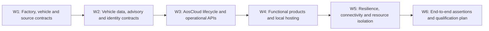

<!-- SPDX-FileCopyrightText: 2026 maninblack -->
<!-- SPDX-License-Identifier: MIT -->

# D4 Interface and Qualification Decision Register

- Status: Review candidate
- Version: 1.0
- Prepared: 2026-08-22
- Previous working baseline: Version 0.9
- Inputs: HLA 1.5, Demo Scenarios 2.0, Architecture Flows 2.0,
  System Requirements 2.0, Component Register 2.0 and the corresponding
  component-package review candidates
- Implementation, signing, Cloud, Unit, VM or CARLA mutation authorized: no

## Purpose

This register is the single navigation and decision-control surface for D4.
It consolidates repeated package-level open gates into one stable decision ID
without moving requirements, interface ownership or tests out of their owning
component packages.

D4 freezes **how an accepted D3 obligation will be proved**: exact schemas,
profiles, API operations, roles, bounds, fixtures, failure semantics,
qualification environments and evidence. It does not silently change the
accepted architecture, component behavior or lifecycle authority.

## How to Read and Update This Register

Each shared question has exactly one `D4-*` ID. The decision summary lives
here; the normative contract, fixture or qualification procedure lives in the
named owning repository or documentation file and is linked from the accepted
decision record.

| State | Meaning |
| --- | --- |
| `OPEN` | Question and owners are known; no reviewed resolution exists |
| `RESEARCHING` | Read-only evidence or an experiment plan is in progress |
| `PROPOSED` | One complete resolution and its impact analysis are ready for review |
| `REVIEW_READY` | Contract, mappings and verification plan are complete enough for a decision |
| `DECIDED` | Owners accepted the resolution and every affected document was updated |
| `BLOCKED` | An identified external prerequisite prevents a truthful decision |
| `DEFERRED` | Explicitly outside the current implementation release; not a hidden blocker |

A decision can become `DECIDED` only when:

1. its exact contract or qualification output has a canonical local link;
2. accountable owners have reviewed the same version;
3. every affected `IF-*`, `REQ-*`, `UT-*` and `AT-*` mapping is updated;
4. normal, boundary, malformed, unavailable and recovery behavior is allocated
   where applicable;
5. secrets, confidential input and external authority are not copied into the
   repository;
6. any Level-B or Level-C change cascade has completed; and
7. the documentation quality gate passes.

## Execution Order



Research inside a later workstream may proceed early, but a decision may not
assume an unresolved upstream contract. Parallel packages shall reference the
same decision ID rather than create local variants.

## W1 — Factory, Vehicle and Source Contracts

| Decision | Question and required output | Primary owners | Main consumers | State |
| --- | --- | --- | --- | --- |
| <a id="d4-001"></a>`D4-001` — Factory artifact acceptance | Freeze reproducibility semantics, required Factory Image contents/manifest, immutable release identity and whether `.11` can qualify unchanged | Platform Team / System Architecture | `CR-FACTORY`, `CR-DEMO`, `CR-E2E` | `DECIDED` |
| <a id="d4-002"></a>`D4-002` — Vehicle hardware capability profile | Freeze the selected CARLA revision/blueprint, installed signals/sensors/actuators, provenance and complete Simulator↔Gateway accounting manifest | Vehicle Simulation + Gateway | `CR-VEHICLE-SIM`, `CR-GATEWAY`, `CR-VDP` | `DECIDED` |
| <a id="d4-003"></a>`D4-003` — Deterministic stimuli and calibration | Freeze Brake obstacle/event stimulus, Tire pre-aged/accelerated stimulus, hidden qualification truth, repeat count and tolerances | Vehicle Simulation + both Function Teams | `CR-VEHICLE-SIM`, `CR-BHS`, `CR-TIRE`, `CR-E2E` | `RESEARCHING` |
| <a id="d4-004"></a>`D4-004` — Drive-mode and scenario context | Freeze scenario/manual/autopilot transitions, obstacle ownership, reverse/reset behavior, mode/context/status VSS paths and discontinuity semantics | Vehicle Simulation + Gateway | `CR-VEHICLE-SIM`, `CR-GATEWAY`, Engineering Dashboard | `DECIDED` |
| <a id="d4-005"></a>`D4-005` — Exclusive VU/PU source handover | Freeze attach, prove exclusive binding, detach, canonical reset/new generation and attach-to-next-role protocol without replay or a second simulated vehicle | Demo Solution + Gateway + Vehicle Simulation | Every VU/PU functional proof | `DECIDED` |
| <a id="d4-028"></a>`D4-028` — Platform FOTA Safe Stop freshness | Distinguish sample freshness at acquisition, stability-history meaning and latest-sample revalidation at destructive runtime gates | Platform Team + Vehicle Gateway + System Acceptance | `CR-FACTORY`, `CR-GATEWAY`, `CR-VDP`, `CR-AOS`, `CR-DEMO`, `CR-E2E` | `DECIDED` |

### D4-001 Decision Record — Factory Artifact Acceptance

- Decision state: `DECIDED`
- Accepted: 2026-08-21
- Owners: Platform Team / System Architecture
- Canonical requirement package:
  [Factory Substrate](components/factory-substrate.md)

The accepted Factory Image contract is:

1. Candidate `.11` remains immutable engineering evidence and the input to an
   incremental successor build; it is not accepted unchanged as the final OEM
   Demo Factory Image.
2. The existing provider-specific empty-slot runtime is the accepted pre-SOP
   runtime model. A generic multi-provider runtime is not required by HLA 1.4
   and is not a reason to rebuild the image.
3. A new versioned Factory Image candidate shall be produced only after
   [`D4-027`](#d4-027) and [`D4-010`](#d4-010) freeze the stock Aos IAM,
   separately packaged compatibility-helper and protected-signing seams that must be
   present before provisioning.
4. The new candidate shall be produced from pinned source and build inputs;
   post-build binary patching is prohibited.
5. Release immutability and build reproducibility are separate proofs:

   - an accepted distributable image is identified by one exact byte size and
     SHA-256 digest and is used only as a read-only backing image for fresh
     overlays;
   - a controlled rebuild from the same source lock shall prove canonical
     equivalence of partition layout, installed-package manifest, immutable
     filesystem content, runtime inventory and security configuration;
   - raw-image byte identity is preferred but not mandatory when every
     difference is restricted to a reviewed allowlist of non-semantic image
     UUID/timestamp fields and is included in the evidence record.

6. One controlled reproducibility rebuild is required after candidate content
   is frozen. It is qualification work, not a presentation-time action and not
   a requirement to rebuild after every source edit.
7. The normative Factory Image manifest shall bind source lock, build graph,
   toolchain/configuration identity, artifact type, exact release digest,
   canonical equivalence evidence, required runtime/security inventory and
   secret/identity-negative results.
8. The actual successor version and digest are implementation/qualification
   outputs. They are not invented by this D4 decision.

Consequences:

- preserve the isolated Yocto builder and incremental caches;
- do not modify, sign, upload, provision from or relabel `.11` as accepted;
- do not start the successor build until `D4-027` and the required `D4-010`
  signer/publication portions are decided;
- that D4 decision prerequisite is now satisfied by D4-027, D4-010.1 and
  D4-010.3, but the decision does not itself authorize the successor build;
- qualify two fresh overlays, clean first boot, distinct identities, empty-slot
  health and unchanged backing-image digest against the successor candidate;
- retain production provider-store selection as deferred `D4-X03` work.

### D4-002 Decision Record — Vehicle Hardware Capability Profile

- Decision state: `DECIDED`
- Accepted: 2026-08-21
- Owners: Vehicle Simulation / Vehicle Gateway
- Canonical contract:
  [profile](../../contracts/vehicle-hardware-profile/vehicle-hardware-capability-profile.v1.json),
  and [schema](../../contracts/vehicle-hardware-profile/vehicle-hardware-capability-profile.schema.json)
- Accepted profile SHA-256:
  `ac0ba26464219482dcb41e56ebbc1538489e13bd6c84725dbc124e59514cb7e5`

The accepted vehicle-hardware contract is:

1. The selected profile is `carla-lincoln-mkz-chaos` version `1.0.0`. It pins
   the checked repository revision
   `ac7d882cac496ccbf8b40aa543d6b38513e1173c`, the runtime compatibility
   revision `385927b6ac5efaaa204b5b9853a7aaa5c5917428`, Unreal Engine 5 Chaos and
   ego blueprint `vehicle.lincoln.mkz`.
2. One digest-addressed JSON profile is the cross-repository source of truth.
   Vehicle Simulation owns the physical installation declaration; Vehicle
   Gateway co-owns the complete mapping/disposition accounting.
3. Every capability is classified by installation, provenance, data shape,
   unit, frame, cadence, availability and Gateway disposition. Installed
   native/derived capabilities are distinct from `NOT_INSTALLED`, native
   unavailable, qualification-only and demo-visualization entries.
4. The installed baseline includes native vehicle dynamics and applied state,
   Chaos wheel telemetry, one 10 Hz GNSS sensor and the physical CARLA control
   capabilities. The scenario collision sensor is qualification-only and the
   chase camera is demo visualization, not a production vehicle signal.
5. IMU, radar, lidar, production cameras, lane-invasion, obstacle-detection and
   V2X/RSS facilities remain explicitly `NOT_INSTALLED`; CARLA's ability to
   spawn them does not imply that the selected virtual vehicle contains them.
6. Brake pressure/temperature/wear and tire pressure/temperature/tread/health
   have no truthful native source in this CARLA profile. A future synthetic
   model must identify its provenance and cannot be presented as native CARLA
   telemetry.
7. Every installed capability must have exactly one Gateway disposition:
   retained native, normalized, explicit unavailable or reviewed unsupported.
   No entry may disappear silently, and missing optional data may not be
   replaced by a plausible zero.
8. Throttle, brake, steering, handbrake, transmission/reverse/manual shift and
   vehicle-light controls are physical capabilities. Capability does not grant
   authority: current UI and mode ownership remain separately constrained, and
   the applied CARLA state is the execution evidence.
9. Scenario, Manual, Autopilot and Safe Stop are control modes, not actuators;
   their transition semantics remain allocated to [`D4-004`](#d4-004).
10. Qualification/world ground truth remains outside VSS/VISS and KUKSA.
    Exact VSS/VISS paths and freshness remain allocated to
    [`D4-006`](#d4-006), and typed advisory return remains allocated to
    [`D4-008`](#d4-008).
11. The static profile describes the expected installation. A qualified
    Gateway startup must reconcile the live source, blueprint, installed
    sensors and complete adapter coverage. Any mismatch invalidates the run;
    it does not mutate the accepted profile or produce a healthy result.

Consequences:

- the manifest contract is accepted, while runtime reconciliation and complete
  target adapter/actuator implementation remain qualification work;
- maps and Brake/Tire stimuli are not part of the hardware profile and remain
  under `D4-003`;
- implementation repositories may retain more native values than a narrower
  service-facing VSS/KUKSA release exposes, but must still account for them;
- changing the installed hardware profile produces a new profile version and
  digest and triggers the affected Simulator, Gateway and VDP contract cascade.

### D4-003 Working Decision Record — Deterministic Stimuli and Calibration

- Decision state: `RESEARCHING`
- Direction reviewed: 2026-08-21
- Owners: Vehicle Simulation / Function Team 1 / Function Team 2
- Canonical working plan:
  [D4-003 stimulus calibration plan](../qualification/d4-003-stimulus-calibration-plan.md)

The reviewed working direction is:

1. All coefficient selection, metric calibration and repeated qualification
   happen before the audience demonstration. A presentation executes only an
   already frozen live stimulus profile.
2. The implemented `stationary-obstacle-braking-v1` and unattended
   `brake_event_town10hd.json` are the Brake calibration input. Its current
   physical thresholds remain the starting contract, while an independent
   series must still freeze and prove the final repeatability envelope.
3. The Brake stimulus supplies a visible physical braking episode and
   qualification facts only. It does not fabricate native pad wear,
   temperature, pressure or health. Brake v2 synthetic assessment remains a
   Function Team 1 product decision under [`D4-016`](#d4-016).
4. The Tire stimulus shall use `preaged-tire-dynamics-v1` with `HEALTHY` and
   `PRE_AGED` profiles. `PRE_AGED` applies one calibrated symmetric relative
   reduction to all four wheels' `friction_force_multiplier`, followed by a
   bounded low-speed deterministic exercise and verified restoration of the
   exact original `VehiclePhysicsControl`.
5. The Tire service sees only native dynamics from the accepted hardware
   profile. Exact condition profile and friction multiplier are hidden
   qualification truth and may not enter Gateway production state, VISS,
   KUKSA, service input, backend payload or audience dashboard.
6. Five strict-reset calibration runs per Brake/Tire profile select and freeze
   the final Tire values, absolute physical bounds and native-feature
   separation margins before independent qualification.
7. Independent qualification then requires 20/20 Brake runs and 10 `HEALTHY`
   plus 10 `PRE_AGED` Tire runs, with no collisions/leaks, valid chronology,
   frozen-bound compliance, successful reset/physics restoration and oracle-
   negative proof.
8. Service algorithm correctness is intentionally separate: Brake model and
   Tire estimator/state/bands remain owned by `D4-016` and `D4-018`.
9. Overall system qualification/presenter modes remain under
   [`D4-026`](#d4-026); they consume, not redefine, these stimulus-specific
   results.

The direction is accepted but the decision is not yet `DECIDED`. Closure
requires a canonical schema, implemented Tire stimulus, frozen post-calibration
values/tolerances, passing independent series and complete oracle-negative
evidence.

### D4-004 Decision Record — Drive Mode and Scenario Context

- Decision state: `DECIDED`
- Accepted: 2026-08-21
- Controller/Gateway handoff refinement accepted: 2026-08-29
- Owners: Vehicle Simulation / Vehicle Gateway
- Canonical contract:
  [Simulator Control and Context Contract 1.1.0](../../contracts/simulator-control-context/simulator-control-context.v1.json)

The accepted contract freezes:

1. the independent drive-mode states `SAFE_STOP`, `SCENARIO`, `MANUAL` and
   `AUTOPILOT`, and world contexts `FREE_DRIVE` and `BRAKE_EVENT`;
2. the complete `AF-X-DRIVE` transition matrix, with the Scenario Controller
   as the sole obstacle owner and the Gateway/controller as the only ego actor
   and synchronous-clock owner;
3. Scenario-to-Manual as an `ABORTED` attempt with the same pose and retained
   obstacle, so operator braking still produces truthful native telemetry;
4. every brake-context-to-Autopilot transition as safe stop, obstacle removal,
   same-actor zero-motion reset to canonical free drive, lane validation and
   only then Traffic Manager activation;
5. every Scenario start/restart as safe stop, canonical obstacle preparation,
   same-actor zero-motion reset, attempt-local evidence clear and new Scenario
   generation;
6. Safe Stop as a control action that never implicitly changes world context,
   deletes an obstacle or claims a reset;
7. project-owned `Vehicle.CarlaSimulation.Control.*`, `World.*`, `Scenario.*`
   and `Reset.*` engineering paths, including requested versus active mode,
   transaction state, monotonic generations and durable reset frame evidence;
8. a reset discontinuity flag on the first complete post-reset snapshot plus
   durable `Reset.Generation` and `Reset.FrameId`, so a missed transient flag
   cannot turn teleportation into apparent physical movement; and
9. reverse as a physical capability declared by D4-002 but not authorized in
   the first-demo Control UI. Recovery uses Scenario restart or the accepted
   Autopilot context reset; Traffic Manager obstacle avoidance is not claimed;
10. one owner-only, Linux-peer-credential-verified `AF_UNIX` `SOCK_DGRAM`
    controller-to-Gateway handoff, with one non-blocking atomic record per real
    completed CARLA frame and no stream, reconnect or replay/history protocol;
11. an exact frame-ID-plus-simulation-time join bounded to four unmatched
    physical and four unmatched control records for 250 ms host-monotonic
    residence. Invalid, duplicate, out-of-order, missing, expired or overflowed
    records make all six control/reset facts absent for that frame, with no
    last-known reuse; this local transport bound is not Runtime Safe Stop
    freshness policy; and
12. no fabricated frame during a blocking reset. A last real pre-reset frame
    may show `PREPARING` and reset in progress at the current generations; the
    first real successful post-reset frame carries incremented reset generation,
    a new control generation where applicable, reset not in progress and the
    one-frame discontinuity, which clears on the next real frame. Failure with
    no completed frame creates no success evidence, and UI operation progress
    remains separate.

The contract is accepted independently of implementation. Current same-actor
Manual/Autopilot handover and Scenario restart are partial evidence; dynamic
obstacle lifecycle, transactional activation and the engineering VSS paths
plus the accepted controller-to-C++ frame handoff must still be implemented
and qualified. Failed cleanup, reset or lane
validation leaves `SAFE_STOP`, reports `FAILED` and never partially activates
the requested mode or newly requested context.

### D4-005 Decision Record — Exclusive Live-Source Assignment

- Decision state: `DECIDED`
- Accepted: 2026-08-21
- Owners: Demo Solution / Vehicle Gateway / Vehicle Simulation
- Canonical contract:
  [Exclusive Live-Source Assignment 1.0.0](../../contracts/exclusive-live-source-assignment/exclusive-live-source-assignment.v1.json)

The accepted contract deliberately separates two views:

1. The audience sees a **Test Vehicle** and a **Production Vehicle**. `Test
   Vehicle` is a Representation Layer alias for the technical **Validation
   Unit** in the **Verification Unit Set**; technical APIs and evidence retain
   `Validation Unit` / `VU`.
   AosCloud technical detail maps those vehicles to the Validation Unit and
   Production Unit Domain Controllers. Exactly one is the `CURRENT VEHICLE`.
   The Production Vehicle means a vehicle already released from manufacturing;
   the demo represents that role with the Production Unit VM.
2. The first-demo implementation uses one live CARLA/Gateway source and the
   host Demo Orchestrator assigns it sequentially and exclusively to those
   Units. This mechanism is demo infrastructure, not in-vehicle behavior or an
   AosCloud vehicle lifecycle operation.

The primary UI uses `Continue with Production Vehicle` and never exposes
`Attach CARLA`, `Detach CARLA`, `Switch VM` or `Source Binding` as audience
actions. Both Units may remain Online in AosCloud; Cloud online state is
independent of which logical vehicle is current. Unit/Node/Unit Set, exact
source identity, assignment state, generation and frame range remain
available through technical details. Logical vehicle role is orchestration
state and shall not enter VSS/KUKSA production data.

The technical sequence is exact:

1. re-read both Unit identities and disjoint Unit Set roles;
2. select and accept only the authenticated Validation Unit peer, prove one
   selected-Unit VISS session and capture its first frame; the separately
   authenticated read-only Engineering Dashboard may remain connected;
3. execute qualification and close the bounded Validation frame range;
4. safe-stop, detach Validation, clear selection and prove no source consumer;
5. execute the D4-004 canonical reset with no Unit attached and prove a new
   Reset Generation;
6. select and accept only the authenticated Production Unit peer, capture
   its first frame and prove the current baseline vehicle works; and
7. promote the identical accepted QM artifact while the Production Vehicle
   is current, then detach it during cleanup/R0.

An unexpected/additional Unit peer, uncertain detach, identity mismatch,
overlapping or non-monotonic frame range, or failed reset selects safe stop and
blocks the next assignment. The exact authenticated VISS peer/trust mechanism
is owned by D4-006. Telemetry replay and a second simulated vehicle remain
explicitly deferred. Implementation and live qualification remain open even
though the assignment and audience contract are decided.

### <a id="d4-028-record"></a>D4-028 Decision Record — Platform FOTA Safe Stop Freshness

- Decision state: `DECIDED`
- Accepted: 2026-08-28
- Owners: Platform Team / Vehicle Gateway / System Acceptance
- Canonical contract:
  [Platform FOTA Safe Stop 1.1.1](../../contracts/platform-fota-safe-stop/platform-fota-safe-stop-profile.v1.json)

The former profile required twelve samples at an expected 50-ms period while
also saying that every sample was at most 250 ms old at the final evaluation.
That literal interpretation is impossible: eleven intervals span about
550 ms. The accepted correction retains all twelve observations and defines
two distinct uses of time.

1. Every complete sample is source-fresh, at most 250 ms old, when admitted to
   the window.
2. The retained twelve-sample sequence proves stability only and is never
   reused as current vehicle state.
3. The latest complete sample is at most 250 ms old when the gate opens and is
   revalidated immediately before every destructive stop, switch, activation
   or removal step.
4. Missing, stale, repeated, contradictory or reset-discontinuous evidence
   remains fail-closed. Loss before destructive apply returns to waiting; loss
   during apply fails and rolls back.

Reducing the window to six samples was rejected because it weakens the
accepted stability proof solely to fit an incorrectly scoped freshness rule.
The correction changes no authority, component ownership, lifecycle direction
or Service SOTA motion policy. Implementation and live qualification remain
open.

## W2 — Vehicle Data, Advisory and Identity Contracts

| Decision | Question and required output | Primary owners | Main consumers | State |
| --- | --- | --- | --- | --- |
| <a id="d4-006"></a>`D4-006` — VISS trust, telemetry and status profile | Freeze private peer authentication, Get/Subscribe/Set subset, types/units, freshness/degraded paths, source-loss and queue/error semantics | Gateway + Platform Team | `CR-GATEWAY`, `CR-VDP`, Engineering Dashboard | `DECIDED` |
| <a id="d4-007"></a>`D4-007` — VDP v1–v3 compatibility contract | Freeze the staged signal subsets, backward compatibility, actual installed capability identity and fail-closed service readiness metadata | Platform Team + both Function Teams | `CR-VDP`, `CR-BHS`, `CR-TIRE`, `CR-AOS` | `DECIDED` |
| <a id="d4-008"></a>`D4-008` — Typed QM advisory contract | Freeze Brake/Tire targets, payloads, status, correlation, freshness, rate, debounce/hysteresis and replay rules through KUKSA→VDP→VISS→Gateway | Gateway + Platform + both Function Teams | `CR-GATEWAY`, `CR-VDP`, `CR-BHS`, `CR-TIRE`, `CR-CROSS` | `DECIDED` |
| <a id="d4-009"></a>`D4-009` — Retired VDP-owned Service credential contract | Historical permission-handler and broker decision superseded by `D4-027`; stable anchor retained | Platform Team + Aos IAM/security owners | Historical trace only | `RETIRED` |
| <a id="d4-010"></a>`D4-010` — Protected signing and publication credentials | Freeze per-Unit signer bootstrap/retirement, PKCS#11 operation and role-specific OEM/SP artifact-publication credential profiles; dynamic Provider authorization is not a first-demo gate | Platform Team + Aos security/API owners + Function Team release owners | `CR-KAC`, `CR-FACTORY`, `CR-DEMO`, both Cloud products, `CR-CROSS` | `DECIDED` for current demo — `D4-010.1` and `D4-010.3` accepted; generic `D4-010.2` target deferred |
| <a id="d4-027"></a>`D4-027` — Current-release KUKSA authorization compatibility contract | Freeze fixed-resource Service bootstrap, IAM lookup, claim derivation, private volatile JWT delivery, renewal/reboot/stop/removal/offline behavior, helper bounds and native-migration deletion seam | Platform Team + Aos IAM/security owners + both Function Teams | `CR-KAC`, `CR-FACTORY`, `CR-AOS`, both services, `CR-CROSS`, `CR-E2E` | `DECIDED` — D4-027.1 through D4-027.8 accepted |

### D4-006 Decision Record — VISS Trust, Telemetry and Status Profile

- Decision state: `DECIDED`
- Accepted: 2026-08-21
- Owners: Vehicle Gateway / Platform Team
- Canonical contract:
  [VISS Trust and Telemetry Profile 1.1.0](../../contracts/viss-trust-telemetry-profile/viss-trust-telemetry-profile.v1.json)
- Accepted contract SHA-256:
  `4a1a2bd804c3a49f707b5e640632bd8a0357901f59e4615c340622b043d4c12c`

The accepted contract freezes:

1. The private in-vehicle boundary uses VISS 3.1 over `wss`, TLS 1.2 or later,
   server verification and mutual TLS. Plain WebSocket and unauthenticated
   clients are rejected.
2. Four authenticated peer roles exist: one selected Platform Unit, its
   purpose-bound read-only Platform Update Runtime, a permanently read-only
   Engineering Telematics Dashboard and a read-only qualification client. The
   two selected-Unit roles use distinct credentials and permit one connection
   each; the independent Engineering Dashboard may remain connected.
3. Both selected-Unit roles are bound by exact Unit ID, Node ID,
   client-certificate fingerprint and assignment generation. A non-selected,
   additional, expired, revoked, unknown or mismatched Unit peer is rejected
   even when that Unit remains Online in AosCloud. The runtime role receives
   only the ten Safe Stop paths and no advisory or general VDP authority.
4. Each provisioned Unit has a unique client identity created only after its
   Cloud Unit/Node identity is known. Its private key is absent from the
   Factory Image, FOTA components, Git, logs and dashboards, is stored as a
   protected root-owned VM credential and is delivered with systemd
   `LoadCredential`. R0 retires it. Non-exportable TPM/PKCS#11 client keys are
   future hardening, not a first-demo claim.
5. The current provider cadence remains 50 ms, source freshness is 250 ms and
   reconnect backoff is bounded from 500 ms to 10 s. Client subscriptions,
   message size and pending-event queues are bounded; overflow is visible and
   never blocks CARLA frame processing.
6. Process health and vehicle-data readiness are different facts. Source
   states are `STARTING`, `AUTHENTICATING`, `LIVE`, `STALE`, `DISCONNECTED`,
   `AUTHENTICATION_FAILED` and `CONTRACT_MISMATCH`. Disconnect or stale input
   atomically becomes KUKSA `NotAvailable`; recovery requires a complete valid
   snapshot with matching contract, source and generation and a monotonic
   frame.
7. One machine-readable profile accounts for the complete D4-002 Gateway
   engineering superset and the entire D4-004 control/context projection. Each
   physical capability is either mapped to exact typed paths or explicitly
   excluded. D4-007 may select only staged subsets of this superset.
8. `Get`, `Subscribe` and `Unsubscribe` are accepted. Every `Set` remains
   rejected without side effects until D4-008 freezes the typed QM advisory
   contract; the Engineering Dashboard and qualification client remain
   permanently read-only.

Consequences:

- the previous server-only TLS and eight-generic-client baseline is evidence,
  not the accepted trust design;
- Gateway, provider, Unit onboarding/R0 and Dashboard implementations must be
  aligned and qualified against the same contract;
- the current CARLA runtime's native wheel angular speed in `rad/s` must be
  converted to the canonical VSS 6.0 `degrees/s` before that standard path is
  marked implemented;
- D4-007 owns staged KUKSA/VDP subsets, while D4-008 alone may introduce exact
  typed `Set` targets;
- accepting this contract does not claim that mTLS, the selected-Unit gate,
  complete target paths or live qualification are already implemented.

### D4-007 Decision Record — VDP v1-v3 Compatibility Contract

- Decision state: `DECIDED`
- Accepted: 2026-08-21
- Owners: Platform Team / Function Team 1 / Function Team 2
- Canonical contract:
  [VDP Compatibility Profile 1.0.1](../../contracts/vdp-compatibility-profile/vdp-compatibility-profile.v1.json)
- Accepted contract SHA-256:
  `8e58e18e9d99a13409af6813e573cbe1c690e439ad746224426801f6b080c871`

The accepted compatibility contract freezes:

1. VDP v1 publishes the seven-path base-dynamics set: vehicle speed, three
   acceleration axes, accelerator/brake pedal position and Row 1 steering
   angle.
2. VDP v2 is a strict additive superset. It preserves all v1 paths and adds
   four standard wheel-speed plus four standard wheel-angular-speed paths.
3. VDP v3 is a strict additive superset. It preserves v1/v2, adds four
   longitudinal-slip plus four lateral-slip-angle paths and declares the Brake
   and Tire outbound-advisory capability families. `D4-008`, not this
   decision, owns their exact targets and payloads.
4. Brake Health v1 is compatible with VDP v1-v3, Brake Health v2 with v2-v3,
   Brake Health v3 only with v3, and Tire Health v1.0 only with v3. Exact
   model-consumed subsets remain owned by `D4-016` and `D4-018`.
5. Every installed VDP identity carries component/artifact/metadata identity,
   VDP contract identity and digest, hardware/VISS profile digests and a
   capability-manifest digest. Missing, malformed, unknown-future or
   semantically changed identity fails closed.
6. Process health is separate from functional readiness. Readiness evaluates
   `INBOUND_DATA`, `SERVICE_ACCESS` and, where required,
   `OUTBOUND_ADVISORY`; an incompatible service remains process-healthy but
   `NOT_READY`, produces no functional result or advisory and never enters a
   crash/restart loop.
7. A component-identity, capability, source or access change triggers
   re-evaluation. Installing VDP v3 after Tire Health was installed against
   v1/v2 lets the same service instance become `READY` automatically after a
   complete valid contract/data check; no SOTA reinstall is required.
8. When backend connectivity exists, Tire Health reports a structured
   incompatibility status. Its Function Dashboard shows required and actual
   VDP versions, missing capability/path facts and an explicit handoff to the
   Platform Team. Source stale/disconnected and access-denied cases use
   different reasons and are not mislabeled as a platform-version request.
9. Current runtime defense and dashboard guidance are not native AosCloud
   admission. The dashboard neither mutates lifecycle state nor implements a
   local admission proxy. Native pre-transfer rejection remains deferred in
   `D4-X01`.

Consequences:

- the three staged KUKSA publication sets and compatibility graph are no
  longer open design questions;
- implementation must expose the accepted installed-identity and readiness
  reasons and prove automatic blocked-to-ready recovery;
- D4-016/D4-018 still freeze model input subsets, while D4-008 freezes exact
  advisory targets and D4-027 freezes Service access credentials;
- an incompatible SOTA may still be installed by the current platform, but it
  cannot truthfully become functionally ready or emit a successful result.

### D4-008 Decision Record — Typed QM Advisory Contract

- Decision state: `DECIDED`
- Accepted: 2026-08-21
- Owners: Vehicle Gateway / Platform Team / Function Team 1 / Function Team 2
- Canonical contract:
  [Typed QM Advisory Profile 1.0.2](../../contracts/qm-advisory-profile/qm-advisory-profile.v1.json)
- Profile SHA-256:
  `f7ae78148fb3b3265c8b773117126665afb1edd97a73f59db5a1f3af7c223487`
- Request-schema SHA-256:
  `f2102fd948734a714160efb8ee09885107d58da1daabd95771dce56785149910`
- Status-schema SHA-256:
  `1e0ecb28cc7548c65f1352b4c8b5874871400b8a83050a1b527c5f58f8493661`

The accepted advisory contract freezes:

Profile `1.0.2` is a metadata-only repin to VDP Compatibility Profile 1.0.1.
Profile `1.0.1` replaced the retired `D4-009` authorization reference with
`D4-027`. Neither revision changed an advisory path, schema, payload,
authority, timing or replay semantic from `1.0.0`.

1. Exactly two OEM-overlay actuator paths exist:
   `Vehicle.OEM.BrakeHealth.Advisory.Request` for Brake Health v3 and
   `Vehicle.OEM.TireHealth.Advisory.Request` for Tire Health v1.0. Each has a
   separate read-only `GatewayStatus` sensor path.
2. One canonical RFC 8785 UTF-8 JSON object is carried in one VSS `string`
   leaf, limited to 2048 request bytes and 1024 status bytes. It is a strict
   schema-bound typed envelope, not arbitrary display text. This preserves
   one-leaf atomicity with the current primitive `kuksa.val.v1` API without
   modifying Eclipse KUKSA.
3. Request identity is `requestId` plus persistent `producerEpoch` and
   monotonic `sequence`. `SET` carries only endpoint-allowed recommendation
   and reason enums; `CLEAR` is a new explicit request with
   `CONDITION_CLEARED`, never an implicit `NONE` overwrite.
4. KUKSA write success proves only broker acceptance and VISS Set success
   proves only protocol handling. Only matching Gateway Status `APPLIED` or
   `CLEARED` is authoritative application evidence.
5. Gateway states are `RECEIVED`, `APPLIED`, `CLEARED`, `REJECTED`, `EXPIRED`
   and `FAILED`; reason enums distinguish source/path authority, schema/value,
   stale, replay, sequence rollback, rate, QM policy and internal failure.
6. Gateway acceptance age is at most 2000 ms; the advisory lease is at most
   30000 ms; refresh is no faster than 10000 ms and state-changing requests no
   faster than 1000 ms per endpoint. Replay evidence is retained for at least
   300000 ms and 256 identities per endpoint.
7. Identical duplicates are idempotent, conflicting duplicates and sequence
   rollback are rejected, expired retained targets are not replayed after a
   restart, and lease expiry automatically clears the engineering advisory.
8. Brake and Tire services may write only their own Request target and read
   their own status. They cannot cross-write, send arbitrary VSS paths, issue
   free-form driver text or obtain motion/safety authority. VDP validates in
   depth and the Gateway independently remains the final deny-by-default
   authority.
9. The complete local chain remains operational when the Unit loses external
   connectivity. AosCloud and functional backends are not part of advisory
   decision or delivery; backend synchronization after reconnect remains in
   D4-017/D4-019.
10. D4-016/D4-018 still own model thresholds and decision hysteresis; D4-027
    still owns exact IAM/KUKSA credential issue and refresh. Production driver
    HMI and functional-safety claims remain out of scope.

Consequences:

- the exact advisory paths, envelope/status schemas and common transport
  protection are no longer open design questions;
- implementation must keep current deny-all Set behavior until both endpoints
  and the complete positive/negative contract matrix are implemented;
- the existing Engineering Dashboard stays read-only and may display only
  factual Request/Gateway Status state;
- VSS struct wire encoding may replace the string envelope only after the
  selected KUKSA/VISS implementations prove atomic end-to-end support without
  changing the semantic contract.

### D4-009 Retired Decision Record — VDP-Owned Service Credential Contract

- Decision state: `RETIRED`; superseded by [`D4-027`](#d4-027)
- Accepted: 2026-08-21
- Owners: Platform Team / Aos IAM and security owners
- Authoritative clarification: Platform Team response reported by the demo
  owner on 2026-08-21

Read-only inspection of the pinned AosVM 6.1.0 / meta-aos 9.1.0 sources and
the provisioned Units established the baseline facts: the current AosVM IAM
configuration does not contain `enablePermissionsHandler`; provisioning and
normal IAM use the same `/etc/aos/iam.cfg`; and provisioning does not rewrite
that file or toggle the option. The Platform Team then clarified the intended
contract: the permission handler shall be explicitly enabled in the IAM
configuration and its enabled state is independent of whether the Unit is
provisioned.

The historical decision was:

1. the next OEM Demo Factory Image shall be built with the single shared
   `/etc/aos/iam.cfg` containing `enablePermissionsHandler: true`;
2. provisioning shall not generate, rewrite or select a second IAM
   configuration and no project-owned lifecycle switch shall be added;
3. enabling the handler does not bake a service identity, permission record,
   `AOS_SECRET` or reusable credential into the image: Service Manager and
   Aos IAM still create and register that state for each running SOTA service
   instance;
4. the VDP Credential Broker shall authenticate only by calling
   `GetPermissions(secret, "kuksa")`, map only the currently registered valid
   `r`, `w` or `rw` paths into a short-lived KUKSA JWT, and keep no parallel
   identity, allowlist or service-secret store;
5. invalid or stale secrets, unknown modes, malformed paths, permissions
   outside the installed VDP contract, IAM unavailability and removed service
   permissions shall fail closed and shall not produce or renew a token; and
6. image qualification shall prove the option is explicitly true in the
   effective configuration used by both IAM modes, prove that no service
   permission or secret is pre-populated in the unprovisioned image, and prove
   positive and negative `RegisterInstance`/`GetPermissions` behavior through
   the stock Service Manager/IAM lifecycle.

Current disposition:

- items 1–3 and the image-qualification part of item 6 remain valid inputs to
  `D4-027` and `CR-FACTORY`;
- items 4–5 are superseded because Service authorization is no longer owned by
  VDP and callers no longer select paths or modes;
- the helper now belongs to separately packaged `CMP-KAC`, accepts only the
  instance credential plus fixed `kuksa` resource, and derives all JWT claims
  from the current IAM result; and
- no implementation may cite this retired record as authority for a broker
  inside VDP.

Historical consequences were:

- the earlier two-configuration, provisioning-state-selected recommendation
  is withdrawn;
- the current `.1`, `.2` and `.11` evidence remains useful but none of those
  images is the accepted Factory Image while its effective configuration
  leaves the permission handler disabled;
- the correction belongs to the pre-SOP OEM Factory Baseline Assembly and
  therefore requires the planned successor VM-image build; it is not a demo
  provisioning step and is not delivered as the initial post-SOP FOTA; and
- D4-010.1 owns the accepted per-Unit signing-key lifecycle; D4-010.3 owns the
  separate role-bound artifact-publication credentials. Dynamic Provider
  authorization is not a first-demo gate.

### D4-010.1 Decision Record — Per-Unit KUKSA Signer and Verifier

- Decision state: `DECIDED`
- Accepted: 2026-08-21
- Owners: Platform Team / Aos IAM and security owners
- Parent decision: `D4-010` is closed for the current demo by this record and
  D4-010.3. The generic native workload-token model is future-platform work,
  not a first-demo Provider gate.

The accepted first-demo signing lifecycle is:

1. the OEM Demo Factory Image contains the dedicated non-secret
   `kuksa-jwt` certificate-module, PKCS#11 token/PIN references, public-key
   preparation service and systemd ordering, but contains no private signing
   key, reusable JWT, shared static verifier or file-key fallback;
2. successful provisioning creates one unique RSA key pair for the Unit in
   the dedicated PKCS#11 token through the Aos self-signed certificate-module
   lifecycle. The private key is non-exportable to `CMP-KAC` and is never
   copied into Git, logs, the Factory Image or any FOTA/SOTA artifact;
3. after provisioning, a Platform-owned preparation service exports only the
   public key and atomically installs the root-owned KUKSA verifier. KUKSA and
   `CMP-KAC` start only after this preparation succeeds and fail
   closed when the key, verifier or protected signing operation is missing or
   malformed;
4. `CMP-KAC` signs bounded short-lived `RS256` JWTs by invoking
   the PKCS#11 operation directly. The pinned unmodified KUKSA loads one public
   key at process start and enforces signature, fixed audience `kuksa.val`,
   expiry and path permissions. Its current implementation does not enforce
   the JWT `iss` claim; `iss` is therefore informational/audit metadata, not a
   security boundary;
5. the first demo performs no live signing-key rotation. One key is valid for
   one Unit provisioning lifecycle; permission removal prevents token renewal,
   and the next fresh provisioning lifecycle creates a new key and verifier;
6. deprovisioning stops `CMP-KAC` and KUKSA and prevents further issuance,
   but the current asynchronous deprovision operation is not claimed to erase
   PKCS#11 material. R0 destroys the retired key by discarding the provisioned
   VM overlay after Cloud reconciliation; and
7. Validation and Production Units shall expose different public-key
   fingerprints, and a token signed by either Unit shall be rejected by the
   other Unit's KUKSA instance.

Consequences:

- upstream KUKSA remains unchanged; JWKS, multiple simultaneous verifiers,
  hot reload and live key rotation are explicitly outside the first demo;
- short token lifetime and permission revalidation limit authorization
  lifetime, but do not replace final overlay destruction at R0;
- the current baked `/etc/kuksa-val/jwt.key.pub` pattern is qualification
  history and shall be removed from the successor Factory Image; and
- accepting D4-010.1 does not add dynamic Provider IAM/JWT; the separate
  OEM/Service Provider credentials used to sign and publish artifacts are
  selected by D4-010.3.

### D4-010.2 Deferred Target Input — Generic Workload Token Security Model

The technology-neutral security model is accepted in
[ADR 0012: Authorize Running Workloads, Not Software Artifacts](../architecture/decisions/0012-authorize-running-workloads-not-software-artifacts.md).
It is a binding input to D4-010.2, but it does not yet close that AosEdge
mapping decision.

The accepted principles are:

1. artifact, device, running-workload and authorization identities are
   separate facts;
2. tokens are issued only to an active runtime-established workload instance,
   never to a passive component artifact;
3. the Platform Workload Credential Service and protected signer are outside
   the workload they authorize;
4. effective scope is a deny-by-default intersection of requested,
   OEM-approved, active-contract, workload-type and current-lifecycle
   authority;
5. short-lived local credentials preserve offline vehicle operation and stop
   renewing on stop, update, recovery, removal or lost authorization; and
6. libraries inherit their host process identity, while components needing
   independent authority require their own process/container/VM boundary.

D4-010.2 remains a deferred target until a released AosEdge mapping identifies the supported
non-SOTA/FOTA workload identity lifecycle, authoritative active-component
facts, Platform Credential Service placement, principals, scopes and native
migration contract. The first demo treats the VDP Provider as trusted OEM
platform integration and does not claim this generic target is implemented.
No implementation may treat a component digest alone, a fixed Unix account or
a caller-provided permission document as sufficient workload authentication.

### D4-010.3 Decision Record — Artifact Signing and Publication Credential Profiles

- Decision state: `DECIDED`
- Accepted: 2026-08-22
- Owners: Platform Team / Function Team 1 / Function Team 2 / Demo Solution
- Canonical contract:
  [Artifact Publication Credential Profile 1.0.0](../../contracts/artifact-publication-profile/artifact-publication-profile.v1.json)
- Accepted contract SHA-256:
  `52bafd7b1249ec8bc10265e913265cdc7c2975f5f56db7ff3cd5cdbad4001c39`

The accepted current-demo publication contract is:

1. exactly three non-interchangeable profiles exist: `platform-oem` may sign
   and publish only the prepared VDP Component v1-v3 FOTA candidates;
   `brake-sp1` may sign and publish only Brake Health Service v1-v3 SOTA
   candidates; and `tire-sp2` may sign and publish only Tire Health Service
   v1.0;
2. one common native-helper implementation may serve all three products, but
   each authenticated dashboard surface is pre-bound to exactly one profile.
   No request may select a profile, credential path, arbitrary candidate path
   or Cloud URL;
3. the installed `aos-signer` 2.0.1/schema-2 baseline uses the same
   passwordless PKCS#12 per profile for bundle signing and mTLS upload, loads
   private-key material into its native process and does not provide a native
   macOS Keychain or PKCS#11 signing operation. Documentation shall not label
   this current path Keychain-backed or non-exportable;
4. the three PKCS#12 files are local demo prerequisites under
   `~/.aos/security`, mode `0600`, outside Git, every dashboard/container/VM
   image and every FOTA/SOTA artifact. Only the session-scoped non-root native
   helper may read the fixed allowlisted paths;
5. presentation-time work starts with digest verification of an already-built,
   tested, packaged and metadata-frozen catalogue candidate. No source edit,
   build, package generation, metadata mutation or repackaging is allowed;
6. the operation states are `PREPARED`, `SIGNING`, `SIGNED`, `PUBLISHING`,
   `PUBLISHED`, `FAILED` and `UNCERTAIN`. `PUBLISHED` requires an independent
   authoritative AosCloud re-read; a lost/ambiguous result becomes
   `UNCERTAIN` and is reconciled without blind upload retry;
7. technical publication never grants OEM Unit-deployment authority. A
   matching Service Provider publishes SOTA, the Platform Team OEM profile
   publishes FOTA, each producer team separately accepts its exact Validation
   result, and independent OEM Release Authority uses an authorized OEM
   identity to approve Test deployment or Production rollout. Passing evidence
   never auto-authorizes;
8. diagnostics may expose correlation/profile/candidate identifiers, exact
   prepared/signed digests, Cloud object identity, state and a bounded error
   code. They must not expose private-key, PKCS#12, certificate, credential
   path, session-secret, request-header or raw-tool-output content; and
9. Keychain/PKCS#11-backed non-exportable artifact signing is a later
   hardening migration behind the same dashboard-to-helper contract, after a
   qualified Aos signing client supports it. It is not a first-demo claim.

Consequences:

- the Platform, Brake and Tire publication identities remain distinct even
  though one helper implementation is reused;
- a wrong-profile, missing credential, changed digest or unsupported item type
  fails before signing and produces no publication-success state;
- OEM approval remains outside every Function Dashboard and outside the
  publication helper; and
- D4-010 is closed for the current demo. Deferred D4-010.2 does not block
  implementation because the first demo trusts the OEM Platform Team VDP
  Provider and makes no generic native-workload authorization claim.

### D4-027 Working Record — Current-Release KUKSA Authorization Compatibility

- Decision state: `DECIDED — D4-027.1 THROUGH D4-027.8 ACCEPTED`
- Owners: Platform Team / Aos IAM and security owners / both Function Teams
- Architecture authority: [ADR 0013](../architecture/decisions/0013-current-release-kuksa-authorization-compatibility.md)
- Requirement package: [`CR-KAC`](components/kuksa-authorization-compatibility.md)

Already accepted:

1. the shared IAM configuration contains `enablePermissionsHandler: true`
   independently of provisioning state;
2. `CMP-KAC` is a separately packaged removable Platform Team helper in the
   Factory Image, outside VDP and both SOTA products;
3. Service bootstrap carries only the active instance `AOS_SECRET` plus fixed
   resource `kuksa`; paths, modes, subject, audience, TTL and claims are not
   caller-selected;
4. every issue/renew action uses current Aos IAM `GetPermissions`; the helper
   has no parallel identity, permission or allowlist database;
5. the helper derives the pinned short-lived JWT itself, delivers it only via
   a Service-private volatile location and is absent from the subsequent
   Service-to-KUKSA data path;
6. reboot reconstructs authority from active Aos state; Service stop,
   unregistration or removal deletes private state and prevents renewal;
7. loss of vehicle external connectivity does not add a Cloud dependency to
   local authorization; and
8. the VDP Provider is trusted OEM platform integration and receives no
   authority from this Service credential path; and
9. `CMP-KAC` is the separately installable `aos-kuksa-auth-compat` factory
   package and `aos-kuksa-auth-compat.service`, runs as dedicated unprivileged
   `aos-kac:aos-kac`, and has no lifecycle dependency on VDP.
10. KUKSA-enabled Services reach `CMP-KAC` only through one platform-owned
    named resource and a private Unix-domain socket; a Service bootstrap keeps
    `AOS_SECRET` out of the analytics process and atomically maintains the JWT
    in a Service-private volatile tmpfs location.
11. the local exchange uses the strict versioned
    `aos-kuksa-auth-compat/v1` one-request/one-response JSON protocol; only
    `status` and `issue` operations exist, resource `kuksa` is implicit,
    responses use fixed status/error enums and all caller-selected authority is
    rejected.
12. IAM mode `r` maps to KUKSA `read:<exact-path>` and `rw` maps to
    `actuate:<exact-path>`; IAM `w`, unknown modes, wildcards and any request
    requiring partial permission trimming reject the complete issuance.
    Functional Service JWTs never receive KUKSA `provide` or `create`.
13. each JWT has a 300-second lifetime, renewal starts 180 seconds after issue
    and therefore reserves 120 seconds for bounded retry. Renewal repeats the
    IAM lookup, atomically replaces the private token and requires the Service
    to reconnect and recreate KUKSA subscriptions. Terminal denial deletes the
    token and disconnects immediately; transient failure may retain the current
    token only until signed expiry. No instant-revocation claim is made and
    Cloud connectivity is not part of renewal.
14. each provisioned Unit owns one protected `kuksa-jwt` RSA key pair. The
    private key never leaves PKCS#11. A post-provision preparation service
    verifies the protected signing path, atomically publishes only the public
    verifier in `/run`, and gates both KUKSA and `CMP-KAC`. Missing or malformed
    verifier state blocks startup rather than allowing authorization-disabled
    KUKSA. Reboot reconstructs the volatile verifier, Unit fingerprints differ,
    live rotation is outside the first demo, and R0 retires the key with the
    provisioned overlay.
15. the temporary helper requires one successful `systemd-timesyncd` NTP
    synchronization and 10 stable seconds per boot. UTC claims use
    `CLOCK_REALTIME`; scheduling uses `CLOCK_BOOTTIME`. Before every issue or
    renewal it rejects more than five seconds of elapsed-clock deviation as
    `TIME_UNTRUSTED`. It adds no anchor, continuous monitor or KUKSA lifecycle
    controller; an already issued token can remain usable only until signed
    expiry. Normal external-connectivity loss does not revoke trust, recovery
    requires synchronized time plus a new stable window, and cold offline boot
    leaves authorization `NOT_READY` without blocking unrelated AosCore work.
16. strict operational bounds cap frames, authority/JWT size, concurrency,
    backlog, per-peer/global rate, dependency and whole-request time, retry
    cadence and process resources. Excess input fails without trimming;
    transient retries use 1/2/4/8/16/30-second backoff with ±20% jitter and
    never cross JWT expiry. The helper has only `AF_UNIX` plus the narrow
    `AF_INET` client exception required by the released Aos IAM public gRPC
    endpoint: fixed TLS loopback `127.0.0.1:8090`, Aos CA trust and expected
    server name `main`, with no DNS, caller-selected endpoint, external IP or
    TCP listener. It retains 32-task and 128-descriptor envelopes, applies no
    unmeasured CPU/RAM ceiling to the temporary platform helper, and emits
    only fixed redacted diagnostics. Brake and Tire SOTA instances remain the
    only quota-controlled tenants.

### <a id="d4-027-1"></a>D4-027.1 Decision Record — Helper Package, Process and Startup Boundary

- Decision state: `DECIDED`
- Accepted: 2026-08-22
- Current-release simplification accepted: 2026-08-28
- Owners: Platform Team / Aos IAM and security owners

The accepted current-release deployment boundary is:

1. source belongs in the existing `aos-vehicle-platform` repository under the
   planned `authorization/aos-kuksa-compat/` boundary; Yocto integration uses
   a separate `aos-kuksa-auth-compat` recipe/package rather than adding files
   to the VDP component recipe;
2. the package owns `aos-kuksa-auth-compat.service`, its executable,
   dedicated system user/group declaration, non-secret configuration,
   systemd hardening, SELinux policy and runtime-directory declaration. It
   contains no `AOS_SECRET`, JWT, Service permission record, private key,
   shared verifier or functional data;
3. the process runs as dedicated `aos-kac:aos-kac`, with no root fallback,
   ambient capability or public listener. Access to the released local Aos IAM
   public gRPC endpoint is fixed to TLS loopback `127.0.0.1:8090`, trusted by
   the Aos CA with expected server name `main`; DNS, caller configuration and
   external IP destinations are forbidden. Access to that client endpoint and
   the protected signer shall be granted narrowly to this identity;
   inability to do so on the pinned release blocks implementation and reopens
   this decision rather than silently broadening privilege;
4. the unit is inactive in an unprovisioned Factory Image and uses the same
   existing provisioning-state boundary as `aos-iam.service`. After
   provisioning it requires and starts after `aos-iam.service` and the
   successful D4-027 signer/verifier-preparation gate. It starts with empty
   volatile state;
5. `aos-kuksa-auth-compat.service` neither requires nor orders the VDP. It is
   also not inserted as a global hard dependency of `aos-sm.service`: a KUKSA
   authorization failure must not prevent Aos from managing unrelated
   Services. A KUKSA-consuming Service may run as a process but remains
   functionally `NOT_READY` and uses only bounded retry until its private
   credential is prepared;
6. the helper is not a proxy and does not require
   `kuksa-databroker.service` to issue a credential. Unmodified KUKSA and the
   helper independently require successful public-verifier preparation; direct
   Service-to-KUKSA connectivity begins only after both are ready; and
7. the package boundary is independently removable. Migration to a released
   native AosCore credential contract deletes this package, unit and
   compatibility wiring without changing the VDP FOTA payload or either SOTA
   analytics implementation.

Read-only source inspection confirmed the pinned platform unit names
`aos-iam.service`, `aos-sm.service` and `kuksa-databroker.service`. No helper or
public-verifier-preparation unit exists in the current repository; their source
and recipe are therefore new implementation work, not renamed current units.
The exact wire schema, signer-preparation integration, trustworthy-time
behavior, sandbox and operational bounds are accepted in D4-027.3 through
D4-027.8. D4-027 has no remaining subdecision.

### <a id="d4-027-2"></a>D4-027.2 Decision Record — Local Transport and Private Credential Delivery

- Decision state: `DECIDED`
- Accepted: 2026-08-22
- Native-IAM transport correction accepted: 2026-08-28
- CPU/RAM envelope correction accepted: 2026-08-28
- Owners: Platform Team / Aos IAM and security owners / both Function Teams

The accepted current-release local transport and credential-delivery boundary
is:

1. the host helper exposes only the Unix-domain socket
   `/run/aos-kuksa-auth-compat/request.sock`; it exposes no TCP listener,
   public port or host-wide token directory;
2. a platform-owned Aos named resource `kuksa-auth-client` grants only an
   approved KUKSA-enabled Service instance a read-only bind mount of the socket
   directory at `/run/aosedge/platform/kuksa-auth`, supplementary membership
   in `aos-kuksa-clients`, and a container-private tmpfs at
   `/run/aosedge/secrets/kuksa`. The Service cannot select the host source,
   container destination, group, mount options or fixed KUKSA resource;
3. the host socket directory and container mount point may exist before the
   helper becomes ready. The socket is owned by `aos-kac:aos-kuksa-clients`
   and mode `0660`; the private credential directory is mode `0700` and its
   tmpfs is mounted `nosuid,nodev,noexec`;
4. the Service compatibility bootstrap, not the analytics application, reads
   the current instance `AOS_SECRET`, connects to `request.sock` and requests
   the one implicit fixed resource `kuksa`. It shall not send caller identity,
   paths, modes, claims, audience, TTL or signing input and shall execute the
   main application without `AOS_SECRET` in that application's environment;
5. native Aos IAM `GetPermissions` using the presented `AOS_SECRET` remains the
   authoritative identity and permission decision. Named-resource allocation,
   Unix group access and kernel peer credentials are defense in depth only and
   shall not replace or broaden that IAM decision;
6. on success, the bootstrap writes the returned JWT atomically to
   `/run/aosedge/secrets/kuksa/token.jwt` with mode `0400` and exposes only the
   fixed `KUKSA_TOKEN_FILE` path to the analytics process. Rejection creates no
   token file. No other Service instance may read the socket response, tmpfs or
   token file; and
7. the bootstrap remains the Service-local compatibility owner for renewal.
   Service stop, container replacement, removal, VM reboot or R0 overlay
   disposal destroys the private tmpfs and token; restart obtains a new token
   from current active Aos state rather than recovering a persisted credential.

This decision froze placement and isolation. D4-027.3 subsequently froze the
wire schema, D4-027.4 the JWT mapping, D4-027.5 the lifetime/renewal timing and
D4-027.6 the signer/verifier preparation. Trustworthy time and resource/rate
bounds remain open.

### <a id="d4-027-3"></a>D4-027.3 Decision Record — Local Request, Response and Readiness Protocol

- Decision state: `DECIDED`
- Accepted: 2026-08-22
- Owners: Platform Team / both Function Teams
- Machine-readable contract:
  [`kuksa-auth-compat.v1.json`](../../contracts/kuksa-current-demo-authorization/kuksa-auth-compat.v1.json)

The accepted current-release exchange protocol is:

1. protocol identifier `aos-kuksa-auth-compat/v1`; one Unix stream connection
   carries exactly one UTF-8 JSON object terminated by LF, one response object
   terminated by LF, and then server close;
2. the only request operations are `status` and `issue`. `status` contains no
   credential. `issue` contains only `protocol`, `operation` and opaque
   `aosSecret`; renewal repeats `issue` rather than using a distinct operation;
3. resource `kuksa` is implicit in this endpoint. Identity, Unit/instance ID,
   paths, modes, subject, audience, TTL, claims, signing input and caller
   correlation ID are not request fields. Unknown fields, duplicate object
   members, trailing objects and invalid UTF-8 are rejected;
4. a technically ready `status` exchange returns `status: ready`. This means
   only that local IAM/signer/verifier/time prerequisites are ready; it does
   not assert that any Service is authorized;
5. successful `issue` returns `status: issued`, a KAC-generated
   `correlationId`, `token`, `expiresAtUnixSeconds` and
   `renewAfterUnixSeconds`. The latter is earlier than expiry. The bootstrap
   writes the token using the already accepted D4-027.2 private-tmpfs contract;
6. every unsuccessful syntactically valid exchange returns `status: rejected`,
   a KAC-generated `correlationId`, fixed `code` and Boolean `retryable`. The
   complete code set is `INVALID_REQUEST`, `DENIED`, `POLICY_UNSUPPORTED`,
   `IAM_UNAVAILABLE`, `SIGNER_UNAVAILABLE`, `TIME_UNTRUSTED`, `BUSY` and
   `INTERNAL_ERROR`;
7. `DENIED` intentionally combines invalid/stale/inactive identity and absent
   authority. No response contains identity, permission paths/modes or free
   human-readable diagnostics. `AOS_SECRET`, JWT, private key and permission
   content never enter logs; server-generated `correlationId` is the only
   response-to-redacted-diagnostic join key; and
8. exact frame-size, connection/rate/concurrency limits and retry schedule are
   supplied by D4-027.8. D4-027.5 supplies the JWT timing values without
   changing this accepted schema.

Schema conformance alone does not authorize issuance: IAM result mapping,
pinned JWT claims, the accepted signer context and the D4-027.7 time gate
remain mandatory independent gates.

### <a id="d4-027-4"></a>D4-027.4 Decision Record — IAM Permission to KUKSA Claim Mapping

- Decision state: `DECIDED`
- Accepted: 2026-08-22
- Owners: Platform Team / both Function Teams
- Machine-readable contract:
  [`kuksa-auth-compat.v1.json`](../../contracts/kuksa-current-demo-authorization/kuksa-auth-compat.v1.json)

The accepted mapping is:

1. `CMP-KAC` calls `GetPermissions(AOS_SECRET, "kuksa")` and derives identity
   only from the returned Aos `InstanceIdent`; caller identity remains absent;
2. the pinned Service JWT uses `RS256`, fixed issuer
   `aosedge-kuksa-auth-compat`, fixed audience array containing only
   `kuksa.val`, required `sub`, `iss`, `aud`, `iat`, `exp` and `scope` claims,
   and a space-separated scope string;
3. IAM mode `r` on an exact VSS path maps to `read:<path>`;
4. IAM mode `rw` maps to `actuate:<path>` because pinned KUKSA `actuate`
   already includes read permission for the same path;
5. IAM mode `w` is unsupported because mapping it to `actuate` would silently
   add read permission. `w`, unknown modes, malformed paths, wildcards and
   empty or broadened authority therefore return `POLICY_UNSUPPORTED` without
   a token;
6. one unsupported entry rejects the complete issuance. The helper does not
   trim, rewrite or partially issue a reduced permission set; and
7. Service JWTs permit only `read` and `actuate`. `provide` and `create` remain
   outside this path and cannot be obtained by either functional Service.

This is a deterministic translation of current IAM authority, not a parallel
Service allowlist. First-demo Service metadata shall request exact leaf paths
and only `r` or `rw` modes.

### <a id="d4-027-5"></a>D4-027.5 Decision Record — JWT Lifetime and Renewal Boundary

- Decision state: `DECIDED`
- Accepted: 2026-08-22
- Owners: Platform Team / both Function Teams
- Machine-readable contract:
  [`kuksa-auth-compat.v1.json`](../../contracts/kuksa-current-demo-authorization/kuksa-auth-compat.v1.json)

The accepted timing boundary is:

1. `iat` is the trusted issue instant and `exp = iat + 300 seconds`;
2. `renewAfterUnixSeconds = iat + 180 seconds`, leaving a 120-second recovery
   reserve before expiry;
3. every renewal is a new `issue` exchange and repeats current Aos IAM
   `GetPermissions`; neither the previous JWT nor cached permission content is
   sufficient;
4. successful renewal atomically replaces the mode-`0400` private token and
   requires the Service KUKSA client to reconnect and recreate every
   subscription using the replacement JWT. File replacement alone does not
   re-authorize an already opened stream;
5. a retryable local failure may use the current JWT and retry only until its
   signed expiry. At expiry, the bootstrap deletes the token, disconnects KUKSA
   and reports functional `NOT_READY`;
6. terminal `DENIED` or `POLICY_UNSUPPORTED` renewal removes the token and
   disconnects the cooperating Service immediately. The previously issued
   self-contained token may remain cryptographically valid only until `exp`,
   so no instant-revocation claim is permitted; and
7. renewal uses only Unit-local IAM, helper, signer and KUKSA dependencies.
   Loss of Unit-to-Cloud and Service-to-backend connectivity does not prevent
   local renewal.

The exact retry schedule remains a later D4-027 bounds decision; it may not
extend the 300-second signed lifetime.

### <a id="d4-027-6"></a>D4-027.6 Decision Record — Per-Unit Signer and KUKSA Verifier Preparation

- Decision state: `DECIDED`
- Accepted: 2026-08-22
- Owners: Platform Team / Aos IAM and security owners
- Machine-readable contract:
  [`kuksa-auth-compat.v1.json`](../../contracts/kuksa-current-demo-authorization/kuksa-auth-compat.v1.json)

The accepted current-release signer/verifier integration is:

1. the Factory Image contains only the non-secret dedicated `kuksa-jwt`
   Aos self-signed certificate-module/PKCS#11 configuration,
   `aos-kuksa-verifier-prepare.service` and fail-closed systemd wiring. It
   contains no Unit key, JWT, shared verifier or file-key fallback;
2. successful provisioning creates one unique RSA key pair for that Unit
   provisioning lifecycle. The private key remains non-exportable behind the
   PKCS#11 operation and is never copied into `CMP-KAC`, a file, image,
   component, Service payload, log or retained evidence;
3. after provisioning, `aos-kuksa-verifier-prepare.service` locates the
   protected key, exports only its public key, performs a protected
   sign/verify self-test and atomically installs
   `/run/aos-kuksa-verifier/kuksa-jwt-public.pem` as `root:root` mode `0444`;
4. `kuksa-databroker.service` and `aos-kuksa-auth-compat.service` both require
   and start after the successful preparation unit. KUKSA is always invoked
   with
   `--jwt-public-key=/run/aos-kuksa-verifier/kuksa-jwt-public.pem`. Missing,
   malformed or unverified material blocks both consumers; KUKSA's
   authorization-disabled fallback is forbidden;
5. `CMP-KAC` invokes the protected PKCS#11 sign operation for each `RS256`
   JWT but cannot export private-key bytes. KUKSA loads the public key at
   process start; replacing a verifier therefore requires a KUKSA restart;
6. on VM reboot, the preparation unit recreates the volatile public verifier
   from the existing Unit key. KUKSA restarts with that verifier, `CMP-KAC`
   starts with empty credential state, and each Service obtains a fresh JWT;
7. live signing-key rotation and multiple simultaneous KUKSA verifiers are
   outside the first demo. Deprovisioning stops KUKSA and `CMP-KAC` and
   prevents further issuance. R0 retires the key by discarding the provisioned
   VM overlay after Cloud reconciliation; and
8. Validation and Production Units expose different verifier fingerprints.
   A JWT signed in either Unit is rejected by the other Unit's KUKSA instance.

This materializes the already accepted D4-010.1 lifecycle for the current
compatibility helper; it does not introduce a second key authority or modify
upstream KUKSA.

### <a id="d4-027-7"></a>D4-027.7 Decision Record — Trustworthy Time and Clock Discontinuity

- Decision state: `DECIDED`
- Accepted: 2026-08-22
- Owners: Platform Team / Aos IAM and security owners
- Machine-readable contract:
  [`kuksa-auth-compat.v1.json`](../../contracts/kuksa-current-demo-authorization/kuksa-auth-compat.v1.json)

The accepted minimum current-release trustworthy-time boundary is:

1. each VM boot requires one successful `systemd-timesyncd` NTP
   synchronization followed by a 10-second stable window before `CMP-KAC`
   reports technical readiness or issues a JWT;
2. JWT `iat` and `exp` use UTC `CLOCK_REALTIME`. Renewal, retry and stability
   scheduling use `CLOCK_BOOTTIME` and therefore do not rely on mutable wall
   time;
3. immediately before every issue or renewal, the helper compares elapsed
   `CLOCK_REALTIME` with elapsed `CLOCK_BOOTTIME`. A deviation greater than
   five seconds in either direction rejects that operation as
   `TIME_UNTRUSTED`;
4. loss of Unit external connectivity after trust is established does not by
   itself revoke time trust and does not add a Cloud, backend or continuous-NTP
   dependency to local renewal;
5. the temporary helper adds no separate time-guard service, anchor file,
   continuous clock monitor, KUKSA stop/restart controller or instant token
   revocation. An already issued self-contained JWT may remain usable only
   until its signed expiry, consistently with D4-027.5;
6. after an untrusted-time rejection, new issue and renewal remain blocked
   until synchronized time and another 10-second stable window are observed;
7. a VM that cold-boots without external time synchronization keeps KUKSA
   authorization `NOT_READY`. The first demo does not claim offline cold-boot
   authorization continuity; and
8. the released native AosCore solution must be requalified for trustworthy
   time, bounded credential invalidation and recovery before `CMP-KAC` is
   removed. This record preserves the target security outcome without
   inventing the future native mechanism.

This minimum gate is required because pinned KUKSA validates JWT epoch claims
against the VM wall clock. The deliberately omitted production-strength time
lifecycle belongs to the future native platform contract, not to this
temporary compatibility helper.

### <a id="d4-027-8"></a>D4-027.8 Decision Record — Operational Bounds, Retry and Redaction

- Decision state: `DECIDED`
- Accepted: 2026-08-22
- Native-IAM transport correction accepted: 2026-08-28
- Owners: Platform Team / both Function Teams
- Machine-readable contract:
  [`kuksa-auth-compat.v1.json`](../../contracts/kuksa-current-demo-authorization/kuksa-auth-compat.v1.json)

The accepted current-release operational envelope is:

1. one request frame is at most 16 KiB, one response at most 32 KiB, one JWT
   at most 16 KiB, one IAM result at most 64 permission entries and one VSS
   path at most 512 bytes. Oversized request syntax returns
   `INVALID_REQUEST`; oversized authority/JWT returns `POLICY_UNSUPPORTED` and
   rejects the complete issuance without trimming;
2. the helper accepts at most four concurrent requests with an eight-connection
   socket backlog. Per-peer rate is 12 requests/minute with burst four; global
   rate is 30/minute with burst ten. Rate or concurrency rejection returns
   retryable `BUSY`;
3. request framing has a two-second deadline, IAM and protected signing each
   have three-second deadlines, and the complete exchange has an eight-second
   deadline;
4. retryable results are `IAM_UNAVAILABLE`, `SIGNER_UNAVAILABLE`,
   `TIME_UNTRUSTED` and `BUSY`. Non-retryable results are `INVALID_REQUEST`,
   `DENIED`, `POLICY_UNSUPPORTED` and `INTERNAL_ERROR`;
5. retry waits 1, 2, 4, 8, 16 and then at most 30 seconds, each with ±20%
   jitter. With an existing JWT it stops at signed expiry. Without a JWT it may
   continue the capped retry while the Service remains `NOT_READY`;
6. systemd limits the helper to 32 tasks and 128 file descriptors. It applies
   no unmeasured CPU or memory ceiling to this temporary platform helper and
   does not present it as an AosCore quota-controlled tenant. It has no
   ambient capability, uses only `AF_UNIX` and
   `AF_INET`, `NoNewPrivileges`, strict protected system content and private
   temporary storage. `AF_INET` is allowed solely for the fixed outbound TLS
   client to the released native Aos IAM public gRPC endpoint at
   `127.0.0.1:8090`; trust comes from the Aos CA and certificate verification
   expects server name `main`. The helper has no TCP listener, DNS lookup,
   caller-configurable endpoint or external IP access. Limit or network-policy
   failure closes the helper without stopping unrelated AosCore services;
7. diagnostic output may contain only fixed event code, KAC-generated
   correlation ID, outcome and retryability. It may not contain `AOS_SECRET`,
   JWT, permission content, VSS path, claims, signing input, private-key
   information, raw protocol frames, free-text protocol errors or
   high-cardinality identity labels; and
8. these numbers are the accepted first-demo envelope. CPU/RAM use is observed
   during qualification for bounded-growth defects but has no fixed current-
   demo ceiling. Measurement may prove a reviewed limit necessary, but
   implementation shall not add one silently or truncate authority to fit.

The 2026-08-28 transport correction reconciles this envelope with the pinned
AosCore implementation, whose `IAMPublicPermissionsService/GetPermissions`
interface is a TLS-capable gRPC listener on port `8090`. Replacing it with a
Unix-domain socket would require an invasive Aos IAM/Service Manager change.
The fixed loopback client exception therefore preserves native IAM authority
without creating a public KAC endpoint or adding a dependency on vehicle
external connectivity.

D4-027 is now complete and authorizes no source, image, Cloud or Unit mutation
by itself. Implementation remains governed by the active change plan and the
other unresolved D4 owners.

This working record authorizes no helper implementation, image build, signing,
Cloud call or Unit mutation.

## W3 — AosCloud Lifecycle and Operational APIs

| Decision | Question and required output | Primary owners | Main consumers | State |
| --- | --- | --- | --- | --- |
| <a id="d4-011"></a>`D4-011` — Cloud role and action matrix | Qualify exact read, publication, verification, validation, approval, promotion and reconciliation endpoints, schemas, roles, errors and idempotency | AosCloud integration + OEM administration | `CR-AOS`, `CR-DEMO`, both Function Teams, Platform Team | `DECIDED` for current demo; live account/permission qualification remains required |
| <a id="d4-012"></a>`D4-012` — Unit Sets and effective targeting | Freeze persistent set identities, membership-write operation/order and exact recipient derivation from complete paginated Unit pending-batch state and Campaign records | AosCloud integration + Demo Solution | `CR-AOS`, `CR-DEMO`, `CR-E2E` | `DECIDED` for design; live response-shape and account qualification remain required |
| <a id="d4-013"></a>`D4-013` — Candidate identity and metadata | Freeze artifact/metadata canonicalization, digest identity exposed by Cloud, prepared/signed/Cloud identity mapping, bundle boundary and catalogue storage layout | Platform + Function Teams + Demo Solution + AosCloud integration | Release dashboards, `CR-AOS`, `CR-E2E` | `DECIDED` for design; signer-output and live Cloud-identity qualification remain required |
| <a id="d4-014"></a>`D4-014` — Native operational-log contract | Qualify roles, request/status/result/download/delete APIs, retention, redaction, source timestamps and online/offline behavior without a second archive | AosCloud integration + emitting owners | `CR-AOS`, `CR-DEMO`, `CR-CROSS`, `CR-E2E` | `DECIDED` for design; live log-lifecycle qualification remains required |
| <a id="d4-015"></a>`D4-015` — Update recovery and identity retirement | Freeze pre-Apply revert, post-Apply forward repair, dependent-Service-first recovery, offline transition, post-`204` reconciliation, old-credential reconnect proof, exact set removal, Unit deletion and Unit-owned Node-disappearance proof | AosCloud integration + Platform Team + Demo Solution | `CR-AOS`, `CR-DEMO`, `CR-E2E` | `DECIDED` for design; live recovery/retirement qualification remains required |

### D4-011 Decision Record — Cloud Role and Action Matrix

- Decision state: `DECIDED`
- Accepted: 2026-08-22
- Owners: AosCloud integration / OEM administration / Platform Team / both
  Function Teams / Demo Solution
- Qualified contract source: [AosCloud OpenAPI v11](https://api.aoscloud.io/api/v11/openapi.json),
  implementation version `6.1.26`

The accepted current-demo authority model preserves the three D4-010.3
artifact-publication profiles and adds one separate authenticated operational
context named `oem-delivery`. `oem-delivery` is not a fourth publisher: it
cannot select or use the three publication credentials and exists only for
the explicitly allowed OEM lifecycle actions below. In D4-010.3,
`approvalAuthority: false` therefore means that a publication profile has no
OEM lifecycle/deployment authority; it does not change the external API fact
that Verification Batch approval is technically available to eligible OEM and
Service Provider roles.

| Lifecycle purpose | Supported API operation | Documented API role and permission | Current-demo authority |
| --- | --- | --- | --- |
| Active-session preflight | `GET /api/v11/users/me/` | Admin, OEM, Service Provider or Fleet Owner; `users_me` | Every authenticated surface; role, owner binding, `effective_permissions` and permission groups are re-read before enabling an action |
| Brake/Tire SOTA upload | `POST /api/v11/services/versions/`; reconcile with `GET /api/v11/services/versions/{item_id}/` | Service Provider; `services_versions_create` / owned-item `services_versions_read` | Fixed `brake-sp1` or `tire-sp2` publication surface only |
| Platform FOTA upload | `POST /api/v11/update-components/upload/`; reconcile with `GET /api/v11/update-components/upload/{item_id}/` | OEM; `update_components_upload_create` / `update_components_upload_read` | Fixed `platform-oem` publication surface only |
| Artifact technical verification | `GET /api/v11/verification-batch/`, `GET` and `PATCH /api/v11/verification-batch/{batch_id}/` | OEM or Service Provider; `verification_batch_list`, `verification_batch_read`, `verification_batch_approval` | Owning-team acceptance is shown first; the demo performs the approval mutation only through `oem-delivery` |
| Fleet validation | `GET /api/v11/fleet-validation-batch/`, `GET /api/v11/fleet-validation-batch/{item_id}/`, `PATCH /api/v11/fleet-validation-batch/{item_id}/approve/` | OEM or Fleet Owner; list/read permissions; OpenAPI 6.1.26 currently documents `fleet_validation_batch_read` for approve | `oem-delivery` only; Fleet Owner is not used in this demo |
| Production promotion | `POST /api/v11/campaigns/`, `GET /api/v11/campaigns/{item_id}/`, `PUT /api/v11/campaigns/{item_id}/approve/` | OEM or Fleet Owner; `campaigns_create`, `campaigns_read`, `campaigns_approve` | `oem-delivery` only; Fleet Owner is not used in this demo |
| Service desired-state assignment/removal | `POST /api/v11/subjects/{item_id}/services/`, `DELETE /api/v11/subjects/{item_id}/services/{service_id}/` | OEM only; `subjects_services_create`, `subjects_services_delete` | `oem-delivery` only |

The accepted mutation bodies are kept distinct:

1. Verification Batch approval is an array of
   `VerificationBatchInputSchema` items containing required `architecture` and
   nullable `is_approved`;
2. Fleet Validation approval is `ValidationBatchApproveInput` containing
   required Boolean `is_valid`;
3. Campaign creation is `CampaignInputSchema`, requiring `title`, `fleet`,
   `validation_batch` and `start_date`, with intended `unit_sets` supplied
   explicitly; Campaign approval uses an empty `CampaignActionSchema`; and
4. Subject-service assignment is `SubjectServiceCreateInput` containing the
   exact `service_ids` array.

The dashboard and native helper shall fail closed on role or permission
mismatch. `401` means unauthenticated; `403` means the authenticated identity
lacks role/scope/permission; `404` means absent or deliberately inaccessible;
`400` means domain/input rejection; and `422` means schema validation failure.
The exact sanitized response body and operation correlation are retained for
reconciliation, but none of these outcomes is converted to success. OpenAPI
6.1.26 describes `404`/`405` verification errors without listing those codes
in that operation's response map and names the Fleet Validation approve
permission as `fleet_validation_batch_read`; both facts require account-bound
live qualification and remain visible limitations rather than locally
corrected assumptions.

OpenAPI 6.1.26 documents no server-side idempotency key for these mutations.
The demo therefore uses one local correlation identity only for duplicate-click
suppression and recovery; it shall not claim server idempotency. A timeout,
response loss or unknown helper result becomes `UNCERTAIN` and is never blindly
retried. A mutation against a known object ID is reconciled by an authoritative
`GET` and exact desired/observed comparison. A lost create/upload response is
reconciled through the immutable candidate-to-Cloud identity mapping selected
by D4-013; until that mapping is accepted, the action remains blocked rather
than guessing or uploading again.

This decision freezes public endpoint, role and failure semantics for adapter
and dashboard design. It does not prove that the available demo accounts have
the required effective permissions, approve a live Cloud mutation or replace
D4-012 target qualification, D4-013 identity mapping or D4-015 recovery and
retirement decisions.

### D4-012 Decision Record — Unit Sets and Effective Targeting

- Decision state: `DECIDED` for design; listed live qualifications remain open
- Accepted: 2026-08-22
- Owners: AosCloud integration / Demo Solution / System Acceptance
- Contract source: [AosCloud OpenAPI v11](https://api.aoscloud.io/api/v11/openapi.json),
  implementation version `6.1.26`

The demo uses two persistent, disjoint Unit Set objects. The Verification Unit
Set has `is_validation_set=true` and contains exactly the current Validation
Unit. The Production Unit Set has `is_validation_set=false` and contains
exactly the current Production Unit. Neither Unit is moved between these
sets during a release. A fresh Verification Batch delivers only to VU; after
VU evidence is accepted, a fresh Campaign bound to the resulting valid Fleet
Validation Batch explicitly targets only the Production Unit Set.

After each provisioning, the orchestrator builds and retains the exact mapping
`vehicle role -> system_uid -> Cloud Unit UUID -> Main Node UUID`. Unit Set
membership writes use `system_uid`, as required by `UnitsAssignInput`; all
recipient-set comparisons normalize members to Cloud Unit UUID. A Node UUID is
never submitted as a Unit Set member.

| Purpose | Exact public API | Accepted use |
| --- | --- | --- |
| Resolve and verify persistent sets | `GET /api/v11/unit-sets/`; `GET /api/v11/unit-sets/{item_id}/` | Resolve frozen IDs and verify Fleet plus `is_validation_set`; titles are display data, not identity |
| Read exact set membership | `GET /api/v11/unit-sets/{item_id}/units/` | Consume every page; require Verification=`{VU}` and Production=`{PU}` |
| Add current-run members | `POST /api/v11/unit-sets/{item_id}/units/` with `UnitsAssignInput.system_uids` | Add VU only to Verification and PU only to Production; authoritative re-read is mandatory because the `201` response has no result body |
| Remove retired members | `DELETE /api/v11/unit-sets/{item_id}/units/remove/` with `UnitsAssignInput.system_uids` | R0 membership cleanup; authoritative re-read is mandatory after `204` |
| Enumerate target scope | `GET /api/v11/units/?fleet={fleet_id}` | Consume every page in the applicable Fleet/OEM visibility scope |
| Derive component recipients | `GET /api/v11/units/{item_id}/` | Select Unit UUIDs whose matching `unit_update_components[].pending_validation_batch_id` equals the fresh Verification Batch ID |
| Derive service recipients | `GET /api/v11/units/{item_id}/subjects-services/` | Consume every page and select Unit UUIDs whose matching service has `service_versions.pending_validation_batch_id` equal to the fresh Verification Batch ID |
| Read/approve technical verification | `GET /api/v11/verification-batch/{batch_id}/`; `PATCH /api/v11/verification-batch/{batch_id}/` | Read architecture from the batch; approve only after effective pending recipients equal `{VU}` and PU has no matching pending reference |
| Read/accept Fleet validation | `GET /api/v11/fleets/{item_id}/fleet-validation-batches/`; `GET /api/v11/fleet-validation-batch/{item_id}/`; `PATCH /api/v11/fleet-validation-batch/{item_id}/approve/` | Resolve the exact candidate/Fleet batch, submit `is_valid=true` only after VU acceptance, then re-read `state=Valid` |
| Create/read/approve PU promotion | `POST /api/v11/campaigns/`; `GET /api/v11/campaigns/{item_id}/`; `PUT /api/v11/campaigns/{item_id}/approve/` | Create a fresh `rollout` Campaign with the accepted Fleet Validation Batch and `unit_sets=[Production Unit Set ID]`; Verification Set is never a Campaign target |

The canonical membership body is
`{"system_uids":["<current-unit-system-uid>"]}`. The canonical Verification
Batch approval body is an array containing the architecture read from that
batch and `is_approved=true`. Fleet Validation approval is
`{"is_valid":true}`. Campaign creation supplies `title`, Fleet UUID, accepted
Fleet Validation Batch UUID, `start_date`, `strategy_type=rollout`, the
candidate-appropriate `update_item_type` (`component` or `service`) and exactly
one Production Unit Set UUID. Campaign approval uses `{}`.

Before Verification Batch approval the release gate requires all of the
following to be true at the same authoritative re-read: current Verification
membership is exactly `{VU}`, current Production membership is exactly
`{PU}`, every effective pending recipient of the fresh batch is exactly
`{VU}`, and PU has no matching pending reference. The approval is blocked on
missing pages, stale or prior-run Units, overlap, crossed membership, an extra
recipient or any identity ambiguity. Membership changes invalidate all
earlier target evidence and require a fresh Verification Batch; an older batch
is never reused.

Before Campaign approval the gate re-reads both sets and the Campaign and
requires the accepted Fleet Validation Batch, expected Fleet, explicit sole
Production Unit Set target and current `{PU}` membership. No membership
change is allowed after Campaign creation. After approval, Campaign statistics
and PU actual component/service state are reconciled until the exact PU result
is known; VU must not appear as a Campaign recipient.

The Unit-centric `PUT /api/v11/units/{item_id}/unit-sets/replace/` operation is
not used because it replaces all Unit Set memberships and could erase
unrelated OEM classification. The scoped Unit-Set add/remove operations above
are the accepted current-demo contract.

Three release-specific facts remain mandatory live qualifications before
implementation acceptance:

1. `CampaignStatisticItem` defines `unit_ids`, while the example nested in
   `CampaignDetailedSchema` spells the field `units_ids`; the actual 6.1.26
   response key must be recorded and frozen in the adapter contract.
2. OpenAPI does not state whether `Campaign.statistic.units` is populated at
   Campaign creation or only after approval/start. If exact per-Unit preview is
   absent, the implementation shall not invent it: it shall retain the exact
   set-based pre-approval proof and qualify the earliest authoritative
   per-Unit Campaign reconciliation point.
3. The available `oem-delivery` account must prove every listed effective
   permission and the live FOTA and SOTA pending-reference behavior. The known
   6.1.26 Fleet Validation approve permission-description anomaly from D4-011
   remains visible.

This decision authorizes adapter and test design. It does not authorize a live
membership write, batch approval, validation acceptance or Campaign mutation,
and it does not close D4-013 candidate identity or D4-015 recovery semantics.

<a id="d4-012-1"></a>
### D4-012.1 Decision Record — Dedicated Demo Fleet and Unit Set Identity

- Decision state: `DECIDED`; one-time Cloud creation and identifier
  qualification completed 2026-08-30
- Accepted: 2026-08-30
- Owners: OEM/AosCloud administration / Demo Solution / System Acceptance
- Supersedes: only the implicit `Default` Fleet and historical Unit Set naming
  assumptions used while qualifying D4-012; all D4-012 API, recipient and
  fresh-object guards remain normative

The demo shall use one dedicated, persistent OEM Cloud topology:

| Cloud object | Exact display title | Required invariant | Identifier state |
| --- | --- | --- | --- |
| Fleet | `AosEdge SDV Demo Fleet` | Contains both current demo-role Units and both role Unit Sets | `52cadaf9-5294-4d32-937f-16e3f441b81b` — live-created and authoritatively validated 2026-08-30 |
| Test role Unit Set | `AosEdge SDV Demo / Test Vehicles` | Belongs to the dedicated Fleet and has `is_validation_set=true` | `a3399102-3b62-4874-89a4-f2a0206b9ea7` — live-created and authoritatively validated 2026-08-30 |
| Production role Unit Set | `AosEdge SDV Demo / Production Vehicles` | Belongs to the dedicated Fleet and has `is_validation_set=false` | `a8bfc280-1146-4b99-90cf-3058a5e21730` — live-created and authoritatively validated 2026-08-30 |

`Test Vehicle` is the Cloud and audience-facing vehicle-role term. The Test
role still implements the technical Validation Unit / Verification Batch lane;
renaming the Cloud cohort does not change validation, verification, Fleet
Validation or acceptance semantics. Technical evidence may therefore say
`Validation Unit` / `VU` and `Verification Unit Set` while also showing the
exact Cloud object title and UUID.

The Fleet and both Unit Set objects are created exactly once through a separate
OEM/AosCloud administrative bootstrap. Their authoritative UUIDs are captured,
reviewed and pinned in deployment configuration before M1 or any release action
is enabled. The Demo Orchestrator shall not create, rename, reconfigure, move or
delete these three objects. In each demo cycle it may only:

1. verify the pinned UUIDs, exact titles, shared Fleet ownership and validation
   flags through authoritative reads;
2. add the current Test and Production Unit `system_uid` values to their exact
   role Unit Sets and re-read complete membership; and
3. remove those memberships during R0 and prove both sets empty while retaining
   the Fleet and Unit Set objects.

No UUID is inferred from a title or copied from the historical `Default` Fleet,
`R6.1 Vehicle Data Validation`, `Demo / Release Candidate`, canary or blue/green
objects. If any pinned object becomes absent or fails its UUID/title/Fleet/flag
validation, the topology gate is `NOT_READY` and every membership, batch and
Campaign mutation is blocked. A Unit may retain unrelated OEM classification
memberships; exact disjointness means that it belongs to exactly one of these
two demo-role Unit Sets, while D4-012 still requires full Fleet/OEM
effective-recipient scanning.

The live bootstrap qualification used the dedicated Fleet Owner
`aosedge-sdv-demo-fleet-owner`, scoped only to the dedicated Fleet. The
authoritative accepted `.21` Unit is
`ba74a1e6-5496-496b-8e4b-e8beb0af27ad` with `system_uid`
`7cec239e6ab348b4b1c7961186cfd978` and Main Node
`4f3be6c7-d50e-4c60-ab39-db25a6614358`. The Test role Set contained exactly
that Unit and the Production role Set was empty. This bootstrap proof does not
replace the later two-Unit M1 membership and recipient qualification.

### D4-013 Decision Record — Candidate Identity and Metadata

- Decision state: `DECIDED` for design; listed signer and live-API
  qualifications remain open
- Accepted: 2026-08-22
- Owners: Platform Team / Function Team 1 / Function Team 2 / Demo Solution /
  AosCloud integration
- Cloud contract source: [AosCloud OpenAPI v11](https://api.aoscloud.io/api/v11/openapi.json),
  implementation version `6.1.26`

The demo treats a prepared candidate, the exact signed/uploaded file and the
resulting AosCloud object as three distinct identities joined by an immutable
evidence chain. It never overwrites one identity with another and never calls
a Cloud UUID or semantic version a content digest.

The current release set contains exactly seven producer-owned prepared
candidates: VDP Component v1-v3, Brake Health Service v1-v3 and Tire Health
Service v1. Each owning repository stores one canonical version-controlled
manifest under `manifests/release-candidates/`. `aosedge-sdv-demo` stores one
version-controlled `manifests/demo-release-set.v1.json` that pins only the
allowed candidate ID, canonical manifest SHA-256, artifact kind and fixed
D4-010.3 publication profile. It does not duplicate producer-owned normative
metadata or candidate bytes.

Each producer manifest is UTF-8 JSON canonicalized with RFC 8785 before
SHA-256. The manifest does not contain its own digest. It contains at least:

- schema version, globally unambiguous candidate ID, product identity,
  semantic version, artifact kind and `linux/arm64` target;
- exact prepared artifact filename, byte length and SHA-256;
- owning repository and immutable source revision;
- SHA-256 for every build/package/configuration input whose content affects
  the candidate;
- compatibility and Factory Image/runtime binding where applicable;
- requested permissions, quotas/resource envelope, contract delta, functional
  outputs and qualification-evidence references; and
- no credential, private Cloud identifier, machine-specific absolute path or
  mutable tag.

Prepared bytes are staged before the presentation in the Git-excluded local
content-addressed store
`.local/release-candidates/sha256/<prepared-sha256>/`. The directory contains
the exact prepared artifact and a verified copy of its producer manifest.
Candidate preparation may import locally built output in the first iteration
and may later fetch producer Release assets, but it always completes before
the demo. During presentation there is no compilation, Yocto/rootfs/container
build, source change, metadata generation, functional model training, package
content regeneration or fallback rebuild. Signing may form the required
cryptographic envelope around the already frozen inputs; it may not regenerate
their content.

The dashboard selects only a pinned `candidateId` and expected prepared and
manifest SHA-256 values. It sends no candidate path, publication profile,
credential path or Cloud URL. The native helper resolves the candidate through
its fixed allowlist and the Demo Release Set, re-hashes the manifest and exact
prepared inputs, verifies their binding, applies the fixed D4-010.3 profile,
signs once, hashes the exact file submitted to AosCloud and records the chain:

```text
candidate ID
  -> prepared artifact SHA-256
  -> canonical manifest SHA-256
  -> signed/uploaded file SHA-256
  -> AosCloud upload/object UUID
  -> Component or Service Version UUID
  -> Verification Batch UUID
  -> Fleet Validation Batch UUID
  -> Campaign UUID
```

The locally computed signed/uploaded-file SHA-256 is the cryptographic identity
of publication input. For FOTA the helper additionally computes SHA-1 solely
to compare with the current API's `original_sha1`; SHA-1 is never presented as
the integrity algorithm. `UpdateComponentBatchDetailInfo.id`,
`original_sha1`, `original_file_size`, state and processed Component UUID,
type/version plus `checksum_sha256`/`checksum_sha512` and metadata form the
FOTA Cloud mapping. Each response is independently re-read before `PUBLISHED`.

For SOTA, OpenAPI 6.1.26 exposes Service Version UUID, Service UUID, semantic
version and configuration but no documented content digest of the uploaded
Service artifact. The helper therefore proves the signed-file SHA-256 locally,
requires the exact Service UUID plus semantic version to be absent before the
single upload, then binds the authenticated create response to the unique
Service Version UUID and independently re-reads its complete exposed
configuration, permissions, quotas, layers and identity. The dashboard states
this limitation explicitly and never claims a Cloud-confirmed SOTA artifact
digest.

The same accepted Cloud Component or Service Version object is used for VU
qualification and PU Campaign promotion. Promotion performs no second build,
package, signing or upload. Identity equality is therefore the same Cloud
object/version plus its retained publication chain, not a second artifact that
happens to have the same friendly version.

The native helper keeps one atomic, Git-excluded current-operation receipt at
`.run/publication/<candidate-id>.json`. It records only the active
`PREPARED -> SIGNED -> UPLOADING -> UNCERTAIN/PUBLISHED` reconciliation state
and non-secret identities/digests. It is not a dashboard-owned Cloud state or
a historical demo-run archive and is removed at R0 only after authoritative
Cloud reconciliation.

After a timeout, process interruption or response loss, the action becomes
`UNCERTAIN` and is not blindly retried. FOTA reconciliation searches the
complete visible upload-batch set and requires one exact match on local SHA-1,
file size, owner and bounded operation context, then re-reads processed
components. SOTA reconciliation requires exactly one newly visible Service
Version with the expected Service UUID, unique semantic version, owner and
complete exposed configuration. Zero, multiple or contradictory matches stay
blocked; absence of a Cloud-side SOTA content digest remains visible.

Before implementation acceptance the following release-specific facts remain
to be qualified and captured as fixtures:

1. `aos-signer` 2.0.1 exact frozen input boundary, output file/envelope and
   proof that presentation-time signing does not regenerate package content;
2. live FOTA upload/list/read checksum and processed-component mapping; and
3. live SOTA uniqueness, create/list/read fields and the completeness of the
   independently returned configuration used for reconciliation.

This decision authorizes manifest/schema, catalogue, helper adapter and test
design. It authorizes no candidate build, signing, upload or Cloud mutation.

### D4-014 Decision Record — Native Operational-Log Contract

- Decision state: `DECIDED` for design; live log-lifecycle qualification
  remains required
- Accepted: 2026-08-22
- Owners: AosCloud integration / Demo Solution / Platform Team / Function
  Team 1 / Function Team 2 / every emitting owner
- Cloud contract source: [AosCloud OpenAPI v11](https://api.aoscloud.io/api/v11/openapi.json),
  implementation version `6.1.26`
- Edge behavior source: [AosEdge logging pipeline](https://docs.aosedge.tech/docs/aos-core/monitoring/logging-pipeline)

The first demo uses only the native AosCore-to-AosCloud on-demand logging
path. It introduces no ELK deployment, continuous demo-owned collector,
parallel transport or second archive. The Cloud request, its current state and
its related downloadable file remain authoritative while the deployed Cloud
retains them.

Log presentation follows the owning organization and Cloud role rather than
an all-powerful dashboard credential:

| Log scope | Audience surface | Authenticated context | Allowed API family |
| --- | --- | --- | --- |
| AosCore, Vehicle Data Platform Component and other Unit system evidence | OEM Software Delivery Dashboard | D4-011 `oem-delivery` | `/api/v11/unit-logs/` |
| Brake Health service-instance and crash evidence | Brake Health Function Dashboard | separate SP1 operational context | `/api/v11/service-logs/` |
| Tire Health service-instance and crash evidence | Tire Health Function Dashboard | separate SP2 operational context | `/api/v11/service-logs/` |

The SP operational contexts are separate from D4-010.3 publication
operations. A deployed account may use the same Service Provider principal
after live permission qualification, but the native helper exposes a distinct
fixed endpoint allowlist and the browser receives no Cloud credential. A
Function Dashboard may request, read, download and delete only its own
Service-owned log records. It receives no Unit lifecycle, OEM approval or
other Function Team authority.

The accepted system-log operations are:

- `GET` and `POST /api/v11/unit-logs/`;
- `GET` and `DELETE /api/v11/unit-logs/{item_id}/`; and
- `GET /api/v11/unit-logs/{item_id}/download-log-file/`.

They require the corresponding `unit_logs_list`, `unit_logs_create`,
`unit_logs_read`, `unit_logs_delete` and `unit_logs_download_log_file`
permissions. The create body is `UnitLogInput`: required `unit`, optional
`node_ids`, and optional nullable `date_from` and `date_till`.

The accepted Service-log operations are the same list/create/read/delete/file
pattern under `/api/v11/service-logs/`, with matching `service_logs_*`
permissions. `ServiceLogInput` carries required `unit`, `request_type`
(`log` or `crash_log`), `service`, `subject` and `date_from`; optional
`node_ids`; and nullable `instance` and `date_till`. A create response is an
array of detail records and shall never be assumed to contain exactly one
record.

The Service-log list contract's documented lifecycle values are shown
verbatim: `created`, `sent`, `waiting unit`, `receiving`, `done`, `error`, and
`empty log has been provided`. The dashboards shall not replace them with
invented success, timeout or failure states. In particular, an empty log is a
factual empty result rather than a transport failure.

Any downloaded result enters a protected temporary directory, is subject to
bounded compressed and expanded size limits, and is parsed only into an
allowlisted sanitized preview. The temporary file is deleted after use. No raw
download history or local log archive is retained. The normal audience view
shows the sanitized preview; the original AosCloud UI remains the technical
raw-file drill-down when needed.

Emitting components shall use structured, allowlisted event names and fields.
Useful examples include provider/service start and readiness, VISS or KUKSA
connect/disconnect, bounded functional-event detection, backend
disconnect/reconnect and advisory request/result. They shall not log
credentials, tokens, private keys, certificates, VIN, unrestricted payloads,
raw protocol frames or high-rate telemetry samples. The dashboards repeat
that allowlist and redaction boundary before presentation.

OpenAPI 6.1.26 exposes no tenant retention/expiry policy. The first demo
therefore says `Retention policy not exposed by current API`; it claims
neither a fixed duration nor indefinite retention. R0 deletes only the exact
log-request IDs created for the current run. After a successful `204` delete,
the matching detail and file-download operations shall be proved unavailable
or `404`; no unrelated Cloud record is touched.

The product documentation proves that an on-demand request travels from
AosCloud through Connectivity Manager and Service Manager, that Service
Manager reads the system journal and returns bounded gzip parts, and that Node
disconnect can produce a log-provider error. The public REST contract does
not fully specify creation against an already-offline Unit, interruption
during receive or reconnect convergence. Those behaviors remain factual live
qualification rather than assumed design behavior. Local service processing
continuity remains independent from Cloud log retrieval.

Before implementation acceptance, live fixtures shall qualify:

1. whether `unit` is the Unit `system_uid` or Cloud UUID, exact `node_ids`, and
   accepted timestamp syntax;
2. actual state transitions for system, service-instance and crash requests;
3. response-array behavior, filename, MIME type, compression/archive layout,
   part handling and bounded download sizes;
4. online, already-offline and disconnect-during-receive plus reconnect;
5. effective OEM and SP permissions and ownership filtering;
6. post-delete detail/download behavior; and
7. the deployed tenant retention policy, or an explicit conclusion that it is
   not exposed.

This decision authorizes role-scoped API adapters, UI states, redaction and
test design. It authorizes no live log request, file download or deletion.

### D4-015 Decision Record — Update Recovery and Identity Retirement

- Decision state: `DECIDED` for design; live recovery/retirement qualification
  remains required
- Accepted: 2026-08-22
- Owners: AosCloud integration / Platform Team / Demo Solution
- Cloud contract source: [AosCloud OpenAPI v11](https://api.aoscloud.io/api/v11/openapi.json),
  implementation version `6.1.26`
- Edge behavior sources: [Update Handler State Machine](https://docs.aosedge.tech/docs/aos-core/deployment-flows/update-handler-state-machine)
  and [SOTA versus FOTA](https://docs.aosedge.tech/docs/aos-core/deployment-flows/sota-vs-fota)

The first-demo recovery contract distinguishes four operations that shall
never share the audience label `rollback`:

| Situation | Accepted operation | Claim boundary |
| --- | --- | --- |
| Candidate blocked, rejected or not yet transferred | Cancel/stop/invalidate the pending Cloud action and re-read authoritative state | No Unit rollback occurred because the Unit did not apply the candidate |
| FOTA transaction before `ApplyUpdate` | Aos Update Manager `RevertUpdate`, with previous slot still revertible | Internal Unit transaction; exact Cloud trigger and reported result require live qualification |
| FOTA after `ApplyUpdate` | New signed forward-repair FOTA version, revalidated on VU before PU promotion | The applied FOTA is committed; Campaign stop or batch invalidation does not restore an already updated Unit |
| Applied SOTA Service | OEM subject-Service removal through `DELETE /api/v11/subjects/{subject_id}/services/{service_id}/`, then authoritative desired/actual re-read | Removal is supported; selection of a specific prior Service Version is not yet a qualified current-demo API contract |

The main audience demo progresses only forward. A Validation Unit failure
blocks Production Unit promotion. Recovery qualification may exercise the
table above in a disposable environment, but normal `R0` retirement is not
presented as G4/T1-to-G0 OTA rollback.

When a Service depends on a VDP Component, recovery is always dependent first:

1. stop/remove the affected Brake or Tire Service and prove it is no longer
   running or consuming the capability;
2. preserve the unrelated peer Service and Aos platform state;
3. perform only the applicable VDP operation: pre-Apply revert or a new
   forward-repair FOTA after Apply;
4. requalify the repaired Platform graph on VU; and
5. reinstall/reassign and revalidate the dependent Service before any PU
   promotion.

R0 uses the following exact design order for each current-run Unit:

1. block new mutations and capture final online, desired/actual, Unit UUID,
   `system_uid`, Main Node ID, Unit Set and current-run log-request IDs;
2. apply the bounded local external-connectivity operation and wait until
   AosCloud itself reports the Unit `Offline`;
3. call `DELETE /api/v11/units/{unit_uuid}/deprovision/` through the OEM
   `oem-delivery` context with `units_deprovision`; success is `204` with no
   response body;
4. do not infer the resulting Unit/credential state from `204`: re-read the
   Unit, retain the raw external state separately and reconcile;
5. temporarily restore only the path needed for a bounded old-credential
   reconnect attempt and prove that the retired identity cannot return the
   Unit to `Online`; any successful reconnect is a blocking security failure;
6. leave the Unit offline, stop its VM and prove no process holds the overlay;
7. delete only D4-014 native-log request IDs created by the current run and
   prove their detail/download operations unavailable;
8. remove the Unit from its one persistent role set using
   `DELETE /api/v11/unit-sets/{set_uuid}/units/remove/` with
   `{"system_uids":["<current-system-uid>"]}`, then re-read exact membership;
9. call `DELETE /api/v11/units/{unit_uuid}/` through `oem-delivery` with
   `units_delete`; success is `204` without a response body;
10. re-read the active Unit inventory, the deleted Unit and its nested Node
    inventory, and both role sets; require the Unit absent, its set empty and
    no reachable Unit-owned Node state; and
11. only then authorize functional-data cleanup and provisioned-overlay
    disposal while preserving AosCloud audit history and the immutable Factory
    Image.

OpenAPI 6.1.26 exposes Unit Node list/read under the parent Unit but no
standalone Node-delete operation. The demo therefore never invents one or
assumes cascade semantics. Live qualification must prove that Unit deletion
makes its Unit-owned Nodes inaccessible. If a Node remains reachable or
requires an undocumented operation, R0 remains blocked and the behavior is
raised to the AosCloud Platform Team.

Every external timeout, lost response or contradictory re-read enters
`UNCERTAIN` and then `RECONCILING`. There is no blind retry of deprovision,
Service removal, Unit Set removal or Unit deletion. The exact Unit record,
overlay and minimal redacted operation journal remain until a fresh read proves
the previous action absent or applied. A `404` is accepted as completion only
when the authenticated scope is independently known to include the target; an
access-denied-as-not-found ambiguity never proves deletion.

Before implementation acceptance, disposable live qualification shall prove:

1. pre-Apply FOTA revert reporting and post-Apply forward-repair behavior;
2. Service removal desired/actual convergence and whether exact prior-version
   selection is available through the accepted public API;
3. the bounded offline mechanism, Cloud offline observation and deprovision
   precondition/error behavior;
4. exact post-`204` Unit state and old-certificate reconnect rejection;
5. current-run log deletion, scoped Unit Set removal, Unit deletion and
   Unit-owned Node disappearance; and
6. audit retention, response-loss reconciliation and repeatable two-Unit R0.

This decision authorizes recovery/retirement adapters, state machines and test
design. It authorizes no live update, Service removal, deprovision, membership
mutation, Unit deletion, VM stop or overlay disposal.

## W4 — Functional Products and Local Hosting

| Decision | Question and required output | Primary owners | Main consumers | State |
| --- | --- | --- | --- | --- |
| <a id="d4-016"></a>`D4-016` — Brake in-vehicle product contract | Freeze v1 event-window trigger/pre/active/post/chunk/queue contract, v2 synthetic assessment and v3 advisory, persistence, readiness, resource and log schemas | Function Team 1 + Platform + Gateway + Vehicle Simulation | `CR-BHS`, `CR-BRAKE-CLOUD`, `CR-E2E` | `ACCEPTED`; D4-016.1 through D4-016.5 accepted; implementation qualification remains open |
| <a id="d4-017"></a>`D4-017` — Brake Cloud product contract | Freeze local functional API/transport/ack/idempotency, UI fields, backend/storage technology, retention/migration and exact current-run deletion proof; production backend authentication remains Function Team-owned and out of scope | Function Team 1 | `CR-BRAKE-CLOUD`, `CR-DEMO`, `CR-E2E` | `ACCEPTED`; implementation and live route qualification remain open |
| <a id="d4-018"></a>`D4-018` — Tire in-vehicle product contract | Freeze input subset, synthetic estimator/state/bands/confidence, event/summary/advisory, persistence/offline and health/resource/log contracts | Function Team 2 + Platform + Gateway + Vehicle Simulation | `CR-TIRE`, `CR-TIRE-CLOUD`, `CR-E2E` | `ACCEPTED`; D4-003 calibration and D4-023 quota qualification remain implementation gates |
| <a id="d4-019"></a>`D4-019` — Tire Cloud product contract | Freeze local functional API/transport/ack/idempotency, UI fields, backend/storage technology, retention/migration and exact current-run deletion proof; production backend authentication remains Function Team-owned and out of scope | Function Team 2 | `CR-TIRE-CLOUD`, `CR-DEMO`, `CR-E2E` | `ACCEPTED`; implementation and live route qualification remain open |
| <a id="d4-020"></a>`D4-020` — Local hosting, helper and VM route | Choose native versus ARM64-container dashboard packaging; freeze Docker versions/names/ports/volumes, authenticated publication-helper transport/session/supervision, D4-010.3 fixed-profile client routing and isolated QEMU guest→host functional routes without LAN exposure | Demo Solution + both Function Teams + Security | `CR-DEMO`, both Cloud products | `DESIGN_REVIEWED`; implementation and two-VM/LAN-negative qualification remain required |
| <a id="d4-021"></a>`D4-021` — Run state, overlays and cleanup | Freeze accepted artifact and overlay locations/names, bounded per-operation recovery registry and redaction, resource-scoped conflict coordination, partial-operation reconciliation, CARLA/Gateway reset, backend deletion and factory-digest-preserving cleanup | Demo Solution + Platform + Simulator + both Function Teams | `CR-DEMO`, `CR-AOS`, `CR-E2E` | `DESIGN_REVIEWED`; implementation and two-cycle live qualification remain open |

### D4-016 Accepted Decision Record — Brake In-Vehicle Product

- Decision state: `ACCEPTED`; D4-016.1 through D4-016.5 accepted
- D4-016.1/.2 and D4-016.3 structure accepted: 2026-08-22
- Exact D4-016.3 accepted: 2026-08-23
- Accepted D4-016.3 profile SHA-256:
  `5d7ca7ebf257a7a34014e70d1f041a624dbd65eac038a6762bdb21d6d38f6ad6`
- Exact D4-016.4 accepted: 2026-08-23
- Accepted D4-016.4 policy SHA-256:
  `1fb25510f60e01a1a498a00386d33de4c2eb659a0ee3db3be41928076bd7dca1`
- Exact D4-016.5 accepted: 2026-08-23
- Accepted D4-016.5 profile SHA-256:
  `d16bbfe4f1672c0d9935826f2d79b6cc3331a050f72d30d0e9365332c09c0064`
- Owners: Function Team 1 / Vehicle Simulation / Platform Team

#### D4-016.1 — Service v1 bounded braking acquisition

1. The audience and schemas call the detected condition
   `HARD_BRAKING_EPISODE_V1`. It is an observation derived from available
   vehicle telemetry, not a claim that CARLA exposes native ABS, AEB or EBS
   activation or physical brake-component health.
2. Service v1 consumes its six-path Brake acquisition subset of VDP v1:
   vehicle speed,
   longitudinal/lateral/vertical acceleration, accelerator-pedal position and
   brake-pedal position. The VDP v1 steering-angle path remains available but
   is not consumed by Brake Service v1. The mandatory trigger inputs are
   speed, longitudinal acceleration and brake-pedal position.
3. The accepted source cadence is 30 Hz. Service v1 retains every third
   complete valid source frame, producing a deterministic 10 Hz window while
   preserving original source time, quality and freshness. It never
   interpolates, fabricates zero or activates a trigger from incomplete/stale
   mandatory input.
4. Trigger activation requires `Vehicle.Speed >= 10 km/h` and
   `Vehicle.Chassis.Brake.PedalPosition >= 50%` continuously for 200 ms.
   Longitudinal acceleration remains captured evidence but does not activate
   the v1 trigger.
5. The window contains 3 seconds PRE, no more than 10 seconds ACTIVE and
   2 seconds POST, for no more than 15 seconds or 150 accepted samples.
   ACTIVE clears after 500 ms with brake pedal below 10% or speed below
   0.5 km/h. A qualifying trigger during POST returns to ACTIVE under the same
   event identity. The active-duration cap closes the window as
   `TRUNCATED_MAX_DURATION` and suppresses retrigger until the clear condition
   has been observed.
6. The first idempotent transfer contains the PRE samples and begins while
   braking is visible. ACTIVE/POST transfer uses ordered chunks of no more
   than 10 samples. D4-016.2 freezes the additional encoded-size, logical
   message and persistence bounds. Exactly one idempotent completion record
   closes a retained window.
7. Accepted terminal states are `COMPLETE`, `TRUNCATED_MAX_DURATION`,
   `INCOMPLETE_SOURCE_GAP`, `ABORTED_SERVICE_STOP` and `ABORTED_RESTART`.
8. The local unacknowledged functional-data queue holds no more than eight
   event windows or 4 MiB encoded data, whichever is reached first. Existing
   retained windows are not evicted to admit a new event. A new event rejected
   at capacity increments and logs `WINDOW_DROPPED_QUEUE_FULL`; no continuous
   or unbounded upload/storage path is introduced.
9. The Brake Health Function Dashboard shows one factual growing then terminal
   window with PRE/ACTIVE/POST samples, speed, longitudinal acceleration,
   pedal positions, original event time, Unit role, Service/VDP versions,
   delivery state and completion state. Dashboard transport, durable backend
   acknowledgement and UI/storage schemas remain D4-017.

This subdecision freezes v1 acquisition behavior and its resource bounds.
D4-016.2 below freezes its exact logical messages and local persistence.
Backend transport/authentication/acknowledgement, the v2 model, v3 advisory
decision, complete readiness/resource envelope and operational-log schema
remain inside D4-016 or D4-017 as allocated.

#### D4-016.2 — Service v1 logical messages and durable local spool

The canonical cross-repository contract is
[Brake Telemetry Window Contract](../../contracts/brake-telemetry-window/README.md).

1. Service v1 emits two logical message types:
   `BrakeTelemetryWindowChunk` (`WINDOW_CHUNK`) and
   `BrakeTelemetryWindowCompletion` (`WINDOW_COMPLETION`). Their common
   closed envelope carries schema/contract version, message and event type,
   UUIDv4 event identity, Aos `system_uid`, Unit role, immutable Service
   version/artifact digest and VDP contract version/digest. No `demoRunId` is
   required or invented.
2. A chunk carries zero-based `chunkIndex`, `firstSampleIndex`, one through
   ten complete samples and the SHA-256 of its canonical `content`. Every
   sample retains its zero-based event index, source timestamp, PRE/ACTIVE/POST
   phase, exact six v1 values, `VALID_COMPLETE_FRAME` quality and maximum
   source age. One canonical uncompressed UTF-8 JSON message may not exceed
   64 KiB.
3. `(eventId, chunkIndex)` is the chunk idempotency key. The same key and
   digest is a retry; the same key with different content/digest is a conflict
   and is never silently accepted.
4. One completion carries terminal state/reason, trigger/window source times,
   phase counts, total sample/chunk counts, the ordered chunk-content digests
   and a digest committing to that exact ordered sequence. Its idempotency key
   is `(eventId, WINDOW_COMPLETION)`.
5. Content uses RFC 8785 canonical JSON and lowercase SHA-256. The logical
   message embeds no compression. D4-017 may select transport compression, but
   it may not change canonical content or its digest.
6. Service-local durable state uses
   `/storage/brake-health/v1/events/<eventId>/` with a manifest, canonical
   chunk files and completion file. Directories are mode `0700`; files are
   mode `0600`. Same-directory temporary write, file synchronization, atomic
   rename and directory synchronization complete before a message becomes
   transport-eligible. No SQLite or other database runtime is required.
7. The PRE ring is memory-only before trigger. After trigger, no message may
   be sent before durable storage. Retained events move through `CAPTURING`,
   `READY_TO_SEND`, `WAITING_ACK`, `ACKNOWLEDGED` or `QUARANTINED`.
   Graceful stop completes a captured event as `ABORTED_SERVICE_STOP`; a
   recovered incomplete capture becomes `ABORTED_RESTART`; corrupt retained
   content is quarantined and reported degraded.
8. Storage unavailable/full makes functional readiness
   `NOT_READY_STORAGE`. The existing eight-window/4 MiB admission rule keeps
   retained events and rejects the new event with
   `WINDOW_DROPPED_QUEUE_FULL`. Event files are deleted only after D4-017
   proves durable acknowledgement of every chunk and completion. R0 removes
   any remaining spool with the disposable Unit overlay.

D4-016.2 freezes the producer-side logical data and crash-safe local storage
contract, not the HTTP/MQ transport, endpoint discovery, authentication,
retry/backoff or exact durable backend acknowledgement. Those are D4-017.

#### D4-016.3 — Service v2 local synthetic assessment structure

The accepted structure is:

1. Service v2 requires VDP v2 or v3 and applies one immutable prepared local
   model to each eligible completed `HARD_BRAKING_EPISODE_V1`. It reuses the
   accepted v1 episode boundary but does not upload v1 high-detail windows in
   normal v2 operation.
2. Its exact candidate input subset is vehicle speed, longitudinal
   acceleration, brake-pedal position, steering angle, four wheel-linear-speed
   paths and four wheel-angular-speed paths. Lateral/vertical acceleration and
   accelerator-pedal position are not model inputs.
3. Local feature extraction covers peak deceleration, braking duration, speed
   reduction, brake effort and linear/angular wheel-speed dispersion during
   near-straight braking.
4. The model identity is `brake-condition-demo-v1`. It is deterministic,
   immutable, digest-bound and labelled `DEMO_SYNTHETIC`; it performs no live
   training, network inference or Cloud decision and makes no production
   diagnostic, remaining-useful-life or safety claim.
5. The model maintains one bounded local synthetic condition state and maps it
   to `GOOD`, `MONITOR` or `INSPECTION_RECOMMENDED`.
6. The prepared `DEMO_PRECONDITIONED` profile supplies an explicitly disclosed
   synthetic accumulated-use baseline so the calibrated live braking scenario
   can produce a short, repeatable threshold transition. It is model
   configuration, not hidden CARLA/Gateway/VSS/KUKSA truth, and must remain
   visible in candidate metadata and functional-dashboard provenance.
7. Each eligible episode yields one idempotent `BrakeHealthAssessment`.
   `BrakeHealthEvent` is additionally emitted only for a condition-band change
   or accepted threshold crossing.
8. Missing, stale, malformed or insufficient input never advances condition
   state and never produces `GOOD`; it records
   `ASSESSMENT_SKIPPED_INPUT_QUALITY`.
9. Small versioned local model state is persisted crash-safely. A restart
   cannot count one source event twice. Normal v2 local assessment continues
   without AosCloud or functional-backend connectivity, while derived messages
   wait in a bounded durable queue.
10. R0 removes this state with the disposable Unit overlay. Service v3 must
    later define an explicit compatible migration of accepted v2 state rather
    than silently resetting it.

This accepts the v2 product structure only. The following contracts are now
prepared as one review candidate for the remaining exact decisions:

- [Brake Health Synthetic Model Contract](../../contracts/brake-health-model/README.md);
- [Brake Health v3 Advisory Policy](../../contracts/brake-health-advisory-policy/README.md); and
- [Brake Health Runtime and Evidence Profile](../../contracts/brake-health-runtime/README.md).

##### D4-016.3 exact model — accepted

1. Only a `COMPLETE` episode with at least five complete/fresh ACTIVE samples
   and five ACTIVE samples at speed at least 10 km/h and absolute steering
   angle at most 5 degrees is eligible. Other input records
   `ASSESSMENT_SKIPPED_INPUT_QUALITY` and does not mutate condition state.
2. Five normalized integer basis-point features are weighted 30% peak
   deceleration (8 m/s² full scale), 20% ACTIVE duration (5 s), 15% speed
   reduction (40 km/h), 15% mean brake effort (50–100%) and 20% maximum
   near-straight wheel dispersion (0.15 ratio). Linear dispersion uses at
   least 5 km/h denominator; angular dispersion uses absolute angular speeds
   and at least 30 degrees/s denominator. All positive division uses
   round-half-up integer arithmetic.
3. `DEMO_PRECONDITIONED` starts with wear index 54, score 46 and `MONITOR`.
   Each eligible episode adds `4 + round_half_up(6 * loadBps / 10000)`, capped
   at wear 100. Score is `100 - wear`. Bands are `GOOD=70..100`,
   `MONITOR=40..69`, `INSPECTION_RECOMMENDED=0..39`. Wear is monotonic.
4. D4-003 must prove the frozen presenter scenario produces at least 5000 load
   basis points on every required qualification repeat. The golden result is
   load 6750, increment 8 and `MONITOR -> INSPECTION_RECOMMENDED`.
5. Every eligible source event produces one RFC-8785/SHA-256 assessment of at
   most 16 KiB. A separate event is produced only on a band change.
   Deterministic UUIDv5 identities bind Unit, source event and model config;
   same key/same digest is a retry and different content is quarantined.
6. A synchronized journal, atomic state replacement and commit marker make
   one event advance state exactly once. State is at most 64 KiB with a
   64-event recent ledger. The derived outbox is at most 64 messages or 1 MiB;
   overflow records `DERIVED_OUTBOX_FULL` but cannot stop local assessment.

##### D4-016.4 v3 advisory policy — accepted

1. Service v3 reuses the exact v2 model/state and requires VDP v3. A valid
   transition into `INSPECTION_RECOMMENDED` creates one D4-008 `SET` to
   `Vehicle.OEM.BrakeHealth.Advisory.Request`. First activation after v2→v3
   also creates exactly one request when accepted persistent state is already
   `INSPECTION_RECOMMENDED` and no advisory is recorded for its last assessment
   ID; it reuses that assessment and fabricates no assessment or band-change
   event. In both cases `decisionId` is the assessment ID, recommendation is
   `INSPECTION_RECOMMENDED` and reason is `PREDICTED_BRAKE_DEGRADATION`.
2. The persistent producer epoch and monotonically increasing sequence are
   written before KUKSA. Request ID is deterministic UUIDv5 over epoch,
   sequence, operation and decision. An ambiguous write retries identical
   bytes; a refresh uses a new sequence and ID.
3. The lease is 30 seconds and refresh is every 20 seconds while the same
   valid condition remains active. No AosCloud or backend round trip is part
   of this path.
4. The Service subscribes read-only to the matching Gateway Status and treats
   only the same request/epoch/sequence `APPLIED` or `CLEARED` state as
   application evidence. KUKSA/VISS success is not application evidence.
5. The current monotonic model does not fabricate a `CLEAR`. The implementation
   supports explicit D4-008 `CLEAR` only after a future accepted state/model
   migration supplies a valid non-inspection assessment. Stop/crash does not
   invent condition clear; absent refresh lets the Gateway lease expire.
6. Rejection has no alternate target, arbitrary text or motion fallback. The
   visible status is Gateway application status, not driver acknowledgement.

##### D4-016.5 runtime/evidence — accepted

1. AosCore process lifecycle and Service capability are separate. The Service
   reports `OPERATIONAL`, `DEGRADED` or `NOT_READY` from analytics,
   backend-sync and version-dependent advisory axes. Backend/AosCloud loss does
   not gate local analytics; a running v3 with working analytics and a
   temporarily unavailable advisory chain is `DEGRADED`, not process-failed.
   Initial v3 deployment acceptance nevertheless requires the advisory chain
   to prove ready at least once. No eligible braking episode, an individual
   insufficient-input result or one rejected/expired/failed advisory is an
   outcome, not by itself a readiness failure. Invalid state cannot report
   ready.
2. The candidate requests the current scaffold quota envelope: CPU 250,
   RAM 16 MiB, storage 8 MiB, state 1 MiB, tmp 8 MiB, 64 files and 16 PIDs.
   These are requested—not qualified—until D4-023 measurement and isolation
   pass. AosCore is the only enforcement authority.
3. v1-to-v2 creates model state and starts v2 analytics without waiting for
   the bounded v1 spool; that spool drains in the background and is removed
   only after durable acknowledgement or R0. v2-to-v3 reuses exact model state
   and persistent advisory epoch/sequence, including the accepted D4-016.4
   persisted-active-condition activation. Unknown schema or model-config
   mismatch is quarantined as `NOT_READY_STATE`; silent reset and arbitrary
   backward-version claims are forbidden. R0 removes state with the disposable
   overlay.
4. Logs are one bounded English JSON object per stdout/stderr line for an
   allowlisted event vocabulary, at most 2048 bytes and 60 records/minute;
   repetitions are aggregated with a count. Secrets/JWTs/keys/certificates/
   VIN/raw frames/raw samples/arbitrary payload are forbidden. Per-chunk
   success logs and an independent log archive are forbidden. The Service logs
   owned queue/state/capability facts; AosCore/AosCloud native evidence is
   authoritative for CPU/RAM quota enforcement.
5. The Service has no resource manager. The first demo intentionally saturates
   CPU only inside Tire Health; AosCore caps that instance by throttling without
   stop, restart or redeployment. Brake Health is the healthy control tenant
   and continues processing the deterministic event while VDP, KUKSA and
   Gateway remain healthy. Stopping the load returns the same Tire instance to
   normal. No common throttling behavior is claimed for RAM, storage, state,
   tmp, PID or file-limit overruns, which are not intentionally triggered in
   the first demo. Service crash, backend failure or derived-outbox overflow
   cannot stop a peer or otherwise valid local advisory behavior; restart
   recovers or explicitly quarantines persistent state.

D4-016.3, D4-016.4 and D4-016.5 are accepted; D4-003 calibration and D4-023
quota qualification remain implementation-acceptance gates. Acceptance does
not itself authorize artifact publication, Cloud mutation or Unit deployment.

### D4-017 Accepted Decision Record — Brake Cloud Product

- Decision state: `ACCEPTED`
- Prepared: 2026-08-22
- Functional-backend security scope simplified: 2026-08-23
- Transport and first-demo security boundary accepted: 2026-08-23
- Idempotency and advisory-fact schema accepted: 2026-08-23
- Durable acknowledgement accepted: 2026-08-23
- SQLite persistence accepted: 2026-08-23
- Dashboard query and authority boundary accepted: 2026-08-23
- Exact current-run cleanup accepted: 2026-08-23
- Brake Cloud data-contract clarifications accepted: 2026-08-29
- Query/SSE/Admin API 1.0.0 annex accepted: 2026-08-29
- Advisory fixture erratum accepted: 2026-08-29
- Independent Brake Data review corrections accepted: 2026-08-29
- Owners: Function Team 1 / Demo Solution local integration
- Machine-readable contract:
  [Brake Health Cloud API 1.0.0](../../contracts/brake-cloud-api/README.md)
- Query/SSE/Admin wire annex:
  [Brake Cloud Query/SSE/Admin API 1.0.0](../../contracts/brake-cloud-api/brake-cloud-query-admin-profile.v1.json)

The proposed exact decision is:

1. Brake Service sends one existing canonical D4-016 logical message per
   `POST /api/v1/brake/messages` request over the isolated local HTTP 1.1
   QEMU-to-Mac route. Optional gzip is transport-only and never changes logical
   bytes or SHA-256. An asynchronous sender reads the bounded persistent outbox;
   delivery, timeout and retry never block KUKSA consumption, local analytics
   or advisory.
2. No per-Unit functional-backend client certificate, credential provisioning,
   rotation or R0 revocation belongs to the first demo. Message `system_uid` is
   correlation and cleanup data, not authenticated backend identity.
   Production backend authentication is owned by Function Team 1 and is not a
   first-demo security claim. This does not change signed SOTA, OEM approval,
   Aos IAM/KUKSA authorization or Gateway policy. The lack of application-layer
   authentication does not permit LAN/public exposure: D4-020 must qualify the
   isolated guest-visible route and prove negative reachability from the LAN.
3. Every backend key begins with correlation-only `unitSystemUid` and the exact
   canonical `messageType`, followed by `(eventId, chunkIndex)` for a window
   chunk, `eventId` for completion, `assessmentId`, event `eventId`, or
   `(requestId, gatewayState)` for an advisory fact. A condition change uses
   `messageType: BRAKE_HEALTH_EVENT` and
   `content.eventType: BRAKE_CONDITION_BAND_CHANGED`. The advisory fact has a
   closed schema combining accepted request identity and factual Gateway
   Status. Same key/same canonical digest returns durable duplicate
   acknowledgement; same key/different digest is `409`, quarantined, not
   automatically retried and never authorizes local deletion.
4. A closed acknowledgement returns only after a SQLite transaction commits.
   New durable data is `201 DURABLE_ACCEPTED`; a proven identical duplicate is
   `200 DUPLICATE_ACCEPTED` and reuses the original receipt ID/time. The ACK
   returns SHA-256 of the RFC-8785 canonical idempotency-key array plus the
   accepted content digest. A v1 window is deleted only after every expected
   chunk and its single completion have matching durable ACKs. `409` leaves
   the local source in `DELIVERY_CONFLICT`, stops automatic retry and deletes
   nothing. ACK proves durable exact storage only—not Gateway application,
   driver receipt or OEM acceptance. A schema-valid completion is durably
   stored and ACKed even when declared chunks are missing; this receipt is not
   a terminal-window claim. The projection remains `PARTIAL` until all chunk
   indices exist and ordered digests, counts, phases and `windowSha256`
   validate. An out-of-order chunk is persisted and durably ACKed, but its
   window is withheld from Query/SSE projection until the authoritative start
   is known from chunk 0 or from completion `windowStartTimestamp`; if both are
   present they must match. An inconsistent combined set is quarantined and
   non-terminal.
5. SQLite runtime and forward-only transactional migrations are packaged in
   the immutable Brake backend image; `/data/brake-health.sqlite` lives in a
   dedicated external Docker persistent volume inaccessible to the Dashboard.
   One serialized writer transaction performs idempotency check, canonical
   insert, typed projection and receipt. WAL, `synchronous=FULL`, foreign keys,
   bounded checkpoint and a five-second busy timeout apply. Unsupported newer
   schema is `NOT_READY`, never destructive reset/downgrade. Ordinary restart
   or same-run container replacement preserves data. Database failure returns
   `503`, creates no ACK and leaves the Service outbox authoritative. This is a
   current-demo store, not an AosCloud mirror, historical archive or separately
   backed-up database. The implemented foundation's `001_initialize.sql` and
   its historic `schema_migrations` ledger are immutable. Migration
   `002_brake_data.sql` transactionally creates `schema_version`, copies the v1
   ledger row, drops the legacy ledger, creates the Brake data schema, records
   v2 and sets `user_version = 2`. The runner uses `schema_version` when present
   and otherwise the legacy ledger. Any v2 failure rolls the whole transition
   back to the intact v1 ledger and `user_version = 1`.
6. The Dashboard reads functional windows, assessments, events and advisory
   facts only through the closed Brake Cloud Query/SSE/Admin API 1.0.0 annex.
   The backend receives a closed `CurrentUnitContext` input containing exactly
   the current Test Vehicle (`VALIDATION` on the wire) and Production Vehicle
   Unit UIDs/roles from the current-run provisioning journal. It does not query
   or infer Unit, lifecycle, readiness or Cloud state; live context wiring is
   deferred to the integration packet. Missing or invalid context is `503` and
   opens no SSE stream. A valid context makes an empty current-Unit page a
   truthful `200`; a non-current Unit is `404`.
   The four exact-Unit REST collections use stable resource-specific descending
   keys and opaque RFC-8785/base64url keyset cursors, with limit 50 by default
   and 100 maximum; malformed or cross-scope cursors are closed `400` errors.
   The accepted `VALIDATION` wire role is labelled **Test Vehicle** in every
   user-facing surface. SSE is change notification, never state authority;
   every notification, reconnect, detected gap or backend restart causes an
   authoritative REST re-read. Backend `/health/live` and `/health/ready` describe only the
   local process/database. Unit and Service lifecycle/readiness remain
   AosCloud/AosCore authority and are shown by the Software Delivery Dashboard.
   The UI labels both authorities explicitly. It shows exact Unit role/system
   UID, immutable Service/VDP identity, source time, backend receipt time and
   delivery state: v1 growing/terminal windows, v2 assessments/band changes and
   v3 correlated advisory facts. It does not invent Gateway application,
   driver acknowledgement, Cloud inference or AosCore readiness from
   functional data. Query event projection carries nullable VDP provenance in
   `PENDING_ASSESSMENT_CORRELATION` until exact assessment correlation is
   available; service/model versions and digests are never inferred from Unit,
   receipt, time or release state.
7. Only the local Demo Orchestrator may use the reset admin endpoints over the
   separate mode-`0600` Unix-domain HTTP composition root; they are unavailable
   to the browser, guest ingestion route and LAN. It obtains the exact current
   Test Vehicle (`VALIDATION` on the wire) and Production Vehicle `system_uid`
   values from the injected `CurrentUnitContext`, whose source is the
   current-run provisioning journal. The sorted two-UID
   selector contains no `demoRunId` or time range. It previews counts and
   an RFC-8785/SHA-256 record-set digest over the explicitly ordered logical
   tables and fields frozen in the API annex, including empty table blocks,
   obtains explicit confirmation and executes with a 60-second token binding
   those exact facts. The token is authenticated by a random, process-local,
   non-persisted HMAC key and is bounded to 1024 characters. Malformed,
   bad-MAC, expired and previous-process/restart tokens return `409
   PREVIEW_TOKEN_EXPIRED`; only a structurally valid, valid-MAC token whose
   bound current row set changed returns `409 PREVIEW_STALE`. Both require a
   new preview and delete nothing. Missing, wildcard or non-two-Unit selectors are rejected;
   an exact selector with no matching rows is an idempotent success. Any new or
   changed record makes the preview stale and blocks execution. One SQLite
   transaction removes only matching Brake messages, windows, assessments,
   events, advisory facts and quarantine records. Success proves zero matching
   rows and unchanged nonmatching digest. An uncertain response is reconciled
   by authoritative re-read, never blind repetition. Cleanup deletes no Tire
   data, AosCloud audit/Unit/Node state or VM/overlay state; it must succeed
   before the Brake volume reset, while D4-021 owns overall R0 ordering.
8. The accepted advisory fixture's former placeholder `contentSha256` was an
   editorial conformance defect, not a wire-contract change. RFC-8785 of the
   unchanged `content` object yields
   `56500a4db40505e7a1c03ba37830f03b9a406cb54db8e1a81790f907431e703a`;
   the corrected whole-fixture SHA-256 is
   `a2dc0c016d5281c9accead1d6447600d4a2c3736acaef1f725a2831efe334cad`.
   Brake Cloud API remains version 1.0.0.

### D4-018 Accepted Decision Record — Tire In-Vehicle Product

- Decision state: `ACCEPTED`
- Prepared: 2026-08-22
- Exact VDP v3 input and incompatibility behavior accepted: 2026-08-23
- Bounded dynamics episode accepted: 2026-08-23
- Deterministic synthetic estimator accepted: 2026-08-23
- Persistent hysteresis and idempotency accepted: 2026-08-23
- Pre-demo calibration and qualification policy accepted: 2026-08-23
- Local Tire advisory chain accepted: 2026-08-23
- Persistence, offline, readiness and resource boundary accepted: 2026-08-23
- Operational logs and final fault isolation accepted: 2026-08-23
- Owners: Function Team 2 / Platform / Gateway / Vehicle Simulation
- Machine-readable contract:
  [Tire Health In-Vehicle Product Contract 1.0.0](../../contracts/tire-health-model/README.md)

The proposed exact decision is:

1. The one Tire Service v1.0 requires VDP v3 and consumes exactly speed,
   lateral acceleration, steering angle, four wheel linear speeds, four
   longitudinal-slip values and four lateral-slip angles at a retained 10 Hz
   and 250 ms freshness bound. Selected CARLA tire profile, friction
   multiplier, expected band and other simulator oracle values are forbidden.
   VDP v1/v2, missing capability or an incomplete path contract leaves the
   process healthy but functionally `NOT_READY` with `INCOMPATIBLE_VDP`; no
   condition result/advisory is emitted. Compatible VDP v3 triggers automatic
   re-evaluation without SOTA reinstall. The UI may direct the operator to the
   Platform Team, but no native pre-transfer Cloud dependency rejection is
   claimed in the current release.
2. A `TIRE_DYNAMICS_EXERCISE_V1` begins after speed at least 12 km/h and
   absolute steering at least 3 degrees for 500 ms, clears after speed at most
   5 km/h or absolute steering at most 1 degree for one second, is capped at
   12 seconds and requires at least 20 complete valid ACTIVE samples. All
   timing uses vehicle-signal source timestamps. Only one episode is active at
   a time. Maximum-duration closure suppresses retrigger only for the same
   uninterrupted maneuver until clear; later Scenario, Autopilot or Manual
   maneuvers may create any number of new episodes in the same demo run.
   Control mode is not a model input. Source-generation reset aborts the
   current episode and re-arms collection. Only `COMPLETE` and
   `TRUNCATED_MAX_DURATION` with sufficient complete fresh samples are model
   eligible; source gap, Service stop/restart or insufficient input produces
   `ASSESSMENT_SKIPPED_INPUT_QUALITY` and does not mutate condition state.
3. Deterministic integer basis-point features are maximum absolute
   longitudinal slip (30%), maximum absolute lateral slip angle (30%), maximum
   wheel-linear-speed dispersion (20%) and slip persistence (20%). Score is
   `100 - round_half_up(loadBps/100)` and maps to `GOOD` 70–100,
   `INSPECTION_RECOMMENDED` 40–69 and `REPLACEMENT_RECOMMENDED` 0–39. Every
   normalized feature is explicitly clamped to integer basis points
   `0..10000` before weighting. Confidence is 50% at the minimum 20 valid
   samples, reaches 100% at 40 samples and is capped there. Results carry the
   four features, load, score, band, confidence, model/config digest,
   Service/VDP/Unit/source identity and `DEMO_SYNTHETIC`; they claim no tread
   depth, remaining useful life, production diagnosis or safety decision.
4. The first eligible episode establishes a band; worsening takes one episode
   and improvement takes three consecutive eligible episodes naming the same
   better band. A different better candidate restarts that count; a worse
   episode applies immediately and clears it. Missing, stale or insufficient
   evidence mutates neither accepted state nor the improvement counter and
   never becomes `GOOD`. Every eligible episode is assessed locally; ordinary
   same-band Cloud assessments are limited to one per 30 seconds, while a band
   change may emit immediately. Assessment/event IDs are deterministic and
   RFC-8785/SHA-256-bound. Same ID/digest is an idempotent retry; same ID with
   different content is quarantined. A bounded recent-source ledger plus
   journal, atomic state replacement and commit marker ensure one source
   episode advances persistent state at most once. Normal continuous raw
   telemetry upload is forbidden.
5. D4-003 remains an explicit pre-demo acceptance gate. Five runs per hidden
   simulator profile may calibrate normalization before configuration freeze
   and digest pinning. Without further tuning, ten independent fresh-model-
   state `HEALTHY` runs must all yield `GOOD`, and ten independent fresh-state
   `PRE_AGED` runs must all yield `REPLACEMENT_RECOMMENDED`, while the Service
   remains oracle-negative. Persistence/hysteresis are qualified separately.
   The resulting report is required for artifact acceptance; these runs are
   not repeated during the presented demo. Failure blocks acceptance and does
   not permit exposing hidden profile/friction truth to the Service.
6. Inspection/replacement bands produce only the accepted D4-008 Tire target
   and recommendation; accepted changes between those bands update the typed
   recommendation, while `GOOD` only after accepted improvement hysteresis
   produces explicit `CLEAR`. Persistent epoch/sequence, deterministic request
   identity, 30-second lease and 20-second refresh apply. Restart with a
   persisted non-good band re-establishes the lease using the last accepted
   assessment; stop/crash fabricates no `CLEAR`, so an unrefreshed lease expires
   at the Gateway. An ambiguous write retries identical content; refresh uses a
   new sequence/request ID. Only matching request/epoch/sequence Gateway Status
   `APPLIED` or `CLEARED` is application evidence; KUKSA write success is not.
   The local Service→KUKSA→VDP→VISS→Gateway path is independent of external
   connectivity and is shown only on the Engineering Telematics Dashboard. No
   arbitrary text, arbitrary VSS target, vehicle-motion authority, Brake target
   or demo driver cluster belongs to the Service.
7. Crash-safe state is at most 128 KiB; the functional outbox is at most 256
   derived messages or 2 MiB and contains no raw telemetry. State/outbox
   survive ordinary Service and VM restart and are removed with the disposable
   Unit overlay at R0. At capacity, accepted messages remain; the new Cloud
   message is rejected with `TIRE_OUTBOX_FULL`, but local estimation/advisory
   continue. Reconnect is idempotent and preserves original event time.
   Unknown state is quarantined without silent reset. External-connectivity
   loss is `DEGRADED`, not local `NOT_READY`; readiness separately reports Aos
   process, VDP compatibility, local estimator, backend sync and advisory.
   Requested quotas are 150 DMIPS CPU, 16 MiB RAM, 4 MiB storage, 2 MiB
   state, 2 MiB temporary storage, 32 files and 8 PIDs, with no Service resource manager,
   AosCore as sole authority and D4-023 as the qualification gate. The first
   demo saturates CPU only inside Tire Health; AosCore throttles without
   stop/restart/redeployment, Brake Health remains the healthy control tenant,
   and the same Tire instance recovers when load stops. Other quota-exhaustion
   types are not intentionally exercised and share no claimed runtime behavior.
8. Logs are allowlisted compact English JSON on stdout/stderr, at most 2048
   bytes and 60 records/minute with repeated events aggregated. Per-sample and
   per-message-success logging is forbidden, as are credentials, VIN, raw
   frames/high-rate telemetry and simulator oracle data. Source/local/backend
   chronology remains separated without a first-demo latency benchmark. The
   native D4-014 AosCore/AosCloud path is authoritative; there is no separate
   Service log archive, and Service logs cannot prove resource enforcement.
   Tire crash, CPU throttle, backend failure, outbox overflow or invalid input
   cannot stop or mutate Brake Health, VDP, KUKSA, Gateway or AosCore. Restart
   recovers valid state or explicitly quarantines it as `NOT_READY_STATE`.

D4-018 is accepted as a design contract. D4-003 live CARLA calibration and
D4-023 measured quota/isolation evidence remain blocking implementation-
acceptance gates; acceptance alone authorizes no build, publication, Cloud
mutation or deployment.

### D4-019 Accepted Decision Record — Tire Cloud Product

- Decision state: `ACCEPTED`
- Prepared: 2026-08-22
- Functional-backend security scope simplified: 2026-08-23
- Transport, first-demo security and tenant boundary accepted: 2026-08-23
- Exact logical product set accepted: 2026-08-23
- Durable acknowledgement and SQLite persistence accepted: 2026-08-23
- Dashboard query and authority boundary accepted: 2026-08-23
- Exact current-run cleanup accepted: 2026-08-23
- Owners: Function Team 2 / Demo Solution local integration
- Machine-readable contract:
  [Tire Health Cloud API 1.0.0](../../contracts/tire-cloud-api/README.md)

The proposed exact decision mirrors transport reliability but not product
state across tenants:

1. Tire Service uses the isolated local HTTP 1.1 QEMU-to-Mac route at
   `POST /api/v1/tire/messages`, one canonical logical message/request, with
   optional transport-only gzip and a 32 KiB wire bound. An asynchronous sender
   reads the bounded persistent Tire outbox, so backend delivery/retry cannot
   block local assessment, state or advisory. No per-Unit backend certificate
   or credential lifecycle belongs to the first demo. Production backend
   authentication is Function Team 2-owned and out of scope; `system_uid` is
   correlation data, not authenticated client identity. The endpoint is
   forbidden from LAN/public/browser ingestion and D4-020 owns live negative
   route qualification. Tire owns a separate API namespace, container,
   database, volume, Docker network, Dashboard and `tire-sp2` publication
   profile, sharing no Brake data/failure boundary. Tire Cloud has no OEM
   lifecycle authority; approval, targeting and promotion remain with the OEM
   Software Delivery Dashboard and AosCloud.
2. Accepted logical products are exactly bounded `TIRE_HEALTH_ASSESSMENT`,
   `TIRE_CONDITION_BAND_CHANGED`, closed `TIRE_ADVISORY_FACT` with factual
   Gateway Status and closed `TIRE_FUNCTION_STATUS`. Every idempotency key
   begins with Unit and exact message type before assessment/event/request-
   state/status identity. Function status is emitted at Service start/change
   and as a heartbeat no more often than 30 seconds; it can carry actual versus
   required VDP and bounded missing path/capability facts. It is explicitly a
   Function Team diagnostic, not AosCore lifecycle readiness. All messages are
   RFC-8785/SHA-256-bound and at most 16 KiB (status 8 KiB). Continuous raw
   telemetry, selected tire profile, friction multiplier and expected-band
   oracle are rejected. D4-018 outbox is correspondingly clarified to include
   the bounded function-status fact without changing accepted architecture.
3. The same transactional durable-ack, exact retry, conflict quarantine and
   source-time preservation rules as D4-017 apply. New data returns `201` only
   after commit; an identical duplicate returns `200`, reuses the original
   receipt ID/time and echoes `messageKeySha256` plus content digest. Same key
   with different content is `409`, quarantined, not automatically retried and
   never authorizes Service-outbox deletion. Retry reuses identical canonical
   bytes/identity/time with bounded exponential backoff. The immutable Tire
   backend image packages SQLite runtime and forward-only transactional
   migrations; `/data/tire-health.sqlite` lives in its dedicated external
   volume, inaccessible to the Dashboard. One serialized WAL/FULL transaction
   covers idempotency, canonical message, typed projection and receipt, with
   foreign keys and a five-second busy timeout. Unsupported newer schema is
   `NOT_READY`, never reset/downgraded. Ordinary container/Docker restart or
   same-run replacement preserves data. Database failure is `503` without ACK;
   the Service outbox remains authoritative. No historical archive or separate
   backup exists. Tire database/schema/volume/quarantine remain physically and
   logically separate from Brake.
4. The Dashboard shows exact Unit/role, Service/VDP identity, condition band,
   synthetic score, confidence, source time, backend receipt time and delivery
   state from bounded, stably ordered exact-Unit REST queries. SSE is change
   notification only and reconnect causes authoritative REST re-read. Backend
   health describes only the local process/database. Function status is
   explicitly labelled Function Team-reported, never AosCore readiness; after
   90 seconds without heartbeat it becomes `FUNCTION_STATUS_STALE`, preserves
   the last reason and infers no process state. `INCOMPATIBLE_VDP` factually
   shows actual/required capability and missing paths with a non-mutating
   Platform Team handoff; stale/disconnected/access-denied are not mislabeled.
   AosCloud/AosCore Unit/Service state appears only in the Software Delivery
   Dashboard. The UI makes no tread-life/production/safety/oracle/Cloud-health,
   uncorrelated Gateway or driver-acknowledgement claim. During external loss,
   the Mac Dashboard remains available over stored state and freshness; after
   reconnect it preserves source time separately from backend receipt time.
5. Reset is a separate Tire preview/execute operation over the same exact
   current VU/PU system UIDs obtained from the provisioning journal, exposed
   only to the local Demo Orchestrator. Browser, guest ingestion and LAN access
   are forbidden. A 60-second token binds exact identities, counts and record-
   set digest; any change makes the preview stale. One SQLite transaction
   removes matching messages, assessments, events, advisory facts, function-
   status facts and quarantine. Empty exact match is idempotent; wildcard,
   missing or non-two-Unit selectors fail. Success proves zero selected rows
   and unchanged nonmatching digest. Uncertain response reconciles by re-read,
   not blind repeat. Cleanup cannot delete Brake data, AosCloud audit/Units/
   Nodes or VM/overlay state, must precede Tire-volume reset and leaves overall
   R0 ordering to D4-021.

D4-019 is accepted as a design contract. Implementation and D4-020 live route/
LAN-negative qualification remain open; acceptance alone authorizes no build,
publication, Cloud mutation or deployment.

### D4-020 Design Reviewed — Local Hosting, Helper and VM Route

- Decision state: `DESIGN_REVIEWED`
- Prepared: 2026-08-22
- Functional-backend route scope simplified: 2026-08-23
- Prebuilt container topology and presentation packaging accepted: 2026-08-23
- Host/toolchain qualification policy accepted: 2026-08-23
- Local demo container minimum security hygiene accepted: 2026-08-23
- Native helper boundary accepted: 2026-08-23
- Concurrent dual-VM and local functional route model accepted: 2026-08-23
- Simplified local functional backend transport accepted: 2026-08-23
- Startup, shutdown and R0-local-data behavior accepted: 2026-08-23
- Post-reboot dual-VM startup and shared DNS ownership accepted: 2026-08-24
- Owners: Demo Solution / both Function Teams / Security
- Machine-readable contract:
  [Local Demo Hosting and VM Route 1.0.0](../../contracts/local-demo-hosting/README.md)

The proposed exact decision is:

1. The Mac runs three prebuilt digest-pinned ARM64 containers with no demo-time
   build/pull/repackage: stateless `aosedge-demo-software-delivery` on
   `127.0.0.1:18080`, `aosedge-demo-brake-cloud` on UI `18081` and ingestion
   `18091`, and `aosedge-demo-tire-cloud` on UI `18082` and ingestion `18092`.
   `latest` and fallback are forbidden; Compose uses detach, no-build,
   pull-never and wait semantics. Software Delivery stores no authoritative
   lifecycle state and re-reads AosCloud; the native Demo Orchestrator owns the
   current-run journal. Brake/Tire use distinct named volumes, Docker networks,
   namespaces, ports, healthchecks and failure boundaries. Browser surfaces
   are macOS-loopback-only. Normal shutdown preserves functional volumes; R0
   may reset them only after accepted exact backend cleanup.
2. The observed candidate baseline is Docker Desktop 4.87.0, Engine 29.7.2,
   Compose 5.4.0 and QEMU 11.0.3 on Apple Silicon macOS 26.5.2/25F84. QEMU
   11.0.3 and 11.1.0 are allowlisted by the existing VM machine contract;
   exact macOS is recorded evidence, not a universal gate. Host state is
   `QUALIFIED`, `COMPATIBLE_UNQUALIFIED` or `INCOMPATIBLE`: official demo
   requires the first, development may use the second, and any override is
   explicit/visible but forbidden in official presentation. Required
   capabilities include ARM64/HVF, qualified QEMU machine contract, native
   ARM64 Docker, required Compose flags and network/volume/security features.
   The observed candidate remains unqualified until packaged startup/restart,
   persistence, both-VM route and LAN-negative tests pass. New versions require
   complete qualification and manifest update, not container rebuild.
3. These containers are local demonstration infrastructure on one trusted Mac,
   not a production deployment architecture. Mandatory low-cost hygiene is:
   loopback-only publication; no privileged mode, host networking, Docker
   socket, broad host-filesystem mount or protected PKCS#12 mount; no real
   credential embedded in an image/frontend; separate Brake/Tire data volumes;
   and non-root execution when supported without additional demo complexity.
   Browsers receive no credential or native-helper capability. Read-only root
   filesystems, dedicated tmpfs policy, local container RBAC,
   browser-to-backend TLS, a production secret manager and production-grade
   container security qualification are deliberately not first-demo
   requirements. Healthchecks, digest pinning and controlled restart remain
   reproducibility/operability rules. The demonstrated security remains signed
   FOTA/SOTA, AosCloud lifecycle and OEM approval, AosCore isolation/quotas and
   in-vehicle Service permission enforcement.
4. One launcher-supervised non-root native helper binds only
   `127.0.0.1:18600`. Separate 256-bit, mode-`0400`, session-file capabilities
   pre-bind Software Delivery, Brake and Tire backends to `platform-oem`,
   `brake-sp1` and `tire-sp2`. Callers cannot select profile, credential path,
   Cloud URL, candidate path, arbitrary method/API or shell command. The helper
   is started and supervised by the Demo Launcher for the current session and
   is not installed as a persistent daemon. Session stop deletes the
   capabilities; keys remain outside Git, Docker, VMs and artifacts. The
   helper owns no lifecycle state: a successful mutation requires independent
   AosCloud re-read, and an ambiguous response becomes `UNCERTAIN` without
   blind retry. This boundary protects real signing credentials and Cloud
   lifecycle operations rather than imposing production hardening on local
   demo data.
5. Both independent QEMU user networks expose the Mac as `10.0.0.1`; Services
   use `http://10.0.0.1:18091/...` or `:18092/...`. Docker ports remain bound
   to macOS loopback and require no functional `hostfwd`. Separate API
   namespaces, schemas, containers and stores preserve the Brake/Tire product
   boundary but are not presented as a production authentication mechanism.
   VU and PU may run concurrently and may both use guest address `10.0.0.100`
   because they occupy independent network namespaces; every host-side control
   port/socket remains unique per VM. Both are clients of the shared functional
   backends, which correlate by `system_uid` rather than source IP, while
   exactly one VM owns the live CARLA/Gateway source. One Vehicle External
   Connectivity control applies to the currently selected vehicle: it removes
   that VM's AosCloud and both functional-backend routes together, without
   affecting the other VM, local CARLA/Gateway/VISS/KUKSA processing and
   advisory, or Mac-dashboard connectivity to AosCloud.
6. The first demo creates, mounts, rotates and revokes no functional-backend
   client credential. Exact two-VM route behavior and LAN-negative exposure
   remain blocking live qualification gates. Production backend authentication
   is a future implementation choice owned independently by each Function
   Team. HTTP over the controlled local demo route and a reported `system_uid`
   support transport and VU/PU correlation only; neither is presented as
   cryptographic client identity or production authentication. Separate
   endpoint/schema/container/store boundaries reject cross-function message
   shapes without changing signed FOTA/SOTA, Aos IAM/KUKSA authorization,
   Gateway enforcement or AosCore isolation/quotas.
7. Startup is preflight → helper → containers → health gates → browser.
   Normal shutdown retains functional volumes; R0 first executes exact backend
   cleanup and only then resets owned volumes. Partial startup and session
   resources are cleaned without deleting functional data. This sequence covers
   only the local support stack; VM provisioning and Cloud lifecycle remain
   explicit Demo Orchestrator operations. No historical demo-run archive is
   required. Implementation acceptance proves clean/partial-failure startup,
   restart persistence, helper-loss denial, normal shutdown, exact R0 cleanup,
   no remaining session resource/listener, both-VM routes and LAN-negative
   exposure.
8. One explicit `Start or Restore Demo Environment` operation owns local
   support-stack startup and post-reboot restoration of an active run. It
   starts one session-scoped shared DNS bridge on
   `127.0.0.1:18053` before either VM; both independent guest networks continue
   to use the accepted `10.0.0.1:18053` upstream, and no VM may depend on a DNS
   process owned by the other VM. Before restart, the launcher may remove only
   exact owned PID or socket runtime files after proving that the corresponding
   process and listener are absent and no process holds the overlay; any
   ambiguous state blocks startup. At local `READY_FOR_M0`, no VU/PU overlay or
   Cloud Unit is required and the action proves only the accepted support
   stack. During an active run, it starts only the exact recorded VU and PU,
   exposes `VM Running`, `Guest Ready`, `DNS Ready`, `AosCore Connected` and
   `Unit Online` separately, and reports the environment ready only after fresh
   AosCloud reads prove both existing Units Online. This operation creates no
   overlay and performs no provisioning, reprovisioning, identity, certificate,
   key, Unit Set, Current Vehicle or lifecycle-stage change. It is owned by the
   existing session helper and does not introduce a macOS boot or login daemon.

D4-017 through D4-020 are design reviewed. The remaining D4-020 live checks are
implementation qualification gates rather than open design questions. None of
these design decisions alone authorizes implementation, repository creation,
signing, Cloud/Unit/VM mutation or deployment.

### D4-021 Design Reviewed — Run State, Overlays and Cleanup

- Decision state: `DESIGN_REVIEWED`
- Prepared: 2026-08-23
- Factory Image and overlay layout accepted: 2026-08-23
- Minimal current-run journal accepted: 2026-08-23
- Interrupted and uncertain operation recovery accepted: 2026-08-23
- Complete R0 ordering accepted: 2026-08-23
- Functional data and CARLA/Gateway cleanup accepted: 2026-08-23
- Next-run readiness proof accepted: 2026-08-23
- Per-operation registry and resource-scoped conflict model revalidated:
  2026-08-25
- Interaction input:
  [I0-DEC-002](../demo/mockups/README.md#i0-dec-002)
- Owners: Demo Solution / Platform / Simulator / both Function Teams
- Machine-readable contract:
  [Demo Run State, Overlays and Cleanup 1.1.0](../../contracts/demo-run-state/README.md)

D4-021.1 fixes one Git-excluded qualified local Factory Image at
`.local/factory/oem-demo-factory.qcow2` with its manifest, mode `0444`, no
symlink/hard-link relationship to mutable build output and digest verification
at M0 and R0. M0 creates exactly two mode-`0600` copy-on-write overlays at
`.local/demo-current/validation.qcow2` and
`.local/demo-current/production.qcow2`. A provisioned overlay is never
copied or reused. No ordinary-run history directory exists: an incomplete
`.local/demo-current`/`.run/demo-current` blocks the next M0 until reconciled,
and successful R0 deletes current-run state while retaining the unchanged
Factory Image and manifest.

Remaining D4-021 subdecisions will freeze uncertain-operation recovery, total
R0 ordering, functional/simulation cleanup and final next-run proof. The
accepted layout and journal alone authorize no filesystem, VM, Cloud or reset
mutation.

D4-021.2 fixes `.run/demo-current/journal.json` as the only restart-safe local
run record. A single Demo Orchestrator atomically replaces the mode-`0600` file
inside a mode-`0700` project directory. It keeps only the current stage and
start time, factory/manifest digests, repo-relative overlay roles, exact VU/PU
identity references, VISS fingerprint, selected live source and a bounded
per-operation registry. Each non-terminal operation entry binds one stable
local operation ID to its owning team, exact candidate or operation class,
authority context, target, request fingerprint, resource-conflict keys, known
external IDs, local state, reconciliation classification and sanitized last
authoritative re-read. It is not authoritative and restart always triggers
fresh Cloud/backend reads for every non-terminal entry.
It stores no secret, credential/certificate content, raw response, telemetry,
functional payload, log, VIN, personal absolute path, backend confirmation
token or previous-run history. `UNCERTAIN` forbids blind retry; a missing or
corrupt journal beside overlays blocks M0. Successful R0 deletes the journal,
while incomplete R0 retains it. No audience-visible Demo Run ID is introduced.

D4-021.3 permits independent Platform, Brake and Tire external mutations when
their exact resource-conflict key sets are disjoint. An active or unresolved
operation blocks only another mutation that addresses the same candidate,
digest, publication profile, resulting Cloud object, Verification Batch,
Fleet Validation Batch, Campaign, Unit or Unit Set. Provisioning, identity
retirement, exclusive live-source handover/reset and the R0 freeze/cleanup
sequence use run-exclusive scopes and therefore require every other mutation
to be reconciled first. Read-only navigation and authoritative reads remain
available.

The journal records each exact intent before its call. HTTP success enters
`RECONCILING`, while response/process loss enters `UNCERTAIN`. Restart takes
only the journal-writer lock, validates the complete registry and local state,
performs no mutation before authoritative re-read, and independently
classifies every non-terminal entry as `APPLIED`, `NOT_APPLIED`,
`CONTRADICTORY` or `UNOBSERVABLE`. Only proven `APPLIED` advances that exact
operation automatically; `NOT_APPLIED` needs exact proof and new confirmation,
while the other outcomes continue to block only overlapping resource scopes.
A `404` needs independent visibility proof. A corrupt registry becomes
`RECOVERY_REQUIRED` and blocks all mutations, but not read-only diagnosis.

Helper capacity may return `BUSY` and leave only the affected request visibly
`WAITING`; it is not presented as an AosCloud restriction and never
automatically submits when capacity becomes available. No operation queues or
triggers another team's next action. Partial provisioning reconciles both
roles; partial R0 resumes at the first unproven step without repeating a
proven destructive action. Overlays remain until Cloud retirement and backend
cleanup are proven. Automatic rollback and just-in-case deletion are
forbidden.

D4-021.4 freezes total R0 ordering. New actions are blocked and final
identities/live-source state captured; Validation then Production is made
Cloud-`Offline`, deprovisioned/re-read, old-credential-negative tested, stopped,
cleaned of exact current-run native-log requests, removed by `system_uid` from
its exact persistent role set, deleted and proved absent with its Node
inaccessible. Both persistent Unit Set objects remain but must be empty;
AosCloud audit/Batch/Campaign history remains. Only then are exact Brake and
Tire current-Unit data cleaned, empty owned volumes reset, CARLA/controller/
Gateway reset/stopped, run-specific VISS/host material and released overlays
removed, factory/manifest digests rechecked and the journal deleted last. Any
uncertainty retains recovery material and blocks M0. This is Unit retirement,
not FOTA/SOTA rollback.

D4-021.5 permits only the Demo Orchestrator to clean functional data, using
final-Cloud-verified current VU/PU `system_uid` equality. Brake then Tire each
run preview/exact-set-count-digest proof/confirm/delete/prove-empty; confirmation
tokens remain memory-only and restart requires a new preview. Cross-Function
deletion is forbidden, and backend containers/volumes stop/reset only after
both prove clean. Simulator cleanup applies `SAFE_STOP`, aborts scenario and
Autopilot/Traffic Manager, performs the accepted canonical free-drive reset,
removes the obstacle, proves reset generation, detaches live source and uses
one bounded unified shutdown for Control UI, controller, Gateway and CARLA.
`ESC` uses the same path. Escalation targets only exact Launcher-owned PIDs/
process group; no broad kill is allowed. Remaining process/window/listener/
socket/source/actor/run-state evidence blocks overlay deletion and M0, while
installation, maps, assets, source and prepared scenarios remain.

D4-021.6 defines local `READY_FOR_M0`, not an AosCloud state. It requires exact
proof that retired Units/Nodes are absent, persistent role Unit Sets exist
empty, old credentials fail, Cloud audit/history remains, the regular read-only
Factory Image matches its manifest, all current-run files/identities/processes/
listeners/data/source/actors are absent and all prebuilt candidate artifacts
remain. Missing proof is `BLOCKED`. M0 creates no Cloud identity; next M1 must
prove new `system_uid`, Unit UUID, Node UUID and VISS fingerprint. Repeatability
requires two consecutive complete cycles, not an ordinary-run history store;
only an explicitly designated formal run may retain its sanitized dossier.

D4-021 is design reviewed. Implementation, interruption tests and two-cycle
live qualification remain required; this decision authorizes no mutation.

### <a id="d4-w4-review-package"></a>W4 Morning Review Package

Review in this order so that each downstream decision uses an already reviewed
upstream contract:

1. `D4-016.3` — **accepted 2026-08-23**: eligibility, integer synthetic Brake
   model, score/bands, assessment/event schemas and crash-safe state; D4-003
   still must qualify the calibration values;
2. `D4-016.4` — **accepted 2026-08-23**: new-transition and persisted-active-
   condition triggers, sequence, lease/refresh and authoritative Gateway Status;
3. `D4-016.5` — **accepted 2026-08-23**: Brake readiness axes, requested
   resource envelope, version transitions, bounded logs and failure isolation;
4. `D4-017` — Brake local API, durable acknowledgement, SQLite product store,
   Dashboard truth boundary and exact two-Unit cleanup;
5. `D4-018` — Tire v1 exact input subset, low-friction exercise, synthetic
   estimator, hysteresis, assessment/event/advisory, state, queue and quotas;
6. `D4-019` — independent Tire local API/store/Dashboard and cleanup boundary;
7. `D4-020` — three prebuilt Mac containers, protected native helper/session
   capabilities, ports/volumes and the proposed QEMU guest-to-host route; and
8. the remaining live gates: D4-003 calibration, D4-020 two-VM local route,
   D4-023 quota proof, real KUKSA/Gateway/backend
   integration and human acceptance of every candidate above.

For every numbered item the review decision is one of: accept the candidate,
return it with an exact requested change, or keep it open. No item becomes an
implementation authorization merely by being reviewed.

## W5 — Resilience, Connectivity and Resource Isolation

| Decision | Question and required output | Primary owners | Main consumers | State |
| --- | --- | --- | --- | --- |
| <a id="d4-022"></a>`D4-022` — Atomic vehicle external-connectivity fault | Freeze one QEMU operation that interrupts the selected VU/PU external AosCloud and service-backend plane together while preserving the other VM and in-vehicle plane, plus probes, privilege boundary, compensation, recovery timeout, idempotent synchronization and same-Unit reconnect; normative presentation uses PU | Demo Solution + AosCloud integration + both Function Teams | `CR-DEMO`, `CR-CROSS`, `CR-E2E` | `DESIGN_REVIEWED`; implementation/live evidence open |
| <a id="d4-023"></a>`D4-023` — AosCore service-tenant quota proof | Freeze service-metadata mapping, CPU DMIPS/tolerance, approved Brake/Tire envelopes, Cloud usage/status or alert API, Tire in-instance load trigger and unaffected Brake/platform thresholds | AosCore integration + both Function Teams + Demo Solution | `CR-TIRE`, `CR-BHS`, `CR-AOS`, `CR-DEMO`, `CR-CROSS`, `CR-E2E` | `DESIGN_REVIEWED`; implementation and live qualification dossier open |
| <a id="d4-024"></a>`D4-024` — Shared evidence, correlation and chronology | Freeze run/Unit/source/event IDs, source/local/receipt/sync timestamps, structured log/redaction fields and cross-team collision/out-of-order behavior | Demo Solution + Gateway + both Function Teams | All dashboards, `CR-CROSS`, `CR-E2E` | `DESIGN_REVIEWED`; implementation and live qualification open |

### D4-022 Design Reviewed — Atomic Vehicle External Connectivity

- Decision state: `DESIGN_REVIEWED`
- Prepared: 2026-08-23
- Dual-network QMP mechanism accepted: 2026-08-23
- Probe set and UI state machine accepted: 2026-08-23
- Compensation, reconciliation and recovery accepted: 2026-08-23
- Qualification plan accepted: 2026-08-23
- Owners: Demo Solution / AosCloud integration / both Function Teams
- Machine-readable contract:
  [Vehicle External Connectivity 1.0.0](../../contracts/vehicle-external-connectivity/README.md)

D4-022.1 rejects the current single-NIC launcher as incapable of preserving
the simulated in-vehicle path during an external-connectivity fault. The
successor OEM Demo Factory Image and launcher provide `vehicle-net`/`vehicle0`
for VDP-to-VISS/Gateway only, with no default route or Cloud DNS, and
`external-net`/`external0` for default route, DNS, AosCloud and Brake/Tire
backends. The native helper resolves the current VU/PU role and exact QMP socket
from the current journal and exposes only one fixed `set_link` operation for
that VM's external plane; the other VM and vehicle plane remain up. QMP/serial
are out of band, browser/arbitrary QMP and host/guest firewall mutation are
forbidden. This is an OEM pre-SOP Factory Image network configuration and demo
launcher change, not an upstream AosCore source change. The normative offline
presentation uses PU.

The design is closed. Implementation and live acceptance must still freeze
Cloud/backend convergence bounds and produce the required evidence; accepted
subdecisions authorize no network, VM, Factory Image or Cloud mutation.

D4-022.2 exposes one disabled-during-transition control with `ONLINE`,
`TRANSITIONING`, `OFFLINE`, `RECOVERING` and `FAILED/PARTIAL`; no per-channel
control or single-probe success is allowed. `OFFLINE` requires external link
down, authoritative selected-Unit Cloud offline, no post-disconnect backend
receipt, continued local VISS/KUKSA analytics/advisory/telemetry, Mac Cloud
access and unchanged other VM. Function Dashboards retain the last actual
result and show connectivity unavailable. Recovered `ONLINE` requires the same
Unit identity, no reprovision/reinstall/restart, idempotent bounded message
synchronization with separate event/receipt/sync times and unchanged excluded
paths. Any mismatch is `FAILED/PARTIAL`; the normative presentation uses PU.

D4-022.3 makes the helper a desired-state setter, never a toggle, and journals
the exact target and last confirmed state before QMP mutation. Lost response
is not success and is not retried blindly: the complete probe set is reconciled
first, and only an explicit idempotent reissue is allowed afterward. A partial
transition or forbidden side effect compensates to the last confirmed state
through the same selector and must pass the full probe set. Restart recovery
performs no mutation before journal/probe reconciliation. Same-Unit recovery
preserves the installed graph and synchronizes queued functional messages
idempotently without reprovision, reinstall or service restart. QMP
acknowledgement is bounded at five seconds; D4-022.4 must derive Cloud/backend
bounds from live qualification, and no bound is presented as a performance KPI.

D4-022.4 requires two complete live disconnect/restore cycles for each of VU
and PU while both run concurrently with distinct identities and correct
disjoint Unit Sets. Each cycle proves a new post-disconnect deterministic
CARLA event, selected-Unit Cloud/backend loss, uninterrupted local behavior,
an unchanged peer VM, same-identity/same-graph restore, no reprovision,
reinstall or Service restart and duplicate-safe message synchronization.
Controlled tests cover lost QMP response, process restart, duplicate request,
stale/contradictory probes, forbidden side effects and failed compensation.
Live evidence freezes operational Cloud/backend bounds before acceptance. One
sanitized qualification record is retained, but ordinary demo-run history is
not.

### D4-023 Design Reviewed — AosCore Service-Tenant Quota Proof

- Decision state: `DESIGN_REVIEWED`
- Prepared: 2026-08-23
- Metadata and authority accepted: 2026-08-23
- Exact requested envelopes and native mapping design accepted: 2026-08-23
- Fixed Tire CPU-load control accepted: 2026-08-23
- Authoritative Cloud/native evidence split accepted: 2026-08-23
- Sample-driven verdict and unaffected criteria accepted: 2026-08-23
- Qualification matrix and requalification triggers accepted: 2026-08-23
- Owners: AosCore integration / both Function Teams / Demo Solution
- Machine-readable contract:
  [Service Tenant Quota Proof 1.0.0](../../contracts/service-tenant-quota-proof/README.md)

D4-023.1 assigns quota requests to each owning Function Team's immutable SOTA
Service metadata, OEM approval to the post-validation release decision and
in-vehicle enforcement solely to AosCore/Service Manager. Dashboard and
Orchestrator code is read-only with respect to quotas and shall not set,
override, emulate or enforce them; no project resource manager is introduced.
The exact Service version/digest and OEM-approved metadata remain visible.

The current `aos-signer` 2.0.1 `configuration.quotas` input fields are
`cpuLimit`, `ramLimit`, `storageLimit`, `stateLimit`, `tmpLimit`,
`noFileLimit` and `pidsLimit`. D4-023.2 fixes CPU input to DMIPS and its signed
native field to `cpuDmipsLimit`; byte-size fields normalize to bytes. It
accepts Brake `250/16/8/1/8/64/16` and Tire `150/16/4/2/2/32/8` for CPU DMIPS,
RAM MiB, storage MiB, state MiB, tmp MiB, open files and PIDs respectively.
Tire storage owns its persistent outbox/database metadata, state owns the
versioned estimator and tmp owns temporary computation. No network quota is
requested and silent inflation is forbidden.

Signed-config inspection plus post-deployment OCI/cgroup/file/storage evidence
must prove the live mapping, including the Node DMIPS capacity used for CPU.
Declared DMIPS and observed CPU utilization remain separate Dashboard facts;
an unsupported or unobserved field is never presented as enforced. The first
audience exercise intentionally loads only Tire CPU while Brake is the unloaded
control tenant; non-CPU exhaustion remains outside the first demo.

D4-023.3 assigns one demo-only `Start CPU Isolation Proof` control to the Tire
Function Dashboard and Mac-local Tire backend. The actual Tire Service obtains
only fixed idempotent start/stop commands over its existing service-initiated
outbound backend route, bound to exact current `system_uid`, Tire version,
artifact digest and `TIRE_CPU_ISOLATION_PROOF_V1`. The worker runs inside the
actual Tire instance and its Aos-managed cgroup; one worker is allowed and the
caller supplies no shell, worker count, intensity or duration. Backend-lease
loss or an unconditional 180-second ceiling stops it, and Service/VM restart
always returns it to `INACTIVE` without persistence or resume. The control is
disabled for an externally offline selected Unit. Its status is not quota
evidence, and SSH/runtime exec/signal/admin fallbacks, a separate load
container and a project resource manager are forbidden.

D4-023.4 requires the Software Delivery Dashboard to re-read the approved
limit, exact current Tire instance, CPU usage in DMIPS, source
timestamp/freshness and instance state from the current AosCloud Service/Unit
surfaces. The monitoring, monitoring-dashboard and alerts endpoints are the
live audience sources. An instance-quota alert is supplementary, not required
for success and not independently sufficient.

Because the public Cloud API does not expose raw cgroup `cpu.max` or
`cpu.stat` throttle counters, final technical acceptance also requires a
sanitized read-only qualification record proving the exact Tire-instance
cgroup, its CPU cap, increasing throttle counters and no instance
restart/replacement. It is bound to Factory Image digest, AosCore release, Tire
artifact digest, signed configuration digest and Node DMIPS capacity; a bound
baseline change makes it stale, but it need not be recollected in every
audience run. Cloud facts and qualification evidence are labelled separately.
Service/backend load state cannot prove enforcement, and missing, stale,
ambiguous or mismatched evidence yields `UNKNOWN` and blocks `PASS`.

D4-023.5 uses three consecutive fresh Cloud samples for pre-load baseline,
saturation and post-stop recovery instead of a fixed-duration performance
test. Freshness, saturation/recovery bands and cgroup mapping tolerance are
measured during live characterization and frozen in the exact baseline-bound
qualification profile; arbitrary percentage tolerance is forbidden.

`PASS` requires exact Tire/150-DMIPS identity, three saturation samples, bound
cgroup cap/throttle proof, no Tire restart/replacement, one completed
deterministic Brake event with Brake and VDP/KUKSA/Gateway/AosCore/Unit healthy,
then three recovery samples without reinstall/restart. Existing scenario
timeout governs Brake completion and introduces no latency KPI. Mapping/cap,
restart, peer/platform or recovery failure is `FAIL`; missing/stale/ambiguous
evidence or early lease/ceiling auto-stop is `INCONCLUSIVE`; offline Unit,
wrong/unknown Tire version or stale/missing qualification profile is
`NOT_READY`. A quota alert has no independent verdict effect.

D4-023.6 requires static metadata/authority/control/verdict conformance first,
then three complete VU characterization cycles. The resulting freshness,
saturation/recovery and mapping-tolerance profile is frozen before two
additional independent VU cycles, both of which must pass without profile
adjustment. `FAIL` blocks qualification and `INCONCLUSIVE` never counts as a
pass. Live VU fault cases cover duplicate commands, backend lease loss,
180-second ceiling, Service/VM restart, stale monitoring, identity/profile
mismatch and externally offline Unit. One PU rehearsal must pass using the same
signed Tire artifact and frozen profile.

One sanitized dossier retains bound baseline digests, Node DMIPS, approved
quotas, normalized Cloud samples/timestamps, cgroup cap/counters, Tire instance
continuity, Brake correlation, platform health and per-cycle/overall verdicts.
It excludes credentials, private keys, full private Cloud identifiers, raw
vehicle telemetry and ordinary demo-run history. Factory Image, AosCore,
runtime/cgroup mapping, Tire artifact/load worker, signed quota/configuration,
Node DMIPS or monitoring API/cadence change triggers requalification. Fresh
provisioning identity alone does not when every bound technical baseline is
unchanged.

The design is closed. Implementation and the complete live qualification
dossier remain required. This review authorizes no load, publication, Cloud or
VM operation.

### D4-024 Design Reviewed — Shared Evidence, Correlation and Chronology

- Decision state: `DESIGN_REVIEWED`
- Prepared: 2026-08-23
- Canonical correlation context accepted: 2026-08-23
- Timestamp semantics, causal order and demo-only claim boundary accepted: 2026-08-23
- Structured evidence and pre-UI redaction accepted: 2026-08-23
- Duplicate, out-of-order and clock-anomaly behavior accepted: 2026-08-23
- Conformance and qualification matrix accepted: 2026-08-23
- Owners: Demo Solution / Gateway / both Function Teams
- Machine-readable contract:
  [Shared Evidence, Correlation and Chronology 1.0.0](../../contracts/shared-evidence-correlation/README.md)

D4-024.1 introduces no global or audience-visible `demoRunId` and no
historical demo-run database. Before provisioning, current-run facts bind to
the bounded start time, overlay role and Factory/overlay digests. After
provisioning, operational evidence binds the exact Validation or Production
role, current `system_uid`, AosCloud Unit UUID, main Node UUID, source
generation/frame or event range and the same bounded current-session window.

Function messages carry only `unitSystemUid`, `unitRole`, their Service
version/digest, VDP contract version/digest, source exercise/generation/event
identity and their domain `eventId`, `assessmentId` or `requestId`. Cloud Unit
and Node UUIDs and local run correlation do not enter Function Team payloads;
demo surfaces join `system_uid` to current authoritative AosCloud state when
that mapping is needed.

The collision namespace is Function Team + Unit `system_uid` + message type +
domain identifier. JSON/HTTP wire contracts use camelCase and keep native
AosCloud field names inside their adapter. VIN, credentials, JWTs, private
certificates/keys and raw Cloud responses are forbidden correlation content.
Missing, stale, contradictory or cross-run binding yields `UNKNOWN` or
`BLOCKED`, never success. Successful R0 deletes demo-owned current-run
correlation but not AosCloud-owned audit history.

D4-024.2 separates Gateway source-event, Service local-decision, Gateway
observation, backend first-durable-receipt and backend synchronization times.
The synchronization time requires an explicit outbox-drain watermark bound to
producer epoch and highest acknowledged sequence; reconnect time alone is not
proof. Retries preserve upstream times and duplicates preserve the first
receipt time. Domain identifiers, epochs/sequences, source generation/frame
and state transitions prove causality; cross-clock wall-time comparison does
not. Dashboards label each stage independently and calculate no latency KPI.

This evidence proves only the demo's causal linkage, separation of local
decision from Cloud delivery and delayed-delivery/reconnect behavior. It does
not prove production clock synchronization, worst-case/end-to-end latency,
real-time deadlines, production-network behavior or automotive safety
suitability.

D4-024.3 defines one closed structured record as a sanitized current-state
Dashboard projection, not a new system of record, AosCloud-log replacement or
historical archive. It carries typed record/owner/source, observation time,
correlation fingerprints, fixed event/state/reason codes, bounded details,
source fingerprint/freshness and content digest. Free-form logs and unknown
fields are not displayed automatically.

Exact Cloud binding is checked before projection. Browser state receives
vehicle aliases/fingerprints rather than full private Unit/Node IDs. Secrets,
JWTs, authorization headers, private key/certificate material, VIN, raw Cloud
responses and unrestricted raw telemetry are removed before UI state. Missing,
rejected or redacted evidence remains visibly `INCOMPLETE`, `REDACTED` or
`UNKNOWN`; silent omission is forbidden. R0 deletes current demo-owned records
and retains only a separately governed sanitized qualification dossier where
an owner contract explicitly requires it.

D4-024.4 makes an identical key+digest retry idempotent: it reuses the original
receipt/result and creates no new action or Dashboard row. Same key with a
different digest is `IDEMPOTENCY_CONFLICT` and cannot replace accepted data.
Producer epoch and sequence order state changes; receipt time does not. Restart
creates a new epoch, and delayed old-epoch evidence may remain visible but
cannot change current state or advisory.

Reconnect retries only unacknowledged immutable messages and completes
synchronization only after every sequence through the declared watermark is
acknowledged. Out-of-order evidence is labelled and cannot roll back current
state. Invalid timestamp syntax or impossible owner-local order is rejected;
cross-clock differences are `CLOCK_UNVERIFIED`/`CLOCK_ANOMALY` and cannot
reorder causality. Dashboard rows are de-duplicated while ignored-duplicate
counts and conflicts remain visible. These remain demo guarantees only.

D4-024.5 requires static contract and forbidden-field tests, then owner tests
for Gateway source binding, Service retry/epoch behavior, backend
idempotency/ordering, pre-browser redaction and acknowledged synchronization
watermarks. Controlled negatives cover wrong Unit/role, unknown generation,
retired-run input, digest conflicts, sequence rollback, late old epochs,
invalid or owner-impossible time, missing watermarks and forbidden/unknown UI
fields. Clock anomalies use fixtures rather than changing Mac or VM clocks.

VU integration proves normal Brake/Tire chains, restart/new epoch, the atomic
vehicle external-connectivity fault, local offline decisions, immutable retry
and acknowledged reconnect synchronization without duplicate rows or current
state rollback. PU rehearses one normal and one offline/reconnect chain with
the same reviewed contracts and prepared artifacts.

`PASS` requires exact Unit/role/source/team binding, valid causality, the full
idempotency/ordering matrix, no forbidden data in browser state, R0 cleanup and
no demo-history database. Evidence is consumed by the future D4-025 common
acceptance dossier; D4-024 creates no separate archive.

The design is closed. Implementation and live qualification remain open. No
implementation or external mutation is authorized by this review.

## W6 — End-to-End Assertions and Qualification Plan

| Decision | Question and required output | Primary owners | Main consumers | State |
| --- | --- | --- | --- | --- |
| <a id="d4-025"></a>`D4-025` — Stage assertions and evidence dossier | Freeze machine-readable entry gate, one action, authoritative re-read, exit gate, verdict and sanitized dossier schema for every `AT-E2E-*` stage | System Acceptance + Demo Solution + all evidence owners | `CR-E2E`, `CR-DEMO` | `DESIGN_REVIEWED`; implementation and real-baseline qualification open |
| <a id="d4-026"></a>`D4-026` — Qualification modes and repeatability | Freeze live versus controlled qualification split, disposable identities/environment, destructive-test policy, update-state and Test-to-Production presentation policy, repeat counts/tolerances, retained-dossier location, presenter duration/optional steps and icon/native-terminal boundary | System Acceptance + Demo owner + all engineering owners | Final qualification and presenter flow | `DESIGN_REVIEWED`; D4-026.1–.20 accepted |

### D4-025 Design Reviewed — Stage Assertions and Evidence Dossier

- Decision state: `DESIGN_REVIEWED`
- Prepared: 2026-08-23
- Canonical acceptance-case/atomic-stage model accepted: 2026-08-23
- Assertion predicates and authoritative evidence references accepted: 2026-08-23
- Demo Solution Qualification Run and Demo Baseline Qualification Dossier accepted: 2026-08-23
- Exact parameterized AT-E2E stage map accepted: 2026-08-23
- Verdict composition and framework qualification accepted: 2026-08-23
- Owners: System Acceptance / Demo Solution / all evidence owners
- Machine-readable contract:
  [End-to-End Stage Evidence 1.4.0](../../contracts/e2e-stage-evidence/README.md)

D4-025.1 keeps `AT-E2E-001` through `AT-E2E-011` as stable acceptance cases.
A complex case contains ordered atomic stages named `AT-E2E-NNN/SNN` rather
than being renumbered. Each atomic stage has exactly one bounded action and an
entry-assertion → action → authoritative-re-read → exit-assertion record. The
case verdict is composed from all mandatory stage verdicts.

Every record binds its case/stage identity and version, D4-024 correlation
digest, assertions, one action, re-read, separated local orchestration state
and acceptance verdict, sanitized evidence references, times and claim
boundary. Verbatim external state remains a third, independent state layer.

`BLOCKED` submits no action. Lost response/timeout produces `UNCERTAIN`, no
automatic verdict and no blind retry. Reconciliation requires an authoritative
read. `PASSED` requires every mandatory exit assertion; `FAILED` means a proven
mismatch and `ABORTED` an intentionally stopped attempt without a success
claim. A case cannot pass with any mandatory stage not passed.

Ordinary demo runs retain no stage history. Stage records enter a dossier only
for an explicitly designated formal qualification or acceptance run.

D4-025.2 freezes a closed predicate vocabulary and requires every assertion to
carry stable identity, mandatory/optional status, sanitized expected/actual
value or digest, freshness, outcome, reason and D4-024 evidence references.
Each reference binds owner/source, subject and correlation fingerprints,
observed/fetched times, request/record fingerprint, content digest and
freshness to the same Unit/role/source/Service/artifact as the stage.

Post-mutation re-read occurs after action. HTTP success, screenshots or
operator prose alone are not proof; raw responses are not copied. Mandatory
entry assertions pass before action. Proven entry mismatch and missing/stale
evidence both block, but only the former claims failure. Mandatory exit
mismatch is `FAILED`; missing/ambiguous post-action evidence remains
`UNCERTAIN`/`RECONCILING`. Optional assertions never affect verdict but remain
visible.

D4-025.3 defines the `Demo Solution Qualification Run` as final engineering
acceptance of one exact completed demo baseline before audience presentation,
not per-artifact VU-to-PU approval. It must be designated before start and
ordinary demos cannot be selected post-hoc or create dossiers.

The sealed `Demo Baseline Qualification Dossier` contains a manifest,
generated summary, sanitized stage/evidence records and checksums. It binds the
Factory Image, AosCore/API/repository revision, artifacts/metadata/configuration
and contracts, VU/PU/source fingerprints, included stages/verdicts, claim
boundary, R0 result and fingerprinted authoritative audit references. Summary
and screenshots add no proof and AosCloud authority is not copied.

Raw telemetry/payloads/responses/logs, credentials, authorization headers,
JWTs, certificate/private-key material, VIN and full Unit/Node/`system_uid`
values are forbidden. Schema/redaction/digest/reference checks precede sealing.
A sealed dossier is immutable; correction creates a superseding version. Its
states are `INCOMPLETE`, `PASSED`, `FAILED` and `ABORTED`; pass requires passed
R0 and uncertain cleanup is incomplete. D4-026 owns retained location and
replacement policy.

D4-025.4 adds `stageInstanceKey` to the stable case/stage identity. The common
ten-stage release template is instantiated for the seven prepared VDP, Brake
and Tire candidates rather than copied. Joint v2/v3 graphs complete both VU
validation instances and owner acceptances before VDP and then dependent
Service PU promotion.

M0/M1/G0 and G1–G4/T1 use fixed stages. `AT-E2E-009` instantiates every stable
negative-vector ID from accepted owner contracts. `AT-E2E-010` runs the same
retirement stages for Validation then Production before shared backend,
CARLA, overlay, Factory-readiness and journal-last cleanup. `AT-E2E-011`
instantiates every external mutation class used by the accepted map.

D4-025.5 makes entry-blocked and unknown-result stages `NOT_EVALUATED`, proven
mandatory-exit mismatch `FAILED`, proven intentional stop `ABORTED` and only
all mandatory exits passing `PASSED`. Case precedence is failure, abort,
incomplete/not-evaluated, then all-pass. Optional assertions, manual override
and OEM approval alone cannot determine a verdict.

The dossier is `PASSED` only when every D4-026-required case, R0 and the
forbidden-data scan pass. Proven failure, intentional abort and unresolved
evidence produce `FAILED`, `ABORTED` and `INCOMPLETE`. Framework qualification
covers schemas, complete map/template identities, dependency DAG, verdict truth
table, stale/conflict/tamper/redaction fixtures, interrupted writes,
deterministic summary and sealed immutability, followed by one synthetic
controlled run before real operations.

The design is closed. Implementation and qualification against a real baseline
remain open. D4-026.1–.20 now close mode, repeatability, retention,
presentation, update-state, Test-to-Production and icon/native-terminal policy
at `DESIGN_REVIEWED`. No implementation or external
mutation is authorized by this review.

### D4-026.1 Accepted — Qualification Modes

- Subdecision state: `ACCEPTED`
- Accepted: 2026-08-23
- Owners: System Acceptance / Demo owner / all engineering owners
- Main requirement package:
  [End-to-End Acceptance](components/end-to-end-acceptance.md)

The qualification and presentation boundary has exactly four named modes:

| Mode | Purpose | Environment and retained result |
| --- | --- | --- |
| `STATIC_CONFORMANCE` | Validate schemas, contracts, metadata, digests, dependency maps, permissions and controlled fixtures without an external lifecycle mutation | Local/static execution; produces technical conformance evidence but never proves the integrated system |
| `CONTROLLED_DISPOSABLE_QUALIFICATION` | Exercise malformed, unauthorized, unavailable, interrupted, destructive, recovery and resource-isolation cases that are unsafe or distracting in an audience session | Separate disposable qualification VM/Unit identities; produces sanitized case evidence for the exact qualified baseline |
| `LIVE_BASELINE_POSITIVE` | Execute the complete positive `M0 -> M1 -> G0 -> G1 -> G2 -> G3 -> G4 -> T1 -> R0` lifecycle through real AosCloud, Validation and Production Units and the accepted live CARLA source | Two fresh disposable Units created from the exact candidate Factory Image; an explicitly predesignated run may produce the Demo Baseline Qualification Dossier |
| `AUDIENCE_PRESENTATION` | Present the already-qualified story using current authoritative preflights and newly provisioned current-run identities | Ordinary demonstration; creates no qualification dossier and is never selected post-hoc as qualification evidence |

Negative and destructive vectors do not run as audience steps. They belong to
`CONTROLLED_DISPOSABLE_QUALIFICATION`; normal R0 remains part of the live
positive lifecycle. `AUDIENCE_PRESENTATION` still performs every current role,
target, digest, recipient, evidence and post-action authoritative re-read
required by the accepted contracts, but it is presentation rather than a new
qualification run and retains no ordinary run history.

Qualification evidence is reusable only for the exact bound baseline. The
binding includes the Factory Image, AosCore release and significant
configuration, AosCloud API contract, VDP/Brake/Tire artifact and metadata
digests, Gateway/dashboard/orchestrator/native-helper revisions and referenced
contract/profile versions. A mismatch makes affected evidence `STALE`; stored
proof never replaces a current authoritative preflight.

An audience-session failure does not retroactively rewrite a sealed
qualification verdict. It is a defect or incident against the current
baseline, and any affected evidence must be requalified after a relevant fix.

The presentation policy is closed by D4-026.6. This accepted mode boundary
authorizes no implementation or external mutation.

### D4-026.2 Accepted — Environment and Identity Lifetimes

- Subdecision state: `ACCEPTED`
- Accepted: 2026-08-23
- Owners: System Acceptance / OEM administration / Demo Solution
- Related run-state contract:
  [Demo Run State, Overlays and Cleanup](../../contracts/demo-run-state/README.md)

All four D4-026.1 modes use the one existing non-production AosCloud
environment used by this demo. The first implementation does not introduce a
second tenant or a third vehicle role. Identity lifetime is divided into three
non-interchangeable classes:

| Class | Members | Lifetime and cleanup rule |
| --- | --- | --- |
| Stable control-plane identities | The once-issued OEM, Function Team 1/SP1 and Function Team 2/SP2 Cloud certificates and their fixed `platform-oem`, `brake-sp1` and `tire-sp2` publication/operation profiles | Reused across qualification and audience runs subject to normal validity/rotation; never provisioned into a vehicle, retained in a dossier, revoked by a negative test or deleted by R0 |
| Disposable vehicle identities | Fresh Validation and Production overlays, Unit UUIDs, Main Node UUIDs, `system_uid` values and vehicle provisioning/connectivity credentials | Created from the exact Factory Image and provisioning flow for one run; never copied or promoted into another mode/run; retired and removed by successful R0 |
| Runtime-derived identities | Aos IAM Service-instance identity/permission context and the corresponding privately delivered short-lived KUKSA JWT | Derived for the active installed instance rather than from the Function Team Cloud certificate; expires or is removed under the accepted stop/removal/reboot/permission/R0 rules |

The stable OEM/SP certificates authenticate the organizational actors that
publish or authorize through AosCloud. They are not Unit credentials and are
not regenerated for each vehicle. Every operation still preflights current
certificate validity, active role and effective permissions. Controlled
negative qualification may submit an action forbidden to the active role or
use bounded non-production fixtures, but it shall not revoke, replace, corrupt
or otherwise destructively test the shared stable certificates.

The Verification and Production Unit Set objects also remain stable
AosCloud configuration. Their membership is disposable. Qualification and
audience runs execute sequentially: before each M1 both sets must exist, be
empty and have no unresolved prior-run recipient/lifecycle references. M1
creates new vehicle identities, assigns only the VU to the Verification Unit
Set and only the PU to the Production Unit Set, and proves exact disjoint
membership. Each candidate attempt uses fresh Verification Batch, Fleet
Validation Batch and Campaign objects; Cloud audit and lifecycle history may
remain authoritative but is never reused as the current run.

Successful R0 retires both disposable vehicle identities, proves their old
credentials cannot restore `Online`, empties the two persistent sets, removes
current-run functional/local state and deletes both overlays. It does not
remove the stable OEM/SP certificates, publication profiles, persistent Unit
Set objects, immutable Factory Image or prepared artifact catalogue. An
incomplete or uncertain R0 blocks every later qualification or audience run.

Full Unit/Node/`system_uid` values may exist only in the protected current-run
journal while operationally required. Retained evidence contains sanitized
fingerprints, never full identities or certificates.

The presentation policy is closed by D4-026.6. This decision authorizes no
provisioning, credential operation or Cloud mutation.

### D4-026.3 Accepted — Case Allocation and Destructive-Test Policy

- Subdecision state: `ACCEPTED`
- Accepted: 2026-08-23
- Owners: System Acceptance / Demo owner / all engineering owners
- Machine-readable allocation:
  [End-to-End Stage Evidence 1.4.0](../../contracts/e2e-stage-evidence/README.md)

The exact proof allocation is:

| Mode | Mandatory content |
| --- | --- |
| `STATIC_CONFORMANCE` | Every applicable schema, contract, unit and conformance suite; prepared-candidate digest/metadata/permission/dependency checks; and the accepted synthetic evidence-framework run. These are dossier prerequisites, not integrated `AT-E2E-*` verdicts |
| `CONTROLLED_DISPOSABLE_QUALIFICATION` | Every required instance of `AT-E2E-009` and `AT-E2E-011` on identities conforming to D4-026.2 |
| `LIVE_BASELINE_POSITIVE` | Complete `AT-E2E-001` through `AT-E2E-008` plus the positive `AT-E2E-010` R0 path |
| `AUDIENCE_PRESENTATION` | The selected positive presenter flow on an already-qualified baseline with current preflights; no qualification verdict, dossier or destructive vectors |

`AT-E2E-003` has all seven mandatory live release instances: VDP v1, Brake v1,
VDP v2, Brake v2, VDP v3, Brake v3 and Tire v1. `AT-E2E-010` has ordered
Validation and Production retirement plus shared cleanup. Compatibility,
malformed, unauthorized and other fail-closed vectors are instances of
`AT-E2E-009`, including vectors whose origin is a release or compatibility
stage. Lost-response, helper/launcher/process interruption and uncertain-
result recovery at any mapped external mutation, including R0 boundaries, are
instances of `AT-E2E-011`. They are not duplicated as negative branches of the
positive case IDs.

The live-positive proof distinguishes update-state policy. Vehicle Data
Platform Component FOTA is applied only while the current Unit's AosCore
confirms Safe Stop; the Demo UI presents this state but does not claim that
AosCloud evaluates physical motion. Brake and Tire are QM Service SOTA and may
be updated while the same CARLA actor/generation continues moving with
continuous control, Gateway/VISS and Engineering Dashboard evidence. Only an
explicit bounded Service `UNAVAILABLE/NOT_READY` interval is permitted for the
in-motion Service claim; the exact readiness policy remains D4-026.4.

One controlled instance injects exactly one named vector. A later instance
starts only after the exact precondition is restored and proved or on fresh
disposable vehicle identities. Negative qualification may exercise a request
forbidden to the current role or a bounded non-production fixture, but shall
not revoke, replace, corrupt or delete the stable OEM/SP certificates,
immutable Factory Image, prepared-artifact catalogue, persistent Unit Set
objects or AosCloud audit history. Every Unit-using controlled attempt must
finish with proven cleanup/R0 or remain `INCOMPLETE` and block later runs.

A negative instance passes only when the prohibited/invalid action is rejected
or bounded as specified, creates no forbidden side effect and reaches the
required restored or honestly blocked state. Merely observing an error does
not pass it.

One sealed dossier may compose static, controlled-disposable and live-positive
records produced on different disposable Unit identities only when all bind
the exact same baseline and accepted contract versions. It passes only when
all required static gates, every required `AT-E2E-009`/`011` instance, all
live-positive cases, positive R0 and the forbidden-data scan pass. Audience
runs never add evidence to the dossier.

The presentation policy is closed by D4-026.6. This decision authorizes no test
execution or external mutation.

### D4-026.4 Accepted — Repeat Counts, Tolerances and Human Acceptance

- Subdecision state: `ACCEPTED`
- Accepted: 2026-08-23
- Owners: System Acceptance / Demo owner / component qualification owners
- Machine-readable policy:
  [End-to-End Stage Evidence 1.4.0](../../contracts/e2e-stage-evidence/README.md)

Owner-specific repeatability remains authoritative and is not multiplied by
the system-level cycle count. D4-003 requires 20/20 strict-reset Brake runs and
10 `HEALTHY` plus 10 `PRE_AGED` Tire runs. D4-022 retains its accepted two
connectivity cycles per role. D4-023 retains its characterization, two
independent VU passes and one PU rehearsal. Every required `AT-E2E-009`
negative-vector instance and `AT-E2E-011` interruption-class instance passes
once for the exact baseline. These prerequisite series are referenced by, not
repeated inside, each complete lifecycle cycle.

System repeatability requires exactly two consecutive complete
`LIVE_BASELINE_POSITIVE` cycles:

1. Cycle A executes `M0 -> M1 -> G0 -> G1 -> G2 -> G3 -> G4 -> T1 -> R0`.
2. Cycle B starts only after Cycle A proves `READY_FOR_M0`, uses fresh
   overlays/Unit/Node/vehicle credentials with the unchanged Factory Image and
   prepared baseline, and executes the same complete sequence through R0.
3. Cycle B R0 ends in `READY_FOR_M0`; no third provisioning cycle is required.

Cycle B is also the mandatory **Human Presenter Acceptance Rehearsal**. A human
presenter executes the normal story through the reviewed launcher and visible
dashboards using the presenter instructions, and at least one human reviewer
observes the audience-visible result. No hidden state injection, source edit,
compilation, direct database manipulation or terminal-only lifecycle shortcut
may be needed. The reviewer checks that roles, decisions, transitions,
blocked/uncertain states, functional results and claim boundaries are
understandable and correspond to what the system actually did.

Final qualification is conjunctive:

```text
QUALIFIED = MACHINE_PASSED AND HUMAN_ACCEPTED
```

Machine success alone is insufficient. Human review has higher priority as a
veto: `MACHINE_PASSED + HUMAN_REJECTED` is `NOT_QUALIFIED`, including when the
human observes a visible or semantic defect not covered by existing machine
assertions. Human review cannot waive a failed, incomplete, uncertain or stale
machine result; every conflict fails closed. A human rejection records a
sanitized reason, creates the missing defect/requirement/test obligation where
applicable and requires correction plus affected requalification before a new
human rehearsal. This gate is not a fifth execution mode and never turns an
ordinary audience run into retained qualification evidence.

All mandatory results use 100-percent pass: there is no averaging or pass-rate
threshold. `FAILED`, `ABORTED`, `INCOMPLETE`, `UNCERTAIN` or `STALE` does not
count. A failed/aborted cycle breaks consecutiveness. After reconciliation and
any relevant fix, changed baseline evidence becomes stale, affected owner and
controlled qualifications rerun, and the two-cycle live sequence restarts.
Repeated attempts at one failed stage cannot be cherry-picked into a passing
dossier.

Tolerance follows the owning contract rather than one global percentage:

- digest, version, identity, membership, recipient, permission, count and
  sequence assertions require exact equality;
- security, isolation, cleanup and forbidden-side-effect assertions have zero
  tolerance;
- CARLA physical bounds and repeat counts come only from frozen D4-003
  profiles;
- connectivity and CPU/resource bands come from D4-022 and D4-023 baseline-
  bound profiles; arbitrary percentage tolerances are forbidden;
- Cloud-operation duration is not a performance KPI. Its operation-specific
  timeout produces the accepted uncertain/reconciliation state, not a slow
  success claim; and
- cross-component chronology proves ordering/causality without inventing
  absolute latency across independently clocked sources.

The update-readiness measurements are split by policy during VU
characterization after implementation. Platform VDP/KUKSA readiness is
measured while the Vehicle Controller holds the vehicle in Safe Stop and the
OEM Component Runtime enforces the Platform FOTA application gate. Brake and Tire
Service readiness gaps are measured separately for the accepted in-motion QM
SOTA claim. Characterization runs are excluded from the pass/fail population.
A baseline-specific maximum for each gap is reviewed and frozen before formal
qualification. Both live cycles must remain within the applicable maximum;
the Service measurements additionally preserve the same moving CARLA
actor/generation, vehicle control, Gateway/VISS and Engineering Dashboard.
These are bounded demo-readiness rules, not automotive real-time/performance
claims; broader performance qualification remains deferred to I8.

The exact numeric characterization output remains an implementation-
qualification deliverable rather than a guessed design value. The presentation
policy is closed by D4-026.6. This decision authorizes no qualification
execution or external mutation.

### D4-026.5 Accepted — Qualification Dossier Storage, Status and Replacement

- Subdecision state: `ACCEPTED`
- Accepted: 2026-08-23
- Owners: System Acceptance / Demo owner / Security
- Machine-readable policy:
  [End-to-End Stage Evidence 1.4.0](../../contracts/e2e-stage-evidence/README.md)

The demo keeps exactly one local current Demo Baseline Qualification Dossier.
It is stored below `.local/qualification/current/`, which is excluded from Git,
and contains only the sealed manifest, generated summary, sanitized atomic-stage
and evidence records, the human presenter review and checksums. No dossier,
credential, raw response, telemetry, functional payload or other confidential
qualification material is uploaded automatically to any remote system.

The current short machine-readable status is stored separately at
`.local/qualification/qualification-status.json`. Its closed status vocabulary
is:

| Status | Meaning |
| --- | --- |
| `ABSENT` | No current accepted dossier exists |
| `QUALIFIED` | The exact bound baseline passed all machine gates and the human presenter acceptance |
| `STALE` | A current dossier exists but one or more baseline/contract bindings no longer match |
| `WITHDRAWN` | A human reviewer explicitly withdrew the ready-for-audience claim after a discovered presentation defect or incident |
| `NOT_QUALIFIED` | The most recent formal candidate did not satisfy the conjunctive machine-and-human qualification rule |

Status is derived from the sealed dossier and current baseline comparison; it
is not a second lifecycle database and cannot override authoritative evidence.
The Software Delivery Dashboard reads this bounded status and sanitized reason
codes, never raw dossier evidence or secrets.

A formal run writes only to `.local/qualification/candidate/`. After schema,
forbidden-data, digest/reference, R0 and human-review checks pass, the candidate
is sealed and atomically replaces `current/`. The previous current dossier is
preserved until the replacement has been completely validated and installed;
only then is it deleted. The first implementation keeps no dossier history and
never cherry-picks records from failed attempts into a later candidate.

A failed, aborted, incomplete or interrupted candidate does not replace the
current dossier. After external-state reconciliation, its temporary data is
deleted; only an explicit operator action may retain a separately sanitized
incident record. An accepted human rejection produces `NOT_QUALIFIED`. A human
reviewer may also move an existing current status to `WITHDRAWN`; withdrawal
cannot be reversed by a status edit or by restoring an older dossier and
requires a new complete qualification to return to `QUALIFIED`.

Successful R0 removes ordinary run data but preserves the current sealed
qualification dossier and short status. A baseline mismatch changes status to
`STALE`; it does not mutate the sealed dossier. Audience runs create no dossier
and never modify the current qualification evidence.

The presentation policy is closed by D4-026.6. This decision authorizes no
qualification execution, external mutation or remote evidence publication.

### D4-026.6 Accepted — Audience Duration and Optional-Step Policy

- Subdecision state: `ACCEPTED`
- Accepted: 2026-08-23
- Owners: Demo owner / System Acceptance / component presenters
- Machine-readable policy:
  [End-to-End Stage Evidence 1.4.0](../../contracts/e2e-stage-evidence/README.md)

`AUDIENCE_PRESENTATION` has a planned 30-minute core narrative and a
45-minute reserved audience slot; Q&A is outside that slot. These values govern
presenter readiness and usability, not AosCloud or in-vehicle performance. Real
Cloud waits remain visible as an authoritative `WAITING` state and are never
hidden, converted into a replay or reported as a vehicle KPI. If actual waits,
dashboard interaction or narration make the reviewed story impractical, the
human presenter rehearsal is rejected even when machine qualification remains
green.

The mandatory core story is:

1. `M0/M1` — show a new manufactured baseline, provision fresh VU and PU
   identities and prove their disjoint Verification/Production Unit Set
   assignment;
2. `G0` — show the normally operating vehicle before post-SOP VDP/Services;
3. `G1` — show Platform Team VDP v1 release through VU qualification, owner/OEM
   acceptance and identical PU promotion;
4. `G2` — show Brake v1 brake-window telemetry collection and backend result;
5. `G3` — show VDP v2 plus Brake v2 local analysis and derived-event behavior;
6. `G4` — show VDP v3 plus Brake v3 local advisory, including the one accepted
   vehicle-external-connectivity loss and restoration;
7. `T1` — show the independent Tire Service Provider lifecycle, tire result and
   AosCore-enforced resource isolation with Brake/platform continuity; and
8. `R0` — deprovision/delete both disposable Units, empty both persistent Unit
   Sets, remove overlays/run data and prove `READY_FOR_M0`.

All current preflights, VU validation, team acceptance, OEM authorization,
effective-recipient equality checks, authoritative post-action reads and R0
gates still execute. The presenter UI may summarize them, but it may not skip,
pre-approve or simulate them.

Optional audience extensions are limited to Cloud-audit/log drill-down,
additional CARLA manual/autopilot or repeated Brake/Tire events, and deeper
artifact metadata, permission/JWT, quota or evidence views. They may expand an
already truthful core claim but never replace a mandatory gate. Security
negative vectors, destructive qualification, interruption matrices, source
editing, compilation and qualification-framework execution are never audience
steps.

This closes D4-026.6. Implementation, UI mockups, measured presenter rehearsal
and qualification against the real baseline remain open; the decision
authorizes no external mutation.

### <a id="d4-026-7"></a>D4-026.7 Accepted — Linear Audience Interaction Model

- Subdecision state: `ACCEPTED`
- Accepted: 2026-08-25
- Owners: Demo owner / Demo Solution Team / component presenters
- Canonical presentation decision:
  [I0-DEC-001 Linear Audience Interaction Model](../demo/mockups/README.md#i0-dec-001)

The first implementation uses one composed full-screen audience workspace with
fixed CARLA, Vehicle Controller and Engineering Telematics evidence on the left
and the selected team workspace on the right. As refined by D4-026.19, the
team context remains fixed and only its release/version story scrolls. All
versions for the selected Platform, Brake or Tire team remain visible in one
linear narrative. Vertical order explains product evolution but does not
impose execution order, disable versions or merge the teams' independent
lifecycle state.

The presenter may change team perspective at any stage. Action availability
comes only from fresh authoritative state and accepted dependency rules; a
missing required Vehicle Data Platform Component version blocks the dependent
Service deployment with a factual reason rather than hiding or disabling the
Service version itself. The global current Test or Production Vehicle remains
visible, and optional details use a modal overlay that returns to the unchanged
story. D4-X01 remains authoritative for implementation availability: until an
implementing AosCloud release is qualified, the UI labels this dependency path
unavailable/deferred and shall not add a project-side admission controller or
claim that a local preflight is native Cloud enforcement.

This is a Level-A presentation decision. HLA, Demo Scenario, Architecture
Flows, system behavior and authority boundaries are revalidated without
semantic change. The switch-based comparison mockup is not an active baseline.
Detailed Interaction Specification Sections 1–7 are accepted; its remaining
sections, implementation and real-system qualification remain open. This
closes the linear-model choice and authorizes no implementation or external
mutation.

### <a id="d4-026-8"></a>D4-026.8 Accepted — Current Vehicle and Update-State Presentation

- Subdecision state: `ACCEPTED`
- Accepted: 2026-08-25
- Owners: Demo owner / Demo Solution Team / Platform Team / System Acceptance
- Canonical interaction contract:
  [Interaction Specification 2.5, Section 3](../demo/mockups/aosedge-demo-interaction-specification.md#3-current-vehicle-and-test-to-production-handover)

`Current Vehicle` is one global presentation/live-source state independent of
Platform, Brake or Tire perspective. The audience explicitly selects
`Continue with Production Vehicle` or `Continue testing on Test Vehicle`; the
header changes only after D4-005 source handover succeeds and otherwise shows
an honest transition, unavailable or reconciliation state. Repeated
Test-to-Production-to-Test release cycles remain supported without replay or a
second CARLA actor.

Vehicle Data Platform Component FOTA is vehicle-critical in this demo. Its
card visibly requires `Safe Stop` before application. OEM Release Authority may
record the Test or Production authorization while the current vehicle moves;
AosCloud owns that authorized desired update and delivery record but is not
claimed to evaluate physical motion. AosCore inside the vehicle is the native
enforcement point that waits for Safe Stop before applying Platform FOTA. The
Demo UI presents the policy and factual state; it implements no duplicate
safety gate.

Brake and Tire are QM Service SOTA. Their accepted updates may be shown while
the vehicle moves, subject to every existing authority, dependency, recipient,
evidence and readiness gate. The Production Platform proof first demonstrates
the current baseline in motion, records the independent rollout authorization,
then enters Safe Stop for AosCore application, proves readiness while stopped
and resumes driving only through an explicit control.

This is a Level-B clarification because it corrects the former undifferentiated
VDP/Service in-motion claim while preserving HLA ownership and native AosEdge
enforcement. The affected architecture prose, scenario, flows, requirements
and audience mockup are updated together. Migration of machine-readable
qualification profiles remains a separately reviewed executable-contract
change; this decision does not silently version those producer/consumer
interfaces. It authorizes no external mutation.

### <a id="d4-026-9"></a>D4-026.9 Accepted — Test Validation and Production Live Operation

- Subdecision state: `ACCEPTED`
- Accepted: 2026-08-25
- Owners: Demo owner / Platform, Brake and Tire producer teams / OEM Release
  Authority / System Acceptance
- Canonical interaction contract:
  [Interaction Specification 2.5, Section 4](../demo/mockups/aosedge-demo-interaction-specification.md#4-platform-brake-and-tire-linear-release-stories)

Every audience release uses one prepared immutable candidate. The owning team
publishes it once; the independent OEM Release Authority authorizes deployment
to the Test Vehicle after pre-deployment evidence review; the owning team
validates and accepts the exact artifact on that vehicle; and OEM Release
Authority separately authorizes rollout of the unchanged artifact to the
Production Vehicle. Publication, producer acceptance, OEM authorization and
AosCloud execution remain distinct decisions and operations.

The Production Vehicle is not a second product-validation lane. AosCloud and
AosCore delivery, actual-state and readiness re-reads confirm rollout health,
after which Scenario, Manual or Autopilot driving shows the released capability
in ordinary operation. The audience UI uses `Production rollout and live
operation`, `Show released behavior` and `Drive Production Vehicle`; it does
not request a Production test or producer acceptance of a Production result.
Any PU rehearsal used to qualify the demo solution occurs before audience
presentation under `CR-E2E` and does not alter this product lifecycle.

This Level-B clarification corrects legacy role wording in which a producer
team appeared to authorize its own Unit deployment and legacy presentation
wording that could make Production driving look like another validation run.
HLA ownership, VU-first acceptance, identical PU promotion, native update-state
enforcement and AosCloud authority remain unchanged. It authorizes no code,
Cloud or Unit mutation.

### <a id="d4-026-10"></a>D4-026.10 Accepted — Action, Authority and Authoritative Results

- Subdecision state: `ACCEPTED`
- Accepted: 2026-08-25
- Owners: Demo owner / Platform, Brake and Tire producer teams / OEM Release
  Authority / Demo Solution Team / System Acceptance
- Canonical interaction contract:
  [Interaction Specification 2.5, Section 5](../demo/mockups/aosedge-demo-interaction-specification.md#5-action-authority-and-authoritative-result-contract)

The first demo has no Cloud identity or generic demo credential. Its protected
native helper uses one OEM user certificate through the non-interchangeable
`platform-oem` and `oem-delivery` operation profiles, plus two independent
Service Provider owner identities and certificates for Brake and Tire. The
Admin certificate is outside the demo. This preserves organizational actor
separation without claiming two cryptographically distinct OEM identities in
the first iteration.

Every protected action binds an explicit actor, exact bounded intent, fresh
prerequisites, resource-conflict keys and authoritative post-read. Disjoint
producer operations may progress independently. One visible `Authorize
Production rollout` decision may execute the bounded Campaign
create/read/approve/reconcile sequence, but each external mutation retains its
own journal/reconciliation boundary and any uncertainty stops the sequence.
Blind retry, hidden cross-team chaining and HTTP-success-as-completion are
forbidden.

The audience has no separate `Apply update` action. After OEM authorization,
the UI observes Cloud delivery and AosCore actual/readiness. Platform FOTA
waits for presenter-selected Safe Stop and native AosCore application before
driving resumes; Brake/Tire QM SOTA remains subject to the accepted in-motion
policy. `Prepare Demo` and `End and Reset Demo` are global run-exclusive
chapters, while `Start or Restore Demo Environment` is a non-provisioning
operator preflight. D4-026.15 owns their exact M0/M1/G0/R0 visual boundary.

The accepted first-demo action inventory additionally includes read-only
authoritative recheck, role-scoped native operational logs without ELK or a
second archive, repeatable Scenario/Manual/Autopilot/current-drive restart,
the single vehicle-external-connectivity control and the fixed Tire CPU proof.
This Level-B decision closes Interaction Specification Section 5 and
authorizes no implementation, certificate issuance, Cloud mutation,
provisioning, vehicle operation or cleanup.

### <a id="d4-026-11"></a>D4-026.11 Accepted — Details, Runtime Isolation and Operational Logs

- Subdecision state: `ACCEPTED`
- Accepted: 2026-08-26
- Owners: Demo owner / Demo Solution Team / Platform, Brake and Tire producer
  teams / System Acceptance
- Canonical interaction contract:
  [Interaction Specification 2.5, Section 6](../demo/mockups/aosedge-demo-interaction-specification.md#6-details-modal-and-disclosed-information)

`Details` is a read-only right-workspace explanation of one exact release
stage. It uses a human-first summary and collapsed technical disclosure,
preserves the fixed CARLA/Controller/Engineering workspace and exposes no
lifecycle action. Complete non-secret release digests may be shown, while full
private Unit, Node, `system_uid` and Cloud-object identities remain behind the
Representation Layer and appear only as sanitized fingerprints.

Only Brake and Tire Service Details show signed requested and OEM-approved
Service quotas. Vehicle Data Platform Component Details show their capability
delta, data contract, compatibility, Safe Stop policy, lifecycle and integrity
without a Service-quota or substitute component-resource table. The live Tire
CPU proof is a separate sticky `Runtime Isolation Evidence` panel sourced from
fresh AosCloud/AosCore facts, accepted cgroup qualification and concurrent
Brake/platform continuity. Engineering Telematics remains limited to its
Gateway/KUKSA vehicle-signal and advisory role.

Native operational logs use a separate context-bound right-workspace overlay
for installed/running software at Test validation or Production live-operation
stages. Platform, Brake and Tire use only their accepted disjoint scopes. The
overlay supports protected request, read-only authoritative status recheck,
bounded sanitized result and exact deletion, with R0 fallback cleanup. It adds
no ELK path, second archive, arbitrary selector, raw Cloud response or
unrestricted log output.

VDP is a trusted native platform component rather than a quota-managed SOTA
tenant. Its diagnostics originate only from standard output/error captured by
the native systemd journal; VDP owns no log file, log database or archive. The
Platform action uses the fixed label `Platform Logs` and delegates only the
accepted Unit/system/VDP request scope to AosEdge/AosCloud delivery. VDP
Details show neither a Service quota nor a substitute component-resource or
storage table. The persistent slots/state/credentials tree belongs to OEM
Component Runtime A/B working storage, not to VDP application state.

This Level-B decision closes Interaction Specification Section 6 and changes
no HLA component ownership or authoritative source. It authorizes no UI
implementation, CPU load, log request, Cloud mutation or vehicle operation.

### <a id="d4-026-12"></a>D4-026.12 Accepted — Failure, Offline and Recovery Presentation

- Subdecision state: `ACCEPTED`
- Accepted: 2026-08-26
- Owners: Demo owner / Demo Solution Team / Platform, Brake and Tire producer
  teams / System Acceptance
- Canonical interaction contract:
  [Interaction Specification 2.5, Section 7](../demo/mockups/aosedge-demo-interaction-specification.md#7-failure-offline-and-recovery-states)

The audience UI preserves exact external-source state, local orchestration
state and evidence/acceptance result as separate layers. `AosEdge Platform` is
the prominent source for current software lifecycle, deployment and managed
runtime state, with exact AosCloud/AosCore ownership retained in technical
disclosure. Gateway/CARLA and Function facts keep their actual sources, and no
stale value remains a current success.

The accepted vocabulary distinguishes `BLOCKED`, `WAITING`, `UNCERTAIN`,
`RECONCILING` and `RECOVERY REQUIRED` without generic retry, force, ignore or
continue-anyway controls. Platform FOTA may wait normally for Safe Stop after
authorization. Service incompatibility is governed by OEM evidence sequencing
and process-healthy/functional-`NOT_READY` runtime defense without simulating
the deferred native Cloud rejection.

One Current Vehicle external-connectivity action removes only the selected
Unit's external AosCloud and Service-backend paths. Demo UI-to-AosCloud and the
local in-vehicle plane remain available. Ordinary uncertainty blocks only
overlapping conflict keys; provisioning, identity, current-source and R0
uncertainty plus corrupt registry remain global. Operational Logs and Runtime
Isolation use the exact accepted auxiliary state/verdict models and never infer
success from partial evidence.

This Level-B decision closes Interaction Specification Section 7 and changes
no HLA component ownership or authoritative state owner. It authorizes no UI
implementation, retry/recovery mutation, connectivity fault, log request, CPU
proof, Cloud mutation or vehicle operation.

### <a id="d4-026-13"></a>D4-026.13 Accepted — Live Vehicle and Function Evidence Correlation

- Subdecision state: `ACCEPTED`
- Accepted: 2026-08-26
- Owners: Demo owner / Demo Solution Team / Platform, Brake and Tire producer
  teams / System Acceptance
- Canonical interaction contract:
  [Interaction Specification 2.5, Section 8](../demo/mockups/aosedge-demo-interaction-specification.md#8-vehicle-and-function-backend-correlation)

One audience context binds the exact Current Vehicle, selected release,
installed graph, fresh CARLA exercise/generation and external-connectivity
state. A human-first chain links the visible vehicle event, Gateway/KUKSA
signals, on-vehicle Service behavior and matching Function result without
merging their authoritative owners. Platform releases show capability evidence
without an invented Function backend; Brake and Tire remain isolated.

Test acceptance uses the previously qualified deterministic Brake or Tire
stimulus. Production normally uses Autopilot or Manual to demonstrate released
operation; a deterministic Production exercise is allowed only when a
guaranteed audience event is needed and never creates a second validation or
acceptance result. No telemetry replay or second CARLA actor is introduced.

Sanitized vehicle, release, source-generation, event and result fingerprints
bind the same evidence across surfaces. Source-owned event, local-decision,
Gateway-application, backend-receipt and synchronization times remain separate
and create no cross-clock latency KPI or demo-run ID.

While the Current Vehicle is externally offline, CARLA, local signals,
assessment and advisory remain locally observable, while the matching backend
shows no new events. Current Service queue occupancy, storage use and overflow
are explicitly not observable from outside. The UI may show configured bounds
and last-observed facts but learns delivered, pending or dropped counts only
after a matching post-reconnect synchronization summary or overflow fact; no
out-of-band monitoring bypass is added.

Current Vehicle handover is bidirectional for repeated release cycles. Both
`Test -> Production` and `Production -> Test` use safe stop, exclusive detach,
canonical reset/new generation, exclusive attach and first-fresh-frame proof.
Handover changes no installed software graph: each Unit retains its releases,
accepted Test evidence remains a sealed decision reference, and Production
live evidence always starts fresh. Full graph/identity reset remains R0-only.

This Level-B decision closes Interaction Specification Section 8 and changes
no HLA component ownership, Cloud lifecycle authority or Service data contract.
It authorizes no UI implementation, vehicle handover, scenario execution,
connectivity fault, Cloud mutation or Unit operation.

### <a id="d4-026-14"></a>D4-026.14 Accepted — UI Traceability and Acceptance Cases

- Subdecision state: `ACCEPTED`
- Accepted: 2026-08-26
- Owners: Demo owner / Demo Solution Team / all visible-surface owners / System
  Acceptance
- Canonical interaction contract:
  [Interaction Specification 2.5, Section 9](../demo/mockups/aosedge-demo-interaction-specification.md#9-traceability-and-ui-acceptance-cases)

Every `UI-INT-001` through `UI-INT-079` maps bidirectionally to its actual
architecture/requirement owner and at least one stable `UI-AT-*` case. The
accepted suite has 50 mandatory cases with parameterized release, action,
state, drive-mode and owner instances rather than copied requirements.

Each case has one primary source event or presenter action, explicit source
preconditions, expected and forbidden visible results, authoritative evidence
and cleanup where state changes. Required verification levels are deterministic
`FIXTURE`, real-source `INTEGRATED` and qualified-presenter-Mac `HUMAN`.
Machine/source failure cannot be overridden; required human presentation review
may reject an otherwise machine-passing case.

The suite covers composed layout/navigation, independent actor/credential
boundaries, bidirectional Current Vehicle handover, seven release stories,
Safe Stop/in-motion update policy, authoritative result/reconciliation,
Details/redaction/log/isolation behavior, all fixed failure states, external
vehicle offline/reconnect, and the full live vehicle-to-Function correlation
chain. Screenshots are supporting evidence only. Automated documentation checks
must reject invalid links, duplicate/orphan IDs and uncovered interaction
rules.

This Level-B decision closes Interaction Specification Section 9 and completes
version 2.3 review. It changes no HLA ownership, lifecycle authority, product
contract or qualification truth and authorizes no UI implementation, external
operation or vehicle/Unit mutation.

### <a id="d4-026-15"></a>D4-026.15 Accepted — Global M0/M1/G0/R0 Interaction Model

- Subdecision state: `ACCEPTED`
- Accepted: 2026-08-26
- Owners: Demo owner / Demo Solution Team / OEM Release Authority / System
  Acceptance
- Canonical interaction contract:
  [Interaction Specification 2.5, Section 5](../demo/mockups/aosedge-demo-interaction-specification.md#5-action-authority-and-authoritative-result-contract)

The operator-facing lifecycle separates infrastructure readiness from vehicle
manufacturing and provisioning. `Start or Restore Demo Environment` is a
non-provisioning preflight. At `READY_FOR_M0` it starts and checks the local
support stack without requiring vehicle VMs or Cloud Units; during an active
run it may restore only the exact existing overlays and reports readiness only
after fresh AosCloud reads prove both existing Units `Online`. It creates no
overlay, identity, Unit Set membership or Current Vehicle.

`Prepare Demo` contains two explicit run-exclusive operations. `M0` verifies
the immutable Factory Image and creates exactly two fresh unprovisioned Test
and Production overlays, visibly `Manufactured · Awaiting provisioning` with
no Cloud identity and no Current Vehicle. `M1` provisions only that pair,
proves unique Unit/Main Node identities, fresh dual-Unit `Online` state and
exact disjoint Verification/Production Unit Set membership. Its bounded
completion establishes the visible `G0` baseline by making Test the initial
exclusive Current Vehicle and proving CARLA/Gateway/Engineering operation with
VDP and both Services absent. `G0` is a resulting state, not another
provisioning or release mutation.

`End and Reset Demo` is available after a completed, failed or aborted run and
does not require a qualification verdict. It presents high-level progress while
retaining exact API/identity evidence in Details. Successful R0 ends at local
`READY_FOR_M0`, clears the Current Vehicle and starts neither M0 nor M1. Any
unproven step remains `Reset incomplete · Recovery required`, preserves bounded
recovery material and blocks the next M0 without blocking read-only diagnosis.

This Level-B clarification removes the former collapsed Prepare operation and
automatic next-run transition while preserving the accepted Factory Image,
provisioning, Unit Set, source-handover and retirement authorities. It extends
the interaction suite to `UI-INT-076` and `UI-AT-047`; implementation and live
qualification remain open, and no external mutation is authorized.

### <a id="d4-026-16"></a>D4-026.16 Accepted — Independent Releases and Derived G3/G4 Milestones

- Subdecision state: `ACCEPTED`
- Accepted: 2026-08-26
- Owners: Platform Team / Brake Function Team / OEM Release Authority / Demo
  Solution Team / System Acceptance
- Canonical interaction contract:
  [Interaction Specification 2.5, Section 4](../demo/mockups/aosedge-demo-interaction-specification.md#4-platform-brake-and-tire-linear-release-stories)

G3 and G4 are human-readable capability milestones, not deployable AosCloud
release groups. Every VDP FOTA and Brake SOTA retains its own candidate,
publication, Verification Batch, Test authorization, owning-team acceptance,
Fleet Validation state, OEM Production authorization, Campaign/per-Unit result
and readiness. OEM Release Authority authorizes one exact artifact at a time;
there is no `Approve G3/G4`, combined Campaign, atomic multi-artifact operation
or cross-team rollback.

Production applies the provider first. VDP v2/v3 is separately authorized,
enters Safe Stop for FOTA application and becomes actually ready while the
previous backward-compatible Brake Service continues to operate. Only fresh
required-VDP readiness may enable the separately authorized dependent Brake
Service rollout. Brake delay or failure leaves the VDP release intact and the
derived milestone incomplete.

The audience summary may show `G3/G4 capability · 0 of 2`, `1 of 2` or `2 of
2 releases ready`. It is calculated from fresh authoritative release/readiness
facts plus matching live Function evidence and is never written back as Cloud
lifecycle state. Platform cards say what they enable; Brake cards say which VDP
they require. Team perspective switching, operations and failures remain
independent.

This Level-B decision replaces the former combined-graph promotion wording in
`SYS-REL-009`, `REQ-AOS-008`, G3/G4 flows and acceptance requirements while
preserving provider-first compatibility, Test-before-Production and explicit
OEM authority. It extends the UI suite to `UI-INT-077` and `UI-AT-048`;
implementation and live qualification remain open, and no external mutation is
authorized.

### <a id="d4-026-17"></a>D4-026.17 Accepted — Workspace Composition and Shared Header Ownership

- Subdecision state: `ACCEPTED`
- Accepted: 2026-08-26
- Owners: Demo owner / Demo Solution Team / OEM Software Delivery Dashboard
  owner / visible-surface owners / System Acceptance
- Canonical interaction contract:
  [Interaction Specification 2.5, Section 1](../demo/mockups/aosedge-demo-interaction-specification.md#1-screen-composition-and-global-interaction-invariants)

The composed one-display workspace has an explicit responsibility split.
`CMP-ORCH` through the trusted Presenter Launcher owns only the physical shell:
exact owned-window discovery and launch order, the measured display profile,
reserved compact header geometry, placement of CARLA, Controller, Engineering
Telematics and the browser, visibility/non-overlap/readability proof and safe
local layout restoration after a surface or presenter-Mac restart.

`CMP-SW-DASH` through its stateless Representation Layer owns the shared
header's meaning: title, one Current Vehicle projection, Platform/Brake/Tire
summaries and perspective navigation. It uses the same read model as the
right-hand browser workspace and creates no second Cloud read, lifecycle store
or authority. Every native/browser surface retains ownership of its content.
CARLA and Controller remain native windows and are not embedded, streamed or
screen-captured into the browser.

Composition is a local substep of `Start or Restore Demo Environment`, not an
audience lifecycle action. A local `Restore workspace layout` may reapply only
the accepted geometry and shall make no Cloud, VM, Unit, vehicle, Current
Vehicle or release mutation. A missing, duplicated, off-screen, overlapped or
unreadable required surface is `Workspace incomplete`, not a Cloud/vehicle/
release failure or success. The exact macOS mechanism remains live
implementation qualification on the presenter Mac.

This Level-B clarification adds `IF-DEMO-002`, `REQ-DEMO-023`,
`UT-DEMO-021`, `UI-INT-078` and `UI-AT-049`. It introduces no new HLA
component, repository, persistent privileged daemon, product-content owner or
lifecycle authority. Implementation and presenter-Mac qualification remain
open, and no external mutation is authorized.

### <a id="d4-026-18"></a>D4-026.18 Accepted — Global Lifecycle Workspace and Qualification Status

- Subdecision state: `ACCEPTED`
- Accepted: 2026-08-26
- Owners: Demo owner / Demo Solution Team / OEM Software Delivery Dashboard
  owner / System Acceptance
- Canonical interaction contract:
  [Interaction Specification 2.5, UI-INT-079](../demo/mockups/aosedge-demo-interaction-specification.md#ui-int-079)

Selecting the shared title `AosEdge Software Evolution Demo` opens the global
`Demo Lifecycle` page only in the right browser region. The shared header and
fixed CARLA, Vehicle Controller and Engineering Telematics surfaces remain
visible. The page is not a fourth producer perspective, changes no producer
state and uses the same stateless Representation Layer read model as the team
views.

The page composes the run-wide Qualification Status, Prepare Demo M0/M1 and
resulting G0 baseline, current global lifecycle and recovery, and End and Reset
Demo R0. Qualification Status is the bounded state accepted by D4-026.5 and is
derived from the current sealed dossier plus exact baseline comparison. It has
no lifecycle or release authority and no manual green override. The official
audience baseline must be `QUALIFIED`; diagnostic use of another status is
shown honestly and is not presented as audience-ready.

`Start or Restore Demo Environment` and `Restore workspace layout` remain
native Presenter Launcher actions. The browser may display their reconciled
results but shall not duplicate or invoke them. This Level-B clarification adds
`REQ-DEMO-024`, `UT-DEMO-022`, `UI-INT-079` and `UI-AT-050`. It changes no HLA
component, Cloud authority, lifecycle state machine or physical workspace
owner. Implementation and live qualification remain open, and no external
mutation is authorized.

### <a id="d4-026-19"></a>D4-026.19 Accepted — Fixed Team Context and Version-Only Scrolling

- Subdecision state: `ACCEPTED`
- Accepted: 2026-08-26
- Owners: Demo owner / Demo Solution Team / OEM Software Delivery Dashboard
  owner
- Canonical presentation decision:
  [I0-DEC-014 Fixed Team Context and Version-Only Scrolling](../demo/mockups/README.md#i0-dec-014)

Each Platform, Brake or Tire perspective keeps one compact team-context region
fixed inside the right browser workspace. That region contains the one-line
team name and purpose, compact non-selectable OEM Release Authority line, three
current-state summaries and the applicable Platform capability, Function
backend or Runtime Isolation evidence panel. Only the release/version region
below it scrolls.

Each producer perspective preserves its own release/version scroll and focus
context. The fixed team region has no presenter-managed scroll or expansion
step. The global Demo Lifecycle page retains its own independent whole-page
scroll inside the right region. Decorative `Linear Release Story` and
`Authorization not execution` badges are removed without changing the
underlying producer, Release Authority or AosCloud execution semantics.

This is a Level-A presentation refinement. It amends `UI-INT-004`,
`UI-INT-008`, `UI-INT-010`, `UI-AT-002` and `UI-AT-004` and strengthens the
existing `REQ-DEMO-023`/`REQ-E2E-012` workspace qualification. It changes no
HLA component, scenario, Architecture Flow, system requirement, interface,
credential, release state, authority or external mutation.

### <a id="d4-026-20"></a>D4-026.20 Accepted — Icon Vocabulary and Native Terminal Boundary

- Subdecision state: `ACCEPTED`
- Accepted: 2026-08-27
- Owners: Demo owner / Demo Solution Team / Engineering Telematics owner / OEM
  Software Delivery Dashboard owner
- Canonical presentation decision:
  [I0-DEC-015 Icon Vocabulary and Native Terminal Boundary](../demo/mockups/README.md#i0-dec-015)
- Canonical interaction rules:
  [UI-INT-003 Fixed Vehicle-Evidence Workspace](../demo/mockups/aosedge-demo-interaction-specification.md#ui-int-003)
  and
  [UI-INT-051 Fixed Audience Vocabulary](../demo/mockups/aosedge-demo-interaction-specification.md#ui-int-051)

The repository-local icon family may be used in the browser Demo UI, shared
composition chrome, team/release/lifecycle cards, `Details` and protected
actions, and the native Vehicle Controller where that surface supports image
assets. An icon always supplements explicit text. It never replaces a stable
label and never becomes authoritative evidence for lifecycle, vehicle,
telemetry or release state.

The Engineering Telematics Dashboard remains the existing native macOS
Terminal renderer with monospaced text and optional ANSI color. Its output
does not receive PNG/bitmap assets, terminal inline-image escape protocols, an
HTML overlay inside the terminal content or a second Representation Layer
renderer. A Vehicle Signals icon may label the surrounding composed surface,
but it remains outside Terminal content and carries no evidence semantics.

This is a Level-A presentation and rendering-ownership clarification. It
amends `UI-INT-003`, `UI-INT-051`, `UI-AT-002` and `UI-I0-003`. It changes no
HLA component, scenario, Architecture Flow, system requirement, interface,
credential, release state, authority or external mutation and authorizes no
implementation.

## Explicitly Deferred or Out-of-Scope Items

These entries remain visible so that they cannot reappear as accidental local
implementation work. They do not block the current D4 sequence.

| Tracker | Boundary | Re-entry condition | State |
| --- | --- | --- | --- |
| <a id="d4-x01"></a>`D4-X01` — Native Service-to-VDP admission | AosCloud-native rejection of a SOTA service against a missing/incompatible FOTA Vehicle Data Platform Component version | Official implementing release plus API and disposable qualification evidence | `DEFERRED` |
| <a id="d4-x02"></a>`D4-X02` — Native pre-transfer permission upper bound | Cloud-native rejection when service metadata requests KUKSA access outside an independently configured OEM upper bound | Official platform contract and implementing release; no project admission proxy | `DEFERRED` |
| <a id="d4-x03"></a>`D4-X03` — Production OEM Component Runtime storage | Production runtime-storage backend replacing the explicitly demo-only nested ext4 A/B working storage; this is not VDP application or log storage | OEM production architecture programme | `DEFERRED` |
| <a id="d4-x04"></a>`D4-X04` — Native AosCore Service JWT delivery | Replace and delete `CMP-KAC` only after a released native AosCore contract provides equivalent active-instance authorization, private delivery, renewal, stop/removal/reboot/offline behavior and passes the same negative suite | Official implementing release, inspected interface and disposable migration qualification | `DEFERRED` |

## Source-Package Coverage

This table proves that every package retains a route from its local open D4
section to the consolidated decisions. It is navigation, not reassignment of
ownership.

| Package | Consolidated decisions |
| --- | --- |
| [`CR-VEHICLE-SIM`](components/vehicle-simulation.md#open-issues) | `D4-002`, `003`, `004`, `005`, `021` |
| [`CR-GATEWAY`](components/vehicle-gateway.md#open-issues) | `D4-002`, `004`, `005`, `006`, `008`, `028` |
| [`CR-FACTORY`](components/factory-substrate.md#open-issues) | `D4-001`, `010.1`, `027`, `028`, `D4-X03` |
| [`CR-KAC`](components/kuksa-authorization-compatibility.md#open-d4-gates) | `D4-010.1`, `027` |
| [`CR-VDP`](components/vehicle-data-platform.md#open-design-and-qualification-gates) | `D4-002`, `006`, `007`, `008`, `010.1`, `027`, `028`, `D4-X01`, `D4-X02` |
| [`CR-AOS`](components/aos-lifecycle.md#open-issues) | `D4-010.3`, `011`, `012`, `013`, `014`, `015`, `028`, `D4-X01` |
| [`CR-BHS`](components/brake-health-service.md#open-issues) | `D4-007`, `008`, `027`, `016`, `023`, `024`, `D4-X01` |
| [`CR-BRAKE-CLOUD`](components/brake-health-cloud.md#open-issues-for-d4) | `D4-010.3`, `016`, `017`, `020`, `021`, `024`, `D4-X01` |
| [`CR-TIRE`](components/tire-health-service.md#open-d4-gates) | `D4-003`, `007`, `008`, `027`, `018`, `023`, `024`, `D4-X01` |
| [`CR-TIRE-CLOUD`](components/tire-health-cloud.md#open-d4-gates) | `D4-010.3`, `018`, `019`, `020`, `021`, `024`, `D4-X01` |
| [`CR-DEMO`](components/demo-orchestration.md#open-d4-gates) | `D4-005`, `006`, `010.3`, `011`–`015`, `017`, `019`–`026`, `028`, `D4-X01` |
| [`CR-CROSS`](components/cross-cutting.md#open-d4-gates) | `D4-006`, `008`, `010.1`, `010.3`, `027`, `014`, `022`–`025` |
| [`CR-E2E`](components/end-to-end-acceptance.md#open-d4-gates) | `D4-010.1`, `010.3`, `015`, `022`–`028`, plus accepted owner-package decisions required by each attempted stage |

## Decision Record Template

When a decision moves to `PROPOSED`, add a short subsection under the relevant
workstream or link a dedicated local design record containing:

- decision ID and proposed state;
- exact question and accepted option;
- alternatives considered and rejection reasons;
- affected components, interfaces, requirements and tests;
- security, lifecycle, compatibility and cleanup impact;
- canonical schema/profile/fixture/qualification links;
- migration or recovery consequences;
- owners and review date; and
- remaining implementation or qualification work.

## Change Rules

- Editorial clarification preserves every `D4-*` ID.
- Splitting a decision retains the original as a parent and creates new stable
  IDs; merging decisions leaves replacement links from retired IDs.
- A changed component, authority, interface, lifecycle, trust boundary or data
  direction follows the Level-C architecture cascade before this register.
- A changed behavior inside accepted architecture follows the Level-B cascade
  and updates the scenario, flows, system requirements, owner packages and
  this register together.
- A decision state never changes to `DECIDED` merely because implementation
  exists; the reviewed contract and traceability closure are mandatory.
